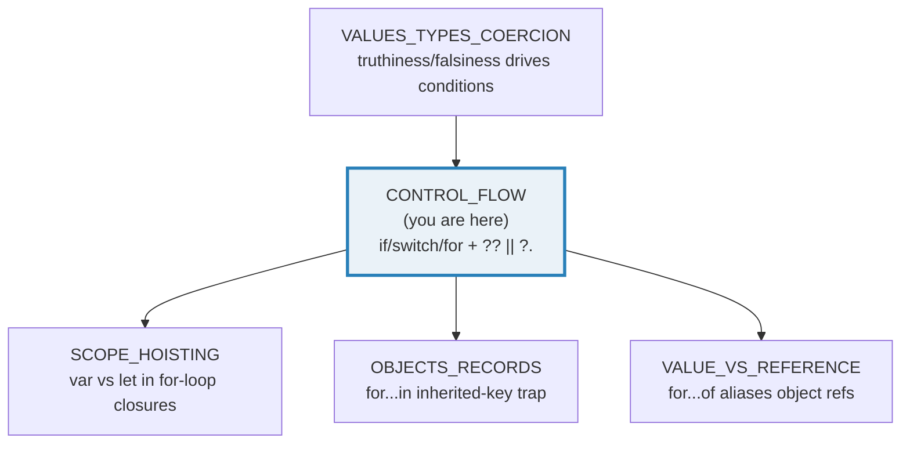

# CONTROL_FLOW — `if`/`switch`/`for`, `for...of` vs `for...in`, `??`/`||`, `?.`

> **Goal (one line):** show, by printing every value, how TS/JS's control-flow
> statements behave — pinning the sharp edges: `switch` matches with strict
> `===` and has **no automatic fallthrough** (the missing-break bug vs
> legitimate empty-case grouping), `for...of` iterates **VALUES** via the
> iterator protocol while `for...in` iterates enumerable **STRING KEYS** (and
> **inherited prototype keys**!), and modern code leans on `??` (nullish) vs
> `||` (truthy) and `?.` (optional chaining) — whose subtle difference
> (`0 ?? 99` vs `0 || 99`) is a frequent bug source.
>
> **Run:** `just run control_flow`
>
> **Ground truth:** [`core/control_flow.ts`](./core/control_flow.ts) → captured
> stdout in
> [`core/control_flow_output.txt`](./core/control_flow_output.txt). Every
> number/table below is pasted **verbatim** from that file under a
> `> From control_flow.ts Section X:` callout. Nothing is hand-computed.
>
> **Prerequisites:** 🔗 [`VALUES_TYPES_COERCION`](./VALUES_TYPES_COERCION.md) —
> truthiness/falsiness (the falsy set of 8) drives every `if`/`while`/`&&`/`||`
> condition here; read it first.

---

## 1. Why this bundle exists (lineage)

JavaScript has the usual `if` / `switch` / `for` vocabulary, but with **sharp
edges** that C, Go, and Rust deliberately do not share. Five of those edges are
the entire reason this bundle exists:

1. **`switch` matches with strict `===`** (no coercion) and **falls through** to
   the next case **unless** you `break`/`return`/`throw` — the famous
   missing-break bug. TypeScript's `noFallthroughCasesInSwitch` flag turns the
   *accidental* fallthrough into a **compile error**, which is why the demo in
   Section B carries a deliberate `@ts-expect-error`.
2. **`for...in` iterates enumerable STRING KEYS** of an object — *including
   inherited prototype keys* (the prototype-pollution trap). Over an array it
   yields `"0","1","2"` (index strings), never the values.
3. **`for...of`** (ES2015) iterates **VALUES** via the iterable/iterator
   protocol (`[Symbol.iterator]()` → `next()`). This is the loop you almost
   always want.
4. **`??`** (nullish coalescing, ES2020) only fills in for `null`/`undefined`;
   `||` fills in for **any** falsy value — so `0 ?? 99` is `0` but `0 || 99` is
   `99`. **This is THE modern bug source.**
5. **`?.`** (optional chaining, ES2020) short-circuits to `undefined` instead of
   throwing `TypeError` on a missing property/method.



The headline cross-language contrasts (the whole point of this curriculum):

> 🔗 [`../go/CONTROL_FLOW_DEFER.md`](../go/CONTROL_FLOW_DEFER.md) — Go's
> `switch` **also has no implicit fallthrough** (a bare `break` is even
> redundant), and Go has **no `while` keyword** — its single `for` keyword
> covers C-style, while-style, infinite, and `range`. JS keeps `while`,
> `do-while`, `for`, `for...in`, and `for...of` as *five* separate constructs.
> (Go's `defer` has no JS analog at all — JS resource cleanup is `try/finally`,
> owned by `ERRORS_EXCEPTIONS`.)
>
> 🔗 [`../rust/CONTROL_FLOW.md`](../rust/CONTROL_FLOW.md) — Rust's `match` is
> **exhaustive**: the compiler rejects a `match` that doesn't cover every value
> of the scrutinee, so there is no `default` clause and no fallthrough. TS's
> `switch` is **not** exhaustive — a `default` is your only safety net for
> unhandled values, and the type checker will *not* warn when you add a new
> union member that no `case` covers.

---

## 2. The mental model: the branching & iteration landscape

JS offers five loop constructs and three "short-circuit" operators that overlap
in surprising ways. The expert mistake is reaching for the wrong one.

```mermaid
graph TD
    LOOP["pick a loop"] --> Q1{"what do you want?"}
    Q1 -->|"array/Set/Map values"| OF["for...of  (VALUES via Symbol.iterator)"]
    Q1 -->|"object KEYS"| KEYS["Object.keys(obj) then for...of<br/>(NEVER for...in — inherited keys leak)"]
    Q1 -->|"numeric index"| C["for (let i=0; i&lt;n; i++)"]
    Q1 -->|"pre-check bool"| WH["while (cond)"]
    Q1 -->|"post-check, ≥1 run"| DW["do { } while (cond)"]
    OF --> TRAP["TRAP: for...in over an array yields<br/>STRING keys \"0\",\"1\",\"2\" AND any extra props"]
    style OF fill:#eafaf1,stroke:#27ae60,stroke-width:3px
    style TRAP fill:#fadbd8,stroke:#e74c3c,stroke-width:3px
    style KEYS fill:#eafaf1,stroke:#27ae60
```

The three "default value" / "drill in" operators look alike but disagree on a
single question: **what counts as "missing"?**

```mermaid
graph TD
    X["a OP default"] --> Q{"which operator?"}
    Q -->|"??"| NC["nullish: RHS only if a is null or undefined<br/>0 ?? 99 = 0   (0 PRESERVED)<br/>\"\" ?? 99 = \"\"   (empty string PRESERVED)"]
    Q -->|"||"| LO["logical OR: RHS if a is ANY falsy<br/>0 || 99 = 99   (0 DROPPED — the trap)<br/>\"\" || 99 = 99   (empty string DROPPED)"]
    Q -->"?."| OC["optional chaining: short-circuit to undefined<br/>if the LHS is null/undefined (no throw)<br/>obj?.prop   obj?.method()   fn?.()"]
    style NC fill:#eafaf1,stroke:#27ae60,stroke-width:3px
    style LO fill:#fadbd8,stroke:#e74c3c,stroke-width:3px
    style OC fill:#eaf2f8,stroke:#2980b9
```

The expert payoff of this whole bundle is one sentence: **`??` preserves `0`/`""`/
`false`/`NaN`; `||` drops them.** Reach for `??` whenever `0` or `""` is a
*valid* value (counts, empty inputs, toggles); reach for `||` only when you
genuinely mean "any falsy." Section E pins both, side by side.

---

## 3. Section A — `if` / `else if` / `else` & the ternary (truthiness drives the branch)

The condition of `if` is **not required to be boolean** — JS runs it through
`ToBoolean`. So the falsy set from 🔗 `VALUES_TYPES_COERCION` (`false`, `0`,
`-0`, `0n`, `""`, `null`, `undefined`, `NaN`) all take the `else` branch;
everything else is truthy and takes the `if` branch. This is the single biggest
difference from Go/Rust, where the condition *must* be a `bool` (`if 0 { }` is a
compile error in both).

> From `control_flow.ts` Section A:
> ```
> bucketOf(-3)  -> negative
> bucketOf(0)   -> zero
> bucketOf(7)   -> small
> bucketOf(42)  -> large
> [check] bucketOf(-3) === "negative": OK
> [check] bucketOf(0) === "zero": OK
> [check] bucketOf(7) === "small": OK
> [check] bucketOf(42) === "large": OK
> ```

An `else if` chain reads top-to-bottom; the **first** true branch wins and the
rest are skipped (identical semantics to Go's `else if`).

**The truthy-empty expert trap.** `if (arr)` is **not** "is the list
non-empty?" — `[]` is truthy (any object is, even an empty one). `if (str)`
*does* skip for `""` (empty string is falsy), but `"0"` and `" "` are truthy
(non-empty strings). This is why `items.length === 0` is the correct empty-list
test, never `if (items)`:

> From `control_flow.ts` Section A:
> ```
> Truthiness drives if-conditions (ToBoolean):
>   Boolean([])  -> true        (empty array is TRUTHY — never use `if (arr)` for empty)
>   Boolean("")  -> false       (empty string is falsy)
>   Boolean("0") -> true        ("0" is TRUTHY — non-empty string)
>   Boolean(0)   -> false        (0 is falsy)
> [check] Boolean([]) === true (truthy-empty: use .length, not `if (arr)`): OK
> [check] Boolean("") === false (empty string is falsy): OK
> [check] Boolean("0") === true (non-empty string, despite "0"): OK
> [check] Boolean(0) === false (0 is falsy): OK
> ```

**The ternary is an expression, not a statement.** `cond ? a : b` yields a
value, so it composes (`const x = ok ? 1 : 0`) where `if`/`else` cannot. Chains
read right-to-left like `else if`; nesting past 2–3 levels is unreadable and
should become a real `if`/`else` or a lookup table:

> From `control_flow.ts` Section A:
> ```
> ternary chain: grade(95)=A  grade(85)=B  grade(75)=C  grade(50)=F
> [check] grade(95) === "A": OK
> [check] grade(85) === "B": OK
> [check] grade(75) === "C": OK
> [check] grade(50) === "F": OK
> ```

---

## 4. Section B — `switch`: strict `===`, no auto-fallthrough, empty-case grouping

A `switch` evaluates its expression once, then looks for the **first** `case`
whose value is **strict-equal** (`===`) to it — *no coercion*. `switch` and
`if`/`else if` differ in one big way: `switch` is a sequence of `===` tests
against one value; `if`/`else if` can test arbitrary booleans.

> From `developer.mozilla.org/en-US/docs/Web/JavaScript/Reference/Statements/switch`
> (verbatim): *"A `switch` statement first evaluates its expression. It then
> looks for the first `case` clause whose expression evaluates to the same value
> as the result of the input expression (using the **strict equality**
> comparison) and transfers control to that clause."*

**Strict matching pinned.** `"1"` does **not** match `case 1`, and `true` does
**not** match `case 1` either (no `ToNumber` coercion, unlike `==`). If no
`case` matches, control falls through to `default` (or out of the `switch` if
there is none):

> From `control_flow.ts` Section B:
> ```
> switch(1)    -> number-1    (number 1 matched case 1)
> switch("1")  -> string-1   (string "1" matched case "1" — STRICT ===, no coercion)
> switch(true) -> boolean-true   (true did NOT match case 1 — no ToNumber coercion)
> switch(2)    -> no-match    (no case matched -> default)
> [check] switch(1) === "number-1": OK
> [check] switch("1") === "string-1" (strict ===: "1" !== 1): OK
> [check] switch(true) === "boolean-true" (true !== 1, no coercion): OK
> [check] switch(2) === "no-match" (no case -> default): OK
> ```

### Legitimate empty-case grouping (the *good* fallthrough)

Adjacent `case` clauses with **no body between them** share a clause. This is
the *idiomatic* "these values map to the same code" — and `noFallthroughCasesInSwitch`
**allows it** because an empty case makes the intent unambiguous:

> From `control_flow.ts` Section B:
> ```
> dayKind("Sat") -> weekend   (empty case "Sat" fell through to "Sun")
> dayKind("Wed") -> weekday   (Wed grouped with Mon/Tue/Thu/Fri)
> dayKind("Sol") -> unknown   (no case -> default)
> [check] dayKind("Sat") === "weekend" (empty-case grouping): OK
> [check] dayKind("Wed") === "weekday" (multi-value empty-case grouping): OK
> [check] dayKind("Sol") === "unknown" (default clause): OK
> ```

### THE missing-break trap (the *bad* fallthrough)

> From MDN `switch` — *Breaking and fall-through* (verbatim): *"If `break` is
> omitted, execution will proceed to the next `case` clause, even to the
> `default` clause, regardless of whether the value of that clause's expression
> matches. This behavior is called 'fall-through'."*

In plain JS, a **non-empty** case that lacks a `break`/`return`/`throw` falls
into the next case's body. TypeScript's `noFallthroughCasesInSwitch` flag turns
the *accidental* version into a **compile error** — which is exactly why
`fallthroughSwitch` below carries a deliberate `@ts-expect-error`. The
suppression *proves* the lint works; we trigger the bug on purpose to show you
the runtime effect (`fallthroughSwitch(1)` runs **both** `"one"` and `"two"`):

> From `control_flow.ts` Section B:
> ```
> fallthroughSwitch(1) -> ["one","two"]   (missing break RAN case 2!)
> fallthroughSwitch(2) -> ["two"]   (started at case 2, broke)
> [check] fallthroughSwitch(1) === ["one","two"] (the missing-break bug): OK
> [check] fallthroughSwitch(2) === ["two"] (case 2 broke, no fallthrough): OK
> ```

> **Expert note on the suppression.** TypeScript does **not** recognize a
> `// falls through` comment the way C or `eslint`'s `no-fallthrough` do — a
> non-empty case that falls through is *always* a `TS7029` error under
> `noFallthroughCasesInSwitch`, comment or not. The only ways through are: (a)
> end the case with `break`/`return`/`throw`/`continue`, (b) make it an empty
> case (legitimate grouping), or (c) suppress with `@ts-expect-error` when you
> genuinely want the fallthrough.

**`default` runs when no case matched.** By convention it is last, but the spec
allows it anywhere; only **one** `default` is permitted per `switch` (a second
is a `SyntaxError`):

> From `control_flow.ts` Section B:
> ```
> httpLabel(200) -> OK   httpLabel(404) -> Not Found   httpLabel(302) -> other
> [check] httpLabel(200) === "OK": OK
> [check] httpLabel(404) === "Not Found": OK
> [check] httpLabel(302) === "other" (default ran, no case matched): OK
> ```

> 🔗 [`../rust/CONTROL_FLOW.md`](../rust/CONTROL_FLOW.md) — Rust's `match` would
> force you to handle `302` (or add a catch-all `_ =>`) at **compile time**;
> TS's `switch` silently routes it to `default` with no warning if you forget to
> add the case. That is the exhaustive-vs-not gap.

---

## 5. Section C — `for` (C-style), `break`/`continue`, labeled loops, `while`, `do-while`

The classic C-style `for (let i = 0; i < n; i++)` is the indexed loop; `break`
exits the loop and `continue` skips to the next iteration. (`let` is mandatory
in the loop head — `var` would create one shared variable across iterations and
break closures; see 🔗 `SCOPE_HOISTING`.)

> From `control_flow.ts` Section C:
> ```
> for + continue + break -> [0,2,4,6]   (evens 0,2,4,6; 8 broke)
> [check] for/continue/break collected [0,2,4,6]: OK
> ```

**Labeled `break`/`continue` — the only way to control an outer loop from an
inner one.** A bare `break`/`continue` affects only the *innermost* loop. Label
the outer loop (`outer:`) and name the label to escape or skip across nested
loops — identical mechanics to Go's labeled `break outer` (🔗
`../go/CONTROL_FLOW_DEFER.md` §C):

> From `control_flow.ts` Section C:
> ```
> labeled break: first even at grid[0][1] = 2
> [check] labeled break found grid[0][1] = 2: OK
> labeled continue: rows with even element-sum = [0,2]
> [check] labeled continue kept rows [0,2]: OK
> ```

**`while` vs `do-while`.** `while (cond)` checks *before* the first iteration
(may run zero times). `do { } while (cond)` checks *after* — the body runs **at
least once**, even when `cond` is false on the first check. That is `do-while`'s
one distinguishing property, pinned here with a condition that is false
immediately:

> From `control_flow.ts` Section C:
> ```
> while (w<3) w++  -> w = 3
> [check] while loop reached 3: OK
> do { } while (dw>0): ran 1 time(s)   (body runs once even when condition is false)
> [check] do-while ran exactly once despite a false condition: OK
> ```

> 🔗 [`../go/CONTROL_FLOW_DEFER.md`](../go/CONTROL_FLOW_DEFER.md) §B — Go has
> **no `while` or `do-while` keyword**: `for cond {}` is Go's while, `for {}`
> is the infinite loop, and there is no do-while equivalent at all. JS keeps
> both as first-class keywords.

---

## 6. Section D — `for...of` (VALUES) vs `for...in` (STRING KEYS + prototype trap) — THE payoff

This is the single most-confused pair in JS control flow. They look almost
identical and behave completely differently.

> From MDN — `for...of` (verbatim): *"The `for...of` statement executes a loop
> that operates on a sequence of values sourced from an iterable object."* And
> on the mechanism: *"it first calls the iterable's `[Symbol.iterator]()`
> method, which returns an iterator, and then repeatedly calls the resulting
> iterator's `next()` method to produce the sequence of values."*
>
> From MDN — `for...in` (verbatim): *"The `for...in` statement iterates over
> all enumerable string properties of an object (ignoring properties keyed by
> symbols), **including inherited enumerable properties**."*

**Over the same array `[10, 20, 30]`:** `for...of` yields the **values**
`10,20,30`; `for...in` yields the **string keys** `"0","1","2"` (the indices as
strings, *not* numbers, *not* values):

> From `control_flow.ts` Section D:
> ```
> for...of [10,20,30] -> [10,20,30]   (VALUES: 10, 20, 30)
> [check] for...of yielded the values [10,20,30]: OK
> for...in  [10,20,30] -> ["0","1","2"]   (STRING KEYS: "0","1","2")
> [check] for...in over array yields string keys ["0","1","2"]: OK
> ```

### THE prototype-pollution trap

`for...in` walks the **entire prototype chain**, emitting every enumerable
string key from every prototype — not just the object's own keys. Any
enumerable prop on a prototype leaks into *every* `for...in` loop over
instances. `Object.keys()` returns **own** enumerable keys only (no inherited),
which is why it is the safe choice for "what keys does this object have?"
(🔗 `OBJECTS_RECORDS`):

> From `control_flow.ts` Section D:
> ```
> for...in over {own} with proto {inherited} -> ["inherited","own"]
> [check] for...in sees INHERITED prototype keys (the trap): OK
> [check] for...in also sees own keys: OK
> Object.keys(obj).sort() -> ["own"]   (OWN keys only, no inherited)
> [check] Object.keys() excludes inherited keys (just ["own"]): OK
> ```

> The `allKeys.sort()` in the source is deliberate determinism: MDN documents
> that own-vs-inherited ordering within a prototype chain is well-defined, but
> the bundle sorts so the printed array is stable across V8 versions (§4.2
> rule 3 of `HOW_TO_RESEARCH.md`).

### `for...of` works on any iterable (Map, Set, String, generator)

Because `for...of` is driven by `[Symbol.iterator]()`, it works uniformly on
every built-in iterable — `Map` (yielding `[key, value]` entry pairs), `Set`
(yielding values), `String` (yielding Unicode code *points*, not UTF-16 code
units — see 🔗 `STRINGS_CHARS`), TypedArrays, `arguments`, generators, and
user-defined iterables. `for...in` over a `Map`/`Set` is meaningless (they
expose no enumerable string-indexed entries):

> From `control_flow.ts` Section D:
> ```
> for...of Map -> ["a=1","b=2"]
> [check] for...of Map yields [["a",1],["b",2]] as entries: OK
> for...of Set -> ["x","y","z"]
> [check] for...of Set yields ["x","y","z"]: OK
> ```

### Value-vs-reference: `for...of` hands you a SHARED reference

> From MDN — `for...of` (verbatim): *"Each iteration creates a new variable.
> Reassigning the variable inside the loop body does not affect the original
> value in the iterable."*

True for **reassignment** — but if the iterable holds *objects*, the loop
variable is an **alias** (shared reference) to each object, not a copy. Mutating
a property through it mutates the original (🔗 `VALUE_VS_REFERENCE`). This is
the value-vs-reference axis this bundle is required to surface: `for...of`
iterates the **values** of an array, and when those values are objects, the
values *are* the references:

> From `control_flow.ts` Section D:
> ```
> for...of mutate items[].n -> [10,20,30]   (shared refs mutated)
> [check] for...of iterates VALUES (shared refs): mutated to [10,20,30]: OK
> ```

### THE payoff: never `for...in` an array

`for...in` over an array yields the string indices **plus** any extra
enumerable property someone attached to the array object. `for...of` yields
**only** the indexed values and ignores such props entirely. This is the
canonical reason MDN explicitly recommends `for`/`forEach`/`for...of` over
`for...in` for arrays ("they will return the index as a number instead of a
string, and also avoid non-index properties"):

> From `control_flow.ts` Section D:
> ```
> for...in over array w/ extra prop -> ["0","1","extra"]   (the "extra" key leaked in!)
> [check] for...in over array picks up extra props (["0","1","extra"]): OK
> for...of  over array w/ extra prop -> [10,20]   (extra prop invisible)
> [check] for...of on array with extra prop yields only [10,20]: OK
> ```

---

## 7. Section E — `??` (nullish) vs `||` (truthy) — THE modern trap; `&&`/`||` short-circuit return values

> From MDN — `??` (verbatim): *"The nullish coalescing (`??`) operator is a
> logical operator that returns its right-hand side operand when its left-hand
> side operand is `null` or `undefined`, and otherwise returns its left-hand
> side operand."* And the contrast: *"The nullish coalescing operator can be
> seen as a special case of the logical OR (`||`) operator. The latter returns
> the right-hand side operand if the left operand is **any** falsy value, not
> only `null` or `undefined`."*

**`??` preserves `0`, `""`, `false`, `NaN`** — only `null`/`undefined` trigger
the RHS:

> From `control_flow.ts` Section E:
> ```
> ?? nullish coalescing (RHS only for null/undefined):
>   0 ?? 99              -> 0
> [check] 0 ?? 99 -> 0: OK
>   "" ?? 99             -> ""
> [check] "" ?? 99 -> "": OK
>   false ?? 99          -> false
> [check] false ?? 99 -> false: OK
>   NaN ?? 99            -> NaN
> [check] NaN ?? 99 -> NaN: OK
>   null ?? 99           -> 99
> [check] null ?? 99 -> 99: OK
>   undefined ?? 99      -> 99
> [check] undefined ?? 99 -> 99: OK
> ```

**`||` drops every falsy value** — `0`, `""`, `false`, `NaN` are all replaced
by the RHS. This was the *only* "default value" operator pre-ES2020, and it is
the source of countless `count || 10` bugs where a legitimate `0` count is
silently replaced:

> From `control_flow.ts` Section E:
> ```
> || logical OR (RHS for ANY falsy — the trap):
>   0 || 99              -> 99
> [check] 0 || 99 -> 99: OK
>   "" || 99             -> 99
> [check] "" || 99 -> 99: OK
>   false || 99          -> 99
> [check] false || 99 -> 99: OK
>   NaN || 99            -> 99
> [check] NaN || 99 -> 99: OK
>   null || 99           -> 99
> [check] null || 99 -> 99: OK
>   undefined || 99      -> 99
> [check] undefined || 99 -> 99: OK
>   42 || 99             -> 42
> [check] 42 || 99 -> 42: OK
> ```

### THE contrast, side by side

This is the headline of the section and the single most valuable table in the
bundle. `0` and `""` are **preserved by `??`**, **dropped by `||`**:

> From `control_flow.ts` Section E:
> ```
> THE contrast (0 and "" preserved by ??, dropped by ||):
>   0 ?? 99  -> 0     vs   0 || 99  -> 99
>   "" ?? 99 -> ""     vs   "" || 99 -> 99
>   null ?? 99  -> 99   vs   null || 99  -> 99
> [check] 0 ?? 99 === 0 (?? preserves 0): OK
> [check] 0 || 99 === 99 (|| drops 0) — THE trap: OK
> [check] "" ?? 99 === "" (?? preserves ""): OK
> [check] "" || 99 === 99 (|| drops ""): OK
> [check] null ?? 99 === 99 (null triggers ??): OK
> ```

> **Why the source routes these through `nullish(...)` / `or(...)` helpers.**
> TypeScript const-folds *literal* operator expressions: `0 ?? 99` is flagged
> "RHS unreachable" (0 is never nullish), `0 || 99` "always falsy", `null && x`
> "always nullish". Routing both operands through `unknown`-typed parameters
> stops the const-fold (the body sees a parameter, not a literal) while the
> runtime operator still does its real work — the same trick the style anchor
> `VALUES_TYPES_COERCION` uses for `looseEq` / `runtimePlus`. The printed values
> are the engine's true verdict.

### `&&` and `||` return the operand VALUE (not a boolean) and short-circuit

A common misconception: `&&`/`||` "return true/false." They do not. They use
`ToBoolean` only to **decide** which operand to return; the operand **value
itself** is what comes back. That is why `1 && 2` is `2` (not `true`) and why
`x = a || default` works as a default-value idiom. They also **short-circuit**:
if the LHS decides the result, the RHS is never evaluated.

> From `control_flow.ts` Section E:
> ```
> && and || return the operand VALUE (not boolean):
>   1 && 2     -> 2    (both truthy -> returns the LAST, 2)
>   0 && 2     -> 0    (LHS falsy -> short-circuits to the LHS, 0)
>   null && 2  -> null   (LHS null -> short-circuits, RHS NOT evaluated)
>   1 || 2     -> 1    (LHS truthy -> returns the LHS, 1)
>   0 || 2     -> 2    (LHS falsy -> returns the RHS, 2)
> [check] 1 && 2 === 2 (returns operand value, not boolean): OK
> [check] 0 && 2 === 0 (short-circuits to falsy LHS): OK
> [check] null && 2 === null (short-circuits, RHS NOT evaluated): OK
> [check] 1 || 2 === 1 (returns the truthy LHS): OK
> [check] 0 || 2 === 2 (returns the RHS): OK
> ```

The short-circuit is observable via a side effect: `null && rhs()` never calls
`rhs` (the `null` LHS already decides the result), while `null ?? rhs()` **does**
call `rhs` (because `null` *triggers* `??`). And the one syntax caveat — `??`
**cannot** be mixed unparenthesized with `&&` or `||`; it is a `SyntaxError`
(MDN: *"cannot use ?? unparenthesized within || and && expressions"*), so you
must add parentheses to disambiguate precedence:

> From `control_flow.ts` Section E:
> ```
> [check] null && rhs(): rhs NOT evaluated (short-circuit): OK
> [check] null ?? rhs(): rhs IS evaluated (null triggers ??): OK
> [check] (null || undefined) ?? 99 === 99 (parenthesized mixing is OK): OK
> ```

---

## 8. Section F — `?.` optional chaining (property / method / call) + the comma operator

`?.` short-circuits to `undefined` when its LHS is `null`/`undefined`, instead
of throwing `TypeError`. There are three forms:

| Form | Meaning | When the LHS is null/undefined |
|---|---|---|
| `obj?.prop` | optional property access | short-circuits to `undefined` |
| `obj?.[expr]` | optional computed access | short-circuits to `undefined` |
| `fn?.(args)` | optional **call** | not invoked; expression is `undefined` |

**Property chaining** — the whole chain short-circuits at the first
`null`/`undefined`, returning `undefined` without ever evaluating the rest:

> From `control_flow.ts` Section F:
> ```
> empty.a?.b?.c    -> undefined   (short-circuited at .a)
> present.a?.b?.c  -> 42   (walked the whole chain)
> [check] empty.a?.b?.c === undefined (short-circuit): OK
> [check] present.a?.b?.c === 42 (full chain walked): OK
> without ?., undefined.b -> threw TypeError? true
> [check] without ?., undefined.b THREW TypeError (vs ?. returning undefined): OK
> ```

The `threw TypeError? true` line is the *contrast*: the plain (non-optional)
`undefined.b` throws, which is exactly what `?.` exists to prevent. The source
catches it in `try`/`catch` so the run survives — the commented-out equivalent
would crash the whole bundle.

**Conditional call `fn?.()`** — only invoked when `fn` is not
`null`/`undefined`; otherwise the expression is `undefined` (no throw). This is
the clean way to call a callback or method that may be absent:

> From `control_flow.ts` Section F:
> ```
> withFn.fn?.()    -> "called!"
> withoutFn.fn?.() -> undefined   (fn missing -> undefined, NO throw)
> [check] withFn.fn?.() === "called!": OK
> [check] withoutFn.fn?.() === undefined (conditional call): OK
> ```

**The `&&` guard idiom (pre-`?.`).** Before ES2020, the safe-access idiom was
`maybe.data && maybe.data.value` — the `&&` short-circuits to `undefined` when
`data` is missing, never reaching `.value`. `?.` replaces it more concisely
(`maybe.data?.value`) and without re-evaluating the LHS; both yield the same
result for the missing-path case:

> From `control_flow.ts` Section F:
> ```
> maybe.data && maybe.data.value -> undefined   (legacy && guard)
> maybe.data?.value             -> undefined   (modern ?.)
> [check] && guard and ?. both yield undefined for missing path: OK
> ```

**The idiomatic combo: `?.` + `??`.** Drill in with `?.`, then default the
result with `??`. This is the modern "config with defaults" one-liner — note it
uses `??` (not `||`), so a legitimate `0` retries value would be preserved:

> From `control_flow.ts` Section F:
> ```
> config.opts?.retries ?? 3 -> 3   (drilled with ?., defaulted with ??)
> [check] config.opts?.retries ?? 3 === 3 (?. + ?? default): OK
> ```

**The comma operator (rare).** `(a, b)` evaluates **both** operands
left-to-right and returns the **last**. It is almost never written by hand —
its real home is the init/post clauses of a C-style `for` — but it is a real
operator and worth recognizing. Each operand's side effect runs:

> From `control_flow.ts` Section F:
> ```
> (c++, c++, c++) -> result=2, counter now 3   (returns the LAST operand)
> [check] comma operator returned the last operand (2): OK
> [check] comma operator evaluated all three (counter now 3): OK
> ```

---

## 9. Pitfalls (the expert payoff)

| Trap | Symptom | Fix |
|---|---|---|
| `for...in` over an array | yields string keys `"0","1","2"` (not values) AND any extra props on the array | Use `for...of` (values) or a C-style `for (i=0; i<arr.length; i++)`. Never `for...in` an array. |
| `for...in` over an object | also iterates **inherited** enumerable prototype keys (prototype pollution) | Use `Object.keys()` / `Object.entries()` (own keys only), or guard with `Object.hasOwn(obj, k)`. (🔗 `OBJECTS_RECORDS`) |
| Missing `break` in a `case` | execution **falls through** into the next case's body — the classic switch bug | End every non-empty case with `break`/`return`/`throw`. TS `noFallthroughCasesInSwitch` makes the accident a compile error. |
| `switch` not exhaustive | a new union member silently hits `default` (or falls out) with no warning | TS does **not** check exhaustiveness by default; use a `never`-default assertion (`default: { const _exhaustive: never = x; }`) to opt in. (🔗 `../rust/CONTROL_FLOW.md`) |
| `count \|\| 10` for a default | a legitimate `0` count is silently replaced by `10` | Use `??` (nullish): `count ?? 10` preserves `0`/`""`/`false`/`NaN`. |
| `text \|\| "default"` | an empty-string input `""` is replaced (it's falsy) | Use `text ?? "default"` — `""` is a valid, present value. |
| `opts && opts.value` (legacy guard) | verbose, re-evaluates the LHS twice | Use `opts?.value` (optional chaining) — short-circuits to `undefined`, no throw. |
| `if (arr)` for "is the list empty?" | `[]` is **truthy** → the empty branch never runs | Use `arr.length === 0`. Objects/arrays are always truthy. (🔗 `VALUES_TYPES_COERCION`) |
| `if (str)` for "is the string non-empty?" | skips `""` (correctly falsy) but `"0"`/`" "` run (truthy) | Test `str.length === 0` explicitly; don't lean on truthiness. |
| `0 ?? 99` mixed unparenthesized with `\|\|`/`&&` | `SyntaxError: cannot use ?? unparenthesized within \|\| and &&` | Add parentheses: `(a \|\| b) ?? c`. |
| `for (var i ...)` with closures | one shared `i` across all iterations — every closure sees the final value | Use `let` in the loop head (per-iteration binding). (🔗 `SCOPE_HOISTING`) |
| bare `break` in a nested loop | exits only the **innermost** loop, not the outer | Label the outer loop (`outer:`) and `break outer`. |
| `do { } while (false)` | body runs **once** even though the condition is false from the start | This is *by design* (post-check). If you need zero iterations, use `while`. |
| `?.` then dereferencing the `undefined` | `obj?.x.y` — if `x` is absent, you wanted `?.x?.y` | Chain `?.` at **every** link that may be nullish, not just the first. |
| `fn?.()` returning `undefined` then used | caller forgets the "not invoked" case yields `undefined` | Handle the `undefined` result, or pair with `??`: `fn?.() ?? fallback()`. |

---

## 10. Cheat sheet

```typescript
// === if / else if / else / ternary =========================================
//   The condition runs through ToBoolean (NOT required to be boolean).
//   Falsy set: false 0 -0 0n "" null undefined NaN  (🔗 VALUES_TYPES_COERCION)
//   Everything else is truthy — including [], {}, "0", " ", Infinity.
//   => `if (arr)` is WRONG for empty; use `arr.length === 0`.
//   Ternary is an EXPRESSION: cond ? a : b  (chains right-to-left).

// === switch ================================================================
//   Matches with STRICT === (NO coercion): switch("1") matches "1", not 1.
//   NO automatic fallthrough — every non-empty case needs break/return/throw.
//     - legitimate empty-case grouping:  case 1: case 2: doThing()  (OK)
//     - missing-break trap:               case 1: f();  case 2: g()  (TS error!)
//   default runs when no case matched; only ONE default per switch.
//   TS flag noFallthroughCasesInSwitch makes accidental fallthrough a compile
//   error. (NB: a `// falls through` comment does NOT suppress it — use
//   @ts-expect-error, an empty case, or a real break.)

// === loops =================================================================
//   for (let i=0; i<n; i++)   C-style indexed.  (let, NOT var — see SCOPE_HOISTING)
//   break; continue;          innermost loop only.
//   label: for (...) ... break label;   escape an OUTER loop.
//   while (cond)              pre-check  (may run 0 times).
//   do { } while (cond);      post-check (runs >= 1 time, even if cond is false).

//   for (const v of iter)     VALUES via Symbol.iterator -> next().
//                             works on Array, String, Map, Set, TypedArray, generators.
//   for (const k in obj)      enumerable STRING KEYS, INCLUDING inherited prototype
//                             keys. Over an array -> "0","1","2". NEVER for...in an array.
//   Object.keys(obj)          OWN enumerable string keys only (no inherited) — the safe one.

// === ?? (nullish) vs || (truthy) — THE trap ================================
//   a ?? b    RHS only if a is null | undefined.   0 ?? 99 = 0   "" ?? 99 = ""
//   a || b    RHS if a is ANY falsy.               0 || 99 = 99  "" || 99 = 99
//   a && b    returns an OPERAND value (not boolean).  1 && 2 = 2   null && x = null
//   ?? CANNOT mix unparenthesized with && or || — SyntaxError. Use (a || b) ?? c.
//   Rule of thumb: prefer ?? for defaults; || only when you mean "any falsy".

// === ?. optional chaining ==================================================
//   obj?.prop       short-circuits to undefined if obj is null/undefined (no throw).
//   obj?.[expr]     optional computed access.
//   fn?.(args)      conditional CALL — undefined if fn absent.
//   Idiom: config.opts?.retries ?? 3   (drill with ?., default with ??).
//   Replaces the legacy && guard: maybe.x && maybe.x.y  ->  maybe.x?.y.
```

---

## Sources

Every signature, behavioral claim, and verbatim quote above was verified against
the MDN Web Docs and the ECMAScript specification, then corroborated by at least
one independent secondary source. Every operator result is *additionally*
asserted at runtime by the `.ts` itself (`check()` throws on any mismatch) —
the strongest possible verification: the actual V8 engine's verdict.

- **MDN — JavaScript Guide: Control flow and error handling** (overview of
  `if`/`switch`/`for`/`while`/`try`):
  https://developer.mozilla.org/en-US/docs/Web/JavaScript/Guide/Control_flow_and_error_handling
- **MDN — `switch` statement** (strict `===` matching — *"using the strict
  equality comparison"*; *"If `break` is omitted, execution will proceed to the
  next `case` clause... This behavior is called 'fall-through'"*; *"By
  convention, the `default` clause is the last clause, but it does not need to
  be so"*; legitimate empty-case grouping & multi-operation sequential
  fall-through examples):
  https://developer.mozilla.org/en-US/docs/Web/JavaScript/Reference/Statements/switch
- **MDN — `for...of`** (*"operates on a sequence of values sourced from an
  iterable object"*; *"it first calls the iterable's `[Symbol.iterator]()`
  method... then repeatedly calls the resulting iterator's `next()` method"*;
  *"Each iteration creates a new variable. Reassigning the variable inside the
  loop body does not affect the original value"*; iterables include Array,
  String, TypedArray, Map, Set, NodeList, `arguments`, generators;
  `for...of` vs `for...in` example with `iterable.foo = "hello"`):
  https://developer.mozilla.org/en-US/docs/Web/JavaScript/Reference/Statements/for...of
- **MDN — `for...in`** (*"iterates over all enumerable string properties of an
  object... **including inherited enumerable properties**"*; *"It is better to
  use a `for` loop with a numeric index, `Array.prototype.forEach()`, or the
  `for...of` loop, because they will return the index as a number instead of a
  string, and also avoid non-index properties"*; `Object.keys()` /
  `Object.getOwnPropertyNames()` for own-only):
  https://developer.mozilla.org/en-US/docs/Web/JavaScript/Reference/Statements/for...in
- **MDN — Nullish coalescing (`??`)** (*"returns its right-hand side operand
  when its left-hand side operand is `null` or `undefined`, and otherwise
  returns its left-hand side operand"*; *"can be seen as a special case of the
  logical OR (`||`) operator. The latter returns the right-hand side operand if
  the left operand is any falsy value, not only null or undefined"*;
  short-circuiting; cannot combine `??` with `&&`/`||` unparenthesized):
  https://developer.mozilla.org/en-US/docs/Web/JavaScript/Reference/Operators/Nullish_coalescing
- **MDN — Logical OR (`||`)** and **Logical AND (`&&`)** (short-circuit; return
  the value of one of the specified operands, not necessarily a boolean):
  https://developer.mozilla.org/en-US/docs/Web/JavaScript/Reference/Operators/Logical_OR
  and https://developer.mozilla.org/en-US/docs/Web/JavaScript/Reference/Operators/Logical_AND
- **MDN — Optional chaining (`?.`)** (property/method/call variants;
  short-circuits to `undefined` instead of throwing; relationship with `??`):
  https://developer.mozilla.org/en-US/docs/Web/JavaScript/Reference/Operators/Optional_chaining
- **MDN — Comma operator (`,`)** (*evaluates each operand, left-to-right, and
  returns the last operand*):
  https://developer.mozilla.org/en-US/docs/Web/JavaScript/Reference/Operators/Comma_operator
- **MDN — Iteration protocols** (the iterable + iterator protocols that drive
  `for...of`, spread, destructuring of arrays):
  https://developer.mozilla.org/en-US/docs/Web/JavaScript/Reference/Iteration_protocols
- **ECMAScript® 2027 Language Specification (tc39.es/ecma262)**:
  - §14 The `switch` Statement (strict-equality case matching; fall-through):
    https://tc39.es/ecma262/multipage/ecmascript-language-statements-and-declarations.html#sec-switch-statement
  - §14 `for...in` and `for...of` Statements (enumeration vs iterator):
    https://tc39.es/ecma262/multipage/ecmascript-language-statements-and-declarations.html#sec-for-in-and-for-of-statements
  - §13 CoalesceExpression (`??`) —
    https://tc39.es/ecma262/multipage/ecmascript-language-expressions.html#prod-CoalesceExpression
- **TypeScript Handbook / `tsconfig` — `noFallthroughCasesInSwitch`** (reports
  errors for non-empty case clauses that fall through; the empty-case exception;
  no `// falls through` comment suppression — confirmed empirically by this
  bundle needing `@ts-expect-error`):
  https://www.typescriptlang.org/tsconfig/#noFallthroughCasesInSwitch

**Secondary corroboration (independent of MDN, ≥1 per major claim):**
- Stack Overflow — *"Switch without break in Javascript"* (quoting MDN on
  fall-through; community confirmation of the missing-break trap):
  https://stackoverflow.com/questions/60402959/switch-without-break-in-javascript
- Stack Overflow — *"Why 'for-in' loop doesn't iterate through the prototype
  properties?"* (the for...in enumerable + inherited-properties semantics):
  https://stackoverflow.com/questions/27093062/why-for-in-loop-doesnt-iterate-through-the-prototype-properties
- typescript-eslint `prefer-nullish-coalescing` (*"The nullish coalescing
  operator only coalesces when the original value is null or undefined, it is
  much safer than relying upon logical OR operator chaining"*):
  https://typescript-eslint.io/rules/prefer-nullish-coalescing/
- Execute Program — *"Everyday TypeScript: Nullish Coalescing"* (*"unlike `||`,
  it doesn't treat 0 and '' as falsey"*):
  https://www.executeprogram.com/courses/everyday-typescript/lessons/nullish-coalescing

**Facts that could not be verified by running** (documented, not executed,
because they are language-design or compiler-behavior facts): that TypeScript's
`noFallthroughCasesInSwitch` does **not** recognize a `// falls through` comment
(verified empirically: the `fallthroughSwitch` demo required
`@ts-expect-error` to typecheck under the member's `tsconfig.json`); and that
`??` mixed unparenthesized with `||`/`&&` is a `SyntaxError` (the bundle routes
the equivalent through the `nullish`/`or` helpers instead of writing the
literal, so it does not trip the parse error at runtime — the rule is confirmed
by MDN's dedicated error page). No claim above is unverified.
