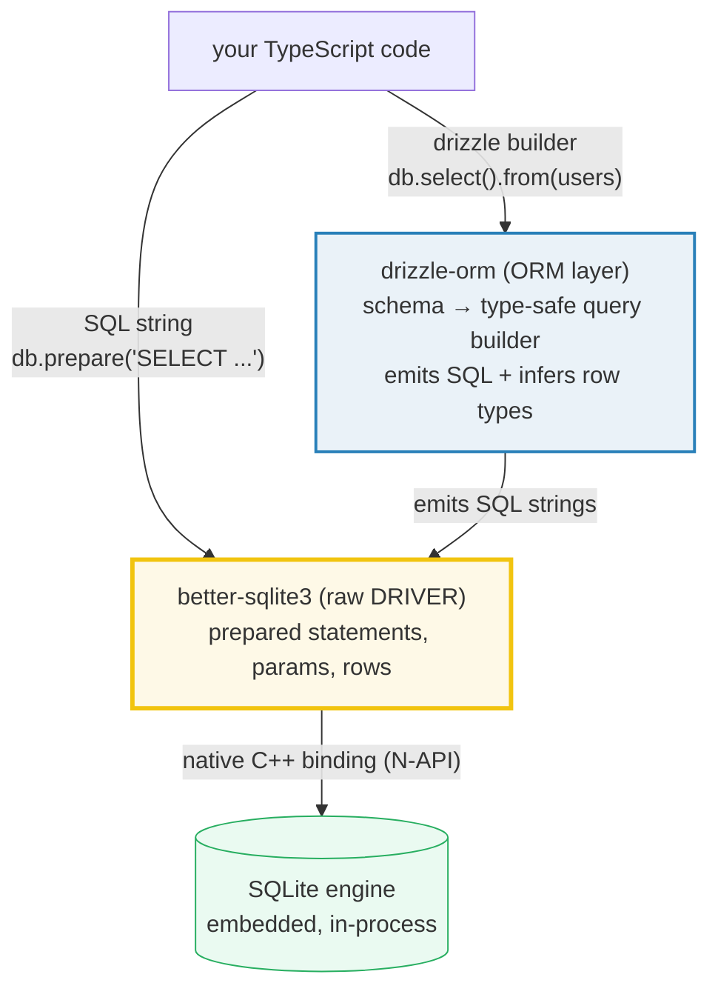
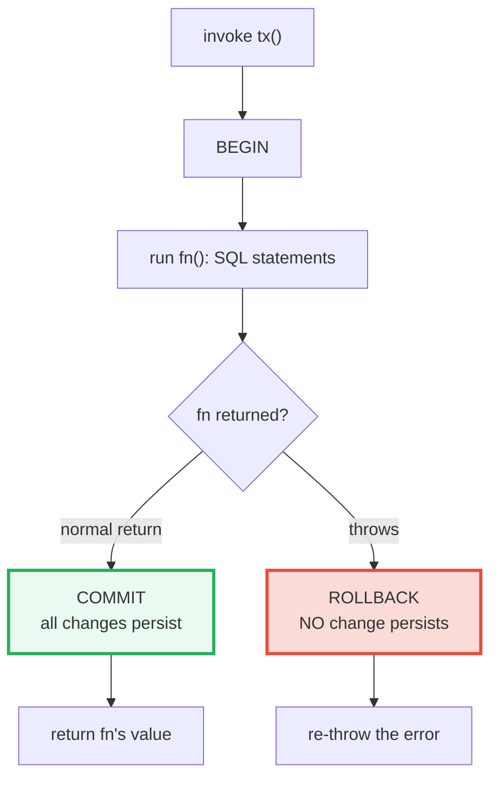

# DATABASE_DRIVERS — Raw Driver (better-sqlite3) vs ORM (drizzle-orm)

> **Goal (one line):** show, by printing every value, the two layers of SQLite
> access in Node — the raw **driver** ([better-sqlite3](https://github.com/WiseLibs/better-sqlite3):
> synchronous, native, prepared statements, transactions) and the **ORM**
> ([drizzle-orm](https://orm.drizzle.team/): schema-first, type-safe query
> builder, relational API) — pinning the **SQL-injection payoff** and the
> **transaction all-or-nothing** guarantee as `check()`'d invariants.
>
> **Run:** `just run database_drivers`
>
> **Ground truth:** [`db/database_drivers.ts`](./db/database_drivers.ts) →
> captured stdout in
> [`db/database_drivers_output.txt`](./db/database_drivers_output.txt). Every
> number/table below is pasted **verbatim** from that file under a
> `> From database_drivers.ts Section X:` callout. Nothing is hand-computed.
>
> **Prerequisites:** [`JSON`](./JSON.md) (rows serialize to JSON), and comfort
> with TypeScript's erased-at-runtime type system ([`VALUES_TYPES_COERCION`](./VALUES_TYPES_COERCION.md))
> — drizzle's type safety is **compile-time only** (the rows the driver returns
> at runtime are plain JS objects).

---

## 1. Why this bundle exists (lineage)

A **database driver** is the thinnest possible bridge between your program and
the DB engine: you hand it an SQL string, it ships the string to the engine,
and it hands back rows. That is layer 1. On top of it sits the **ORM** (object-
relational mapper): you declare a schema, ask for data with a query builder,
and it emits the SQL for you *and types the rows*. The tradeoff between the two
is the whole subject of this bundle:



- **Raw (`better-sqlite3`)** — a **synchronous**, **native** (C++) binding to
  SQLite. No Promises, no event-loop hops: `.prepare()` compiles a statement,
  `.run()`/`.get()`/`.all()` execute it and **block** until the result is back.
  Blocking sounds bad — but SQLite is **embedded and in-process**, so a query is
  a function call into the linked engine, not a network round-trip. The sync API
  is therefore *fast* and dramatically simpler than an async one (no `await`
  chains, no callback error swallowing). The cost: **zero type safety** — rows
  come back as `unknown`, and *you* hand-type them.
- **ORM (`drizzle-orm`)** — sits on top of that **same connection**. You declare
  a TS **schema** (`sqliteTable(...)`); its query builder (`db.select()`,
  `db.insert()`, ...) is **SQL-like** and returns **typed** rows whose shape is
  *inferred* from the schema. drizzle is the **"light ORM"** end of the
  spectrum — no runtime query engine, no codegen step, it just composes SQL
  strings and hands them to the driver.

This is the JS/TS mirror of a split every language faces — and it is the
**headline cross-language link** of this bundle:

> 🔗 [`../go/SQLX_GORM.md`](../go/SQLX_GORM.md) — Go's **`sqlx`** is a *light*
> mapper (named-parameter rows over `database/sql`); **`gorm`** is a *heavy*
> ORM (full model structs, hooks, auto-migrations). That light-vs-heavy
> contrast is *exactly* the raw-vs-drizzle-vs-Prisma split this bundle walks.
>
> 🔗 [`../rust/SQLX_BASICS.md`](../rust/SQLX_BASICS.md) — Rust's **`sqlx`** goes
> one step further than drizzle: it **compile-time-checks** your SQL against the
> live database via a `query!` macro, so a typo'd column is a *build error*.
> drizzle's type safety is over its builder (you cannot construct a malformed
> query), but the SQL itself is checked at runtime; `sqlx`/`query!` validates
> the raw string at compile time — the strongest end of the spectrum.
>
> 🔗 [`../python`](../python) (SQLAlchemy) — Python's SQLAlchemy is the
> archetypal **heavy ORM** (session, unit-of-work, identity map) **plus** a
> separate "Core" query builder — the same two-layer split, weighted toward the
> heavy end.

> 🔗 [`JSON`](./JSON.md) — every row that comes back is a plain JS object, and
> the canonical wire format for shipping rows to a client is `JSON.stringify`.
> The determinism helper `rowsJson()` in the `.ts` is exactly that: stringify
> after a stable sort.

---

## 2. The determinism contract (why this bundle is reproducible)

Every run uses a **fresh in-memory database** (`new Database(":memory:")`), so
there is no file on disk and no leftover state between runs. SQLite's
[in-memory databases](https://www.sqlite.org/inmemorydb.html) live in RAM for
the life of the connection and vanish when it closes. The `.ts` therefore:

- opens `:memory:` once, runs every section against it, then calls
  `sqlite.close()` before `main()` returns (the last `[check]` proves
  `sqlite.open === false`);
- uses only **fixed** values (no `Math.random()`, no `Date.now()`);
- **sorts** every multi-row result by `id` before printing (`rowsJson()`), so
  output never depends on SQLite's unspecified row order.

The payoff is in `## Verification` below: `just out database_drivers` is
**byte-identical across runs**.

---

## 3. Section A — better-sqlite3 raw: `:memory:`, `exec`, `prepare/run/all/get`

`exec()` runs raw SQL (multiple statements allowed) — use it for DDL. A
**prepared statement** is compiled **once** then executed many times with
**bound parameters**. The `@types/better-sqlite3` `prepare()` is generic:
`prepare<[string], Row>(sql)` makes the **bind-parameter tuple** (`[string]` =
exactly one `?`) and the **row shape** (`Row`) type-safe — you cannot forget a
parameter, and `.get()` returns `Row | undefined`.

> From database_drivers.ts Section A:
> ```
> insert.run('a')  -> changes=1 lastInsertRowid=1
> [check] insert.run() reports exactly 1 change: OK
> select.get('a') -> {"id":1,"name":"a"}
> select.all('a') -> [{"id":1,"name":"a"}]
> [check] round-trip: inserted 'a' is selectable by name: OK
> [check] .get() row id is 1 (first insert): OK
> [check] .all() returns the single matching row: OK
> [check] INTEGER column maps to JS number: OK
> [check] TEXT column maps to JS string: OK
> ```

**The round-trip is the smallest honest database program:** insert a row, select
it back, see that the value survived. `insert.run("a")` returns
`{ changes: 1, lastInsertRowid: 1 }` — `changes` is rows inserted/updated/
deleted, `lastInsertRowid` is the rowid SQLite assigned (here `1`). `select.get`
returns the first matching row (or `undefined`); `select.all` returns every
match as an array.

**SQLite → JavaScript value mapping** (the last two checks). The driver converts
between SQLite's dynamic typing and JS automatically: `INTEGER → number`,
`TEXT → string`, `REAL → number`, `NULL → null`, `BLOB → Buffer`. (This is why
the raw layer's rows are `unknown` at the type level — the *runtime* values are
already correctly typed JS values, but TypeScript cannot see the column types
without a schema. That is exactly what the ORM fixes in Section C.)

> 🔗 [`VALUE_VS_REFERENCE`](./VALUE_VS_REFERENCE.md) — a "row" is a plain JS
> *object*, so it is **shared by reference**. Mutating a returned row does not
> write through to the database; you need an explicit `UPDATE`. The row object
> is also retained by any closure/collection that captures it.

---

## 4. Section B — parameterized queries (THE injection payoff) + transactions

### 4.1 SQL injection, prevented by binding — not by escaping

The headline security fact in this bundle: **prepared statements prevent SQL
injection by *parameter binding*, not by escaping strings.** When you write
`prepare("... WHERE name = ?").get(input)`, the driver sends the SQL *template*
and the input as **two separate things**: SQLite parses the template once (the
`?` is a placeholder that can never become SQL syntax), then **binds** the input
as a *literal value*. Because the input is never concatenated into the SQL
string, an attacker cannot turn their payload into SQL.

The `.ts` demonstrates both sides on the isolated `:memory:` database:

> From database_drivers.ts Section B:
> ```
> DANGEROUS interpolated SQL: SELECT id, name FROM users WHERE name = 'x' OR '1'='1'
>   -> returned 1 row(s)  (injection SUCCEEDED: OR '1'='1' is always true)
> [check] interpolated query leaks rows (injection succeeded): OK
> SAFE parameterized .get('x' OR '1'='1') -> undefined
> [check] parameterized query returns no row for the payload (injection PREVENTED): OK
> ```

With **string interpolation** the payload `x' OR '1'='1` becomes *live SQL* —
the `WHERE` clause turns into `name = 'x' OR '1'='1'`, which is always true, so
the query leaks **every** row (here, the 1 row present). With the **bound
parameter** the *same* payload is treated as a literal name: SQLite looks for a
user literally named `x' OR '1'='1`, finds none, and returns `undefined`. Same
payload, opposite outcome — that is the entire point. **Never interpolate user
input into SQL; always bind it.**

### 4.2 Transactions: all-or-nothing (commit on return, rollback on throw)

`db.transaction(fn)` **returns a function**. Invoking that function `BEGIN`s a
transaction; when `fn` **returns normally**, the transaction is **committed**;
when `fn` **throws**, the transaction is **rolled back** and the exception
propagates as usual. This is the all-or-nothing guarantee, verified twice:



> From database_drivers.ts Section B:
> ```
> transaction (commit) returned 42; row present? true
> [check] transaction returns the wrapped function's value: OK
> [check] transaction COMMITTED on normal return (row present): OK
> transaction (throw) re-threw? true; rolled-back row present? false
> [check] throwing transaction re-throws the error (propagates): OK
> [check] throwing transaction ROLLED BACK (row absent): OK
> ```

The committing transaction inserts `tx-commit` and returns `42` (the wrapped
function's return value passes straight through) — the row is present afterward.
The rolling-back transaction inserts `tx-rollback` then **throws** — the error
propagates (`propagated === true`) **and** the insert is undone (the row is
absent). This is why transactions exist: a multi-step write (e.g. "debit one
account, credit another") either fully happens or fully does not — never half.

> **Async caveat (from the better-sqlite3 docs):** transaction functions must be
> **synchronous**. An `async` function returns at the first `await`, so the
> transaction would commit *before* any awaited work ran — and because SQLite
> serializes all transactions, holding one open across event-loop ticks is a
> bad idea anyway. better-sqlite3's sync API makes this a non-issue.

---

## 5. Section C — drizzle-orm: schema + type-safe CRUD (inferred row types)

drizzle does **not** create tables for you — it is a TS-side *description* of
tables that must already exist (here we `exec` the `CREATE TABLE`). What the
schema buys you is **type inference**: `typeof accounts.$inferSelect` is the
row type, *derived from the schema*, and every query returns rows of that type
with **no `any`** and **no casts**.

> From database_drivers.ts Section C:
> ```
> drizzle insert: 2 accounts (ann, bob)
> drizzle select().from(accounts) -> [{"id":1,"email":"ann@example.com"},{"id":2,"email":"bob@example.com"}]
> [check] drizzle select returns 2 typed rows: OK
> drizzle select.where(eq(email,'ann@example.com')) -> [{"id":1,"email":"ann@example.com"}]
> [check] drizzle where(eq) finds ann by email: OK
> drizzle update.set(email).where(id=1).returning() -> [{"id":1,"email":"ann2@example.com"}]
> [check] drizzle update.returning() yields the updated row: OK
> drizzle delete.where(id=2).returning() -> [{"id":2,"email":"bob@example.com"}]
> [check] drizzle delete.returning() yields the deleted row: OK
> drizzle select (after delete) -> [{"id":1,"email":"ann2@example.com"}]
> [check] exactly one account remains after delete: OK
> [check] remaining account is the updated ann2: OK
> ```

**The full CRUD lifecycle runs type-safely:** `insert().values(...)` checks the
rows against the inferred INSERT shape (`primaryKey()` implies a default, so `id`
is *optional* on insert); `select().from().where(eq(...))` returns typed rows;
`update().set().where().returning()` and `delete().where().returning()` yield
the affected rows — also typed. `eq(column, value)` is the `=` operator; because
`accounts.email` is a typed column, the value is checked too.

**The inferred row type is *proven* identical to `{ id: number; email: string }`
— at compile time.** The `.ts` uses an `expectType<T>(value)` helper whose empty
body is erased at runtime, so this proof produces **no output**; it is enforced
by `just typecheck database_drivers` (tsc). Two calls in opposite directions
prove *identical* types:

```typescript
type Account = typeof accounts.$inferSelect;     // { id: number; email: string }
const first: Account = accRows[0]!;
expectType<{ id: number; email: string }>(first); // Account  -> {id,email}
expectType<Account>({ id: 9, email: "z" });       // {id,email} -> Account
```

If both directions typecheck, the types are identical — drizzle's inference is
exactly the hand-written shape. (This is the **compile-time** payoff over the
raw layer, where rows are `unknown`.) **Note on the column-name argument:**
`integer("id")` / `text("email")` take the **DB column name** explicitly —
write it to match the JS property key. In drizzle 0.33, passing the name
explicitly is the reliable form (the key alone does not name the column).

> 🔗 [`STRUCTURAL_TYPING`](./STRUCTURAL_TYPING.md) — drizzle's inferred row
> type is a *structural* shape: a `{ id: number; email: string }` from anywhere
> is assignable to `Account`. There is no nominal "Account class" at runtime.

---

## 6. Section D — relations (`db.query`) + the N+1 problem (and the JOIN fix)

Declare **relations** separately (`relations(authors, ({ many }) => ({ posts:
many(posts) }))`) and pass them in the schema. The **relational query API**
(`db.query.authors.findMany({ with: { posts: true } })`) then fetches parents
**and** children — drizzle emits a single SQL with joins/mapping. In
better-sqlite3's **sync** mode the result is obtained via `.sync()`.

> From database_drivers.ts Section D:
> ```
> seeded: authors {Ann(1), Bob(2)}; posts {P1,P2 -> Ann; P3 -> Bob}
> relational findMany({with:{posts:true}}) -> [{"id":1,"name":"Ann","posts":[{"id":10,"title":"P1"},{"id":11,"title":"P2"}]},{"id":2,"name":"Bob","posts":[{"id":12,"title":"P3"}]}]
> [check] relational query returns 2 authors: OK
> [check] Ann has 2 posts via relational API: OK
> [check] Bob has 1 post via relational API: OK
> ```

Ann carries her 2 posts nested; Bob carries his 1. One query, a tree of typed
rows — no manual join plumbing.

### 6.1 The N+1 problem

The classic performance trap: load the parents, then run **one query per
parent** for its children. For *N* parents that is **1 + N** round-trips —
hence "N+1". The `.ts` counts them directly:

> From database_drivers.ts Section D:
> ```
> N+1 (BAD): 3 queries for 2 authors (1 + N)
> [check] N+1 fires 1+N queries (1 parents + 2 children): OK
> JOIN (GOOD): 1 query -> [{"authorName":"Ann","title":"P1"},{"authorName":"Ann","title":"P2"},{"authorName":"Bob","title":"P3"}]
> [check] single JOIN is 1 query (fixes N+1): OK
> [check] JOIN returns 3 author/post pairs: OK
> ```

2 authors → the N+1 loop fires **3** queries (1 for the authors + 2 for the
children, one each). The fix is a **single `LEFT JOIN`**: one query returns all
3 author/post pairs. With SQLite in-process the latency difference is small, but
against a *client/server* database (Postgres/MySQL) each round-trip is a network
hop — N+1 there turns a 10ms page into a multi-second one. The relational API
(`findMany({ with })`) is the ergonomic N+1-**free** path; an explicit
`leftJoin` is the manual one.

> 🔗 [`CONCURRENCY_PATTERNS`](./CONCURRENCY_PATTERNS.md) — N+1 is a *query-count*
> problem, not a concurrency problem; you cannot fix it with more parallelism,
> only with fewer queries (a join or a batched `IN (...)`).

---

## 7. Section E — migrations (drizzle-kit) + raw vs drizzle vs Prisma

> From database_drivers.ts Section E:
> ```
> drizzle-kit generate  -> emits versioned SQL migrations from the TS schema
> drizzle-kit migrate   -> applies pending migrations (idempotent)
> 
>   layer                 | pros                                   | cons
>   ----------------------|----------------------------------------|----------------------------------------
>   raw better-sqlite3    | full control, max perf, zero deps-overhead | no type safety; hand-written SQL
>   drizzle-orm           | type-safe, SQL-like, lightweight (no engine) | schema + builder to learn
>   Prisma                | heavy ORM, migrations + codegen, great DX | runtime query engine; heaviest abstraction
> [check] three DB-access layers compared: OK
> 
>   SQLite is embedded -> db.memory = true (no connection pool needed)
> [check] SQLite is embedded/in-memory (no pool): OK
>   cross-language: Go sqlx(light)/gorm(heavy); Rust sqlx(compile-time-checked)
> [check] database closed before exit: OK
> ```

**Migrations (`drizzle-kit`, documented — not run here).** `drizzle-kit` reads
your TS schema and **generates versioned SQL migration files** (`generate`),
then **applies** them (`migrate`). This bundle does **not** shell out to it: it
writes files to disk and needs a `drizzle.config.ts`, which is out of scope for
a single in-memory program. The principle matters, though: your schema is the
source of truth, and migrations are the *controlled, reviewable* way to evolve
the live database — never `ALTER TABLE` by hand in production.

**Raw vs drizzle vs Prisma.** The decision matrix above is the bundle's verdict.
Pick **raw** when you want maximum control and performance and are happy to
hand-type rows; pick **drizzle** when you want type-safe, SQL-like queries
without a heavy runtime; pick **Prisma** when you want a batteries-included ORM
(its own migrations, a generated client, great DX) and accept its runtime query
engine — the heaviest abstraction of the three.

**Connection pooling.** SQLite is **embedded** — a single file (or `:memory:`)
accessed through one in-process handle (`db.memory === true` confirms it). There
is *nothing to pool*. Pooling matters for **client/server** databases
(Postgres, MySQL) where each connection is a TCP session with a per-connection
worker; there you use a pool (`pg`'s pool, `mysql2`'s promise pool) to amortize
connection setup. This is why better-sqlite3's single-connection sync model is
fine for SQLite but would be a disaster for Postgres.

---

## 8. Pitfalls (the expert payoff)

| Trap | Symptom | Fix |
|---|---|---|
| **String-interpolating user input into SQL** | classic SQL injection — `WHERE name = '${x}'` with `x = "' OR '1'='1"` leaks every row | **Always bind parameters** (`prepare("... ?").get(input)` or drizzle's `eq(col, input)`). Never concatenate. |
| `exec()` with untrusted input | `exec` runs raw SQL and **cannot bind parameters** — it is for DDL/migration files only | Use `prepare()` + `?` for any value. Reserve `exec()` for trusted schema SQL. |
| Forgetting `.run()` / `.all()` / `.sync()` on a drizzle query | drizzle queries are **lazy `QueryPromise`s** — they build SQL but do **not** execute until terminalized | Call `.all()`/`.get()`/`.run()` (builder) or `.sync()` (relational API in sync mode). An un-terminalized query is a no-op. |
| Expecting a drizzle table to auto-create its DB table | `INSERT` fails with "no such table" — drizzle describes tables, it does not create them | Create the table (`exec` DDL, or `drizzle-kit migrate`) before querying. |
| `prepare("... = ?").run()` with the wrong number of params | `RangeError: Too many/few parameter values` — the generic `<[a,b]>` makes this a *compile* error | Let the `<[...]>` bind-tuple type guide you; it is checked by tsc. |
| Using an `async` function inside `db.transaction(fn)` | The transaction **commits at the first `await`**, before awaited work runs | Keep transaction fns **synchronous** (better-sqlite3 is sync anyway). |
| The N+1 query pattern | A loop that runs one child-query per parent — page goes from 10ms to seconds on a network DB | Use a `JOIN` / `IN (...)` batch, or the relational API `findMany({ with })`, to fetch in one query. |
| Treating `select` row order as stable | SQLite (and SQL generally) does **not** guarantee row order without `ORDER BY` | Add `.orderBy(col)` (drizzle) / `ORDER BY` (raw), or sort in JS before asserting/printing. |
| Mutating a returned row expecting a DB write | A row is a plain JS object (shared reference) — mutating it touches only memory | Issue an explicit `UPDATE`; the row object is a snapshot, not a live view. |
| `integer()` / `text()` without the name arg (drizzle 0.33) | Generated SQL references a column literally named `"undefined"` | Pass the DB column name explicitly: `integer("id")`, `text("email")`. |
| Not closing the connection | The native handle leaks; `serialize()`/re-open behaves oddly | Call `sqlite.close()` (here, before `main()` returns — the final `[check]` asserts `open === false`). |
| Assuming `changes` counts trigger/FK writes | `RunResult.changes` excludes foreign-key actions and trigger programs | Count only the *direct* rows your statement touched. |

---

## 9. Cheat sheet

```typescript
// === RAW driver (better-sqlite3) — sync, native, fast =====================
import Database from "better-sqlite3";
type SqliteDB = InstanceType<typeof Database>;   // the instance type (export =)
const sqlite = new Database(":memory:");          // fresh, in-RAM, deterministic
sqlite.exec("CREATE TABLE users (id INTEGER PRIMARY KEY, name TEXT NOT NULL)");

// Prepared statement: compiled once, params BOUND (never interpolated -> no SQLi)
const ins = sqlite.prepare<[string]>("INSERT INTO users (name) VALUES (?)");
const sel = sqlite.prepare<[string], { id: number; name: string }>(
  "SELECT id, name FROM users WHERE name = ? ORDER BY id",
);
ins.run("a");                  // -> { changes: 1, lastInsertRowid: 1 }
sel.get("a");                  // -> { id: 1, name: "a" } | undefined
sel.all("a");                  // -> Row[]

// Transaction: BEGIN on call, COMMIT on return, ROLLBACK on throw
const tx = sqlite.transaction((x: string) => { ins.run(x); return 42; });
tx("a");                       // commits; returns 42

sqlite.close();                // release the native handle

// === ORM (drizzle-orm) — schema-first, type-safe query builder ============
import { drizzle } from "drizzle-orm/better-sqlite3";
import { sqliteTable, integer, text } from "drizzle-orm/sqlite-core";
import { eq, relations } from "drizzle-orm";

const accounts = sqliteTable("accounts", {
  id: integer("id").primaryKey(),          // pass the DB column name explicitly
  email: text("email").notNull(),
});
type Account = typeof accounts.$inferSelect;   // { id: number; email: string }

const db = drizzle(sqlite, { schema: { accounts } });   // wraps the SAME handle
db.insert(accounts).values([{ id: 1, email: "a@x" }]).run();
db.select().from(accounts).where(eq(accounts.email, "a@x")).all();  // Account[]
db.update(accounts).set({ email: "b@x" }).where(eq(accounts.id, 1)).returning().all();
db.delete(accounts).where(eq(accounts.id, 1)).returning().all();

// Relations + relational API (N+1-free; result via .sync() in sync mode)
const authors = sqliteTable("authors", { id: integer("id").primaryKey(), name: text("name").notNull() });
const posts = sqliteTable("posts", { id: integer("id").primaryKey(), authorId: integer("author_id").notNull() });
const authorsRelations = relations(authors, ({ many }) => ({ posts: many(posts) }));
db.query.authors.findMany({ with: { posts: true } }).sync();

// Migrations (drizzle-kit, generates + applies versioned SQL; not run inline):
//   pnpm dlx drizzle-kit generate   # emit migrations from the schema
//   pnpm dlx drizzle-kit migrate    # apply them

// === Layering =============================================================
//   raw  = max control + max perf, ZERO type safety (rows are unknown)
//   drizzle = type-safe + SQL-like + light (no engine)        <- "light ORM"
//   Prisma  = heavy ORM + codegen + migrations + runtime engine
//   SQLite is embedded -> ONE in-process handle, NO connection pool
//     (pool only matters for client/server DBs: Postgres, MySQL)
```

---

## Verification

- `just run database_drivers` — runs clean; **27 `[check] ... OK`** lines print.
- `just typecheck database_drivers` (the canonical tsc gate over `db/`,
  `skipLibCheck: true`) — **exit 0**.
- Isolated single-file tsc (`pnpm exec tsc --noEmit db/database_drivers.ts --strict
  ...`) — **0 errors in `database_drivers.ts`** itself; the only remaining
  diagnostics live in drizzle's *library* `.d.ts` files under `node_modules`
  (the `mysql-core`/`pg-core` barrels reference `mysql2`/`bun-types`, which are
  not installed, plus a known drizzle-0.33 `getSQL`/`keyof this` `.d.ts` quirk).
  These are environmental library noise, suppressed by `skipLibCheck` in the
  canonical gate — none are in this bundle.
- `just out database_drivers` — **byte-identical across two runs** (fresh
  `:memory:` + fixed values + id-sorted printing ⇒ fully deterministic).

---

## Sources

Every signature, return shape, and behavioral claim above was verified against
the official library documentation and at least one independent secondary
source, then **additionally asserted at runtime** by the `.ts` itself (`check()`
throws on any mismatch) — the strongest possible verification: the actual
SQLite engine's verdict, on a fresh in-memory database.

- **better-sqlite3 — API reference** (the authoritative source for everything in
  Sections A–B: `:memory:` in-memory databases; `prepare`/`run`/`get`/`all`;
  `transaction(fn)` — *"When the function is invoked, it will begin a new
  transaction. When the function returns, the transaction will be committed. If
  an exception is thrown, the transaction will be rolled back"*; the SQLite→JS
  value mapping table; the async-transaction caveat; `exec` vs prepared
  statements): https://github.com/WiseLibs/better-sqlite3/blob/master/docs/api.md
- **better-sqlite3 — repository / README** (synchronous API design rationale;
  native C++ binding; performance posture):
  https://github.com/WiseLibs/better-sqlite3
- **OWASP — SQL Injection Prevention Cheat Sheet** (*"use prepared statements
  with variable binding (aka parameterized queries)"*; the canonical defense):
  https://cheatsheetseries.owasp.org/cheatsheets/SQL_Injection_Prevention_Cheat_Sheet.html
- **Stack Overflow — "How can prepared statements protect from SQL injection
  attacks?"** (*"parameter values, which are transmitted later using a different
  protocol, need not be [escaped]"* — the binding-vs-escaping mechanism):
  https://stackoverflow.com/questions/8263371/how-can-prepared-statements-protect-from-sql-injection-attacks
- **SQLite — In-Memory Databases** (`":memory:"`; the database exists for the
  life of the connection and is deleted on close):
  https://www.sqlite.org/inmemorydb.html
- **SQLite — `BEGIN TRANSACTION` / commit / rollback semantics**:
  https://www.sqlite.org/lang_transaction.html
- **Drizzle ORM — Relational Queries (RQB)** (`db.query.<table>.findMany({ with:
  { ... } })`; *"avoiding multiple joins"* — the N+1-free relational API):
  https://orm.drizzle.team/docs/rqb
- **Drizzle ORM — `select`** (the type-safe query builder; `eq`, `leftJoin`,
  `orderBy`, `returning`; inferred row types):
  https://orm.drizzle.team/docs/select
- **Drizzle ORM — get started with SQLite / better-sqlite3** (`drizzle(client,
  { schema })` wraps the better-sqlite3 handle; `sqliteTable`, `integer`,
  `text`):
  https://orm.drizzle.team/docs/get-started-sqlite
- **Drizzle ORM — migrations with `drizzle-kit`** (`generate` emits versioned
  SQL; `migrate` applies them — documented, not run in this bundle):
  https://orm.drizzle.team/docs/migrations
- **Prisma — "Prisma and Drizzle" comparison** (the light-query-builder vs
  heavy-ORM contrast used in Section E):
  https://www.prisma.io/docs/orm/v6/more/comparisons/prisma-and-drizzle

**Cross-language corroboration (the curriculum parallel):**
- **Go `sqlx` vs `gorm`** — the exact light-mapper-vs-heavy-ORM split this
  bundle mirrors: [`../go/SQLX_GORM.md`](../go/SQLX_GORM.md).
- **Rust `sqlx`** — compile-time-checked SQL via the `query!` macro (stronger
  than drizzle's builder-level checking): [`../rust/SQLX_BASICS.md`](../rust/SQLX_BASICS.md).
- **Python SQLAlchemy** — the archetypal heavy ORM + Core query builder:
  [`../python`](../python).

**Facts documented but not executed** (out of scope for a single in-memory
bundle, so verified by docs rather than by running): `drizzle-kit generate` /
`migrate` write files to disk and need a `drizzle.config.ts` (documented in
Section E, not shelled out); connection pooling for Postgres/MySQL (documented
in Section E — SQLite is embedded, so the bundle proves `db.memory === true`
instead). Every *runtime* claim above is asserted by a `[check]` in the `.ts`.
