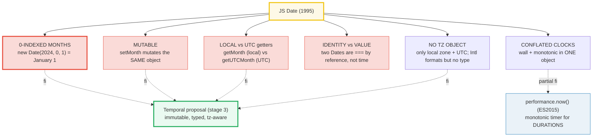
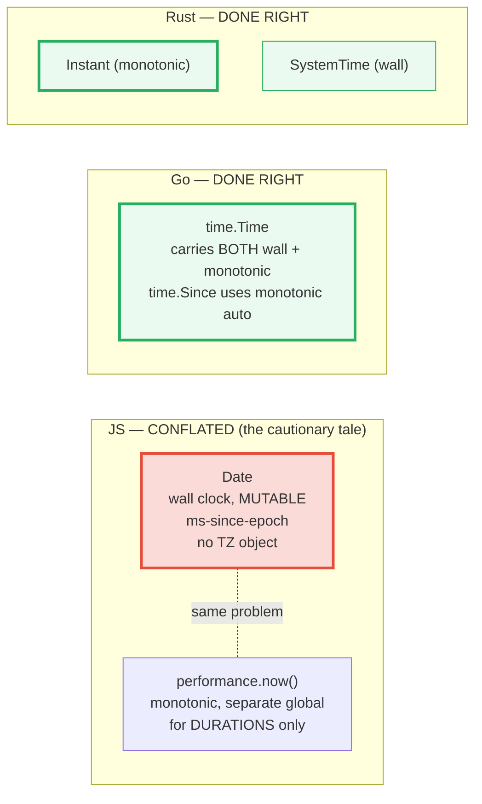
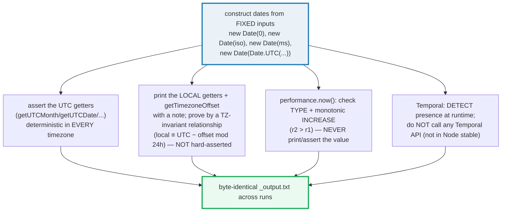

# DATE_TIME — `Date`, `performance.now()`, and the `Temporal` Future (the cautionary tale)

> **Goal (one line):** show, by printing every value, that JS's `Date` is
> legendarily bad — months are **0-indexed** (`new Date(2024, 0, 1)` is January
> 1), it is **mutable** (`setMonth` mutates in place), its getters split into a
> **LOCAL** family and a **UTC** family (the local one depends on the machine
> timezone), it **conflates wall-clock and monotonic time** into one mutable
> object, and it has **no timezone object** beyond UTC+offset — pinning each
> gotcha as a `check()`'d invariant on **FIXED dates**, then contrasting with
> `performance.now()` (a monotonic-ish high-res timer) and the `Temporal`
> proposal (the stage-3 modern fix).
>
> **Run:** `just run date_time`
>
> **Ground truth:** [`core/date_time.ts`](./core/date_time.ts) → captured stdout
> in [`core/date_time_output.txt`](./core/date_time_output.txt). Every number/
> table below is pasted **verbatim** from that file under a
> `> From date_time.ts Section X:` callout. Nothing is hand-computed.
>
> **Prerequisites:** 🔗 [`VALUES_TYPES_COERCION`](./VALUES_TYPES_COERCION.md) (the
> value-vs-reference axis — `Date` is an object compared by identity, not value).
> This bundle is the **Phase 5 Standard Library Essentials** treatment of JS's
> date/time API. It is the **cross-language headline** of the whole curriculum.

---

## 1. Why this bundle exists (lineage)

JavaScript's `Date` (1995) inherited a **0-indexed month**, a **mutable** state,
and a single "wall-clock millisecond since the epoch" model that mixes two
**different** clocks — the civil calendar (which jumps on DST/timezone edits and
NTP syncs) and a **monotonic** counter (which never goes backwards). Go and Rust
both **split** these cleanly; JS gave us **one** object that does wall clock
only, mutates in place, and ships no timezone type. The result is that every JS
developer eventually hits the same four bugs:





The headline **cross-language** contrast is the whole point of this bundle:

> 🔗 [`../go/TIME.md`](../go/TIME.md) — Go's `time.Time` is the model JS *should*
> have had. A `Time` **carries both** a wall reading and a **monotonic** reading;
> `time.Since(t)` and `time.Now()` use the **monotonic** field automatically, so
> duration math is immune to clock jumps. `time.Duration` is a **typed**
> nanosecond count (not a bare `number`). Go got it right; JS conflated the two
> clocks into one mutable `Date`.
>
> 🔗 [`../rust/TIME.md`](../rust/TIME.md) — Rust splits the two clocks into **two
> separate types**: `Instant` (monotonic, for measuring durations — `Instant::now()`,
> `Instant::elapsed()`) and `SystemTime` (wall clock, for absolute instants). You
> literally **cannot** accidentally measure a duration with the wall clock,
> because `Instant - Instant` is the only subtraction that compiles. JS's `Date`
> is the cautionary tale both languages fixed.

Within the TS curriculum, this bundle is the sibling of two others:

> 🔗 [`JSON`](./JSON.md) (P5) — `Date.toJSON()` delegates to `toISOString()`, so
> a `Date` serializes to an **ISO-8601 string** and does **not** revive through
> `JSON.parse` without a reviver. That bundle pins the *JSON-boundary* behavior;
> this one pins the **`Date` itself** (the ISO string's provenance, the
> 0-month bug, the local/UTC getter split).
>
> 🔗 [`TIMERS_IO`](./TIMERS_IO.md) (P4) — `performance.now()` is the timer used
> to *measure* callback scheduling latencies; this bundle owns `performance.now()`
> as a **monotonic duration** tool, while `TIMERS_IO` owns the **scheduling**
> side (macrotask/microtask ordering, libuv phases).

---

## 2. Section A — Constructors + the 0-indexed-month gotcha + `Date` is MUTABLE

A `Date` is, internally, a single IEEE-754 number: **milliseconds since the Unix
epoch** (`1970-01-01T00:00:00Z`) in UTC. There are **four** deterministic
constructor forms, plus one form that is **forbidden** in any reproducible
context (`new Date()` / `Date.now()` — wall-clock "now" is non-reproducible).
Every date in this bundle is constructed from **fixed** inputs.

> From date_time.ts Section A:
> ```
> Date constructor forms (all FIXED inputs — never `new Date()`):
>   new Date(0)                          -> epoch ms = 0
>   new Date(0).toISOString()            -> 1970-01-01T00:00:00.000Z
>   new Date(1718447400000)              -> 2024-06-15T10:30:00.000Z
>   new Date("2024-06-15T10:30:00Z")      -> 2024-06-15T10:30:00.000Z
>   Date.UTC(2024, 5, 15, 10, 30, 0)     -> epoch ms = 1718447400000
>   new Date(Date.UTC(2024,5,15,10,30,0))-> 2024-06-15T10:30:00.000Z
>   new Date()  /  Date.now()            -> FORBIDDEN here (wall-clock now is non-reproducible)
> [check] new Date(0).getTime() === 0 (epoch): OK
> [check] new Date(0).toISOString() === "1970-01-01T00:00:00.000Z": OK
> [check] new Date("2024-06-15T10:30:00Z").toISOString() === "2024-06-15T10:30:00.000Z": OK
> [check] Date.UTC(2024,5,15,10,30,0) === 1718447400000 (ms): OK
> ```

The four deterministic forms: `new Date(ms)` (epoch milliseconds), `new Date(isoString)`
(parses ISO-8601), the **component constructor** `new Date(year, month, day, ...)`
(takes calendar fields — note `month` is 0-indexed, see below), and `Date.UTC(year, month, ...)`
which returns the epoch **ms** directly (UTC). `new Date(Date.UTC(...))` is the
**safest** construction form: every field is UTC, so the result is the same in
every timezone.

### THE most famous JS Date gotcha: months are 0-INDEXED

The component constructor and the `getMonth`/`getUTCMonth` getters all use a
**0-indexed** month: `0` = January, `11` = December. Only the month is shifted —
the day (`getDate`), hours, minutes, seconds, and milliseconds use their natural
zero-origin. This asymmetry is a legacy of an old system call and can never be
fixed. It is **the** single most reproduced JS bug:

> From date_time.ts Section A:
> ```
> THE GOTCHA — months are 0-INDEXED (January = 0, December = 11):
>   new Date(2024, 0, 1)  -> getMonth() = 0   (0 = JANUARY)
>   new Date(2024, 5, 15) -> getMonth() = 5   (5 = JUNE)
>   new Date(2024, 11, 25)-> getMonth() = 11  (11 = DECEMBER)
>   new Date(Date.UTC(2024, 5, 15, 12, 0, 0)).getUTCMonth() = 5   (5 = JUNE, via UTC)
> [check] new Date(2024, 0, 1).getMonth() === 0 (January is month 0): OK
> [check] new Date(2024, 5, 15).getMonth() === 5 (June is month 5): OK
> [check] new Date(2024, 11, 25).getMonth() === 11 (December is month 11): OK
> [check] new Date(Date.UTC(2024,5,15,12)).getUTCMonth() === 5 (June via UTC): OK
> ```

`new Date(2024, 0, 1)` is **January 1** (month `0`); `new Date(2024, 5, 15)` is
**June 15** (month `5`); `new Date(2024, 11, 25)` is **December 25** (month
`11`). Note that `getMonth()` reads **local** time and `getUTCMonth()` reads UTC
(see Section B); both return `0..11` the same way, so the 0-indexed convention
is consistent across both families.

### `Date` is MUTABLE: `set*()` mutates the SAME object

Unlike essentially every other "value" type in a modern language, `Date` has
**no immutable variant**: `setMonth`, `setFullYear`, `setDate`, `setHours`,
`setUTCMonth`, etc. all **change the same object in place**. Because `Date` is
an **object** (compared by reference — 🔗 `VALUE_VS_REFERENCE`), aliasing a
`Date` and then calling a `set*()` on it is a **shared-mutability** bug: every
alias sees the change.

> From date_time.ts Section A:
> ```
> Date is MUTABLE — set*() mutates the SAME object (shared-mutability trap):
>   d.toISOString() before setUTCMonth(0) -> 2024-06-15T12:00:00.000Z
>   d.toISOString() after  setUTCMonth(0) -> 2024-01-15T12:00:00.000Z
>   alias.toISOString() (untouched)       -> 2024-01-15T12:00:00.000Z   <-- the ALIAS sees the change!
> [check] Date is mutable: d mutated by setUTCMonth(0): OK
> [check] mutating d is visible through the alias (shared reference): OK
> [check] d === alias (same object, no copy): OK
> ```

`const alias = d` makes `alias` **alias** `d` (same object, no copy — 🔗
`VALUE_VS_REFERENCE`). After `d.setUTCMonth(0)`, `alias` **also** reports
January, because there is only one object. This is why you must **never** mutate
a `Date` that other code holds a reference to: defensively copy first
(`new Date(d.getTime())`), or — better — treat `Date` as read-only and produce
new instances. The `Temporal` proposal (§E) makes dates **immutable**, closing
this bug class for good.

---

## 3. Section B — `getTime()` (epoch ms) + LOCAL vs UTC getters + ISO/`toString`/`toJSON`

`getTime()` returns the internal epoch-ms number; `valueOf()` returns the
**same** number, which is what drives the relational operators (`<`, `>`, `<=`,
`>=` — they coerce `Date` to its `valueOf`, i.e. epoch ms).

> From date_time.ts Section B:
> ```
> fixed instant: new Date(Date.UTC(2024, 5, 15, 10, 30, 0))
>   d.getTime()   = 1718447400000   (ms since 1970-01-01T00:00:00Z)
>   d.valueOf()   = 1718447400000   (SAME number; drives <,>, arithmetic)
>   d.getTime() === d.valueOf() -> true
> [check] d.getTime() === 1718447400000 (epoch ms): OK
> [check] d.getTime() === d.valueOf() (relational ops coerce to this): OK
> ```

### THE LOCAL vs UTC getter split

Every calendar field has **two** getters: a **LOCAL** family
(`getFullYear`, `getMonth`, `getDate`, `getHours`, `getMinutes`, …) that reads
the host machine's timezone, and a **UTC** family (`getUTCFullYear`,
`getUTCMonth`, `getUTCDate`, `getUTCHours`, `getUTCMinutes`, …) that reads UTC.
For the **same** instant, on a machine whose timezone differs from UTC, the two
families return **different** values. The **UTC** family is deterministic in
every timezone; the **local** family is machine-TZ-dependent.

> From date_time.ts Section B:
> ```
> Two getter families — LOCAL (machine-TZ dependent) vs UTC (deterministic):
>   d.getUTCFullYear() = 2024   d.getFullYear()    = 2024   (LOCAL)
>   d.getUTCMonth()    = 5   (June)   d.getMonth()       = 5   (LOCAL)
>   d.getUTCDate()     = 15            d.getDate()        = 15            (LOCAL)
>   d.getUTCHours()    = 10            d.getHours()       = 17            (LOCAL)
>   d.getUTCMinutes()  = 30            d.getMinutes()     = 30            (LOCAL)
>   d.getTimezoneOffset() = -420  (LOCAL offset in minutes; machine-TZ dependent)
>   NOTE: the LOCAL values above depend on THIS machine's timezone.
>         The UTC values are deterministic in every timezone.
> [check] d.getUTCFullYear() === 2024 (UTC, deterministic): OK
> [check] d.getUTCMonth() === 5 (June, UTC, deterministic): OK
> [check] d.getUTCDate() === 15 (UTC, deterministic): OK
> [check] d.getUTCHours() === 10 (UTC, deterministic): OK
> [check] d.getUTCMinutes() === 30 (UTC, deterministic): OK
> ```

For `2024-06-15T10:30:00Z`, `getUTCHours()` is `10` everywhere, but `getHours()`
reads **local** time — on the machine that produced this output (UTC+7) it is
`17`. That single fact is the source of countless timezone bugs: code that calls
`getMonth()` and assumes it is reading UTC silently produces the wrong month for
any instant near a date boundary in a non-UTC zone.

**The UTC getters are the safe pinned values** — they are asserted above because
they never vary. The **local** getters and `getTimezoneOffset()` are printed
with a note and proved by a **timezone-invariant relationship** rather than
hard-asserted (their absolute values differ per machine). That relationship holds
on **every** machine and proves the two families read clocks shifted by the
offset:

> From date_time.ts Section B:
> ```
>   localMinOfDay(1050) − utcMinOfDay(630) + offset(-420) ≡ 0 (mod 1440)
> [check] local ≡ UTC − getTimezoneOffset (mod 24h) — proves the two families differ by the offset: OK
> [check] typeof getTimezoneOffset() === 'number': OK
> ```

`localMinutesOfDay ≡ utcMinutesOfDay − getTimezoneOffset() (mod 24h)`. On this
machine, `1050 − 630 + (−420) ≡ 0 (mod 1440)` — the local family reads a clock
shifted by exactly the offset (420 min = 7 h) from the UTC family.

### Serialization: `toISOString` (UTC) vs `toString` (LOCAL) vs `toJSON`

> From date_time.ts Section B:
> ```
> Serialization — toISOString (UTC, deterministic) vs toString (LOCAL, machine-TZ):
>   d.toISOString() -> 2024-06-15T10:30:00.000Z   (ALWAYS UTC ISO-8601, ends in Z)
>   d.toJSON()      -> 2024-06-15T10:30:00.000Z   (=== toISOString; 🔗 JSON)
>   d.toString()    -> Sat Jun 15 2024 17:30:00 GMT+0700 (Indochina Time)   (LOCAL; machine-TZ dependent)
>   d.toUTCString() -> Sat, 15 Jun 2024 10:30:00 GMT   (UTC, human form)
> [check] d.toISOString() === "2024-06-15T10:30:00.000Z" (UTC ISO-8601): OK
> [check] d.toJSON() === d.toISOString() (Date serializes to ISO string): OK
> [check] JSON.stringify(d) === quoted toISOString(): OK
> ```

- **`toISOString()`** — **always** UTC, in the ISO-8601 format `YYYY-MM-DDTHH:mm:ss.sssZ`.
  Deterministic in every timezone (the `Z` suffix pins it to UTC). **This is the
  canonical wire format** for dates in APIs, logs, and databases.
- **`toJSON()`** — returns the **same** string as `toISOString()`. This is the
  seam `JSON.stringify` uses: a `Date` serializes to its ISO string and does
  **not** revive through `JSON.parse` without a reviver (🔗 `JSON` §3).
- **`toString()`** — a **local**, human-readable form that **includes the machine
  timezone name and offset**, so it is **machine-TZ-dependent** (the example
  shows `GMT+0700 (Indochina Time)`). Never assert it; never store it.
- **`toUTCString()`** — a UTC human form (RFC 7231 date). Deterministic.

---

## 4. Section C — Parsing + Date comparison (getTime, NOT ==) + duration math

### Parsing: ISO-8601 is RELIABLE; non-ISO is implementation-dependent

`Date.parse(isoString)` returns epoch ms. **ISO-8601** (with the `Z` or an
explicit offset) is spec'd and deterministic across engines. A **date-only**
string (`"2024-06-15"`) is spec'd as **UTC** midnight (also deterministic), but a
**non-ISO** string (`"06/15/2024"`, `"June 15, 2024"`) is **implementation-
dependent**: engines disagree on whether it is UTC or local, so it is a
**portability trap** — never rely on it across engines. Unparseable input yields
`NaN` (detected with `Number.isNaN`, **not** `===`, because `NaN !== NaN`).

> From date_time.ts Section C:
> ```
> Parsing — ISO-8601 is RELIABLE; non-ISO is implementation-dependent:
>   Date.parse("2024-06-15T10:30:00.000Z") -> 1718447400000
>   new Date("2024-06-15T10:30:00.000Z").getTime() -> 1718447400000
>   Date.parse("not a date") -> NaN   (NaN on unparseable input)
>   new Date("not a date").toString() -> Invalid Date   (Invalid Date sentinel)
>   new Date("not a date").getTime() -> NaN   (NaN — detect with Number.isNaN)
>   WARNING: new Date('06/15/2024') and new Date('June 15, 2024') are NON-ISO and
>   implementation-dependent (UTC vs local differs across engines) — avoid them.
> [check] Date.parse("2024-06-15T10:30:00.000Z") === 1718447400000: OK
> [check] new Date("2024-06-15T10:30:00.000Z").getTime() === 1718447400000: OK
> [check] Date.parse("not a date") is NaN: OK
> [check] new Date("not a date").toString() === "Invalid Date": OK
> [check] invalid Date.getTime() is NaN (detect with Number.isNaN, NOT ===): OK
> ```

An invalid `Date` is a **sentinel object**: `toString()` returns the string
`"Invalid Date"` and `getTime()` returns `NaN`. Always detect invalidity with
`Number.isNaN(d.getTime())` (or `Number.isNaN(Date.parse(s))`) — **never**
`d.getTime() === NaN` (that is always `false`, because `NaN !== NaN`; see 🔗
`VALUES_TYPES_COERCION` §6).

### THE comparison trap: two Dates are `===` by IDENTITY, not value

`===` on objects compares **references**. Two **distinct** `Date` objects with
the **same** epoch ms are **not** `===` (different references) and not
`Object.is`. Compare `Date`s by **value** using `getTime()`; the relational
operators `<`, `>`, `<=`, `>=` work too because they coerce via `valueOf()`
(→ epoch ms).

> From date_time.ts Section C:
> ```
> Comparison trap — two Dates are === by IDENTITY, not value (use getTime()):
>   d1.getTime() === d2.getTime() -> true   (same VALUE)
>   d1 === d2                     -> false   (IDENTITY: distinct objects)
>   Object.is(d1, d2)             -> false   (also identity)
>   d1 <= d2 (relational)         -> true   (coerces via valueOf -> epoch ms)
> [check] d1.getTime() === d2.getTime() (compare Dates by VALUE via getTime): OK
> [check] d1 === d2 is false (=== compares IDENTITY, not value): OK
> [check] Object.is(d1, d2) is false (identity): OK
> [check] d1 <= d2 (relational ops coerce Date to epoch ms via valueOf): OK
> ```

This is the **same** value-vs-reference rule from 🔗 `VALUES_TYPES_COERCION`
(§2: primitives copy, objects share one reference), applied to `Date`. A
`Date` is an object, so two `new Date(0)` are two distinct objects; only their
`getTime()` (a primitive `number`) compares by value.

### Duration math: subtract two `getTime()`, then divide

A duration is just a **number** (ms). Subtract two epoch-ms readings, then
divide by `1000` (s) / `60000` (min) / `3600000` (h) / `86400000` (day). This is
the **wall-clock** way to measure a duration; for an immune-to-clock-jumps
measurement use `performance.now()` (§E).

> From date_time.ts Section C:
> ```
> Duration math — subtract two getTime() (epoch ms), then divide:
>   start = 2024-06-15T10:00:00.000Z
>   end   = 2024-06-15T12:00:00.000Z
>   end.getTime() - start.getTime() = 7200000 ms
>   /1000  -> 7200 s
>   /60000 -> 120 min
>   /3600000 -> 2 h
> [check] duration === 7200000 ms (2 hours): OK
> [check] duration / 3600000 === 2 (hours): OK
> [check] duration / 60000 === 120 (minutes): OK
> ```

---

## 5. Section D — Timezones: NO TZ object, `getTimezoneOffset`, `Intl.DateTimeFormat`

`Date` has **no real timezone object**. A `Date` is an instant (epoch ms); the
only zones it "knows" are the **host machine's local zone** (used by the LOCAL
getters) and **UTC** (used by the `getUTC*` getters and `toISOString`). There is
**no way to attach an arbitrary IANA zone** (`"America/New_York"`) to a `Date`.
The two escape hatches are `getTimezoneOffset()` and `Intl.DateTimeFormat`:

> From date_time.ts Section D:
> ```
> Date has NO timezone object — only LOCAL zone + UTC. Two escape hatches:
>   d.getTimezoneOffset() = -420   (LOCAL offset, minutes; machine-TZ dependent)
>   NOTE: this is THIS machine's offset, NOT the zone of `d` (a Date has no zone).
> ```

`getTimezoneOffset()` returns the **local** zone's offset in **minutes** (note
the sign: a zone ahead of UTC like `UTC+7` returns a **negative** `-420`, because
the value is "minutes to *add* to local to get UTC"). It can be **non-integer**
where zones have `:30`/`:45` offsets, and it **changes across DST** for zones
with daylight saving — so the same `Date` can return a different offset in
winter vs summer. Crucially, this is the offset of **this machine**, not "the
zone of `d`": a `Date` carries no zone.

### `Intl.DateTimeFormat` with a fixed `timeZone` (the deterministic formatter)

`Intl.DateTimeFormat` with a `timeZone` option **formats** an instant in **any
IANA zone**. Given a **fixed instant + fixed zone + fixed locale**, the output
is **deterministic** (stable ICU data), so it is assertable — unlike the local
getters.

> From date_time.ts Section D:
> ```
> Intl.DateTimeFormat with a FIXED timeZone (deterministic given instant+zone+locale):
>   instant (UTC): 2024-06-15T10:30:00.000Z
>   America/New_York (full): Sat, Jun 15, 2024, 6:30 AM EDT
>   America/New_York (time): 6:30 AM EDT   <- 10:30 UTC = 06:30 EDT (UTC-4 in summer)
>   Asia/Tokyo       (time): 7:30 PM GMT+9   <- 10:30 UTC = 19:30 JST (UTC+9, no DST)
> [check] Intl NY full === "Sat, Jun 15, 2024, 6:30 AM EDT": OK
> [check] Intl NY time === "6:30 AM EDT": OK
> [check] Intl Tokyo time === "7:30 PM GMT+9": OK
> ```

The **same** instant (`2024-06-15T10:30:00Z`) renders as `06:30 EDT` in New York
(UTC−4 in summer, because `Intl` handles DST) and `19:30 GMT+9` in Tokyo (UTC+9
year-round, no DST). `Date` alone **cannot** do this — `Intl.DateTimeFormat` is
the **only** built-in way to render an instant in an arbitrary zone. For a
typed, zone-aware **date object** (not just a formatter), you need the `Temporal`
proposal (§E).

> From date_time.ts Section D:
> ```
> The SAME instant renders at different wall-clock times per zone (Intl handles DST):
>   Date alone CANNOT format in an arbitrary zone — Intl.DateTimeFormat is the only
>   built-in way. (For a typed, zone-aware DATE OBJECT, see the Temporal proposal, §E.)
> [check] Intl NY (06:30) differs from Tokyo (19:30) for the same UTC instant: OK
> ```

---

## 6. Section E — `performance.now()` (monotonic) + Temporal preview + cross-language

### `performance.now()`: a high-resolution MONOTONIC-ISH timer for DURATIONS

`Date` measures **wall-clock** milliseconds since the epoch — a civil clock that
can **jump** (NTP syncs, DST, user edits, leap-second smear). It is the **wrong**
tool for measuring a duration. `performance.now()` returns a high-resolution
timestamp (`DOMHighResTimeStamp`, ms with a sub-millisecond fraction) whose
**origin** is process/page start and which is **monotonic** — it never goes
backwards. Use it to measure durations: read it twice and subtract. **Never**
use it as an absolute wall-clock (it is not since the epoch), and **never** assert
its value (the reading is run-dependent); only the **type** and the **monotonic
increase** (`r2 > r1`) are pinned.

> From date_time.ts Section E:
> ```
> performance.now() — a high-resolution MONOTONIC timer for DURATIONS:
>   typeof performance.now() -> number   (DOMHighResTimeStamp)
>   reading #2 > reading #1  -> true   (monotonic: never goes backwards)
>   elapsed (r2 - r1)        -> a non-negative DURATION in ms (value is run-dependent; NOT printed/asserted)
>   NOTE: the absolute readings above are RUN-dependent and are NOT asserted;
>         only the TYPE (number) and the monotonic INCREASE (r2 > r1) are pinned.
> [check] typeof performance.now() === 'number': OK
> [check] performance.now() is monotonic: r2 > r1 (after a busy loop): OK
> [check] elapsed duration is a non-negative finite number: OK
> [check] busy-loop accumulator is a number (no dead code): OK
> ```

> From date_time.ts Section E:
> ```
> Why Date is the WRONG duration tool (and performance.now is the right one):
>   - Date = wall clock (epoch ms): can JUMP on NTP/DST/user edits. Mutable. No TZ.
>   - performance.now() = monotonic counter from process start: never goes backwards.
>   - JS gives you TWO separate globals with NO unified type (unlike Go/Rust).
> ```

JS gives you `Date` (wall, mutable) and `performance.now()` (monotonic) as **two
separate globals with no unified type** — you must remember which to use for
which job. Go and Rust bake the distinction into the type system (see below).

### The Temporal proposal (stage 3): the modern, immutable, typed, tz-aware fix

`Temporal` is the stage-3 TC39 proposal that **replaces** `Date` with immutable,
typed, timezone-aware types. It fixes **every** gotcha above: types prevent the
local/UTC confusion (`PlainDateTime` has no zone; `Instant` is always UTC;
`ZonedDateTime` **carries** the zone), the objects are **immutable**, and
`Duration` is a **typed** field collection (not a bare `number`). It is **not**
enabled by default in Node (gated behind `--harmony-temporal` / a polyfill), so
it is **detected** here, not called.

> From date_time.ts Section E:
> ```
> The Temporal proposal (stage 3) — the modern, immutable, typed, tz-aware fix:
>   "Temporal" in globalThis -> false   (NOT enabled by default in Node)
>   Temporal.Instant       — a UTC instant (like Date but immutable)
>   Temporal.PlainDateTime — a wall-clock date+time with NO zone (no local/UTC trap)
>   Temporal.ZonedDateTime — instant + IANA zone + calendar (the type Date never had)
>   Temporal.Duration      — a typed duration (fields, not a bare ms number)
>   (Not run here: Temporal is gated behind --harmony-temporal / a polyfill in Node.)
> [check] typeof globalThis.Temporal === "undefined" (Temporal not enabled by default in Node): OK
> ```

### The cross-language headline (printed, not executed)

> From date_time.ts Section E:
> ```
> Cross-language time model — who separates MONOTONIC from WALL cleanly:
>   JS   : Date = wall (mutable, ms-since-epoch, no TZ object). performance.now =
>          monotonic, but a SEPARATE global (no unified type). CAUTIONARY TALE.
>   Go   : time.Time carries BOTH a wall AND a monotonic reading; time.Since/Now()
>          use the MONOTONIC field automatically. Duration is a typed ns count. DONE RIGHT.
>   Rust : Instant = MONOTONIC (measure durations); SystemTime = WALL (absolute instant).
>          Two SEPARATE types — the clean split JS conflated in one Date object. DONE RIGHT.
>   => Go and Rust cleanly separate monotonic-from-wall; JS conflated them in Date.
> ```

Go's `time.Time` **carries both** a wall reading and a **monotonic** reading;
`time.Since(t)` uses the **monotonic** field automatically, so duration math is
immune to clock jumps, and `time.Duration` is a **typed** nanosecond count. Rust
splits the two clocks into **two separate types** — `Instant` (monotonic) and
`SystemTime` (wall) — so you literally cannot accidentally measure a duration
with the wall clock (the subtraction won't compile). Both languages **got it
right**; JS's `Date` is the cautionary tale they learned from. (🔗 `../go/TIME.md`,
🔗 `../rust/TIME.md`.)

---

## 7. Determinism contract (how this bundle stays reproducible)

JavaScript date/time output is only reproducible if you respect one rule:
**construct every `Date` from FIXED inputs, assert the UTC getters, and never
print/assert a wall-clock "now" or a `performance.now()` value.** This bundle
implements that contract throughout:



- **Fixed inputs only:** `new Date(0)`, `new Date("2024-06-15T10:30:00Z")`,
  `new Date(1718447400000)`, `new Date(Date.UTC(2024, 5, 15, 10, 30, 0))`. No
  `new Date()` / `Date.now()` (wall-clock now is non-reproducible).
- **Assert UTC getters** (`getUTCMonth`, `getUTCDate`, `getUTCHours`, …) — they
  are deterministic in every timezone. The **local** getters and
  `getTimezoneOffset()` are machine-TZ-dependent, so they are **printed** with a
  note and proved by the `local ≡ UTC − offset (mod 24h)` invariant (holds on
  every machine), not hard-asserted to an absolute value.
- **`performance.now()`** — only the **type** (`number`) and the **monotonic
  increase** (`r2 > r1`) are checked. The absolute reading and the elapsed value
  are run-dependent and **never** printed/asserted.
- **`Intl.DateTimeFormat` with a fixed `timeZone`** — the formatted string is
  deterministic given a fixed instant + zone + locale, so it IS asserted (stable
  ICU data).
- **`Temporal`** — detected at runtime (`"Temporal" in globalThis → false` on
  Node); no `Temporal` API is called (it is not enabled by default).

---

## 8. Pitfalls (the expert payoff)

| Trap | Symptom | Fix |
|---|---|---|
| `new Date(2024, 6, 1)` meant "June 1" | Months are **0-indexed** — month `6` is **July**, not June. Code that assumes 1-indexed months silently shifts every date by one month. | Treat month as **0-indexed** (`0`=Jan). Use `getUTCMonth()`/`Date.UTC(y, m, d)` and remember `m` is `monthIndex`. For display, format with `Intl` (which uses real month names). |
| `d.setMonth(d.getMonth() + 1)` to "add a month" | **Mutates** `d` in place — every alias sees the change; also overflows silently (`setMonth(12)` → next year January). | Treat `Date` as read-only; produce a new instance. Or use `Temporal` (immutable). Add months via a helper that returns `new Date(old.getTime())` first. |
| `d.getMonth()` assumed to be UTC | The LOCAL family reads the **machine** timezone — silently wrong for any instant near a date boundary in a non-UTC zone. | Use the `getUTC*` family (or construct via `Date.UTC`). Reserve local getters for "what does this instant look like HERE." |
| `if (d1 === d2)` to compare two dates | Two `Date` objects are `===` by **identity** (reference), not value — `new Date(0) === new Date(0)` is `false`. | Compare by value: `d1.getTime() === d2.getTime()` (or relational `<`/`>`, which coerce via `valueOf`). |
| `new Date("06/15/2024")` for parsing | **Non-ISO**, implementation-dependent — engines disagree on UTC vs local; portability trap. | Parse only **ISO-8601** (`"2024-06-15T10:30:00Z"`). For arbitrary user input, parse explicitly with a library (or `Temporal`). |
| `d.getTime() === NaN` to detect invalid dates | `NaN !== NaN` — this is **always `false`**, so invalidity is never detected. | `Number.isNaN(d.getTime())` (or `Number.isNaN(Date.parse(s))`). See 🔗 `VALUES_TYPES_COERCION` §6. |
| `Date.parse` of a date-only string `"2024-06-15"` | Spec'd as **UTC** midnight (not local) — surprising vs `new Date(2024, 5, 15)` which is **local** midnight. The two differ by the offset. | Be explicit: append `T00:00:00Z` for UTC, or construct via components for local. |
| Measuring a duration with `Date.now()` subtraction | Wall clock can **jump** (NTP/DST/user edits) → negative or wildly wrong durations. | Use `performance.now()` (monotonic) for durations. Reserve `Date` for absolute instants. |
| `getTimezoneOffset()` assumed to be the zone of "the date" | A `Date` carries **no zone** — the offset is **this machine's** zone at that instant, which changes across DST. | There is no per-Date zone. To work in a specific zone, use `Intl.DateTimeFormat` (format) or `Temporal.ZonedDateTime` (type). |
| Formatting in a non-local zone | `Date` has no `timeZone` field — `toString`/`getHours` always use the **host** zone. | `new Intl.DateTimeFormat(locale, { timeZone: "America/New_York" }).format(d)`. |
| `JSON.stringify({ at: new Date(0) })` then `JSON.parse` | The `Date` comes back as a **string**; `instanceof Date` is `false` (type erased). | Pass a reviver that detects ISO-8601 and returns `new Date(v)`. See 🔗 `JSON` §3. |
| Assuming `Temporal` is available | Not enabled by default in Node (behind `--harmony-temporal`/polyfill) — runtime `ReferenceError`. | Detect `"Temporal" in globalThis`; ship a polyfill (`@js-temporal/polyfill`) until it ships in Node stable. |

---

## 9. Cheat sheet

```typescript
// === Construction (FIXED inputs only; never new Date() / Date.now()) =======
//   new Date(0)                       // epoch 0 -> 1970-01-01T00:00:00.000Z
//   new Date(ms)                      // ms since epoch (UTC)
//   new Date("2024-06-15T10:30:00Z")  // parse ISO-8601 (Z/offset = reliable)
//   new Date(year, month, day, ...)   // COMPONENT form, LOCAL time, 0-INDEXED month
//   Date.UTC(year, month, ...)        // -> epoch ms (UTC); safest construction
//   new Date() / Date.now()           // wall-clock NOW — FORBIDDEN in reproducible code

// === THE GOTCHA: months are 0-INDEXED ======================================
//   new Date(2024, 0, 1)  -> January 1   (month 0 = January)
//   new Date(2024, 5, 15) -> June 15     (month 5 = June)
//   new Date(2024, 11, 25)-> December 25 (month 11 = December)
//   getMonth()/getUTCMonth() return 0..11 the same way.

// === Date is MUTABLE (set* mutates in place) ===============================
//   const d = new Date(Date.UTC(2024,5,15));
//   const alias = d;          // ALIAS (same object — 🔗 VALUE_VS_REFERENCE)
//   d.setUTCMonth(0);         // mutates d; alias.getUTCMonth() === 0 too!
//   // Treat as read-only; copy first: new Date(d.getTime()).

// === getTime() = epoch ms; valueOf() = same (drives <,>) ===================
//   d.getTime() === d.valueOf()        // true (both epoch ms)
//   d1.getTime() === d2.getTime()      // compare by VALUE
//   d1 === d2                          // FALSE (identity; two distinct objects)

// === LOCAL vs UTC getters ===================================================
//   getMonth/getDate/getHours/...      // LOCAL (machine-TZ dependent)
//   getUTCMonth/getUTCDate/getUTCHours // UTC (deterministic everywhere) — PREFER these
//   d.getTimezoneOffset()              // LOCAL offset in min (UTC+7 -> -420); DST-aware
//   invariant: localMin ≡ utcMin − offset (mod 24h)

// === Serialization =========================================================
//   d.toISOString()  // "2024-06-15T10:30:00.000Z"  ALWAYS UTC ISO-8601 (wire format)
//   d.toJSON()       // === toISOString (🔗 JSON: Date -> ISO string, no auto-revive)
//   d.toString()     // LOCAL human form w/ TZ name — machine-TZ dependent, don't assert
//   d.toUTCString()  // "Sat, 15 Jun 2024 10:30:00 GMT" (UTC human form)

// === Parsing ===============================================================
//   Date.parse("2024-06-15T10:30:00.000Z") // 1718447400000 (ISO-8601 = reliable)
//   new Date("06/15/2024")                 // NON-ISO -> implementation-dependent, AVOID
//   Date.parse("nope")                      // NaN;  Number.isNaN(Date.parse(s)) to detect
//   new Date("nope").toString()             // "Invalid Date" sentinel

// === Duration math (wall clock) ============================================
//   const ms = end.getTime() - start.getTime();   // ms
//   ms / 1000 (s)  /60000 (min)  /3600000 (h)  /86400000 (day)

// === performance.now() — MONOTONIC timer for DURATIONS (not wall clock) =====
//   const r1 = performance.now(); /* work */ const r2 = performance.now();
//   r2 > r1                          // monotonic (never goes backwards)
//   // NEVER use Date for durations (wall clock can jump on NTP/DST).

// === Timezones: NO TZ object on Date =======================================
//   new Intl.DateTimeFormat("en-US", { timeZone: "America/New_York",
//     hour:"numeric", minute:"2-digit", timeZoneName:"short" }).format(d) // "6:30 AM EDT"
//   // Date CANNOT format in an arbitrary zone; Intl is the only built-in way.

// === Temporal (stage 3) — the modern, immutable, typed, tz-aware fix =======
//   Temporal.Instant        // UTC instant (immutable)
//   Temporal.PlainDateTime  // wall date+time, NO zone (no local/UTC trap)
//   Temporal.ZonedDateTime  // instant + IANA zone + calendar (the type Date never had)
//   Temporal.Duration       // typed duration (fields, not a bare ms number)
//   // NOT enabled by default in Node (--harmony-temporal / polyfill).

// === Cross-language: who separates MONOTONIC from WALL =====================
//   JS  : Date (wall, mutable) + performance.now (monotonic) = TWO globals, no unified type.
//   Go  : time.Time carries BOTH; time.Since uses the monotonic field. DONE RIGHT.
//   Rust: Instant (monotonic) vs SystemTime (wall) = two separate types. DONE RIGHT.
```

---

## Sources

Every signature, return value, and behavioral claim above was verified against
the MDN Web Docs, the Node.js docs, and the ECMAScript / TC39 specification, then
corroborated by at least one independent secondary source. Every Date result is
*additionally* asserted at runtime by the `.ts` itself (`check()` throws on any
mismatch) — the strongest possible verification: the actual V8 engine's verdict.

- **MDN — `Date`** (the global object; the four constructor forms; the
  0-indexed month; the LOCAL vs UTC getter families; that `getTime`/`valueOf`
  return epoch ms; mutability of `set*`; that there is no timezone object):
  https://developer.mozilla.org/en-US/docs/Web/JavaScript/Reference/Global_Objects/Date
- **MDN — `Date.prototype.getMonth()`** (*"An integer, between 0 and 11 ...
  0 for January, 1 for February"* — the 0-indexed-month gotcha):
  https://developer.mozilla.org/en-US/docs/Web/JavaScript/Reference/Global_Objects/Date/getMonth
- **MDN — `Date.prototype.getTime()`** (returns the epoch-ms number; `valueOf`
  returns the same):
  https://developer.mozilla.org/en-US/docs/Web/JavaScript/Reference/Global_Objects/Date/getTime
- **MDN — `Date.prototype.getTimezoneOffset()`** (*"the difference, in minutes,
  between UTC and local time ... GMT+10, -600 will be returned"*; DST-aware):
  https://developer.mozilla.org/en-US/docs/Web/JavaScript/Reference/Global_Objects/Date/getTimezoneOffset
- **MDN — `Date.prototype.toISOString()`** (the ISO-8601 UTC format
  `YYYY-MM-DDTHH:mm:ss.sssZ`):
  https://developer.mozilla.org/en-US/docs/Web/JavaScript/Reference/Global_Objects/Date/toISOString
- **MDN — `Date.prototype.toJSON()`** (*"returns a string representation ...
  using `toISOString()`"*):
  https://developer.mozilla.org/en-US/docs/Web/JavaScript/Reference/Global_Objects/Date/toJSON
- **MDN — `Date.parse()`** (ISO-8601 reliably parsed; *"implementations usually
  default to the local time zone when the date string is non-standard"* — the
  non-ISO portability trap; `NaN` on unparseable input):
  https://developer.mozilla.org/en-US/docs/Web/JavaScript/Reference/Global_Objects/Date/parse
- **MDN — `Date.UTC()`** (returns epoch ms for UTC components; the safest
  construction form):
  https://developer.mozilla.org/en-US/docs/Web/JavaScript/Reference/Global_Objects/Date/UTC
- **MDN — `performance.now()`** (`DOMHighResTimeStamp`; monotonic origin at
  process/time origin; for measuring durations):
  https://developer.mozilla.org/en-US/docs/Web/API/Performance/now
- **MDN — `Intl.DateTimeFormat`** (the `timeZone` option for formatting in any
  IANA zone; deterministic given a fixed instant + zone + locale):
  https://developer.mozilla.org/en-US/docs/Web/JavaScript/Reference/Global_Objects/Intl/DateTimeFormat
- **MDN — `Temporal.ZonedDateTime`** (the stage-3 type that carries an instant +
  IANA zone + calendar — the timezone-aware type `Date` never had):
  https://developer.mozilla.org/en-US/docs/Web/JavaScript/Reference/Global_Objects/Temporal/ZonedDateTime
- **TC39 — Temporal proposal** (stage 3; `Temporal.Instant` / `PlainDateTime` /
  `ZonedDateTime` / `Duration`; the immutable, typed replacement for `Date`):
  https://tc39.es/proposal-temporal/
- **Node.js API — `perf_hooks`** (`performance.now()` in Node; monotonic, high
  resolution):
  https://nodejs.org/api/perf_hooks.html

**Secondary corroboration (independent of MDN, ≥1 per major claim):**
- Stack Overflow — *"Why does Javascript getMonth() count from 0 and getDate()
  count from 1?"* (the 0-indexed-month legacy; multi-answer corroboration):
  https://stackoverflow.com/questions/15799514/why-does-javascript-getmonth-count-from-0-and-getdate-count-from-1
- Stack Overflow — *"Is `new Date(string)` reliable ... assuming the input is a
  full ISO-8601 date?"* (ISO-8601 is reliable; non-ISO is implementation-
  dependent):
  https://stackoverflow.com/questions/70130828/is-new-datestring-reliable-in-modern-browsers-assuming-the-input-is-a-full
- Go standard library — **`time` package** (a `Time` carries both a wall and a
  monotonic reading; `time.Since`/`Sub` use the monotonic field; `Duration` is a
  typed ns count — the model JS *should* have had):
  https://pkg.go.dev/time
- Rust standard library — **`std::time`** (`Instant` = monotonic for durations;
  `SystemTime` = wall clock — the clean split JS conflated in one `Date`):
  https://doc.rust-lang.org/std/time/

**Facts that could not be verified by running this bundle** (documented, not
pinned to a number, because they are environment- or proposal-status-dependent):
the **absolute local-getter values** (`getMonth`/`getHours`/…), the
`getTimezoneOffset()` value, and the `toString()` form are **machine-timezone-
dependent** — they are printed with a note and proved by the
`local ≡ UTC − offset (mod 24h)` invariant (which holds on every machine), not
hard-asserted to an absolute value. The `performance.now()` reading is
**run-dependent** — only its type (`number`) and its **monotonic increase**
(`r2 > r1`) are asserted, never the value. The `Temporal` API is **not enabled
by default in Node** (detected as `"Temporal" in globalThis → false`); no
`Temporal` API is called, so its behavior is documented from the TC39 proposal
and MDN rather than executed. Every other claim above is asserted at runtime by
the `.ts` (44 `[check]` invariants) and matches MDN + ECMA-262 / TC39.
