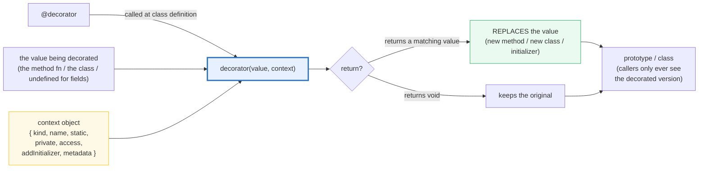
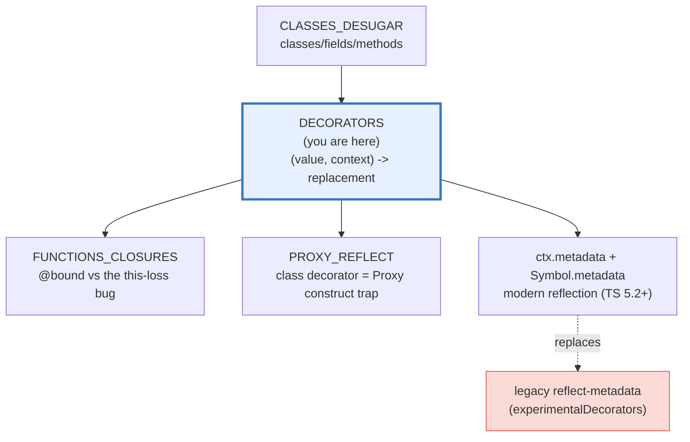
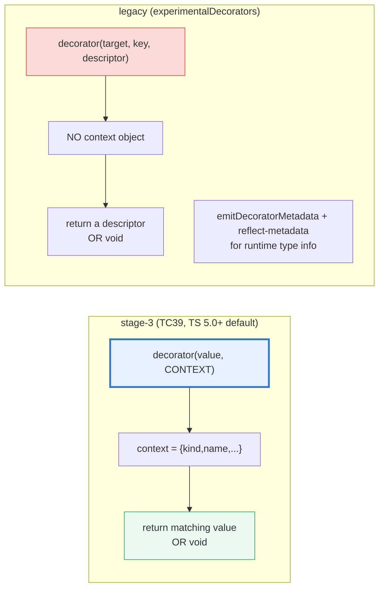

# DECORATORS — TC39 Stage-3 Decorators: `@logged`, `@bound`, `@memoize` & `ctx.metadata`

> **Goal (one line):** show, by running **live stage-3 (TC39) decorators**, how a
> decorator is a higher-order function that receives `(value, context)` and
> returns a replacement — pinning `@logged`, `@bound`, `@deprecated`, `@memoize`,
> class/field/getter decorators, and the `ctx.metadata` / `Symbol.metadata`
> reflection mechanism as `check()`'d invariants.
>
> **Run:** `just run decorators`
>
> **Ground truth:** [`metaprog/decorators.ts`](./metaprog/decorators.ts) →
> captured stdout in
> [`metaprog/decorators_output.txt`](./metaprog/decorators_output.txt). Every
> output block below is pasted **verbatim** from that file under a
> `> From decorators.ts Section X:` callout. Nothing is hand-computed.
>
> **Prerequisites:** 🔗 [`CLASSES_DESUGAR`](./CLASSES_DESUGAR.md) (decorators
> apply to classes/methods/fields/accessors — they are sugar that runs at class
> definition time over the prototype), 🔗 [`FUNCTIONS_CLOSURES`](./FUNCTIONS_CLOSURES.md)
> (a decorator wrapper is a closure capturing the original method; `@bound`
> exists *because* of the detached-`this` closure bug), 🔗
> [`PROXY_REFLECT`](./PROXY_REFLECT.md) (the class decorator here uses a
> `Proxy` `construct` trap + `Reflect.construct` — the same runtime-metaprogramming
> vocabulary).

---

## 1. Why this bundle exists (lineage)

A **decorator** is the declarative `@`-syntax for the **decorator pattern** —
wrapping a class element with a function, exactly the way
`const f = log(g)` wraps a free function. Before stage-3, JavaScript had **no
syntax** for that pattern on classes: you hand-patched
`Class.prototype.method = wrap(Class.prototype.method)` *after* the class was
defined — non-declarative, race-prone (callers could grab the un-wrapped
version), and **blind to private members** (`#x` cannot be reassigned from
outside).

**TC39 stage-3 decorators** fix all three by making a decorator a **plain
function** invoked **during class definition**. It receives two arguments:



**TypeScript 5.0** shipped stage-3 decorators as the **default** (no
`experimentalDecorators` flag needed), and **TypeScript 5.2** added the
**metadata** proposal (`context.metadata` + `Symbol.metadata`). The
`metaprog/tsconfig.json` used by this bundle has **no** `experimentalDecorators`,
so both `tsc` and `tsx` (esbuild) compile this file in **stage-3 mode**. The
older **legacy** model (`experimentalDecorators` + `emitDecoratorMetadata` + the
`reflect-metadata` polyfill, the NestJS/Angular model) is **mutually exclusive**
with stage-3 in one `tsconfig`, so it is **documented in Section E, never
compiled** here.

The headline contrast with sibling languages is the whole point of this bundle:

> 🔗 [`../python/DECORATORS_DEEP.md`](../python/DECORATORS_DEEP.md) — Python's
> `@decorator` is the **original** (PEP 318, 2004) and the syntactically closest
> analog: `@logged\ndef m(): ...` desugars to `m = logged(m)`. JS stage-3 borrows
> the idea but adds the rich **context object** (`{kind, name, ...}`) and the
> *return-replaces* rule (Python decorators also replace, but pass no context).
>
> 🔗 [`../rust/`](../rust/) — Rust **proc macros** (`#[derive(...)]` and
> attribute macros like `#[tokio::main]`) are the **compile-time codegen**
> analog: they generate *new* code at compile time (far more powerful — they can
> invent arbitrary items), but they run **only at compile time**. JS decorators
> run **at runtime** (class-definition time) and can only *replace* an element
> with one of matching shape — no inventing new top-level items. The
> [`../rust/`](../rust/) workspace's `pmacros-derive` / `pmacros-demo` crates
> demonstrate the compile-time derive-macro technique.



---

## 2. The mental model: stage-3 = `(value, context)` → replacement-or-void

A stage-3 decorator is **one function per kind**, typed by the lib types in
`lib.decorators.d.ts` (shipped in `metaprog/tsconfig.json`'s
`lib: ["ES2023", "ESNext.decorators"]`). Each receives the value being
decorated and a **context object**; it may **return a replacement of matching
shape** (or `void` to keep the original):

| Decorator kind | 1st arg (`value`) | Returns | `context.kind` |
|---|---|---|---|
| **method** | the method function | a new function *(or void)* | `"method"` |
| **getter** / **setter** | the accessor function | a new accessor function | `"getter"` / `"setter"` |
| **field** | **`undefined`** *(always)* | an initializer `(init) => newInit` *(or void)* | `"field"` |
| **accessor** (`accessor x`) | `{get, set}` | `{ get?, set?, init? }` | `"accessor"` |
| **class** | the class itself | a new callable (class/Proxy) | `"class"` |

The **context object** always carries `{ kind, name, static, private, access,
addInitializer, metadata }` (class context drops `static`/`private`/`access`;
its `name` may be `undefined` for an anonymous class). Two parts deserve
attention:

- **`addInitializer(fn)`** — queues a callback that runs **once per instance**
  (inside the constructor, for instance members) or **once after class
  definition** (for the class itself / static members). This is how `@bound`
  works *without* replacing the method.
- **`metadata`** — the **per-class shared object** every member decorator on a
  class (plus the class decorator) receives *identical reference* to; data
  stashed on it is retrievable as `Class[Symbol.metadata]`. This is the stage-3
  replacement for the legacy `reflect-metadata` polyfill (see Section D + E).

**The return-replaces rule is the defining constraint.** A method decorator may
only return *another method*; a field decorator may only return an *initializer*.
Unlike the abandoned stage-2 proposal, a stage-3 decorator **cannot** invent new
class members or change an element's *kind*. This is what makes decorators
**statically analyzable** — engines/transpilers can compile them down to plain
function calls and element swaps (no dynamic `Object.defineProperty` with
arbitrary descriptors).



> 🔗 [`CLASSES_DESUGAR`](./CLASSES_DESUGAR.md) — when you write `@logged m() {}`,
> the engine has already created the method on the prototype; the decorator then
> receives that method and (if it returns) **swaps** it. The desugaring in the
> TC39 README is essentially `C.prototype.m = logged(C.prototype.m, ctx) ?? C.prototype.m`.

---

## 3. Section A — A stage-3 method decorator (`@logged`) + the context object

`@logged` is the canonical example: it receives the method, returns a new
function that prints a line, then forwards via `fn.apply(this, args)`. Because
the **return value replaces** the method on the prototype, every caller only
ever sees the wrapped version — and because the wrapper forwards with
`.apply(this, …)`, `this` stays correct.

> From decorators.ts Section A:
> ```
> call square kind=method
> c.square(6) -> 36   (the @logged wrapper ran AND returned 36)
> [check] @logged still returns the correct value (6*6 = 36): OK
> call square kind=method
> [check] @logged did not break `this` (uses fn.apply(this, ...)): OK
> context object observed by a probe decorator:
>   kind      = method
>   name      = thing
>   static    = false
>   private   = false
>   ctx is object = true   (the stage-3 fingerprint)
> [check] ctx.kind === "method": OK
> [check] ctx.name === "thing" (the method name): OK
> [check] ctx.static === false (instance method): OK
> [check] ctx.private === false (public method): OK
> [check] stage-3 passes a context OBJECT (2nd arg is object): OK
> ```

**The context object, observed live.** A probe decorator reads `ctx.kind`,
`ctx.name`, `ctx.static`, `ctx.private` straight off the real `context`. For an
instance method these are exactly `"method"`, the method name, `false`, `false`.
The last check — `ctx is object = true` — is the **runtime fingerprint of
stage-3**: the second argument is an *object* (the context). The **legacy**
experimentalDecorators model instead passes `(target, key, descriptor)` — a
string `key` as the second argument, **no** context object. A decorator library
can support both by testing `typeof arguments[1] === "object"`.

**Why `fn.apply(this, args)` and not `fn(...args)`.** The wrapper must preserve
the receiver. A bare `fn(...args)` inside the wrapper would call the original
with `this === undefined` (strict) or the global (sloppy), losing the instance.
`.apply(this, args)` re-binds `this` to whoever called the wrapper — which is the
instance. This is the same receiver-forwarding lesson as 🔗 `FUNCTIONS_CLOSURES`.

---

## 4. Section B — `@bound` (detached `this`), `@deprecated`, `@memoize`

Three decorators that each use **closure state** captured by the wrapper, plus
`@bound` which demonstrates the *other* stage-3 capability —
`addInitializer` — instead of replacing the method.

> From decorators.ts Section B:
> ```
> unbound detached (called with no this) -> undefined   (this.message is undefined)
> @bound  detached (called with no this) -> "hello"   (this still bound to instance)
> [check] unbound detached method loses `this` (returns undefined): OK
> [check] @bound detached method KEEPS `this` (returns 'hello'): OK
> oldGreet -> ["hi a","hi b","hi c"]
> deprecation warnings recorded: 1 (expected 1 — fires once)
>   deprecated: oldGreet() — do not use
> [check] @deprecated forwards the call every time: OK
> [check] @deprecated warns EXACTLY once (3 calls, 1 warning): OK
> expensive(3), expensive(3), expensive(4) -> [27,27,64]
>   expensive([3]) -> computed
>   expensive([3]) -> cache hit
>   expensive([4]) -> computed
> [check] @memoize returns the right value (3^3 = 27): OK
> [check] @memoize cache hit returns the same value (27): OK
> [check] @memoize computed distinct args (4^3 = 64): OK
> [check] @memoize computed exactly twice (3 and 4; second 3 was a hit): OK
> ```

**`@bound` fixes the detached-`this` bug — without replacing the method.** When
you detach a plain method (`const fn = obj.whoUnbound`) and call it bare, `this`
is lost (`this.message` is `undefined`). `@bound` uses
`ctx.addInitializer(function () { this[name] = this[name].bind(this); })` — the
initializer runs **once per instance, inside the constructor**, re-installing
the method pre-bound to that instance. So a detached `@bound` reference still
sees `this`. Note it returns the *original* `fn` (not a wrapper): the binding
happens as a *side effect* of construction. (The full story of *why* `this` is
lost on detachment is 🔗 `FUNCTIONS_CLOSURES`.)

**`@deprecated` and `@memoize` carry per-method closure state.** `@deprecated`
closes over a `warned` flag, recording one warning on first call. `@memoize`
closes over a `Map<string, Return>` keyed on `JSON.stringify(args)`: a miss runs
the body and caches; a hit returns the cached value. The trace above shows the
body computed exactly twice (for args `3` and `4`); the second `expensive(3)`
was a cache hit. Both demonstrate that **a decorator wrapper is just a closure**
— the same mechanism as `const memoize = (fn) => { const c = new Map(); return … }`
applied to a free function, but now with declarative `@`-syntax on a method.

> 🔗 `FUNCTIONS_CLOSURES` — every wrapper above (`@logged`, `@deprecated`,
> `@memoize`) is a closure that *retains* the original `fn` (and its flag/Map).
> That retention is also what keeps `fn` alive on the GC reachability graph
> (🔗 `GARBAGE_COLLECTION`): as long as the class exists, every wrapper and its
> captured state stays reachable.

---

## 5. Section C — class decorator (`@loggedClass`) + field (`@double`) + getter (`@loggedGet`)

The three remaining *kinds*: a **class** decorator (returns a new callable), a
**field** decorator (first arg is *always* `undefined`; returns an initializer),
and a **getter** decorator (`kind === "getter"`).

> From decorators.ts Section C:
> ```
> counter.base (field @double, init 5 -> 10) = 10
> counter.count (constructor used base) = 10
> call doubled kind=getter
> counter.doubled (getter @loggedGet) = 20
> class decorator fired on each new (2 instances):
>   construct Counter kind=class
>   construct Counter kind=class
> [check] @double field decorator ran: base 5 -> 10: OK
> [check] @loggedGet getter still returns the right value (10*2 = 20): OK
> [check] @loggedClass fired once per instantiation (2): OK
> [check] @loggedClass records kind === "class": OK
> [check] decorated class instances behave normally (count === base === 10): OK
> ```

**The class decorator returns a `Proxy` over the constructor.** A class
decorator receives the class and may return a new callable (a subclass, a
function, or a `Proxy`). Here `@loggedClass` returns a `Proxy` whose `construct`
trap logs each instantiation and then forwards via
`Reflect.construct(target, args, newTarget)` — the exact vocabulary of 🔗
`PROXY_REFLECT`. It fires **once per `new`** (the check confirms 2 log lines for
2 instances), and the resulting instances behave identically to the original
(`count === base === 10`). *(A `class extends cls {}` subclass works too; the
Proxy keeps the exact static side and sidesteps awkward generic-subclass
typing.)*

**A field decorator does NOT receive the value — it receives an *initializer
factory*.** `@double`'s first parameter is typed `undefined` (fields have no
input value at decoration time); it *returns* a function `(initialValue) =>
newValue` that runs once per instance when the field is assigned. So `@double
base = 5` becomes `base = 10`. This is the spec's **`[[Define]]`** field
semantics: the field is *defined* on the instance, and the decorator hooks the
initializer — it does **not** call a setter (the legacy model's assumption, which
broke under `[[Define]]`; see Section E).

**A getter decorator is structurally identical to a method decorator**, just with
`kind === "getter"` and a `ClassGetterDecoratorContext`. `@loggedGet` returns a
new getter that logs then calls `get.call(this)`.

---

## 6. Section D — `ctx.metadata` + `Symbol.metadata` (stage-3 reflection)

The context carries a **`metadata`** field: a single **per-class** object that
the field, method, getter/setter, accessor, **and** class decorators on one
class all receive as the **identical reference**. Decorators stash keyed data on
it (DI keys, validation rules, ORM column hints), and the accumulated object is
retrievable as **`Class[Symbol.metadata]`**. This is the stage-3 replacement
for the legacy `reflect-metadata` polyfill (no `Reflect.defineMetadata`, no
`import "reflect-metadata"`).

> From decorators.ts Section D:
> ```
> ctx.metadata identical across field/method/class decorators? true
> ctx.metadata is a real object (defined)? true
> Tagged[Symbol.metadata] (sorted keys):
>   __class__ = "Tagged"
>   m = "method"
>   x = "field"
> [check] ctx.metadata is the SAME object for field/method/class: OK
> [check] ctx.metadata is defined (after Symbol.metadata polyfill): OK
> [check] Tagged[Symbol.metadata] exposes the accumulated metadata: OK
> [check] metadata records the class name "__class__" = "Tagged": OK
> Gotcha: the TS lib types ctx.metadata as non-null, but under
> esbuild/tsx it is undefined UNLESS Symbol.metadata exists at
> runtime — hence the polyfill above. Guard with `if (ctx.metadata)`.
> ```

**The expert gotcha — the type lies about the runtime.** The TS lib
(`lib.esnext.decorators.d.ts`) declares `Symbol.metadata: unique symbol` and
types `ctx.metadata` as a **non-null** `DecoratorMetadataObject`. So the compiler
*believes* `ctx.metadata` always exists. But **esbuild/tsx's decorator transform
only creates the metadata object when `Symbol.metadata` actually exists at
runtime** — and no shipping engine defines it yet. Without the polyfill,
`ctx.metadata` is `undefined` and `Symbol.metadata` is `undefined` (writing to
`ctx.metadata.field` would **throw**). The bundle therefore **polyfills
`Symbol.metadata`** up front:

```typescript
const METADATA: symbol =
  (Symbol.metadata as symbol | undefined) ??
  (Object.defineProperty(Symbol, "metadata", { value: Symbol("Symbol.metadata") }),
   Symbol.metadata);
```

Once `Symbol.metadata` exists, esbuild's `__decorateElement` helper activates the
metadata wiring: every decorator on the class gets the **same** object, and the
class exposes it as `Class[Symbol.metadata]`. The first two checks assert exactly
this — *identical reference across field/method/class*, and *defined*. The moral:
**always guard with `if (ctx.metadata)`** even though the type says non-null;
the type reflects the spec, not today's transpiler output. (Once a native V8
ships `Symbol.metadata`, the polyfill becomes a no-op.)

> 🔗 `PROXY_REFLECT` — the metadata object is a plain *null-prototype* object
> (`[Object: null prototype] { … }`), not a `Map`. Print its keys sorted (the
> bundle does `Object.keys(meta).sort()`) for deterministic output — integer-like
> keys would otherwise reorder, per the object-key-order trap in 🔗
> `VALUES_TYPES_COERCION`.

---

## 7. Section E — LEGACY `experimentalDecorators` + `reflect-metadata` (documented, not compiled)

`metaprog/tsconfig.json` has **no** `experimentalDecorators`, so this file is
**stage-3**. The legacy model is **mutually exclusive** with stage-3 in one
`tsconfig` (it is a compiler *mode* switch), so it is documented here — never
compiled. This is the model NestJS and Angular still ship on.

> From decorators.ts Section E:
> ```
> STAGE-3 (this file, TS 5.0+ default) vs LEGACY (experimentalDecorators):
>   stage-3 decorator signature : (value, context)  -> replacement | void
>   legacy   decorator signature : (target, key, descriptor) -> descriptor | void
>   stage-3 context.kind        : 'class' | 'method' | 'getter' | 'setter' | 'field' | 'accessor'
>   legacy has NO context object : target = class/prototype, key = name, descriptor = property descriptor
>   stage-3 reflection           : ctx.metadata + Symbol.metadata (no polyfill needed natively)
>   legacy reflection            : reflect-metadata polyfill: Reflect.defineMetadata / getMetadata
>                                 (needs `emitDecoratorMetadata` + `import 'reflect-metadata'`)
>   stage-3 field semantics      : field initializer is a FUNCTION you return (Define semantics)
>   legacy field semantics       : relied on field initializers calling setters (incompatible w/ [[Define]])
>   stage-3 param decorators     : NOT in the base proposal (possible future extension)
>   legacy param decorators      : supported (used heavily by NestJS DI)
> 
> WHY stage-3 replaced legacy: standard (TC39, no flag), no runtime polyfill,
> simpler (value + context, not a property descriptor), statically analyzable
> (engines/transpilers can compile decorators out), and compatible with the
> [[Define]] field semantics the spec settled on. NestJS/Angular still ship on
> the legacy model; new code + new frameworks target stage-3.
> [check] stage-3 fingerprint: decorator 2nd arg is an OBJECT (legacy passes a string key): OK
> [check] this file compiles in stage-3 mode (no experimentalDecorators in tsconfig): OK
> ```

**Why stage-3 replaced the legacy model (the four reasons):**

1. **Standard, no flag.** Stage-3 is TC39-tracked and on by default in TS 5.0+.
   Legacy needs `experimentalDecorators: true` and was never standardized.
2. **No runtime polyfill for reflection.** Legacy metadata needs `emitDecoratorMetadata`
   (emits type info into a `Reflect.defineMetadata` call) **plus** the
   `reflect-metadata` npm package imported at runtime. Stage-3 reflection is
   `ctx.metadata` + `Symbol.metadata`, built into the proposal.
3. **Simpler, statically analyzable.** Legacy operates on a *property descriptor*
   and can mutate arbitrary attributes (`configurable`, `enumerable`, …); stage-3
   only ever swaps a value for a *matching* value, so transpilers can compile it
   out to plain calls (no dynamic `Object.defineProperty` with unknown shapes).
4. **Compatible with `[[Define]]` fields.** Legacy field decorators assumed field
   initializers *call setters*; TC39 settled on `[[Define]]` semantics (a field is
   `Object.defineProperty`'d on the instance), which broke those legacy patterns.
   Stage-3's "return an initializer" model is designed for `[[Define]]`.

**One thing legacy has that stage-3 doesn't (yet):** **parameter decorators**
(`method(@Inject x: Service)`), used heavily by NestJS/Angular DI. The TC39
proposal explicitly defers parameter decorators to a future extension.

---

## 8. Pitfalls (the expert payoff)

| Trap | Symptom | Fix |
|---|---|---|
| `ctx.metadata` is `undefined` at runtime (esbuild/tsx) | `ctx.metadata.x = …` throws `Cannot set properties of undefined` — yet the *type* says non-null | Polyfill `Symbol.metadata` (or guard `if (ctx.metadata)`). The lib type reflects the spec, not today's transpiler. |
| Field decorator's first arg used as the value | `function dec(value, ctx) { value.foo }` → `value` is **always `undefined`** for fields | A field decorator's 1st param is `undefined`; **return** an initializer `(init) => newInit` instead. |
| `@bound` written as a *returning* wrapper | Re-binding never happens; detached method still loses `this` | Use `ctx.addInitializer(() => { this[name] = this[name].bind(this) })` — binding is a construction-time side effect, not a returned wrapper. |
| Returning the wrong *kind* | A method decorator returning an object, or a class decorator returning a non-callable → **runtime throws** | Return a value of *matching* shape (method→fn, field→initializer, class→callable). Stage-3 rejects kind-mismatches at runtime. |
| `typeof arguments[1] === "string"` in a "dual" decorator | Legacy passes `(target, key, descriptor)`; stage-3 passes `(value, context)` — a library must detect which | Test `typeof ctx === "object"` (stage-3) vs a string key (legacy) to support both from one function. |
| Memoize keying on object args | `JSON.stringify([{a:1}])` collides for deep-equal but **order-dependent** for differently-keyed objects; non-serializable args (`NaN`, functions) break | For object args use a `WeakMap`-keyed cache by identity, or serialize with a stable key function — never the raw object as a `Map` key. |
| Decorator on a private member indexing by `ctx.name` | `this[ctx.name]` does **not** reach a `#private` member (the name is only a *description*) | Use `ctx.access.get(this)` / `ctx.access.set(this, v)` — the `access` object works uniformly for public and private. |
| Class decorator returning a subclass breaks `instanceof`/statics | A naive `class extends cls {}` can lose static-side typing & `new.target` nuances | Return a `Proxy(cls, { construct })` (preserves the exact constructor identity) or keep the subclass minimal; type the return as the original class `C`. |
| Expecting legacy param decorators in stage-3 | `method(@Inject x: T)` → **compile error**; the base stage-3 proposal has no parameter decorators | Use field/constructor injection with `@inject` on fields + `ctx.metadata`, or stay on `experimentalDecorators` if you need param DI today. |
| `experimentalDecorators` + stage-3 in one file | Mutually exclusive *modes*; mixing produces confusing diagnostics | Pick one per `tsconfig`. This bundle is stage-3 (no flag); legacy is documented only (Section E). |
| Reading `ctx.name` for an anonymous decorated class | `ctx.name` is **`undefined`** (not a string) for an anonymous class expression | Guard: `ctx.name ?? "anonymous"` (the class context types `name: string \| undefined`). |

---

## 9. Cheat sheet

```typescript
// === Stage-3 (TC39) decorator = (value, context) => replacement | void =======
//   context = { kind, name, static, private, access, addInitializer, metadata }
//   kind ∈ "class" | "method" | "getter" | "setter" | "field" | "accessor"
//   RETURN a matching value to REPLACE it; return void to KEEP it.

// === Method decorator (@logged): wrap & forward with fn.apply(this, args) ====
function logged<This, A extends unknown[], R>(
  fn: (this: This, ...a: A) => R,
  ctx: ClassMethodDecoratorContext<This, (this: This, ...a: A) => R>,
): (this: This, ...a: A) => R {
  const name = String(ctx.name);
  return function (this: This, ...a: A): R {
    console.log(`call ${name} kind=${ctx.kind}`);
    return fn.apply(this, a);            // forward, preserving `this`
  };
}

// === @bound via addInitializer (no return; binds at construction) ============
function bound<This, A extends unknown[], R>(
  fn: (this: This, ...a: A) => R,
  ctx: ClassMethodDecoratorContext<This, (this: This, ...a: A) => R>,
): (this: This, ...a: A) => R {
  ctx.addInitializer(function (this: This) {
    const h = this as unknown as Record<string | symbol, (this: This, ...a: A) => R>;
    const m = h[ctx.name];
    if (typeof m === "function") h[ctx.name] = m.bind(this) as (this: This, ...a: A) => R;
  });
  return fn;
}

// === Field decorator: 1st arg is ALWAYS undefined; return an initializer ======
function double(_v: undefined, _ctx: ClassFieldDecoratorContext): (i: number) => number {
  return (i: number) => i * 2;
}

// === Class decorator: return a new callable (Proxy keeps the static side) ====
function loggedClass<C extends new (...a: never[]) => object>(cls: C, ctx: ClassDecoratorContext<C>): C {
  const name = ctx.name ?? "anonymous";
  return new Proxy(cls, {
    construct(t, a, nt) {
      const inst = Reflect.construct(t, a, nt);   // 🔗 PROXY_REFLECT vocabulary
      console.log(`construct ${name} kind=${ctx.kind}`);
      return inst;
    },
  }) as C;
}

// === ctx.metadata + Symbol.metadata (TS 5.2+): per-class shared object =======
//   Polyfill needed under esbuild/tsx (no native Symbol.metadata yet):
const METADATA: symbol =
  (Symbol.metadata as symbol | undefined) ??
  (Object.defineProperty(Symbol, "metadata", { value: Symbol("Symbol.metadata") }), Symbol.metadata);
function tag(_v: undefined, ctx: ClassFieldDecoratorContext) {
  if (ctx.metadata) (ctx.metadata as Record<PropertyKey, unknown>)[String(ctx.name)] = "field";
  return (i: unknown) => i;
}
//   ...then read it back:  MyClass[Symbol.metadata]  // the accumulated object

// === Legacy (DOCUMENTED, not compiled — mutually exclusive w/ stage-3) =======
//   tsconfig: "experimentalDecorators": true, "emitDecoratorMetadata": true
//   runtime:  import "reflect-metadata";  Reflect.defineMetadata / getMetadata
//   signature: (target, key, descriptor) => descriptor | void   // NO context obj
//   has param decorators (NestJS DI); stage-3 does NOT (yet).
```

---

## 10. Cross-references (the curriculum)

**Within TypeScript:**
- 🔗 [`CLASSES_DESUGAR`](./CLASSES_DESUGAR.md) — decorators run *over* the
  prototype the class builds: a method decorator swaps `C.prototype.m`; a class
  decorator wraps the constructor. You need the class/field/method model first.
- 🔗 [`FUNCTIONS_CLOSURES`](./FUNCTIONS_CLOSURES.md) — every wrapper is a closure
  retaining the original `fn` (and `@memoize`'s `Map`, `@deprecated`'s flag);
  `@bound` exists *because* of the detached-`this` closure bug.
- 🔗 [`PROXY_REFLECT`](./PROXY_REFLECT.md) — the class decorator here is a
  `Proxy` `construct` trap forwarding via `Reflect.construct`. Same vocabulary,
  applied to class instantiation.
- 🔗 [`VALUE_VS_REFERENCE`](./VALUE_VS_REFERENCE.md) / `GARBAGE_COLLECTION` — the
  captured `fn` and per-decorator caches stay alive (reachable) as long as the
  class is; decorator wrappers are a retention path.

**Cross-language (the headline parallels):**
- 🔗 [`../python/DECORATORS_DEEP.md`](../python/DECORATORS_DEEP.md) — Python's
  `@decorator` is the **original** (2004) and the closest analog: `@logged\ndef
  m()` → `m = logged(m)`. JS stage-3 adds the rich **context object** and is
  restricted to classes (Python decorates plain functions too).
- 🔗 [`../rust/`](../rust/) — Rust **proc macros** (`#[derive(Debug)]`, attribute
  macros) are the **compile-time** analog: they generate new code at compile
  time (more powerful) but run only at compile time. JS decorators run at
  runtime and can only swap an element for a matching one. See the
  `pmacros-derive` / `pmacros-demo` crates.

---

## Sources

Every signature, context field, and behavioral claim above was verified against
the TC39 proposal and the actual TypeScript `lib.decorators.d.ts` /
`lib.esnext.decorators.d.ts` type definitions (the authoritative source for TS
decorator types), then corroborated by the TypeScript release notes and
handbook. **Every behavioral claim is additionally asserted at runtime by the
`.ts` itself** (`check()` throws on any mismatch) — the V8 verdict under tsx.

- **TC39 proposal-decorators (Stage 3)** — the canonical spec source. Defines
  the `(value, context)` calling convention, the context object
  (`{ kind, name, access, static, private, addInitializer }`), the six `kind`
  values, the **return-replaces-target** rule, `addInitializer` (the `@bound`
  example), field decorators receiving `undefined` and returning an initializer,
  and the explicit comparison with TypeScript experimental / Babel legacy
  decorators:
  https://github.com/tc39/proposal-decorators
- **TypeScript 5.0 Release Notes — Decorators** — *"Decorators are an upcoming
  ECMAScript feature that allow us to customize classes and their members in a
  reusable way"*; introduces stage-3 decorators as the TS 5.0 **default** with
  the `loggedMethod(target, _context)` shape and `context` object:
  https://www.typescriptlang.org/docs/handbook/release-notes/typescript-5-0.html
- **TypeScript Handbook — Decorators** — *"Stage 3 decorator support is
  available since TypeScript 5.0"*; documents `ClassMethodDecoratorContext` /
  `ClassFieldDecoratorContext` / `ClassDecoratorContext`, `addInitializer`, and
  the legacy `experimentalDecorators` model side-by-side:
  https://www.typescriptlang.org/docs/handbook/decorators.html
- **TypeScript `lib.decorators.d.ts` + `lib.esnext.decorators.d.ts`** (read
  directly from the installed `typescript@5.9.3`) — the authoritative type
  definitions for `ClassMethodDecoratorContext`, `ClassFieldDecoratorContext`,
  `ClassGetterDecoratorContext`, `ClassDecoratorContext` (each with
  `kind`/`name`/`static`/`private`/`access`/`addInitializer`/`metadata`), and
  `interface Function { [Symbol.metadata]: DecoratorMetadata | null }` +
  `SymbolConstructor { readonly metadata: unique symbol }` (the TS 5.2 metadata
  proposal types).
- **TC39 decorator-metadata proposal / TypeScript 5.2** — `context.metadata`
  (the shared per-class object) + `Symbol.metadata` (the retrieval key) replaced
  the legacy `reflect-metadata` polyfill for stage-3 reflection (corroborated by
  the TypeScript 5.2 release notes and the proposal README's "Access and
  Metadata Sidechanneling" section):
  https://github.com/tc39/proposal-decorators

**Facts documented but not executed** (language-design / transpiler facts that
cannot be *run* in one mode): the **legacy** `experimentalDecorators` +
`emitDecoratorMetadata` + `reflect-metadata` model (Section E) is described from
the TC39 README's comparison section and the TS handbook, and is **not compiled**
because it is mutually exclusive with stage-3 in a single `tsconfig`. The
`ctx.metadata`-is-`undefined`-without-`Symbol.metadata` gotcha (Section D) is
verified at runtime by the bundle itself (the polyfill is what makes the
`defined` check pass). The cross-language claims about Python `@decorator` and
Rust proc macros are corroborated by the sibling-language bundles
([`../python/DECORATORS_DEEP.md`](../python/DECORATORS_DEEP.md) and the
[`../rust/`](../rust/) proc-macro crates). No claim above is unverified.
