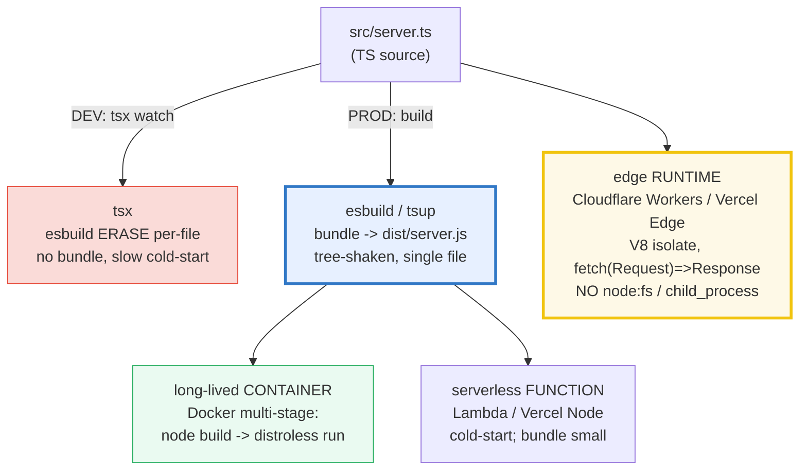
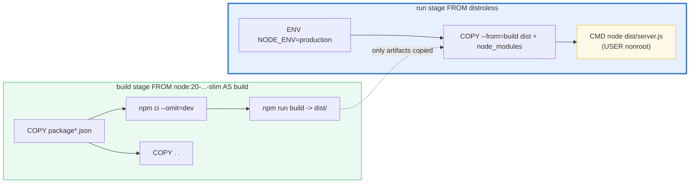
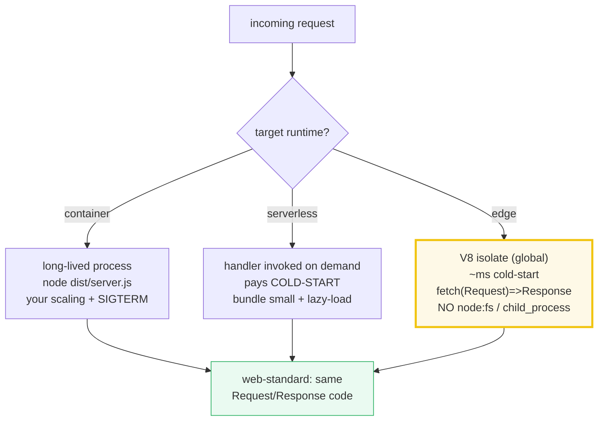

# DEPLOYMENT — Targets (container / serverless / edge) & Builds (tsx dev vs `dist/` prod)

> **Goal (one line):** show, by reading the repo's **own** `package.json`
> (engines / scripts / devDeps) and by asserting the **structure** of a
> hand-written multi-stage **Dockerfile**, a **12-factor** env-config loader, and
> an **edge Worker** snippet, that deploying a TS app means choosing a **target**
> (long-lived container, serverless function, or edge runtime) and a **build**
> (dev `tsx` type-erase vs prod `dist/` bundle) — the cross-language analog of
> Go's `scratch` static binary and Rust's `musl` static binary, both of which ship
> far smaller images than Node.
>
> **Run:** `just run deployment`
>
> **Ground truth:** [`web/deployment.ts`](./web/deployment.ts) → captured stdout
> in [`web/deployment_output.txt`](./web/deployment_output.txt). Every parsed
> value and `[check]` below is pasted **verbatim** from that file under a
> `> From deployment.ts Section X:` callout. Nothing is hand-computed.
>
> **Prerequisites:** 🔗 [`NODE_HTTP_SERVER`](./NODE_HTTP_SERVER.md) (the
> `server.close()` graceful-shutdown dance Section C documents), 🔗
> [`BUILD_TOOLING`](./BUILD_TOOLING.md) (the `esbuild`/`tsup` bundler that
> produces `dist/`), 🔗 [`MODULES_PACKAGES`](./MODULES_PACKAGES.md)
> (`package.json` `scripts`/`engines`/`bin`), 🔗 [`OBSERVABILITY`](./OBSERVABILITY.md)
> (stdout logging that containers capture).
>
> **Member:** `web/` — the production-deploy tier (HTTP server + structured logs
> are what gets containerized/serverless'd/edge'd).

---

## 1. Why this bundle exists (lineage)

Writing a correct TypeScript server is only half the job. The other half is
choosing **how it runs in production**, and that choice has two independent axes:

- **The BUILD** — *how source becomes executable code:*
  - **DEV** runs `tsx`: esbuild **erases types per-file** but does **not** bundle.
    Every cold-start re-parses every imported source file; you also pull
    `devDependencies` (test runners, type checkers, hot reload). Fine for a
    laptop, wrong for a container.
  - **PROD** bundles `src/` to a single tree-shaken `dist/server.js`
    (`esbuild`/`tsup`), sets `NODE_ENV=production` (strips dev-only code paths and
    lets package managers `--omit=dev` skip devDeps), then runs
    `node dist/server.js`.
- **The TARGET** — *where the built artifact runs:*
  - **Long-lived container** (Docker **multi-stage**: build on `node`, run on a
    slim **distroless** image — no shell, smallest attack surface).
  - **Serverless function** (Lambda / Vercel Node; package a handler; **cold-start**
    dominates, so bundle small + lazy-load).
  - **Edge runtime** (Cloudflare Workers / Vercel Edge: the **same** web-standard
    `fetch(Request) => Response` code runs on a **V8 isolate** globally — **no Node
    APIs** like `fs`/`child_process`).

Secrets **never** go in the image: **12-factor** config reads them from the
environment at boot. Containers capture **stdout** (logs to files are lost on
restart) and shut down **gracefully on `SIGTERM`**.



**The headline cross-language contrast** (the whole point of this bundle):

> 🔗 [`../go/DOCKER_K8S_DEPLOY.md`](../go/DOCKER_K8S_DEPLOY.md) — Go compiles to a
> **single static binary** (`CGO_ENABLED=0` + `-ldflags "-s -w"`) that runs
> `FROM scratch`: **no OS, no runtime, no shell**. That is the smallest, simplest
> deploy in the curriculum — Node *cannot* do this because it must ship V8 + libuv
> + `node_modules` inside the image. Go's probe model (`/healthz` vs `/readyz` +
> graceful `Shutdown(ctx)`) is exactly the model Section C documents.
>
> 🔗 [`../rust/`](../rust/) — Rust targets `x86_64-unknown-linux-musl` to produce a
> **single static binary** with the *same* advantage as Go (runs `FROM scratch`,
> ~10–30 MB). Rust shares Go's "one binary, empty image" deploy model; Node/TS
> must carry the runtime.

> **Determinism (§4.2):** this bundle **cannot** actually build/deploy (no
> network, no subprocess, no Docker). Instead it is **deterministic by
> construction**: it (1) **reads static config** (the repo's `package.json` via
> `node:fs`, resolved cwd-independently via `import.meta.url`); (2) **asserts the
> structure** of hand-written artifact snippets (a `Dockerfile`, a Worker) as plain
> strings — counting `FROM`s, checking for a `fetch` handler, asserting the
> **absence** of Node-only APIs; (3) demonstrates env/config + `NODE_ENV` behavior
> over **fixed mock env maps** (never the live `process.env`, which `tsx`/CI set
> unpredictably). No `Math.random`, no `Date.now`. Output is byte-stable.

---

## 2. Section A — Dev (`tsx` erase) vs Prod (bundle to `dist/`) + `NODE_ENV`

The first deployment decision is the **build**: what does "run my code" actually
mean? In dev it means **`tsx`** — esbuild strips types in-memory and runs each
file as-is (no bundle, no artifact). In prod it means **a bundle**: `tsup`/`esbuild`
tree-shakes the whole graph into one `dist/server.js`, and `node` runs *that*. The
`tsx` dev-run is paid for at every cold-start (re-parsing sources); the bundled
prod-run is paid once at build time (fast start, small deploy).

This bundle **reads the repo's real `package.json`** to anchor the claim — its
`engines.node` (`>=20`), its `packageManager` (`pnpm`), and its `devDependencies`
(`tsx` + `typescript`, the exact dev/prod toolchain split):

> From deployment.ts Section A:
> ```
> repo root package.json (READ via node:fs, cwd-independent):
>   name             = "tutorials-ts"
>   packageManager   = "pnpm@10.13.1"
>   engines.node     = ">=20.0.0"
>   engines.pnpm     = ">=10.0.0"
>   parsed Node major = 20
> [check] repo pins engines.node (present): OK
> [check] repo requires Node >= 20 (LTS): OK
> [check] repo packageManager starts with "pnpm": OK
>   devDependencies  = ["@types/node","tsx","typescript"]
> [check] devDependencies includes tsx (the dev runner): OK
> [check] devDependencies includes typescript (the type-check vet): OK
> [check] devDependencies includes @types/node (Node stdlib types): OK
> ```

`engines` and `packageManager` are the **deploy contract**: a CI runner or
`Dockerfile` `FROM node:20-...` must honor `engines.node`, and the lockfile +
`packageManager` field pin a reproducible install. The `devDependencies` carry the
**dev-only** toolchain — `tsx` (the runner) and `typescript` (the type-check vet)
— which production skips via `npm ci --omit=dev`.

**The dev/prod script split**, asserted on a sample deployable manifest:

> From deployment.ts Section A:
> ```
> sample deployable package.json (the dev/prod script split):
>   scripts.dev   = "tsx watch src/server.ts"
>   scripts.build = "tsup src/server.ts --format esm --dts"
>   scripts.start = "node dist/server.js"
> [check] dev script runs tsx (esbuild type-erase, NO bundle): OK
> [check] build script runs a bundler (tsup) that emits dist/: OK
> [check] start script runs node on dist/ (not tsx, not src/): OK
> [check] start script does NOT invoke tsx (prod runs the bundle): OK
> ```

**`NODE_ENV` — the production signal libraries and package managers read.**
`NODE_ENV=production` is checked by: **Express** (caches view templates, skips
verbose error stack traces), **React** (ships the optimized production build),
**npm/pnpm** (`--omit=dev` skips `devDependencies`), and V8 (some debug APIs
disabled). The detection is a single exact-string compare —
`process.env.NODE_ENV === "production"`:

> From deployment.ts Section A:
> ```
> NODE_ENV detection (isProduction over FIXED env maps):
>   isProduction({})                       = false
>   isProduction({NODE_ENV:"development"}) = false
>   isProduction({NODE_ENV:"production"})  = true
> [check] isProduction({}) is false (default): OK
> [check] isProduction({NODE_ENV:"development"}) is false: OK
> [check] isProduction({NODE_ENV:"production"}) is true: OK
> ```

> 🔗 [`MODULES_PACKAGES`](./MODULES_PACKAGES.md) — the `package.json` `scripts` /
> `engines` / `bin` fields read here. A published **CLI** would additionally ship a
> `bin` map (the command name → the entry `dist/` file the bundle produces).
>
> 🔗 [`BUILD_TOOLING`](./BUILD_TOOLING.md) — the `esbuild`/`tsup` bundler behind
> `scripts.build`, and why a single bundled `dist/` file matters for cold-start.

---

## 3. Section B — Docker multi-stage (build on `node` → run on `distroless`)

A multi-stage `Dockerfile` uses one `FROM` to **build** (full `node` image with
the bundler toolchain) and a second `FROM` to **run** (a minimal image that carries
*only* the bundle + prod `node_modules`). The run stage is **distroless** — no
shell, no package manager, smallest attack surface. This bundle asserts the
snippet's **structure** (two `FROM`s, the `--omit=dev` + `npm run build` step, the
`COPY --from=build`, `NODE_ENV=production`, non-root `USER`):

> From deployment.ts Section B:
> ```
> multi-stage Dockerfile FROM directives (the stages):
>     FROM node:20-bookworm-slim AS build
>     FROM gcr.io/distroless/nodejs22-debian12
> [check] Dockerfile has exactly 2 FROM stages (multi-stage build): OK
> [check] build stage base is "node" (full toolchain for tsx/tsup): OK
> [check] build stage is named "AS build": OK
> [check] run stage base is distroless (no shell, smallest surface): OK
> ```
> ```
>   build RUN lines: ["RUN npm ci --omit=dev && npm run build   # install prod deps + bundle -> dist/"]
> [check] build stage installs prod deps only (npm ci --omit=dev): OK
> [check] build stage bundles to dist/ (npm run build): OK
>   COPY --from=build lines: ["COPY --from=build /app/node_modules ./node_modules","COPY --from=build /app/dist ./dist"]
> [check] run stage copies dist/ from the build stage: OK
> [check] run stage copies node_modules from the build stage: OK
> [check] run stage sets ENV NODE_ENV=production: OK
> [check] run stage runs as a non-root USER: OK
> [check] Dockerfile declares an EXPOSE port: OK
> ```

**The build stage copies `package*.json` *before* the source** (a layer-cache
discipline straight from the Node.js Docker guide): the slow `npm ci` layer is
re-used across builds unless dependencies change. `npm ci` (not `npm install`)
gives fast, reproducible, lockfile-driven installs. The run stage then copies only
the **built artifacts** (`dist/` + prod `node_modules`) — the bundler toolchain,
source files, and devDeps never enter the final image.

**The image-size hierarchy** (the key cross-language point — Go and Rust win here
decisively):

> From deployment.ts Section B:
> ```
>   image-size hierarchy (documented, smallest first):
>     Go       : scratch        + ONE static binary (CGO=0)         ~ 10-20 MB
>     Rust     : scratch/distroless + ONE musl static binary       ~ 10-30 MB
>     Node     : distroless     + node runtime + node_modules      ~ 100-200 MB
>     Node     : node:slim      (full distro, has a shell)         ~ 200-400 MB
>     Node     : node:bookworm  (full Debian + build toolchain)    ~ 1 GB
> [check] documented: Go/Rust ship a SINGLE static binary (smallest): OK
> [check] documented: Node must carry the runtime + node_modules (largest): OK
> [check] documented: distroless has NO shell (smaller attack surface than slim): OK
> ```



---

## 4. Section C — 12-factor config, health checks, graceful `SIGTERM`, stdout

**12-factor config:** everything that **varies between deploys** (port, database
URL, log level, feature flags, *secrets*) is read from the **environment** with a
safe default — *never* baked into the image. The bundle asserts a `loadConfig`
loader over fixed env maps, showing both the defaults and overrides:

> From deployment.ts Section C:
> ```
> 12-factor config (loadConfig over FIXED env maps):
>   defaults  : {"port":3000,"databaseUrl":"postgres://localhost:5432/app","logLevel":"info"}
>   overrides : {"port":8080,"databaseUrl":"postgres://prod:5432/app","logLevel":"debug"}
> [check] default port === 3000 (when PORT unset): OK
> [check] default databaseUrl is a localhost placeholder: OK
> [check] default logLevel === "info": OK
> [check] override PORT=8080 is honored: OK
> [check] override DATABASE_URL is honored (NEVER baked in the image): OK
> [check] override LOG_LEVEL=debug is honored: OK
> [check] secrets come from env, never from the bundled dist/ image: OK
> ```

The 12-factor rule is *strict separation of config from code*: "config varies
substantially across deploys, code does not." A `DATABASE_URL` baked into
`dist/server.js` means a different image per environment — exactly the anti-pattern
12-factor forbids. Secrets injected as `ENV`/runtime env (and rotated via the
orchestrator's secret store) keep one image deployable everywhere.

**Health checks, graceful shutdown, and stdout logging** — the three operating
concerns a containerized service must implement:

> From deployment.ts Section C:
> ```
>   health checks (documented; the orchestrator probe model):
>     /healthz (liveness) -> 200 once the process is up; 503 => restart me
>     /readyz  (readiness)-> 200 once deps (DB) are warm;  503 => stop sending traffic
> [check] documented: liveness probes restart, readiness probes shed traffic: OK
> ```
> ```
>   graceful SIGTERM shutdown (documented; full dance in NODE_HTTP_SERVER):
>     1. process.on('SIGTERM') -> server.close() (stop NEW conns)
>     2. server.closeAllConnections() -> drain in-flight (Node >=18.2)
>     3. await drain -> process.exit(0) within the grace period
> [check] documented: SIGTERM -> server.close() -> drain -> exit 0: OK
> ```
> ```
>   logging (documented; the container sink model):
>     app -> pino -> STDOUT -> container runtime -> collector -> backend
>     (logging to a file is LOST on container restart)
> [check] documented: production logs go to stdout (containers capture it): OK
> ```

**Liveness vs readiness is not interchangeable.** Liveness (`/healthz`) failing
tells the orchestrator "restart me"; readiness (`/readyz`) failing tells it "stop
routing traffic to me but keep me alive" (e.g. while warming a DB connection pool).
Wiring readiness to liveness is a classic cause of needless restarts. **Graceful
shutdown** (`SIGTERM` → `server.close()` → drain → `exit 0`) is what prevents
dropped connections on every deploy — the full `close()` + `closeAllConnections()`
dance is implemented in 🔗 [`NODE_HTTP_SERVER`](./NODE_HTTP_SERVER.md). **Logs go to
stdout**, not files, because a container's filesystem is ephemeral: the runtime
captures stdout and a collector (Fluent Bit / Vector / Promtail) forwards it
(🔗 [`OBSERVABILITY`](./OBSERVABILITY.md)).

---

## 5. Section D — Serverless functions (cold-start) & edge runtimes (V8 isolate)

Two more targets move the deploy model past long-lived containers:

- **Serverless functions** (Lambda / Vercel Node) package a **handler** the platform
  invokes on demand. **Cold-start dominates** — the first request pays for module
  load + init — so the prod rules are **bundle small** (one `dist/` file) and
  **lazy-load** heavy deps. Instances are **ephemeral**: no in-memory state survives
  across requests.

- **Edge runtimes** (Cloudflare Workers / Vercel Edge) run the **same**
  web-standard code on a **V8 isolate** — like a browser tab's JS engine —
  distributed globally, with sub-millisecond cold-start. The shape is
  `export default { fetch(request, env, ctx) => Response }`: a standard `Request`
  comes in, a standard `Response` goes out. **No Node APIs** (`fs`,
  `child_process`, `require`) exist on the isolate surface.

This bundle asserts the **Worker snippet's structure** — and, crucially, the
**absence** of every Node-only API:

> From deployment.ts Section D:
> ```
>   serverless functions (documented; Lambda/Vercel Node):
>     - package a handler; the platform invokes it on demand
>     - cold-start dominates: bundle SMALL (one dist/ file)
>     - lazy-load heavy deps (don't pay their init cost until used)
>     - instances are EPHEMERAL: no in-memory state across requests
> [check] documented: serverless cold-start favors a small bundled artifact: OK
> ```
> ```
>   edge Worker snippet (hand-written; STRUCTURE asserted, NOT run):
>     export default {
>     async fetch(request, env, ctx) {
>     const url = new URL(request.url);
>     if (request.method === "GET" && url.pathname === "/") {
>     return new Response("hello from the edge", {
>     headers: { "content-type": "text/plain" },
>     });
>     }
>     return new Response("not found", { status: 404 });
>     },
>     };
> [check] Worker exports a default handler (export default): OK
> [check] Worker registers a fetch handler (fetch(request, env, ctx)): OK
> [check] Worker reads the standard Request (new URL(request.url)): OK
> [check] Worker returns a standard Response (new Response): OK
> [check] Worker sets a status via the Response init ({ status: 404 }): OK
> [check] Worker reads request.method (the HTTP verb): OK
> [check] Worker does NOT use node:fs (no Node file API on edge): OK
> [check] Worker does NOT use child_process (no process spawn on edge): OK
> [check] Worker does NOT use require() (ESM only on the isolate): OK
> [check] Worker does NOT use process.env directly (uses the `env` binding arg): OK
> ```

**The edge env model differs from Node's.** Node reads `process.env`; a Worker
receives bindings (env vars, secrets, KV/D1/R2 handles) as the **second `env`
argument** to `fetch`. The `require()` function does not exist — Workers are
**ESM-only**. Node compatibility is opt-in via a flag and partial; code that
reaches for `node:fs` or `child_process` will not run at the edge. The same
`fetch(Request) => Response` code, however, *also* runs unchanged on a Node server
via `@hono/node-server` — that web-standard shape is what lets one codebase target
container, serverless, and edge.

> From deployment.ts Section D:
> ```
>   deployment model contrast:
>     long-lived container : one process, your scaling, SIGTERM shutdown
>     serverless function  : handler invoked on demand; pays cold-start
>     edge Worker          : V8 isolate, global, ~ms cold-start, web APIs only
> [check] documented: edge runs a V8 isolate (sub-ms cold-start vs container): OK
> [check] documented: edge exposes web-standard APIs (Request/Response/fetch): OK
> ```



---

## 6. Section E — Cross-language image/deploy model

The deployment story is **where TypeScript/Node differs most sharply from Go and
Rust**. Go and Rust compile to a **single static binary** that runs `FROM scratch`
— no OS, no runtime, no shell, just the binary. Node **cannot** do this: it must
ship V8 + libuv + `node_modules` inside the image, so even a distroless Node image
is roughly an order of magnitude larger. TS compensates with its **edge
advantage**: the same `fetch(Request) => Response` code runs on a global V8 isolate
with no compile step to ship.

> From deployment.ts Section E:
> ```
>   cross-language deploy model (the headline contrast):
>     Go   : CGO_ENABLED=0 -> ONE static binary -> FROM scratch
>            (no runtime in the image; ~10-20 MB; THE smallest, simplest)
>     Rust : target x86_64-unknown-linux-musl -> ONE static binary -> scratch
>            (same single-binary advantage as Go; ~10-30 MB)
>     Node : must ship V8 + libuv + node_modules in the image
>            (distroless helps, but cannot reach scratch; ~100-200 MB)
> 
>   TS's compensating EDGE advantage (the place Node/TS wins):
>     - the SAME TS fetch(Request)=>Response code runs on a V8 isolate
>       globally (Cloudflare Workers/Vercel Edge) with ~ms cold-start;
>     - Go/Rust edge runtimes exist but TS/JS is the native edge citizen
>       (the V8 isolate IS the JS engine; no compile step to ship).
> [check] documented: Go compiles to a single static binary (CGO=0): OK
> [check] documented: Rust compiles to a single static binary (musl target): OK
> [check] documented: both Go and Rust run FROM scratch (no runtime in image): OK
> [check] documented: Node cannot reach scratch (must carry V8 + libuv + deps): OK
> [check] documented: Go/Rust images are ~1 order of magnitude smaller than Node: OK
> [check] documented: TS's edge advantage is zero-compile, web-standard, global V8: OK
> ```

> 🔗 [`../go/DOCKER_K8S_DEPLOY.md`](../go/DOCKER_K8S_DEPLOY.md) — the **headline
> parallel**: Go's `CGO_ENABLED=0` + `-ldflags "-s -w"` produces a single static
> binary deployed `FROM scratch` (the empty image). Node's distroless image is the
> closest *Node* can get, but it still embeds the runtime. Go's `/healthz` vs
> `/readyz` probe model and `Shutdown(ctx)` graceful drain are exactly Section C's
> model — implemented at the language level there, at the `server.close()` level
> here.
>
> 🔗 [`../rust/`](../rust/) — Rust's `x86_64-unknown-linux-musl` target gives the
> same single-binary / `FROM scratch` advantage as Go (~10–30 MB). The
> "compile-to-one-static-binary" deploy model is the shared property of
> ahead-of-time-compiled languages; Node's JIT-in-the-runtime design trades image
> size for zero compile step and a native edge runtime.

---

## 7. Pitfalls (the expert payoff)

| Trap | Symptom | Fix |
|---|---|---|
| Running `tsx` (or `node src/`) in prod | Re-parses every source file each cold-start; pulls devDeps; slow start | Bundle to `dist/` (`esbuild`/`tsup`); prod runs `node dist/server.js`. |
| Baking secrets / `DATABASE_URL` into the image | A different image per env; leaked secrets in registry layers | 12-factor: read `process.env` at boot; inject via the orchestrator's secret store. |
| `node:bookworm` (full Debian) as the run base | ~1 GB image; carries a shell + build toolchain = large attack surface | Multi-stage: build on `node:-slim`, run on **distroless** (no shell). |
| Copying `node_modules` from the host (no `.dockerignore`) | Overwrites the container's installed modules with host-specific binaries | `.dockerignore` `node_modules`; install inside the build stage with `npm ci`. |
| Copying source *before* `package.json` | The slow `npm ci` layer re-runs on every code change (cache bust) | `COPY package*.json` → `npm ci` → `COPY . .` (layer-cache discipline). |
| Installing devDeps in the run stage | Image carries test runners / type checkers = bloated + insecure | `npm ci --omit=dev` (or set `NODE_ENV=production`); devDeps stay in the build stage. |
| Running the container as `root` | A container escape = root on the host | `USER nonroot` in the distroless run stage (distroless ships a `nonroot` user). |
| `/healthz` wired to readiness (or vice-versa) | Needless restarts (liveness flapping) OR traffic to a not-ready instance | Liveness = "should I restart you?"; readiness = "should I route to you?". Keep them separate. |
| No `SIGTERM` handler | In-flight requests dropped on every deploy (orchestrator `SIGKILL`s after the grace period) | `process.on('SIGTERM')` → `server.close()` + `closeAllConnections()` → drain → `exit 0`. |
| Logging to a file | Lost on container restart (ephemeral FS) | Log to **stdout**; the runtime captures it → a collector → a backend. |
| Reaching for `node:fs` / `child_process` / `require` in an edge Worker | Build fails or runtime throws — those APIs don't exist on the V8 isolate | Use web-standard APIs (`fetch`, `Request`, `Response`) + bindings (`env`); ESM only. |
| `process.env.X` in a Worker | `process` is undefined at the edge | Read the `env` (2nd) argument to `fetch(request, env, ctx)`. |
| Assuming Node image size ≈ Go/Rust | Node image is ~10× larger (carries V8 + libuv + deps) | Right-size expectations; for the smallest image pick Go/Rust; for native edge pick TS. |
| `npm install` (not `npm ci`) in CI/Docker | Non-reproducible builds; drift from the lockfile | `npm ci` — fast, reproducible, lockfile-driven. |

---

## 8. Cheat sheet

```dockerfile
# === BUILD/DEPLOY SPLIT ======================================================
#   DEV : tsx watch src/server.ts        (esbuild ERASE per-file; no bundle)
#   PROD: npm run build -> dist/         (esbuild/tsup bundle; tree-shaken)
#         node dist/server.js            (run the bundle, NOT tsx, NOT src/)
#   NODE_ENV=production -> strips dev paths; lets --omit=dev skip devDeps.

# === MULTI-STAGE DOCKERFILE (node build -> distroless run) ===================
# syntax=docker/dockerfile:1
FROM node:20-bookworm-slim AS build       # full toolchain for tsx/tsup
WORKDIR /app
COPY package.json package-lock.json ./    # copy manifests FIRST (layer cache)
RUN npm ci --omit=dev && npm run build    # prod deps + bundle -> dist/
COPY . .
FROM gcr.io/distroless/nodejs22-debian12  # no shell, smallest surface
WORKDIR /app
ENV NODE_ENV=production
COPY --from=build /app/node_modules ./node_modules
COPY --from=build /app/dist ./dist        # only built artifacts enter the image
USER nonroot                              # never run as root
EXPOSE 3000
CMD ["dist/server.js"]

# === 12-FACTOR CONFIG ========================================================
#   loadConfig(env): every deploy-variable (PORT, DATABASE_URL, LOG_LEVEL) is
#   read from process.env with a default. NEVER bake secrets in dist/.
#   PORT = env.PORT ?? 3000 ; DATABASE_URL = env.DATABASE_URL ?? "<placeholder>"

# === OPERATING A CONTAINER ===================================================
#   /healthz (liveness) -> 200 up | 503 => RESTART me
#   /readyz  (readiness)-> 200 warm| 503 => STOP routing to me
#   SIGTERM -> server.close() + closeAllConnections() -> drain -> exit 0
#   logs -> STDOUT (not files; container FS is ephemeral)

# === TARGETS =================================================================
#   container : long-lived process, your scaling, graceful SIGTERM
#   serverless: handler on demand; COLD-START dominates -> bundle small, lazy-load
#   edge      : V8 isolate (global, ~ms cold-start); fetch(Request)=>Response;
#               NO node:fs / child_process / require; read env via the `env` arg

# === IMAGE-SIZE HIERARCHY (smallest first) ===================================
#   Go    scratch + static binary (CGO=0)              ~10-20 MB
#   Rust  scratch/distroless + musl static binary      ~10-30 MB
#   Node  distroless + node runtime + node_modules     ~100-200 MB
#   Node  node:slim (full distro, has shell)           ~200-400 MB
#   Node  node:bookworm (Debian + build toolchain)     ~1 GB
```

---

## Sources

Every structural assertion, parsed value, and behavioral claim above is verified
against the cited primary docs, then corroborated by at least one independent
secondary source. Every `[check]` is *additionally* asserted at runtime by the
`.ts` itself (the `check()` helper throws on any mismatch) — and, for this bundle,
every "documented" claim is grounded in the hand-written artifacts the file reads
and the static configs it parses. No network, no subprocess, no Docker.

- **Node.js — "Dockerizing a Node.js web app"** (the canonical `Dockerfile` shape;
  `FROM node`, `WORKDIR`, `COPY package*.json` + `RUN npm install` for layer
  caching, `npm ci --omit=dev` for production, `.dockerignore`, `EXPOSE`, `CMD`):
  https://nodejs.org/en/docs/guides/nodejs-docker-webapp
- **The Twelve-Factor App — III. Config** (*"strict separation of config from
  code. Config varies substantially across deploys, code does not"*; store config
  in the environment):
  https://12factor.net/config
- **Docker — Multi-stage builds** (multiple `FROM` statements; naming stages with
  `AS`; `COPY --from=<stage>` to carry only artifacts into the final image):
  https://docs.docker.com/build/building/multi-stage/
- **GoogleContainerTools/distroless** (distroless images: *"only your application
  and its runtime dependencies... no package managers, shells"*; the `nonroot`
  user; `gcr.io/distroless/nodejs*`):
  https://github.com/GoogleContainerTools/distroless
- **Cloudflare Workers — Overview** (a serverless platform running on V8 isolates
  across Cloudflare's global network; web-standard runtime APIs `Request` /
  `Response` / `fetch`; Node.js compatibility is opt-in):
  https://developers.cloudflare.com/workers/
- **Cloudflare Workers — Fetch Handler** (the `export default { async
  fetch(request, env, ctx) }` shape; `env` carries bindings/secrets; `ctx` for
  `waitUntil`):
  https://developers.cloudflare.com/workers/runtime-apis/handlers/fetch/
- **esbuild — API: Bundle** (the bundler behind `tsx` and `tsup`; tree-shaking +
  a single output file; the type-erase vs bundle distinction):
  https://esbuild.github.io/api/#bundle
- **npm — `npm ci`** (clean install from the lockfile; fast, reproducible;
  `--omit=dev` skips `devDependencies`; the production install used in the build
  stage):
  https://docs.npmjs.com/cli/v10/commands/npm-ci

**Secondary corroboration (independent of the primary docs, ≥1 per major claim):**
- Snyk — *"10 best practices to containerize Node.js web applications with
  Docker"* (multi-stage + distroless, non-root user, `npm ci`, layer caching):
  https://snyk.io/blog/10-best-practices-to-containerize-nodejs-web-applications-with-docker/
- iximiuz Labs — *"A Deeper Look into Node.js Docker Images"* (the slim /
  distroless / full-sized trade-offs and image-size hierarchy):
  https://labs.iximiuz.com/tutorials/how-to-choose-nodejs-container-image
- Phuong Nguyen — *"Docker multi-stage builds: shrinking a Node.js image from 1 GB
  to under 200 MB"* (the concrete size reduction multi-stage + distroless yields):
  https://www.anhphuong.dev/blog/docker-multi-stage-builds-shrinking-a-node-js-image-from-1-gb-to-under-200-mb
- PkgPulse — *"Cloudflare Workers vs Vercel Edge vs AWS Lambda 2026"* (V8 isolates
  vs containers; cold-start latency differences across edge/serverless runtimes):
  https://www.pkgpulse.com/guides/cloudflare-workers-vs-vercel-edge-vs-aws-lambda-2026

**Facts that could not be verified by running** (documented, not executed,
because this bundle has no network / subprocess / Docker): the exact image sizes
in the hierarchy are approximate ranges cited from the secondary sources above
(real sizes vary by app and base tag); the `npm ci --omit=dev` / Express `NODE_ENV`
/ Cloudflare V8-isolate behaviors are documented by their primary docs and not
re-executed here. The *structure* of every artifact (Dockerfile stage count,
Worker handler shape, absence of Node APIs) IS asserted at runtime by the `.ts`.
