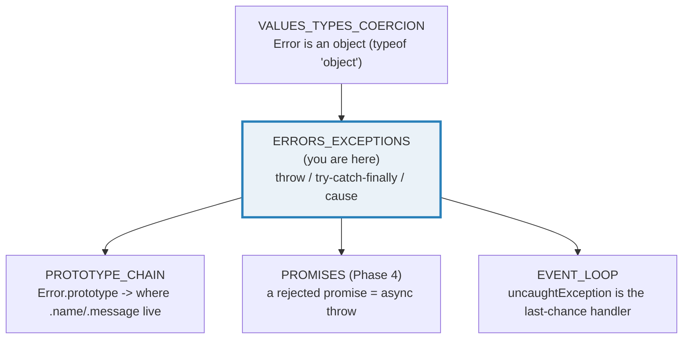
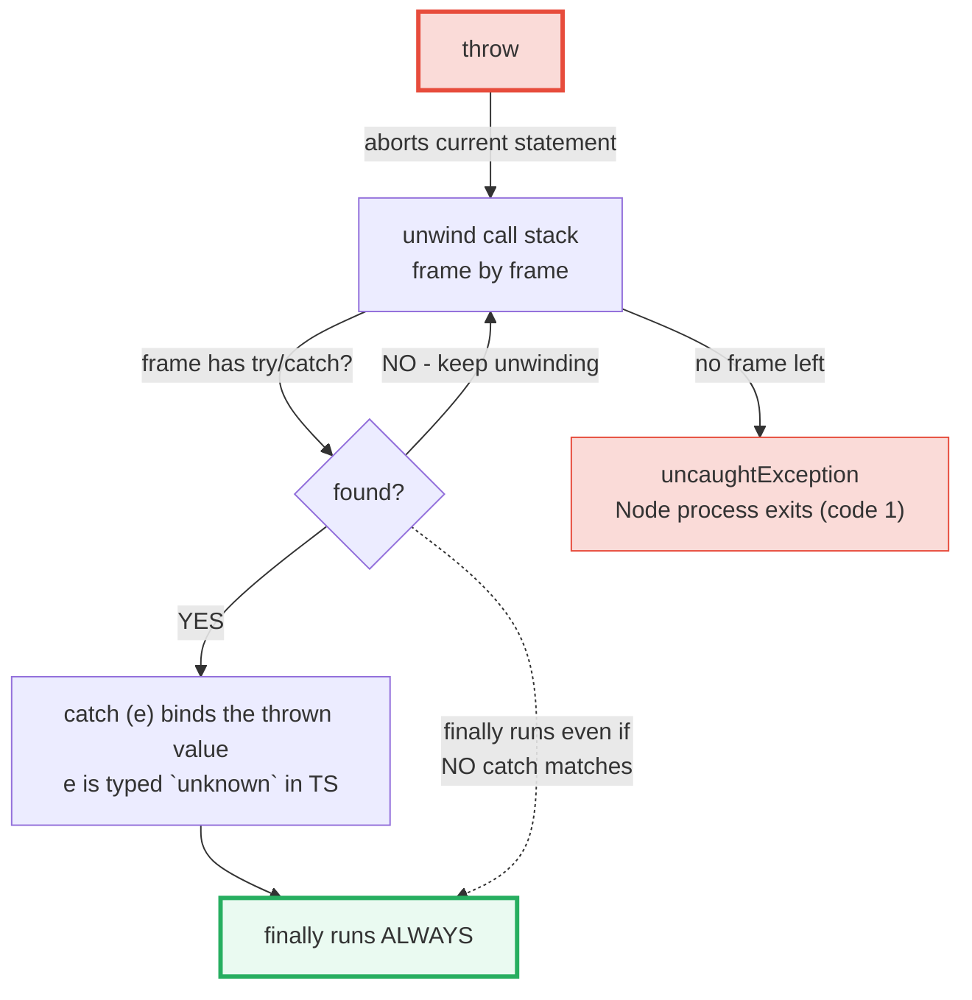
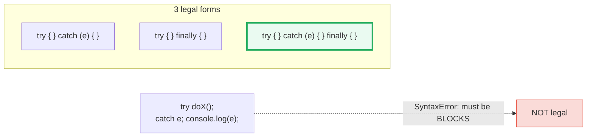
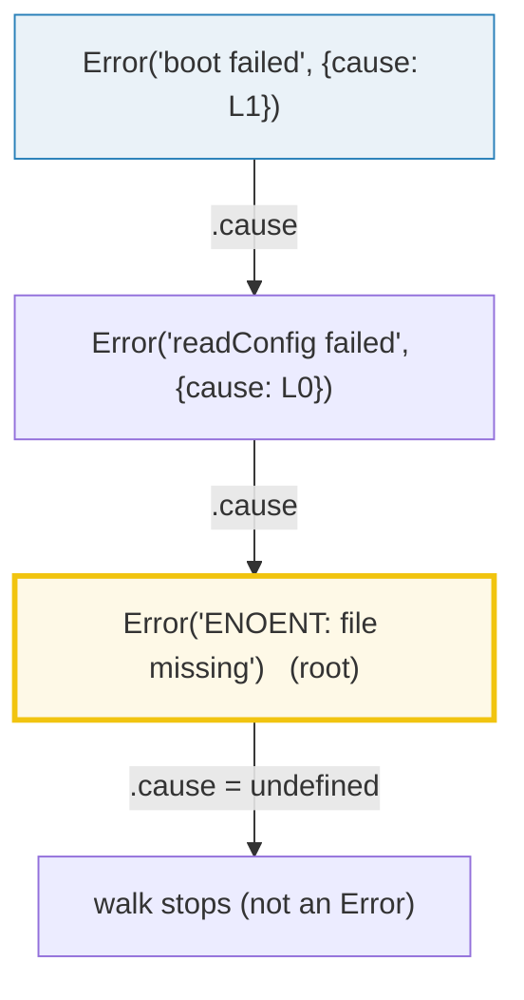

# ERRORS_EXCEPTIONS — throw / try-catch-finally / Error.cause / `never`

> **Goal (one line):** show, by printing every value, how JS's **throw-based**
> error model (the Python model, NOT Go's return-error) actually behaves —
> `throw <anything>`, `try/catch/finally` (where **finally ALWAYS runs**), the
> `Error` object + subclasses + the **ES2022 `Error.cause` chain**, and
> TypeScript's **`never`** type layered on top as the type of "never returns."
>
> **Run:** `just run errors_exceptions`
>
> **Ground truth:** [`errors_exceptions.ts`](./core/errors_exceptions.ts) →
> captured stdout in
> [`errors_exceptions_output.txt`](./core/errors_exceptions_output.txt). Every
> number/table below is pasted **verbatim** from that file under a
> `> From errors_exceptions.ts Section X:` callout. Nothing is hand-computed.
>
> **Prerequisites:** 🔗 [`VALUES_TYPES_COERCION`](./VALUES_TYPES_COERCION.md) —
> it pinned that objects are mutable, shared-by-reference values and that
> `typeof {} === "object"`. An `Error` IS one of those objects; this bundle
> opens the throw/catch machinery around it.

---

## 1. Why this bundle exists (lineage)

JavaScript made one foundational choice about errors: **there is only
`throw`.** There are no checked exceptions (Java), no `Result<T, E>` type
(Rust), and no `if err != nil` return-value convention (Go). A `throw`
**aborts the current statement and unwinds the call stack** frame by frame
until a `try/catch` catches it — and if nothing catches it, the Node process
**crashes** (`uncaughtException`). That is the entire error model at runtime.

On top of that runtime, TypeScript adds exactly **one** compile-time concept:
the **`never`** type, which marks functions that never return (because they
always `throw`). `never` is the bottom type — assignable to everything,
receivable from nothing — and it is what makes **exhaustive narrowing**
possible (the "assertNever" pattern). Everything else about TS errors is just
"the caught binding is `unknown`, narrow it with `instanceof`."



The headline contrast with the sibling languages is the whole point:

> 🔗 [`../go/ERRORS.md`](../go/ERRORS.md) — Go **returns** errors as values
> (`func f() (T, error)`) and forces an explicit `if err != nil` at every call
> site. There is **no `throw`** — errors are just data you choose to check.
> Go's philosophy is the **opposite** of JS's: handling is *forced* by the type
> system, never implicit. JS errors are *optional* to handle and propagate
> silently until caught.
>
> 🔗 [`../rust/ERROR_HANDLING.md`](../rust/ERROR_HANDLING.md) — Rust models
> recoverable errors as `Result<T, E>` (a sum type you must `match` on) and
> uses the `?` operator for propagation; `panic!` is the unrecoverable path.
> The compiler **proves** you handled every error. JS has no such proof — a
> forgotten `try/catch` compiles and crashes at runtime.
>
> 🔗 [`../python/EXCEPTIONS.md`](../python/EXCEPTIONS.md) — Python's
> `raise`/`try`/`except`/`else`/`finally` is **structurally closest** to JS.
> JS copied this model: `throw` = `raise`, `catch` = `except`, `finally` =
> `finally`. The one difference: Python has a rich exception **hierarchy**
> (checked at runtime via `isinstance`), while JS has a flat set of built-in
> `Error` subclasses and lets you `throw` literally anything.

---

## 2. The mental model: throw unwinds, finally always runs

A `throw` does not "return" — it **unwinds the call stack** looking for the
nearest enclosing `try`. If found, control jumps to that `catch`; if not, the
process dies. `finally` is the ONE block that runs on **every** exit path:
normal completion, `return`, `throw`, `break`, `continue`.



The three `try` forms (you MUST have a `catch` OR a `finally`, or both):



> From MDN — `try...catch` (verbatim): *"The `try...catch` statement is
> comprised of a `try` block and either a `catch` block, a `finally` block, or
> both… The code in the `finally` block will **always** be executed before
> control flow exits the entire construct."* And: *"the `try`, `catch`, and
> `finally` blocks must be *blocks*, instead of single statements"* —
> `try doX(); catch e;` is a `SyntaxError`.

> From MDN — `throw` (verbatim): *"The `throw` statement throws a user-defined
> exception. Execution of the current function will stop (the statements after
> `throw` won't be executed), and control will be passed to the first `catch`
> block in the call stack. **If no `catch` block exists among caller functions,
> the program will terminate.***" And on the value: *"The `throw` keyword can
> be followed by **any kind of expression**… In practice, the exception you
> throw should *always* be an `Error` object."*

---

## 3. Section A — throw ANYTHING + try/catch/finally + finally ALWAYS runs

> From errors_exceptions.ts Section A:
> ```
> throw <anything> (legal, but only Error is correct):
>   throw "string-thrown" -> caught === "string-thrown"? true
>   typeof caught value  -> string   (NOT an Error)
> [check] throw "x" -> caught value === "x" (a string, anti-pattern): OK
> [check] caught string is NOT an instanceof Error: OK
>   throw 42             -> caught === 42?        true
> [check] throw 42 -> caught value === 42 (a number): OK
>   throw {code:7}       -> caught.code === 7?    true
> [check] throw {code:7} -> caught object retains .code === 7: OK
> 
> try/catch/finally normal flow (no throw):
>   sequence: try -> finally
> [check] normal flow: try -> finally (catch skipped): OK
> 
> finally runs even when try RETURNS:
>   try { return 1 } finally { sideEffect() } -> returned 1, sideEffect ran? true
> [check] finally runs on try-return (before the value escapes): OK
> 
> finally runs even when try THROWS:
>   try { throw } finally { sideEffect() } -> sideEffect ran? true
> [check] finally runs on try-throw (before the throw propagates): OK
> 
> GOTCHA: finally's return OVERRIDES try's return:
>   try { return "from-try" } finally { return "from-finally" } -> "from-finally"
> [check] finally return overrides try return (returns "from-finally"): OK
> ```

**throw anything.** JS does not require the thrown value to be an `Error`. The
run proves `throw "string-thrown"` makes the caught binding the **string**
`"string-thrown"` (with no `.message`/`.stack`), `throw 42` makes it the
number `42`, and `throw {code:7}` makes it a plain object whose fields survive.
MDN's guidance is explicit: *"the exception you throw should always be an
`Error` object or an instance of an `Error` subclass… This is because code that
catches the error may expect certain properties, such as `message`, to be
present."* Throwing a string or a number silently breaks every `e.message`
read downstream — the **#1 anti-pattern** in JS error handling. (Section D
shows the safe normalization that defends against third-party code that does
this anyway.)

**finally ALWAYS runs — on return, on throw, and on normal completion.** The
three `finally` checks pin the three exit paths: (1) `try { return 1 }
finally { sideEffect() }` runs `sideEffect` **before** the `1` escapes the
function — the return value is computed first, then `finally` runs, then the
value is handed back; (2) `try { throw } finally { sideEffect() }` runs
`sideEffect` before the throw propagates up; (3) normal completion runs
`finally` last. This is why `finally` is the canonical place for resource
cleanup (closing files, releasing locks, aborting timers) — it is the **only**
block guaranteed to run on every path.

> From MDN — `try...catch` § "The finally block" (verbatim): *"Control flow
> will always enter the `finally` block… If the `finally` block is entered
> after a control flow statement (`return`, `throw`, `break`, `continue`) in
> the `try` or `catch` block, the effect of this statement is **deferred**
> until after the last statement executed in the `finally` block."*

**THE GOTCHA: a `return`/`throw` INSIDE `finally` overrides the try's.** The
run shows `try { return "from-try" } finally { return "from-finally" }`
returns **`"from-finally"`** — `finally`'s `return` **swallows** the try's
return value AND any pending throw from the try/catch blocks. MDN calls this
out directly: *"if the last statement executed in the `finally` block is itself
a control flow statement, that statement will **override** the effect of the
previous one… It is generally a bad idea to use control flow statements in the
`finally` block."* This is the single most dangerous `finally` trap: a
`finally { return }` silently eats every exception the `try` threw, turning a
crash into a silent wrong return value. **Keep `finally` cleanup-only.**

---

## 4. Section B — Error object + custom subclasses (the .name gotcha)

> From errors_exceptions.ts Section B:
> ```
> new Error('boom'):
>   .name    = "Error"
>   .message = "boom"
>   typeof .stack = string
>   .stack first line = "Error: boom"
> [check] new Error("boom").message === "boom": OK
> [check] new Error("boom").name === "Error": OK
> [check] Error.prototype.name === "Error": OK
> [check] typeof e.stack === "string": OK
> [check] e.stack includes "Error:" (V8 first line: "Error: <msg>"): OK
> [check] e.stack includes "at " (V8 stack-frame prefix): OK
> 
> Built-in Error subclasses (each sets its own .name):
>   TypeError        .name="TypeError"  instanceof Error? true
> [check] TypeError.name === "TypeError": OK
> [check] TypeError instanceof Error: OK
>   RangeError       .name="RangeError"  instanceof Error? true
> [check] RangeError.name === "RangeError": OK
> [check] RangeError instanceof Error: OK
>   SyntaxError      .name="SyntaxError"  instanceof Error? true
> [check] SyntaxError.name === "SyntaxError": OK
> [check] SyntaxError instanceof Error: OK
>   ReferenceError   .name="ReferenceError"  instanceof Error? true
> [check] ReferenceError.name === "ReferenceError": OK
> [check] ReferenceError instanceof Error: OK
>   URIError         .name="URIError"  instanceof Error? true
> [check] URIError.name === "URIError": OK
> [check] URIError instanceof Error: OK
> 
> Custom subclass MyError extends Error:
>   new MyError("custom").name    = "MyError"
>   new MyError("custom").message = "custom"
>   myErr instanceof MyError = true
>   myErr instanceof Error   = true
> [check] MyError sets .name === "MyError" (the fix): OK
> [check] myErr instanceof MyError: OK
> [check] myErr instanceof Error (subclass passes through): OK
> 
> THE .name GOTCHA: subclass WITHOUT this.name = ... :
>   new NamelessError("x").name = "Error"  (inherited "Error" — wrong!)
> [check] NamelessError without this.name inherits "Error" (the gotcha): OK
> [check] but nameless instanceof NamelessError still works: OK
> 
> Conditional handling via instanceof (EAFP style):
>   risky(-1)=RangeError:negative
>   risky(0)=TypeError:zero
>   risky(5)=5
> [check] instanceof dispatches RangeError vs TypeError correctly: OK
> ```

**The Error object has three load-bearing properties.** `new Error("boom")`
sets `.message === "boom"` (the constructor's first arg), `.name === "Error"`
(inherited from `Error.prototype.name`), and `.stack` — a **non-standard but
de-facto-universal** string whose first line is `"<name>: <message>"` followed
by `at <function> (<file>:<line>:<col>)` frames. The `.stack` format is
**engine-specific** (V8/Node, SpiderMonkey, JSC each differ), so the bundle
asserts only **substrings** (`includes("Error:")`, `includes("at ")`) — never
the full text. Asserting a full stack is the classic determinism trap: the
absolute file path, line numbers, and frame count all vary by machine and
Node version. 🔗 `VALUES_TYPES_COERCION` pinned that an `Error` is an object
(`typeof new Error() === "object"`); here we see its specific shape.

> From MDN — `Error` (verbatim): *"`Error` objects are thrown when runtime
> errors occur. The `Error` object can also be used as a base object for
> user-defined exceptions."* Instance properties: `message` (*"the string
> provided as the constructor's first argument"*), `name` (*"For
> `Error.prototype.name`, the initial value is `\"Error\"`. Subclasses like
> `TypeError`… provide their own `name` properties."*), `stack` (*"A
> non-standard property for a stack trace"*).

**Built-in subclasses each set their own `.name` on their prototype.** The run
confirms `TypeError`, `RangeError`, `SyntaxError`, `ReferenceError`, `URIError`
all report their own name AND all pass `instanceof Error` — the subclass
relationship is real (`TypeError.prototype.__proto__ === Error.prototype`, see
🔗 `PROTOTYPE_CHAIN`). The built-in hierarchy is: `AggregateError`,
`EvalError`, `RangeError`, `ReferenceError`, `SyntaxError`, `TypeError`,
`URIError`, `InternalError` (and the newer `SuppressedError` for
`using`/`DisposableStack`). There is **no** checked-exception taxonomy like
Java's — every one of these is just a `.name` label on an `Error`-shaped
object.

**Custom subclasses + the `.name` gotcha.** `class MyError extends Error`
works, and `instanceof MyError` + `instanceof Error` both pass — but there is
one trap the run pins explicitly: **extending `Error` does NOT carry over your
subclass name.** `new NamelessError("x").name === "Error"` (inherited from
`Error.prototype.name`), NOT `"NamelessError"`. The fix is one line in the
constructor: `this.name = "MyError"`. Without it, your `MyError` logs as
`Error: ...` — invisible in error-name switches, log greps, and Sentry
grouping. MDN's own custom-error example sets `this.name = "CustomError"` for
exactly this reason.

> From MDN — `Error` § "Custom error types" (verbatim): *"You might want to
> define your own error types deriving from `Error` to be able to `throw new
> MyError()` and use `instanceof MyError` to check the kind of error in the
> exception handler."* The example sets `this.name = "CustomError"` in the
> constructor.

**EAFP — Easier to Ask Forgiveness than Permission.** JS has no typed-exception
dispatch (unlike Java's `catch (SQLException e)`), so conditional handling is
`catch (e)` (typed `unknown`) followed by `instanceof` checks. The run's
`risky()` throws `RangeError` for negatives, `TypeError` for zero, and returns
normally otherwise — and the single `catch` dispatches via `instanceof`, then
**re-throws** anything it does not recognize (`else throw err`). That re-throw
is critical: never swallow an error you did not intend to handle.

---

## 5. Section C — Error.cause chaining (ES2022) + rethrow identity

> From errors_exceptions.ts Section C:
> ```
> Error.cause (ES2022):
>   root    = Error("disk full")
>   wrapped = Error("save failed", { cause: root })
>   wrapped.cause === root?  true
>   wrapped.cause.message   = "disk full"
> [check] wrapped.cause === root (identity preserved): OK
> [check] wrapped.cause.message === root.message: OK
> 
> Walking a 3-layer cause chain (each .cause is the prior error):
>   Error: boot failed
>   Error: readConfig failed
>   Error: ENOENT: file missing
> [check] cause chain walks 3 layers deep: OK
> [check] cause chain root is the ENOENT error: OK
> 
> cause can carry structured data (not just an Error):
>   err.cause = {"code":"E_INVALID","fields":["email","age"]}
> [check] cause can be a plain object (structured data): OK
> 
> Re-throw preserves identity (throw e keeps the original):
>   inner caught === original? true
>   outer caught === original? true
>   inner caught === outer caught? true
> [check] re-thrown error is the SAME identity at inner catch: OK
> [check] re-thrown error is the SAME identity at outer catch: OK
> [check] inner and outer caught the IDENTICAL object: OK
> 
> Wrapping makes a NEW object (identity changes; cause preserves root):
>   wrapped error === original?      false
>   wrapped error.cause === original? true
> [check] wrapping produces a NEW error (identity differs): OK
> [check] but wrapped.cause === original (root reachable): OK
> ```



**Error.cause (ES2022) — the proper way to wrap an error.** Before ES2022, the
only way to add context while re-throwing was to **lose** the original
(`throw new Error("save failed: " + e.message)` throws away `.stack`, the
type, and every field). `new Error("save failed", { cause: orig })` stores
`orig` on `.cause` — the run proves `wrapped.cause === root` (same object
reference, identity preserved) and `wrapped.cause.message === "disk full"`.
You can **walk** the chain by following `.cause` until it is no longer an
`Error` (the 3-layer walk hits `boot failed → readConfig failed → ENOENT`,
then stops). This is the JS analog of Go's `%w` wrapping and Rust's `source()`
chain — except it is a plain property, not a method, so there is no
`errors.Is`/`errors.As` walker in the stdlib (you write the `while` loop
yourself, as the `.ts` does).

> From MDN — `Error: cause` (verbatim): *"The `cause` data property of an
> `Error` instance indicates the specific original cause of the error. It is
> used when catching and re-throwing an error with a more-specific or useful
> error message in order to still have access to the original error."* And:
> *"The value of `cause` can be of **any type**."* Property attributes:
> `writable: yes, enumerable: no, configurable: yes`.

**cause is not always an Error — it can be structured data.** The run sets
`cause: { code: "E_INVALID", fields: ["email", "age"] }` — a plain object a
machine can parse, instead of a human-readable message that might be reworded.
MDN explicitly endorses this for library code: prefer structured `cause` over
asking consumers to parse `.message` (which is subject to rewording and breaks
parsing).

**Re-throw preserves identity; wrapping does not.** The run contrasts the two:
- `throw e` in a `catch` re-throws the **exact same object** — `inner caught
  === original` AND `outer caught === original` AND `inner caught === outer
  caught` (all three are the identical reference). The original `.stack` is
  intact; the throw site is unchanged. Use bare `throw` (or `throw e`) when you
  want to log-and-rethrow or add a `finally` cleanup without altering the
  error.
- `throw new Error("wrapped", { cause: e })` creates a **new** object —
  `wrappedSeen !== original` — but the original is reachable via `.cause`.
  Use this when you want to ADD context (a higher-level message) while keeping
  the root cause inspectable.

> From MDN — `try...catch` § "Nested try blocks" (verbatim): *"Any given
> exception will be caught only once by the nearest enclosing `catch` block
> unless it is rethrown."* The re-throw in the `.ts`'s `innerThrow()` proves
> this: the inner `catch` binds `e`, then `throw e` sends it back up to the
> outer `catch`.

---

## 6. Section D — catch-without-binding + normalization + propagation

> From errors_exceptions.ts Section D:
> ```
> catch without a binding (ES2019):
>   isValidJSON('{"a":1}')  = true
>   isValidJSON("not json") = false
> [check] isValidJSON accepts valid JSON: OK
> [check] isValidJSON rejects invalid JSON: OK
> 
> Safe normalization (turn any thrown value into an Error):
>   throw "oops"                 -> Error: "oops"  (cause kept? true)
> [check] throw "oops" normalizes to an Error: OK
>   throw 42                     -> Error: "42"  (cause kept? true)
> [check] throw 42 normalizes to an Error: OK
>   throw {code:1}               -> Error: "[object Object]"  (cause kept? true)
> [check] throw {code:1} normalizes to an Error: OK
>   throw new TypeError('t')     -> TypeError: "t"  (cause kept? true)
> [check] throw new TypeError('t') normalizes to an Error: OK
> 
> Propagation: C throws -> B (no catch) -> A catches:
>   a() caught: Error: "from-C"
>   stack frame count = 10  (throw site + call chain)
>   stack mentions function a? true
> [check] propagated error message is 'from-C' (thrown in c, caught in a): OK
> [check] stack recorded the call chain (>1 frame): OK
> ```

**catch without a binding (ES2019).** `try { ... } catch { ... }` — omit the
variable entirely when you do not inspect the thrown value. The run's
`isValidJSON` only cares "did `JSON.parse` throw?", so the binding is omitted.
This is also the clean fix for `noUnusedLocals` complaining about a caught
variable you would otherwise ignore. (Pre-ES2019 you had to write
`catch (_e)` with an underscore-prefixed name.)

> From MDN — `try...catch` § "Catch binding" (verbatim): *"If the `catch`
> block does not use the exception's value, you can omit the `exceptionVar`
> and its surrounding parentheses."*

**Safe normalization — defend against `throw <non-Error>`.** Because anyone
can `throw` anything (Section A), defensive code at a trust boundary normalizes
the caught value to an `Error` before reading `.message`. The run's
`normalize()` does exactly MDN's recommended pattern: if it is already an
`Error`, pass it through (identity preserved); otherwise wrap it with
`new Error(String(thrown), { cause: thrown })` so the original survives on
`.cause`. Note the `{code:1}` case: `String({code:1})` is `"[object Object]"`
(the default `Object.prototype.toString` — 🔗 `OBJECTS_RECORDS`), which is why
structured data belongs on `.cause`, not in `.message`.

> From MDN — `try...catch` § "Catch binding" (the normalization example,
> verbatim): *"The exception binding is writable. For example, you may want to
> normalize the exception value to make sure it's an `Error` object:
> `if (!(e instanceof Error)) { e = new Error(e); }`."*

**Propagation up the call stack.** The run's `c() → b() → a()` triple proves
the unwind: `c` throws `"from-C"`, `b` has no `try/catch` (so the throw sails
through its frame), and `a` catches it. The captured `.stack` has **10 lines**
(1 header + 9 frames) — it recorded the entire chain from the throw site
through `c`, `b`, `a`, `sectionD`, `main`, and the Node internals. That stack
is the **only** record of where the error originated; this is why preserving
identity on re-throw (Section C) matters so much — resetting the stack hides
the root cause.

**Uncaught errors crash the Node process.** If no `try/catch` on the call
stack catches the throw, Node emits an `uncaughtException` event on the
`process` object and then exits with code 1. This bundle does NOT reproduce
that (a process crash would fail `just check`); it is a documented fact:

> From Node.js docs — `process` § `uncaughtException` (verbatim): *"The
> `'uncaughtException'` event is emitted when an uncaught JavaScript exception
> bubbles all the way back to the event loop. By default, Node.js handles such
> exceptions by printing the stack trace to stderr and exiting with code 1."*

The **async** analog — an unhandled Promise rejection — is a separate path
that does NOT unwind the synchronous call stack; it surfaces as a
`unhandledRejection` event instead. That is 🔗 `PROMISES` (Phase 4)
territory; the one-line preview here is: **a `throw` inside an `async`
function or a `.then()` callback rejects the surrounding Promise**, and
`await` turns that rejection back into a synchronous-looking `throw` you can
`try/catch` — but if nobody `await`s or `.catch()`es, the rejection goes
**unhandled** and (in modern Node) crashes the process just like an uncaught
sync throw.

---

## 7. Section E — TypeScript `never`: the type of "never returns"

> From errors_exceptions.ts Section E:
> ```
> fail(msg): never  —  always throws, returns nothing:
>   fail("boom from fail()") -> threw: Error: "boom from fail()"
> [check] fail() throws at runtime (its TYPE is never; runtime behavior = throw): OK
> 
> never is assignable to EVERY type (verified by `just typecheck`):
>   (see neverIsBottomType(): `const x: string = fail("...")` typechecks,
>    because never is assignable to every type. Not executed at runtime.)
> [check] never is assignable to string/number/boolean/object (tsc-verifiable above): OK
> 
> Exhaustive narrowing: fail() as the exhaustive-switch fallback:
>   area({kind:"circle", r:2}) = 12.566371  (PI * 4)
>   area({kind:"square", s:3}) = 9
> [check] area(circle r=2) = PI * 4 (exhaustive narrowing works): OK
> [check] area(square s=3) = 9: OK
> ```

**`never` is TypeScript's one error-related compile-time concept.** A function
whose every code path `throw`s (or loops forever) has return type `never`. At
runtime, calling `fail()` just throws — `never` is **erased** by `tsx`/`tsc`
and leaves no trace (🔗 `VALUES_TYPES_COERCION` § "types are erased at
runtime"). The type exists purely so the compiler can reason about
unreachability: after a call to a `never`-returning function, **TS knows the
rest of the block is dead code**.

**`never` is the bottom type — assignable to EVERY type.** The `.ts` includes
a `neverIsBottomType()` function (never called at runtime — `tsx` never runs
it; `tsc` still type-checks it) that assigns `fail(...)`'s result to `string`,
`number`, `boolean`, and `object`. This compiles **only** because `never` is
assignable to every type. The inverse is also true (and is the other half of
the contract): **nothing is assignable to `never`** (except `never` itself) —
so `const n: never = 5` is a compile error. The `just typecheck` gate is what
verifies this claim; `tsx` cannot, because types are erased.

> From the TypeScript Handbook — Type Compatibility § "any, unknown, object,
> void, undefined, null, and never assignability" (verbatim): *"`unknown` and
> `never` are like inverses of each other. **Everything is assignable to
> `unknown`, `never` is assignable to everything. Nothing is assignable to
> `never**, `unknown` is not assignable to anything (except `any`)."* The
> assignability table shows the `never →` row (what never is assignable TO)
> as ✓ for every column, and the `never` column (what is assignable TO never)
> as ✕ for every row except `never → never` itself.

**Exhaustive narrowing — the assertNever pattern.** The run's `area()` switch
on `Shape.kind` handles `"circle"` and `"square"`; in the `default`, `s` is
narrowed to `never` (both union members are exhausted, so what remains is the
bottom type). Calling `fail("unreachable shape")` there typechecks because
`never` (fail's return) is assignable to `number` (the function's return
type). The payoff: if you later add `| { kind: "triangle"; ... }` to `Shape`
but forget to add a `case "triangle"`, the `default`'s `s` is **no longer
`never`** — accessing `s.kind` would narrow to `"triangle"`, and the compiler
can flag the missing case. This is the foundation of exhaustive-switch safety
in TS.

> From the TypeScript Handbook — `More on Functions` § "Return Type Never
> Never" (verbatim): *"The `never` type represents values which are never
> observed. In a return type, this means that the function throws an exception
> or terminates execution of the program… `never` also appears when TypeScript
> determines there is nothing left in a union."*

---

## 8. Pitfalls (the expert payoff)

| Trap | Symptom | Fix |
|---|---|---|
| `throw "message"` (or a number/plain object) | Caught value is a **string/number/object** with no `.message`/`.stack`/`.name`; downstream `e.message` is `undefined` | Always `throw new Error(...)`. At trust boundaries, normalize: `if (!(e instanceof Error)) e = new Error(String(e), { cause: e })`. |
| `finally { return ... }` | **Swallows** the try's return value AND any pending throw — a crash becomes a silent wrong return value | Keep `finally` cleanup-only; NEVER `return`/`throw`/`break`/`continue` from `finally`. |
| Custom `class MyError extends Error {}` without `this.name = ...` | `.name === "Error"` (inherited) — invisible in logs, error-name switches, and Sentry grouping | Set `this.name = "MyError"` in the constructor (one line). |
| Asserting `e.stack` exact text | Stack varies by Node version, absolute path, minification, and frame count — test flakes | Assert **substrings** only (`includes("Error:")`, `includes("at ")`), or assert `.message`/`.name` exactly. Never `===` a full stack. |
| `catch (e) { e.message }` under `strict` mode | TS error: `e` is `unknown` (via `useUnknownInCatchVariables`), so `.message` is not readable | Narrow first: `if (e instanceof Error) e.message`. Or type as `unknown` and switch on `typeof`/`instanceof`. |
| Unused catch variable under `noUnusedLocals` | Compile error: `'e' is declared but its value is never read` | Omit the binding: `catch { ... }` (ES2019), or prefix `_e`. |
| Swallowing errors: `catch (e) {}` | Every throw becomes a silent no-op — bugs hide forever | At minimum log; if you only handle specific types, `else throw e` to re-throw the rest. |
| `throw new Error("wrap: " + e.message)` to add context | Loses the original `.stack`, `.name`, and every field — the root cause is gone | Use `new Error("wrap", { cause: e })` (ES2022) so the original survives on `.cause`. |
| Walking `.cause` assuming it is always an `Error` | `cause` can be ANY value (a string, a plain object with structured data) — `.message` access throws or returns undefined | Guard the walk: `while (cursor instanceof Error) { ...; cursor = cursor.cause; }`. |
| Forgetting that an uncaught throw kills the Node process | A throw past the last `try/catch` triggers `uncaughtException` and exits code 1 — silent in long-running servers until the crash | Add a top-level `try/catch` (or `process.on('uncaughtException', ...)`) for graceful shutdown. Async analog: `unhandledRejection` (🔗 PROMISES). |
| Treating a Promise rejection like a sync throw | A rejected Promise does NOT unwind the sync stack; without `await`/`.catch()` it goes **unhandled** | `await` the Promise (rejection re-surfaces as a throw), or `.catch()`. See 🔗 PROMISES (Phase 4). |
| Assuming `instanceof Error` is enough for subclass identity | `e instanceof MyError` works, but if the subclass was created in a different realm (iframe/worker/vm context) the prototypes differ and `instanceof` lies | Check `.name` as a fallback, or pass errors across realm boundaries via structured clone (Error is serializable). |
| `throw\nnew Error()` on two lines | ASI turns it into `throw;` + `new Error()` — `throw;` is a `SyntaxError` (throw requires an expression) | Keep the expression on the same line, or wrap in parens: `throw (new Error())`. |

---

## 9. Cheat sheet

```typescript
// === throw =================================================================
//   throw <expression>;          // ANY value is legal (string, number, object...)
//   throw new Error("msg");      // the CORRECT form (always throw an Error)
//   throw new TypeError("msg");  // or a built-in/ custom subclass
//   throw e;                     // re-throw (preserves identity + stack)

// === try / catch / finally (3 legal forms) =================================
//   try { ... } catch (e) { ... }              // catch binds the thrown value
//   try { ... } finally { ... }                // finally ALWAYS runs
//   try { ... } catch (e) { ... } finally { ... }
//   try { ... } catch { ... }                  // ES2019: omit binding if unused
//   RULE: finally runs on EVERY exit (normal, return, throw, break, continue).
//   GOTCHA: a return/throw INSIDE finally OVERRIDES the try's. Keep finally cleanup-only.

// === The Error object ======================================================
//   new Error("msg")           -> .message="msg", .name="Error", .stack="<engine-specific>"
//   Error.prototype.name       === "Error"
//   .stack format is V8-specific: first line "<name>: <message>", then "at fn (file:L:C)" frames.
//   Assert SUBSTRINGS of .stack, never the full text (paths/lines vary).

// === Built-in subclasses (each sets its own .name) =========================
//   TypeError RangeError SyntaxError ReferenceError URIError
//   EvalError AggregateError InternalError SuppressedError
//   all pass  instanceof Error  AND  have their own .name on their prototype.

// === Custom subclass (MUST set .name) ======================================
//   class MyError extends Error {
//     constructor(msg: string) { super(msg); this.name = "MyError"; } // <-- the fix
//   }
//   new MyError("x") instanceof MyError  // true
//   new MyError("x") instanceof Error    // true (subclass chain)

// === Error.cause (ES2022) — wrap without losing the root ===================
//   new Error("higher-level msg", { cause: origError })
//   wrapped.cause === origError          // identity preserved
//   cause can be ANY type (Error, plain object, string) — guard the walk:
//     let c: unknown = err;
//     while (c instanceof Error) { ...; c = c.cause; }

// === Conditional handling (EAFP — no typed catch in JS) ====================
//   try { risky(); }
//   catch (e) {                       // e is `unknown` under strict (useUnknownInCatchVariables)
//     if (e instanceof RangeError) { ... }
//     else if (e instanceof TypeError) { ... }
//     else throw e;                   // re-throw what you don't handle
//   }

// === Normalize a non-Error throw at a trust boundary =======================
//   function normalize(t: unknown): Error {
//     return t instanceof Error ? t : new Error(String(t), { cause: t });
//   }

// === TypeScript `never` (the only error-related compile-time concept) ======
//   function fail(msg: string): never { throw new Error(msg); }
//   // never = the bottom type: assignable to EVERY type; nothing assignable to never.
//   // After a never-returning call, code is UNREACHABLE -> exhaustive-switch safety:
//   switch (s.kind) {
//     case "a": return ...;
//     case "b": return ...;
//     default: return fail("unreachable");  // s is `never` here
//   }

// === Uncaught = process crash ==============================================
//   Sync: uncaught throw -> process 'uncaughtException' -> exit code 1.
//   Async: unhandled rejection -> 'unhandledRejection' -> exit code 1 (modern Node).
//   (See 🔗 PROMISES for the async error path.)
```

---

## Sources

Every signature, behavioral claim, and verbatim quote above was verified
against the MDN Web Docs and the TypeScript Handbook, then corroborated by at
least one independent secondary source. Every runtime claim is *additionally*
asserted by the `.ts` itself (`check()` throws on any mismatch) — the strongest
possible verification: the actual V8/Node engine's verdict. The TypeScript
type-level claims (`never` assignability, `unknown` catch bindings) are
verified by the `just typecheck` gate (tsc strict mode).

- **MDN — `try...catch`** (3 forms; catch binding optional; finally ALWAYS
  runs; finally's return/throw overrides try's; nested try + re-throw):
  https://developer.mozilla.org/en-US/docs/Web/JavaScript/Reference/Statements/try...catch
- **MDN — `throw`** (*"throws a user-defined exception… control will be passed
  to the first `catch` block in the call stack. If no `catch` block exists
  among caller functions, the program will terminate"*; *"can be followed by
  any kind of expression… should always be an `Error`"*; ASI gotcha):
  https://developer.mozilla.org/en-US/docs/Web/JavaScript/Reference/Statements/throw
- **MDN — `Error`** (`.name`/`.message`/`.stack`/`.cause`; built-in subclass
  list; custom error types; the `this.name = "CustomError"` constructor fix):
  https://developer.mozilla.org/en-US/docs/Web/JavaScript/Reference/Global_Objects/Error
- **MDN — `Error: cause`** (ES2022; *"the specific original cause of the
  error"*; *"the value of `cause` can be of any type"*; property attributes
  `writable: yes, enumerable: no, configurable: yes`):
  https://developer.mozilla.org/en-US/docs/Web/JavaScript/Reference/Global_Objects/Error/cause
- **MDN — Control flow and error handling (Guide)** (the exception-handling
  overview; EAFP; conditional catch via `instanceof`):
  https://developer.mozilla.org/en-US/docs/Web/JavaScript/Guide/Control_flow_and_error_handling
- **TypeScript Handbook — Type Compatibility** § *"any, unknown, object, void,
  undefined, null, and never assignability"* (the assignability matrix;
  *"`unknown` and `never` are like inverses… `never` is assignable to
  everything. Nothing is assignable to `never`"*):
  https://www.typescriptlang.org/docs/handbook/type-compatibility.html#any-unknown-object-void-undefined-null-and-never-assignability
- **TypeScript Handbook — More on Functions** (the `never` return type;
  *"represents values which are never observed… the function throws an
  exception or terminates execution"*):
  https://www.typescriptlang.org/docs/handbook/2/functions.html#return-type-void
- **TypeScript TSConfig Reference — `useUnknownInCatchVariables`** (*"Default:
  `true` if `strict`; `false` otherwise"*; released 4.4; *"you do not need the
  additional syntax (`: unknown`) nor a linter rule"*):
  https://www.typescriptlang.org/tsconfig/#useUnknownInCatchVariables
- **Node.js Docs — `process` § `uncaughtException`** (*"emitted when an
  uncaught JavaScript exception bubbles all the way back to the event loop…
  printing the stack trace to stderr and exiting with code 1"*):
  https://nodejs.org/api/process.html#event-uncaughtexception
- **ECMAScript® 2027 Language Specification (tc39.es/ecma262)**:
  - The `throw` statement: https://tc39.es/ecma262/multipage/ecmascript-language-statements-and-declarations.html#sec-throw-statement
  - The `try` statement: https://tc39.es/ecma262/multipage/ecmascript-language-statements-and-declarations.html#sec-try-statement
  - Error objects + `InstallErrorCause`: https://tc39.es/ecma262/multipage/fundamental-objects.html#sec-error-objects

**Secondary corroboration (independent of MDN, ≥1 per major claim):**
- The Modern JavaScript Tutorial (javascript.info) — *"Custom errors, extending
  Error"* (the `this.name` fix; `instanceof` for subclass dispatch; the
  `Error.captureStackTrace` V8 optimization):
  https://javascript.info/custom-errors
- 2ality (Axel Rauschmayer) — *"`Error.cause`"* (the ES2022 chaining
  motivation; structured-data-as-cause; why it supersedes ad-hoc wrapping):
  https://2ality.com/2021/06/error-cause.html
- Total TypeScript — *"How to throw errors in TypeScript the safe way"*
  (`never`-returning assertion functions; `unknown` catch narrowing; the
  exhaustive-switch `assertNever` pattern):
  https://www.totaltypescript.com/articles/how-to-throw-an-error-in-typescript-the-safe-way
- Stack Overflow — *"What's a good way to extend Error in JavaScript?"*
  (multi-answer corroboration of the `this.name` gotcha + the
  `Object.setPrototypeOf` workaround for transpiled pre-ES6 targets — cited by
  MDN's own custom-error page):
  https://stackoverflow.com/questions/1382107/whats-a-good-way-to-extend-error-in-javascript

**Facts that could not be verified by running** (documented, not executed,
because executing them would crash the process or require compile-time
inspection): (1) the `uncaughtException` process-exit behavior — reproducing it
would terminate the `tsx` run and fail `just check`; confirmed by Node.js docs.
(2) The `never`-is-assignable-to-every-type claim — this is a **compile-time**
property verified by the `just typecheck` gate (the `neverIsBottomType()`
function compiles only because of it), not by `tsx` output. (3) The TS FAQ note
that extending `Error` needs `Object.setPrototypeOf` when transpiled to
pre-ES6 — irrelevant here (`core/` targets ES2023 natively), but documented for
readers on legacy targets. No runtime claim above is unverified.
