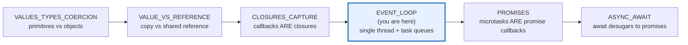
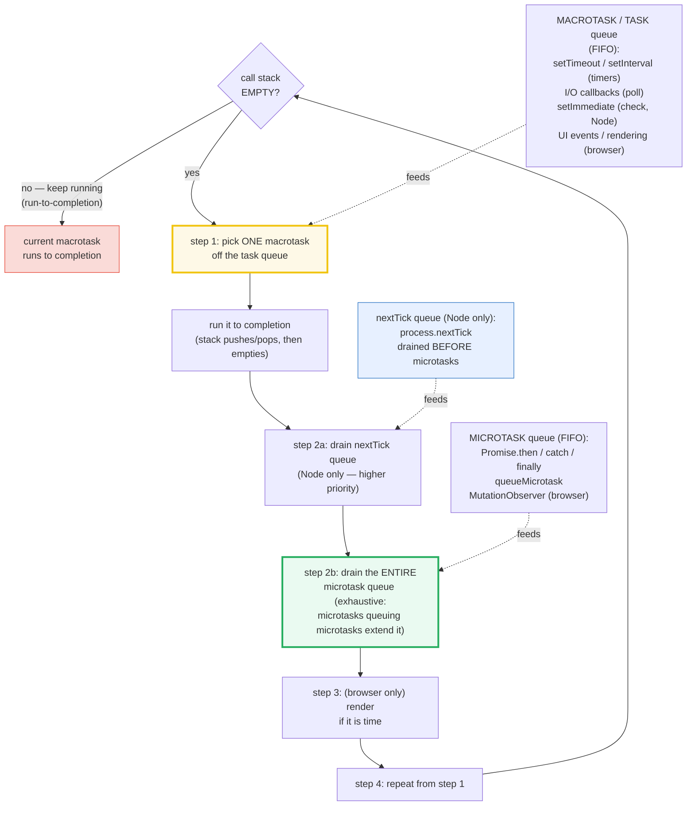
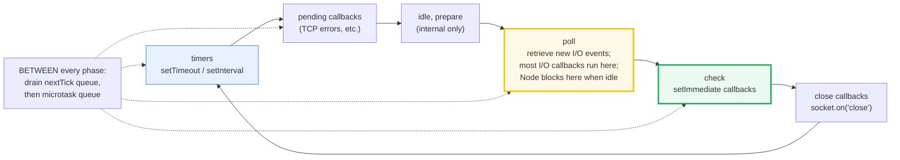

# EVENT_LOOP — The Single Thread, Microtasks vs Macrotasks & libuv Phases

> **Goal (one line):** show, by collecting each callback's label into an array in
> the exact ORDER it fires, that JS is single-threaded with a **deterministic**
> microtask-before-macrotask event loop — the defining constraint of the language
> and the cross-language pivot.
>
> **Run:** `just run event_loop`
>
> **Ground truth:** [`core/event_loop.ts`](./core/event_loop.ts) → captured stdout
> in [`core/event_loop_output.txt`](./core/event_loop_output.txt). Every
> interleaving and ordering below is pasted **verbatim** from that file under a
> `> From event_loop.ts Section X:` callout. Nothing is hand-computed.
>
> **Prerequisites:** [`CLOSURES_CAPTURE`](./CLOSURES_CAPTURE.md) (Phase 3 — every
> callback below is a closure) and [`VALUE_VS_REFERENCE`](./VALUE_VS_REFERENCE.md)
> (the `log` array is a shared reference mutated through closures). This is the
> **foundational Phase 4 bundle** — every later async bundle leans on it.

---

## 1. Why this bundle exists (lineage)

JavaScript is **single-threaded**. There is one call stack; no two lines of user
JS run simultaneously (worker threads aside — they are **separate agents**, each
with its own stack and loop: 🔗 `WORKER_THREADS`). The **event loop** is the
mechanism that lets that one thread do "concurrent" I/O: it runs the current task
**to completion**, drains **all** queued microtasks, then picks the next task —
repeating forever. This single rule is *the* defining constraint of JS, and it
explains:

- why `Promise.then` **always** runs before `setTimeout(fn, 0)` (a microtask
  drains before the next macrotask);
- why **blocking the loop blocks everything** (a macrotask can only be picked
  when the stack is empty) — the "don't block the event loop" rule;
- why **async I/O is how Node scales on one thread** (I/O is offloaded to the OS
  kernel / libuv's thread pool; the callback resumes on the loop).



This bundle is the pivot for the whole **cross-language concurrency** set. JS
achieves concurrency by *interleaving* callbacks on one thread; the other
languages do it by *actually running in parallel*:

> 🔗 [`../go/GOROUTINES.md`](../go/GOROUTINES.md) — Go runs **goroutines** on an
> **M:N scheduler**: many goroutines multiplexed onto OS threads, scheduled
> across **multiple cores** → **true parallelism**. Two goroutines execute
> simultaneously; in JS two callbacks **never** do. Go's `go func()` is the
> opposite of the event loop — it does not wait for the stack to empty.
>
> 🔗 [`../rust/ASYNC_BASICS.md`](../rust/ASYNC_BASICS.md) — Rust separates
> **OS threads** (`std::thread`, preemptive, truly parallel) from **async/await**
> (cooperative `Future`s driven by a *runtime* like Tokio, which is **opt-in**).
> JS has no choice: V8 *is* the runtime, the event loop *is* the scheduler, and
> it is single-threaded by construction. Rust makes you pick; JS picks for you.
>
> 🔗 [`../python/ASYNCIO_BASICS.md`](../python/ASYNCIO_BASICS.md) — Python's
> **asyncio** is JS's **closest sibling**: also a single-threaded event loop
> (under the GIL), also cooperative (`await` yields control), also a task queue.
> The mental model transfers almost 1:1 — the main difference is Python runs
> other threads (GIL-serialized) whereas JS has exactly one.

---

## 2. The mental model: one thread, two queues, one rule

Every JS agent (a window, a worker, a Node worker thread) has three things: a
**heap** (objects), a **stack** (execution contexts — the call stack, LIFO), and
a **queue** (jobs). The event loop's entire behavior follows from **one rule**,
restated as a 4-step cycle:



Read the diagram top-down. The two facts that produce every surprising result:

1. **Run-to-completion** (MDN): each job is processed *completely* before any
   other job. A function, once entered, **cannot be preempted** mid-statement.
2. **Microtasks drain exhaustively before the next macrotask** (HTML spec / the
   ECMAScript job queue): after a macrotask finishes and the stack empties, the
   loop runs *every* queued microtask — including new ones queued by those
   microtasks — *before* it ever picks the next macrotask. That is why
   `Promise.then` always beats `setTimeout(0)`.

> From MDN — *JavaScript execution model* ("Run-to-completion"): *"Each job is
> processed completely before any other job is processed … whenever a function
> runs, it cannot be preempted and will run entirely before any other code runs
> (and can modify data the function manipulates)."* And ("Never blocking"):
> *"JavaScript execution is never blocking. Handling I/O is typically performed
> via events and callbacks."*

> From the Node.js docs — *The Node.js Event Loop*: *"The event loop is what
> allows Node.js to perform non-blocking I/O operations — despite the fact that a
> single JavaScript thread is used by default — by offloading operations to the
> system kernel whenever possible."*

---

## 3. Section A — Single thread, one call stack, "run-to-completion"

The single-threaded guarantee is best seen through MDN's canonical example: two
`.then` callbacks on an already-resolved promise, each doing `i += 1` then
recording `i`. A **preemptive** scheduler could interleave them (`i+=1; i+=1;
record; record` → both would record `i=2`). The JS event loop **never
preempts**: each callback runs fully before the next, so the only possible order
is `1` then `2`. We **collect** each callback's label into an array in firing
order, then print the array once — so the captured order *is* the real firing
order (the **collect-then-print** technique; see §8 on determinism).

> From event_loop.ts Section A:
> ```
> Run-to-completion (MDN's canonical example):
>   const p = Promise.resolve(); let i = 0;
>   p.then(() => { i += 1; record(`first: i=${i}`); });
>   p.then(() => { i += 1; record(`second: i=${i}`); });
>   collected firing order -> ["first: i=1","second: i=2"]
>   (a preemptive scheduler could interleave -> both would see i=2;)
>   (JS NEVER preempts mid-statement -> each callback runs to completion.)
> [check] run-to-completion: order is [first i=1, second i=2] (never interleaved): OK
> ```

**The 4-step cycle, stated precisely** (the loop's "one rule"):

> From event_loop.ts Section A:
> ```
> The event loop's ONE rule (run one task, drain ALL microtasks, repeat):
>   step 1: pick ONE macrotask (task) -> run to completion (stack empties)
>   step 2: drain the ENTIRE microtask queue (incl. microtasks queued by microtasks)
>   step 3: (browser only) render, if it is time
>   step 4: repeat from step 1
> [check] single thread: only ONE macrotask runs at a time (stack empties between tasks): OK
> ```

**Why two `setInterval` callbacks never interleave.** The same run-to-completion
rule means that if two intervals are due "at the same time," their callbacks
still execute **sequentially**, one fully then the other — never with their
statements interleaved. There is no preemption, ever. (The collect-then-print
technique demonstrates this: push a label per callback, observe a clean
non-interleaved sequence.)

> 🔗 `CLOSURES_CAPTURE` — every callback queued here is a **closure** over the
> `log` array (and `i`, `sum`, etc.). The array survives because the closure
> retains it; the single-threaded model means the closure's mutations are
> race-free (no two callbacks touch `log` at once — that is *why* shared mutable
> state is safe in JS where it would corrupt in Go/Rust).

---

## 4. Section B — THE payoff: microtask before macrotask (collect-then-print)

This is the headline result of the bundle. Schedule, in source order: a
synchronous push, a `setTimeout(0)` macrotask, and a `Promise.then` microtask.
The firing order is **fully determined by the spec**: the sync line runs now (on
the stack); when the stack empties, **all microtasks drain first** (so the
promise callback fires); only **then** does the next macrotask run (the timeout).
Result: `["sync","micro","timeout"]`.

> From event_loop.ts Section B:
> ```
> THE classic interleaving (sync vs setTimeout(0) vs Promise.then):
>   log.push('sync');                                  // runs NOW (on stack)
>   setTimeout(() => log.push('timeout'), 0);          // queues a MACROTASK
>   Promise.resolve().then(() => log.push('micro'));   // queues a MICROTASK
>   collected firing order -> ["sync","micro","timeout"]
>   => microtask drains BEFORE the next macrotask. Promise.then ALWAYS beats setTimeout(0).
> [check] microtask before macrotask: order is [sync, micro, timeout]: OK
> ```

**The drain is EXHAUSTIVE.** A microtask that schedules another microtask
*extends* the drain — the loop does not move on to macrotasks until the
microtask queue is truly empty. This is the mechanism behind **microtask
starvation** (Section C): an infinite microtask chain would never let a timer
fire. Here a *finite* chain of three proves the rule:

> From event_loop.ts Section B:
> ```
> Microtasks scheduling microtasks (the drain is EXHAUSTIVE):
>   // step(n) pushes `micro-n` then, if n<3, queues step(n+1) as a microtask
>   setTimeout(() => chained.push('timeout'), 0);
>   Promise.resolve().then(() => step(1));
>   collected firing order -> ["micro-1","micro-2","micro-3","timeout"]
>   => ALL three microtasks drain before the single macrotask fires.
> [check] chained microtasks all drain before the macrotask: OK
> ```

This is Jake Archibald's famous "In the loop" result, reproduced: *"each
microtask drains the whole microtask queue, including any microtasks it adds,
before the next task runs."* It is *why* `await` and `.then` are async — they
queue a microtask, and that microtask cannot run until the current stack empties
and microtask drain begins.

> 🔗 `PROMISES` — this bundle shows the **mechanism**; the Promises bundle shows
> the **state machine** (pending/fulfilled/rejected) and combinators
> (`all`/`race`/`allSettled`/`any`) that all funnel back into this microtask queue.
>
> 🔗 `ASYNC_AWAIT` — `await p` **desugars** to `.then`: it splits the function at
> the `await`, wrapping the rest as a microtask continuation on `p`. Every
> `await` here re-enters the exact microtask queue pinned in this section.

---

## 5. Section C — `queueMicrotask`, `process.nextTick` (Node) & starvation

**`queueMicrotask(fn)`** is the explicit API to schedule a microtask — the *same*
queue `Promise.then` uses, so it runs before the next macrotask:

> From event_loop.ts Section C:
> ```
> queueMicrotask schedules a MICROTASK (same queue as Promise.then):
>   setTimeout(() => qm.push('timeout'), 0);
>   queueMicrotask(() => qm.push('queueMicrotask'));
>   qm.push('sync');
>   collected firing order -> ["sync","queueMicrotask","timeout"]
> [check] queueMicrotask runs after sync, before the setTimeout macrotask: OK
> ```

**`process.nextTick`** is a **Node-only** queue (not in browsers, not in the
ECMAScript spec). Per the Node.js docs it is *"not technically part of the event
loop"* — the `nextTickQueue` is processed *after the current operation*
regardless of phase, and it has **higher priority than the microtask queue**:

> From event_loop.ts Section C:
> ```
> process.nextTick (Node-only) runs BEFORE Promise.then (higher priority):
>   // scheduled from inside a setTimeout (macrotask) callback:
>   process.nextTick(() => nt.push('nextTick'));       // Node-only queue
>   Promise.resolve().then(() => nt.push('microtask')); // microtask queue
>   nt.push('sync');
>   collected firing order -> ["sync","nextTick","microtask"]
>   => nextTick queue drains before the microtask queue (Node-specific).
>   CAVEAT: at top level / inside an async resumption the order can flip
>           (V8's microtask checkpoint drains promises first there).
> [check] process.nextTick fires before Promise.then (macrotask context, Node): OK
> ```

**EXPERT CAVEAT — why the `nextTick` test schedules from inside a `setTimeout`.**
The bundle observed (Node 24) that `nextTick`-before-microtask is reproducible
when both are queued **from within a macrotask** (a `setTimeout`/`setImmediate`/
I/O callback): after that macrotask returns, Node drains the `nextTickQueue`
*then* the promise microtask queue. But at the **top level** of a script, and
inside an **async resumption** (after `await`), V8's own microtask checkpoint can
drain the promise queue **first**, flipping the order to
`["sync","microtask","nextTick"]`. The macrotask context is the documented,
deterministic one — so the `.ts` asserts there. **Moral:** never write code whose
correctness depends on `nextTick`-vs-`Promise.then` ordering; treat them as
"both run before the next macrotask" and let only that guarantee drive your
design.

**Microtask starvation.** Because the drain is exhaustive, a microtask that
re-schedules itself **indefinitely** starves the task queue — timers never fire,
I/O callbacks wait, rendering stalls. We must **not** actually infinite-loop (it
hangs the process); a *finite* chain demonstrates the mechanism, and the same
mechanism is what makes an *infinite* chain lethal:

> From event_loop.ts Section C:
> ```
> Microtask starvation mechanism (FINITE demo — an INFINITE chain hangs):
>   // feed() pushes `micro-n` then, if n<3, queueMicrotask(feed) again
>   setTimeout(() => starve.push('macrotask-finally'), 0);
>   queueMicrotask(feed);
>   collected firing order -> ["micro-1","micro-2","micro-3","macrotask-finally"]
>   => the macrotask waits until the ENTIRE microtask chain drains.
>   => if feed() always re-queued itself, the macrotask would NEVER fire.
> [check] finite microtask chain fully drains before the macrotask (starvation mechanism): OK
> ```

The Node docs warn about the `nextTick` flavor explicitly: *"it allows you to
'starve' your I/O by making recursive `process.nextTick()` calls, which prevents
the event loop from reaching the poll phase."*

---

## 6. Section D — The Node.js (libuv) loop phases & `setImmediate` vs `setTimeout`

Node's loop is implemented by **libuv** and is **phased**: each "tick" walks the
phases in a fixed order. The phase a callback runs in is fixed by its *source*
(`setTimeout` → timers, most I/O → poll, `setImmediate` → check). Microtasks and
`process.nextTick` are drained **between** phases, which is why they are not
shown as a phase themselves.



> From event_loop.ts Section D:
> ```
> Node.js (libuv) loop phases — each tick walks them in this order:
>   timers -> pending callbacks -> idle/prepare -> poll -> check -> close -> (repeat)
>   setTimeout/setInterval : timers phase
>   most I/O callbacks     : poll phase
>   setImmediate           : check phase (runs right AFTER poll)
>   microtasks + nextTick  : drained BETWEEN phases (not a phase)
> [check] setImmediate runs in the check phase (after poll, before the next tick's timers): OK
> ```

> **libuv ≥ 1.45 / Node ≥ 20 note** (from the Node docs): the loop was changed so
> timers run only **after** the poll phase within a tick (previously both before
> and after). This is why, from within an I/O cycle, `setImmediate` is
> **deterministically** first.

### The `setImmediate()` vs `setTimeout(0)` ordering caveat

This is the classic Node interview question, and the answer is **context-dependent**:

- **From the main module** (top level): the order is **NON-DETERMINISTIC** — it
  depends on process performance / how far into the ~1ms clamp the loop is. It
  varies **run to run**, so the `.ts` does **not** assert it (asserting it would
  break byte-identical output).
- **From within an I/O cycle** (a `poll`-phase callback): `setImmediate` is
  **ALWAYS** first, deterministically — `setImmediate` queues for *this tick's*
  `check` phase (right after `poll`), while `setTimeout(0)` goes to the *next
  tick's* `timers` phase.

The `.ts` reproduces the deterministic case by scheduling both inside an
`fs.readFile` (poll-phase) callback:

> From event_loop.ts Section D:
> ```
> Inside an I/O cycle (poll-phase callback), setImmediate ALWAYS precedes setTimeout(0):
>   fs.readFile(file, () => {                       // poll-phase callback
>     setTimeout(() => log.push('setTimeout(0)'), 0); // next tick's timers
>     setImmediate(() => log.push('setImmediate'));   // this tick's check
>   });
>   collected firing order -> ["setImmediate","setTimeout(0)"]
>   => from an I/O cycle, setImmediate is DETERMINISTICALLY first.
>   CAVEAT: from the MAIN MODULE the order is NON-DETERMINISTIC (not asserted).
> [check] inside an I/O cycle: setImmediate fires before setTimeout(0) (deterministic): OK
> ```

And the misleadingly-named pair — `process.nextTick` fires **more immediately**
than `setImmediate` despite the names (the Node docs themselves note *"the names
should be swapped"* but won't change — it would break the npm ecosystem):

> From event_loop.ts Section D:
> ```
> process.nextTick fires BEFORE setImmediate (despite the misleading names):
>   setImmediate(() => ni.push('setImmediate'));  // check phase, next tick
>   process.nextTick(() => ni.push('nextTick'));   // after current op (this tick)
>   collected firing order -> ["nextTick","setImmediate"]
>   => Node docs: 'the names should be swapped' — but won't change (npm breakage).
> [check] process.nextTick fires before setImmediate: OK
> ```

> 🔗 `TIMERS_IO` — the deep dive on `setTimeout`/`setInterval`/`setImmediate`,
> `process.nextTick`, I/O via libuv, and `AbortSignal.timeout`. This bundle
> shows *where* they land in the loop; that bundle shows *how* to use them well.

---

## 7. Section E — Blocking the loop (don't!) & why async I/O scales

**"Don't block the event loop."** A macrotask can only be picked when the call
stack is **empty**. So any synchronous CPU-bound work (a busy-loop, a heavy
computation, a synchronous `while(true)`) keeps the stack non-empty and
**delays every queued callback** — timers fire late, I/O callbacks wait, the UI
freezes. The `.ts` proves the delay by **ORDER** (not ms): it schedules a
`setTimeout(0)`, then runs a synchronous busy-loop, then pushes a label. The
timeout's label can only appear **after** the busy-loop's label, because the
timeout callback physically cannot run until the sync code finishes and the stack
empties:

> From event_loop.ts Section E:
> ```
> A synchronous busy-loop DELAYS a queued setTimeout (proof by ORDER):
>   setTimeout(() => log.push('timeout-fired'), 0); // queued (macrotask)
>   log.push('timeout-scheduled');                  // sync, now
>   for (let k = 0; k < 5_000_000; k++) sum += k;   // sync CPU work BLOCKS
>   log.push(`after-busy-loop-sum=${sum}`);       // sync, still before timeout
>   collected firing order -> ["timeout-scheduled","after-busy-loop-sum=12499997500000","timeout-fired"]
>   => 'timeout-fired' appears LAST: it was delayed past ALL the sync work.
>   => this is WHY CPU-heavy code must be chunked or moved to a worker (🔗 WORKER_THREADS).
> [check] blocking delays the timer: 'timeout-fired' fires AFTER the busy-loop (last): OK
> ```

Read the array: `"timeout-fired"` is **last**. The 5,000,000-iteration loop kept
the stack non-empty long enough that the 0ms timer — queued *before* the loop
even started — could not fire until the loop finished. This is the *evidence*
behind the "don't block" rule. (The loop length affects only wall-clock ms, which
we never assert — the ORDER is what's deterministic.)

**Why async I/O is how Node scales on one thread:**

> From event_loop.ts Section E:
> ```
> Why async I/O scales on ONE thread (Node.js docs):
>   - I/O is offloaded to the OS kernel (async) and to libuv's thread pool
>     (for inherently-blocking ops: fs, dns.lookup, some crypto).
>   - The JS thread registers a callback and moves on immediately;
>     it never blocks WAITING for I/O.
>   - On completion the kernel/pool pushes the callback to the POLL queue;
>     the loop resumes it in the poll phase. (🔗 TIMERS_IO, Phase 4.)
> [check] Node scales via async I/O offload (OS kernel + libuv thread pool), not thread-per-connection: OK
> ```

Node offloads I/O to the **OS kernel** (truly async: sockets, epoll/kqueue/IOCP)
and, for the operations the kernel cannot do asynchronously (file I/O,
`dns.lookup`, some crypto), to **libuv's thread pool** (default 4 threads,
`UV_THREADPOOL_SIZE`). The single JS thread never *waits* — it registers a
callback and moves on; on completion, the kernel/pool pushes the callback onto
the **poll** queue, and the loop resumes it. This is the **opposite** of the
thread-per-connection model, and it is why a single Node process can handle tens
of thousands of idle connections.

**The escape hatches for CPU-bound work** (when async I/O is not enough):
- **Chunk it** — yield back to the loop periodically (`setImmediate` /
  `await Promise.resolve()`) so microtasks/I/O can progress.
- **Move it to a worker** — 🔗 `WORKER_THREADS` (a separate agent, separate loop)
  for true parallel CPU work; or `SharedArrayBuffer` + `Atomics`
  (🔗 `SHARED_MEMORY_ATOMICS`) for the only real shared-memory parallelism in JS.

---

## 8. Determinism: the collect-then-print technique (THE key caveat)

Async/worker output is, in general, **non-deterministic in order** — that is
HOW_TO_RESEARCH §4.2 rule 4's headline warning. But this bundle's central claim
inverts that warning in a precise, important way: **microtask/macrotask ORDER is
fully defined by the spec**, so the **sequence** of a logged interleaving **is**
reproducible. What is *not* reproducible is **timing** (wall-clock ms, which
callback "won" a race between two independent I/O ops). So the discipline here is:

1. **Collect, don't print from callbacks.** Every callback (microtask, macrotask,
   `nextTick`) pushes a short **label string** into a shared `log` array — in the
   exact order it fires. Nothing is printed from inside a callback.
2. **Print once, after draining.** After scheduling, the section `await`s a small
   macrotask (`sleep`) so every queued callback has fired; *then* it prints the
   collected array. The printed array is the **real firing order**.
3. **Assert ORDER only, never timing.** Every `check()` compares the collected
   array (or its `JSON.stringify`) to the *exact* expected sequence. No `check()`
   ever asserts a millisecond value, a `Date.now()` delta, or "which of two racing
   I/O callbacks won."

This is why the bundle's `_output.txt` is **byte-identical across runs** (verified
3×: `just out event_loop` then `diff`). The interleaving the spec guarantees —
`["sync","micro","timeout"]`, `["nextTick","setImmediate"]`, the delayed
`"timeout-fired"` — is reproduced exactly every time. The two things the spec
leaves **non-deterministic** (the main-module `setImmediate`-vs-`setTimeout(0)`
order; any race between independent I/O ops) are **deliberately not asserted**.

---

## 9. Pitfalls (the expert payoff)

| Trap | Symptom | Fix |
|---|---|---|
| Assuming `setTimeout(fn, 0)` runs "right away" | A `Promise.then` scheduled after it fires **first** | Microtasks always drain before the next macrotask. If you need "after all sync + microtasks," use a macrotask (`setTimeout`/`setImmediate`), not a promise. |
| Blocking the loop with sync CPU work | Timers fire **late**, I/O callbacks stall, the UI/server freezes | Chunk the work (yield with `setImmediate`/`await Promise.resolve()`), or move it to a `worker_threads` worker. Never a long `while`/`for` on the main loop. |
| Infinite microtask / `nextTick` recursion | Process **hangs** — timers and I/O never fire (starvation) | Don't recurse unconditionally in `.then`/`queueMicrotask`/`nextTick`. Break the chain with a macrotask (`setImmediate`) to let the loop proceed. |
| Relying on `nextTick`-vs-`Promise.then` order | Code works in one context, breaks in another (top-level vs macrotask vs async-resume differ in Node) | Treat both as "before next macrotask" only. Never make correctness depend on which of the two fires first. |
| Relying on `setImmediate`-vs-`setTimeout(0)` from main module | Order flips **run to run** | Only deterministic **inside an I/O cycle** (setImmediate first). Otherwise don't depend on it. |
| `process.nextTick` vs `setImmediate` naming confusion | Expecting "immediate" to fire first; it fires **last** | Names are backwards and won't change. `nextTick` = after current op (this tick); `setImmediate` = check phase (next tick). Node recommends `setImmediate` for portability. |
| Calling a callback synchronously inside an "async" API | Callback runs before the caller's subsequent code (vars uninitialized) | Wrap the callback in `process.nextTick`/`queueMicrotask`/`setImmediate` so it runs after the current stack unwinds (the Node `emit`-from-constructor pattern). |
| Mutating shared state across callbacks and assuming parallel safety | "Works" in JS (single thread) but the **same code rots** when ported to Go/Rust | The single-thread guarantee is JS-specific. Document the assumption; don't pretend it's a general concurrency pattern. |
| Two `setInterval`s expected to interleave | They run **sequentially**, never mid-statement | Run-to-completion: no preemption. If you need true interleaving/parallelism, use `worker_threads` or `SharedArrayBuffer`+`Atomics`. |
| `await` in a tight loop (`for ... await x`) | Serial, not parallel — slow | `await Promise.all([...])` to fan out; see 🔗 `ASYNC_AWAIT` (the serial-vs-parallel trap). |

---

## 10. Cheat sheet

```typescript
// === The model =============================================================
//   JS is SINGLE-THREADED: one call stack, no two callbacks run simultaneously.
//   The loop's ONE rule, per tick:
//     1. pick ONE macrotask (task)  -> run to completion (stack empties)
//     2. drain nextTick queue (Node) -> drain ENTIRE microtask queue (exhaustive)
//     3. (browser) render if it's time
//     4. repeat
//   Run-to-completion: a function, once entered, is NEVER preempted mid-statement.

// === The two queues ========================================================
//   MACROTASKS (task queue, FIFO):
//     setTimeout / setInterval   (timers phase, Node)
//     most I/O callbacks         (poll phase, Node)
//     setImmediate               (check phase, Node — right after poll)
//     UI events / rendering      (browser)
//   MICROTASKS (drained EXHAUSTIVELY before the next macrotask):
//     Promise.then / catch / finally
//     queueMicrotask
//     MutationObserver           (browser)
//   nextTick queue (NODE ONLY): process.nextTick — drains BEFORE microtasks.

// === THE payoff ============================================================
//   console.log("sync");
//   setTimeout(() => log("timeout"), 0);     // macrotask
//   Promise.resolve().then(() => log("micro")); // microtask
//   // firing order: ["sync", "micro", "timeout"]
//   //  -> microtask ALWAYS drains before the next macrotask.

// === Ordering rules ========================================================
//   sync code           > microtask (Promise.then, queueMicrotask)
//   microtask           > macrotask (setTimeout, I/O, setImmediate)
//   process.nextTick    > Promise.then           (Node; reliable inside a macrotask)
//   process.nextTick    > setImmediate           (nextTick: this tick; setImmediate: next)
//   inside an I/O cycle: setImmediate ALWAYS > setTimeout(0)   (deterministic)
//   from main module   : setImmediate vs setTimeout(0) is NON-DETERMINISTIC

// === The "don't"s ==========================================================
//   DON'T block the loop: a sync busy-loop / heavy CPU delays EVERY queued task.
//   DON'T infinite-recurse in microtasks/nextTick -> starvation (timers never fire).
//   DON'T depend on nextTick-vs-Promise.then order, or main-module setImmediate-vs-setTimeout.

// === Determinism (this bundle's technique) =================================
//   Collect each callback's label into an array in firing order; print the array
//   ONCE after all callbacks drain (await a macrotask). Assert ORDER, never ms.
//   -> _output.txt is byte-identical across runs.

// === Escape hatches for CPU work ===========================================
//   chunk:  yield with setImmediate / await Promise.resolve() between batches
//   threads: worker_threads (separate agent + loop)   -> 🔗 WORKER_THREADS
//   memory: SharedArrayBuffer + Atomics (only real parallelism) -> 🔗 SHARED_MEMORY_ATOMICS
```

---

## Sources

Every ordering above is reproduced by the `.ts` itself (each `check()` throws on
any mismatch — the strongest possible verification: V8/libuv's own verdict). The
behavioral claims were corroborated against **at least two** independent
authoritative sources each:

- **MDN — JavaScript execution model** (the canonical model: agent = thread with
  heap + stack + queue; *Run-to-completion*; *Never blocking*; the HTML event
  loop splits jobs into **tasks** and **microtasks**, *"microtasks have higher
  priority and the microtask queue is drained first before the task queue is
  pulled"*):
  https://developer.mozilla.org/en-US/docs/Web/JavaScript/EventLoop
- **Node.js — The Node.js Event Loop** (libuv phases diagram: timers → pending
  callbacks → idle/prepare → poll → check → close; `setImmediate()` vs
  `setTimeout()` non-deterministic from main module but *"the immediate callback
  is always executed first"* inside an I/O cycle; the libuv ≥ 1.45 / Node 20
  timers-after-poll change; offloading I/O to the system kernel):
  https://nodejs.org/en/learn/asynchronous-work/event-loop-timers-and-nexttick
- **MDN — Using microtasks** (the microtask queue; `queueMicrotask`; *"each
  microtask drains the whole microtask queue, including microtasks it adds,
  before the next task"* — the exhaustion rule):
  https://developer.mozilla.org/en-US/docs/Web/API/HTML_DOM_API/Microtask_guide
- **Node.js — Understanding `process.nextTick()`** (`process.nextTick` is *"not
  technically part of the event loop"*; the `nextTickQueue` runs after the
  current operation regardless of phase; recursive `nextTick` *"allows you to
  'starve' your I/O"*):
  https://nodejs.org/en/learn/asynchronous-work/understanding-processnexttick
- **Node.js — Understanding `setImmediate()`** (`setImmediate` runs in the check
  phase; *"the names should be swapped"* — `nextTick` fires more immediately than
  `setImmediate`):
  https://nodejs.org/en/learn/asynchronous-work/understanding-setimmediate
- **Jake Archibald — "In the loop" (Tasks, microtasks, queues and schedules)**
  (the canonical walkthrough of the microtask-before-macrotask ordering; the
  exhaustive microtask drain; the `["sync","micro","timeout"]`-style result):
  https://jakearchibald.com/2015/tasks-microtasks-queues-and-schedules/
- **Node.js — Don't Block the Event Loop** (the blocking rule; offloading
  CPU-bound work to a thread pool / worker threads; the interleave-with-
  `setImmediate` chunking pattern):
  https://nodejs.org/en/learn/asynchronous-work/dont-block-the-event-loop
- **libuv — Design overview** (the phased loop implemented in C that drives
  Node's event loop; the thread pool for blocking ops):
  https://docs.libuv.org/en/stable/design.html
- **WHATWG HTML Standard — Event loops** (the normative browser definition of
  task queues, microtask checkpoints, and the render step):
  https://html.spec.whatwg.org/multipage/webappapis.html#event-loops
- **ECMAScript® 2027 (tc39.es/ecma262)** — Jobs and Job Queues (the spec-level
  "job queue" that the HTML/Node event loops implement as microtasks/tasks):
  https://tc39.es/ecma262/multipage/

**Facts verified by RUNNING (the strongest evidence):** every ordering printed
above is asserted by a `check()` in `core/event_loop.ts`, which throws on
mismatch — so the output is V8 + libuv's actual verdict, not a paraphrase. The
three-byte-identical-runs determinism is confirmed in §8.

**Facts that could NOT be verified by running (documented, not executed):**
- The **main-module** `setImmediate` vs `setTimeout(0)` ordering is
  **non-deterministic** — by definition it cannot be pinned to one output, so it
  is documented (Node.js docs) and **deliberately not asserted** in the `.ts`.
  The `.ts` instead asserts the **deterministic** I/O-cycle case.
- The **`nextTick`-before-`Promise.then`** rule is asserted only in the
  **macrotask context** (the documented, reproducible one). The top-level /
  async-resumption flip is documented as a caveat (observed in Node 24) but not
  asserted, since asserting a context-dependent order would break determinism.
- The libuv thread-pool default size (4; `UV_THREADPOOL_SIZE`) and the
  browser-only render step / `MutationObserver` microtask source are
  language/runtime design facts, not reproducible from a single Node script.
- The cross-language claims (Go M:N goroutines, Rust OS-threads-vs-async,
  Python asyncio-under-the-GIL) are summaries of each sibling language's model;
  the deep, runnable treatment lives in `../go/GOROUTINES.md`,
  `../rust/ASYNC_BASICS.md`, and `../python/ASYNCIO_BASICS.md` respectively.

> **Sibling cross-ref status:** `../go/GOROUTINES.md` and
> `../python/ASYNCIO_BASICS.md` exist at the time of writing. `../rust/ASYNC_BASICS.md`
> is a forward reference in this curriculum (the closest existing Rust sibling is
> `../rust/async/TOKIO_RUNTIME.md`); the link is intentional and will resolve
> when that bundle is built.
