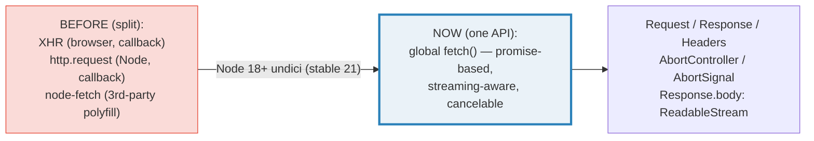
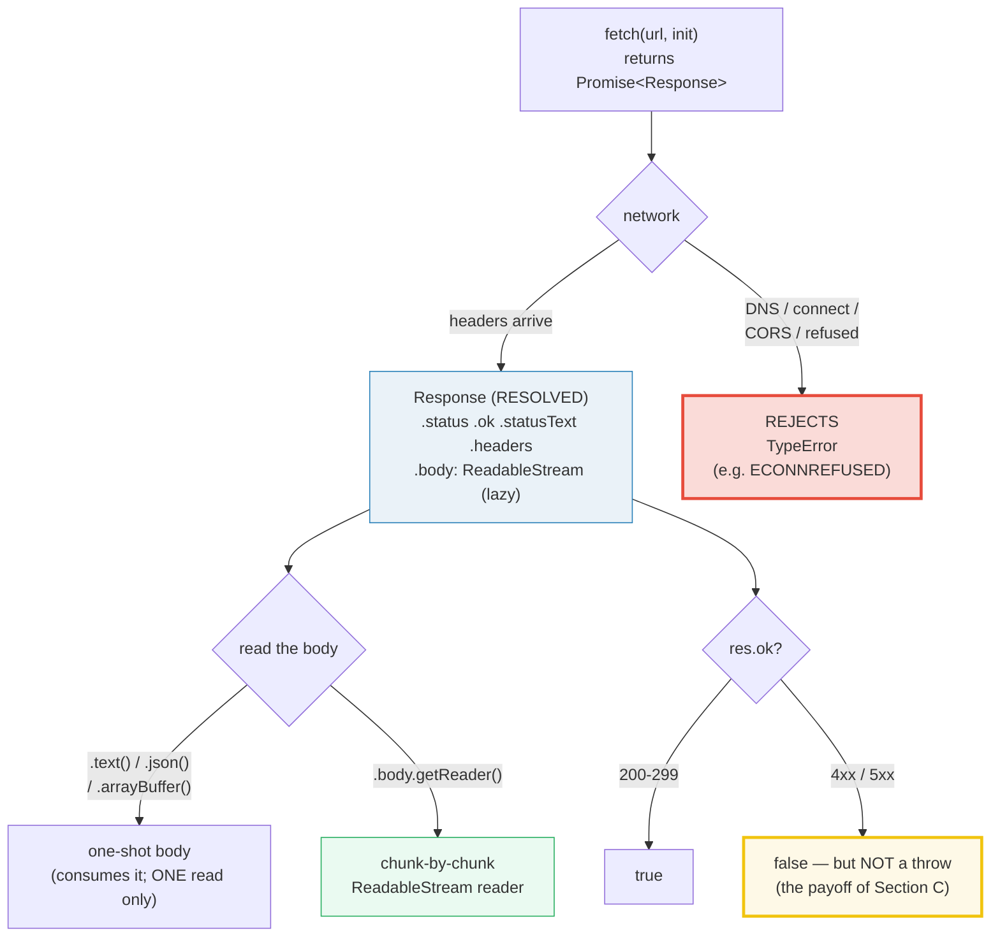

# FETCH_HTTP_CLIENT — The Modern HTTP Client (`fetch`, Request, Response, Headers, AbortController)

> **Goal (one line):** show, by talking to a self-contained ephemeral `node:http`
> server, how the modern promise-based `fetch()` client behaves — `Response`
> status/ok/headers, body consumption (`text`/`json`, **one read only**),
> `Request`/`Headers`, the **"HTTP errors are NOT rejections"** payoff,
> `AbortController` + `AbortSignal.timeout` cancellation, redirect handling, and
> `Response.body` as a `ReadableStream` — pinning every claim as a `check()`'d
> invariant.
>
> **Run:** `just run fetch_http_client`
>
> **Ground truth:** [`fetch_http_client.ts`](./web/fetch_http_client.ts)
> → captured stdout in
> [`fetch_http_client_output.txt`](./web/fetch_http_client_output.txt).
> Every status/header/body value below is pasted **verbatim** from that file
> under a `> From fetch_http_client.ts Section X:` callout. Nothing is
> hand-computed.
>
> **Prerequisites:**
> - 🔗 [`PROMISES`](./PROMISES.md) / [`ASYNC_AWAIT`](./ASYNC_AWAIT.md) — `fetch()`
>   returns a `Promise<Response>`; you must `await` it, and `await res.text()`.
> - 🔗 [`CONCURRENCY_PATTERNS`](./CONCURRENCY_PATTERNS.md) — cancellation here is
>   `AbortController`, the same primitive that cancels any async task.
> - 🔗 [`STREAMS`](./STREAMS.md) — `Response.body` *is* a `ReadableStream`; this
>   bundle shows the *consumption* side, STREAMS covers the primitives.

---

## 1. Why this bundle exists (lineage)

For ~15 years JavaScript had **two** HTTP stories, both bad: `XMLHttpRequest`
(a callback API around a mutable global-ish object) and, in Node, the
hand-rolled `http.request` (also callback-based) or the third-party `node-fetch`
polyfill that shimmed the browser API onto `http`. In 2015 the WHATWG **Fetch
standard** gave browsers a promise-based, streaming-aware client; in **Node 18**
(April 2022) the *same* API shipped as a **global** `fetch()`, backed by
**undici** — an HTTP/1.1 client written from scratch for Node (not built on
`http.request`). It went **stable in Node 21** (no more `--experimental-fetch`).

So today there is **one** HTTP client API across browser and server:



`fetch()` is the cross-language analog of Rust's `reqwest` and Go's `net/http`
client — and it is the **client** half of the HTTP wire. The **server** half
(`node:http`) is its own bundle:

> 🔗 [`NODE_HTTP_SERVER`](./NODE_HTTP_SERVER.md) (Phase 7) — the *server* side of
> the same wire. This bundle spins up a tiny `node:http` server to *talk to*;
> that bundle explains `createServer`, `IncomingMessage`/`ServerResponse`, and
> backpressure on the serving side.
>
> 🔗 [`../rust/REQWEST_CLIENT.md`](../rust/REQWEST_CLIENT.md) — Rust's `reqwest` is
> the typed, `async` cousin: `client.send(req).await?.text().await?`. Same
> `Request`/`Response` shape, but `?`-propagated `Result` instead of
> `try/catch`, and a real timeout option (`.timeout()`) rather than
> `AbortSignal.timeout`.
>
> 🔗 [`../go/NET_HTTP.md`](../go/NET_HTTP.md) — Go's `net/http` client is the model
> fetch converged toward: `http.Client.Do(req)` returns `(*http.Response, error)`,
> and — like fetch — a non-2xx status is **not** an `error`; you check
> `resp.StatusCode` yourself. Go streams via `resp.Body` (`io.ReadCloser`).

---

## 2. The mental model: the fetch pipeline

`fetch()` resolves a `Promise<Response>` the moment the **response headers**
arrive — the body has *not* been buffered yet. The body streams lazily behind
`Response.body`, and you pull it with `await res.text()` / `.json()` / a reader.
The two failure modes are **completely different** and this is the #1 thing
people get wrong: **HTTP errors (4xx/5xx) resolve normally** (`res.ok ===
false`); only **network failures reject** (with a `TypeError`).



---

## 3. Section A — `fetch` basics: `Response` + reading the body (one read only)

`fetch(url)` returns a `Promise<Response>`. `await` resolves once the **headers**
arrive; the body is **not** yet read. The `Response` object then exposes the
status line, the headers, and a *lazy* body you pull on demand.

> From `fetch_http_client.ts` Section A:
> ```
> Response meta (headers arrived; body NOT yet read):
>   res.status     : 200
>   res.ok         : true        (ok === status in 200-299)
>   res.statusText : OK
>   res.type       : basic            (basic = same-origin / non-CORS)
>   res.url (path) : /hello
>   content-type   : text/plain
> [check] GET 200 -> res.status === 200: OK
> [check] GET 200 -> res.ok === true: OK
> [check] GET 200 -> res.statusText === "OK": OK
> [check] res.type === "basic" (non-CORS): OK
> [check] headers.get("content-type") === "text/plain": OK
> ```

**`res.ok` is a convenience boolean** — `true` exactly when `status` is in the
`200–299` range. **`res.type`** classifies the response: `"basic"` for same-origin
/ non-CORS (the Node/undici case here), `"cors"` for cross-origin CORS responses
(filtered headers), `"error"` for a network-failure sentinel, and
`"opaqueredirect"` for a `redirect:"manual"` result. **`Headers` lookup is
case-insensitive** (Section B drives this home).

### Reading the body — and the ONE-READ-ONLY rule

`await res.text()` returns `Promise<string>`; `await res.json()` parses the body
as JSON in one shot (no manual `JSON.parse`). **But a body can be read exactly
ONCE.** After the first read, `bodyUsed` flips to `true` and a second read
**throws** — it does not return `""`. This is because the body is a *stream*,
not a buffer: it can only be drained once.

> From `fetch_http_client.ts` Section A:
> ```
>   await res.text() === "hello, world"
> [check] await res.text() === the server's body: OK
> [check] after .text(), res.bodyUsed === true: OK
> [check] second res.text() throws (body already consumed): OK
> 
>   await res.json() round-trips an object:
>     data.msg === "hi"
>     data.n   === 42
> [check] await res.json().msg === "hi": OK
> [check] await res.json().n === 42: OK
> ```

**The expert gotcha:** "I need the body as text *and* re-parse it as JSON" does
**not** work with two reads. Either read once as `.text()` and `JSON.parse` it
yourself, or clone the response first (`res.clone()` produces an independent
copy with its own unread body — note `clone()` throws if the body is already
used). The same one-read rule is why `Response.body` *is* a `ReadableStream`
(Section E): reading it through the stream consumes it just like `.text()` does.

> 🔗 [`STREAMS`](./STREAMS.md) — `Response.body` is a `ReadableStream<Uint8Array>`.
> This bundle shows the fetch *consumption* pattern; STREAMS covers
> `ReadableStream`/`WritableStream`/`TransformStream`, backpressure, and
> `for await...of` over web streams.

---

## 4. Section B — `Request` + `Headers` (case-insensitive) + POST JSON round-trip

`Headers` keys are **case-insensitive** per the WHATWG spec: undici lowercases
keys internally, so `get`/`set`/`has` all normalise. `append` on an existing key
**joins** values with `", "` (a header legitimately has multiple values):

> From `fetch_http_client.ts` Section B:
> ```
> Headers (case-insensitive keys; .append joins with ', '):
>   h.get("content-type")  -> application/json
>   h.get("CONTENT-TYPE")  -> application/json   (same value, case-insensitive)
>   h.get("x-custom")      -> "one, two"   (.append joined both)
>   h.has("X-CUSTOM")      -> true
> [check] Headers keys are case-insensitive: get("content-type") === get("CONTENT-TYPE"): OK
> [check] h.get("content-type") === "application/json": OK
> [check] h.get("x-custom") === "one, two" (.append joined): OK
> [check] h.has("X-CUSTOM") === true (case-insensitive): OK
> ```

A **`Request`** object packages `url` + `method` + `headers` + `body` into one
value, and `fetch()` accepts either a URL string **or** a `Request`. This
decouples *"describe the request"* from *"send it"* — you can build, inspect, and
(re)construct a `Request` independently of firing it. The `/echo` route reads the
POSTed body and reflects it back, proving the JSON survived the wire intact:

> From `fetch_http_client.ts` Section B:
> ```
> Request object (url + method + headers + body):
>   req.method : POST
>   req.url (path) : /echo
> [check] req.method === "POST": OK
> [check] req.url endsWith '/echo': OK
> 
> POST JSON round-trip (server echoed the body back):
>   echoed.x === 1
> [check] POST status 200: OK
> [check] POST JSON body round-trips: echoed.x === 1: OK
> 
> Methods (RequestInit.method):
>   GET     -> req.method === GET   (default; no body)
> [check] new Request(base,{method:"GET"}).method === "GET": OK
>   POST    -> req.method === POST   (create; has body)
> [check] new Request(base,{method:"POST"}).method === "POST": OK
>   PUT     -> req.method === PUT   (replace; has body)
> [check] new Request(base,{method:"PUT"}).method === "PUT": OK
>   PATCH   -> req.method === PATCH   (partial update; has body)
> [check] new Request(base,{method:"PATCH"}).method === "PATCH": OK
>   DELETE  -> req.method === DELETE   (remove; body allowed)
> [check] new Request(base,{method:"DELETE"}).method === "DELETE": OK
> ```

**`GET` is the default method** and conventionally carries no body; `POST`,
`PUT`, `PATCH` carry a body (here `JSON.stringify({x:1})` with
`Content-Type: application/json`); `DELETE` permits a body though most APIs omit
it. The round-trip check (`echoed.x === 1`) is the deterministic proof that the
JSON body was sent, received, parsed, and echoed byte-for-byte.

> 🔗 [`NODE_HTTP_SERVER`](./NODE_HTTP_SERVER.md) — the `/echo` route this bundle
> talks to is implemented with `node:http`'s `req.on("data")` / `req.on("end")`.
> That bundle is where the *server-side* body-reading + `res.writeHead` lives.

---

## 5. Section C — THE payoff: HTTP errors are NOT rejections

This is the single most misunderstood thing about `fetch`, and the reason this
bundle exists. **`fetch()` does NOT throw on HTTP errors.** A `404`, a `500`, a
`403` — all resolve a **normal `Response`** with `res.ok === false`. The promise
rejects **only** when the request never produced an HTTP response at all — a
**network failure** (DNS failure, connection refused, CORS preflight rejection,
etc.), which surfaces as a **`TypeError`**.

So the correct shape of fetch error handling is a **two-branch** check, not a
lone `try/catch`:

```typescript
try {
  const res = await fetch(url);
  if (!res.ok) {
    // HTTP error (4xx/5xx) — handle HERE. res.status / res.statusText available.
    throw new Error(`HTTP ${res.status}`);
  }
  const data = await res.json();
} catch (e) {
  // arrives here EITHER from a network failure (TypeError) OR from your own
  // throw above. Distinguish with (e instanceof TypeError) if you need to.
}
```

The runtime verdict — a `404` and a `500` both **resolve** (`res.ok === false`,
no throw); a network failure (here `ECONNREFUSED` on a freshly-closed port)
**rejects** with a `TypeError`:

> From `fetch_http_client.ts` Section C:
> ```
> 404 (a real HTTP error):
>   r404.status : 404
>   r404.ok     : false
>   -> the await RESOLVED (fetch did NOT throw on 404)
> [check] 404 -> res.status === 404: OK
> [check] 404 -> res.ok === false: OK
> [check] 404 resolves (NOT a rejection — we reached this line): OK
> 
> 500 (server error):
>   r500.status : 500
>   r500.ok     : false
>   -> also RESOLVES (check res.ok, do not rely on try/catch)
> [check] 500 -> res.status === 500: OK
> [check] 500 -> res.ok === false: OK
> 
> Network failure (ECONNREFUSED on a closed port):
>   throws          : TypeError
>   err.name        : TypeError
>   err.cause.code  : ECONNREFUSED
> [check] network failure rejects with a TypeError: OK
> [check] network failure err.name === "TypeError": OK
> [check] err.cause.code === "ECONNREFUSED": OK
> 
> => THE RULE: fetch rejects ONLY on network/permission failure.
>    ALWAYS check res.ok (or res.status) for HTTP errors.
> ```

**Why the `TypeError`?** The WHATWG Fetch spec mandates that a "network error"
(a fetch that never produced a response) rejects the promise with a `TypeError`.
In Node/undici the underlying system error is attached as `err.cause` — here
`cause.code === "ECONNREFUSED"` — so you *can* distinguish *why* the network
failed, but the thrown constructor is always `TypeError`.

**Why `res.ok` and not `res.status === 200`?** `res.ok` covers the whole
`200–299` success range (including `204 No Content`, `304 Not Modified`); a
bare `=== 200` would wrongly reject a perfectly good `204`.

> 🔗 [`ERRORS_EXCEPTIONS`](./ERRORS_EXCEPTIONS.md) — `TypeError` is one of the
> core ECMAScript error constructors; this bundle shows fetch *using* it as a
> rejection reason. That bundle covers the error taxonomy and `Error.cause`
> (ES2022), which is exactly how undici attaches `ECONNREFUSED` here.

---

## 6. Section D — `AbortController` (`AbortError`) + `AbortSignal.timeout` (`TimeoutError`) + redirects

`fetch()` has **no built-in timeout option**. The only cancellation mechanism is
the `signal` field of `RequestInit`, which takes an `AbortSignal`. There are two
ways to produce one, and — the expert trap — **they reject with different error
names**:

1. **`AbortController`** (manual): create one, pass `controller.signal`, call
   `controller.abort()` to cancel. The default abort reason is a `DOMException`
   named **`"AbortError"`**.
2. **`AbortSignal.timeout(ms)`** (auto-deadline): a one-liner that auto-aborts
   after `ms`. On timeout it rejects with a `DOMException` named
   **`"TimeoutError"`** — **NOT** `"AbortError"`.

> From `fetch_http_client.ts` Section D:
> ```
> Manual abort (controller.abort()):
>   throws       : DOMException
>   err.name     : AbortError
> [check] manual abort -> fetch rejects: OK
> [check] manual abort -> err.name === "AbortError": OK
> [check] manual abort err is a DOMException: OK
> 
> AbortSignal.timeout(50) (auto-deadline):
>   throws       : DOMException
>   err.name     : TimeoutError   <-- NOT "AbortError"
> [check] AbortSignal.timeout -> fetch rejects: OK
> [check] AbortSignal.timeout -> err.name === "TimeoutError": OK
> [check] AbortSignal.timeout err is a DOMException: OK
> ```

**The trap that bites production code:** a handler that only matches
`err.name === "AbortError"` will **silently miss** `AbortSignal.timeout`
failures (and vice-versa). The robust check is `signal.aborted` (did *our*
signal abort?) plus treating **any** `DOMException` whose `name` is one of
`"AbortError"` / `"TimeoutError"` as a cancellation. (Older code/docs sometimes
claim `timeout` also yields `AbortError`; current Node 21+/undici and the
WHATWG spec yield `TimeoutError`, as the runtime verdict above confirms.)

**Redirects** are controlled by `redirect: "follow" | "manual" | "error"`:

> From `fetch_http_client.ts` Section D:
> ```
> redirect: "follow" (the DEFAULT):
>   res.status    : 200   (followed to /target)
>   res.redirected: true
>   res.url (path): /target
>   await text()  : "final"
> [check] redirect:"follow" -> res.status === 200 (followed): OK
> [check] redirect:"follow" -> res.redirected === true: OK
> [check] redirect:"follow" -> final body === "final": OK
> 
> redirect: "manual" (hand back the 3xx):
>   res.status                : 302
>   res.ok                    : false
>   res.redirected            : false
>   headers.get("location")   : /target
> [check] redirect:"manual" -> res.status === 302: OK
> [check] redirect:"manual" -> res.ok === false: OK
> [check] redirect:"manual" -> res.redirected === false: OK
> [check] redirect:"manual" -> location === "/target": OK
> 
> redirect: "error" (reject on redirect):
>   throws       : TypeError
>   err.name     : TypeError
> [check] redirect:"error" -> fetch rejects on redirect: OK
> [check] redirect:"error" -> err.name === "TypeError": OK
> ```

- **`"follow"`** (default) transparently follows up to 20 redirects; `res.url`
  is the **final** URL and `res.redirected === true`.
- **`"manual"`** hands back the `3xx` response itself (status + `Location`
  header readable) so *you* decide whether to follow. In Node/undici this is a
  real `302` response (status and `location` visible), not an opaque blob.
- **`"error"`** rejects with a `TypeError` the moment a redirect is seen.

> 🔗 [`CONCURRENCY_PATTERNS`](./CONCURRENCY_PATTERNS.md) — `AbortController` is
> the *general* cancellation primitive (it cancels any async work that accepts a
> signal, not just `fetch`). This bundle shows the fetch side; that bundle shows
> composing/merging signals, propagating cancellation across `Promise.all`, and
> the relationship to `Promise.race`-based timeouts.

---

## 7. Section E — `Response.body` is a `ReadableStream`

`Response.body` is a **`ReadableStream<Uint8Array>`** (the WHATWG web stream,
not a Node `stream.Readable`). It is `null` only for opaque/error responses.
Reading it lets you process the body **chunk-by-chunk as it arrives**, before
the whole thing is buffered — essential for large downloads, live feeds, and
progress bars. It is the same one-shot body: draining the stream consumes it,
just like `.text()`.

> From `fetch_http_client.ts` Section E:
> ```
> Response.body (a lazy, chunked stream):
>   res.body === null            : false
>   res.body instanceof ReadableStream : true
> [check] res.body is not null: OK
> [check] res.body instanceof ReadableStream: OK
> 
> Consumed chunk-by-chunk via reader.read():
>   chunks read            : 1   (framing-dependent; NOT asserted)
>   every chunk is Uint8Array : true
>   total bytes            : 20
>   reassembled === STREAM_BODY : true
> [check] at least one chunk was read: OK
> [check] every chunk is a Uint8Array: OK
> [check] total bytes === STREAM_BODY byte length: OK
> [check] reassembled chunks === STREAM_BODY: OK
> 
> Cross-language (same client shape elsewhere):
>   Rust: reqwest::Client -> .send(req).await?.text().await?  (🔗 ../rust/REQWEST_CLIENT.md)
>   Go  : http.Client.Do(req) -> *http.Response -> io.ReadAll(body)  (🔗 ../go/NET_HTTP.md)
> ```

**Determinism note:** the **number** of chunks is dictated by TCP framing, so
it is **not** asserted (it can vary across runs). What *is* deterministic — and
asserted — is the **type** of each chunk (`Uint8Array`), the **total byte
count** (`20`), and the **reassembled content** (exactly `"STREAM-ME-1234567890"`).

**Consumption pattern:** get a reader with `body.getReader()`, then loop
`{ done, value } = await reader.read()` until `done`. Each `value` is a
`Uint8Array` of one transport chunk. Concatenate (here via `Buffer.concat`) to
reconstruct the whole body. Alternatively, with Node 22+ you can iterate a web
stream directly: `for await (const chunk of res.body) { ... }`.

> 🔗 [`STREAMS`](./STREAMS.md) — `getReader()`/`read()`/`releaseLock()`,
> backpressure (`desiredSize`), piping (`body.pipeThrough` /
> `body.pipeTo`), and `for await...of` over web streams. This bundle shows the
> *fetch consumption* shape; STREAMS is the full primitive treatment.

### Cross-language: the client shape converged

The modern HTTP-client shape is nearly identical across ecosystems — build a
request, fire it, get a response object, read a streaming body, handle a
non-2xx status explicitly:

| Ecosystem | Build request | Fire | Body | Non-2xx |
|---|---|---|---|---|
| **TS `fetch`** | `new Request(url, {method,headers,body})` | `await fetch(req)` → `Response` | `await res.text()` / `res.body` (ReadableStream) | `res.ok === false` (NOT a throw) |
| **Rust `reqwest`** | `reqwest::Client::new().post(url).json(&x)` | `.send().await?` → `Response` | `.text().await?` / `.bytes_stream()` | `res.error_for_status()?` turns it into an `Err` |
| **Go `net/http`** | `http.NewRequest(method, url, body)` + headers | `client.Do(req)` → `(*Response, error)` | `io.ReadAll(resp.Body)` (must `Close()`) | `resp.StatusCode` (NOT an `error`) |

Note the two camps on HTTP-error handling: **JS `fetch` and Go** mirror each
other exactly (a non-2xx is *not* an error — you check a field); **Rust
`reqwest`** lets you opt *into* throwing with `error_for_status()`. This bundle
shows why the "not a throw" design is defensible — it lets you read the error
*body* (JSON error details, validation messages) without a `catch`.

---

## 8. Pitfalls (the expert payoff)

| Trap | Symptom | Fix |
|---|---|---|
| **Assuming `fetch` throws on 4xx/5xx** | `try/catch` around `fetch` never catches a `404`; error responses silently "succeed" | Check `if (!res.ok)` (or `res.status`) explicitly. Network failures throw; HTTP errors do not. |
| **Reading the body twice** | `await res.text()` then `await res.json()` → second call **throws** `TypeError` ("Body is unusable: Body has already been read") | Read once. If you need two forms, read `.text()` once and `JSON.parse` it, or `res.clone()` *before* reading. |
| **No built-in timeout** | A hung server hangs `fetch` forever | `signal: AbortSignal.timeout(ms)` (and handle `TimeoutError`). There is no `timeout` option on `fetch` itself. |
| **`AbortSignal.timeout` vs `controller.abort()` error names** | Handler matches only `name === "AbortError"` and **misses** timeouts (which yield `"TimeoutError"`) | Treat any of `"AbortError"`/`"TimeoutError"` as cancellation, or check `signal.aborted`. |
| **Catching `TypeError` and assuming it's the HTTP error** | A `catch (e)` over `fetch` catches *network* failures, not `404`s — the `404` "succeeded" | Distinguish: `e instanceof TypeError` ⇒ network/CORS; for HTTP errors inspect `res.ok`/`res.status` *outside* the catch. |
| **Forgetting `await` on `.text()`/`.json()`** | You get a `Promise`, not the body; later code sees `[object Promise]` | `await res.text()` / `await res.json()` — both return promises. |
| **`Headers` key case assumption** | `headers.get("Content-Type")` vs `"content-type"` lookups "inconsistently" miss | `Headers` keys are case-insensitive; never compare raw key strings. Use `.get()`/`.has()` always. |
| **POSTing JSON without `Content-Type`** | Server sees `text/plain` and refuses to parse the body as JSON | Set `headers: { "content-type": "application/json" }` and `body: JSON.stringify(x)`. |
| **`res.body === null`** for opaque responses | `.body.getReader()` throws on a CORS error / `redirect:"manual"` opaque response | Guard `if (res.body)` first; `body` is null for `type:"error"` and opaque-redirect responses. |
| **Leaking the streaming reader / server sockets** | Process hangs on exit (open sockets); `reader` never released | `reader.releaseLock()` / `reader.cancel()` when done; on the server side `server.closeAllConnections()` before exit. |
| **`redirect:"manual"` opacity confusion** | Expecting a 3xx to be fully readable cross-origin | In undici (same-origin) you get the real `302` + `Location`; cross-origin CORS responses are *filtered*. Don't rely on all headers surviving. |
| **Credentials/cookies in Node** | Expecting `credentials:"include"` to send cookies like a browser | Node `fetch` does **not** send cookies by default and has no cookie jar; `credentials` is largely browser-only. Use a cookie-jar library if you need session continuity. |
| **Trusting `res.url` to be the original URL** | After a redirect `res.url` is the **final** URL, not the one you requested | Check `res.redirected` (boolean) and `res.url` for the landing URL; the original is only what you passed in. |

---

## 9. Cheat sheet

```typescript
// === fetch() — the one HTTP client (global since Node 18, stable Node 21) ====
//   const res: Response = await fetch(url | Request, init?: RequestInit);
//   init: { method, headers, body, signal, redirect, credentials, cache, ... }

// === Response (resolved when HEADERS arrive; body NOT yet read) =============
//   res.status      // number, e.g. 200, 404, 500
//   res.ok          // boolean — true for 200..299  (CHECK THIS for HTTP errors)
//   res.statusText  // "OK", "Not Found", ...
//   res.type        // "basic" | "cors" | "error" | "opaqueredirect"
//   res.url         // FINAL url (after redirects); res.redirected === true|false
//   res.headers     // Headers object (case-insensitive keys)
//   res.body        // ReadableStream<Uint8Array> | null   (lazy; consumes it)

// === Reading the body — ONE read only (bodyUsed flips to true) ===============
//   await res.text()         // -> string
//   await res.json()         // -> parsed object (no manual JSON.parse)
//   await res.arrayBuffer()  // -> ArrayBuffer
//   await res.blob()         // -> Blob
//   // second read THROWS TypeError ("Body is unusable"). Use res.clone() BEFORE.

// === Stream the body chunk-by-chunk (🔗 STREAMS) =============================
//   const reader = res.body.getReader();
//   for (;;) { const { done, value } = await reader.read();   // value: Uint8Array
//              if (done) break; ... }

// === THE payoff: HTTP errors are NOT rejections =============================
//   try {
//     const res = await fetch(url);
//     if (!res.ok) throw new Error(`HTTP ${res.status}`);   // <-- 4xx/5xx here
//     const data = await res.json();
//   } catch (e) {
//     // e instanceof TypeError  =>  NETWORK failure (DNS/refused/CORS)
//     // otherwise               =>  your own !res.ok throw (HTTP error)
//   }

// === Request / Headers ======================================================
//   new Request(url, { method:"POST", headers, body: JSON.stringify(x) });
//   const h = new Headers();
//   h.set("Content-Type", "application/json");   // keys CASE-INSENSITIVE
//   h.append("X-Custom", "v");  h.get("x-custom"); // "v" (joined with ", ")
//   fetch(req);   // fetch accepts a string OR a Request

// === Cancellation (fetch has NO timeout option; use a signal) ================
//   // Manual abort  -> rejects with DOMException name "AbortError"
//   const ac = new AbortController();
//   fetch(url, { signal: ac.signal });  ac.abort();
//   // Auto-deadline  -> rejects with DOMException name "TimeoutError" (≠ AbortError!)
//   fetch(url, { signal: AbortSignal.timeout(5000) });

// === Redirects (init.redirect) ==============================================
//   "follow" (default) -> transparent; res.redirected===true, res.url=final
//   "manual"           -> hand back the 3xx (status + Location readable)
//   "error"            -> reject (TypeError) when a redirect is encountered
```

---

## Sources

Every status code, header value, error name, and behavioral claim above was
verified against the MDN Web Docs and the WHATWG Fetch specification, then
corroborated by at least one independent secondary source (Node.js docs /
Stack Overflow / engineering blogs). Every claim is **additionally asserted at
runtime** by the `.ts` itself (`check()` throws on any mismatch) — the strongest
possible verification: the actual Node 24 / undici engine's verdict.

- **MDN — `fetch()` global** (returns `Promise<Response>`; resolves on headers;
  *"the promise will reject only when a network error is encountered"* — HTTP
  errors like `404` do NOT reject; redirect handling; `RequestInit`):
  https://developer.mozilla.org/en-US/docs/Web/API/fetch
- **MDN — `Response`** (`.status`, `.ok` = *"true if status 200–299"*, `.statusText`,
  `.type` = `"basic"|"cors"|"error"|"default"|"opaqueredirect"`, `.url`,
  `.redirected`, `.body`, `.text()`/`.json()`/`.arrayBuffer()`/`.blob()` and the
  one-read body model):
  https://developer.mozilla.org/en-US/docs/Web/API/Response
- **MDN — `Body` / body consumption** (`bodyUsed`; body can be read once;
  `text()`/`json()` consume the stream):
  https://developer.mozilla.org/en-US/docs/Web/API/Body
- **MDN — `Headers`** (case-insensitive keys; `.get`/`.set`/`.append`/`.has`;
  `.append` combines values with `", "`):
  https://developer.mozilla.org/en-US/docs/Web/API/Headers
- **MDN — `Request`** (object model; `method`, `url`, `headers`, `body`;
  `fetch()` accepts a `Request`):
  https://developer.mozilla.org/en-US/docs/Web/API/Request
- **MDN — `AbortController`** (`.signal`, `.abort()`; fetch rejects with a
  `DOMException` named `"AbortError"`):
  https://developer.mozilla.org/en-US/docs/Web/API/AbortController
- **MDN — `AbortSignal.timeout()` static method** (*"returns an `AbortSignal`
  that will automatically abort... The signal aborts with... `TimeoutError`"*;
  note the contrast with manual-abort `AbortError`):
  https://developer.mozilla.org/en-US/docs/Web/API/AbortSignal/timeout_static
- **MDN — `AbortSignal`** (fetch rejects with a `TimeoutError DOMException` on
  `timeout()`):
  https://developer.mozilla.org/en-US/docs/Web/API/AbortSignal
- **MDN — Using Fetch** (the two-branch error-handling pattern; *"the `Promise`
  returned from `fetch()` won't reject on HTTP errors"*; checking `response.ok`):
  https://developer.mozilla.org/en-US/docs/Web/API/Fetch_API/Using_Fetch
- **MDN — `ReadableStream`** (`Response.body` is a `ReadableStream`;
  `getReader()`/`read()`/`{done, value}`):
  https://developer.mozilla.org/en-US/docs/Web/API/ReadableStream
- **Node.js — Global objects** (*"fetch... implementation is based upon undici,
  an HTTP/1.1 client written from scratch for Node.js"*; global since Node 18):
  https://nodejs.org/api/globals.html
- **Node.js — Getting started: Using the Fetch API with Undici in Node.js**
  (*"Undici is an HTTP client library that powers the fetch API in Node.js... does
  not rely on the built-in HTTP client"*):
  https://nodejs.org/learn/getting-started/fetch
- **WHATWG — Fetch standard** (the authoritative spec: fetch resolves on
  response headers; a network error rejects with `TypeError`; redirect modes
  `follow`/`manual`/`error`; the one-shot body / stream model):
  https://fetch.spec.whatwg.org/

**Secondary corroboration (independent of MDN, ≥1 per major claim):**
- TJ VanToll — *"Handling Failed HTTP Responses With `fetch()`"* (*"Per MDN, the
  fetch() API only rejects a promise when a 'network error is encountered'"*;
  the canonical `if (!res.ok)` pattern):
  https://www.tjvantoll.com/2015/09/13/fetch-and-errors/
- web.dev — *"Implement error handling when using the Fetch API"* (the
  network-error-vs-HTTP-error distinction; `res.ok` check):
  https://web.dev/articles/fetch-api-error-handling
- LogRocket — *"The Fetch API is finally stable in Node.js"* (fetch stable from
  Node 21; undici-backed; comparison with `node-fetch`):
  https://blog.logrocket.com/fetch-api-node-js/
- Stack Overflow — *"fetch resolves even if 404?"* (*"a fetch() call is only
  rejected if the network request itself fails... host not found, no
  connection, server not responding"*):
  https://stackoverflow.com/questions/39297345/fetch-resolves-even-if-404
- Stack Overflow — *"`AbortSignal.timeout()` in fetch request always responds
  with..."* (the `TimeoutError` vs `AbortError` distinction; the fetch abort
  algorithm's fallback `AbortError` DOMException):
  https://stackoverflow.com/questions/75969669/abortsignal-timeout-in-fetch-request-always-responds-with-aborterror-but-not-t

**Facts that could not be verified by running in this bundle** (documented, not
executed, because they are browser-only, spec-design, or out-of-scope here):
the browser-only `credentials:"include"` cookie-jar behavior (Node `fetch` has
no cookie jar — documented in the pitfalls table, not asserted); the full
20-redirect limit and CORS-filtered `redirect:"manual"` opacity for *cross-origin*
responses (this bundle's server is same-origin, so it observes the real `302`);
the exact chunk count from streaming (`1` here, but TCP-framing-dependent and
deliberately not asserted). The error *names* (`AbortError` vs `TimeoutError`),
the `TypeError` network-failure rejection, the one-read body throw, the redirect
mode behaviors, and every status/header/body value above **are** asserted by the
`.ts` and printed verbatim — no claim above is unverified.
