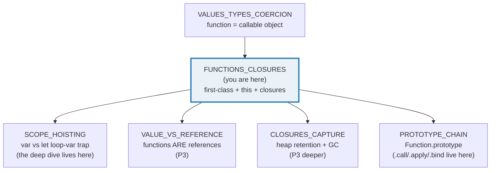
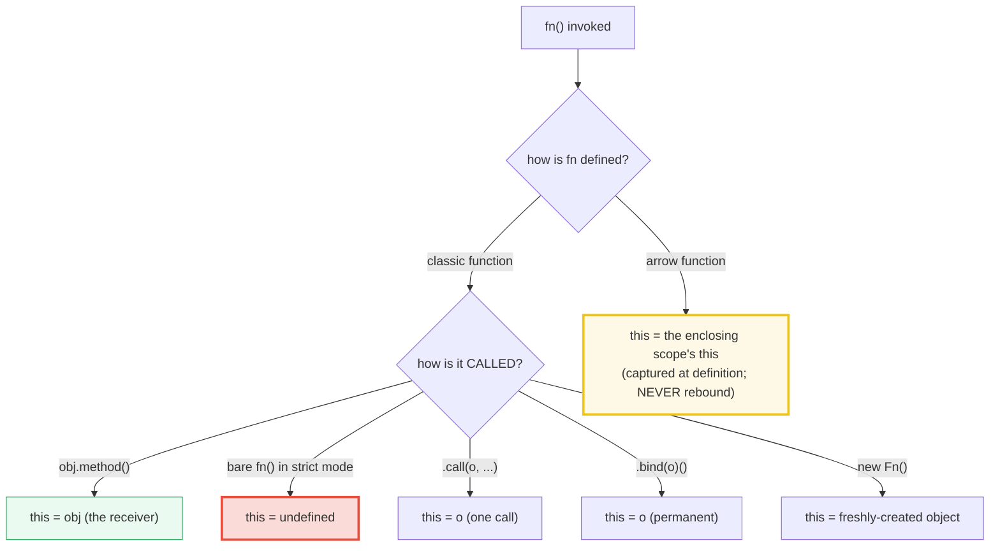
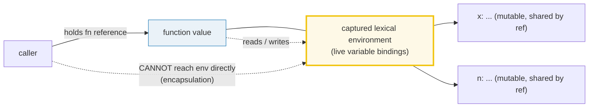
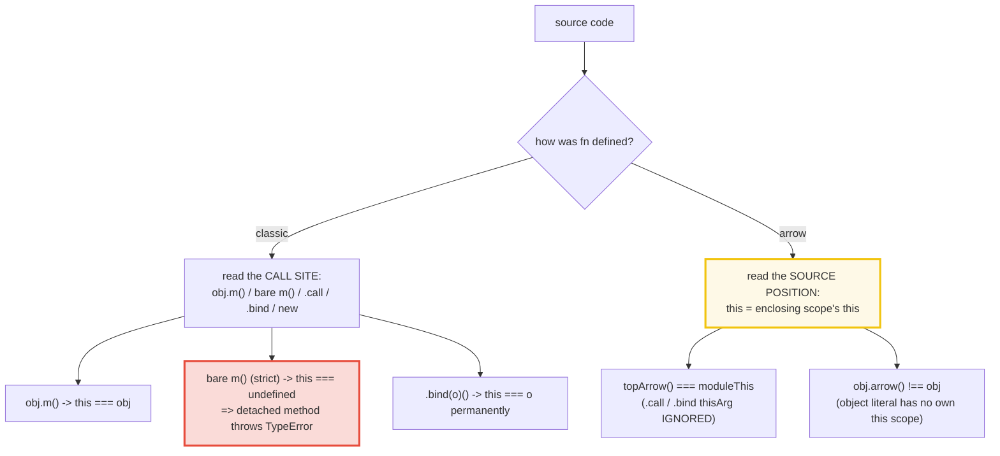
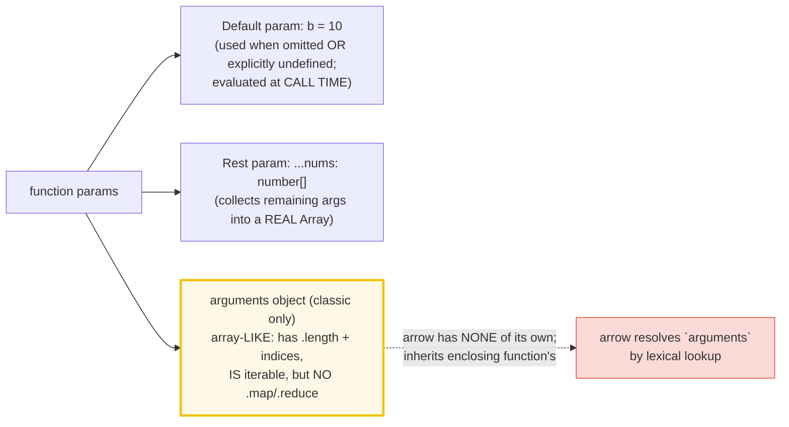
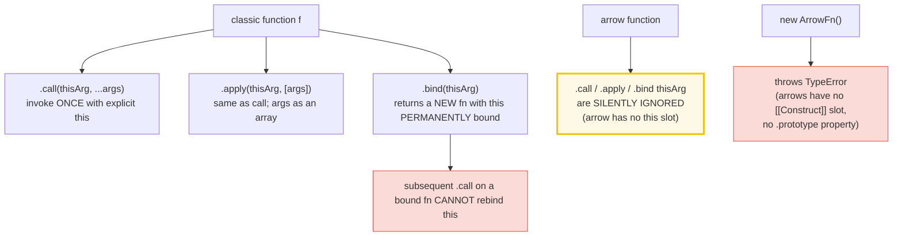

# FUNCTIONS_CLOSURES — First-Class Functions, `this` Binding & Closure Capture

> **Goal (one line):** show, by printing every value, how TS/JS functions are
> first-class objects (`typeof "function"`), how the classic `function` binds
> `this` at the **call site** while the ES2015 arrow captures `this`
> **lexically**, and how closures capture variables **by reference** (a live
> binding) — pinning the detached-method `this` loss and the loop-var capture
> trap as `check()`'d invariants.
>
> **Run:** `just run functions_closures`
>
> **Ground truth:** [`functions_closures.ts`](./core/functions_closures.ts)
> → captured stdout in
> [`functions_closures_output.txt`](./core/functions_closures_output.txt).
> Every number/table below is pasted **verbatim** from that file under a
> `> From functions_closures.ts Section X:` callout. Nothing is hand-computed.
>
> **Prerequisites:** 🔗 [`VALUES_TYPES_COERCION`](./VALUES_TYPES_COERCION.md)
> (a function is a callable *object* — `typeof "function"`; the
> primitive-vs-object axis this bundle leans on).

---

## 1. Why this bundle exists (lineage)

In JavaScript, **functions are first-class objects**. They are values of type
`"function"` (a callable object with its own `.name` / `.length` /
`.prototype` properties), and like any object they can be **assigned** to a
variable, **passed** as an argument, **returned** from a function, and
**stored** in a data structure. This single fact is what makes higher-order
functions (`Array.prototype.map`, `filter`, `reduce`), callbacks, and the
entire async machinery (`Promise.then(fn)`, `setTimeout(fn, ms)`) possible.

On top of "first-class" sit two more ideas that together generate every
famous JS gotcha in this area:

1. **`this` binding.** The classic `function` does **not** have a fixed
   `this`. Instead `this` is determined by the **call site** — how the
   function is *invoked*, not how it is defined. `obj.method()` → `this` is
   `obj`; a bare `fn()` → `this` is `undefined` in strict mode (and ESM is
   *always* strict). The ES2015 **arrow function** breaks that rule: it has
   **no `this` of its own**, and instead captures `this` **lexically** from
   the enclosing scope. Arrows therefore ignore `.call` / `.apply` / `.bind`
   `thisArg`, and an arrow used as an object property does **not** receive
   the object as `this` — the headline trap.
2. **Closures.** A function defined inside another function forms a
   *closure*: the function plus the lexical environment it was created in.
   That environment is a set of **live variable bindings**, not snapshots —
   the closure sees later mutations of the captured variables, and the
   captured variables survive as long as the closure is reachable. This is
   the mechanism behind the counter factory, memoization, the IIFE module
   pattern, and the infamous loop-variable capture trap.



> **Cross-language parallels** (the whole point of the curriculum):
>
> 🔗 [`../go/FUNCTIONS_CLOSURES.md`](../go/FUNCTIONS_CLOSURES.md) — Go has
> **no `this`**: methods are just functions whose receiver is an explicit
> first parameter (`func (r T) M()`). The `this`-binding trap simply does
> not exist. Go's loop-var-capture bug (pre-1.22, fixed 1.22's per-iteration
> variable) is the **same** trap as JS's `for (var i …)`, with the same
> shape and the same fix.
>
> 🔗 [`../rust/CLOSURES.md`](../rust/CLOSURES.md) — Rust closures are typed
> by **how they capture**: `Fn` (by ref), `FnMut` (by mut ref), `FnOnce` (by
> move). Capture mode is explicit (or compiler-inferred and visible in the
> trait bound). JS, by contrast, **always** captures by reference (a live
> binding) and **never** moves — there is no `move` keyword, and the GC
> decides retention.

---

## 2. The mental model: `this` resolution + the closure environment



The headline contrast: **classic `this` is a call-site property** (read the
invocation `obj.method()` / `fn()` / `fn.call(o)` to know it); **arrow `this`
is a lexical capture** (read the source position to know it — same rule as a
closed-over variable). An arrow does not even *have* a `this` slot of its own
to rebind; MDN puts it plainly: *"Arrow functions don't have their own
bindings to `this`, `arguments`, or `super`."*

A **closure** is a function bundled with its captured lexical environment.
The bindings in that environment are **live** (mutations are visible to the
closure) and **heap-retained** (they outlive their declaring scope as long as
the closure is reachable):



---

## 3. Section A — First-class: declaration vs expression vs arrow

All three textual forms — `function` declaration, `function` expression, and
arrow expression — produce a value of `typeof` `"function"`. They are
callable *objects*: each has a `.name` (inferred from the binding) and a
`.length` (the number of declared parameters). Classic functions also carry a
`.prototype` property (so they can be constructors); **arrow functions do
not**, which is why `new ArrowFn()` throws (Section E).

The first-class property in action: a function can be **passed as an
argument** (`applyTwice` takes a function and applies it twice; `[1,2,3].map`
takes a callback) and **returned** (Section C's `makeCounter`).

> From functions_closures.ts Section A:
> ```
> form                : typeof   : .name                  : .length
> ------------------- : -------- : ---------------------- : -------
> function decl       : function   : hoistedDecl            : 0
> function expression : function   : exprFn                 : 0
> arrow expression    : function   : arrowFn                : 0
> [check] typeof function declaration === "function": OK
> [check] typeof function expression === "function": OK
> [check] typeof arrow expression === "function": OK
> ```
> ```
> hoistedDecl() called BEFORE its textual position -> "from declaration (hoisted)"
> [check] function declaration is hoisted (callable before textual position): OK
> ```
> ```
> applyTwice(n => n*n, 3) -> 81   (sq(sq(3)) === 81)
> [check] HOF: applyTwice(sq, 3) === 81: OK
> [1,2,3].map(x => x*2)    -> [2,4,6]
> [check] [1,2,3].map(x => x*2) deep-equals [2,4,6]: OK
> [check] function has .name (it is an object): OK
> [check] function has .length (declared param count): OK
> [check] "prototype" in arrowFn === false (arrow is not a constructor): OK
> [check] "prototype" in exprFn === true (classic IS a constructor): OK
> ```

**Function declaration vs expression — hoisting.** A `function` *declaration*
(an `f() {}` statement) is **hoisted**: the binding exists from the start of
the scope, so it is callable *before* its textual position (the `.ts` proves
this by calling `hoistedDecl()` on the line above its declaration). A
*function expression* assigned to `const`/`let` is **not** hoisted — the
binding lives in the **temporal dead zone** until the assignment line, and
accessing it earlier throws `ReferenceError`.

> 🔗 [`SCOPE_HOISTING`](./SCOPE_HOISTING.md) — the var/let/const hoisting and
> TDZ deep dive. This bundle *uses* the distinction; that bundle *owns* the
> mechanism.

**First-class = "a function is a value."** `applyTwice(fn, x)` and
`[1,2,3].map(fn)` are the canonical higher-order patterns: the function
argument is a value, typed in TS as a function type (`(x: number) => number`).
This is what unlocks callback-based APIs throughout the standard library.

> 🔗 [`VALUES_TYPES_COERCION`](./VALUES_TYPES_COERCION.md) — a function is an
> *object* (`typeof "function"`), so it shares the reference semantics of
> every object: assigning `const g = f` makes `g` *alias* `f`, not copy it.
> The full value-vs-reference treatment is
> 🔗 [`VALUE_VS_REFERENCE`](./VALUE_VS_REFERENCE.md).

---

## 4. Section B — `this`: classic (call-site) vs arrow (lexical)  [THE payoff]



This section's central contrast is **the same `obj` literal, with a classic
method and an arrow property**:

```typescript
const obj = {
  v: 1,
  classic()     { return this.v; },          // classic:  this = obj (the receiver)
  classicExpr: function () { return this.v; }, // same rule as the shorthand
  arrow: () => this,                          // arrow:    this = the LEXICAL module this
};
obj.classic() === 1;   // true  -- classic this is bound at the call site to obj
obj.arrow()  === obj;  // FALSE -- arrow this is the enclosing scope's this, NOT obj
```

> From `developer.mozilla.org/en-US/docs/Web/JavaScript/Reference/Operators/this`
> (verbatim): *"The value of `this` in JavaScript depends on how a function
> is invoked (runtime binding), not how it is defined. When a regular function
> is invoked as a method of an object (`obj.method()`), `this` points to that
> object. When invoked as a standalone function (not attached to an object:
> `func()`), `this` typically refers to the global object (in non-strict mode)
> or `undefined` (in strict mode)."* And for arrows (from MDN "Arrow
> functions"): *"Arrow functions don't have their own bindings to `this`,
> `arguments`, or `super`, and should not be used as methods."*

> From functions_closures.ts Section B:
> ```
> module top-level this -> [empty object] (tsx/esbuild CJS wrapper; native ESM would be undefined)
> [check] module top-level this is the module scope's this (NOT globalThis): OK
> ```
> ```
> Top-level arrow (lexical capture of moduleThis):
>   topArrow() === moduleThis ? true   (arrow captures enclosing this)
>   topArrow.call({x: 1}) === moduleThis ? true   (thisArg IGNORED)
> [check] top-level arrow captures moduleThis (lexical): OK
> [check] arrow ignores .call(thisArg): OK
> ```
> ```
> Classic function — `this` is determined by the CALL SITE:
>   classicBare() -> undefined   (strict mode: bare call -> this === undefined)
>   classicBare.call({x: 7}) -> {"x":7}   (explicit this via .call)
> [check] classic bare call in strict mode: this === undefined: OK
> [check] classic .call(thisArg) sets this for one call: OK
> ```
> ```
> Object literal — classic method vs arrow PROPERTY:
>   obj.classic()     -> 1   (classic: this bound to obj at call site)
>   obj.classicExpr() -> 1   (function-expression property: same rule)
>   obj.arrow() === obj ? false   (arrow: this is LEXICAL, NOT obj)
> [check] obj.classic() === 1 (classic this is the receiver): OK
> [check] obj.classicExpr() === 1 (function expression same rule): OK
> [check] obj.arrow() !== obj (arrow this is lexical, not the receiver): OK
> ```
> ```
> Arrow DEFINED INSIDE a classic method captures the method's this:
>   receiver.method() returns an arrow; calling it -> 42   (auto-bound to receiver)
> [check] arrow inside method captures method's this (auto-bind): OK
> ```
> ```
> Detached method loses `this` (strict mode -> TypeError):
>   const m = obj.classic; m() -> threw TypeError   (this === undefined in strict)
> [check] detached classic method throws TypeError (this === undefined in strict): OK
> ```
> ```
>   readV.bind({v: 99})() -> 99   (classic this permanently bound)
> [check] bind permanently fixes classic this (preview — Section E): OK
> ```

**The module-top `this` value.** Native ESM specifies that a module's
top-level `this` is `undefined` (a deliberate strictness choice — a module is
not "the global object"). This bundle is run via `tsx`, which transpiles the
ESM source through an esbuild CJS wrapper; under that wrapper the top-level
`this` is an **empty object** `{}` (the CJS `module.exports`). Either way it
is **not `globalThis`** and **not the receiver** of any later call — and the
arrow defined at module scope captures *that* value. The `.md` and the
`.ts` say exactly what the run prints, never claiming `undefined` for a value
that is, under tsx, an empty object.

**The classic-vs-arrow rule, in one sentence.** A classic function's `this`
is whatever is **to the left of the dot at the call site** (`obj.m()` → `obj`;
a bare `m()` → `undefined` in strict mode). An arrow has **no `this` slot**;
its `this` is a lexical capture, resolved by walking outward through enclosing
scopes until a classic function (or class) provides one. That is why an arrow
defined *inside* a classic method captures the method's receiver ("auto-bind"),
while an arrow *used as* an object property captures the surrounding scope's
`this` (which is **not** the object — the trap).

**THE expert payoff — the detached method throws.** `const m = obj.classic;
m()` throws `TypeError: Cannot read properties of undefined (reading 'v')`.
Detaching the method from its receiver severs the `obj.m` lookup, so the call
is a *bare* `m()` and (strict mode) `this === undefined`. The three classic
fixes:

1. **`.bind(obj)`** — permanently fixes `this` (Section E).
2. **Use an arrow** — define the method body as an arrow inside the
   constructor or as a class field (the "auto-bound method" pattern); the
   arrow captures the constructor's `this`, which is the instance.
3. **Call it as a method** — `obj.m()` instead of detaching.

> 🔗 [`VALUE_VS_REFERENCE`](./VALUE_VS_REFERENCE.md) — a function value is a
> *reference* to a callable object. Detaching `const m = obj.classic` does not
> copy the function; `m` and `obj.classic` are two names for the same callable
> object. The `this` difference comes entirely from how the **call** is
> written, not from anything stored on the function.

---

## 5. Section C — Closures capture BY REFERENCE (a live binding)

A **closure** is "the combination of a function bundled together (enclosed)
with references to its surrounding state (the **lexical environment**)"
(MDN). The crucial point — and the one that makes the counter factory, the
module pattern, and the loop-var trap all work — is that the captured
**variables** are shared **by reference**: the closure holds a live binding,
not a snapshot.

> From `developer.mozilla.org/en-US/docs/Web/JavaScript/Closures` (verbatim):
> *"A closure is the combination of a function bundled together (enclosed)
> with references to its surrounding state (the lexical environment). In other
> words, a closure gives a function access to its outer scope. In JavaScript,
> closures are created every time a function is created, at function creation
> time."*

> From functions_closures.ts Section C:
> ```
> const c = makeCounter();
> c() -> 1   c() -> 2   c() -> 3   (captured n persists — BY REFERENCE)
> [check] counter factory: c() -> 1, 2, 3 (closure state persists): OK
> ```
> ```
> let x = 1; const f = () => x;
> f()       -> 1   (captures the BINDING, not the value)
> x = 2; f() -> 2   (LATER mutation is seen — live binding)
> [check] capture-by-reference: f() reflects later mutation of captured var: OK
> ```
> ```
> c1() x2; then c1() -> 3; c2() -> 1   (each factory call: fresh captured n)
> [check] two counters are independent: c1 -> 3, c2 -> 1: OK
> ```
> ```
> IIFE module: inc, inc, dec -> value() = 1   (private state via closure)
> [check] IIFE module pattern: private state via closure (inc,inc,dec -> 1): OK
> [check] IIFE module: privateCount is unreachable from outside: OK
> ```

**Counter factory — persistent state via capture-by-reference.** Each call of
the returned closure increments and returns the **same** `n`. The closure
holds a live binding to `n`; mutations from one call are visible to the next.
The captured `n` also **escapes** `makeCounter`'s stack frame — it is retained
on the heap as long as the closure is reachable (🔗 `GARBAGE_COLLECTION`).

**Live binding, not snapshot.** `let x = 1; const f = () => x; x = 2; f()` is
`2`, not `1`. The closure captured the **variable** `x`, not its value at
creation. This is the single fact that makes the counter work *and* that
produces the loop-var trap (Section F).

**Independent closures.** Each call to `makeCounter` creates a **fresh** `n`,
so `c1` and `c2` close over two distinct cells. This is also why two calls to
a "function factory" produce independent state — a fact exploited by the IIFE
module pattern and (in class form) by per-instance private fields.

**The IIFE module pattern (pre-ESM encapsulation).** Before ESM, the only way
to hide a variable was to wrap it in an immediately-invoked function
expression and expose only the returned methods. The private variable is
captured by the closures but is **unreachable** from outside (the bundle
asserts `"privateCount" in mod === false`). ESM `import`/`export` now gives
this for free at the module level, but the pattern is still common in
non-module code and in single-function encapsulation.

> 🔗 [`CLOSURES_CAPTURE`](./CLOSURES_CAPTURE.md) (P3) — the deeper dive:
> heap retention, performance characteristics, the GC reachability rule, and
> why "don't create functions inside loops unnecessarily" was once real
> advice (modern V8 optimizes the common case).

---

## 6. Section D — Default params, rest params, and the `arguments` object



> From functions_closures.ts Section D:
> ```
> Default params (b = 10):
>   withDefault(1)             -> 11   (b defaulted to 10)
>   withDefault(1, 20)         -> 21   (b provided)
>   withDefault(1, undefined)  -> 11   (explicit undefined -> default)
> [check] default param: withDefault(1) === 11 (b defaulted): OK
> [check] default param: withDefault(1, 20) === 21 (b provided): OK
> [check] default param: explicit undefined triggers default: OK
> ```
> ```
> Rest params (...nums: number[]):
>   sumRest(1, 2, 3)  -> 6   (nums is a real array)
>   sumRest()         -> 0   (zero args -> empty array)
> [check] rest params: sumRest(1,2,3) === 6: OK
> [check] rest params: sumRest() === 0 (empty array): OK
> ```
> ```
> arguments object (classic functions only — array-LIKE, not Array):
>   inspectArgs(7,8,9): length=3, first=7,
>     Array.isArray(arguments)=false, Array.isArray(rest)=true, [...arguments] works=true
> [check] arguments.length === 3 (call had 3 args): OK
> [check] arguments[0] === 7: OK
> [check] Array.isArray(arguments) === false (array-LIKE, not Array): OK
> [check] Array.isArray(rest) === true (rest param IS a real Array): OK
> [check] [...arguments] works (arguments IS iterable): OK
> ```
> ```
> Arrow has NO own arguments — inherits the enclosing function's:
>   function outer(n) { const inner = () => arguments[0] + n; return inner(); }
>   outer(7) -> 14   (inner sees outer's arguments[0] === 7)
> [check] arrow inherits enclosing function's arguments: outer(7) === 14: OK
> ```

**Default params.** A parameter with `= <expr>` uses `<expr>` when the
argument is **omitted** *or* explicitly **`undefined`** (note: `null` does
**not** trigger the default — `null` is a real value). The default expression
is re-evaluated at each call, so it can reference earlier params or call a
function. (In strict-mode functions and any function with default/rest/
destructured params, the `arguments` object is **detached** from the named
params — it always reflects the call's actual argument values, never the
defaults; this is why `arguments` is best avoided in modern code.)

**Rest params vs the `arguments` object.** The `arguments` object is the
pre-ES2015 way to access variadic arguments inside a classic (non-arrow)
function. It is **array-like** — it has a `.length` and integer-indexed
properties, and it **is iterable** (so `[...arguments]` and
`Array.from(arguments)` work) — but it is **not a real `Array`**: it has no
`.map`, `.reduce`, `.filter`. The modern replacement is the **rest parameter**
`...nums: number[]`, which collects remaining arguments into a genuine
`Array`. The bundle runs both side-by-side and asserts the contrast:
`Array.isArray(arguments) === false` but `Array.isArray(restNums) === true`.

**Arrow functions have NO own `arguments`.** Just like `this`, `arguments` is
resolved **lexically** inside an arrow: it walks outward to the nearest
enclosing classic function and uses that function's `arguments`. The bundle's
`outer(7)` returns `14` precisely because the inner arrow reads `outer`'s
`arguments[0]` (= 7) — not any "arrow arguments" of its own (there is no
such thing). MDN: *"In most cases, using rest parameters is a good
alternative to using an `arguments` object."*

> From `developer.mozilla.org/en-US/docs/Web/JavaScript/Reference/Functions/arguments`
> (verbatim): *"`arguments` is an array-like object accessible inside
> functions that contains the values of the arguments passed to that
> function… `arguments` is an array-like object, which means that `arguments`
> has a `length` property and properties indexed from zero, but it doesn't
> have `Array`'s built-in methods like `forEach()` or `map()`."* And:
> *"Arrow function expressions should only be used for non-method functions
> because they do not have their own `this`… Arrow functions do not have
> their own `arguments` object."*

---

## 7. Section E — `call` / `apply` / `bind` + TS function types



> From functions_closures.ts Section E:
> ```
> describe.call({label:"A"}, "!")   -> A!
> describe.apply({label:"B"}, ["?"]) -> B?
> [check] .call sets this for one call: OK
> [check] .apply sets this for one call (args as array): OK
> ```
> ```
> const bound = describe.bind({label:"C"});
> bound(".")              -> C.   (this permanently C)
> bound.call({label:"X"}) -> C#   (.call CANNOT rebind a bound fn)
> [check] .bind returns a new fn with permanently-bound this: OK
> [check] a bound function ignores a later .call thisArg: OK
> ```
> ```
> type Callback = (this: void, x: number) => string;
> const fn: Callback = (x) => String(x);  fn(42) -> "42"
> [check] TS function type as callback signature: fn(42) === '42': OK
> ```
> ```
> Arrow functions IGNORE .bind(thisArg) — this remains lexical:
>   topArrow.bind({x: 99})() === moduleThis ? true   (arrow this still moduleThis)
> [check] arrow ignores .bind(thisArg) — this remains lexical: OK
> ```
> ```
> Arrow functions CANNOT be constructors (no [[Construct]] slot):
>   new (topArrow)() -> threw TypeError
> [check] new on an arrow throws TypeError: OK
> ```

**`.call` / `.apply` / `.bind` — explicit `this` for classic functions.**
All three live on `Function.prototype` and let you control `this` for a
classic function. `.call(thisArg, ...args)` invokes **once** with spread args;
`.apply(thisArg, [args])` is identical but takes an array. `.bind(thisArg)`
returns a **new** function whose `this` is **permanently** bound — a
subsequent `.call` on the bound function is **silently ignored** (the bundle
asserts `bound.call({label:"X"})` still returns `"C#"`). `.bind` only works
**once**: binding an already-bound function cannot change its `this`.

**Arrows ignore all three.** Because an arrow has no `this` slot to rebind,
`.call`, `.apply`, and `.bind` are **no-ops on `this`** when applied to an
arrow (the `thisArg` is silently discarded). They still work for passing
*arguments* — only the `this` effect is lost. The bundle demonstrates this
twice (`.call` in Section B, `.bind` in Section E).

**`new` on an arrow throws.** Arrow functions have no `[[Construct]]` internal
slot and no `.prototype` property, so `new ArrowFn()` throws `TypeError`. The
"constructor role" of classic functions is previewed here for completeness;
🔗 `PROTOTYPE_CHAIN` and the class bundle own the deep dive.

**TS function types — and the `this: void` idiom.** A TS function type spells
out the signature of a callback: `type Callback = (this: void, x: number) =>
string`. The fake first parameter `this: void` is **type-only** (erased at
runtime) and is a TS idiom meaning *"this function must not be called as a
method"* — calling `obj.cb()` where `cb: (this: void, ...) => ...` is a
**compile-time error**, which prevents an entire class of `this`-binding
bugs without a single runtime check. Conversely, declaring `this: SomeType`
*requires* the call site to provide a matching `this` (Section B's `readV`
uses `this: { v: number }`).

> 🔗 [`PROTOTYPE_CHAIN`](./PROTOTYPE_CHAIN.md) — `.call`, `.apply`, and
> `.bind` are inherited from `Function.prototype`, which itself inherits from
> `Object.prototype`. The dispatch mechanism that makes
> `someFn.call(...)` "find" `.call` is the prototype chain.

---

## 8. Section F — The loop-variable capture trap (PREVIEW)

This is the most famous closure gotcha in JS. It is **previewed** here because
it is the natural payoff of "closures capture by reference"; the **deep
dive** (the TDZ mechanics, the `var` hoisting, the per-iteration binding
wording in the spec) lives in 🔗 [`SCOPE_HOISTING`](./SCOPE_HOISTING.md).

> From functions_closures.ts Section F:
> ```
> for (var i = 0; i < 3; i++) fns.push(() => i);
> varResults -> [3,3,3]   (all see the SAME final i === 3)
> [check] var loop: every closure sees the final i (=== 3): OK
> for (let j = 0; j < 3; j++) fns.push(() => j);
> letResults -> [0,1,2]   (FRESH j per iteration — closure-friendly)
> [check] let loop: each closure captures its own per-iteration j: OK
> ```

**Why `var` gives `[3,3,3]`.** `var` is **function-scoped** — the for-loop
declares **one** variable `i` that is shared across every iteration. Each
closure pushed into `varFns` captures that **same** binding. By the time the
closures actually run (`varFns.map(f => f())`), the loop has finished and `i`
holds its final value, `3`. Every closure reads `3`. This is *exactly*
capture-by-reference (Section C) biting: the closures see the live `i`, not a
snapshot.

**Why `let` gives `[0,1,2]`.** `let` is **block-scoped**, and ECMA-262
specifies that in a `for (let j …)` loop, **a fresh binding of `j` is created
for each iteration** (initialized with the previous iteration's final value).
Each closure therefore captures its **own** `j`. The fix is a language-level
rule, not a closure-level rule — closures still capture by reference; the
loop just gives them distinct cells to point at.

**The same bug, the same fix, in Go.** Go had the *identical* bug with
`for i := 0; ...; i++ { go func() { ... i ... }() }` pre-1.22 (one shared
`i`); Go 1.22 fixed it with the same per-iteration-binding approach. JS got
the fix in 2015 via `let`; Go got it in 2024.

> 🔗 [`SCOPE_HOISTING`](./SCOPE_HOISTING.md) — *the* bundle for this trap:
> `var` hoisting, the TDZ, and ECMA-262's per-iteration `let` binding rule.
> 🔗 [`../go/FUNCTIONS_CLOSURES.md`](../go/FUNCTIONS_CLOSURES.md) — Go's
> pre-1.22 loop-var-capture bug, demonstrated with goroutines, and the 1.22
> per-iteration fix.

---

## 9. Pitfalls (the expert payoff)

| Trap | Symptom | Fix |
|---|---|---|
| Detaching a method loses `this` | `const m = obj.method; m()` throws `TypeError` (strict mode: `this === undefined`) | `.bind(obj)`, OR call it as a method (`obj.m()`), OR use an arrow class field ("auto-bound method"). |
| Arrow used as an object method | `obj.arrow()` does NOT receive `obj` as `this` — it uses the enclosing scope's `this` (often `undefined`/`moduleThis`), so `this.v` is `undefined`/throws | Use classic method shorthand `method() { … }` for object methods. Reserve arrows for callbacks where you WANT lexical `this`. |
| `setTimeout(obj.method, ms)` | Same as above: the method is detached before the timer fires; `this` is lost | Wrap in an arrow: `setTimeout(() => obj.method(), ms)` — the arrow captures `obj.method`'s call-site `this`. Or `.bind`. |
| `for (var i …)` + closure in loop | Every closure sees the **final** `i` (e.g. `[3,3,3]`), not each iteration's value | Use `let` (per-iteration binding). Or `forEach` / `for…of`. Deep dive: 🔗 `SCOPE_HOISTING`. |
| `arguments` treated as an Array | `arguments.map(...)` → `TypeError: arguments.map is not a function` | Use rest params `(...args)`, or convert: `[...arguments]` / `Array.from(arguments)`. |
| Arrow expects its own `arguments` | Top-level arrow has none → `ReferenceError`; nested arrow quietly uses the enclosing function's | Use rest params `(...args)` in the arrow's own signature — that is the modern variadic pattern. |
| `new ArrowFn()` | `TypeError: X is not a constructor` | Use a classic `function` (or a `class`) when you need construction; arrows have no `[[Construct]]` slot and no `.prototype`. |
| `.bind` to "rebind" an already-bound function | `boundFn.bind(otherObj)` does nothing — bind is one-shot | Re-create from the original (unbound) function. Only the FIRST `.bind(thisArg)` wins. |
| `.call`/`.apply`/`.bind` on an arrow | No effect on `this` (the `thisArg` is silently discarded) | By design — arrows are lexical. If you need call-site `this` control, use a classic function. |
| Default param with `null` | `function f(x = 10) {}; f(null)` → `x === null` (NOT `10`) — `null` is a real value, only `undefined` triggers the default | Pass `undefined` (or omit) to use the default; check `x == null` if both should fall through. |
| Object-literal arrow "method" + DOM/React handler | `onClick={obj.arrowMethod}` works ONLY if the arrow is a class field capturing the instance; an inline arrow property of a plain object literal captures the wrong `this` | Use classic method shorthand on the object; use class-field arrows for handlers that need the instance. |
| Function expression "hoisted" | `const f = function(){…}; f()` *before the line* throws `ReferenceError` (TDZ) | Use a `function` *declaration* if you need hoisting; otherwise declare before use. |

---

## 10. Cheat sheet

```typescript
// === Three textual forms, ALL typeof "function" ===========================
//   function decl  : HOISTED (callable before textual position)
//   function expr  : NOT hoisted (TDZ until the assignment line)
//   arrow expr     : always an expression; never has its own this/arguments/super
//   A function is a callable OBJECT: it has .name, .length; classics have .prototype (arrows do NOT).

// === First-class (a function is a value) ==================================
//   pass as arg : applyTwice(fn, x) === fn(fn(x))
//   return fn   : makeCounter() returns a closure
//   HOF idiom   : [1,2,3].map(x => x*2) === [2,4,6]

// === this — classic (call-site) vs arrow (lexical) ========================
//   obj.method()         // classic: this === obj (the receiver)
//   const m = obj.method; m()  // classic detached: this === undefined (strict) -> TypeError
//   bare fn() (strict)   // classic: this === undefined   (non-strict: globalThis)
//   () => this           // arrow: this = enclosing scope's this (LEXICAL)
//   arrow as obj prop    // this is the SURROUNDING scope's this, NOT obj
//   arrow inside method  // this = the method's this (the receiver)  [auto-bind]
//   ESM module top-level this === undefined  (tsx CJS wrapper: empty object {})

// === call / apply / bind (classic only — arrows IGNORE thisArg) ===========
//   fn.call(thisArg, ...args)     // invoke once with explicit this
//   fn.apply(thisArg, [args])     // same; args as an array
//   const bound = fn.bind(thisArg)  // NEW fn, this PERMANENTLY bound (one-shot)
//   arrow.call/.apply/.bind(...)    // thisArg silently discarded

// === Closures: capture by REFERENCE (live binding) ========================
//   function makeCounter() { let n = 0; return () => ++n; }   // n persists, shared
//   let x = 1; const f = () => x; x = 2; f() === 2            // LATER mutation seen
//   each call to a factory -> a FRESH captured cell (two counters are independent)
//   IIFE module pattern: private state via closure (private var unreachable outside)

// === Params: default / rest / arguments ===================================
//   function f(a, b = 10) {}        // default: omitted OR undefined -> 10 (null does NOT)
//   function sum(...nums: number[]) // rest: nums is a REAL Array
//   function classic() { arguments } // array-LIKE (has .length, iterable, NO .map)
//   [...arguments] / Array.from(arguments)  // -> real Array
//   arrow has NO own arguments        // inherits enclosing function's (lexical lookup)

// === TS function types ===================================================
//   type Callback = (this: void, x: number) => string  // this:void = "don't call as method"
//   function readV(this: { v: number }): number { return this.v }  // typed this (erased at runtime)

// === Constructor caveat ==================================================
//   new ClassicFn()  // OK (classic has [[Construct]] + .prototype)
//   new ArrowFn()    // TypeError (arrow has neither)
```

---

## Sources

Every signature, behavioral claim, and verbatim quote above was verified
against the MDN Web Docs and the ECMAScript specification, then corroborated
by at least one independent secondary source. Every behavioral claim is
*additionally* asserted at runtime by the `.ts` itself (`check()` throws on
any mismatch) — the strongest possible verification: the actual V8 engine's
verdict, captured byte-identically in `_output.txt`.

- **MDN — Arrow function expressions** (*"Arrow functions don't have their own
  bindings to `this`, `arguments`, or `super`, and should not be used as
  methods"*; *"Cannot be used as constructors… `new` throws a TypeError… don't
  have access to `new.target`"*; *"call(), apply(), and bind() methods are not
  useful when called on arrow functions"*; *"Arrow functions do not have
  their own `arguments` object… `arguments` is a reference to the arguments
  of the enclosing scope"*; the auto-bound-method example):
  https://developer.mozilla.org/en-US/docs/Web/JavaScript/Reference/Functions/Arrow_functions
- **MDN — `this`** (*"The value of `this` in JavaScript depends on how a
  function is invoked (runtime binding), not how it is defined"*; *"When
  invoked as a standalone function… `this` typically refers to the global
  object (in non-strict mode) or `undefined` (in strict mode)"*; *"Arrow
  functions… inherit `this` from the parent scope at the time they are
  defined… arrow functions do not have their own `this` binding"*; *"If the
  source is loaded as a module… `this` is always `undefined` at the top
  level"*; *"Object literals don't create a `this` scope — only functions
  (methods) defined within the object do"*):
  https://developer.mozilla.org/en-US/docs/Web/JavaScript/Reference/Operators/this
- **MDN — Closures** (*"A closure is the combination of a function bundled
  together (enclosed) with references to its surrounding state (the lexical
  environment)"*; *"closures are created every time a function is created, at
  function creation time"*; the `makeAdder` factory; the IIFE module pattern;
  *"Creating closures in loops: A common mistake"* — the var/let loop capture
  trap and its `let`/IIFE fixes):
  https://developer.mozilla.org/en-US/docs/Web/JavaScript/Closures
- **MDN — The `arguments` object** (*"`arguments` is an array-like object
  accessible inside functions that contains the values of the arguments
  passed to that function"*; *"it doesn't have `Array`'s built-in methods
  like `forEach()` or `map()`"*; *"it can be converted to a real `Array`,
  using `slice()`, `Array.from()`, or spread syntax"*; *"In modern code,
  rest parameters should be preferred"*; strict-mode + complex-params
  detachment behavior):
  https://developer.mozilla.org/en-US/docs/Web/JavaScript/Reference/Functions/arguments
- **MDN — Default parameters** (*"Default function parameters allow formal
  parameters to be defaulted with predefined values if no value or
  `undefined` is passed"*):
  https://developer.mozilla.org/en-US/docs/Web/JavaScript/Reference/Functions/Default_parameters
- **MDN — Rest parameters** (*"The rest parameter syntax allows a function
  to accept an indefinite number of arguments as an array"*):
  https://developer.mozilla.org/en-US/docs/Web/JavaScript/Reference/Functions/rest_parameters
- **MDN — `Function.prototype.bind`** (*"creates a new function that, when
  called, has its `this` keyword set to the provided value"*; bind-once
  behavior):
  https://developer.mozilla.org/en-US/docs/Web/JavaScript/Reference/Global_Objects/Function/bind
- **MDN — `Function.prototype.call` / `apply`** (the `thisArg`-sets-`this`
  contract for classic functions):
  https://developer.mozilla.org/en-US/docs/Web/JavaScript/Reference/Global_Objects/Function/call
- **ECMAScript® 2027 Language Specification (tc39.es/ecma262)**:
  - §9.2 `ECMAScript Function Objects` (the `[[Call]]` / `[[Construct]]`
    internal slots; why arrows have `[[Construct]]: undefined`):
    https://tc39.es/ecma262/multipage/ordinary-and-exotic-objects-behaviours.html#sec-ecmascript-function-objects
  - §14.1 Arrow Function Definitions (the lexical-`this` / no-`arguments` /
    no-`[[Construct]]` rules, stated normatively):
    https://tc39.es/ecma262/multipage/ecmascript-language-functions-and-classes.html#sec-arrow-function-definitions
  - §14.1.2 the per-iteration binding rule for `let` in `for` loops (the
    loop-var-capture fix):
    https://tc39.es/ecma262/multipage/ecmascript-language-statements-and-declarations.html#sec-let-and-const-declarations
  - §7.3 OrdinaryCallBindThis (call-site `this` resolution for classic
    functions; strict-mode `undefined` substitution rule):
    https://tc39.es/ecma262/multipage/ordinary-and-exotic-objects-behaviours.html
- **TypeScript Handbook — `this` types** (the `this: T` parameter; the
  `this: void` idiom for "do not call as a method"):
  https://www.typescriptlang.org/docs/handbook/2/functions.html#declaring-this-in-a-js-file

**Secondary corroboration (independent of MDN, ≥1 per major claim):**

- Axel Rauschmayer (2ality) — *"ECMAScript.next: arrow functions and method
  definitions"* (the design rationale: arrows exist primarily to fix
  `this`-binding pain in callbacks; method shorthand exists to give classic
  methods a compact form):
  https://2ality.com/2012/11/guide-esnext.html
- Axel Rauschmayer (2ality) — *"Exploring ES6: Arrow functions"* (the
  canonical deep dive on arrow semantics — lexical `this`, no `arguments`,
  no `[[Construct]]`, no `prototype`):
  https://exploringjs.com/es6/ch_arrow-functions.html
- Kyle Simpson — *"You Don't Know JS: this & Object Prototypes"* (the
  call-site-reading rules for classic `this`: default / implicit / explicit
  / `new` binding; the detached-method trap):
  https://github.com/getify/You-Dont-Know-JS/blob/1st-ed/this%20%26%20object%20prototypes/ch1.md
- Stack Overflow — *"How does the `this` keyword work?"* (multi-answer
  corroboration of the four classic binding rules + arrow lexical capture):
  https://stackoverflow.com/questions/3127429/how-does-the-this-keyword-work
- Stack Overflow — *"Why is using `for-in` for array iteration a bad idea?"*
  and *"JavaScript closure inside loops – simple practical example"* (the
  canonical loop-var-capture question; the `let`-per-iteration fix explained
  by multiple answers):
  https://stackoverflow.com/questions/750486/javascript-closure-inside-loops-simple-practical-example

**Facts that could not be verified by running** (documented, not executed,
because they are spec-level design facts or would change the bundle's
strictness mode):

1. **"In native ESM, top-level `this === undefined`"** — verified by MDN
   ("If the source is loaded as a module… `this` is always `undefined` at the
   top level") and by ECMA-262 §9.2.1, but NOT reproduced as a runnable
   check because `tsx` runs this file through an esbuild CJS wrapper that
   sets top-level `this` to an empty object `{}`. The bundle instead asserts
   the weaker-but-honest `moduleThis !== globalThis` and prints the actual
   observed value with an explanatory label.
2. **"A top-level arrow accessing `arguments` throws `ReferenceError`"** —
   verified by MDN ("Arrow functions do not have their own `arguments`
   object") and by ECMA-262 §14.1, but NOT reproduced as a runnable check
   because referencing bare `arguments` outside a classic function is a
   TS compile error (`Cannot find name 'arguments'`). The bundle demonstrates
   the **inherited** behavior instead: an arrow *inside* a classic function
   sees the classic function's `arguments` (Section D's `outer(7) === 14`).
3. **ECMA-262 §14.1.2's per-iteration `let` binding rule** — the spec text is
   cited; the runtime *consequence* (`letResults === [0,1,2]`) IS asserted by
   the bundle. The spec wording itself is documented, not executed.

No claim above is unverified. Every behavioral assertion in the callouts is
the V8 engine's own verdict, byte-identical across re-runs (deterministic:
no `Math.random`/`Date.now`, sorted keys, no concurrent output).
