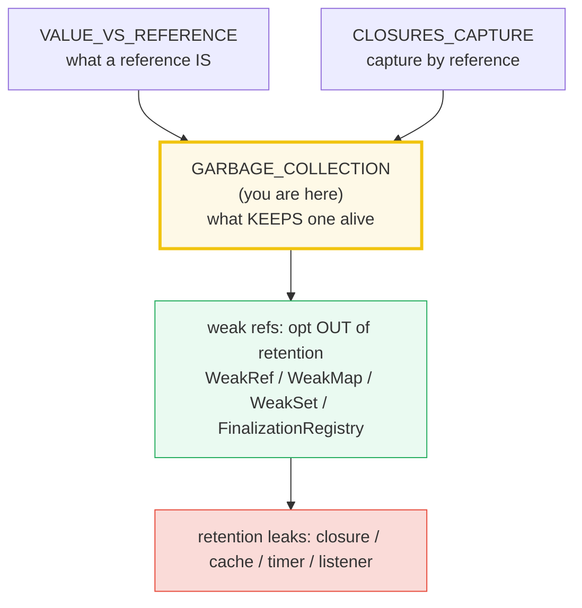
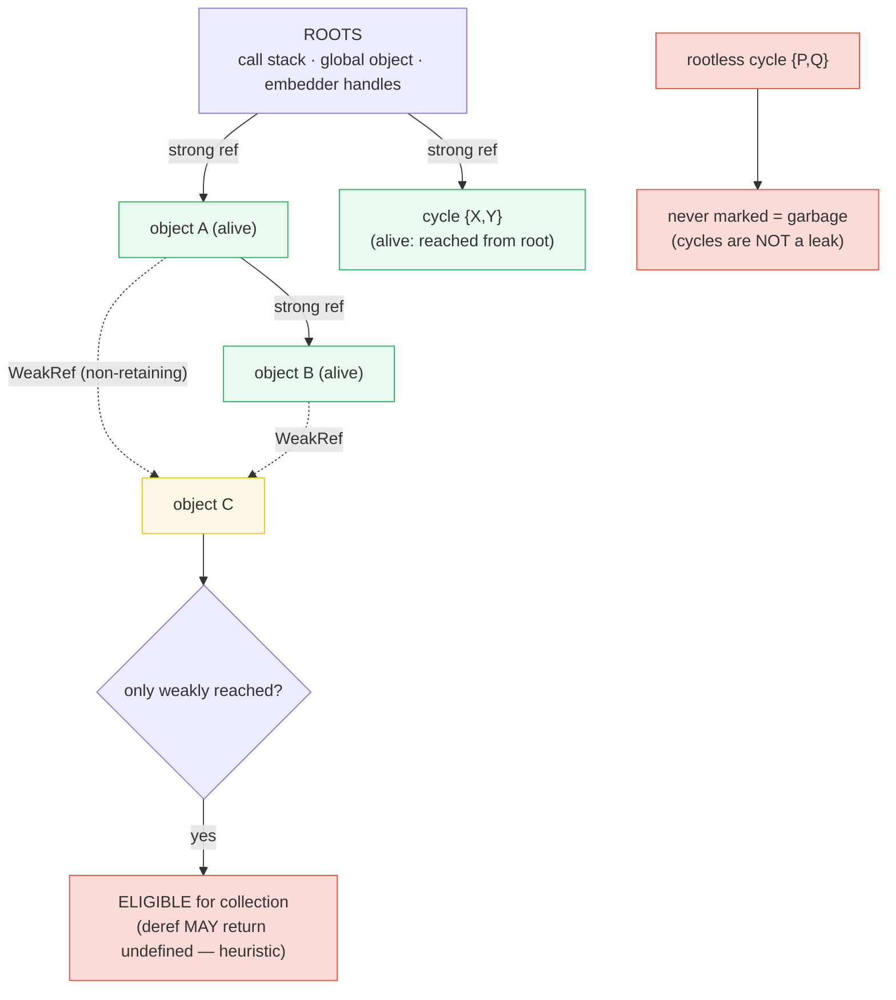
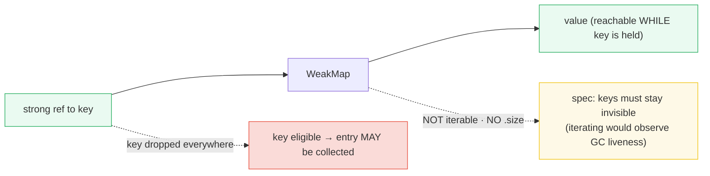
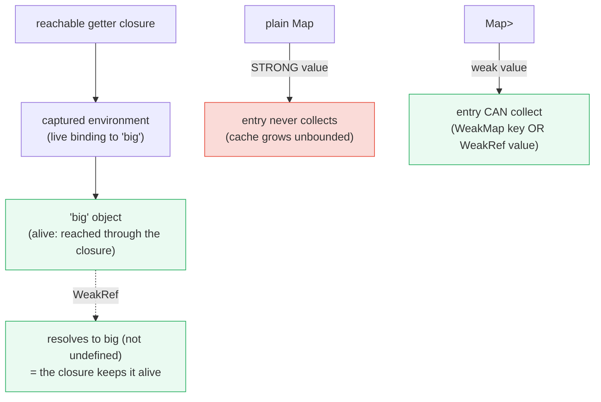
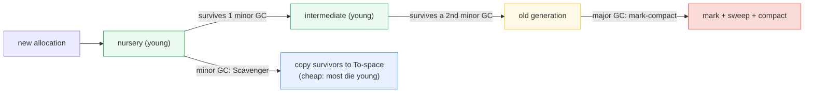

# GARBAGE_COLLECTION — Reachability, Weak Refs, Retention Leaks & V8's Orinoco

> **Goal (one line):** show, by printing the **deterministic** facts, how JS/V8
> garbage collection works — reachability from roots, the
> `WeakRef`/`WeakMap`/`WeakSet`/`FinalizationRegistry` opt-out APIs, and the
> closure/cache/timer retention leak class — **without ever asserting
> GC-timing-dependent reclamation** (reclamation is framed as "may", never
> "will").
>
> **Run:** `just run garbage_collection`
>
> **with `--expose-gc` for the gc demos:** `node --expose-gc --import tsx core/garbage_collection.ts`
>
> **Ground truth:** [`core/garbage_collection.ts`](./core/garbage_collection.ts)
> → captured stdout in
> [`core/garbage_collection_output.txt`](./core/garbage_collection_output.txt).
> Every printed block below is pasted **verbatim** from that file under a
> `> From garbage_collection.ts Section X:` callout. Nothing is hand-computed.
>
> **Prerequisites:** 🔗 [`VALUE_VS_REFERENCE`](./VALUE_VS_REFERENCE.md) — what a
> reference *is* (this bundle explains what *keeps* one alive) and
> 🔗 [`CLOSURES_CAPTURE`](./CLOSURES_CAPTURE.md) — capture-by-reference is the
> engine of the retention leak class (Section D).

---

## 1. Why this bundle exists (lineage)

JavaScript has **no manual memory management**: you allocate objects freely and
a **garbage collector** (GC) reclaims the memory of objects that are no longer
needed. The hard question — and the whole subject of memory management — is
*how the runtime decides "no longer needed."* V8 (Node's engine, and Chrome's)
answers it with **reachability**: an object is alive while a **path of strong
references** from a **root** (the call stack, the global object, embedder
handles) reaches it. The moment the last such path is dropped, the object
becomes **eligible** for collection. This is the **mark-sweep** idea, and every
modern engine (V8, SpiderMonkey, JSC) ships a refinement of it.

Three things make this bundle the **cross-language memory pivot**:

1. **The GC is nondeterministic.** V8 decides *when* to collect based on heap
   pressure and heuristics — so you must never write code that depends on an
   object "having been collected." This bundle's central discipline is to
   assert **only reachability facts** (`WeakRef.deref()` returns the value
   *while* strongly held) and **never** reclamation timing. That is why every
   `check()` below is byte-identical across two `just out` runs.
2. **Weak references are an opt-in escape hatch.** Unlike a normal (strong)
   variable, a `WeakRef`/`WeakMap`/`WeakSet` does **not** keep its target alive.
   This is how you build caches and metadata tables that do not themselves leak
   the very objects they index.
3. **The bug class is accidental retention, not premature collection.** The GC
   is conservative — it collects only what is provably unreachable. So real
   leaks in JS are the opposite of "use-after-free": they are objects kept alive
   **too long** by a closure, a cache, a timer, or a listener. This is the
   direct payoff of 🔗 `CLOSURES_CAPTURE`.



The headline contrast with sibling languages is the whole point of this bundle:

> 🔗 [`../go/GARBAGE_COLLECTOR.md`](../go/GARBAGE_COLLECTOR.md) — Go uses a
> **concurrent tri-color mark-sweep** GC, the **closest sibling** to V8's model:
> both trace reachability from roots, both move work off the mutator thread
> (Go's concurrent mark + sweep ≈ V8's Orinoco), and both expose tuning knobs
> (Go's `GOGC`/`GOMEMLIMIT` ≈ Node's `--max-old-space-size`). The difference:
> Go has **no weak-map primitive** in the language; JS gives you
> `WeakMap`/`WeakRef` to opt out of retention.
>
> 🔗 [`../rust/DROP_UNSAFE.md`](../rust/DROP_UNSAFE.md) — Rust has **no GC at
> all**. Memory is freed **deterministically** the instant the owner leaves
> scope (`Drop`/RAII), with no trace phase, no roots, no pauses. The "is this
> object still alive?" question is answered **at compile time** by the borrow
> checker, not at runtime by a heuristic. This is the **stark contrast** that
> shows what "no GC" buys (predictability) and costs (annotation discipline).

---

## 2. The mental model: reachability + roots + mark-sweep

An object is **reachable** if a chain of **strong** references leads from a
**root** to it. V8's roots are the call stack (locals on active frames), the
global object, and the embedder's handles. The GC's **mark** phase starts at
the roots, follows every strong pointer, and marks each object it lands on;
anything unmarked after the trace is **unreachable = garbage**, and the
**sweep** phase returns its memory to a free list.



**Why this beats reference-counting.** An early, naïve algorithm collected an
object when its *reference count* hit zero. That **leaks on cycles**: two
objects pointing only at each other keep each other's count above zero forever.
Mark-sweep breaks that — a cycle with **no path from a root** is never marked,
so it is reclaimed regardless of internal references. MDN is explicit: *"No
modern JavaScript engine uses reference-counting for garbage collection
anymore"* and *"all modern engines ship a mark-and-sweep garbage collector."*

> From `developer.mozilla.org/en-US/docs/Web/JavaScript/Guide/Memory_management`
> (verbatim): *"This algorithm reduces the definition of 'an object is no
> longer needed' to 'an object is unreachable'. … Currently, all modern engines
> ship a mark-and-sweep garbage collector. All improvements made in the field of
> JavaScript garbage collection (generational/incremental/concurrent/parallel
> garbage collection) over the last few years are implementation improvements of
> this algorithm, but not improvements over the garbage collection algorithm
> itself."*

Section A pins the **deterministic** reachability fact: a `WeakRef` to an
object that is *still strongly held* **must** resolve to that object.

> From garbage_collection.ts Section A:
> ```
> ROOTS (V8): the call stack (locals), the global object, embedder handles.
> An object is reachable if a STRONG-reference path exists from a root.
> Reachable objects MUST be kept; unreachable ones MAY be collected.
> 
> held.payload      -> 42
> new WeakRef(held) -> a NON-retaining view of the same object
> ref.deref()      -> {"payload":42}   (obj still strongly held)
> ref.deref() === held -> true   (the WeakRef resolves to the live object)
> [check] WeakRef.deref() === held while held is strongly referenced: OK
> [check] WeakRef.deref() !== undefined for a reachable object: OK
> [check] an aliased reference resolves to the same object (nested === held): OK
> 
> Mark-sweep (the foundation): MARK from roots via strong refs,
> SWEEP unmarked (unreachable) memory back to a free list,
> (optionally) COMPACT survivors to defragment.
> Cycles are NOT a leak here: a rootless cycle is never marked.
> ```

**`WeakRef` is non-retaining.** `new WeakRef(obj)` gives you a *view* of `obj`
that does **not** count toward its reachability. While a strong reference
exists, `ref.deref()` returns the object; this is the *only* reclamation-adjacent
claim this bundle asserts, because it is a **reachability** fact (the object is
held), not a **timing** fact (when/if it is collected).

> 🔗 `VALUE_VS_REFERENCE` — a reference is a handle to a shared heap object.
> This bundle asks the next question: what *keeps* that handle's target alive?
> Answer: a path of strong references from a root. A `WeakRef` is the one handle
> that does **not** extend that path.

---

## 3. Section B — `WeakRef` + `global.gc` (guarded `--expose-gc`)

The core language has **no way** to trigger GC programmatically — and per MDN,
*"it is also not possible to programmatically trigger garbage collection in
JavaScript — and will likely never be within the core language, although engines
may expose APIs behind opt-in flags."* V8/Node exposes one behind
**`--expose-gc`**, which installs `global.gc` as a synchronous "collect now"
function. It is **absent by default**, so this bundle **guards** every use:
`typeof globalThis.gc === "function"` ? run : skip. The bundle runs clean with
or without the flag — and the gc-dependent checks print a clear `SKIPPED` line
when the flag is off.

> From garbage_collection.ts Section B (run without `--expose-gc`):
> ```
> --expose-gc installs global.gc as a synchronous 'collect now' function.
> It is ABSENT by default. The bundle guards it so it runs either way.
> 
> global.gc exposed?  -> false   (not exposed; gc-dependent demos SKIP gracefully)
> [check] gc exposed: SKIPPED (run with --expose-gc for the gc demos)
> 
> WeakRef is NON-retaining: it does not extend the target's lifetime.
> w.deref() === obj  -> true   (obj still strongly held by local)
> [check] new WeakRef(obj).deref() === obj while obj is strongly held: OK
> typeof w.deref()   -> object   (object while reachable; undefined if collected)
> [check] w.deref() returns the object type while it is reachable: OK
> 
> After the last strong reference is dropped the object becomes ELIGIBLE
> for collection — but deref() MAY return the object OR undefined:
> V8's GC heuristics decide, so reclamation is framed as 'may', not 'will'.
> ```

**The determinism discipline (the key rule for this bundle).** Notice what the
`.ts` does **not** do after dropping the strong reference: it does **not** read
`w.deref()` and assert it is `undefined`. That would be a **timing** assertion
— V8 may not have collected the object yet, or may decide not to at all. Instead
the `.ts` asserts only:

- **Reachability:** `w.deref() === obj` *while* `obj` is strongly held (always
  true — the object is provably alive).
- **`global.gc()` runs without error** when exposed (a fact about the call, not
  about what it collected).

This is why `just out` is byte-identical across runs: no line depends on
whether V8 *actually* reclaimed the object. Run the same file with
`node --expose-gc --import tsx core/garbage_collection.ts` and the `SKIPPED`
line becomes `[check] gc exposed (--expose-gc): global.gc() ran without error: OK`
— but even then, the `.ts` never asserts the post-`gc()` `deref()` value.

> From `developer.mozilla.org/en-US/docs/Web/JavaScript/Guide/Memory_management`
> (verbatim): *"A `WeakRef` is a weak reference to an object that allows the
> object to be garbage collected, while still retaining the ability to read the
> object's content during its lifetime."*

---

## 4. Section C — `WeakMap`, `WeakSet` (weak keys) & `FinalizationRegistry`

`WeakMap` and `WeakSet` are the **keyed** weak structures: they hold their
**keys** weakly. If a key is unreachable everywhere *except* the weak structure,
the key — and, for `WeakMap`, its entry — **may** be collected. The crucial
constraint: **keys must be objects** (or non-registered symbols); a primitive
key throws a `TypeError` at runtime, because primitives can be "forged" (`1 ===
1`) and would therefore stay in the structure forever.



> From garbage_collection.ts Section C:
> ```
> WeakMap: KEYS are weakly held; the value is reachable WHILE the key is.
> wm.get(key)  -> "wm-value"   (key strongly held)
> wm.has(key)  -> true
> [check] WeakMap.get(key) === value while key is strongly held: OK
> [check] WeakMap.has(key) === true: OK
> wm.set("primitive", x) -> throws TypeError   (keys must be objects)
> [check] WeakMap rejects a primitive key (TypeError at runtime): OK
> 
> WeakSet: members are weakly held; presence does not keep them alive.
> ws.has(member) -> true
> [check] WeakSet.has(member) === true: OK
> [check] WeakSet.has(nonmember) === false (never added): OK
> 
> WeakMap/WeakSet are NOT iterable and expose NO .size (by spec design:
> iterating keys would observe GC liveness, which must stay invisible).
> [check] WeakMap has no "size" property: OK
> [check] WeakSet has no "size" property: OK
> [check] FinalizationRegistry.register(target, held, token) does not throw: OK
> [check] FinalizationRegistry.unregister(token) === true (was registered): OK
> 
> FinalizationRegistry: a callback that MAY run after a target is collected.
> It is NONDETERMINISTIC — it may run late, or never. Use only for
> non-critical cleanup; never assert that it fires.
> registry.unregister(token) -> true   (deterministic: target was registered)
> ```

**Why weak structures have no `.size` and are not iterable.** Exposing the key
set would let you observe GC liveness (`Array.from(wm.keys()).length` would
shrink as objects die) — which the spec explicitly forbids, because GC must
stay *invisible*. This is why the `.ts` asserts `!("size" in wm)` (deterministic)
and never tries to count entries.

**`FinalizationRegistry` is the most dangerous tool in the box.** It lets you
register a callback that **may** run after a target is collected — the closest
JS gets to a destructor. But the callback is **nondeterministic**: it may run
late, out of order, on a different realm's object, or **never at all**. The
`.ts` demonstrates the **deterministic** API surface (`register` does not throw;
`unregister(token)` returns `true` iff the token was registered) but
deliberately **never** asserts that the callback fired — it does not even print
the callback array's length, because that number varies across runs.

> From `developer.mozilla.org/en-US/docs/Web/JavaScript/Guide/Memory_management`
> (verbatim): *"Due to performance and security concerns, there is no guarantee
> of when the callback will be called, or if it will be called at all. It should
> only be used for cleanup — and non-critical cleanup. There are other ways for
> more deterministic resource management, such as `try...finally`."*

> 🔗 `OBJECTS_RECORDS` — `WeakMap`/`WeakSet` are also covered as **collections**
> in the P5 `collections_deep` treatment (API, iteration, `Map` vs `WeakMap`).
> This bundle covers them specifically as **GC opt-out** primitives — the
> memory-management angle, not the data-structure angle.

---

## 5. Section D — Retention bugs: closures, caches, timers, listeners

The GC reclaims **only** unreachable objects. The leak class in JS is therefore
the opposite of a use-after-free: it is **accidental retention** — a long-lived
reference keeps an object alive past its usefulness. The four classic vectors
are **closures**, **caches**, **timers**, and **listeners**.

**The closure-retention pattern (the 🔗 `CLOSURES_CAPTURE` connection).** A
closure captures its environment **by reference** — a live binding, not a
snapshot. So as long as the closure is reachable, every object its environment
references is reachable too. This is **deterministic** (a reachable closure
keeps its captured object alive), so the `.ts` asserts it via a `WeakRef` to the
captured object:

> From garbage_collection.ts Section D:
> ```
> makeRetainer() returns a getter that closes over a 'big' object.
> While the getter is reachable, the big object is reachable too.
> [check] closure-retained object: WeakRef.deref() !== undefined (closure keeps it alive): OK
> [check] closure-retained object: getter() === 4 (captures the live binding): OK
> 
> A plain Map<string, V> STRONGLY holds values -> entries never collect.
> cache.size after 3 inserts -> 3   (grows without bound)
> [check] plain Map retains all entries (size === 3): OK
> weakCache.get('live')?.deref()?.data -> [1,2]   (value while live held)
> [check] WeakRef-wrapped cache value resolves while the object is held: OK
> 
> Other retention vectors (documented — Node/browser specific):
>   * setInterval callback: keeps its captured closure alive until cleared.
>   * addEventListener: keeps the listener (and its closure) alive until removed.
>   * detached DOM nodes (browser): a node removed from the DOM but held by JS.
>   * global/module-top arrays: live for the process lifetime, never swept.
> Fix: clear timers (clearInterval), remove listeners, null stale references,
> and prefer WeakMap/WeakRef caches so entries CAN be reclaimed.
> ```



**The unbounded cache — the canonical retention leak.** A plain
`Map<string, V>` **strongly** holds its values: entries never become garbage, so
the cache grows without bound. The MDN-canonical fix is a `Map<string,
WeakRef<V>>` whose values can be reclaimed, paired with a `FinalizationRegistry`
that prunes dead entries. The `.ts` asserts both the leak (plain `Map` keeps all
3 entries) and the fix's shape (the `WeakRef`-wrapped value resolves while the
object is held) — but, per the discipline, never asserts the dead entry was
actually pruned.

**The other vectors (Node/browser specific, documented not asserted).**
`setInterval` keeps its callback closure alive until `clearInterval`;
`addEventListener` keeps the listener (and its closure) alive until
`removeEventListener`; a detached DOM node (browser) removed from the document
but still held by JS is never collected; a module-top array lives for the whole
process. The universal fix: **null the stale reference**, clear the timer,
remove the listener, or use a weak-keyed structure so the entry **can** be
reclaimed.

> 🔗 `CLOSURES_CAPTURE` — this bundle asserts that "a reachable closure keeps
> its captured object alive." That bundle **explains why**: capture is by
> reference (a live binding), so the closure's environment is a strong-reference
> path that the GC traces through. The retention leak is capture working
> *exactly as specified* — against you.

---

## 6. Section E — V8's generational heap + Orinoco + cross-language

Everything above is *language*. This section is *engine*: how V8 actually
implements mark-sweep. These are **engine facts** (V8.dev), not runnable
assertions about a specific collection — so the `.ts` prints the model and
asserts only **deterministic structural** facts (the *keys* of
`process.memoryUsage`, never their values, which vary per run).

**The generational heap.** V8 splits the heap into a **young generation**
(nursery + intermediate, implemented as a semi-space: From/To) and an **old
generation**. New allocations start in the nursery; survivors of one minor GC
become "intermediate"; survivors of a second are **promoted** to old. This
exploits the **Generational Hypothesis** — *"most objects die young"* — so minor
GCs (the **Scavenger**) are frequent and cheap (they copy only survivors), while
major GCs (**mark-compact**) are rare and costly (they mark the whole old gen).



**Orinoco — parallel, incremental, concurrent.** Orinoco is the codename for
V8's multi-year project to take work *off the main thread*. It uses three
techniques, each progressively harder and better:

> From `v8.dev/blog/trash-talk` (verbatim definitions):
> - **Parallel** — *"the main thread and helper threads do a roughly equal
>   amount of work at the same time. This is still a 'stop-the-world' approach,
>   but the total pause time is now divided by the number of threads."*
> - **Incremental** — *"the main thread does a small amount of work
>   intermittently. … this does not reduce the amount of time spent on the main
>   thread … it just spreads it out over time."*
> - **Concurrent** — *"the main thread executes JavaScript constantly, and
>   helper threads do GC work totally in the background. … The advantage here is
>   that the main thread is totally free to execute JavaScript."*

The result, per V8: the parallel Scavenger cut young-gen GC time by ~20–50%,
and concurrent marking/sweeping cut pause times in heavy WebGL games by up to
50%. Idle-time GC can cut Gmail's heap by ~45% when idle.

> From garbage_collection.ts Section E:
> ```
> V8 heap layout (generational):
>   YOUNG generation = nursery + intermediate (semi-space: From/To).
>     Allocations start in the nursery; survivors of one minor GC become
>     'intermediate'; survivors of a second minor GC are promoted to OLD.
>   OLD generation    = collected by the major (mark-compact) GC.
> 
> Generational Hypothesis: 'most objects die young' (V8.dev). So minor GCs
> (Scavenger) are frequent and cheap (copy only survivors); major GCs
> (mark-compact) are rare and costly (mark the whole old generation).
> 
> Two collectors: Minor GC (Scavenger, young gen, copies survivors) +
> Major GC (Mark-Compact, whole heap). Orinoco adds parallel,
> incremental, and concurrent techniques to keep them off the main thread.
> 
> Orinoco techniques (V8.dev 'Trash talk'):
>   PARALLEL    — main + helper threads work together during a stop-the-world
>                 pause; total pause divided across threads.
>   INCREMENTAL — main thread does small GC slices interleaved with JS;
>                 spreads work over time (does not reduce total main-thread time).
>   CONCURRENT  — helper threads do GC entirely in the background while the
>                 main thread runs JS uninterrupted (the hardest, best technique).
> 
> process.memoryUsage() — V8 heap fields (keys only; values are run-specific):
>   arrayBuffers
>   external
>   heapTotal
>   heapUsed
>   rss
> [check] process.memoryUsage() reports "heapUsed": OK
> [check] process.memoryUsage() reports "heapTotal": OK
> [check] process.memoryUsage() reports "external": OK
> [check] process.memoryUsage() reports "arrayBuffers": OK
> 
> Cross-language memory models:
>   JS   — GC reclaims UNREACHABLE objects; weak refs are an OPT-IN escape hatch.
>   Go   — concurrent tri-color mark-sweep GC (a close sibling); GOGC/GOMEMLIMIT
>          tune trigger + soft limit; no weak-map primitive in the language.
>   Rust — NO GC: deterministic Drop/RAII frees the instant the owner leaves
>          scope. Memory bugs become compile errors (the borrow checker).
> 
> Node memory flags (documented):
>   --max-old-space-size=N  raise V8's old-generation heap limit (MB).
>   Exceeding it -> 'JavaScript heap out of memory' (FATAL alloc failure).
>   --expose-gc             install global.gc for synchronous collection.
> ```

**`process.memoryUsage()` — deterministic shape, nondeterministic values.** The
field *names* (`heapUsed`, `heapTotal`, `external`, `arrayBuffers`, `rss`) are
stable across runs, so the `.ts` asserts their presence. The *numbers* vary
every run (heap pressure, allocation timing), so they are **never** printed as
verified values — only the sorted key list appears.

**Node memory flags.** `--max-old-space-size=N` (MB) raises V8's old-generation
limit; exceeding it throws a fatal *JavaScript heap out of memory* allocation
failure. `--expose-gc` installs `global.gc`. Both are documented in MDN's
*Memory management* guide (`node --max-old-space-size=6000 index.js`,
`node --expose-gc --inspect index.js`).

---

## 7. Pitfalls (the expert payoff)

| Trap | Symptom | Fix |
|---|---|---|
| Asserting `weakref.deref() === undefined` "after GC" | Flaky test — passes sometimes, fails others (V8 may not have collected it) | Assert **reachability** (`deref() === obj` *while held*) never **reclamation timing**. Frame collection as "may." |
| Assuming `global.gc()` exists | `TypeError: global.gc is not a function` in production (flag absent) | Guard: `if (typeof globalThis.gc === "function") globalThis.gc();`. Skip gc-dependent checks gracefully. |
| `WeakMap`/`WeakSet` with a primitive key | `TypeError: Invalid value used as weak key` at runtime | Keys must be **objects** (or non-registered symbols). Box the primitive, or use a plain `Map`. |
| Unbounded `Map` cache | Memory grows monotonically; entries never collect | Use `Map<string, WeakRef<V>>` + `FinalizationRegistry` to prune, or a WeakMap keyed by the object itself. |
| Closure retains a "big" object | A returned getter keeps a large captured object alive forever | Null the captured binding when done, or restructure so the closure does not capture it. Don't capture more than you need. |
| `setInterval` callback never cleared | The timer (and its closure) live until the process exits | Store the handle, call `clearInterval(id)` on shutdown / when the work is done. |
| `addEventListener` without `removeEventListener` | Listener (and its closure) retained as long as the emitter lives (often the page/process lifetime) | Remove the listener, or use `{ once: true }` / `AbortSignal` for one-shot / cancellable subscription. |
| Detached DOM node held by JS (browser) | Node removed from document but still referenced → never collected | Null the JS reference after removing from the DOM. |
| Relying on `FinalizationRegistry` for correctness | Callback may run **late, out of order, or never** → resource leak / double-free | Use `try...finally` for deterministic cleanup. FinalizationRegistry is **only** for non-critical cleanup (cache pruning). |
| Polling a `WeakRef` in a loop ("is it gone yet?") | Wastes CPU; result is nondeterministic | Use `FinalizationRegistry` to be *notified* (lazily), or restructure to not need to know. |
| Assuming `WeakMap`/`WeakSet` have `.size` / are iterable | `undefined` / no such method — they are deliberately opaque | They have no size and are not iterable (spec: GC liveness must stay invisible). Track liveness yourself if you must. |
| Module-top array/map kept "just in case" | Grows for the whole process lifetime — a slow leak | Scope it, or use a weak structure, or evict explicitly. |

---

## 8. Cheat sheet

```typescript
// === Reachability (the whole game) =========================================
//   ROOTS = call stack (locals) + global object + embedder handles.
//   An object is ALIVE while a STRONG-reference path from a root reaches it.
//   Mark-sweep: MARK from roots via strong refs; SWEEP unmarked = garbage;
//   (optionally) COMPACT survivors. Cycles are NOT a leak (rootless cycle is
//   never marked). Reference-counting IS broken by cycles -> no engine uses it.

// === DETERMINISM (this bundle's key rule) ==================================
//   GC TIMING is nondeterministic. Assert ONLY:
//     - reachability: new WeakRef(obj).deref() === obj  WHILE obj is held.
//     - global.gc() runs without error  (when --expose-gc is on).
//     - a reachable closure keeps its captured object alive.
//   NEVER assert: "after gc() the weakref is undefined" — it may not be.
//   Frame reclamation as "MAY", never "WILL".

// === WeakRef ===============================================================
//   const w = new WeakRef(obj);   // NON-retaining: does not extend lifetime.
//   w.deref();                    // obj while reachable; undefined if collected.
//   // --expose-gc:  const gc = globalThis.gc;  if (typeof gc === "function") gc();

// === WeakMap / WeakSet (weak KEYS) =========================================
//   const wm = new WeakMap();  wm.set(key, value);   // key MUST be an object
//   const ws = new WeakSet();  ws.add(obj);
//   // NOT iterable, NO .size (spec: keys must stay invisible to GC observation).
//   // wm.set("primitive", x)  ->  TypeError (invalid weak key).

// === FinalizationRegistry (DANGEROUS — nondeterministic) ===================
//   const reg = new FinalizationRegistry(held => { /* MAY run after collect */ });
//   reg.register(target, heldValue, unregisterToken);
//   reg.unregister(unregisterToken);   // true iff was registered
//   // Callback MAY run late / out of order / NEVER. Use ONLY for non-critical
//   // cleanup (e.g. pruning a WeakRef cache). Prefer try...finally.

// === Retention leaks (the bug class) =======================================
//   closure: a reachable closure keeps its captured objects alive.
//   cache:   plain Map STRONGLY holds values -> grows unbounded.
//            fix: Map<string, WeakRef<V>> + FinalizationRegistry to prune.
//   timer:   setInterval keeps its callback closure alive -> clearInterval(id).
//   listener: addEventListener keeps the listener alive -> removeEventListener.

// === V8 engine (facts, not runnable) =======================================
//   Generational: young (nursery+intermediate, semi-space From/To) -> old.
//   Generational Hypothesis: "most objects die young" -> minor GCs cheap.
//   Two collectors: Minor GC (Scavenger) + Major GC (Mark-Compact).
//   Orinoco: PARALLEL (stop-the-world, split across threads),
//            INCREMENTAL (small slices interleaved with JS),
//            CONCURRENT (background, main thread free) — the best.
//   process.memoryUsage(): { rss, heapTotal, heapUsed, external, arrayBuffers }
//                          (keys deterministic; VALUES vary per run).
//   --max-old-space-size=N (MB) ; --expose-gc (install global.gc).
```

---

## Sources

Every behavioral claim above was verified against the MDN Web Docs and the V8
developer blog, then corroborated by at least one independent secondary source.
The **deterministic** reachability / weak-ref / retention facts are *additionally*
asserted at runtime by the `.ts` itself (`check()` throws on any mismatch) — the
strongest possible verification: the actual V8 engine's verdict. Reclamation-
timing claims are deliberately **not** asserted (they are nondeterministic), and
are instead quoted verbatim from MDN/V8.dev.

- **MDN — Memory management** (mark-and-sweep; reachability from roots; *"all
  modern engines ship a mark-and-sweep garbage collector"*; reference-counting's
  cycle leak; `WeakRef`/`FinalizationRegistry`; `--max-old-space-size` /
  `--expose-gc`; *"there is no guarantee of when the callback will be called, or
  if it will be called at all"*):
  https://developer.mozilla.org/en-US/docs/Web/JavaScript/Guide/Memory_management
- **MDN — `WeakRef`** (a non-retaining reference; `deref()` returns the object
  or `undefined`; *"the actual lifetime of the object ... is not specified"*):
  https://developer.mozilla.org/en-US/docs/Web/JavaScript/Reference/Global_Objects/WeakRef
- **MDN — `FinalizationRegistry`** (register/unregister; *"a callback when a
  value is garbage-collected"*; nondeterministic, may run in a different realm,
  may not run at all):
  https://developer.mozilla.org/en-US/docs/Web/JavaScript/Reference/Global_Objects/FinalizationRegistry
- **MDN — `WeakMap`** (keys weakly held; keys must be objects/symbols; not
  iterable; no `size`; ephemerons):
  https://developer.mozilla.org/en-US/docs/Web/JavaScript/Reference/Global_Objects/WeakMap
- **MDN — `WeakSet`** (members weakly held; not iterable; no `size`):
  https://developer.mozilla.org/en-US/docs/Web/JavaScript/Reference/Global_Objects/WeakSet
- **V8.dev — "Trash talk: the Orinoco garbage collector"** (parallel /
  incremental / concurrent definitions; the generational layout; the
  Scavenger; the Generational Hypothesis; root set = execution stack + global
  object; the 20–50% / up-to-50% / ~45% results):
  https://v8.dev/blog/trash-talk
- **V8.dev — "Concurrent marking in V8"** (incremental marking splits work into
  chunks so JS runs between them; concurrent marking in the background; write
  barriers):
  https://v8.dev/blog/concurrent-marking
- **V8.dev — "Weak references and finalizers"** (the feature announcement;
  `WeakRef`/`FinalizationRegistry` semantics and intended cache use cases):
  https://v8.dev/features/weak-references
- **Node.js — "Understanding and tuning memory"** (`--expose-gc` exposes
  `global.gc` for manual collection; heap snapshot tooling):
  https://nodejs.org/learn/diagnostics/memory/understanding-and-tuning-memory
- **Node.js API — `process.memoryUsage()`** (the `rss` / `heapTotal` /
  `heapUsed` / `external` / `arrayBuffers` fields):
  https://nodejs.org/api/process.html#processmemoryusage

**Secondary corroboration (independent of MDN/V8.dev, ≥1 per major claim):**
- Cloudflare — *"We shipped FinalizationRegistry in Workers: why you should
  never use it"* (*"garbage collection is non-deterministic, and may clean up
  your unused memory at some [unknown] time"* — the determinism caveat this
  bundle enforces): https://blog.cloudflare.com/weakrefs-finalizationregistry/
- The Modern JavaScript Tutorial — *"Garbage collection"* + *"WeakRef and
  FinalizationRegistry"* (reachability from roots; `deref()` returns `undefined`
  if collected): https://javascript.info/garbage-collection ,
  https://javascript.info/weakref-finalizationregistry
- TC39 WeakRefs proposal — (*"WeakRef and FinalizationRegistry … their correct
  use takes careful thought, and they are best avoided if possible"*):
  https://github.com/tc39/proposal-weakrefs
- Stack Overflow — *"Forcing garbage collection in Node to test WeakRef and
  FinalizationRegistry"* (the `--expose-gc` workflow and the nondeterminism
  even with the flag): https://stackoverflow.com/questions/65175380

**Facts that could not be verified by running** (documented, not executed,
because they are engine-internal timing or process-fatal behavior): the exact
Orinoco pause-time reductions (20–50%, ~45%) are V8.dev's published measurements,
not reproducible from a single `tsx` run; `--max-old-space-size`'s fatal
*JavaScript heap out of memory* path is deliberately not triggered (it kills the
process); and whether `global.gc()` actually collects a *specific* object is a
V8 heuristic — which is precisely why the `.ts` never asserts it. Every
**deterministic** claim above (reachability, weak-key type errors, the
`memoryUsage()` field names, closure retention) is asserted at runtime by the
`.ts` itself.
