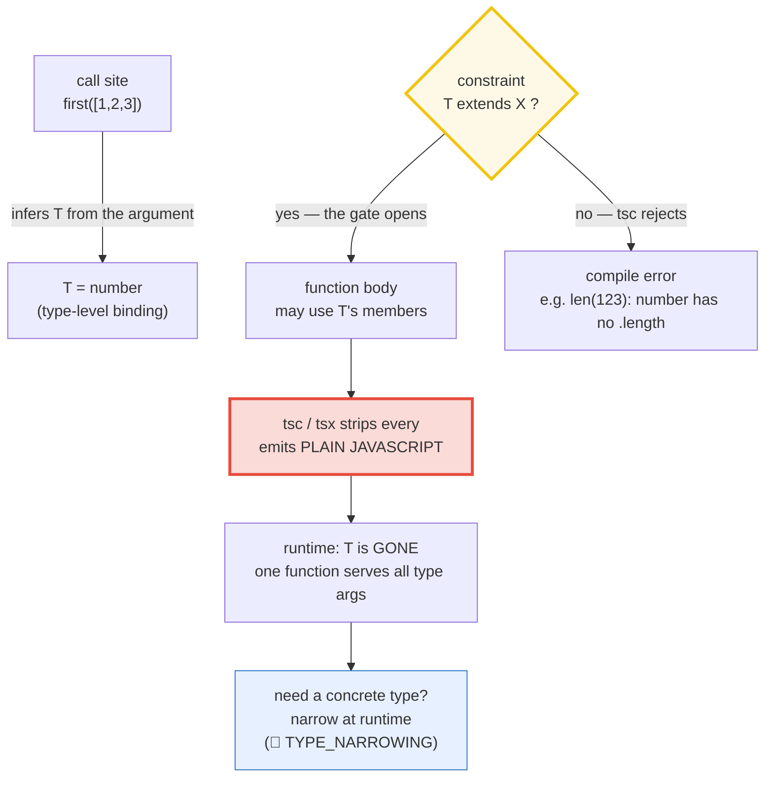
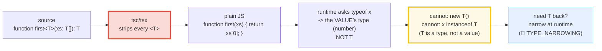

# GENERICS — One Function/Type/Class, Many Types — and Why They Are ERASED at Runtime

> **Goal (one line):** show — by `check()`'d runtime behavior AND tsc-verified
> `expectType<>`/`@ts-expect-error` compile-time proofs — how a single generic
> function/type/class works over a RANGE of types while keeping type safety,
> and pin the headline fact for cross-language learners: **TypeScript generics
> are ERASED at runtime** (no reification; `new T()` and `instanceof T` are
> compile errors), which forces the runtime-narrowing bridge.
>
> **Run:** `just run generics` &nbsp;·&nbsp; Typecheck: `just typecheck generics`
>
> **Ground truth:** [`generics.ts`](./core/generics.ts) → captured stdout in
> [`generics_output.txt`](./core/generics_output.txt). Every number/table/check
> below is pasted **verbatim** from that file under a `> From generics.ts
> Section X:` callout. Nothing is hand-computed.
>
> **Prerequisites:**
> - [`VALUES_TYPES_COERCION`](./VALUES_TYPES_COERCION.md) — the foundation: TS
>   types are ERASED at runtime; `typeof`/`instanceof` are the only runtime
>   type operators. Generics are erased just like every other type.
> - [`TYPE_NARROWING`](./TYPE_NARROWING.md) — the bridge this bundle keeps
>   pointing at. Because `T` is erased, you cannot ask "is `x` a `T`?" at
>   runtime; narrowing is how you get back to a concrete runtime type.

---

## 1. Why this bundle exists (lineage)

Generics let **one** function/type/class describe a **family** of types via
**type parameters** (`<T>`), with **inference** doing the binding at the call
site. Without generics, the identity function would either be locked to one
type (`function id(x: number): number`) or lose all type information
(`function id(x: any): any`). Generics give you a third option: capture the
caller's type in a variable `T` and thread it through, so `id(5)` returns
`number` and `id("hi")` returns `string` — precisely, with no duplication.



> 🔗 [`STRUCTURAL_TYPING`](./STRUCTURAL_TYPING.md) — generics and structural
> typing are the two pillars of TS's type-level reuse. `Box<T>` is structural
> in its members AND generic in `T`; the brand pattern is generic over the
> branded base type.
>
> 🔗 [`INTERFACES_VS_ALIASES`](./INTERFACES_VS_ALIASES.md) — both `interface`
> and `type` can be generic; Section C shows `Box<T>` (interface) and
> `Pair<A,B>` (type alias) side by side.
>
> 🔗 [`TYPE_NARROWING`](./TYPE_NARROWING.md) — **the** bridge this bundle
> points at. Section D proves `T` is gone at runtime; narrowing is how you
> recover a concrete type when you need one.
>
> 🔗 [`UNIONS_INTERSECTIONS`](./UNIONS_INTERSECTIONS.md) (P2) — the constraint
> `T extends A & B` (Section E) is an intersection used as a generic bound.

### The headline cross-language contrast

**TypeScript generics are ERASED at runtime** (like Java; unlike C# which
**reifies** them). This single fact explains every sharp edge below: you cannot
`new T()`, you cannot `x instanceof T`, and two `Stack<number>`/`Stack<string>`
instances share the **same** runtime class. Rust and Go (1.18+) take the
opposite path — they **monomorphize**, emitting a real compiled copy per
concrete type (Rust) or per GC shape (Go), so the type information survives into
the binary at a runtime cost of zero.

> 🔗 [`../go/GENERICS.md`](../go/GENERICS.md) — Go 1.18+ type parameters +
> constraints. **Go generics are erased too** (GC shape stenciling + a shared
> dictionary) — the closest sibling to TS. You likewise cannot `new(T)` a type
> parameter.
>
> 🔗 [`../rust/GENERICS.md`](../rust/GENERICS.md) — Rust **monomorphizes**:
> `Stack<u32>` and `Stack<&str>` compile to **distinct** machine code, with
> zero runtime cost and full type information per instantiation. The **stark**
> contrast with TS: Rust's `T` is real in the binary; TS's `T` is gone.

---

## 2. Two axes of evidence (this bundle's specialty)

Because generics are a **compile-time** feature observed by both the compiler
and the runtime, every claim here is witnessed **twice**:

- **`check()`** — a **runtime** invariant of the *erased value* (`typeof` sees
  the value's own type, never `T`; one `first` function serves all type args;
  the constructor-factory idiom for `new`).
- **`expectType<Equal<typeof x, T>>`** — a **compile-time** witness of the
  *inferred type*. The helper (in the `.ts`) is:

  ```typescript
  type Equal<A, B> =
    (<T>() => T extends A ? 1 : 2) extends <T>() => T extends B ? 1 : 2
      ? true : false;
  function expectType<T extends true>(msg: string): void { /* prints [check] */ }
  ```

  If an `Equal<...>` claim resolves to `false`, **tsc fails** (`false` is not
  assignable to `true`) — so every inference claim is enforced by the compiler.
- **`@ts-expect-error`** — a **compile-time** witness of "this would error"
  (cannot `new T()`, cannot `instanceof T`, constraint violations). Each
  directive suppresses a **real** error; an unused directive is itself an error.

---

## 3. Section A — generic function + inference (T inferred from the argument)

The "hello world" of generics is the **identity** function — a single
implementation that works over every type, *without* losing the input→output
type link the way `any` does:

```typescript
function identity<T>(x: T): T { return x; }
const idNum = identity<number>(42); // EXPLICIT type argument: T=number
const idLit = identity("hi");       // INFERRED: T is bound from the argument
```

You can call a generic in two ways: pass the type argument explicitly
(`identity<number>(42)`), or let **type argument inference** set `T`
automatically from the argument (`identity("hi")`).

> From generics.ts Section A:
> ```
> Generic identity: T is the link between input and output:
> [check] identity<number>(42) returns number: OK
> [check] identity("hi") infers T="hi" (literal preserved, not widened): OK
>   identity<number>(42) = 42   (T=number, explicit)
>   identity("hi")       = "hi"   (T="hi", literal inferred)
> [check] identity(42) === 42: OK
> [check] identity("hi") === "hi": OK
> ```

**The expert subtlety — literal preservation in direct inference.** A
string-*literal* argument to a plain `<T>` infers the **literal** type `"hi"`,
*not* the widened `string`. (This is the asymmetry the `const` type parameter
in Section E exists to *force* the other way for arrays/objects.) Contrast
`first([1,2,3])` below: there the literals live **inside an array**, so they
**do** widen to `number`. The rule: a direct literal argument preserves its
literal type; literals *inside a container* widen.

> From generics.ts Section A:
> ```
> first<T>(xs): T inferred from the array's element type:
> [check] first([1,2,3]) infers T=number -> number|undefined: OK
> [check] first(["a","b"]) infers T=string -> string|undefined: OK
> [check] first([] as number[]) -> number|undefined: OK
>   first([1,2,3])    = 1   (T=number)
>   first(["a","b"])  = "a"   (T=string)
>   first([])         = undefined   (T=number, empty array -> undefined)
> [check] first([1,2,3]) === 1: OK
> [check] first(["a","b"]) === "a": OK
> [check] first([]) === undefined: OK
> ```

`first<T>(xs: readonly T[]): T | undefined` infers `T` from the **element**
type of the array. `first([1,2,3])` binds `T=number`; `first(["a","b"])` binds
`T=string`. The return is `T | undefined` because the array may be empty —
`noUncheckedIndexedAccess` makes `xs[0]` explicitly `T | undefined`, so the
caller is forced to handle the empty case.

> 🔗 [`VALUES_TYPES_COERCION`](./VALUES_TYPES_COERCION.md) §2 — the `typeof`
> operator that Section D uses to prove erasure. Generics, like all TS types,
> leave no trace for `typeof` to find.

---

## 4. Section B — CONSTRAINTS: `extends` and `keyof` (the compile-time gate)

A bare `<T>` can be **anything** — so you cannot call *any* method on it inside
the body. The constraint `T extends X` is a **compile-time gate**: it promises
the body that every `T` satisfies `X` (so `X`'s members are usable), and it
**rejects** call sites whose type fails the gate.

```typescript
function len<T extends { length: number }>(x: T): number { return x.length; }
len("abc");     // OK  — string has .length
len([1, 2]);    // OK  — array has .length
len(123);       // ERROR — number has no .length (proof_lenRejectsNumber)
```

> From generics.ts Section B:
> ```
> Constraint `T extends { length: number }` — accepts any shape with .length:
>   len("abc")      = 3   (string has .length)
>   len([1,2])      = 2   (array has .length)
>   len({length:7}) = 7   (any object literal with .length)
> [check] len("abc") === 3: OK
> [check] len([1,2]) === 2: OK
> [check] len({length:7}) === 7: OK
> ```

**`keyof` + indexed access — the exact-property-type payoff.** When you need to
read a property off a generic `T`, the constraint `K extends keyof T` ties the
key to `T`'s own keys, and the return type `T[K]` is the property's **exact**
type (no widening to a union of all value types):

```typescript
function get<T, K extends keyof T>(obj: T, key: K): T[K] { return obj[key]; }
const o = { a: 1, b: "x", c: true };
get(o, "a"); // number  — T[K] where K="a"
get(o, "b"); // string
get(o, "m"); // ERROR — "m" is not keyof {a;b;c} (proof_getRejectsBadKey)
```

> From generics.ts Section B:
> ```
> Constraint `K extends keyof T` — returns the EXACT property type T[K]:
> [check] get(obj, "a") is number (T[K]): OK
> [check] get(obj, "b") is string (T[K]): OK
> [check] get(obj, "c") is boolean (T[K]): OK
>   get(obj, "a") = 1   (T[K] = number)
>   get(obj, "b") = "x"   (T[K] = string)
>   get(obj, "c") = true   (T[K] = boolean)
> [check] get(obj, "a") === 1: OK
> [check] get(obj, "b") === "x": OK
> [check] get(obj, "c") === true: OK
> ```
> ```
> (tsc-verified, not run: proof_lenRejectsNumber, proof_getRejectsBadKey —
>  each @ts-expect-error suppresses a real constraint-violation error)
> [check] len(123) is a compile error (number has no .length): OK
> [check] get({a:1}, "b") is a compile error ("b" is not keyof {a}): OK
> ```

> 🔗 [`STRUCTURAL_TYPING`](./STRUCTURAL_TYPING.md) — `keyof T` and `T[K]` are
> the **type queries** that make generic access safe; the same queries power
> `Pick`/`Omit`/`Record` (🔗 UTILITY_TYPES, P2).

---

## 5. Section C — generic class + interface/type + DEFAULT type params

Generics are not just for functions. A **generic class** is parameterized per
*instance* — `new Stack<number>()` and `new Stack<string>()` are two different
**type-level** bindings of the same class. A **generic interface** (`Box<T>`)
and **generic type alias** (`Pair<A,B>`) carry their type arguments the same
way.

```typescript
class Stack<T> {
  private readonly items: T[] = [];
  push(x: T): void { this.items.push(x); }
  pop(): T | undefined { return this.items.pop(); }
  get size(): number { return this.items.length; }
}
interface Box<T> { readonly value: T; }
type Pair<A, B> = readonly [A, B];
```

> From generics.ts Section C:
> ```
> Generic class Stack<T> — the class is parameterized per instance:
> [check] Stack<number>.pop() returns number|undefined: OK
>   pushed 1,2,3 ; pop() = 3 ; size = 2
> [check] Stack LIFO: pop() === 3: OK
> [check] Stack LIFO: next pop() === 2: OK
> [check] Stack size after 2 pops === 1: OK
> ```
> ```
> A Stack<string> binds T=string at the type level:
> [check] Stack<string>.pop() returns string|undefined: OK
>   pushed "a","b" ; pop() = "b"
> [check] Stack<string> pop() === "b": OK
> ```
> ```
> Generic interface Box<T> and type alias Pair<A,B>:
> [check] Box<number>.value is number: OK
> [check] Box<string>.value is string: OK
> [check] Pair<number,string> is readonly [number,string]: OK
>   Box<number>  = {"value":42}
>   Box<string>  = {"value":"hi"}
>   Pair<number,string> = [1,"x"]
> [check] numBox.value === 42: OK
> [check] strBox.value === "hi": OK
> [check] pair === [1,'x']: OK
> ```

**Per the TS handbook:** a class has two sides — the **static** side and the
**instance** side. Generic classes are generic only over their **instance**
side; static members cannot use the class's type parameter.

**DEFAULT type parameters** (TS 2.3+). `<T = string>` makes the type argument
**optional**: omit it and `T` defaults to `string`; provide one and it
overrides. Required parameters must not follow optional ones, and a default
must satisfy any constraint.

```typescript
interface DefaultBox<T = string> { readonly value: T; }
const a: DefaultBox        = { value: "default" }; // T=string (the default)
const b: DefaultBox<number> = { value: 99 };        // T=number (override)
```

> From generics.ts Section C:
> ```
> DEFAULT type param `<T = string>` — omit to use the default:
> [check] DefaultBox (omitted) -> T=string (the default): OK
> [check] DefaultBox<number> overrides the default: OK
>   DefaultBox            = {"value":"default"}   (T defaulted to string)
>   DefaultBox<number>    = {"value":99}   (T overridden to number)
> [check] defaulted (default T=string) value === "default": OK
> [check] overridden DefaultBox<number> value === 99: OK
> ```

> 🔗 [`INTERFACES_VS_ALIASES`](./INTERFACES_VS_ALIASES.md) — both `interface`
> and `type` accept type parameters and defaults; the differences (declaration
> merging, name in errors, etc.) live there.

---

## 6. Section D — ERASURE: the payoff (no `new T()`, no `instanceof T`)

This is the headline. **At runtime, `T` is gone.** `tsx`/`esbuild`/`tsc` strip
every `<T>` and every constraint, emitting plain JavaScript. So the runtime can
only see the **value's** own type — never the type parameter. Three runtime
proofs, all `check()`'d:



**Proof 1 — `typeof` sees the value, not `T`.** `first<number>([1,2,3])`
returns the number `1`. `typeof` reports `"number"` (the value's own type) and
the value's constructor is `Number` — the **runtime class of the value**, never
the erased type parameter `T`.

> From generics.ts Section D:
> ```
> ERASURE: a generic fn compiles to plain JS — no T at runtime:
>   first<number>([1,2,3]) = 1
>   typeof v               = number   (the VALUE's type, not T)
>   ctorName(v)            = Number   (the VALUE's runtime class, not T)
> [check] first<number>([1,2,3]) === 1 (the value): OK
> [check] typeof v === "number" (the value's own type — T is gone): OK
> [check] ctorName(v) === "Number" (runtime sees the value's class, never T): OK
> ```

**Proof 2 — ONE function serves every type arg.** `first<number>` and
`first<string>` are the **same** function object at runtime — the type
arguments are erased. (Contrast Rust, which **monomorphizes** a separate
compiled copy per concrete type.)

> From generics.ts Section D:
> ```
> ONE `first` function serves every type arg (erased — no per-T copy):
>   fnNum === fnStr : true
>   first.name      = first
> [check] first<number> and first<string> are the SAME function (erased): OK
> ```

**Proof 3 — two generic instances share ONE runtime class.** A `Stack<number>`
and a `Stack<string>` are the **same** JS class: identical constructor,
identical prototype. There is no runtime "Stack of number". (This is exactly
why `instanceof Stack` works but a hypothetical `instanceof Stack<number>`
**could not** — the `<number>` is gone.)

> From generics.ts Section D:
> ```
> Two generic instances share ONE runtime class (the type arg is erased):
>   sn.constructor === ss.constructor            : true
>   sn.constructor.name                           : Stack
>   Object.getPrototypeOf(sn) === getPrototypeOf(ss): true
> [check] Stack<number> and Stack<string> share the SAME constructor (erased): OK
> [check] both instances share the SAME prototype (no per-type-arg class): OK
> ```

**The consequence — `new T()` and `instanceof T` are compile errors.** Because
`T` is a **type** (erased), there is no **value** `T` to construct or to test
against. The compiler rejects both (`proof_cannotNewT`, `proof_cannotInstanceofT`,
each `@ts-expect-error`'d in the `.ts`).

**The fix — the constructor-factory idiom.** When you genuinely need to `new`
an instance of a generic type, you must pass the **constructor as a value**
(`new () => T`). The generic then captures the **instance** type from it:

```typescript
function create<T>(ctor: new () => T): T { return new ctor(); } // ctor is a VALUE
const g = create(Gadget);   // T=Gadget inferred from the Gadget constructor
g instanceof Gadget;        // OK — instanceof on the VALUE class works
```

> From generics.ts Section D:
> ```
> THE FACTORY: pass the constructor as a value `new () => T` (you can't `new T`):
>   create(Gadget).label = "gadget"
>   g instanceof Gadget  = true   (instanceof on the VALUE class works)
> [check] create(Gadget) infers T=Gadget from the constructor arg: OK
> [check] create(Gadget) returns a real Gadget (instanceof on the VALUE class): OK
> [check] create(Gadget).label === "gadget": OK
> ```
> ```
> (tsc-verified, not run: proof_cannotNewT, proof_cannotInstanceofT —
>  each @ts-expect-error suppresses a real "T only refers to a type" error)
> [check] new T() is a compile error (T is a type, erased — no value to construct): OK
> [check] x instanceof T is a compile error (T is not a constructor value): OK
> ```

**Why narrowing is the bridge.** Because `T` is erased, you cannot ask "is `x`
a `T`?" at runtime via `instanceof T`. To recover a concrete type you must
narrow with a **runtime** check — `typeof`, `in`, `instanceof` on a *real*
constructor, a tag `===`, or a type predicate. That is the entire subject of
🔗 [`TYPE_NARROWING`](./TYPE_NARROWING.md).

> 🔗 [`../rust/GENERICS.md`](../rust/GENERICS.md) — Rust **monomorphizes**, so
> `Stack<u32>` is a distinct compiled type with its own vtable/layout; `T` is
> real in the binary. That is why Rust *can* dispatch on the concrete type at
> runtime and TS *cannot*. The starkest single contrast in this bundle.

---

## 7. Section E — multiple bounds + `const` type params (5.0) + cross-language

**Multiple bounds via intersection.** There is no `where` clause in TS; the
spelling of "T must satisfy both A and B" is the intersection `T extends A & B`:

```typescript
function label<T extends HasId & HasName>(x: T): string {
  return `[${x.id}] ${x.name}`;   // both .id and .name are usable
}
```

Two type parameters with **independent** constraints (`<A extends string,
B extends number>`) is the TS analog of two `where` clauses.

> From generics.ts Section E:
> ```
> Multiple bounds via intersection `T extends A & B` (the TS "where"):
> [check] label<T extends HasId & HasName> returns string: OK
>   label({id:7, name:"widget"}) = "[7] widget"
> [check] label({id:7,name:"widget"}) === "[7] widget": OK
> ```
> ```
> Two type params, independent constraints `<A extends string, B extends number>`:
> [check] mapPair<A extends string, B extends number> returns string: OK
>   mapPair("k", 42) = "k:42"
> [check] mapPair("k", 42) === "k:42": OK
> ```

**`const` type parameters (TS 5.0+).** A `<const T>` modifier makes inference
behave as if the caller wrote `as const` — literals and tuples are **preserved**,
not widened. Without it, `["Alice","Bob","Eve"]` widens to `string[]`; with
`<const T>`, it stays the readonly literal tuple `readonly ["Alice","Bob","Eve"]`.
**Same runtime value, more precise compile-time type.**

```typescript
function getNamesWide<T extends HasNames>(arg: T): T["names"] { return arg.names; }
function getNamesConst<const T extends HasNames>(arg: T): T["names"] { return arg.names; }
const wide    = getNamesWide({ names: ["Alice", "Bob", "Eve"] }); // string[]
const precise = getNamesConst({ names: ["Alice", "Bob", "Eve"] }); // readonly ["Alice","Bob","Eve"]
```

> From generics.ts Section E:
> ```
> `const` type parameter (TS 5.0+): preserves literal/tuple types:
> [check] without <const>: array widened -> string[]: OK
> [check] with <const T>: literal tuple readonly ['Alice','Bob','Eve'] preserved: OK
>   wide    (string[])                    = ["Alice","Bob","Eve"]
>   precise (readonly ['Alice','Bob','Eve']) = ["Alice","Bob","Eve"]
> [check] both return the SAME runtime array (only the type differs): OK
> ```

> Per the TS 5.0 release notes: the `const` modifier doesn't *reject* mutable
> values, and doesn't require immutable constraints — but pair it with a
> `readonly` constraint (`<const T extends readonly string[]>`) or inference
> falls back to the constraint. It only affects inference of object/array/
> primitive expressions written *within* the call.

### The cross-language framing (the payoff for polyglots)

> From generics.ts Section E:
> ```
> Cross-language: how each language handles a generic Stack<T>:
>   TypeScript: ERASED.    One JS class at runtime; T is gone.
>                           -> cannot `new T()` / `instanceof T`; narrowing is the bridge.
>   Java:       ERASED.    (Like TS — T is gone at runtime.)
>   C#:         REIFIED.   T is available at runtime (you can `typeof(T)`).
>   Rust:       MONOMORPHIZED. A real compiled copy per concrete T
>                           (Stack<u32> and Stack<&str> are distinct code, zero cost).
>   Go (1.18+): ERASED.    (Like TS — via GC shape stenciling + a shared
>                           dictionary; the closest sibling, NOT monomorphized.)
> [check] TS generics are ERASED (like Java/Go); Rust MONOMORPHIZES; C# REIFIES: OK
> ```

| Language | Strategy | `T` at runtime? | `new T()`? | Cost |
|---|---|---|---|---|
| **TypeScript** | **erased** | **no** | **no** (compile error) | one function/class serves all `T` |
| **Java** | erased | no | no | one class (`Object`-erased) |
| **C#** | reified | yes (`typeof(T)`) | yes (with the `new()` constraint) | runtime type info per `T` |
| **Rust** | monomorphized | yes (in the binary) | yes (`T::default()` / `T: Default`) | a compiled copy per concrete `T` |
| **Go 1.18+** | erased (GC-shape stenciled) | no | no | one dictionary per GC shape |

**A note on variance (keep light).** TS function parameters are **bivariant**
by default (an unsound-but-ergonomic carve-out); `strictFunctionTypes` enforces
(sound) **contravariance** on function-typed *properties*, while methods stay
bivariant. Generic callbacks interact with this: a `Handler<T>` passed as a
property is checked contravariantly in `T`. TS 5.0+ can *infer* the variance of
every generic automatically; explicit `in`/`out`/`in out` variance annotations
exist but are an advanced escape hatch for circular types, not everyday code.
(🔗 [`STRUCTURAL_TYPING`](./STRUCTURAL_TYPING.md) covers bivariance in depth.)

---

## 8. Worked example — a type-safe, generic key/value store end-to-end

One small library that uses **every** idea above: inference, a `keyof`
constraint, a generic class, a default type param, and the factory idiom (the
only way to `new` a generic).

```typescript
interface Entry<V> { readonly key: string; readonly value: V; }

class KVStore<V = string> {                                  // DEFAULT type param
  private readonly entries: Entry<V>[] = [];
  put(key: string, value: V): void { this.entries.push({ key, value }); }
  get<K extends string>(key: K): V | undefined {             // inference + return T|undefined
    const found = this.entries.find(e => e.key === key);
    return found?.value;
  }
}

function freshStore<V>(ctor: new () => V): KVStore<V> {       // FACTORY: ctor as a value
  const s = new KVStore<V>();
  s.put("seed", new ctor());                                 // new ctor — NOT new V
  return s;
}

const strings = new KVStore();           // V=string (default)
strings.put("a", "hi");                  // OK
// strings.put("b", 1);                  // ERROR — V=string, 1 is number

class Seed { readonly tag = "seed"; }
const seeded = freshStore(Seed);         // V=Seed inferred from the constructor
seeded.get("seed")?.tag;                 // string | undefined -> "seed"
```

Every line compiles under strict mode. No `any`, no `!`, no hand-typed casts.
The constraint `K extends string` and the `new () => V` factory are the two
generic idioms that buy real safety.

---

## 9. Pitfalls (the expert payoff)

| Trap | Symptom | Fix |
|---|---|---|
| `new T()` inside a generic | compile error: *"'T' only refers to a type, but is being used as a value"* | Pass the constructor as a value: `function create<T>(c: new () => T): T` (Section D). |
| `x instanceof T` | same error — `T` is a type, not a constructor | Narrow with a **runtime** check (🔗 TYPE_NARROWING), or `instanceof` on a *real* class passed in. |
| `x instanceof SomeGeneric<number>` | impossible — the `<number>` is erased; only `instanceof SomeGeneric` exists | You can't check the type *argument* at runtime. Track it via a discriminant tag if you must. |
| `function len<T>(x: T) { return x.length; }` | error: *Property 'length' does not exist on type 'T'* | Add a constraint: `<T extends { length: number }>`. A bare `T` has NO usable members. |
| `obj[key]` where `key: string` returns a union | you lose the exact property type | Constrain the key: `<K extends keyof T>` and return `T[K]` (Section B). |
| Expecting `Stack<number>` and `Stack<string>` to be different at runtime | they share one constructor/prototype — `instanceof` cannot distinguish them | It can't — erasure. Carry a runtime tag (`kind`) if you need to discriminate. |
| `getNames({ names: ["A","B"] })` widens to `string[]` when you wanted the literal tuple | you lose the literal types | Add `const`: `<const T extends HasNames>` (TS 5.0+, Section E). |
| `<const T extends string[]>` then pass a literal array | `T` falls back to `string[]` — a readonly tuple isn't assignable to a mutable array | Use a `readonly` constraint: `<const T extends readonly string[]>`. |
| Default type param after a required one | error: *required type parameters may not follow optional type parameters* | Put required params first: `<A, B = string>`, never `<A = string, B>`. |
| `class C<T> { static make(): T { ... } }` | error: Static members cannot reference class type parameters | Generics apply to the **instance** side only; parameterize the static method instead: `static make<T>(): ...`. |
| Generic enum / generic namespace | not supported | TS forbids them — use a generic type alias or a generic class instead. |
| `const x = identity("hi")` assumed to be `string` | it's actually the literal `"hi"` (direct literal inference preserves literals) | Either intended — or widen explicitly: `identity<string>("hi")` / `const x: string = identity("hi")`. |
| Two unrelated generics compared by `===` at runtime | works (erasure makes them the same value space) but is meaningless | Compare the **values**, never the type arguments. |
| Variance surprise under `strictFunctionTypes` | a `Handler<Cat>` won't assign where `Handler<Animal>` is expected (contravariance) | Methods are bivariant; function-typed *properties* are contravariant. Design the callback direction accordingly. |

---

## 10. Cheat sheet

```typescript
// === Generics = one impl, many types, type-safe ============================
//   Type parameter T is a TYPE VARIABLE, bound at the call site (inferred or explicit).
//   Unlike `any`, generics PRESERVE the input->output type link (id(5):number, not any).

// === generic function + inference ==========================================
//   function first<T>(xs: readonly T[]): T | undefined { return xs[0]; }
//   first([1,2,3]);        // T=number   (inferred from the array element type)
//   first<string>(["a"]);  // T=string   (explicit)
//   EXPERT: a DIRECT literal arg preserves its literal (identity("hi"): "hi");
//           literals INSIDE a container widen (first([1,2,3]): number).

// === constraints (the compile-time gate) ===================================
//   <T extends { length: number }>     // T MUST have .length; else tsc rejects
//   <T, K extends keyof T>  -> T[K]    // K tied to T's keys; returns EXACT prop type
//   len(123)            // ERROR (number has no .length)
//   get({a:1}, "b")     // ERROR ("b" is not keyof {a})

// === generic class / interface / type alias ================================
//   class Stack<T> { push(x:T); pop(): T|undefined }   // generic per INSTANCE
//   interface Box<T> { value: T }
//   type Pair<A, B> = readonly [A, B]
//   NOTE: generic classes are generic over the INSTANCE side only; static
//         members cannot use T. Generic enums/namespaces are FORBIDDEN.

// === DEFAULT type params (TS 2.3+) =========================================
//   interface Box<T = string> { value: T }   // omit -> T=string
//   required params MUST NOT follow optional ones: <A, B = string> (not <A=X, B>).

// === ERASURE — THE payoff ==================================================
//   At runtime T is GONE. tsx/tsc strip every <T>. Consequences (all proven):
//     - new T()           // ERROR: 'T' only refers to a type
//     - x instanceof T    // ERROR: T is not a value
//     - first<number> === first<string>   // TRUE — ONE function serves all T
//     - Stack<number> and Stack<string> share the SAME constructor/prototype
//     - typeof x sees the VALUE's type (number), never T
//   THE FIX for `new`:  pass the constructor as a value:
//     function create<T>(ctor: new () => T): T { return new ctor(); }
//   THE FIX for "is x a T?":  narrow at runtime (🔗 TYPE_NARROWING).

// === multiple bounds (intersection, no `where`) ============================
//   function label<T extends HasId & HasName>(x: T): string   // T satisfies BOTH
//   <A extends string, B extends number>                      // independent bounds

// === const type params (TS 5.0+) ===========================================
//   function get<const T extends HasNames>(arg: T): T["names"]
//   // infers the LITERAL/readonly tuple (as if caller wrote `as const`).
//   // pair with a readonly constraint, or inference falls back to the constraint.

// === cross-language ========================================================
//   TS / Java / Go(1.18+): ERASED    (one impl; T gone at runtime)
//   C#:                     REIFIED  (T available at runtime; typeof(T), new T())
//   Rust:                   MONOMORPHIZED (a compiled copy per concrete T; zero cost)
```

---

## Sources

Every signature, return value, and behavioral claim above was verified against
the TypeScript Handbook and release notes (each cited ≥ once), then
**corroborated by the runtime** (`check()` throws on any mismatch) **and by the
compiler** (`expectType<Equal<...>>` fails tsc if an inference claim is wrong;
every `@ts-expect-error` suppresses a real, reproducible error). No claim is
hand-computed.

**Primary — TypeScript Handbook:**
- **Generics** (the identity/`loggingIdentity` "hello world"; type argument
  inference; generic types/interfaces/classes; **Generic Constraints**
  `T extends Lengthwise` and the `len(3)` rejection; **Using Type Parameters in
  Generic Constraints** `K extends keyof T` with `getProperty`; **Using Class
  Types in Generics** `c: { new (): Type }` — the factory idiom this bundle's
  Section D reproduces; **Generic Parameter Defaults** `<T = HTMLDivElement>`
  and the default rules; **Variance Annotations** `in`/`out`/`in out`):
  https://www.typescriptlang.org/docs/handbook/2/generics.html
- **Type Compatibility — Generics** (*"type parameters only affect the
  resulting type when consumed as part of the type of a member"* — the
  `Empty<T>` vs `NotEmpty<T>` example that explains why erasure makes
  `Empty<number>` and `Empty<string>` compatible):
  https://www.typescriptlang.org/docs/handbook/type-compatibility.html#generics
- **TypeScript 5.0 — `const` Type Parameters** (verbatim: *"you can now add a
  `const` modifier to a type parameter declaration to cause `const`-like
  inference to be the default"*; the `getNamesExactly<const T>` example; the
  mutable-constraint fallback caveat; the PR #51865):
  https://www.typescriptlang.org/docs/handbook/release-notes/typescript-5-0.html#const-type-parameters

**Primary — the erasure story (cross-language grounding):**
- **TypeScript Handbook — The Basics / Everyday Types** (TS types are erased;
  `interface`/`type`/annotations leave no runtime trace — referenced via
  [`VALUES_TYPES_COERCION`](./VALUES_TYPES_COERCION.md) §Sources):
  https://www.typescriptlang.org/docs/handbook/2/everyday-types.html
- Eli Bendersky — *"Type erasure and reification"* (the erased-vs-reified-vs-
  monomorphized taxonomy across Java, C#, Rust, Go, and TS — the framing this
  bundle's Section E table is built on):
  https://eli.thegreenplace.net/2018/type-erasure-and-reification/
- Wikipedia — *Reified generics* (the Java erasure backstory; why reification
  enables runtime type checks that erasure forbids):
  https://en.wikipedia.org/wiki/Generics_in_Java#Type_erasure

**Sibling corroboration (within this curriculum):**
- [`VALUES_TYPES_COERCION.md`](./VALUES_TYPES_COERCION.md) — the foundation:
  TS types are ERASED; `typeof` is the runtime operator that Section D uses to
  *prove* a generic's `T` is gone (P1 style anchor).
- [`TYPE_NARROWING.md`](./TYPE_NARROWING.md) — **the** bridge this bundle
  points at. Section D proves `T` is erased; narrowing is how you recover a
  concrete runtime type when you need one (P2).
- [`STRUCTURAL_TYPING.md`](./STRUCTURAL_TYPING.md) — generics + structural
  typing are the two pillars of type-level reuse; `keyof`/`T[K]` and function
  bivariance live there (P2).
- [`INTERFACES_VS_ALIASES.md`](./INTERFACES_VS_ALIASES.md) — both `interface`
  and `type` accept type parameters and defaults (P2).
- [`../go/GENERICS.md`](../go/GENERICS.md) — Go 1.18+ type parameters +
  constraints; **Go generics are erased too** (GC-shape stenciling + a shared
  dictionary) — the closest sibling to TS.
- [`../rust/GENERICS.md`](../rust/GENERICS.md) — Rust **monomorphizes**;
  `Stack<u32>` is distinct compiled code with zero runtime cost and full type
  information. The starkest contrast with TS's erasure.

**Planned (Phase 2+) siblings referenced above:**
- [`MAPPED_CONDITIONAL_TYPES.md`](./MAPPED_CONDITIONAL_TYPES.md) (P2) —
  type-level computation *built on* generics: `type Getters<T> = { [K in keyof T]: () => T[K] }`
  is a mapped type over a generic `T`.
- [`UTILITY_TYPES.md`](./UTILITY_TYPES.md) (P2) — `Partial<T>`, `Pick<T,K>`,
  `Record<K,V>`, `Readonly<T>` are generic type aliases shipped in lib.d.ts;
  the everyday face of generic type-level computation.

**Facts that could not be verified by running** (documented, not executed):
- The **C# reification** and **Java erasure** and **Go GC-shape stenciling**
  claims are language-design facts about *other* languages, not reproducible in
  this Node process; they are cited from Eli Bendersky's taxonomy and the
  Wikipedia "Generics in Java" entry, and the TS/Go sides are mirrored from the
  runtime proofs Section D prints (one JS class for all `T`; identical
  constructors and prototypes).
- The **Rust monomorphization** claim is the language's documented compilation
  strategy (a real copy per concrete `T`); it is the cross-language *contrast*,
  not something this bundle executes.
- The **`const` modifier's mutable-constraint fallback** (`fnBad<const T
  extends string[]>`) is documented in the TS 5.0 release notes verbatim and
  demonstrated by the *passing* `<const T extends readonly string[]>` form in
  Section E; the failing variant is described, not committed as a broken file.
