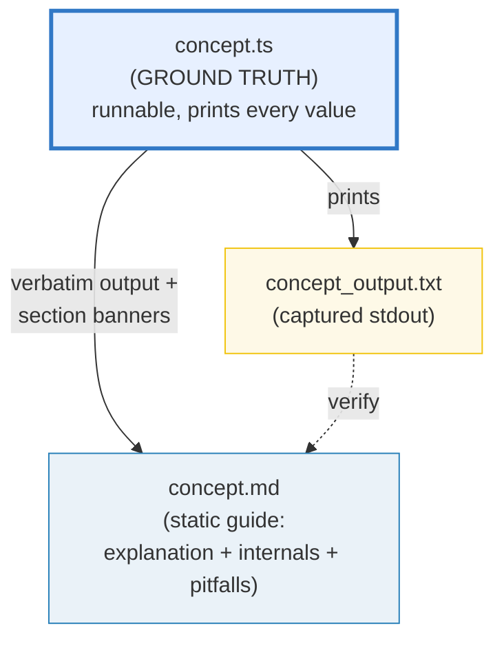
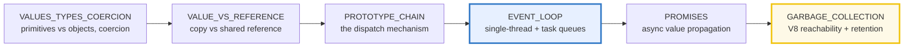

# HOW_TO_RESEARCH — The "Concept-as-a-Bundle" Workflow (TypeScript)

> A note from past-me to future-me: **how this `ts/` folder is organized, why it
> is laid out this way, and how to extend it.** Each concept is a small, runnable
> `.ts` program whose output is pasted verbatim into a `.md` guide. Nothing is
> hand-waved; every claim is reproducible by `tsx`.
>
> **The north-star goal:** a reader who walks every bundle start-to-finish
> becomes a **TypeScript/JavaScript expert** — fluent in the type system
> (structural, erased) and the value/reference semantics, the single-threaded
> event loop (microtask/macrotask, libuv, V8), the garbage collector, the
> standard library, and the production patterns built on top.
>
> **The golden rule of building:** you (the orchestrator) **never write or edit a
> bundle file by hand.** Every bundle is produced by a **subagent** (one worker
> per bundle). Your job is to write tight worker briefs, launch them in parallel
> (max 4 at a time), and run the verification sweep. This is the
> [`../go/`](../go/) + [`../rust/`](../rust/) delegation discipline, applied to
> the **TypeScript language and its Node/V8 production ecosystem**.
>
> Sister folders:
> - [`../go/`](../go/) — the same discipline for the Go language.
> - [`../rust/`](../rust/) — the same discipline for the Rust language.
> - [`../python/`](../python/) — the same discipline for the Python language.

---

## 0. The one rule (of a bundle)

> **Every concept is a `.ts` + `_output.txt` + `.md` triple that cite each other,
> all deriving from ONE runnable `.ts`. Nothing is hand-computed.**

If a claim, value, or output appears in a `.md`, it was printed by the `.ts` (or
recomputed with the identical logic). This is the discipline that keeps the
guides trustworthy as they scale to 50+ topics.



There is **no `.html`** in this folder's bundles. The runnable `.ts` *is* the
interactive artifact — a reader opens it, runs it, edits it, and watches the
output change. This keeps the surface area small and the focus on code.

---

## 1. The directory layout

```
ts/
├── HOW_TO_RESEARCH.md          ← you are here (per-bundle workflow)
├── SUBAGENTS_GUIDE.md          ← delegation at scale (the worker prompt + batch sweep)
├── TODO.md                     ← the phase-by-phase build checklist (all 52 bundles)
├── package.json                ← workspace root, packageManager pnpm@10
├── pnpm-workspace.yaml         ← members: core (added: metaprog/web/db/hono/...)
├── tsconfig.base.json          ← shared strict compiler options (read-only to workers)
├── Justfile                    ← the canonical runner/verify interface
├── .gitignore                  ← ignores node_modules/dist/coverage (NOT _output.txt)
│
├── core/
│   ├── package.json            ← member manifest (type: module)
│   ├── tsconfig.json           ← extends ../tsconfig.base.json, include *.ts
│   ├── values_types_coercion.ts        ← ground-truth impl   ─┐
│   ├── values_types_coercion_output.txt ← captured stdout      │ one concept bundle
│   └── VALUES_TYPES_COERCION.md        ← static guide         ─┘
│
├── metaprog/   web/   db/      ← dep-tier members, added as phases introduce deps
├── hono/  drizzle/  ioredis/   ← companion library walkthroughs (.md + runnable .ts)
└── scripts/skeleton.ts         ← the bundle scaffold (banner/check helpers)
```

A **concept bundle** = `{name}.ts` + `{name}_output.txt` + `{NAME}.md`, living
**flat inside its dep-tier member** (e.g. `core/values_types_coercion.ts`).

**Naming convention** (matches `../go/`, `../rust/`, `../python/`):
- `.ts` / `_output.txt` → `lower_snake_case` (e.g. `event_loop.ts`).
- `.md` → `UPPER_SNAKE_CASE` (e.g. `EVENT_LOOP.md`).
- One stem per concept; the three files share it so cross-links are obvious.

### Why bundles live in dep-tier member crates

The pnpm workspace isolates dependencies by tier, exactly like
[`../rust/`](../rust/)'s Cargo workspace. `core/` is **stdlib-only** (Phases
1–5) — a Phase 1 bundle physically cannot import `zod` because pnpm's strict
`node_modules` does not hoist it. New members are added by the orchestrator as
phases introduce deps (`metaprog/` for zod/reflect, `web/` for hono/fetch,
`db/` for drizzle). Workers are FORBIDDEN from adding deps or editing
`package.json` / `pnpm-workspace.yaml`.

### Why every bundle runs via `tsx` (not `tsc` then `node`)

`tsx` (esbuild-backed) runs a `.ts` file directly with **no compile step and no
artifact left behind** — the same property `go run` has, and the opposite of
`tsc name.ts && node name.js` (which litters a `.js`). A bundle is a single
self-contained `.ts`; run it with `just run name` (== `pnpm exec tsx
<member>/name.ts`). `tsx` is type-erasing (esbuild strips types without
type-checking), so the **typecheck gate is separate**: `just typecheck name`
runs `tsc --noEmit` over the member. Both must pass.

---

## 2. The three roles of each file

| File | Role | Hard rules |
|---|---|---|
| **`name.ts`** | Ground truth. Clean, runnable, **self-contained** script that prints every value the `.md` needs, behind a section banner. | Single source of truth. Run via `just run name`. Each teachable point gets its own `sectionX()` printing a banner + a readable block. Use **tiny but complete** examples so every line is printable while every behavior shows up. Deterministic inputs only. Add `[check] ... OK` asserts for invariants (see §4). No top-level side effects beyond `main()`. |
| **`{NAME}.md`** | Static, rigorous guide. Mermaid diagrams + **verbatim** output pasted from the `.ts`. | Every output block sits under a `> From name.ts Section X:` callout — no orphan numbers. Explains **what**, **why** (internals), and the **expert-level gotchas**. Cross-refs to siblings marked 🔗. Ends with a pitfalls table + cheat sheet + `## Sources`. |
| **`name_output.txt`** | Captured stdout. Committed so the `.md` can be re-derived/audited without running. | `just out name` (== `tsx ... > name_output.txt 2>/dev/null`). Diff it against the `.md` callouts to audit any value. |

---

## 3. The "expert depth" requirement

A junior tutorial stops at "here's how you declare a variable." This folder's bar
is higher. **Every `.md` a worker produces must answer three layers:**

1. **What** — the syntax / API and a runnable worked example (the `.ts`).
2. **Why** — the mechanism beneath it. For TypeScript/JavaScript this usually
   means: the **value-vs-reference semantics** (primitives copy, objects share a
   reference; the prototype chain; the shared-mutability bug class), the **event
   loop** (single-threaded; the call stack; microtask vs macrotask queues; libuv
   in Node; the render-step in browsers), the **memory model / GC** (V8's
   generational Orinoco collector; reachability; `WeakRef`/`FinalizationRegistry`;
   closure retention), the **type system** (structural; **erased at runtime** —
   `typeof`/`instanceof` are runtime, `interface`/`type` are compile-only), or
   the **runtime/toolchain** (`tsc` vs `tsx`/esbuild; ESM vs CJS; `node_modules`
   resolution).
3. **Gotchas that separate juniors from experts** — the silent-bug traps:
   `==` vs `===` coercion, the `typeof null === "object"` lie, the
   emoji-breaks-`.length` (UTF-16 surrogate pairs), the `for...in` key trap,
   the closure-captures-the-loop-var (var vs let), the `this`-binding loss,
   promise-vs-callback error swallowing, unhandled rejections, shared mutability
   via object references, numeric-key object reordering, `Date` month/timezone
   pain, `NaN !== NaN`, etc.

The **pitfalls table** at the end of each `.md` is non-negotiable — it is the
"expert payoff." If a worker ships a `.md` with no pitfalls table, re-spawn it.

---

## 4. The `.ts` authoring conventions (the house style)

Every bundle's `.ts` follows the same skeleton so output is uniform and
verifiable. Workers MUST replicate it exactly. Study `scripts/skeleton.ts`
and `core/values_types_coercion.ts` (the Phase 1 style anchor) and copy their
structure.

### 4.1 The required file skeleton

```typescript
// values_types_coercion.ts — Phase 1 bundle #1 (STYLE ANCHOR).
//
// GOAL (one line): show, by printing every value, how TS/JS's primitive types,
// typeof, truthiness, and ==/=== coercion behave.
//
// This is the GROUND TRUTH for VALUES_TYPES_COERCION.md. Every number, table,
// and worked example in the guide is printed by this file. Change it -> re-run
// -> re-paste. Never hand-compute.
//
// Run:
//     pnpm exec tsx values_types_coercion.ts   (or: just run values_types_coercion)

const BANNER_WIDTH = 70;
const banner = "=".repeat(BANNER_WIDTH);

// sectionBanner prints a clearly delimited section divider (the house style).
function sectionBanner(title: string): void {
  console.log(`\n${banner}\nSECTION ${title}\n${banner}`);
}

// check asserts an invariant and prints a uniform [check] ... OK line.
// On failure it throws (non-zero exit) so the verification sweep catches it.
function check(description: string, ok: boolean): void {
  if (!ok) {
    throw new Error("INVARIANT VIOLATED: " + description);
  }
  console.log(`[check] ${description}: OK`);
}

// ... sectionA, sectionB, ... each prints a banner + a readable block + checks ...

function main(): void {
  console.log("values_types_coercion.ts — Phase 1 bundle #1 (style anchor).");
  console.log("Every value below is computed by this file; the .md guide pastes");
  console.log("it verbatim. Nothing is hand-computed.");
  sectionA();
  sectionB();
  sectionBanner("DONE — all sections printed");
}

main();
```

### 4.2 The TypeScript-specific HARD RULES (these make output reproducible)

JavaScript differs from Go/Rust in ways that bite determinism. Every worker
MUST honor:

1. **No `Math.random()` for a printed value.** Use a **seeded** PRNG helper
   (e.g. a `mulberry32(seed)` fn). The bare `Math.random()` makes `_output.txt`
   non-reproducible across runs.

   ```typescript
   function mulberry32(seed: number): () => number {
     let a = seed >>> 0;
     return () => {
       a |= 0; a = (a + 0x6D2B79F5) | 0;
       let t = Math.imul(a ^ (a >>> 15), 1 | a);
       t = (t + Math.imul(t ^ (t >>> 7), 61 | t)) ^ t;
       return ((t ^ (t >>> 14)) >>> 0) / 4294967296;
     };
   }
   ```

2. **No `Date.now()` / `new Date()` for a printed value.** Wall-clock time is
   non-reproducible. If a bundle must demonstrate dates, construct them from
   **fixed** inputs (`new Date("2024-01-15T10:30:00Z")`) and never assert the
   current time. `performance.now()` may appear only as a *relative* measurement
   you don't print as a verified number.

3. **Object key order is mostly stable but has one trap.** String keys iterate
   in **insertion order** EXCEPT integer-like keys ("0".."9", "10"…), which V8
   reorders **ascending numeric**. For deterministic output, either (a) sort the
   keys explicitly before printing, or (b) use a `Map` (guaranteed insertion
   order). Never `console.log` a raw object and rely on key order.

   ```typescript
   // DETERMINISTIC object printing:
   const obj = { b: 1, a: 2, 2: 3, 1: 4 };
   const keys = Object.keys(obj).sort();           // sort for stable output
   for (const k of keys) console.log(`  ${k}: ${(obj as Record<string, number>)[k]}`);
   ```

4. **Async / worker output is nondeterministic in ORDER.** For any concurrency
   or async bundle, never print directly from a callback/Promise.then/worker.
   Collect results into an array, **sort** it, then print from `main()` (or an
   `await`ed aggregate) once everything has resolved. Stable stdout is the goal.
   For `worker_threads`, collect posted messages, sort, print after all joined.

5. **Floating point: prefer integers for printed values.** If a float is
   unavoidable (e.g. `0.1 + 0.2`), print it to **fixed precision** so it does not
   drift across V8 versions: `console.log((0.1 + 0.2).toFixed(20))`.

6. **`tsc --noEmit` is canon (the "vet").** The file MUST typecheck clean under
   the member's strict `tsconfig.json`. A type error is an automatic
   verification FAIL. Run `just typecheck name` before capturing output.

7. **No bare `console.assert`.** Use the `check(description, ok)` helper above.
   It prints `[check] desc: OK` and **throws** on failure → non-zero exit → the
   sweep flags it. (`console.assert` does NOT throw and only prints on failure —
   useless for the sweep.)

8. **Value-vs-reference is a teaching axis, not an afterthought.** When a
   section touches a value, the `.md` must address: is it a primitive (copied)
   or an object (shared reference)? Is it mutated through an alias? Is it
   retained by a closure / a timer / a listener? This is the through-line of JS
   expertise (🔗 `VALUE_VS_REFERENCE.md`, `CLOSURES_CAPTURE.md`,
   `GARBAGE_COLLECTION.md`).

9. **Self-contained, stdlib-first.** Each `.ts` is a single file with no sibling
   imports. Use ONLY the dependencies already installed in the bundle's member
   (`core/` is pure Node stdlib for Phases 1–5). Never edit `package.json` /
   `pnpm-workspace.yaml`. If a worker "needs" a third-party lib, it must
   implement from scratch — or wait for a later phase/member.

10. **Tiny-but-complete examples.** Small dims (a 4-element array, a 3-field
    object) so every value prints while every behavior shows.

---

## 5. The `.md` authoring conventions

Each `{NAME}.md` is a static, rigorous guide. Structure (copy the style anchor
`VALUES_TYPES_COERCION.md`):

1. **Header block** — one-line goal; "Run: `just run name`"; prerequisites
   (which bundles to read first).
2. **Lineage / "why this exists"** — for ecosystem bundles, the old→new story
   and WHY each step happened (e.g. why `async/await` exists over raw Promises;
   why `AbortController` exists over hand-rolled cancellation).
3. **Mermaid diagram(s)** — at least one diagram per guide (data flow, event
   loop queues, prototype chain, call graph, whatever makes the mechanism
   visible).
4. **`> From name.ts Section X:` callouts** — every printed value/table in the
   `.md` sits under such a callout, pasted **verbatim** from `_output.txt`. No
   orphan numbers, no hand-typed tables.
5. **The "why" (internals) section** — the second depth layer: the event loop,
   V8 GC, prototype lookup, type erasure, microtask scheduling, libuv. This is
   the expert payoff.
6. **🔗 cross-references** — to sibling bundles, each with a one-line *why*.
   Where the concept has a direct analog in Go/Rust/Python (cross-language
   curriculum!), call it out: "🔗 `../rust/CLOSURES.md` — Rust captures by
   reference-or-move explicitly; JS always captures by reference, no `move`."
7. **Pitfalls table** — non-negotiable; columns: trap | symptom | fix.
8. **Cheat sheet** — a one-block quick reference.
9. **`## Sources`** — URLs (developer.mozilla.org,typescriptlang.org/docs,
   nodejs.org/docs, v8.dev, tc39.es). Every signature/version cited must be
   web-verified (see `SUBAGENTS_GUIDE.md` §2 Step 2).

---

## 6. Tooling & environment

**The `Justfile` is the canonical interface.** Run, capture, verify, and
scaffold bundles through `just` — every recipe routes through
`pnpm exec tsx`, so **no compiled `.js` ever lands in the source dirs**
(nothing to gitignore by stem). Run `just --list` to see all recipes; the
essentials:

| Recipe | Does |
|---|---|
| `just run NAME` | run a bundle (no artifact left behind) |
| `just out NAME` | (re)capture `NAME_output.txt` (next to the `.ts`, in its member) |
| `just check NAME` | verify ONE bundle: run + `[check]` count + typecheck + output presence |
| `just sweep` | verify ALL bundles (the batch sweep — see `SUBAGENTS_GUIDE.md` §5) |
| `just new NAME [member]` | scaffold a bundle from `scripts/skeleton.ts` into `<member>/` (default core) |
| `just typecheck [NAME]` | `tsc --noEmit` one bundle's member (or all members) |
| `just list` | list every bundle stem + its member |

Under the hood, the recipes are thin wrappers over the raw toolchain below
(workers should understand both layers):

- **`pnpm exec tsx name.ts`** runs a bundle (esbuild erases types in-memory, no
  `.js` left behind). Never `tsc name.ts && node name.js` into the source dir.
- **`pnpm exec tsc --noEmit`** typechecks (the "vet" gate). **Exits non-zero on
  any diagnostic** — so `just check` will FAIL the bundle. This is deliberate:
  it enforces expert-level type discipline. Strict mode + all `no*` checks are
  on in `tsconfig.base.json`.
- **`pnpm`** is the only package manager (the workspace root pins
  `packageManager: pnpm@10.13.1` via corepack). Workers NEVER run `npm` or `yarn`
  and NEVER edit lockfiles.
- **`package.json` + `pnpm-workspace.yaml`** are the dependency manifests.
  `core/` is pure Node stdlib (Phases 1–5). The orchestrator adds
  members/deps between phases:
  - Phase 6: `metaprog/` — `zod`, `reflect-metadata` (TC39 decorators are
    zero-dep, but metadata reflection needs the polyfill).
  - Phase 7: `web/` — `undici` (fetch internals), `ws`.
  - Phase 8: `web/` — `hono`; `db/` — `better-sqlite3`, `drizzle-orm`.
- **`pnpm-lock.yaml` IS committed** (== Cargo.lock / go.sum) — deterministic
  installs. `node_modules/`, `dist/`, `coverage/` are gitignored.

> **Offline by default.** Node's stdlib, in-memory data, and self-contained
> examples let every bundle run with **no network and no API key**. No bundle
> should require a live key; if one genuinely does, mark it loudly in the `.md`
> header.

---

## 7. Verifying a single bundle (worker self-check)

Every worker runs this before reporting done (`just check NAME` does most of it;
the raw steps below are what it checks):

1. `pnpm exec tsx name.ts` runs clean; every `[check] ... OK` prints.
2. `just out name` — the captured file is non-empty and **byte-identical on
   re-run** (determinism: seeded RNG, fixed dates, sorted object keys, serialized
   async output).
3. `just typecheck name` passes (exit 0 — strict mode, all `no*` checks).
4. The `.md` callouts match `_output.txt` verbatim.

For the **batch** verification sweep (after a swarm returns), see
[`SUBAGENTS_GUIDE.md`](./SUBAGENTS_GUIDE.md) §5 (or just run `just sweep`).

---

## 8. Cross-referencing conventions

The whole point is **contrast to build understanding**. This folder is part of a
**cross-language curriculum** (`../go/`, `../rust/`, `../python/`), so tell
workers to be explicit about BOTH sibling-within-TS links AND cross-language
parallels:

- 🔗 marker in a `.md` = a cross-reference to a related bundle.
- Always state *why* the link matters in one line.
- **Cross-language parallels** are a first-class citizen. Examples:
  - "🔗 `../go/POINTERS.md` — Go's value-vs-pointer semantics is explicit; JS's
    primitive-vs-reference split is implicit (no `*`)."
  - "🔗 `../rust/OWNERSHIP.md` — Rust enforces single ownership at compile time;
    JS shares references freely and relies on the GC."
  - "🔗 `../python/MEMORY_MODEL.md` — Python, like JS, is pass-object-by-reference
    under a GC; the shared-mutability bug class is identical."

The expertise spine across the TS phases:



That chain — **value/reference → prototype → event loop → promises → GC** —
*is* JavaScript expertise.

---

## 9. Common failure modes (single-bundle)

| Worker symptom | Cause | Fix |
|---|---|---|
| `tsx run: FAILED` (runtime throw) | bad logic / wrong API / `undefined` access | re-spawn with the correct anchor concepts + exact signature |
| `[check]` count is 0 | worker skipped invariants | re-spawn, emphasize "add a `check(...)` for every invariant" |
| `_output.txt` differs on re-run | `Math.random()` / `Date.now()` / unsorted object keys / unordered async output | re-spawn citing §4.2 rules 1–4 |
| `typecheck: FAIL` | a type error under strict mode (likely `any` leak, possibly-undefined index access, or a wrong signature) | re-spawn, fix the type; `noUncheckedIndexedAccess` often bites — narrow with a check or non-null assertion only where provably safe |
| Numbers in `.md` don't match `_output.txt` | worker hand-typed | re-spawn, emphasize "paste verbatim under callouts"; run `just out name` to regenerate |
| No `## Sources` | worker skipped web search | re-spawn, make Step 2 of the worker prompt non-optional |
| No pitfalls table | worker wrote a junior tutorial | re-spawn, cite §3 (the "expert payoff") |

---

## 10. Why this produces experts (not just users)

- **The `.ts` makes it falsifiable.** Anyone can `tsx` it and see the exact
  output — including the internals (event-loop trace via microtask ordering, GC
  behavior via `--expose-gc`, prototype walks via `Object.getPrototypeOf`). No
  hand-waving over "trust me, that's how the event loop works."
- **The three-layer depth rule** forces every concept past syntax into mechanism
  and into the traps that working engineers actually hit.
- **Subagent delegation keeps depth uniform** — bundle #52 is as deep as #1
  because each gets a fresh context and the same constant preamble.
- **Cross-language cross-references force the big picture.** Linking the JS
  event loop to Go's scheduler, JS references to Rust ownership, and JS
  prototypes to Python's MRO — that comparison *is* polyglot expertise.

---

## 11. Where to start

1. Open [`TODO.md`](./TODO.md) for the full phase-by-phase build plan (52
   bundles, 8 phases + 22 walkthroughs).
2. Open [`SUBAGENTS_GUIDE.md`](./SUBAGENTS_GUIDE.md) for the worker prompt
   template + batch verification sweep — the delegation mechanics you use to
   actually build the swarm.
3. Launch the **Phase 1 swarm** (max 4 workers per batch), designating
   `values_types_coercion` as the style anchor. Ship it first, then launch the
   rest of Phase 1 against it.
