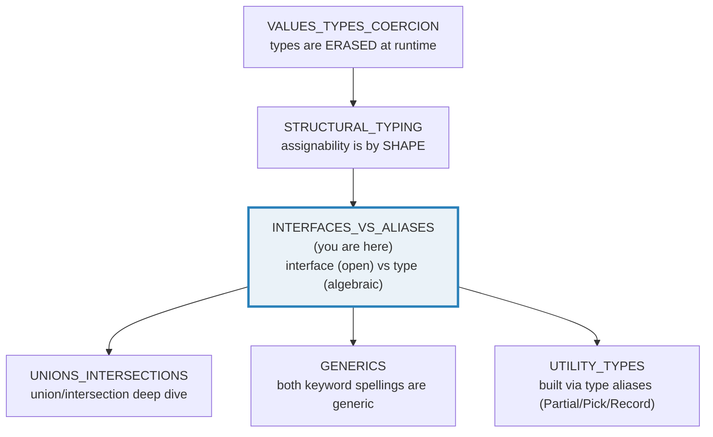
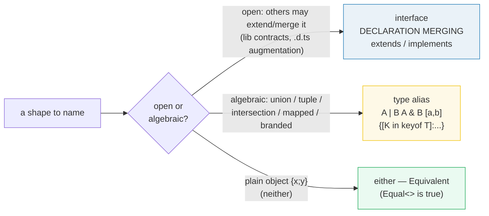

# INTERFACES_VS_ALIASES — `interface` vs `type`: Open vs Algebraic Shapes

> **Goal (one line):** show, by `check()`'d runtime behavior AND tsc-verified
> `expectType<>`/`@ts-expect-error` compile-time proofs, how TypeScript's TWO ways
> to name an object shape — `interface` and `type` alias — overlap (both
> structural, both erased) yet differ in ONE decisive way: **interfaces are OPEN**
> (declaration merging + `extends`/`implements`) while **type aliases are
> ALGEBRAIC** (unions, intersections, tuples, mapped/conditional types).
>
> **Run:** `just run interfaces_vs_aliases`
>
> **Ground truth:** [`interfaces_vs_aliases.ts`](./core/interfaces_vs_aliases.ts)
> → captured stdout in
> [`interfaces_vs_aliases_output.txt`](./core/interfaces_vs_aliases_output.txt).
> Every number/table below is pasted **verbatim** from that file under a
> `> From interfaces_vs_aliases.ts Section X:` callout. Nothing is hand-computed.
>
> **Prerequisites:** 🔗 [`VALUES_TYPES_COERCION`](./VALUES_TYPES_COERCION.md)
> (TS types are erased at runtime — the foundation) and
> 🔗 [`STRUCTURAL_TYPING`](./STRUCTURAL_TYPING.md) (assignability is by shape, not
> name; the brand pattern that fakes nominal safety).

---

## 1. Why this bundle exists (lineage)

VALUES_TYPES_COERCION pinned that TypeScript types are **erased at runtime**, and
STRUCTURAL_TYPING pinned that TS decides assignability by **shape** not **name**
(so two same-shaped types are interchangeable, which is why the brand pattern
fakes nominal safety). This bundle answers the question that leaves open:

> *Given two keywords that BOTH name an object shape — `interface` and `type` —
> which do I reach for?*

The overlap is real: for a plain `{ x; y }` an `interface` and a `type` alias are
**exactly equal** (pinned by `expectType<Equal<IPoint, TPoint>>` in Section A —
not merely assignable, *identical*). But they are **not interchangeable as
type-level machinery**:

- **`interface`** is **OPEN** — two declarations with the same name **merge** into
  one (the engine behind `lib.d.ts` patching, library `.d.ts` augmentation, and
  `declare module "x" { interface ... }` plugin typing). It also supports
  `extends` (multiple) and class `implements`.
- **`type`** alias is **CLOSED / algebraic** — it is the *only* spelling for
  unions (`string | number`), intersections (`A & B`), tuples (`[number, string]`),
  and mapped/conditional types (`{ [K in keyof T]: ... }`).

Knowing where each wins is the difference between flowing with the checker and
fighting it.



**The cross-language pivot (why this is a TS-specific concept).** Go, Rust, and
Python each have exactly ONE "shape contract" concept — `interface` (Go:
implicit/structural, method-set only), `trait` (Rust: nominal, explicit `impl`),
or `Protocol` (Python: structural). TypeScript is unusual in offering BOTH an
open, mergeable `interface` AND a closed, algebraic `type` alias — and in letting
them interact (an interface can `extend` a type alias; a type alias can intersect
an interface). Section E frames the full contrast.

> 🔗 [`../go/INTERFACES_BASICS.md`](../go/INTERFACES_BASICS.md) — Go's interface
> is the closest sibling to TS's: **implicit** and **structural** (no `implements`
> keyword). But a Go interface is a **method-set only** — it cannot carry data
> fields, and it **cannot merge**. TS interfaces carry fields and merge.
>
> 🔗 [`../rust/TRAITS_BASICS.md`](../rust/TRAITS_BASICS.md) — Rust's `trait` is the
> starkest contrast: **nominal** (a struct must explicitly `impl Trait for Type`),
> with default methods and no merging. TS gives you nominal safety only via the
> brand pattern (🔗 STRUCTURAL_TYPING §C); Rust gives it for free.

---

## 2. The mental model: two keywords, one axis (open vs closed)

Both `interface` and `type` describe **object shapes** and both are **structural**
+ **erased**. The axis that distinguishes them is whether the shape is *open*
(extendable/mergeable by anyone) or *closed* (a fixed algebraic expression):



For the **plain object shape** case the choice is cosmetic — Section A proves an
`interface IPoint { x; y }` and a `type TPoint = { x; y }` are the **same type**.
The choice only *matters* when you need a power one keyword has and the other
lacks.

---

## 3. Section A — Both structural: an interface and a type alias are the SAME type

A flat object shape named two ways. For the **shape itself** there is no
difference: `IPoint` and `TPoint` are not merely assignable — they are
**identical**, per the `Equal<>` type-equality trick (the canonical community idiom
that resolves to `true` only for exactly-equal types, not just mutually-assignable
ones):

> From interfaces_vs_aliases.ts Section A:
> ```
> interface IPoint { x: number; y: number }
> type TPoint = { x: number; y: number }
>   -> Equal<IPoint, TPoint> === true (NOT just assignable: IDENTICAL)
> [check] interface IPoint === type TPoint (exact equal): OK
> [check] type TPoint === interface IPoint (symmetric): OK
>   const a: IPoint = {x:1,y:2}; const b: TPoint = a; const c: IPoint = b;
>   runtime: a === b === c === {"x":1,"y":2} (one object, three names)
> [check] typeof a === "object" (interface IPoint erased at runtime): OK
> [check] a.x === b.x === c.x === 1 (the three names alias ONE object; shapes erased): OK
>   const tooFew: IPoint = { x: 1 }  -> ERROR (missing y; @ts-expect-error gate)
> ```

**Three layers of evidence, all in the block above:**

1. **Compile-time identity** (`expectType<Equal<IPoint, TPoint>>`). The `Equal<>`
   idiom forces TS to compare two conditional types under a fresh type parameter
   `T`; the only way both `(<T>() => T extends A ? 1 : 2)` and
   `(<T>() => T extends B ? 1 : 2)` are mutually assignable is when `A` and `B`
   are *identical*. The call only typechecks when the claim is `true`, and `tsc`
   fails the build otherwise — so "interface ≡ type for a flat shape" is enforced
   by the compiler, not asserted by hand.
2. **Value-level assignability** (`const b: TPoint = a; const c: IPoint = b;`).
   The three names alias **one object** — structural typing lets an `IPoint` value
   flow into a `TPoint` slot and back with no cast.
3. **Runtime erasure** (`typeof a === "object"`). Both keyword spellings are
   **erased**; `typeof` sees only the JS value (a plain object), never the
   interface/alias name. This is the type-erasure truth from
   VALUES_TYPES_COERCION, restated for the compile-time layer.

The equivalence holds **only for matching shapes**: a type with a missing member
is a genuine error in either spelling — the `@ts-expect-error` on `const tooFew:
IPoint = { x: 1 }` is the gate (`tsc` fails the build if that line ever stops
erroring, because an unused `@ts-expect-error` is itself an error).

> **A subtlety worth knowing:** `Equal<>` says flat `interface P` ≡ flat
> `type P = {...}`, but it does **not** say an **intersection** `A & B` is
> identical to a flat object of the same members (Section B/D). The trick
> distinguishes *constructions*: flat types collapse together; algebraic
> intersections/mapped types stay distinct (though still mutually assignable).
> Keep this in mind when a library re-exports a shape both ways.

---

## 4. Section B — `interface extends` + class `implements` (compile-time only)

`interface extends` builds a subtype by adding members; an interface may extend
**several** at once (`extends A, B`). `class implements Iface` makes the compiler
**check** that the class satisfies the interface's shape — and it is **purely
compile-time**: it emits no runtime code, adds no prototype linkage, and (unlike
`extends` of a class) contributes nothing to the value.

> From interfaces_vs_aliases.ts Section B:
> ```
> interface Animal { name }
> interface Trainable { tricks }
> interface Pet extends Animal, Trainable { owner }
> [check] keyof Pet === "name" | "tricks" | "owner" (extends merges key sets): OK
> const dog = new RealDog()  -> dog.name = "Rex"
> const pet = new RealPet()  -> pet.name="Rex", owner="Ada"
> [check] implements checks conformance: pet satisfies Pet (name+tricks+owner): OK
>   class BadDog implements Pet { name }  -> ERROR (missing owner/tricks)
>   dog instanceof Animal  -> type error (suppressed) AND runtime ReferenceError
> [check] instanceof on an interface throws ReferenceError at runtime (interface erased, no binding): OK
>   Object.keys(dog).sort() = ["name"]   (no "Animal" trace)
> [check] implements leaves no runtime trace: dog has only its own keys, no interface name: OK
> ```

**`implements` is enforced at compile time and invisible at runtime — two halves
of one proof:**

- **Compile half:** a class missing a required member errors
  (`class BadDog implements Pet { name }` → TS2441; the `@ts-expect-error` gate
  proves it). And `dog instanceof Animal` is a **type error** (TS2693:
  *"'Animal' only refers to a type, but is being used as a value here"*) because
  an interface has no runtime value to put on the right of `instanceof`.
- **Runtime half:** even with that type error *suppressed* by `@ts-expect-error`,
  the line still **emits code**, and evaluating the erased `Animal` binding throws
  **`ReferenceError`** at runtime — the interface literally does not exist as a
  value. The `check()` captures this throw in a `try/catch`, so it is the runtime's
  own verdict, not a paraphrase. This is the sharpest possible expression of
  "implements is compile-time only."

The instance carries only its **own** keys (`Object.keys(dog)` is `["name"]`),
with no record of which interface(s) it "implements". Contrast this with Rust,
where `impl Trait for Type` is explicit and the vtable is real (🔗
`../rust/TRAITS_BASICS.md`), and Go, where interface satisfaction is *implicit*
but the interface still names a real method-set type (🔗
`../go/INTERFACES_BASICS.md`).

**`interface extends` vs `type &` (intersection) — assignable, not identical.**

> From interfaces_vs_aliases.ts Section B:
> ```
> SUBTLETY: interface Pet extends Animal,Trainable  vs  type PetByName = Animal & Trainable & {owner}
>   const asIntersection: PetByName = pet  -> OK (Pet -> PetByName)
>   const roundTrip: Pet = asIntersection  -> OK (PetByName -> Pet, symmetric)
>   yet Equal<Pet, PetByName> === false (interface-via-extends != intersection construction)
> ```

The interface built via `extends` and the intersection `Animal & Trainable &
{owner}` are **mutually assignable** (both assignments above compile), so at every
*call site* they behave identically. But the `Equal<>` trick treats them as
**distinct constructions** — an interface keeps an interface identity; an
intersection is a separate type-level beast. The practical effect is nil for
ordinary code, but it explains "these types are equal but not identical"
diagnostics when a library re-exports a shape both ways.

---

## 5. Section C — DECLARATION MERGING (interfaces only) — THE payoff

This is the **defining power** of `interface` that `type` cannot match: two (or
more) interface declarations with the **same name** in the same scope **merge**
into one interface whose members are the **union** of all of them (TypeScript
Handbook, "Declaration Merging"). It is *not* a redeclaration error — it is a
feature, and it is the mechanism behind `lib.d.ts` patching, library `.d.ts`
augmentation, and `declare module "x" { interface ... }` plugin typing.

### 5.1 Property merge

> From interfaces_vs_aliases.ts Section C:
> ```
> interface WindowLike { width: number }
> interface WindowLike { height: number }   // <-- SAME name: MERGES (not an error)
>   -> WindowLike now has BOTH width and height
> [check] merged WindowLike === { width: number; height: number }: OK
>   const win: WindowLike = { width: 800, height: 600 }   -> compiles (both present)
> [check] property merge: win.width === 800 && win.height === 600: OK
> ```

A second `interface WindowLike` *adds* `height` to the first's `width`. After both
declarations, `WindowLike` requires **both** — no error, no cast. The merged
interface is `Equal<>` to a flat `{ width; height }` object type (the merge
collapses into an ordinary interface).

### 5.2 Overload merge (same-named methods)

> From interfaces_vs_aliases.ts Section C:
> ```
> interface Logger { log(msg: string): void }
> interface Logger { log(msg: number): void }   // <-- merges into TWO overloads
>   logger.log("info")  -> OK (string overload)
>   logger.log(42)      -> OK (number overload)
> [check] overload merge: Logger.log accepts BOTH string and number call signatures: OK
> ```

Same-named **function members** across merged interfaces become **overloads** of
one method (handbook: *"each function member of the same name is treated as
describing an overload of the same function"*). A single object literal whose
method accepts the union satisfies both signatures, and both call spellings
resolve. (Non-function members that collide must be the **same type**, else the
merge errors — a documented constraint, see pitfalls.)

### 5.3 The asymmetry: a `type` CANNOT be redeclared

> From interfaces_vs_aliases.ts Section C:
> ```
> THE ASYMMETRY: a `type` CANNOT be redeclared. The forbidden form (NOT live):
>   type TStringBox = { width: number };
>   type TStringBox = { height: number };   // TS2300 Duplicate identifier 'TStringBox'
>   -> @ts-expect-error cannot clean it (duplicate fires on BOTH decls);
>      types are CLOSED. Only interfaces are open/mergeable.
> [check] type aliases are closed (cannot merge); only interfaces merge: OK
>
> CONSEQUENCE: `declare module "lib" { interface X { ... } }` augments a
> library's interface via merging. A type alias cannot be augmented this way.
> ```

Re-declaring a `type` alias with the same name is **TS2300** *Duplicate
identifier*, reported on **every** declaration. `// @ts-expect-error` cannot clean
it (it suppresses only one site; the duplicate fires on the first declaration
too), so this file does **not** contain a live duplicate — it would break
`just typecheck`. Types are **closed**; only interfaces are open/mergeable.

**The consequence that pays the bills:** when you WANT open extension, reach for
`interface`. This is how `declare module "express" { interface Request { user?:
User } }` adds a field to a library's type **without forking it** — the library's
`Request` is an interface, so your declaration **merges** with it. A type alias
could not be augmented this way. (Handbook "Declaration Merging" → *Module
Augmentation*.)

---

## 6. Section D — Type-only powers (unions, tuples, intersections, mapped, branded)

The flip side of the asymmetry: type aliases express **algebraic** shapes that an
interface structurally **cannot**. An interface can only describe an
object/function/construct/index **signature**; it has no syntax for a union of
unrelated types, a fixed-length tuple, or a mapped re-projection of another type's
keys. These are the exclusive province of `type`.

### 6.1 Union + tuple

> From interfaces_vs_aliases.ts Section D:
> ```
> type Id = string | number;             // UNION (no interface spelling)
> [check] Id === string | number: OK
>   formatId("u-1") = u-1   formatId(42) = #42
> [check] union accepts both arms: formatId(string) and formatId(number): OK
>
> type Pair = [number, string];          // TUPLE (no interface spelling)
> [check] Pair[0] === number: OK
> [check] Pair[1] === string: OK
>   const pair: Pair = [7, "seven"]   -> length = 2, pair[0]=7, pair[1]="seven"
> [check] tuple: pair.length === 2 and slots keep their declared types: OK
> ```

A **union** (`string | number`) is "a value is one of several unrelated types" —
no interface spelling exists. A **tuple** (`[number, string]`) is a fixed-length,
fixed-order, per-index-typed array; indexed access (`Pair[0]`, `Pair[1]`) pins
each slot's type at the type level. An interface can fake *index signatures*
(`[k: number]: T`), but never fixed **length** or per-**index** typing.

### 6.2 Intersection + mapped

> From interfaces_vs_aliases.ts Section D:
> ```
> type LabeledPoint = IPoint & { label: string };   // INTERSECTION
>   const lp: LabeledPoint = { x:0, y:0, label:"origin" }   -> lp.label = "origin"
> [check] intersection: lp carries x, y, AND label (assignable both ways): OK
>
> type Stringified<T> = { [K in keyof T]: string };   // MAPPED (no interface spelling)
>   const sp: Stringified<IPoint> = { x:"1", y:"2" }   -> every value is a string
> [check] mapped type: Stringified<IPoint> forces both values to string: OK
> ```

An **intersection** (`A & B`) is the type-alias counterpart of `interface extends
A, B` — it combines N shapes into one (see Section B's assignability-vs-identity
note). A **mapped type** (`{ [K in keyof T]: ... }`) re-projects every key of `T`
into a new shape — pure type-level computation, no interface spelling.

### 6.3 Branded primitive (nominal faking via intersection)

> From interfaces_vs_aliases.ts Section D:
> ```
> type Celsius = number & { readonly __celsiusBrand: unique symbol };   // BRANDED
>   const temp = 36.6 as Celsius   -> typeof = number, value = 36.6
> [check] typeof branded Celsius === "number" (brand is a phantom; erased at runtime): OK
> [check] branded primitive carries its numeric value at runtime (brand is type-only): OK
>   const bareNum: Celsius = 36.6   -> ERROR (bare number rejected by the brand)
> ```

`Celsius` is `number & { phantom }` — an intersection of a **primitive** with a
phantom property. At runtime it is **just a number** (the brand is a type-level
phantom, never a real property); at compile time a bare number cannot be assigned
to it. An interface **cannot be** a primitive intersection like this (an interface
is always an object type). This is the lightest spelling of the brand pattern —
🔗 [`STRUCTURAL_TYPING`](./STRUCTURAL_TYPING.md) §C has the full treatment.

### 6.4 The asymmetry, summarized

> From interfaces_vs_aliases.ts Section D:
> ```
> SUMMARY: interfaces describe object/function/construct/index SIGNATURES only.
> type aliases additionally express UNION | TUPLE | INTERSECTION | MAPPED | CONDITIONAL.
> Reach for `type` whenever the shape is algebraic rather than a single object.
> ```

Reach for `type` whenever the shape is **algebraic** (union, tuple, intersection,
mapped, conditional) rather than a single object. 🔗 [`UTILITY_TYPES`](./UTILITY_TYPES.md) — the
built-in `Partial`/`Pick`/`Record`/`ReturnType` family is implemented entirely
with `type` aliases + mapped/conditional types, precisely because interfaces could
not express them.

---

## 7. Section E — When to use which (open vs algebraic) + cross-language framing

The decision rule distilled: **open** shapes (ones you or a downstream consumer
may want to EXTEND or MERGE — library contracts, `lib.d.ts` augmentations) want
`interface`; **closed/algebraic** shapes (unions, tuples, intersections,
mapped/conditional types, primitives-with-brands) want `type`. For a plain object
shape that is neither, either works — pick by team convention.

> From interfaces_vs_aliases.ts Section E:
> ```
> capability                       : interface : type alias
> -------------------------------- : --------- : ---------------------------------------
> union / intersection             : no        : yes  (string|number, A & B)
> tuple [a, b]                     : no        : yes  ([number, string])
> mapped / conditional             : no        : yes  ({[K in keyof T]:...}, T extends U ? X : Y)
> declaration merge                : yes  (open) : no  (closed)
> extends / implements             : yes  (interface extends A; class impl) : via intersection (A & B)
> augment lib .d.ts                : yes  (declare module) : no
> plain object shape               : yes       : yes  (equivalent — Equal<> is true)
> [check] decision rule: open/mergeable -> interface; algebraic/closed -> type: OK
> ```

**The cross-language framing** — Go, Rust, and Python each have ONE shape-contract
concept. TypeScript is unusual in offering BOTH, and in letting them interoperate:

> From interfaces_vs_aliases.ts Section E:
> ```
> language     : shape-contract concept                        : model          : extension model
> ------------ : -------------------------------------------------- : -------------- : ----------------------------------
> TypeScript   : BOTH (open interface + closed type alias)          : structural     : merge (interface) / intersect (type)
> Go           : interface (one concept)                            : structural, IMPLICIT : no merging (method-set only, no data)
> Rust         : trait (one concept)                                : nominal, EXPLICIT `impl` : no merging (default methods, no data fields)
> Python       : Protocol (one concept)                             : structural     : no merging
> [check] TS is the only one of the four offering BOTH open-merge (interface) AND closed-algebraic (type): OK
> [check] Go interfaces are IMPLICIT (no `implements` keyword) — TS's closest sibling: OK
> [check] Rust traits are NOMINAL + EXPLICIT impl — the starkest contrast to TS: OK
> ```

**Expert takeaway:** TypeScript gives you TWO complementary tools, not a contest.
Use `interface` where openness/merging buys you something (library contracts,
augmentation). Use `type` where the shape is algebraic (unions, tuples,
intersections, mapped/conditional). For a plain object shape, either is fine — be
consistent within a codebase.

---

## 8. Pitfalls (the expert payoff)

| Trap | Symptom | Fix |
|---|---|---|
| Expecting `instanceof Interface` to work | TS2693 *"'X' only refers to a type"*, and if forced past the compiler a **runtime `ReferenceError`** (interface is erased) | `instanceof` needs a **runtime constructor** (a `class` or function). For shape checks use a **type guard** (`x is T`, 🔗 TYPE_NARROWING §D), not `instanceof` an interface. |
| `type X = ...` redeclared, expecting a merge | **TS2300** *Duplicate identifier 'X'* on **every** declaration — `@ts-expect-error` cannot clean it (fires on both) | Use `interface` when you need open/mergeable extension; `type` aliases are **closed**. |
| Two merged interfaces with a clashing **non-function** member | Merge error if the same property is declared with **different** types | Keep merged property types consistent, or rename. (Function members merge into overloads; data members must agree.) |
| Treating `interface extends A` and `A & B` as "the same type" | Mutually assignable, but `Equal<>` says **distinct** — confusing "equal but not identical" diagnostics | They are interchangeable at call sites; only type-level identity tools care. Don't assert exact equality across the construction boundary. |
| Using `interface` for a union/tuple | No syntax — `interface U = string \| number` is a **parse error** | Reach for `type` for any algebraic shape (union/tuple/intersection/mapped/conditional). |
| Augmenting a library type that's a `type` alias | `declare module { ... }` augmentation **only works for interfaces** — silently does nothing for an alias | If you author a library others may augment, expose its shapes as `interface`, not `type`. |
| `implements` adding a runtime check | `implements` is **compile-time only** — it emits no code, no prototype link, no `instanceof` support | To dispatch by shape at runtime you need a real `class` (🔗 PROTOTYPE_CHAIN) or a tagged union (🔗 UNIONS_INTERSECTIONS). |
| Branding then forgetting the brand is erased | `type UserId = string & {__brand}` is **just a string** at runtime — `typeof === "string"`, JSON has no brand | The brand is a compile-time phantom only; validate at the factory boundary (🔗 STRUCTURAL_TYPING §C). |
| Assuming `Equal<>` is "are they assignable?" | `Equal<A & B, {…flat…}>` is `false` even though they're mutually assignable | `Equal<>` tests **identity**, a stronger property than assignability. For assignability use value-level assignment `const x: A = y`. |
| Naming an open shape with `type` then needing to extend it downstream | Downstream code cannot merge or augment a `type` alias — it must fork or intersect (no global merge) | Default to `interface` for public library contracts you expect others to extend. |

---

## 9. Cheat sheet

```typescript
// === interface vs type: when each wins ====================================
//   interface  -> OPEN: declaration merging, extends (multiple), implements.
//                 Use for library contracts, .d.ts augmentation, anything
//                 others may extend/merge. Confined to object/function/
//                 construct/index SIGNATURES.
//   type       -> CLOSED/ALGEBRAIC: union | intersection | tuple | mapped |
//                 conditional | branded. The ONLY spelling for these.
//   plain {x;y} -> either; Equivalent (Equal<> === true). Pick by convention.

// === Equivalence (Section A) ==============================================
//   interface IPoint { x; y }   ===   type TPoint = { x; y }   (Equal<> true)
//   Both ERASED: typeof v === "object" (no interface/alias name at runtime).

// === interface powers (Section B/C) =======================================
//   interface Pet extends Animal, Trainable { owner }   // extends multiple
//   class Dog implements Pet { ... }                    // compile-time check
//   interface Box { width }  +  interface Box { height }  // MERGE -> both
//   interface L { f(s: string) } + interface L { f(n: number) }  // overload merge
//   instanceof Iface   -> TS2693 (type, not value); runtime ReferenceError if forced

// === type-only powers (Section D) =========================================
//   type Id    = string | number          // union       (no interface spelling)
//   type Pair  = [number, string]         // tuple       (no interface spelling)
//   type LP    = IPoint & { label: "" }   // intersection (A & B)
//   type Str<T> = { [K in keyof T]: string }  // mapped   (no interface spelling)
//   type Celsius = number & { readonly __b: unique symbol }  // branded primitive

// === The one rule that breaks the tie =====================================
//   Need to MERGE / be AUGMENTED / be IMPLEMENTED  ->  interface (open)
//   Need a UNION / TUPLE / INTERSECTION / MAPPED   ->  type     (algebraic)
//   @ts-expect-error CANNOT clean a duplicate `type` (TS2300 fires on both decls).

// === Cross-language =======================================================
//   TS: BOTH (open interface + closed type)  — structural
//   Go: interface (one) — implicit, structural, method-set only, NO merging
//   Rust: trait (one)   — nominal, EXPLICIT impl, default methods, NO merging
//   Python: Protocol    — structural, NO merging
```

---

## Sources

Every signature, behavioral claim, and type-level result above was verified
against the TypeScript Handbook, then corroborated by at least one independent
secondary source. Every compile-time claim is **additionally** enforced by the
compiler itself — `expectType<Equal<...>>` fails the build if the type claim is
false, every `@ts-expect-error` fails the build if it does not suppress a real
error, and the runtime `ReferenceError` from `instanceof`-on-an-interface is
captured by `check()` in a `try/catch` (the V8 engine's own verdict).

- **TypeScript Handbook — Object Types** (`interface`, `extends`, `implements`;
  *"TypeScript only checks that the class has the required properties... the
  `implements` clause doesn't change the class's type or its data"*):
  https://www.typescriptlang.org/docs/handbook/2/objects.html
- **TypeScript Handbook — Everyday Types → Type Aliases** (the
  "Differences Between Type Aliases and Interfaces" note — *"because the two
  are very similar... for the most part you can choose based on personal
  preference"*; type aliases for unions/tuples):
  https://www.typescriptlang.org/docs/handbook/2/everyday-types.html#type-aliases
- **TypeScript Handbook — Declaration Merging** (read in full; the verbatim `Box`
  merge example — *"the compiler merges two separate declarations declared with
  the same name into a single definition"*; function members → overloads;
  non-function members must agree; module/global augmentation):
  https://www.typescriptlang.org/docs/handbook/declaration-merging.html
- **TypeScript Handbook — Creating Types from Types** (unions, intersections,
  tuples, mapped types, conditional types — the algebraic powers exclusive to
  `type`): https://www.typescriptlang.org/docs/handbook/2/types-from-types.html
- **TypeScript Handbook — Type Compatibility** (structural assignability; that
  `interface extends` and `A & B` are mutually assignable):
  https://www.typescriptlang.org/docs/handbook/type-compatibility.html

**Secondary corroboration (independent of the Handbook, ≥1 per major claim):**
- Stack Overflow — *"Interfaces vs Types in TypeScript"* (declaration merging is
  interface-only; type aliases support unions/tuples that interfaces cannot;
  multi-answer agreement):
  https://stackoverflow.com/questions/37233735/interfaces-vs-types-in-typescript
- LogRocket Blog — *"Types vs. interfaces in TypeScript"* (*"Declaration merging
  is a feature that is exclusive to interfaces... we can define an interface
  multiple times"*):
  https://blog.logrocket.com/types-vs-interfaces-typescript/
- DEV Community (Tolu Agboola) — *"Type Aliases vs Interfaces in TypeScript"*
  (*"Declaration merging only works on interfaces and not type aliases. You
  cannot declare a union, intersection or tuple with the `interface`
  keyword"*): https://dev.to/toluagboola/type-aliases-vs-interfaces-in-typescript-3ggg
- W3Schools — *"TypeScript Type Aliases and Interfaces"* (*"Extending: Both can
  be extended, but interfaces support declaration merging. Unions/Intersections:
  Only type aliases support union and intersection types"*):
  https://www.w3schools.com/typescript/typescript_aliases_and_interfaces.php
- GeeksforGeeks — *"TypeScript Differences Between Type Aliases and Interfaces"*
  (*"Type Aliases don't support declaration merging where declaring the same type
  of aliases again... gives an error"* — confirms TS2300):
  https://www.geeksforgeeks.org/typescript/typescript-differences-between-type-aliases-and-interfaces-type/

**Facts verified by the compiler/runtime, not by hand:**
- `interface IPoint { x; y }` and `type TPoint = { x; y }` are the **same type**
  (`Equal<>` true) — enforced by `expectType<>` (Section A).
- Declaration merging produces an interface `Equal<>` to the flat merged shape,
  and same-named methods become overloads — enforced by `expectType<>` + the
  compiling `logger.log("info")` / `logger.log(42)` calls (Section C).
- `instanceof Iface` is **TS2693** at compile time AND a runtime
  **`ReferenceError`** even when the type error is suppressed — captured by
  `check()` in a `try/catch` (Section B).
- TS2300 on a duplicate `type` alias **cannot** be cleaned by `@ts-expect-error`
  (it fires on the first declaration too) — confirmed by scratch typecheck during
  authoring; the live file therefore documents the forbidden form as a comment,
  not as live code.

**Facts that could not be verified by running** (documented, not executed,
because they concern language-design choices rather than runtime behavior): the
assertion that Go interfaces are method-set-only and cannot merge, and that Rust
traits are nominal with no merging, are language-design facts from the respective
language docs (🔗 `../go/INTERFACES_BASICS.md`, 🔗 `../rust/TRAITS_BASICS.md`) —
this bundle prints them as a comparison table but does not execute Go/Rust. No
TypeScript claim above is unverified.
