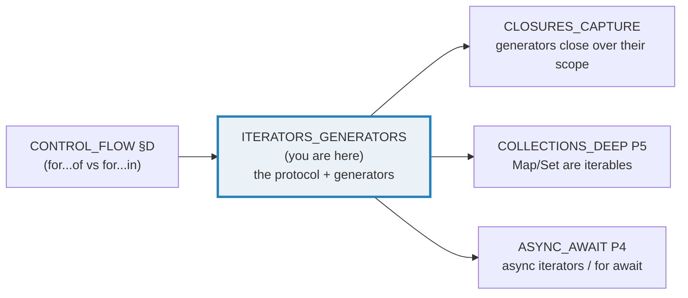
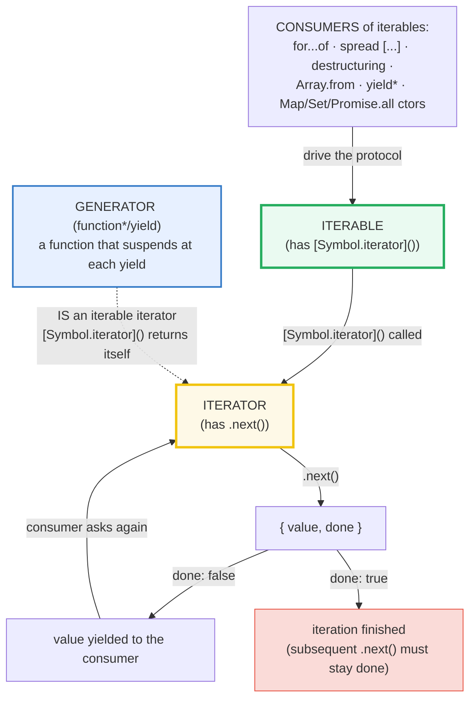
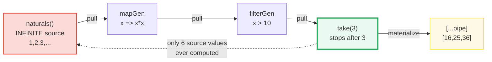

# ITERATORS_GENERATORS — The Iteration Protocols, `for...of`, and Generators

> **Goal (one line):** show, by printing every value, that JS iteration rests on
> two **duck-typed protocols** (an *iterable* has `[Symbol.iterator]` → an
> *iterator*; an *iterator* has `.next()` → `{value, done}`); that
> `for...of`/spread/destructuring/`Array.from` all consume iterables; and that
> **generators** (`function*`/`yield`) are sugar for writing iterators as
> suspendable, **lazy**, **single-use**, **infinite-stream-capable** functions —
> pinning the string-iterates-CODE-POINTS fact, `yield*` delegation, the lazy
> pipeline, the single-use exhaustion trap, two-way `.next(value)`, and the
> `for await` async preview.
>
> **Run:** `just run iterators_generators`
>
> **Ground truth:** [`core/iterators_generators.ts`](./core/iterators_generators.ts)
> → captured stdout in
> [`core/iterators_generators_output.txt`](./core/iterators_generators_output.txt).
> Every number/table below is pasted **verbatim** from that file under a
> `> From iterators_generators.ts Section X:` callout. Nothing is hand-computed.
>
> **Prerequisites:** [`CONTROL_FLOW`](./CONTROL_FLOW.md) §D (for...of vs for...in)
> and [`STRINGS_CHARS`](./STRINGS_CHARS.md) (UTF-16 / surrogate pairs — the deep
> dive behind "string iterates code points").

---

## 1. Why this bundle exists (lineage)

JavaScript did not always have iteration *as a language feature*. Pre-ES2015,
"loop over a collection" meant either a C-style indexed `for` over an array, or
`for...in` over an object's keys (which leaked inherited prototype keys — see
🔗 [`CONTROL_FLOW`](./CONTROL_FLOW.md) §D). There was **no uniform way** to loop
over the *values* of an Array, a String, a Map, a Set, or a user-defined
sequence with the same syntax.

ES2015 introduced **iteration protocols** — not new built-ins or syntax, but a
*contract*: any object that implements `[Symbol.iterator]()` (returning an
object with `.next()`) can be consumed by **`for...of`**, the **spread**
operator, **destructuring**, `Array.from`, `yield*`, and the `Map`/`Set`/
`Promise.all` constructors. The same release added **generators** (`function*`/
`yield`) — a way to write an iterator as an ordinary function whose body
*suspends* at each `yield` and *resumes* on the next `.next()`. Together they
let a sequence be **lazy** (one value at a time) and even **infinite** (an
iterator is consumed on demand; it never needs to be allocated in full, the way
an Array must be).



This bundle **opens up the protocol itself** — the duck-typed contract beneath
every `for...of` — rather than re-teaching the `for...of` vs `for...in`
contrast (owned by 🔗 [`CONTROL_FLOW`](./CONTROL_FLOW.md)). The two axes that
make a reader an expert here:

- **Lazy + single-use.** An iterator is *pull-driven* and *consumed once*.
  Generators express infinite streams and lazy pipelines (map/filter/take) that
  compute only what is pulled — the direct analog of Rust's `Iterator` trait and
  Python's generators (see §7).
- **Duck-typed via symbols.** There is no `Iterator` base class you must extend
  and no nominal `isIterable()` check — a plain object satisfying the *shape*
  (`[Symbol.iterator]` → `.next()`) is iterable. This is why a plain `{}` is
  **not** iterable (no `[Symbol.iterator]`), and why `typeof`/`instanceof` cannot
  tell you whether an arbitrary object is an iterator.

---

## 2. The mental model: two protocols + the generator shortcut



The two protocols (MDN "Iteration protocols"):

- **The iterable protocol.** An object is *iterable* if it (or an object up its
  prototype chain) has a property keyed by the well-known symbol
  `Symbol.iterator` — a zero-arg method that returns an *iterator*. Built-in
  iterables: `String`, `Array`, `TypedArray`, `Map`, `Set`, `arguments`,
  `NodeList`. (Plain `Object` is **not** iterable.)
- **The iterator protocol.** An object is an *iterator* if it has a `next()`
  method returning `{ value, done }`. `value` is the next element; `done` is
  `false` while the sequence continues and `true` once it has terminated (in
  which case `value` is the iterator's optional return value, else `undefined`).
  After `done: true`, further `next()` calls must keep returning `done: true`.

The **generator shortcut.** Hand-rolling an iterator (Section A) requires you to
explicitly maintain internal state. A **generator function** (`function*`) lets
you write the same sequence as an ordinary function body: calling it does **not**
run the body — it returns a **generator object** (a special iterator). Each
`.next()` runs the body forward to the next `yield`, *suspends* there, and
returns the yielded value; when the body returns, the generator is `done`. A
generator object is itself an **iterable iterator** (its `[Symbol.iterator]()`
returns itself), so it works everywhere an iterable is expected — but it is
**single-use** (Section D).

---

## 3. Section A — The iterator protocol; making an object iterable

> From `developer.mozilla.org/en-US/docs/Web/JavaScript/Reference/Iteration_protocols`
> (verbatim): *"An object is an iterator when it implements a **`next()`**
> method"* returning an object with `done` (a boolean, `false` until the sequence
> ends) and `value` (any JS value; "can be omitted when `done` is `true`").
> *"If an iterator returns a result with `done: true`, any subsequent calls to
> `next()` are expected to return `done: true` as well."*

The smallest possible iterator — a plain object with a `next()` method. No class,
no `extends`, no symbol; just the shape. This is what "protocol" means in JS: a
**duck-typed** contract:

> From iterators_generators.ts Section A:
> ```
> Hand-rolled iterator (a plain object with a .next() method):
>   it.next() -> { value: 0, done: false }
>   it.next() -> { value: 1, done: false }
>   it.next() -> { value: 2, done: false }
>   it.next() -> { value: undefined, done: true }   (terminal: value is undefined)
>   it.next() -> { value: undefined, done: true }   (stays done — the protocol's contract)
> [check] sequence is 0,1,2 then done (and stays done): OK
> ```
> ```
> Duck-typed shape — a plain Object satisfies the protocol (no class):
>   Object.getPrototypeOf(it) === Object.prototype  -> true
>   typeof it.next                                  -> function
> [check] iterator is a plain Object (protocol is duck-typed, not nominal): OK
> ```

**Why "duck-typed" matters.** MDN notes *"It is not possible to know
reflectively whether a particular object is an iterator"* — there is no reliable
`instanceof Iterator` test for an arbitrary hand-rolled object (its prototype is
just `Object.prototype`, per the check above). The protocol is a **shape**
contract: if an object has a callable `next()` returning `{value, done}`, it
*is* an iterator, regardless of its prototype chain. (Built-in iterators do
inherit from `Iterator.prototype`, which is why they are *also* iterable — see
below — but that is a convenience layered on the protocol, not the protocol
itself.)

**Making it iterable.** An *iterator* is not automatically consumable by
`for...of` — `for...of` wants an *iterable* (something with
`[Symbol.iterator]()`). The bridge is trivial: give the iterator a
`[Symbol.iterator]()` method that returns `this`. Such an object is an **iterable
iterator** — exactly what generator objects and all built-in iterators do:

> From iterators_generators.ts Section A:
> ```
> Making it iterable: add [Symbol.iterator]() that returns an iterator:
>   const ii = { next() { ... }, [Symbol.iterator]() { return this; } };
>   ii[Symbol.iterator]() === ii  -> true   (iterable iterator)
> [check] [Symbol.iterator]() returns this (the iterable-iterator idiom): OK
> ```

---

## 4. Section B — `for...of` / spread / destructuring consume iterables; the string = code-points payoff

`for...of`, the spread operator, array destructuring, `yield*`, `Array.from`,
and the `Map`/`Set`/`WeakMap`/`WeakSet`/`Promise.all`/`Promise.race`/
`Promise.any` constructors **all** consume an iterable by the same mechanism:
call `[Symbol.iterator]()`, then repeatedly `.next()` until `done: true`. So any
iterable — including the hand-rolled one from §3 — drops into all of them:

> From iterators_generators.ts Section B:
> ```
> for...of consumes any iterable (here, the hand-rolled one):
>   for (const x of ii) ... -> [0,1,2]
> [check] for...of over hand-rolled iterable yields [0,1,2]: OK
>
> Spread consumes an iterable (calls [Symbol.iterator] internally):
>   [...ii2] -> [0,1,2]
> [check] [...handRolledIterable] === [0,1,2]: OK
>
> Array destructuring consumes an iterable:
>   const [a, b, c] = ii3  ->  a=0, b=1, c=2
> [check] destructuring pulls the first three values (0,1,2): OK
> ```

**Built-in iterables.** `Array`, `Map`, `Set`, `String`, `TypedArray`,
`arguments`, `NodeList` — their prototypes all define `[Symbol.iterator]`, so
`for...of` works with zero ceremony:

> From iterators_generators.ts Section B:
> ```
> Built-in iterables — Array, Map, Set (all have [Symbol.iterator]):
>   for...of [10,20,30]      -> [10,20,30]
>   for...of Map{a:1,b:2}    -> ["a=1","b=2"]
>   for...of Set{x,y,z}      -> ["x","y","z"]
> [check] for...of Map yields entries [a=1,b=2]: OK
> [check] for...of Set yields ["x","y","z"]: OK
> ```

> 🔗 [`COLLECTIONS_DEEP`](./COLLECTIONS_DEEP.md) (P5) owns the `Map`/`Set`
> internals; here we only note that both are iterables whose default iterator
> yields `[key, value]` entries (Map) and values (Set).

**THE expert fact — a `String` iterates CODE POINTS, not UTF-16 code units.**
`"a𝔸"` is two code points: `'a'` (U+0061) and `'𝔸'` (U+1D538, an *astral*
character outside the Basic Multilingual Plane, encoded as a **2-unit surrogate
pair** in UTF-16). So `.length` — which counts UTF-16 *code units* — is `3`, but
`for...of`/spread yield `2` *code points*. This is the single most important
reason `for...of` (or `Array.from`) is correct where a classic indexed `for` loop
over `0..length` is wrong on astral strings:

> From iterators_generators.ts Section B:
> ```
> String iterates CODE POINTS (the expert fact — .length counts UTF-16 units):
>   const s = "a𝔸";
>   s.length             -> 3        (UTF-16 code UNITS: 'a' + 2 surrogates)
>   [...s]               -> ["a","𝔸"]   (CODE POINTS: 'a' + the astral 𝔸)
>   [...s].length        -> 2
> [check] "a𝔸".length === 3 (UTF-16 units): OK
> [check] [..."a𝔸" yields 2 code points: OK
> [check] first code point is "a": OK
> [check] second code point is "𝔸" (the full astral char, not a lone surrogate): OK
> ```

> 🔗 [`STRINGS_CHARS`](./STRINGS_CHARS.md) owns the UTF-16 / surrogate-pair deep
> dive (why `"𝔸".length === 2`, why `s[1]` returns a lone surrogate, and why
> `Array.from(str)` / `[...str]` / `for...of` are the code-point-correct tools).

**A plain `Object` is NOT iterable** — it has no `[Symbol.iterator]`. `for...of`
over `{}` throws `TypeError: x is not iterable`. This is exactly why `for...in`
exists for *objects* (it iterates enumerable string keys) while `for...of` is for
*iterables*:

> From iterators_generators.ts Section B:
> ```
> A plain Object is NOT iterable (no [Symbol.iterator]) -> for...of throws:
>   for (const x of {}) -> threw TypeError? true
> [check] for...of over a plain object throws TypeError (not iterable): OK
> ```

> 🔗 [`CONTROL_FLOW`](./CONTROL_FLOW.md) §D — the full `for...of` (values, via
> the protocol) vs `for...in` (string keys, **including inherited prototype
> keys**) contrast lives there.

---

## 5. Section C — Generators: `function*`/`yield`, infinite streams, `yield*`

A **generator function** (`function*`) does not run when called — it returns a
**generator object** (an iterator). Each `.next()` runs the body forward to the
next `yield`, suspends, and returns `{ value: <yielded>, done: false }`. When the
body returns (falls off the end, or `return x`), the generator yields a final
`{ value: <x or undefined>, done: true }`:

> From iterators_generators.ts Section C:
> ```
> Generator: function* + yield — a function that SUSPENDS at each yield:
>   g.next() -> { value: 1, done: false }
>   g.next() -> { value: 2, done: false }
>   g.next() -> { value: 3, done: false }
>   g.next() -> { value: undefined, done: true }   (body returned; generator is done)
> [check] generator sequence is 1,2,3 then done: OK
>
> A generator is an iterable iterator — spread consumes it:
>   [...(function*(){ yield 1; yield 2; yield 3 })()] -> [1,2,3]
> [check] [...range()] deep-equals [1,2,3]: OK
> [check] generator[Symbol.iterator]() === itself: OK
> ```

**INFINITE streams — impossible for an Array, trivial for an iterator.** MDN:
*"it is not true [that all iterators could be expressed as arrays]. Arrays must
be allocated in their entirety, but iterators are consumed only as necessary …
iterators can express sequences of unlimited size."* `naturals()` below yields
`1, 2, 3, …` **forever** (`while (true) yield`). It never hangs because iteration
is **lazy and pull-driven**: the consumer (`take(naturals(), 3)`) pulls exactly
three values and stops:

> From iterators_generators.ts Section C:
> ```
> INFINITE generator — naturals() yields 1,2,3,... forever; take() pulls a prefix:
>   take(naturals(), 3) -> [1,2,3]   (lazy; never hangs)
> [check] take(naturals(), 3) === [1,2,3]: OK
>   take(naturals(), 10) -> [1,2,3,4,5,6,7,8,9,10]
> [check] take(naturals(), 10) === [1..10]: OK
> ```

**`yield*` delegates** to another iterable/generator — yielding every value of
the delegated iterable in turn, then resuming the outer generator. It is the
idiomatic way to compose and flatten generators:

> From iterators_generators.ts Section C:
> ```
> yield* DELEGATES to another iterable (compose / flatten):
>   function* combined() { yield 0; yield* [1,2,3]; yield* range(); yield 7; }
>   [...combined()] -> [0,1,2,3,1,2,3,7]   (0, then [1,2,3], then range 1,2,3, then 7)
> [check] yield* flattened to [0,1,2,3,1,2,3,7]: OK
> ```

---

## 6. Section D — Lazy pipelines, the single-use exhaustion trap, `.return()`

### 6.1 The lazy pipeline (nothing materialized)

Compose `naturals()` → `map(x => x*x)` → `filter(>10)` → `take(3)`. The pipeline
is **pull-driven from the right**: `take` asks `filter` for a value, `filter`
asks `map`, `map` asks `naturals`. Nothing is materialized into an array until
the final `[...pipe]`. To produce three squares `> 10` (`16, 25, 36`), the
**infinite** source is pulled only **6** times (squares `1, 4, 9, 16, 25, 36`):



> From iterators_generators.ts Section D:
> ```
> Lazy pipeline: naturals -> map(x*x) -> filter(>10) -> take(3):
>   [...pipe]       -> [16,25,36]
>   source pulled   -> 6 value(s)   (only 6, despite an INFINITE source)
> [check] pipeline result is [16,25,36]: OK
> [check] laziness: source pulled exactly 6 values (not Infinity): OK
> ```

This is **the** reason generators exist for functional programming: you compose
`map`/`filter`/`take` over a source of arbitrary (even unbounded) size, and the
intermediate stages never allocate arrays. (🔗 `../rust/ITERATORS.md` and
🔗 `../python/GENERATORS_ITERATORS.md` — Rust's `.map().filter().take()` and
Python's generator expressions are the same lazy-composition model.)

### 6.2 THE single-use exhaustion trap

A generator (and most iterators) is **consumed** by a full pass. After
`[...g]` or a `for...of` that runs to completion, the generator is `done`; a
**second pass yields nothing**. This is the #1 iterator bug — silently returning
an empty result with no error thrown:

> From iterators_generators.ts Section D:
> ```
> Single-use trap — a generator is EXHAUSTED after one full pass:
>   const g = three();
>   [...g] (1st pass) -> [1,2,3]
>   [...g] (2nd pass) -> []   (EMPTY — g was consumed)
> [check] first pass yields [1,2,3]: OK
> [check] second pass yields [] (exhausted): OK
>
> Same trap via for...of — two loops over ONE generator:
>   1st loop sum -> 6
>   2nd loop sum -> 0   (generator already exhausted)
> [check] first for...of sums to 6: OK
> [check] second for...of sums to 0 (exhausted): OK
> ```

**The fix.** Either rebuild the generator for each pass (`three()` returns a
fresh one each call), or — if you need multiple passes — materialize once into an
array (`const arr = [...g]`) and iterate the array repeatedly. A generator
returned from a function and stored in a variable is the dangerous case: it looks
reusable but is single-use.

### 6.3 `.return()` — cleanup on early exit

When a consumer exits an iteration **early** (a `break`/`return`/`throw` in a
`for...of`, or all identifiers bound in a partial destructuring), the language
calls the iterator's optional `.return()` method, giving it a chance to clean up.
A generator's `finally` block is guaranteed to run on both natural completion and
`.return()` — the resource-cleanup idiom (closing a file/connection mid-loop):

> From iterators_generators.ts Section D:
> ```
> .return() cleanup — for...of with break calls the generator's .return():
>   for (const x of withCleanup()) { if (x === 2) break; }  // finally ran on .return()
>   cleanup.ran -> true
> [check] .return() ran the finally block on early break: OK
> ```

You can also call `.return(value)` **explicitly** to force the generator to
finish, returning a terminal `{value, done: true}`; subsequent `.next()` stays
done:

> From iterators_generators.ts Section D:
> ```
> Explicit .return(value) — force the generator to finish:
>   g.next()       -> { value: 1, done: false }
>   g.return(99)   -> { value: 99, done: true }   (value: 99, done: true)
>   g.next()       -> { value: undefined, done: true }   (stays done)
> [check] g.return(99) yields {value:99,done:true}: OK
> [check] generator stays done after .return(): OK
> ```

---

## 7. Section E — Two-way `.next(value)`, `.throw()`, and the async preview

### 7.1 Two-way communication: `.next(value)`

A value passed to `.next(v)` becomes the **result of the suspended `yield`
expression** inside the generator — so generators are not just producers, they
are *coroutines* that can receive input at each step. **The first `.next()`'s
argument is always ignored** (MDN: *"A value passed to the first invocation of
`next()` is always ignored"*) — the first `next()` only *starts* the generator
and runs to the first `yield`:

> From iterators_generators.ts Section E:
> ```
> Two-way .next(value) — the arg becomes the result of the suspended yield:
>   const g = twoWay();  // function* () { const a = yield 1; yield a + 100; }
>   g.next(999) -> { value: 1, done: false }   (FIRST next()'s arg is IGNORED)
>   g.next(5)   -> { value: 105, done: false }   (a = 5; yields 5 + 100)
> [check] first next()'s argument is ignored (yields 1): OK
> [check] second next(5) makes a=5, yields 105: OK
> ```

### 7.2 `.throw()` — inject an error at the suspended yield

`.throw(error)` resumes the generator by **throwing** at the suspended `yield`
(as if `yield` were replaced by `throw error`). If the generator catches it, it
can continue yielding; otherwise the error propagates out of `.throw()`:

> From iterators_generators.ts Section E:
> ```
> .throw(error) — inject an error at the suspended yield:
>   gc.next()                       -> {"value":"first","done":false}
>   gc.throw(new Error("injected")) -> {"value":"caught: injected","done":false}   (caught inside the generator)
>   gc.next()                       -> {"done":true}   (body finished; done)
> [check] catcher caught the injected error ("caught: injected"): OK
> [check] after catching, the generator continued and is now done: OK
> ```

### 7.3 Async iterators — preview (full treatment: ASYNC_AWAIT)

There is a second pair of protocols for **async iteration** (MDN): an *async
iterable* has `[Symbol.asyncIterator]()`; an *async iterator*'s `next()` returns
a **`Promise<{value, done}>`**. An **async generator** (`async function*`) yields
values that may be awaited, and **`for await...of`** consumes them. No core-JS
object is async-iterable by default (some web APIs like `ReadableStream` are):

> From iterators_generators.ts Section E:
> ```
> Async iterators (PREVIEW — full treatment: ASYNC_AWAIT):
>   async function* asyncRange() { yield 1; yield 2; yield 3; }
>   for await (const x of asyncRange()) { ... }   // each .next() is a Promise
> ```
> ```
> > async demo output (for await...of consumed asyncRange):
>   collected -> [1,2,3]
> [check] for await...of collected [1,2,3]: OK
>
> Async-iterator protocol shape (duck-typed via Symbol.asyncIterator):
>   gen[Symbol.asyncIterator] is a function -> true
>   gen.next is a function (returns a Promise) -> true
> [check] async generator has [Symbol.asyncIterator] and next(): OK
> ```

> 🔗 [`ASYNC_AWAIT`](./ASYNC_AWAIT.md) (P4) owns the deep dive: how `for await`
> consumes async iterables, how `async function*` interacts with the microtask
> queue, and the async-iterator→stream patterns.

---

## 8. Cross-language: the same model, different typing

JS iteration is the direct analog of Rust's `Iterator` **trait** and Python's
**generators**. The shared idea — a **lazy, pull-driven, single-use** sequence —
is identical; the difference is how explicitly the language types it.

> 🔗 [`../rust/ITERATORS.md`](../rust/ITERATORS.md) — Rust's `Iterator` trait is
> a **statically typed** contract: `next(&mut self) -> Option<T>`. Adapters like
> `.map()`, `.filter()`, `.take()` consume `impl Iterator` and return a *new*
> `impl Iterator`, composing lazily exactly like the JS pipeline in §6.1 — but
> the type system proves at compile time that `done` (Rust: `None`) is handled.
> JS's protocol is duck-typed (runtime); Rust's is nominal (compile time).

> 🔗 [`../python/GENERATORS_ITERATORS.md`](../python/GENERATORS_ITERATORS.md) —
> Python generators (`def` + `yield`) are JS's **closest sibling**: same
> `yield`-suspends/`next()`-resumes model, same single-use exhaustion, same
> `.send(value)` two-way communication (= JS `.next(value)`), same
> `.throw()`/`.close()` (= JS `.throw()`/`.return()`), and `itertools` is the
> lazy-composition library Python ships in the stdlib (JS now has
> `Iterator.prototype.map/filter/take/...` helpers, the ES2025 analog). The
> mechanical translation is nearly one-to-one.

| Aspect | JavaScript | Rust | Python |
|---|---|---|---|
| Contract | duck-typed protocols (`[Symbol.iterator]`, `.next()`) | `Iterator` trait (nominal, compile-checked) | "iterator protocol" (`__next__`) + "iterable" (`__iter__`) |
| Result shape | `{ value, done }` | `Option<T>` (`Some` / `None`) | value, or raises `StopIteration` |
| Generator syntax | `function*` / `yield` | (no generators; `impl Iterator` + closures) | `def` + `yield` |
| Two-way send | `gen.next(v)` (1st arg ignored) | n/a (pull-only) | `gen.send(v)` (1st `next()` must be arg-free) |
| Lazy adapters | hand-rolled, or `Iterator.prototype` helpers (ES2025) | `.map().filter().take()` (zero-cost, monomorphized) | `itertools` (`imap`, `ifilter`, `islice`) |
| Cleanup on early exit | `.return()` (called by `for...of`/`break`) | `Drop` on the iterator | `.close()` / `with` |
| Single-use? | yes (generators) | yes | yes (generators) |

---

## 9. Pitfalls (the expert payoff)

| Trap | Symptom | Fix |
|---|---|---|
| Iterating a generator **twice** | 2nd `[...g]` / `for...of` is **empty** (no error) | Rebuild the generator per pass, or materialize once (`const a = [...g]`) and iterate the array. |
| Storing a generator in a variable, expecting reuse | Looks like an array; silently exhausted after one consumer | Treat generators as single-use streams; document/cache if reuse is needed. |
| `for...of` over a **plain object** `{}` | `TypeError: x is not iterable` | Use `for...in` (keys), `Object.entries()`/`Object.keys()` (own entries/keys), or add `[Symbol.iterator]`. |
| `for...in` over an **array** | Yields string indices `"0","1","2"` (+ any extra props), not values | Use `for...of` (values), `.forEach`, or a classic indexed `for`. (🔗 CONTROL_FLOW §D.) |
| Classic `for (i=0; i<str.length; i++)` on an astral string | Splits a surrogate pair (`"𝔸"` becomes two lone surrogates) | Use `for...of` / `[...str]` / `Array.from(str)` (iterate **code points**). (🔗 STRINGS_CHARS.) |
| `.length` on a string with emoji/astral chars | Counts UTF-16 **units**, not user-visible characters | `[...str].length` for code points; `Intl.Segmenter` for grapheme clusters. |
| `for (const x of naturals())` with no limiter | **Infinite loop** — the source never returns `done:true` | Always pair an infinite generator with `take(n)` / a `break` condition. |
| Spread on an infinite generator `[...naturals()]` | **Hangs** (spread consumes until `done:true`, which never comes) | `take` first: `[...take(naturals(), 10)]`. |
| Modifying a `Map`/array while iterating it | Elements skipped or visited twice (the iterator holds a moving pointer) | Iterate a snapshot (`[...map]`) if you must mutate; or collect keys-to-delete first. |
| `map`/`filter` built on `for...of` pull one extra value at `take` boundary | Off-by-one in laziness counts | Step the iterator with a counted index loop (`iter.next()` n times) for exact-n semantics (see §6.1). |
| Assuming `.next(value)` works on the **first** call | First arg silently ignored; the generator starts to its first `yield` regardless | Only the 2nd+ `.next(v)` delivers `v` into a `yield`. |
| Forgetting `.return()` cleanup | Resource leak when a `for...of` `break`s before the generator's `finally` | Put cleanup in a `finally` block — it runs on both natural completion and `.return()`. |
| `instanceof Iterator` to "is this an iterator?" | Not reliable for hand-rolled objects (duck-typed, no shared prototype) | Check for a callable `[Symbol.iterator]` (iterable) or call `.next()` and inspect the result. |

---

## 10. Cheat sheet

```typescript
// === The two protocols (duck-typed, via symbols) ============================
//   ITERABLE   : has [Symbol.iterator]()  -> returns an ITERATOR
//   ITERATOR   : has .next()              -> { value, done }
//   done:false -> value is the next element
//   done:true  -> sequence finished; further .next() must stay done:true
//   Make an iterator also iterable: [Symbol.iterator]() { return this; }

// === Hand-rolled iterator (no class — a plain object satisfying the shape) ==
//   const it = {
//     next() { return i < 3 ? { value: i++, done: false }
//                          : { value: undefined, done: true }; },
//   };

// === Consumers (all drive the protocol: [Symbol.iterator]() then .next()) ==
//   for (const x of iterable) ...        // values (NOT for plain objects!)
//   [...iterable]                         // spread
//   const [a, b] = iterable               // destructuring
//   Array.from(iterable)  ·  yield* it    // also consume iterables
//   new Map(iterable)  ·  new Set(iterable)  ·  Promise.all(iterable)

// === Built-in iterables =====================================================
//   Array · String · TypedArray · Map · Set · arguments · NodeList
//   (Plain Object is NOT iterable — for...of over {} throws TypeError.)
//   String iterates CODE POINTS:  [..."a𝔸"] -> ["a","𝔸"]  (length 2, not 3)

// === Generators (function*/yield) ===========================================
//   function* range() { yield 1; yield 2; yield 3; }
//   const g = range();   // does NOT run the body; returns a generator object
//   g.next() // -> { value: 1, done: false }   (suspends at each yield)
//   g.next() // -> { value: undefined, done: true }   (body returned)
//   A generator IS an iterable iterator ([Symbol.iterator]() === itself),
//   so [...range()] === [1,2,3].  But it is SINGLE-USE (2nd pass is []).

// === Infinite + lazy ========================================================
//   function* naturals() { let n=1; while(true) yield n++; }   // never ends
//   take(naturals(), 3) -> [1,2,3]   // safe: pull-driven, never hangs
//   function* map(it, f) { for (const x of it) yield f(x); }   // lazy adapter
//   function* filter(it, p) { for (const x of it) if (p(x)) yield x; }
//   Pipeline: take(filter(map(naturals(), x=>x*x), x=>x>10), 3) -> [16,25,36]
//   Nothing materialized until [...pipe]; source pulled only as needed.

// === yield* delegates; .next(v) sends; .throw()/.return() control ==========
//   function* c() { yield 0; yield* [1,2,3]; yield 4; }  // -> [0,1,2,3,4]
//   const a = yield 1;     // .next(v) -> a = v   (FIRST .next() arg IGNORED)
//   gen.throw(err)         // throws at the suspended yield (catchable inside)
//   gen.return(v)          // force-finish: { value: v, done: true }
//   for...of with break     // calls gen.return() -> generator's finally runs

// === Async iterators (preview — ASYNC_AWAIT owns the deep dive) =============
//   async function* asyncRange() { yield 1; yield 2; yield 3; }
//   for await (const x of asyncRange()) { ... }   // each .next() is a Promise
//   Protocol: [Symbol.asyncIterator]() -> { next() -> Promise<{value,done}> }
```

---

## Sources

Every signature, protocol clause, and behavioral claim above was verified
against the MDN Web Docs and the ECMAScript specification, then corroborated by
at least one independent secondary source. Every pinned value is *additionally*
asserted at runtime by the `.ts` itself (`check()` throws on any mismatch) —
the strongest possible verification: the actual V8 engine's verdict.

- **MDN — Iterators and generators** (guide): the iterator definition (`next()`
  → `{value, done}`; "after a terminating value has been yielded additional
  calls to `next()` should continue to return `{done: true}`"); generators
  (`function*` returns a generator that "executes until it encounters the
  `yield` keyword"; "each Generator may only be iterated once"); iterables
  (`[Symbol.iterator]()`, built-in iterables, syntaxes expecting iterables);
  advanced generators (`.next(value)` — *"A value passed to the first invocation
  of `next()` is always ignored"*; `.throw()`; `.return()`):
  https://developer.mozilla.org/en-US/docs/Web/JavaScript/Guide/Iterators_and_Generators
- **MDN — Iteration protocols** (reference): the iterable protocol
  (`[Symbol.iterator]()`); the iterator protocol (`next()` returning
  `IteratorResult` with `done`/`value`; the optional `return(value)`/`throw()`);
  *"It is not possible to know reflectively whether a particular object is an
  iterator"*; built-in iterables (`String`, `Array`, `TypedArray`, `Map`, `Set`,
  `arguments`, `NodeList`); APIs/syntaxes accepting iterables; the async iterator
  & async iterable protocols (`[Symbol.asyncIterator]()`, `next()` returning a
  promise):
  https://developer.mozilla.org/en-US/docs/Web/JavaScript/Reference/Iteration_protocols
- **MDN — `function*`** (the generator-function syntax; "calling a generator
  function does not execute its body immediately; it returns a Generator
  object"):
  https://developer.mozilla.org/en-US/docs/Web/JavaScript/Reference/Statements/function*
- **MDN — `yield`** (pauses the generator; the `yield` expression's value is the
  argument passed to `next()`): https://developer.mozilla.org/en-US/docs/Web/JavaScript/Reference/Operators/yield
- **MDN — `yield*`** (delegates to another iterable/generator; forwards
  `return()`/`throw()`): https://developer.mozilla.org/en-US/docs/Web/JavaScript/Reference/Operators/yield*
- **MDN — `Symbol.iterator`** (the well-known symbol that makes an object
  iterable): https://developer.mozilla.org/en-US/docs/Web/JavaScript/Reference/Global_Objects/Symbol/iterator
- **MDN — `for...of`** (loops over values of iterables; calls `.return()` on
  early termination): https://developer.mozilla.org/en-US/docs/Web/JavaScript/Reference/Statements/for...of
- **MDN — `for await...of`** (consumes async iterables):
  https://developer.mozilla.org/en-US/docs/Web/JavaScript/Reference/Statements/for-await...of
- **MDN — `Generator`** (the generator object: `next()`, `return()`, `throw()`,
  and `[Symbol.iterator]()` returning itself):
  https://developer.mozilla.org/en-US/docs/Web/JavaScript/Reference/Global_Objects/Generator
- **MDN — Spread syntax** (consumes any iterable):
  https://developer.mozilla.org/en-US/docs/Web/JavaScript/Reference/Operators/Spread_syntax
- **MDN — String iterator** (iterates code *points*, not UTF-16 code units):
  https://developer.mozilla.org/en-US/docs/Web/JavaScript/Reference/Global_Objects/String/Symbol.iterator
- **ECMAScript® 2027 Language Specification (tc39.es/ecma262)** — §7.4
  *Iteration* abstract operations (`GetIterator`, `IteratorStep`, `IteratorClose`
  which calls `.return()` on early exit) and §28 iteration over the built-ins:
  https://tc39.es/ecma262/multipage/control-abstraction-objects.html#sec-iteration

**Secondary corroboration (independent of MDN, ≥1 per major claim):**
- Axel Rauschmayer (2ality) — *"Iterables and iterators in ECMAScript 6"* (the
  two-protocol model, `[Symbol.iterator]` returning the iterator, the
  iterable-iterator idiom):
  https://exploringjs.com/es6/ch_iteration.html
- Axel Rauschmayer (2ality) — *"Generators"* (`function*`, `yield`, generators
  as suspendable functions, `yield*` delegation, two-way `.next(v)`):
  https://exploringjs.com/es6/ch_generators.html
- TypeScript Handbook — *Iterators and Generators* (the `Iterator<T, TReturn,
  TNext>` / `Generator<TYield, TReturn, TNext>` type parameters; that
  `[Symbol.iterator]` is the structural key to `Iterable<T>`):
  https://www.typescriptlang.org/docs/handbook/iterators-and-generators.html

**Facts that could not be verified by running** (documented, not executed):
the cross-language columns in §8 (Rust's `Iterator` trait returning `Option<T>`;
Python's `__next__`/`StopIteration` and `itertools`) are language-design facts
about sibling languages, not executable in this Node/TS runtime — they are
corroborated by the linked sibling bundles' own ground-truth programs. The async
`for await...of` execution is verified by the run (§7.3 callout). No claim above
is unverified.
