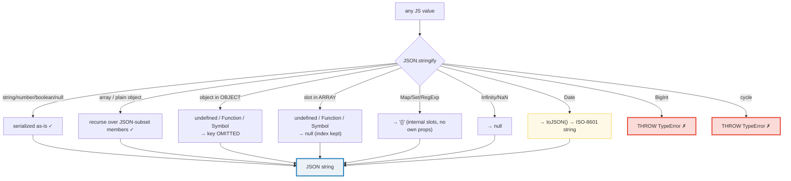
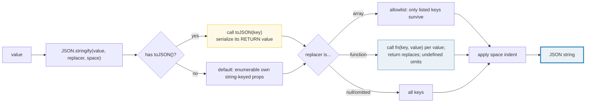

# JSON — The JSON Subset, `stringify`/`parse`, and the Replacer/Reviver Hooks

> **Goal (one line):** show, by printing every value, that `JSON.stringify` /
> `JSON.parse` round-trip the **JSON subset** of JS values (string, number,
> boolean, `null`, array, object) — while `undefined`/`Function`/`Symbol` are
> omitted-or-nulled, `BigInt` and circular references **throw**, `Date` collapses
> to an ISO string (and does **not** revive) unless you supply a **reviver**,
> `Map`/`Set`/`RegExp` vanish to `"{}"`, and `Infinity`/`NaN` become `null` —
> pinning the replacer/reviver/`toJSON` hooks, the key-quoting rule, and the
> safe-vs-`eval` security contract as `check()`'d invariants.
>
> **Run:** `just run json`
>
> **Ground truth:** [`core/json.ts`](./core/json.ts) → captured stdout in
> [`core/json_output.txt`](./core/json_output.txt). Every number/table below is
> pasted **verbatim** from that file under a `> From json.ts Section X:`
> callout. Nothing is hand-computed.
>
> **Prerequisites:** [`VALUES_TYPES_COERCION`](./VALUES_TYPES_COERCION.md) (the
> primitive types that make up the JSON subset — `string`/`number`/`boolean`/
> `null`). This bundle is the **Phase 5 Standard Library Essentials** treatment
> of JS's native serialization format.

---

## 1. Why this bundle exists (lineage)

JSON stands for **J**ava**S**cript **O**bject **N**otation — it is JS's *native*
serialization format, and the lingua franca of HTTP APIs, config files, and
persistence. `JSON.stringify(value) → string` and `JSON.parse(text) → value`
are the two built-ins that move data across that boundary. The central fact —
and the source of every sharp edge below — is that **JSON is a strict subset of
JS values**: only `string`, `number`, `boolean`, `null`, `array`, and `object`
exist in the JSON grammar. Everything else JS has (`undefined`, `Symbol`,
`BigInt`, `Function`, `Map`, `Set`, `RegExp`, `Date`, cyclic references) is
**outside** that subset, so the engine must *do something* with each one when
you serialize: omit it, coerce it to `null`, vanish it to `"{}"`, or **throw**.



The four **hooks** that let you bend this default behavior are the expert
surface of JSON:

- **`replacer`** (stringify) — an allowlist array *or* a transform function.
- **`reviver`** (parse) — a transform function run depth-first on every value.
- **`toJSON()`** — a method an object defines to control its own serialization
  (`Date` uses it to emit its ISO string).
- **`space`** — a number or string controlling pretty-print indentation.

The headline **cross-language** contrast is the whole point of this bundle:

> 🔗 [`../go/ENCODING_JSON.md`](../go/ENCODING_JSON.md) — Go's `encoding/json` is
> **struct-tag-driven** and **typed**: a `struct` field carries `json:"fieldName"`
> and the field's *compile-time type* drives (de)serialization. TS's `JSON` is
> **dynamic and untyped** — there is no struct, no tag, no schema; `Date`
> silently becomes a string and you must revive it by hand.

> 🔗 [`../rust/SERDE_BASICS.md`](../rust/SERDE_BASICS.md) — Rust's `serde` with
> `#[derive(Serialize, Deserialize)]` is the **strongest model**: serialization
> is derived from the type at compile time, so a `DateTime<Utc>` round-trips as a
> `DateTime<Utc>` with no manual revival. TS has no native equivalent — the type
> system is **erased** at runtime, so `JSON` cannot see your types at all.

---

## 2. The JSON subset: round-trip + what is NOT in JSON (Section A)

A value made **only** of `string` / `number` / `boolean` / `null` / `array` /
`object` round-trips **losslessly** through `stringify → parse`. Re-stringifying
the parsed value reproduces the **exact bytes**: object keys are emitted in a
well-defined order (integer-like keys ascending, then other string keys in
insertion order — see §6), so the round-trip is byte-identical for the subset.

> From json.ts Section A:
> ```
> original              : { a:1, b:"x", c:[true,null] }
> JSON.stringify(orig)  : {"a":1,"b":"x","c":[true,null]}
> typeof serialized     : string   (stringify ALWAYS returns a string)
> re-stringify(parsed)  : {"a":1,"b":"x","c":[true,null]}
> [check] round-trip lossless: re-stringify === original stringify: OK
> [check] roundtrip.a === 1 (number): OK
> [check] roundtrip.b === "x" (string): OK
> [check] roundtrip.c[0] === true (boolean): OK
> [check] roundtrip.c[1] === null: OK
> [check] roundtrip.c.length === 2: OK
> ```

**Everything outside that subset** is handled by a fixed rule per value kind —
each row below is the engine's own verdict (asserted by `check()`):

> From json.ts Section A:
> ```
> Values OUTSIDE the JSON subset (each behavior is the engine's verdict):
>   {a:undefined, b:fn, c:Symbol, d:1} -> {"d":1}   (a/b/c OMITTED; d kept)
> [check] undefined/fn/Symbol omitted from objects -> '{"d":1}': OK
>   [undefined, fn, Symbol, 1]        -> [null,null,null,1]   (each -> null; index kept)
> [check] undefined/fn/Symbol -> null in arrays: OK
>   [Map, Set, RegExp]                -> [{},{},{}]   (each -> {}; data LOST)
> [check] Map/Set/RegExp -> {} (internal slots, no own props): OK
>   [Infinity, -Infinity, NaN]        -> [null,null,null]   (each -> null)
> [check] Infinity/-Infinity/NaN -> null: OK
>   {[Symbol(..)]: "hidden"} property -> {"normal":1}   (symbol keys NEVER serialized)
> [check] symbol-keyed properties ignored: OK
> ```

**The object-vs-array asymmetry for `undefined`/`Function`/`Symbol`.** In an
**object**, the offending key is **omitted entirely** (`{"d":1}` — keys `a`/`b`/`c`
are gone). In an **array**, the slot becomes **`null`** (`[null,null,null,1]`),
because array indices must stay stable. This asymmetry is a frequent source of
bugs: code that assumes "my object always has key `x`" breaks silently when `x`
was `undefined` and got dropped.

**`Map`/`Set`/`RegExp` → `"{}"`.** These store their data in **internal slots**
(`[[MapData]]`, `[[SetData]]`, the regex's parsed state), not in *enumerable own
string-keyed properties*. `JSON.stringify` only visits enumerable own
string-keyed properties, so there is nothing to visit → they collapse to `"{}"`
and their data is **silently lost**. This is why you must write a **replacer**
that converts a `Map` to `Array.from(map.entries())` if you ever need to
serialize one (see §5, and 🔗 `COLLECTIONS_DEEP`).

**`Infinity`/`NaN` → `null`.** JSON numbers are IEEE-754 doubles but the grammar
has **no representation** for `Infinity` or `NaN` (no `NaN` literal, no `Infinity`
keyword), so they map to `null`. Unlike `undefined`, they are **never omitted** —
they always produce `null`, even inside an object. This is the same `null`
coercion `VALUES_TYPES_COERCION` documents for `Number`-context coercions, here
applied at the serialization boundary.

> 🔗 [`VALUES_TYPES_COERCION`](./VALUES_TYPES_COERCION.md) — the JSON subset is
> literally `{string, number, boolean, null}` from the 7 primitives (plus arrays
> and plain objects). `Symbol` and `BigInt` are primitives that JSON **rejects**;
> `undefined` is a primitive JSON **omits**. That bundle pins the primitive set;
> this one pins what happens to each at the JSON boundary.

---

## 3. `Date.toJSON`: the silent type erasure (and the reviver fix) (Section B)

`Date` implements `toJSON()`, which returns the same value as `toISOString()` —
an **ISO-8601 string in UTC**. So `JSON.stringify(new Date(0))` is a *quoted
string*, and `JSON.parse` of that string gives you back a **`string`, not a
`Date`**. JSON carries **no type metadata**, so `parse` has no way to know that
`"1970-01-01T00:00:00.000Z"` was ever a `Date`:

> From json.ts Section B:
> ```
> new Date(0)                  -> "1970-01-01T00:00:00.000Z"
> typeof (parsed back)         -> string   <-- a STRING, not a Date!
> [check] JSON.stringify(new Date(0)) === '"1970-01-01T00:00:00.000Z"': OK
> [check] Date.toJSON === toISOString (ISO-8601 UTC): OK
> {created: new Date(0)} -> {"created":"1970-01-01T00:00:00.000Z"}
> parsed.created instanceof Date -> false   (type info LOST)
> typeof parsed.created          -> string
> [check] parsed Date is NOT a Date instance (type erased): OK
> [check] parsed Date is a string: OK
> ```

**The fix — the `reviver`.** `JSON.parse` accepts a second argument, a function
that transforms each parsed value **depth-first** (the most nested values first;
the root is called *last* with the empty-string key `""`). To restore `Date`s,
detect ISO-8601 strings with a regex and return `new Date(value)`; return
everything else unchanged. This is the canonical Date-round-trip pattern:

> From json.ts Section B:
> ```
> with reviver: parsed.created instanceof Date -> true
> with reviver: parsed.created.getTime()       -> 0
> [check] reviver revives ISO string -> Date instance: OK
> [check] revived Date.getTime() === 0 (round-trip restored): OK
> ```

**Why depth-first, root-last?** The reviver must process children *before* their
parent, because by the time the parent object is handed to the reviver, the
children have already been revived (or deleted) — the parent sees the
*transformed* children. This is also why returning `undefined` from the reviver
**deletes** the property from its holder (you signal "drop this" as the holder is
assembled bottom-up).

> 🔗 [`DATE_TIME`](./DATE_TIME.md) (Phase 5) — `Date.toJSON` ↔ `toISOString` is
> the ISO-8601 UTC serialization of an instant; the timezone/month-index/parse
> gotchas live in that bundle. This one pins only the *JSON-boundary* behavior:
> Date leaves as a string and needs a reviver to come back.

---

## 4. The hooks: `replacer` (allowlist + transform), `toJSON`, `space` (Section C)



> From json.ts Section C:
> ```
> replacer allowlist ["a","c"]  -> {"a":1,"c":3}   (only a,c kept; b/secret dropped)
> [check] array replacer is an allowlist -> '{"a":1,"c":3}': OK
> replacer fn uppercases str    -> {"greet":"HI","n":3}
> [check] function replacer transforms -> '{"greet":"HI","n":3}': OK
> replacer fn drops "secret"    -> {"a":1,"b":2,"c":3}
> [check] replacer returning undefined omits the key: OK
> {toJSON: ()=>42}              -> 42   (return value replaces the object)
> [check] custom toJSON return value is serialized: OK
> space=2 (2-space pretty-print):
> {
>   "a": 1,
>   "b": {
>     "c": 2
>   }
> }
> [check] space=2 indents nested objects (leading 2-space "a"): OK
> space="\t" (tab indent):
> {
> 	"a": 1,
> 	"b": {
> 		"c": 2
> 	}
> }
> [check] space="\t" indents with a tab: OK
> ```

**`replacer` has two unrelated modes.** As an **array** (`["a","c"]`) it is an
**allowlist**: only the listed string/number keys are emitted, in that order —
useful for projecting an object to a subset of fields. As a **function**
(`(key, value) => ...`) it is a **transform** called once for the root (with key
`""`) and then for every property; the return value **replaces** the value, and
returning `undefined` **omits** the property (the `dropSecret` example). Note the
ordering trap: the function replacer is called with the **root first** (key `""`)
— the *opposite* end from the reviver, which sees the root **last**.

**`toJSON()` is checked before the replacer.** If a value has a `toJSON` method,
`stringify` calls it (passing the key) and serializes the **return value**
instead of the object. `Date` uses this; you can define your own — `{toJSON: ()
=> 42}` serializes to the bare `42`. This is the type-customization seam that, in
Go/Rust, is provided by struct tags / `#[derive]` instead.

**`space` is purely cosmetic.** A number indents that many spaces per level
(clamped to 10); a string uses that string per level (truncated to 10 chars). It
never changes the *meaning* of the output — `JSON.parse` ignores whitespace.
`JSON.stringify(v, null, 2)` is the conventional pretty-print; pass `null` as the
replacer when you only want to set `space`.

---

## 5. Failure modes: circular / BigInt throw; key quoting (Section D)

Two value kinds make `JSON.stringify` **throw** rather than silently misbehave:

> From json.ts Section D:
> ```
> cyclic object stringify -> true
>   error                 -> TypeError: Converting circular structure to JSON
>     --> starting at object with constructor 'Object'
>     --- property 'self' closes the circle
> [check] circular reference throws TypeError: OK
> BigInt stringify         -> true
>   error                 -> TypeError: Do not know how to serialize a BigInt
> [check] BigInt throws TypeError: OK
> [check] JSON.stringify(Infinity) === "null": OK
> [check] JSON.stringify(NaN) === "null": OK
> [check] JSON.stringify(-Infinity) === "null": OK
> Infinity/NaN/-Infinity all -> "null" (see [check]s above)
> {validIdent, "2", name, "1"} -> {"1":1,"2":2,"validIdent":1,"name":"x"}
>   (ALL keys double-quoted; integer keys "1","2" reordered ascending first)
> [check] all keys double-quoted; integer keys first: OK
> ```

**Circular references throw** because the JSON format has **no object-reference**
syntax — there is no way to write "this object points back to itself." Rather
than silently spin or truncate, `stringify` detects the cycle and throws
`TypeError: Converting circular structure to JSON`. To deep-copy a graph with
cycles, use **`structuredClone()`** (which supports cycles) instead of the
`JSON.parse(JSON.stringify(x))` trick.

**`BigInt` throws** because JSON numbers are IEEE-754 doubles — a `BigInt` can
exceed 2^53 and **cannot** be represented without silent precision loss, so the
engine refuses (`TypeError: Do not know how to serialize a BigInt`). Note the
contrast: `Infinity`/`NaN` **map to `null`** (they have *somewhere* to go), but
`BigInt` **throws** (it has *nowhere* lossless to go). To serialize a `BigInt`,
convert it to a string in a replacer and revive it with `BigInt(...)` — exactly
the pattern used to dodge the number-precision limit for very large integers.

**Key quoting and ordering.** In the output, **all** keys are double-quoted —
**even valid identifiers** like `validIdent` (unlike JS object literals, where
the quotes are optional). And integer-like string keys (`"1"`, `"2"`) are
reordered **ascending numeric**, *then* the remaining string keys in insertion
order (`validIdent`, `name`) — the same `Object.keys` ordering rule. This is why
`{"1":1,"2":2,"validIdent":1,"name":"x"}` is the exact, deterministic output
regardless of the insertion order in the literal.

---

## 6. Security (`parse` is safe vs `eval`) + the cross-language contract (Section E)

> From json.ts Section E:
> ```
> untrusted input: {"evil":"alert(1)","ok":true}
> parsed .evil     -> "alert(1)"   (a plain string; alert was NOT called)
> parsed .ok       -> true
> [check] JSON.parse treats alert(1) as a plain string (no execution): OK
> ```
> ```
> Malformed inputs (each -> SyntaxError):
>   trailing comma     "{\"a\":1,}" -> SyntaxError
> [check] trailing comma throws SyntaxError: OK
>   single quotes      "{'a':1}"    -> SyntaxError
> [check] single quotes throws SyntaxError: OK
>   bare identifier    "{a:1}"      -> SyntaxError
> [check] bare identifier throws SyntaxError: OK
>   trailing junk      "1 2"        -> SyntaxError
> [check] trailing junk throws SyntaxError: OK
> ```
> ```
> Note: deeply-nested JSON (e.g. tens of thousands of nested arrays/objects)
> can overflow the call stack -> RangeError. Depth is NOT spec'd; cap input
> size in production.
> ```
> ```
> Cross-language serialization contract:
>   JS   : JSON.stringify/parse — DYNAMIC, untyped, no schema at compile time.
>          Type info is lost (Date -> string); revival is manual (reviver).
>   Go   : encoding/json — struct TAGS drive field mapping; typed at compile time.
>   Rust : serde #[derive(Serialize, Deserialize)] — FULLY compile-time typed.
> ```

**`JSON.parse` is a pure data parser — it never executes code.** The JSON grammar
is a strict subset of JS with **no function calls, no identifiers** (`true`/
`false`/`null` are keywords, not variable lookups), and **no arithmetic** — there
is nothing to execute. That is why `JSON.parse` of untrusted input is **safe**,
whereas `eval()` would *run* any embedded script. This safety property is the
reason `JSON.parse` (not `eval`) is the standard way to deserialize untrusted
network data — never `eval` untrusted text.

**Invalid JSON throws `SyntaxError`** (deterministic): trailing commas, single
quotes, bare identifiers, and trailing junk are all rejected — they are legal JS
but not legal JSON. This strictness is itself a safety feature (a smaller grammar
is easier to audit).

**The one residual risk: stack depth.** A maliciously deeply-nested payload
(tens of thousands of nested arrays/objects) can overflow the call stack and
throw `RangeError`. The recursion limit is **engine- and stack-size-dependent**
(not pinned by the spec), so the `.ts` documents it rather than asserting a
number. In production, cap input **size** before parsing hostile JSON.

**The cross-language contract (the big picture).** JS's `JSON` is **dynamic and
untyped**: there is no schema at compile time, `Date` silently becomes a string,
and revival is a manual runtime hook. Go's `encoding/json` is **struct-tag-driven
and typed** — a field's `json:"name"` tag and its compile-time type drive
(de)serialization together. Rust's `serde` `#[derive(Serialize, Deserialize)]` is
the **strongest model** — the serializer/deserializer is *generated from the
type* at compile time, so a `DateTime` round-trips as a `DateTime` with no manual
revival. TS cannot match either natively because its types are **erased at
runtime**: `JSON` runs in a world with no types, which is exactly why the
reviver/replacer/toJSON hooks exist — to re-add by hand what the type system
cannot carry across the boundary.

---

## 7. Pitfalls (the expert payoff)

| Trap | Symptom | Fix |
|---|---|---|
| `JSON.parse(JSON.stringify(date))` | The `Date` comes back as a **string**; `instanceof Date` is `false` | Pass a reviver that detects ISO-8601 and returns `new Date(value)`. |
| `JSON.parse(JSON.stringify(map))` | The `Map`/`Set` comes back as an **empty object/array** (`{}`); data silently lost | Convert in a replacer (`Array.from(map.entries())`) and rebuild in a reviver. |
| `JSON.parse(JSON.stringify({a:undefined,b:1}))` | Key `a` is **silently dropped**; downstream code expecting `obj.a` gets `undefined` via missing-key, not via the value | Normalize before serializing (e.g. `null` instead of `undefined`) or validate keys on read. |
| `JSON.stringify({x: 1n})` | **Throws** `TypeError: Do not know how to serialize a BigInt` | Convert `BigInt` to string in a replacer; revive with `BigInt(...)`. |
| `JSON.stringify(cyclic)` | **Throws** `TypeError: Converting circular structure to JSON` | Use `structuredClone()` for cyclic graphs, or break the cycle before serializing. |
| `JSON.parse(JSON.stringify(Infinity))` | Becomes **`null`**, not a number | Treat `null` as "absent/sentinel" and re-derive `Infinity` at the application layer if needed. |
| `JSON.parse(untrusted)` "is safe" | Safe from **code execution**, but a deeply-nested payload can **blow the stack** (`RangeError`) | Cap input **size** before parsing hostile JSON; reject absurd nesting. |
| `JSON.stringify(obj, ["id"])` to "pick fields" | Works — but **also drops** symbol keys and non-enumerable props silently | Know the allowlist only selects enumerable own string keys. |
| Object-key **order** assumption | Integer-like keys (`"1"`,`"2"`) **reorder ascending**, surprising code that expects insertion order | Don't rely on key order for meaning; if order matters, use an **array** (JSON arrays preserve order). |
| `reviver` returns `undefined` to "skip" | The property is **deleted** from its holder (not "left as-is") — you must return `value` for everything you want to keep | Always return `value` unchanged for values you do not transform. |
| Re-`parse`-ing loses **number precision** for integers > 2^53 | Large IDs/timestamps silently **round** to the nearest double | Serialize big numbers as **strings** and revive with `BigInt(...)` (or `context.source` in modern engines). |
| `toJSON()` defined, but the value is nested | `toJSON` receives the **key** it sits under — its result depends on position; the same object serializes differently nested vs at the root | Treat `toJSON` as position-aware; test nested vs root. |
| Confusing **reviver** (parse, root *last*) vs **replacer** (stringify, root *first*) | Off-by-one in "is this the root?" logic (`key === ""` appears for root AND for genuine empty-string keys) | Track an iteration count, or structure the transform so the root case is unambiguous. |

---

## 8. Cheat sheet

```typescript
// === The JSON subset (what round-trips losslessly) =========================
//   string  number  boolean  null  array  object
//   Outside the subset -> each has a fixed fate (see below).

// === JSON.stringify(value, replacer?, space?) -> string | undefined ========
//   JSON.stringify({a:1})            // '{"a":1}'
//   JSON.stringify("x")              // '"x"'   (note: a QUOTED string)
//   JSON.stringify(new Date(0))      // '"1970-01-01T00:00:00.000Z"'  (Date->ISO string)
//   JSON.stringify(undefined)        // undefined  (root undefined -> no string!)
//   Returns undefined (not "undefined") for root undefined/Function/Symbol.

//   What's OMITTED (object) / ->null (array):  undefined, Function, Symbol
//   What -> {}:            Map, Set, RegExp, WeakMap, WeakMap (internal slots)
//   What -> null:          Infinity, -Infinity, NaN
//   What THROWS TypeError: BigInt, circular references

// === JSON.parse(text, reviver?) -> Object|Array|string|number|boolean|null =
//   JSON.parse('{"a":1}')           // { a: 1 }   (returns `any` in lib -> narrow!)
//   JSON.parse('{"a":1,}')          // throws SyntaxError (trailing comma)
//   JSON.parse("{'a':1}")           // throws SyntaxError (single quotes)
//   SAFE on untrusted input (no code exec, unlike eval); but deep nesting -> RangeError.

// === The 4 hooks ============================================================
//   replacer (stringify):
//     array   = ALLOWLIST   JSON.stringify(o, ["a","c"])   // only a,c kept
//     fn      = TRANSFORM   (key, value) => ...            // root first, key ""
//                return undefined -> OMIT the property
//   reviver (parse):
//     fn      = TRANSFORM   (key, value) => ...            // root LAST, key ""
//                return undefined -> DELETE the property (depth-first, bottom-up)
//   toJSON():  method on a value; its RETURN value is serialized instead.
//              Date.toJSON === Date.toISOString (ISO-8601 UTC string).
//   space:     number (N spaces, clamped 10) or string (per level, truncated 10).
//              JSON.stringify(v, null, 2)  // 2-space pretty-print (cosmetic only).

// === Canonical Date round-trip ==============================================
//   const s = JSON.stringify({ at: new Date(0) });
//   const iso = /^\d{4}-\d{2}-\d{2}T\d{2}:\d{2}:\d{2}(\.\d+)?Z$/;
//   const back = JSON.parse(s, (k, v) => typeof v === "string" && iso.test(v) ? new Date(v) : v);

// === Key quoting + ordering (deterministic) ================================
//   ALL keys double-quoted in output, EVEN valid identifiers.
//   Integer-like keys ("1","2",..) reorder ASCENDING; then string keys in
//   insertion order (the Object.keys rule). Re-stringifying is byte-stable.
```

---

## Sources

Every signature, return value, and behavioral claim above was verified against
the MDN Web Docs and the ECMAScript specification, then corroborated by at least
one independent secondary source. Every stringify/parse result is *additionally*
asserted at runtime by the `.ts` itself (`check()` throws on any mismatch) — the
strongest possible verification: the actual V8 engine's verdict.

- **MDN — `JSON` (the global object; the JSON grammar)** — the JSON subset
  (string/number/boolean/null/array/object); what is omitted vs nulled vs thrown:
  https://developer.mozilla.org/en-US/docs/Web/JavaScript/Reference/Global_Objects/JSON
- **MDN — `JSON.stringify()`** (the replacer array vs function; `space`; `toJSON`;
  *"Attempting to serialize BigInt values will throw"*; *"circular reference ...
  TypeError"*; *"Infinity and NaN ... are all considered null"*; *"undefined,
  Function, and Symbol ... omitted (in an object) or changed to null (in an
  array)"*; *"Map, Set, etc. will become '{}'";* key-order stability):
  https://developer.mozilla.org/en-US/docs/Web/JavaScript/Reference/Global_Objects/JSON/stringify
- **MDN — `JSON.parse()`** (the reviver; depth-first bottom-up; root called last
  with key `""`; returning `undefined` deletes the property; `SyntaxError` on
  invalid JSON; number-precision loss → serialize-as-string + `BigInt` revival):
  https://developer.mozilla.org/en-US/docs/Web/JavaScript/Reference/Global_Objects/JSON/parse
- **MDN — `Date.prototype.toJSON()`** (*"returns a string representation ... using
  `toISOString()`"*; the reason `Date` serializes to an ISO-8601 string):
  https://developer.mozilla.org/en-US/docs/Web/JavaScript/Reference/Global_Objects/Date/toJSON
- **MDN — `Date.prototype.toISOString()`** (the ISO-8601 UTC format
  `YYYY-MM-DDTHH:mm:ss.sssZ` that `toJSON` delegates to):
  https://developer.mozilla.org/en-US/docs/Web/JavaScript/Reference/Global_Objects/Date/toISOString
- **MDN — `BigInt`** (*"JSON does not support BigInt ... serialization throws
  TypeError"*; the workaround of a `toJSON` on `BigInt.prototype` or string
  conversion): https://developer.mozilla.org/en-US/docs/Web/JavaScript/Reference/Global_Objects/BigInt
- **ECMAScript® 2027 Language Specification (tc39.es/ecma262)** — §The JSON Object:
  - §25.5 `JSON.stringify` (the `StrSerialize` algorithm; the `toJSON` hook; the
    `replacer`; BigInt/circular `TypeError`):
    https://tc39.es/ecma262/multipage/structured-data.html#sec-json.stringify
  - §25.4 `JSON.parse` (the JSON grammar; the `reviver`):
    https://tc39.es/ecma262/multipage/structured-data.html#sec-json.parse
  - The JSON grammar (a strict subset of JS; double-quoted keys; no trailing
    commas; `true`/`false`/`null` keywords):
    https://tc39.es/ecma262/multipage/structured-data.html#sec-json

**Secondary corroboration (independent of MDN, ≥1 per major claim):**
- Stack Overflow — *"Why does JSON.stringify fail on BigInt?"* (the IEEE-754
  double limit; the `TypeError` and the string-convert workaround):
  https://stackoverflow.com/questions/47663629/json-stringify-a-bigint
- Stack Overflow — *"Is JSON.parse() really safer than eval()?"* (the
  no-code-execution safety property; multiple answers):
  https://stackoverflow.com/questions/6765106/is-json-parse-really-safer-than-eval-when-web-page-and-ajax-call-come-from-s
- Invicti — *"JSON Injection"* (why `eval` of untrusted JSON is dangerous and
  `JSON.parse` is the safe alternative):
  https://www.invicti.com/learn/json-injection
- Douglas Crockford (JSON's inventor) — *JSON.org* (the grammar: object/array/
  value; double-quoted strings; the strict subset that admits no code):
  https://www.json.org/json-en.html

**Facts that could not be verified by running** (documented, not pinned to a
number, because they are engine/environment-dependent): the *exact* call-stack
recursion depth at which deeply-nested JSON throws `RangeError` varies by engine
and available stack size, so the `.ts` documents the risk qualitatively rather
than asserting a number. The *type* of the recursion failure (`RangeError`) is
spec-consistent but the depth is not. Every other claim above is asserted at
runtime by the `.ts` (35 `[check]` invariants) and matches MDN + ECMA-262.
