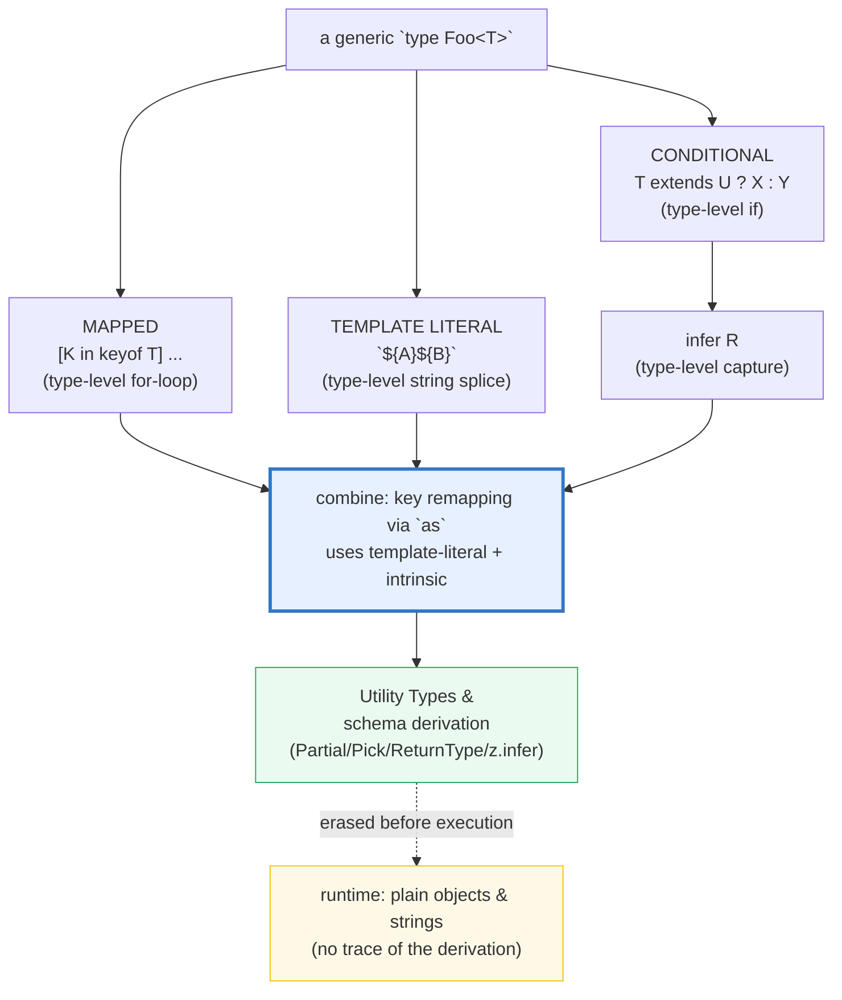

# MAPPED_CONDITIONAL_TYPES — TS's Compile-Time Programming Language

> **Goal (one line):** show, by `tsc`-verified `expectType<>`/`@ts-expect-error`
> compile-time proofs and a few `check()`'d runtime **erasure** facts, how
> **mapped** types (`[K in keyof T]`), **conditional** types
> (`T extends U ? X : Y`), **`infer`**, and **template literal** types
> (`` `${A}${B}` ``) turn TypeScript's type system into a small pure-functional
> *programming language* evaluated entirely at compile time — then erased.
>
> **Run:** `just run mapped_conditional_types`
>
> **Ground truth:** [`mapped_conditional_types.ts`](./core/mapped_conditional_types.ts)
> → captured stdout in
> [`mapped_conditional_types_output.txt`](./core/mapped_conditional_types_output.txt).
> Every value/table/check below is pasted **verbatim** from that file under a
> `> From mapped_conditional_types.ts Section X:` callout. Nothing is hand-computed.
>
> **Prerequisites:**
> - [`VALUES_TYPES_COERCION`](./VALUES_TYPES_COERCION.md) (P1) — TS types are
>   **erased** at runtime; `typeof` is a *runtime* operator. This bundle's few
>   `check()`s assert that erasure; the bulk of the evidence is *compile-time*.
> - [`INTERFACES_VS_ALIASES`](./INTERFACES_VS_ALIASES.md) (P2) — the `type` alias
>   is the *algebraic* keyword and the ONLY spelling for mapped/conditional types.
> - [`UNIONS_INTERSECTIONS`](./UNIONS_INTERSECTIONS.md) (P2) — conditional types
>   **distribute** over unions (Section B). Required reading for distributivity.

---

## 1. Why this bundle exists (lineage)

TypeScript's `type` alias is not just a name for a shape — it is the entry point
to a **type-level programming language**. Once you write a *generic* alias, four
constructs become available that have no runtime equivalent:

| Construct | Value-level analog | What it does at the type level |
|---|---|---|
| `[K in keyof T]: ...` | a `for...of` loop | iterate a type's keys, building a new object type |
| `T extends U ? X : Y` | a ternary `if` | branch on a subtype test |
| `infer R` | a `let` / pattern capture | bind a new type variable to matched structure |
| `` `${A}${B}` `` | a template string | splice literal-string types into new literals |

Together they let you **derive** a type from another type — and that is how every
**Utility Type** is implemented (`Partial`, `Pick`, `Omit`, `Record`,
`ReturnType` are all mapped or conditional types — Section E reimplements six of
them by hand). It is also the foundation of **schema→type derivation** (e.g.
`zod`'s `z.infer`, coming in Phase 6).



**The headline cross-language framing:** this is TypeScript's **"macro power."**
Rust achieves compile-time codegen two ways — **declarative** `macro_rules!`
(pattern → template) and **procedural** macros (functions over the syntax tree).
TS has *neither* runtime macros *nor* a syntax-tree API; its entire codegen power
lives **in the type checker** and is **erased** before execution:

> 🔗 [`../rust/MACRO_RULES.md`](../rust/MACRO_RULES.md) — Rust `macro_rules!` is
> the closest analog to a mapped type: a declarative pattern→template that expands
> at compile time. The difference: Rust macros generate *code* (functions, impls,
> constants); TS mapped types generate only *types* (shapes), never values.
>
> 🔗 [`../rust/PROC_MACROS.md`](../rust/PROC_MACROS.md) — Rust proc macros operate
> on the raw token stream and can do arbitrary computation (derive `Debug`,
> generate trait impls). TS has no procedural analog: there is no "derive a
> runtime validator from a type" without a *separate* schema library (zod), because
> the type itself evaporates at runtime.

> 🔗 [`UTILITY_TYPES`](./UTILITY_TYPES.md) — `Partial`, `Pick`, `Omit`, `Record`,
> `ReturnType`, `Exclude`, `Extract` are ALL mapped/conditional types defined in
> `lib.d.ts`. Section E reimplements six of them by hand to prove there is no
> magic.
>
> 🔗 [`GENERICS`](./GENERICS.md) — every mapped/conditional type is *generic*;
> the distribution behavior of Section B only triggers for a **naked** type
> parameter.
>
> 🔗 [`UNIONS_INTERSECTIONS`](./UNIONS_INTERSECTIONS.md) — conditional types
> *distribute* over unions (Section B); `Exclude` is a one-line distributive
> conditional.

---

## 2. Two axes of evidence (this bundle's specialty)

This bundle is **almost entirely compile-time**. The `.ts` uses two complementary
witnesses, both of which print a `[check]` line:

- **`expectType<Equal<Inferred, Expected>>("...")`** — a *compile-time gate*.
  `Equal<A,B>` is the canonical type-equality trick: it resolves to the literal
  `true` only when `A` and `B` are the **same** type, else `false`. `expectType`
  accepts only `true`, so if the claim is wrong, **`tsc` fails the build** before
  any code runs. At runtime it prints `[check] ... : OK`.
- **`// @ts-expect-error`** on a line that *should* error. `tsc` fails the build
  if such a directive is ever **unused** (i.e. the line stopped erroring) — so each
  one gates a *real* error, proving the type-level claim from the negative side.
- **`check(desc, ok)`** for the few *runtime-visible* facts — all of which assert
  **erasure** (a template-literal-typed value is a plain `string`; a mapped-type
  result is a plain object; `readonly` leaves no property-descriptor trace).

> **Determinism note (§4.2):** every value printed is fixed at author time — no
> `Math.random()`, no `Date.now()`, object keys are `sort()`ed before printing.
> Two consecutive `just out` runs produce byte-identical `_output.txt` (verified).

---

## 3. Section A — Mapped types: a type-level `for` loop over keys

A **mapped type** iterates `keyof T` and rewrites each property. The headline
form replaces every property's *value type* while preserving the *keys*:

```typescript
type Stringify<T> = { [K in keyof T]: string };
//   Stringify<{ a: number; b: boolean }>  ===  { a: string; b: string }
```

Read `[K in keyof T]` as "`for` each key `K` among `T`'s keys." The result is a
**brand-new object type** derived mechanically from the input. The `Equal<>`
trick pins that it is *identical* to the hand-written shape (not merely
assignable):

> From mapped_conditional_types.ts Section A:
> ```
> type Stringify<T> = { [K in keyof T]: string }
>   Stringify<{ a: number; b: boolean }>
>     -> { a: string; b: string }   (keys preserved, value type rewritten)
> [check] Stringify<{a:number;b:boolean}> === {a:string;b:string}: OK
>   const wrongValue: { a: number } = (Stringify result)  -> ERROR (string not number)
> ```

The `@ts-expect-error` line is the negative proof: the rewritten property is
`string`, so assigning the result to a `{ a: number }` slot is a real error.

### Mapping modifiers: `+`/`-readonly` and `+`/`-?`

The two property modifiers — `readonly` (mutability) and `?` (optionality) — can
be **added** (`+`, the default, usually omitted) or **removed** (`-`) during the
map. The `-` direction is the noteworthy one: it lets you *strip* a modifier,
which is exactly how `Mutable`/`Required` are built:

```typescript
type Mutable<T>    = { -readonly [K in keyof T]: T[K] };  // strip readonly
type Concrete<T>   = { [K in keyof T]-?: T[K] };          // strip optional
type ReadonlyAll<T>= { +readonly [K in keyof T]: T[K] };  // add readonly
type OptionalAll<T>= { [K in keyof T]+?: T[K] };          // add optional
```

> From mapped_conditional_types.ts Section A:
> ```
> type Mutable<T> = { -readonly [K in keyof T]: T[K] }
>   Mutable<{ readonly id: string }>
>     -> { id: string }   (readonly STRIPPED)
> [check] Mutable<{readonly id}> === {id} (readonly removed): OK
>   unlocked.id = 'y'  -> OK (Mutable stripped readonly)
>   locked.id = 'z'    -> ERROR (@ts-expect-error gate: readonly blocks it)
> [check] readonly leaves NO runtime trace: descriptor.writable !== false (it's a compile-time modifier): OK
> ```

**The expert payoff — `readonly` leaves NO runtime trace.** `readonly` is a
*compile-time* modifier: it emits no code and sets **no** `writable:false` on the
property descriptor. The runtime `check()` reads `Object.getOwnPropertyDescriptor`
and confirms `writable !== false` (it's `true`) — so `Mutable`'s "strip" is
removing a phantom. Contrast: assigning to `locked.id` (the readonly-typed
original) is a real compile error, gated by `@ts-expect-error`.

The same mechanic strips optionality (`-?`) — turning `name?` into `name`:

> From mapped_conditional_types.ts Section A:
> ```
> type Concrete<T> = { [K in keyof T]-?: T[K] }
>   Concrete<{ id: string; name?: string }>
>     -> { id: string; name: string }   (optionality STRIPPED)
> [check] Concrete<{id;name?}> === {id;name} (optional removed): OK
>   const missingName: RequiredUser = { id: '1' }  -> ERROR (name now required)
> [check] ReadonlyAll<{x}> === {readonly x}: OK
> [check] OptionalAll<{x}> === {x?}: OK
> ```
> ```
> type ReadonlyAll<T> = { +readonly [K in keyof T]: T[K] }  -> adds readonly
> type OptionalAll<T> = { [K in keyof T]+?: T[K] }          -> adds optional
>   (+ is the default; - is the noteworthy direction.)
> ```

The `@ts-expect-error` on `missingName` proves the optionality was genuinely
removed: a value missing `name` no longer satisfies the concrete type.

---

## 4. Section B — Conditional types: a type-level `if`, + distributivity

A **conditional type** mirrors a JS ternary — `T extends U ? TrueType : FalseType`
— and picks the branch by **assignability**: if `T` is assignable to `U`, the true
branch wins. The power comes from using it *inside a generic*, where TS defers the
branch until `T` is known:

```typescript
type IsString<T> = T extends string ? true : false;
//   IsString<"x"> === true ;  IsString<42> === false
```

> From mapped_conditional_types.ts Section B:
> ```
> type IsString<T> = T extends string ? true : false
>   IsString<"x">  -> true
>   IsString<42>   -> false
> [check] IsString<"x"> === true: OK
> [check] IsString<42> === false: OK
> ```

### Distributivity — the headline trap

When the **check type** (left of `extends`) is a **naked** type parameter (bare
`T`, not wrapped) and `T` is instantiated with a **union**, the conditional runs
**once per union member** and unions the results. So `ToArray<string | number>`
does **not** yield `(string | number)[]`; it distributes into
`ToArray<string> | ToArray<number>` = `string[] | number[]`:

> From mapped_conditional_types.ts Section B:
> ```
> type ToArray<T> = T extends unknown ? T[] : never   // NAKED T -> distributes
>   ToArray<string | number>
>     -> string[] | number[]   (NOT (string|number)[])
> [check] ToArray<string|number> distributes to string[] | number[]: OK
> ```

`string[] | number[]` is a **stricter** type than `(string | number)[]`: it
forbids a genuinely mixed array (one that contains both strings and numbers).
Distribution is usually what you want, because it preserves per-member precision.

**Disabling distribution:** wrap **both** sides of `extends` in a 1-tuple,
`[T] extends [unknown]`. The tuple is not a "naked" parameter, so the whole union
is tested at once and the result is the flat `(string | number)[]`:

> From mapped_conditional_types.ts Section B:
> ```
> type ToArrayNonDist<T> = [T] extends [unknown] ? T[] : never   // [T] -> no distribution
>   ToArrayNonDist<string | number>
>     -> (string | number)[]   (tested whole, NOT distributed)
> [check] ToArrayNonDist<string|number> === (string|number)[] (distribution disabled): OK
>   const mixed: (string|number)[] = [1,'a',2];
>   const asEither: string[]|number[] = mixed  -> ERROR (mixed array is neither all-string nor all-number)
> [check] MyExclude<"a"|"b"|"c", "b"> === "a"|"c" (distributive filter): OK
> ```

The `@ts-expect-error` on `asEither` is the runtime-visible consequence: a mixed
array `(string | number)[]` is **not** assignable to `string[] | number[]`.

### Why distribution matters: `Exclude` is a one-liner

Distribution + `never` = a **union filter**. `Exclude<U, M>` is literally
`U extends M ? never : U`: distribute over `U`, and any member assignable to `M`
collapses to `never` (which vanishes from a union), keeping only the rest:

> From mapped_conditional_types.ts Section B:
> ```
> type MyExclude<U, M> = U extends M ? never : U   // = the built-in Exclude
>   MyExclude<"a"|"b"|"c", "b">  -> "a" | "c"   (the "b" arm became never and vanished)
> ```

---

## 5. Section C — `infer`: a type-level capture (reimplement `ReturnType`)

The **payoff** of conditional types: in the true branch you can introduce a **new**
generic variable with `infer` and **bind** it to a piece of the matched structure.
`GetReturnType` matches "any function" and captures its return type as `R`:

```typescript
type GetReturnType<T> = T extends (...args: never[]) => infer R ? R : never;
//   GetReturnType<() => number>  ===  number
```

> **Why `never[]` and not `any[]`?** The official handbook spelling is
> `(...args: never[]) => infer R`. `never` is the bottom type (assignable to
> everything), so a function typed with `never[]` parameters accepts *any*
> argument list — while avoiding `any` entirely (this bundle's hard rule). This IS
> the implementation of the built-in `ReturnType<T>`.

> From mapped_conditional_types.ts Section C:
> ```
> type GetReturnType<T> = T extends (...args: never[]) => infer R ? R : never
>   GetReturnType<() => number>  -> number
> [check] GetReturnType<()=>number> === number: OK
> [check] hand-rolled GetReturnType === built-in ReturnType (identical): OK
> [check] GetReturnType<number> === never (number is not a function -> false branch): OK
>   GetReturnType<number>  -> never   (false branch: number is not callable)
> ```

The `Equal<GetReturnType<...>, ReturnType<...>>` proof is the headline: the
hand-rolled version and the built-in are **identical** — there is no magic in
`lib.d.ts`.

### `infer` inside any structure

`infer` works wherever the conditional can match a shape — arrays, tuples, and
generic wrappers. Each captures a different piece:

> From mapped_conditional_types.ts Section C:
> ```
> type ElementOf<T> = T extends (infer E)[] ? E : never
>   ElementOf<number[]>  -> number
>   ElementOf<string>    -> never   (string is not an array)
> [check] ElementOf<number[]> === number: OK
> [check] ElementOf<string> === never: OK
> ```
> ```
> type Unwrap<T> = T extends Promise<infer U> ? U : T
>   Unwrap<Promise<boolean>>  -> boolean
>   Unwrap<string>            -> string   (not a Promise -> passes through)
> [check] Unwrap<Promise<boolean>> === boolean: OK
> [check] Unwrap<string> === string (passthrough): OK
> ```

`Unwrap` is a minimal `Awaited` (🔗 `PROMISES` — the real `Awaited` recursively
unwraps nested `Promise<Promise<...>>`).

### Expert caveat — overloaded functions resolve against the LAST signature

From the handbook: when the source type has **multiple call signatures** (an
overloaded function), `infer` resolves against the **last** signature only —
"presumably the most permissive catch-all case." Overload resolution based on
argument types is **not** performed:

> From mapped_conditional_types.ts Section C:
> ```
> declare function overloaded(x: string): number;
> declare function overloaded(x: number): string;
> declare function overloaded(x: string|number): string|number;  // LAST signature
>   GetReturnType<typeof overloaded>  -> string | number   (picks the LAST signature)
> [check] infer on an overloaded fn picks the LAST signature -> string|number: OK
> [check] typeof fn === "function" (ReturnType/infer leave no runtime trace): OK
> [check] fn() === 42 (the captured return type was compile-time only): OK
> ```

The last two `check()`s restate erasure: `GetReturnType` and `infer` leave **no**
runtime trace — `fn` is a plain JS arrow function whose captured return type was a
compile-time phantom.

---

## 6. Section D — Template literal types + intrinsics + key remapping via `as`

**Template literal types** splice literal-string types with the *same* syntax as
JS template strings, but in **type position**. A union in a slot
**cross-multiplies** into the cartesian product of strings:

```typescript
type Greeting = `hello ${string}`;          // a PATTERN type
type Hello    = `hello ${"world"}`;         // === "hello world"
type Locale   = `${"en" | "ja"}_id`;        // === "en_id" | "ja_id"
```

> From mapped_conditional_types.ts Section D:
> ```
> [check] `hello ${"world"}` === "hello world": OK
> type Greeting = `hello ${string}`   (a PATTERN type)
> type Hello = `hello ${"world"}`     -> "hello world"
> [check] ..."hello world" matches `hello ${string}`: OK
> [check] ..."hi world" does NOT match the pattern: OK
> ```
> ```
> type Lang = "en" | "ja"
> type Locale = `${Lang}_id`   // union cross-multiplies
>   -> "en_id" | "ja_id"
> [check] `${"en"|"ja"}_id` === "en_id"|"ja_id": OK
> ```

### The four intrinsic string-manipulation types

Four **intrinsic** types — `Uppercase`, `Lowercase`, `Capitalize`,
`Uncapitalize` — are built into the compiler (they appear in **no** `.d.ts`) and
are **not locale-aware**. The handbook documents that they call the JS runtime
string methods directly:

```typescript
// compiler intrinsic `applyStringMapping` (paraphrased from the handbook):
//   Uppercase<S>    -> s.toUpperCase()
//   Lowercase<S>    -> s.toLowerCase()
//   Capitalize<S>   -> s.charAt(0).toUpperCase() + s.slice(1)
//   Uncapitalize<S> -> s.charAt(0).toLowerCase() + s.slice(1)
```

> From mapped_conditional_types.ts Section D:
> ```
> Intrinsic string types (compiler-built, NOT locale-aware):
> [check] Uppercase<"hello"> === "HELLO": OK
> [check] Lowercase<"HELLO"> === "hello": OK
> [check] Capitalize<"hello"> === "Hello": OK
> [check] Uncapitalize<"Hello"> === "hello": OK
> ```

### Key remapping via `as` (TS 4.1+)

Inside a mapped type, the key can be **renamed** with an `as` clause, usually
built from the old key via a template literal + an intrinsic. The canonical
`Getters<T>` turns each property into a `getX` accessor:

```typescript
type Getters<T> = {
  [K in keyof T as `get${Capitalize<string & K>}`]: () => T[K];
};
//   Getters<{ name: string; age: number }>
//     === { getName: () => string; getAge: () => number }
```

> From mapped_conditional_types.ts Section D:
> ```
> type Getters<T> = { [K in keyof T as `get${Capitalize<string & K>}`]: () => T[K] }
>   Getters<{ name: string; age: number }>
>     -> { getName: () => string; getAge: () => number }   (keys RENAMED)
> [check] Getters<{name;age}> renames keys to getName|getAge: OK
> [check] LazyPerson.getName () -> string (value type travels with the renamed key): OK
> [check] LazyPerson.getAge () -> number: OK
> ```

**Why `string & K`?** `keyof T` is `string | number | symbol`, but `Capitalize`
requires a `string`. The intersection `string & K` narrows to the string part of
`K`. The value type **travels with the renamed key** (`getName` still returns
`string`).

### Filtering via `as never`

A key whose `as` clause yields **`never`** is **dropped** from the result — a
type-level "delete a field." `Exclude<K, "kind">` in the `as` position makes the
`kind` key resolve to `never`:

> From mapped_conditional_types.ts Section D:
> ```
> type RemoveKind<T> = { [K in keyof T as Exclude<K, "kind">]: T[K] }
>   RemoveKind<{ kind: "circle"; radius: number }>
>     -> { radius: number }   ("kind" DROPPED via Exclude -> never)
> [check] RemoveKind drops the "kind" key -> {radius:number}: OK
> [check] typeof ev === "string" (template-literal type ERASES to a plain string): OK
> [check] ev === "valueChanged" (the literal value survives; only the TYPE vanished): OK
> ```
> ```
> const ev: `${string}Changed` = "valueChanged";
>   typeof ev -> "string"   (template-literal type erased at runtime)
> ```

**The headline erasure fact** (last two `check()`s): a value typed by a
template-literal type is a **plain `string`** at runtime. The fancy pattern type
is gone; only the literal value survives. This is *why* template-literal types
can refine string APIs (`on("firstNameChanged", ...)`) with zero runtime cost.

---

## 7. Section E — Putting it together: reimplement the Utility Types by hand

Every mechanism above is exactly how TS's own **Utility Types** are defined in
`lib.d.ts`. Reimplementing six of them by hand is the proof that there is no
magic — and each is proven `Equal<>` to its built-in counterpart:

| Hand-rolled | Definition | Built-in |
|---|---|---|
| `MyPartial<T>` | `{ [K in keyof T]+?: T[K] }` | `Partial<T>` |
| `MyRequired<T>` | `{ [K in keyof T]-?: T[K] }` | `Required<T>` |
| `MyReadonly<T>` | `{ readonly [K in keyof T]: T[K] }` | `Readonly<T>` |
| `MyPick<T,K>` | `{ [P in K]: T[P] }` (`K extends keyof T`) | `Pick<T,K>` |
| `MyRecord<K,V>` | `{ [P in K]: V }` (`K extends PropertyKey`) | `Record<K,V>` |
| `MyReturnType<T>` | `T extends (...args: never[]) => infer R ? R : never` | `ReturnType<T>` |

> From mapped_conditional_types.ts Section E:
> ```
> type MyPartial<T> = { [K in keyof T]+?: T[K] }
>   MyPartial<{ id; name; email }>
>     -> { id?: number; name?: string; email?: string }   (=== built-in Partial)
> [check] MyPartial<User> === Partial<User>: OK
> [check] MyPartial result is the all-optional shape: OK
> ```
> ```
> type MyRequired<T> = { [K in keyof T]-?: T[K] }
>   MyRequired<{ id: number; name?: string }>
>     -> { id: number; name: string }   (=== built-in Required)
> [check] MyRequired<{id;name?}> === Required<{id;name?}>: OK
> ```
> ```
> type MyReadonly<T> = { readonly [K in keyof T]: T[K] }
>   MyReadonly<User>  -> { readonly id; readonly name; readonly email }   (=== Readonly)
> [check] MyReadonly<User> === Readonly<User>: OK
> ```
> ```
> type MyPick<T, K extends keyof T> = { [P in K]: T[P] }
>   MyPick<User, "id" | "name">  -> { id: number; name: string }   (=== Pick)
> [check] MyPick<User,"id"|"name"> === Pick<User,"id"|"name">: OK
> [check] MyPick result is the projected subset: OK
> ```
> ```
> type MyRecord<K extends PropertyKey, V> = { [P in K]: V }
>   MyRecord<"a"|"b", number>  -> { a: number; b: number }   (=== Record)
> [check] MyRecord<"a"|"b",number> === Record<"a"|"b",number>: OK
> ```
> ```
> type MyReturnType<T> = T extends (...args: never[]) => infer R ? R : never
>   MyReturnType<() => User>  -> User   (=== ReturnType)
> [check] MyReturnType<()=>User> === ReturnType<()=>User>: OK
> [check] MyReturnType<()=>User> === User: OK
> ```
> ```
> CROSS-LANGUAGE: this is TS's compile-time codegen.
>   mapped   ~ a type-level `for` loop over keys
>   conditional ~ a type-level `if` (with union distribution)
>   infer    ~ a type-level `let`/capture
>   Rust analog: ../rust/MACRO_RULES.md (declarative) + ../rust/PROC_MACROS.md (procedural).
> [check] MyPartial<User> value is a plain object: keys === ["id"] (derivation erased): OK
> ```

The final `check()` restates the through-line: a value typed by a hand-rolled
mapped type is a **plain object** at runtime — the entire derivation left **zero**
trace. `Record<K,V>`'s constraint is `K extends keyof any` in `lib.d.ts` (which is
`string | number | symbol`, i.e. `PropertyKey`); this bundle spells it
`PropertyKey` to avoid even the *appearance* of `any`.

---

## 8. Pitfalls (the expert payoff)

| Trap | Symptom | Fix |
|---|---|---|
| **Distributive surprise** — `ToArray<string\|number>` yields `string[] \| number[]`, not `(string\|number)[]` | A type that "looks like an array of the union" is actually a union of arrays; a mixed array won't assign. | If you want the flat form, disable distribution: `[T] extends [unknown] ? T[] : never`. |
| **`infer` on an overloaded function picks the LAST signature** | `ReturnType<typeof overloadedFn>` returns the *catch-all* return, not the per-overload one. | Don't expect per-argument resolution; split the overloads, or model them as a union of distinct function types. |
| **Naked-vs-wrapped parameter decides distribution** | `[T] extends [X]` (no distribution) vs `T extends X` (distributes) look almost identical but behave differently on unions. | Be deliberate: use the naked form for filtering (Exclude), the tuple form when you mean "the whole union." |
| **`Capitalize<K>` requires `K` to be `string`** | `[K in keyof T as \`get${Capitalize<K>}\`]` errors because `keyof T` is `string\|number\|symbol`. | Intersect: `Capitalize<string & K>`. |
| **`keyof any` vs `keyof unknown`** | `Record<K,V>`'s real constraint is `K extends keyof any` (= `string\|number\|symbol`); writing `keyof unknown` gives `never` and rejects every key. | Use `PropertyKey` (= `string \| number \| symbol`) — same type, no `any` in sight. |
| **Intrinsics are NOT locale-aware** | `Uppercase<"ı">` (Turkish dotted-i) does not produce `"I"` per Turkish locale rules; it uses the JS runtime `String.prototype.toUpperCase()` default. | Do not rely on locale-specific casing in the type system; normalize at runtime if locale matters. |
| **Deep / infinite recursion errors** | `Type instantiation is excessively deep and possibly infinite.` on a recursive conditional. | Make the recursive branch **tail-recursive** (immediately return the self-call); TS 4.5+ eliminates such forms. Otherwise thread an accumulator type parameter. |
| **`never` silently drops keys** | A key-remap `as` clause yielding `never` removes the key — sometimes unintentionally. | Confirm each `as` branch's reachable outputs; use `Exclude`/`Extract` deliberately. |
| **Mapped types preserve modifiers by default** | `{ [K in keyof T]: ... }` keeps `readonly`/`?` from `T`'s keys; forgetting `-readonly`/`-?` leaves them attached. | Explicitly add `-readonly` / `-?` when you mean to strip them. |
| **All of this is ERASED** | `typeof` on a template-literal-typed value is `"string"`; a mapped-type result is a plain object; `readonly` sets no `writable:false`. | There is **no** runtime type info. To validate at runtime you need a *schema* (zod, io-ts) — the type only guides the compiler. |

---

## 9. Cheat sheet

```typescript
// === MAPPED type (type-level for-loop over keys) ===========================
//   type Stringify<T> = { [K in keyof T]: string }
//   modifiers:  +readonly / -readonly   (add / strip readonly)
//               +?       / -?           (add / strip optional)
//   type Mutable<T>  = { -readonly [K in keyof T]: T[K] }   // = Required<T> w/o ?
//   type Concrete<T> = { [K in keyof T]-?: T[K] }           // = Required<T>

// === CONDITIONAL type (type-level if) ======================================
//   type IsString<T> = T extends string ? true : false
//   DISTRIBUTIVITY (naked T over a union):
//     type ToArray<T> = T extends unknown ? T[] : never
//     ToArray<string|number> === string[] | number[]   (NOT (string|number)[])
//   DISABLE with a 1-tuple:
//     type ToArrayNonDist<T> = [T] extends [unknown] ? T[] : never
//     ToArrayNonDist<string|number> === (string|number)[]
//   FILTER a union (Exclude is a distributive conditional):
//     type Exclude<U, M> = U extends M ? never : U

// === infer (type-level capture) ============================================
//   type GetReturnType<T> = T extends (...args: never[]) => infer R ? R : never
//     // (...args: never[]) — never is the bottom type, accepts any arg list, no `any`
//     // === built-in ReturnType<T>
//   type ElementOf<T> = T extends (infer E)[] ? E : never
//   type Unwrap<T>    = T extends Promise<infer U> ? U : T
//   CAVEAT: on an OVERLOADED fn, infer resolves against the LAST signature only.

// === TEMPLATE LITERAL types (type-level string splice) =====================
//   type Greeting = `hello ${string}`            // a PATTERN type
//   type Locale   = `${"en"|"ja"}_id`            // cross-multiplies -> "en_id"|"ja_id"
//   intrinsics (compiler-built, NOT locale-aware):
//     Uppercase<"hi">==="HI"  Lowercase<"HI">==="hi"
//     Capitalize<"hi">==="Hi" Uncapitalize<"Hi">==="hi"
//   KEY REMAPPING via `as` (TS 4.1+):
//     type Getters<T> = { [K in keyof T as `get${Capitalize<string & K>}`]: () => T[K] }
//   FILTER keys: an `as` clause yielding `never` DROPS the key:
//     type RemoveKind<T> = { [K in keyof T as Exclude<K, "kind">]: T[K] }

// === Utility Types are just the above (reimplemented by hand = built-in) ====
//   Partial<T>     { [K in keyof T]+?: T[K] }
//   Required<T>    { [K in keyof T]-?: T[K] }
//   Readonly<T>    { readonly [K in keyof T]: T[K] }
//   Pick<T,K>      { [P in K]: T[P] }                  // K extends keyof T
//   Record<K,V>    { [P in K]: V }                     // K extends PropertyKey
//   ReturnType<T>  T extends (...args: never[]) => infer R ? R : never

// === ERASURE (the through-line) =============================================
//   typeof (a template-literal-typed value) === "string"   // pattern type gone
//   a mapped-type result is a PLAIN OBJECT at runtime      // derivation gone
//   readonly sets NO writable:false on the descriptor      // modifier gone
//   => runtime validation needs a SCHEMA (zod), not the type system.
```

---

## Sources

Every signature, behavioral claim, and worked example above was verified against
the official TypeScript Handbook, then corroborated by the TS release notes (for
the tail-recursion and key-remapping version pins). Every **type-level** claim is
*additionally* asserted at compile time by the `.ts` itself (`expectType<>` fails
the `tsc` build on any mismatch; every `@ts-expect-error` gates a real error) —
and the few **runtime** claims are asserted by `check()` (which throws on
mismatch). The strongest possible verification: the actual `tsc` checker's verdict.

**Primary — TypeScript Handbook (typescriptlang.org/docs/handbook/2/):**
- **Mapped Types** (`[Property in keyof Type]`; mapping modifiers `readonly`/`?`
  with `+`/`-`; key remapping via `as`; filtering by producing `never`; the
  `Getters`/`RemoveKindField` examples used verbatim in Sections A & D):
  https://www.typescriptlang.org/docs/handbook/2/mapped-types.html
- **Conditional Types** (`T extends U ? X : Y`; conditional type constraints;
  `infer` within conditional types — the `Flatten`/`GetReturnType` examples;
  **distributive conditional types** and how to disable them with `[T] extends [any]`):
  https://www.typescriptlang.org/docs/handbook/2/conditional-types.html
- **Template Literal Types** (string-literal concatenation; union
  cross-multiplication; the `makeWatchedObject`/`on` inference example; the four
  **intrinsic string manipulation types** `Uppercase`/`Lowercase`/`Capitalize`/
  `Uncapitalize` — *not locale-aware*, *built into the compiler*, with the
  `applyStringMapping` source showing they call the JS runtime string methods):
  https://www.typescriptlang.org/docs/handbook/2/template-literal-types.html

**Primary — TypeScript Release Notes (version pins):**
- **TypeScript 4.1 — Key Remapping in Mapped Types** (the `as` clause, the
  `Getters` example, filtering via `never`):
  https://www.typescriptlang.org/docs/handbook/release-notes/typescript-4-1.html
- **TypeScript 4.5 — Tail-Recursion Elimination in Conditional Types** (quoted
  verbatim: *"TypeScript 4.5 performs some tail-recursion elimination on
  conditional types. As long as one branch of a conditional type is simply another
  conditional type, TypeScript can avoid intermediate instantiations"*; the
  `TrimLeft` example and the `GetChars` non-tail-recursive vs accumulator
  contrast, cited in the pitfalls table):
  https://www.typescriptlang.org/docs/handbook/release-notes/typescript-4-5.html
- **TypeScript 2.8 — Conditional & Mapped Types** (the original release of
  conditional types + `infer` + distributivity):
  https://www.typescriptlang.org/docs/handbook/release-notes/typescript-2-8.html

**Primary — Utility Types reference (lib.d.ts spellings):**
- **TypeScript Handbook — Utility Types** (`Partial`, `Required`, `Readonly`,
  `Pick`, `Record`, `ReturnType`, `Exclude` — each shown in Section E to be
  exactly the mapped/conditional definition reimplemented by hand):
  https://www.typescriptlang.org/docs/handbook/utility-types.html

**Secondary corroboration (independent of the handbook):**
- Microsoft DevBlogs — *"Announcing TypeScript 4.5"* (the tail-recursion
  optimization for conditional types, with the depth-limit motivation):
  https://devblogs.microsoft.com/typescript/announcing-typescript-4-5/#tail-recursion-elimination-on-conditional-types
- type-fest `IsEqual` / the community type-equality idiom (the
  `(<T>() => T extends A ? 1 : 2)` trick used by `expectType<>`, adopted by
  type-fest, tsd, effect, io-ts):
  https://github.com/sindresorhus/type-fest/blob/main/source/is-equal.d.ts

**Facts that could not be verified by running** (documented, not executed,
because they are compiler-internal or design-time facts): the intrinsic string
types' non-locale-awareness and their mapping to `String.prototype.toUpperCase()`
/ `toLowerCase()` / `charAt(0)…slice(1)` are quoted from the handbook's
`applyStringMapping` listing (compiler source, not runnable from a `.ts`); the
tail-recursion-elimination heuristic and its depth limits are a compiler
behavior, documented in the TS 4.5 release notes rather than observable from a
single run. Every *type-level result* they produce, however, IS asserted here by
`expectType<>` against `tsc`'s own resolution — so the behavioral claims are
verified even where the mechanism is not.
