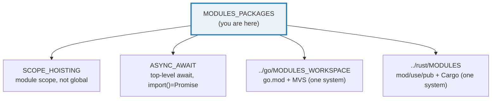
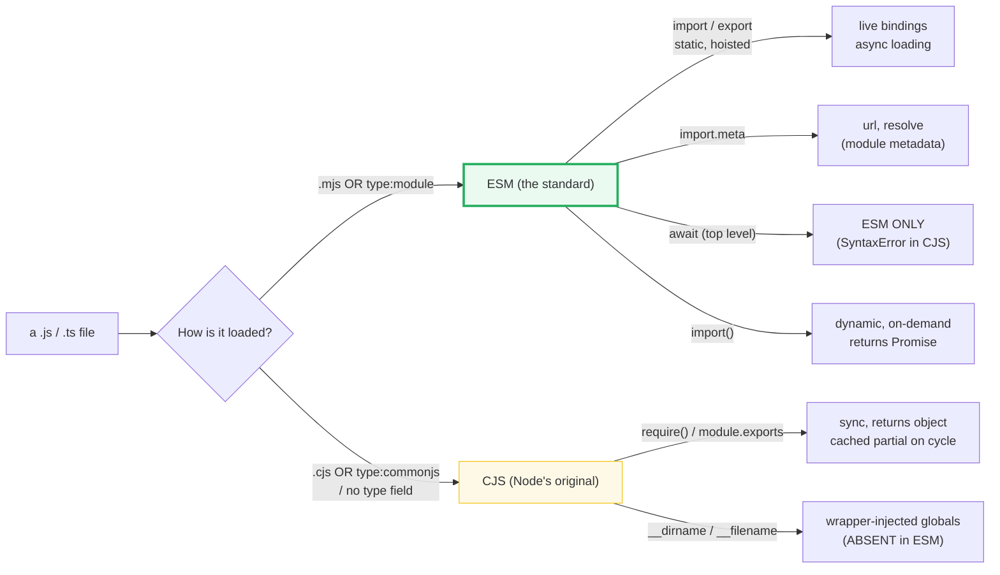
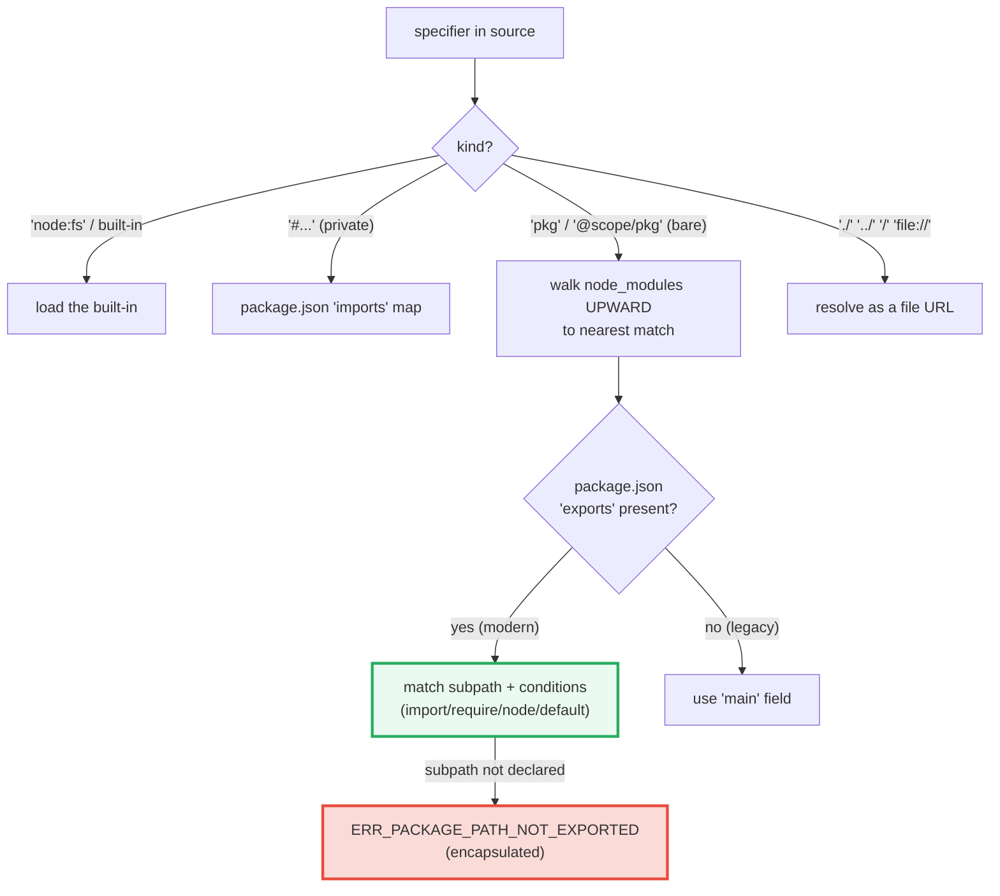

# MODULES_PACKAGES — ESM vs CommonJS, `import.meta`, `import()`, and Node Resolution

> **Goal (one line):** show, by printing every value, how JS's two module
> systems (ESM vs CommonJS) are detected, how Node resolves bare specifiers
> through `package.json` `"exports"`/`"imports"`, what `import.meta` exposes,
> and how dynamic `import()` + top-level `await` behave — pinning each as a
> `check()`'d invariant.
>
> **Run:** `just run modules_packages`
>
> **Ground truth:** [`core/modules_packages.ts`](./core/modules_packages.ts)
> → captured stdout in
> [`core/modules_packages_output.txt`](./core/modules_packages_output.txt).
> Every value/table below is pasted **verbatim** from that file under a
> `> From modules_packages.ts Section X:` callout. Nothing is hand-computed.
>
> **Prerequisites:** 🔗 [`SCOPE_HOISTING`](./SCOPE_HOISTING.md) (module scope —
> top-level `var` is module-scoped, not global, in ESM) and
> 🔗 [`ASYNC_AWAIT`](./ASYNC_AWAIT.md) (top-level `await`; dynamic `import()`
> returns a `Promise`). This is Phase 5 (Standard Library Essentials).

---

## 1. Why this bundle exists (lineage)

JavaScript lived with **two module systems** for a decade, and that dualism is
the single biggest source of interop pain in the ecosystem:

- **CommonJS (CJS)** — Node's original (2009). Synchronous: `require()` returns
  `module.exports` (a single mutable object) *the instant it runs*, and the
  CommonJS module wrapper injects `__dirname`/`__filename`/`require`/`module`/
  `exports` as locals. Designed for servers; loads are blocking.
- **ES Modules (ESM)** — the language standard (ES2015 spec, Node 12+ shipped
  unflagged in 13.2). Static: `import`/`export` are hoisted and statically
  analyzable (enabling tree-shaking, cyclical *live bindings*, and
  `import.meta`). `import()` is the dynamic, async, on-demand form that returns
  a `Promise`. Top-level `await` is ESM-only.

**ESM won the standard war, but CJS cannot be removed** — the entire `npm`
back-catalog is CJS. So Node supports both, and decides *per file* which system
applies via the `package.json` `"type"` field and the `.mjs`/`.cjs` extensions.
Resolution of bare specifiers (`import "zod"`) changed too: the modern
`"exports"` field (Node 12.7+) is **encapsulating** — only declared entry points
are public — and works alongside the private `"imports"` (`#`-prefixed) map and
the legacy `"main"`/`node_modules` walk.

This bundle is the cross-language analog of:

> 🔗 [`../go/MODULES_WORKSPACE.md`](../go/MODULES_WORKSPACE.md) — Go has **one**
> module system built on `go.mod` + **MVS** (Minimal Version Selection): a
> deterministic resolution over a version *graph* (not a `node_modules` *tree*).
> No dual CJS/ESM, no `__dirname`, no interop shims. MVS picks the *minimum*
> version satisfying every requirement.
>
> 🔗 [`../rust/MODULES.md`](../rust/MODULES.md) — Rust has **one** module system:
> `mod`/`use`/`pub` building a **static** tree with **explicit visibility**
> (`pub`, `pub(crate)`), and Cargo for crates. The compiler builds the whole
> tree upfront — no runtime `require`/`import` duality, no "which system is
> this file?" question.



---

## 2. The mental model: two systems, one decision per file

Every `.js`/`.ts` file in Node is evaluated as **exactly one** of CJS or ESM.
Node decides which by a deterministic lookup (extension first, then the nearest
`package.json` `"type"`). The two systems differ in *every* axis that matters:



**The headline contrast with Go/Rust:** neither has a "module-system decision."
Go files are always Go modules; Rust files are always part of one Cargo crate
tree. JS pays for a decade of history with a per-file branch and a pile of
interop rules (Section D). The payoff of ESM is static analysis (tree-shaking,
live bindings, cyclical safety) and a standard that runs in browsers *and* Node.

> **`package.json` and file extensions** (Node docs, verbatim rule): `.mjs` is
> **always** ESM; `.cjs` is **always** CJS; a `.js` file takes the system of the
> nearest parent `package.json` `"type"` field (`"module"` → ESM,
> `"commonjs"`/absent → CJS). This bundle lives in `core/`, whose
> `package.json` is `"type": "module"` — so `modules_packages.ts` **is ESM**,
> and every ESM-only feature below (`import.meta`, top-level `await`,
> `import * as`) is live proof of that.

---

## 3. Section A — ESM syntax (`import`/`export`) + `import.meta.url`

ESM offers **named** exports (zero or more per module), **one default** export
(optional), and **namespace** imports (`import * as`). The single-file rule
forbids creating a sibling `.ts`, so the syntax→binding mapping is printed
here and the bindings are exercised on a `data:` URL module in Section B.

> From modules_packages.ts Section A:
> ```
> ESM import forms and what each binds:
>   import { v }      from "./m.js"   // named import   -> binding "v"
>   import def        from "./m.js"   // default import -> def === m.default
>   import * as ns    from "./m.js"   // namespace      -> ns.v, ns.default
>   import { v as x } from "./m.js"   // aliased named  -> binding "x"
>   import "./m.js"                   // side-effect only (no bindings)
> 
> ESM export forms:
>   export const v = 1;     // named export
>   export default 42;      // default export (at most ONE per module)
>   export { a, b };        // named export list (can be re-exported)
>   export * from "./m.js"; // re-export all named (collisions -> SyntaxError)
> 
> import.meta (this bundle's own metadata):
>   import.meta.url = file:///Volumes/data/workspace/tutorials/ts/core/modules_packages.ts
>   parsed.protocol = file:
>   parsed.pathname = /Volumes/data/workspace/tutorials/ts/core/modules_packages.ts
> [check] import.meta.url starts with 'file://': OK
> [check] import.meta.url contains stem 'modules_packages': OK
> [check] URL protocol is 'file:': OK
> [check] URL pathname ends with 'modules_packages.ts': OK
> [check] import.meta.url is a defined string (ESM-only metadata present): OK
> ```

> **Path note:** the absolute path in `import.meta.url` / `parsed.pathname` is
> **environment-specific** (it is this machine's checkout location). The
> *invariants* — the `file://` scheme, and that the URL contains the file's own
> stem — are universal and are exactly what the path-free `[check]` lines
> assert. Re-running `just run modules_packages` on any machine re-asserts them.

**`import.meta` is ESM-only metadata.** Per MDN, `import.meta` is *"an extensible
null-prototype object"* the host creates; its spec-mandated property is `.url`
(the full module URL — in Node, a `file://` path; in a browser, the script's
URL). Using `import.meta` outside a module is a **`SyntaxError`** — so its very
presence in this output is proof the bundle runs as ESM. Node ≥ 20.6 also exposes
the synchronous `import.meta.resolve` (Section E).

**Named vs default — the rule that prevents 90% of import bugs:** a module has
any number of named exports (`export const v`, `export function f`) but at most
one `default`. The import syntax mirrors the export: `import { v }` for named,
`import anything` (no braces) for default, and `import * as ns` for the whole
namespace object (which *also* has a `.default` key equal to the default export).
A `data:` URL module in Section B makes all three observable.

> 🔗 [`SCOPE_HOISTING`](./SCOPE_HOISTING.md) — every ESM file is its own
> **module scope**: a top-level `var` in a module is *not* a global (unlike a
> classic `<script>`), and `import` bindings live in module scope as live,
> read-only references. This bundle relies on that scoping; `SCOPE_HOISTING`
> explains the TDZ/hoist mechanics underneath.

---

## 4. Section B — Dynamic `import()` (async, on-demand) + top-level await

`import()` is the **runtime** import: an expression usable anywhere (not just
module top level), returning a `Promise` to the module namespace. It enables
on-demand loading and code-splitting. Because the single-file rule forbids a
sibling `.ts`, the demo uses a **`data:` URL** — a real, resolvable ES module
whose source *is* the URL — plus a dynamic import of a built-in.

> From modules_packages.ts Section B:
> ```
> data URL module specifier (a real ES module whose source IS the URL):
>   data:text/javascript,export const v = 42; export default 'def'; export const named = 7;
> [check] import(specifier) returns a Promise (it is async): OK
> 
> const m = await import(dataUrl)  — the resolved module namespace:
>   m.v       = 42        (matches: import { v } from ...)
>   m.default = "def"     (matches: import def from ...)
>   m.named   = 7        (matches: import { named } from ...)
> [check] data-URL dynamic import: m.v === 42 (named export): OK
> [check] data-URL dynamic import: m.default === 'def' (default export): OK
> [check] data-URL dynamic import: m.named === 7 (named export): OK
> [check] namespace object exposes v/default/named keys: OK
> 
> Dynamic import of a built-in (bare specifier -> built-in resolution):
>   const p = await import('node:path');   p.sep = "/"
> [check] dynamic import of 'node:path' resolves (bare -> built-in): OK
> [check] dynamic import('node:path') and static import 'node:path' agree: OK
> 
> Top-level await (ESM only — SyntaxError in CJS):
>   At the TOP LEVEL of this file (outside any function):
>   const TLA = (await import("data:...export const top = 99;")) as { top: number };
>   TLA.top reached main(): 99
> [check] top-level await resolved TLA.top === 99 (ESM-only feature works): OK
> ```

**`import()` is async by construction** — the first `[check]` proves
`import(specifier) instanceof Promise`. The await then yields the module
namespace object; `m.v`/`m.default`/`m.named` map exactly onto
`import { v }` / `import def` / `import { named }`. The second demo
(`import('node:path')`) shows the **bare-specifier → built-in** path of the
resolution walk (Section E): `node:` specifiers skip `node_modules` entirely.

**Top-level `await` is ESM-only.** The bundle uses it *twice* at module scope —
once to load `{ top: 99 }` into `TLA` before `main()` runs, and once to
`await main()`. In CommonJS, `await` outside an `async` function is a
`SyntaxError`; this output is therefore impossible under CJS. (Node's
*syntax-detection* feature lists *"await at the top level of a module"* as ESM
syntax that flips an ambiguous file to ESM.)

> 🔗 [`ASYNC_AWAIT`](./ASYNC_AWAIT.md) — the deep mechanics of `async`/`await`
> (microtask scheduling, the `Promise` state machine). Top-level `await` is the
> module-system extension: the module's evaluation *itself* becomes async, and
> importers block on its settlement. Dynamic `import()` is just
> `ASYNC_AWAIT`'s `Promise` returned by the module loader.

---

## 5. Section C — CommonJS vs ECMAScript Modules (how Node decides)

The two systems side by side, and the deterministic rule Node uses to pick one:

> From modules_packages.ts Section C:
> ```
> Two module systems coexist in Node:
> 
>   CJS (CommonJS — Node's original):
>     const fs = require('node:fs');          // synchronous, returns module.exports
>     module.exports = { x: 1 };              // a single mutable exports object
>     exports.y = 2;                          // shorthand for module.exports.y
>     __dirname, __filename                   // CJS-wrapper globals (sync, paths)
> 
>   ESM (ECMAScript Modules — the standard):
>     import fs from 'node:fs';               // static, hoisted, async-loaded
>     export const x = 1; export default 42;  // named + default (live bindings)
>     import.meta                             // per-module metadata (url, resolve)
>     await ...                               // top-level await (ESM ONLY)
> 
> Determining the module system (Node 'Determining module system'):
>   .mjs                              -> ALWAYS ESM (extension wins)
>   .cjs                              -> ALWAYS CJS (extension wins)
>   .js + nearest pkg 'type':'module'  -> ESM    <-- THIS bundle (core/ is type:module)
>   .js + nearest pkg 'type':'commonjs'-> CJS
>   .js + no 'type' field              -> CJS by default (syntax detection may flip it)
> 
> Runtime evidence that THIS bundle is evaluated as ESM:
>   typeof globalThis.__dirname  = undefined   (CJS-only global; absent in ESM)
>   typeof globalThis.__filename = undefined   (CJS-only global; absent in ESM)
>   typeof import.meta.url       = string   (ESM-only metadata)
> [check] __dirname is undefined in ESM (CJS-only global, absent): OK
> [check] __filename is undefined in ESM (CJS-only global, absent): OK
> [check] import.meta.url is defined (ESM metadata present): OK
> [check] core/ package.json type:module => this .ts evaluates as ESM: OK
> ```

**The decision is deterministic and per-file.** Node looks at the file
**extension** first (`.mjs`/`.cjs` always win), then at the **nearest parent**
`package.json` `"type"` (`"module"` → ESM for `.js`; `"commonjs"` or absent →
CJS). Since Node 22.7, an *ambiguous* `.js` (no controlling `package.json`)
gets **syntax-detection**: Node tries CJS first, and if the parser finds ESM
syntax (`import`, `export`, `import.meta`, top-level `await`, …) it re-evaluates
as ESM. Being explicit (`"type": "module"`) avoids the perf cost and is the
recommended practice.

**Runtime fingerprint of ESM.** The CommonJS module wrapper injects
`__dirname`/`__filename`/`require`/`module`/`exports` as locals; ESM has **none**
of them. So `typeof globalThis.__dirname === "undefined"` is a clean ESM
fingerprint, and the presence of `import.meta.url` is the matching ESM positive.
The bundle reaches `__dirname`/`__filename` through `globalThis` (cast to a
`Record`) only to *read* their absence — referencing them directly would be a
`ReferenceError` at runtime and a TS "cannot find name" at compile time, because
they are not in the ESM global type.

---

## 6. Section D — CJS/ESM interop + the `__dirname`/`__filename` fix

The bridge between the two systems goes both ways, and the rules are asymmetric:

> From modules_packages.ts Section D:
> ```
> createRequire(import.meta.url) — a CJS require() usable inside ESM:
>   const r = createRequire(import.meta.url);
>   r('node:path').sep       = "/"
>   r('node:path').delimiter = ":"
> [check] CJS require (via createRequire) returns path.sep: OK
> [check] CJS require (via createRequire) returns path.delimiter: OK
> 
> Interop rule — importing a CJS module FROM ESM:
>   import cjsDefault from './legacy.cjs'   // cjsDefault === module.exports (the WHOLE object)
>   import { named }   from './legacy.cjs'  // named may be UNDEFINED: CJS has no real
>                                           //  named exports; Node static-analysis
>                                           //  ('cjs-module-lexer') guesses them.
>   => Prefer the default import for CJS modules; destructure AFTERWARD if needed.
> 
> Reconstructing __dirname/__filename in ESM (fileURLToPath + path.dirname):
>   fileURLToPath(import.meta.url) = /Volumes/data/workspace/tutorials/ts/core/modules_packages.ts
>   path.dirname(...)              = /Volumes/data/workspace/tutorials/ts/core
>   path.basename(filename)        = modules_packages.ts
>   path.basename(dirname)         = core
> [check] reconstructed filename ends with 'modules_packages.ts': OK
> [check] reconstructed dirname basename is 'core': OK
> [check] filename === path.join(dirname, path.basename(filename)) (round-trip): OK
> ```

**ESM → CJS via `createRequire`.** `module.createRequire(import.meta.url)` builds
a real CommonJS `require()` anchored at this module's URL, so an ESM file can
load any CJS module synchronously. The reverse direction (CJS → ESM) is also
possible since Node 22.12 via `require()` of an ES module — but only if that
module graph contains **no top-level `await`**.

**CJS → ESM is the trap.** Importing a CJS module *from* ESM maps the entire
`module.exports` object onto the ESM **default** import. Named imports
(`import { x }`) work only when Node's static analyzer (`cjs-module-lexer`) can
*see* them as properties of `module.exports` — and it is a **best-effort guess**.
For any non-trivial CJS module, `import { named }` may silently be `undefined`.
The safe idiom is `import cjsDefault from './legacy.cjs'` then destructure
afterward.

**The `__dirname`/`__filename` fix.** Because those CJS-wrapper globals are
absent in ESM (Section C), the standard reconstruction is
`fileURLToPath(import.meta.url)` → `path.dirname(...)`. The last three `[check]`
lines prove the round-trip: the reconstructed `filename` is exactly
`path.join(dirname, basename)`. Node ≥ 20.11 also offers
`import.meta.dirname` / `import.meta.filename` directly, but
`fileURLToPath` + `path.dirname` remains the portable, universal idiom.

---

## 7. Section E — Node resolution (`exports`/`imports`) + circular imports + cross-lang

Modern bare-specifier resolution is driven by the `package.json` **`"exports"`**
field (encapsulating) and the **`"imports"`** field (`#`-prefixed, private), with
the `node_modules` upward walk and legacy `"main"` as fallbacks.



> From modules_packages.ts Section E:
> ```
> Bare specifier resolution walk (Node, modern algorithm):
>   1. Built-in?         ('node:fs', 'fs', 'path') -> load the built-in.
>   2. Starts with '#'?  -> consult package.json 'imports' (PRIVATE map).
>   3. Bare package?     ('zod', '@scope/pkg') -> walk node_modules UPWARD
>                           to the nearest match, then:
>        a. read its package.json 'exports' (modern, ENCAPSULATING field);
>        b. match subpath + conditions (import / require / node / default);
>        c. fall back to legacy 'main' if 'exports' is absent.
>   4. Relative/absolute?('./', '../', '/', 'file://') -> resolve as a file URL.
>      (ESM import does NOT add extensions or resolve directory indexes.)
> 
> package.json 'exports' — subpaths + conditions (modern, encapsulating):
>   "exports": {
>     ".":        { "import": "./esm/index.mjs", "require": "./cjs/index.cjs" },
>     "./feature": "./feature.js",
>     "./internal/*": null
>   }
>   -> import 'pkg'            resolves via '.' using condition 'import'.
>   -> import 'pkg/feature'    resolves via './feature'.
>   -> import 'pkg/internal/x' THROWS ERR_PACKAGE_PATH_NOT_EXPORTED (null target).
>   -> import 'pkg/secret.js'  THROWS (encapsulated: only declared paths are public).
> 
> package.json 'imports' — PRIVATE self-map (must start with '#'):
>   "imports": { "#dep": { "node": "dep-native", "default": "./polyfill.js" } }
>   -> import '#dep'  (valid ONLY inside this package; maps per condition).
> 
> Specifier kinds:
>   bare:      'zod', 'node:fs', '@scope/pkg'    (resolved, not a path)
>   relative:  './m.js', '../util.js'            (relative to importer)
>   absolute:  '/abs/m.js', 'file:///abs/m.js'   (URL or root path)
> 
> import.meta.resolve (Node >= 20.6, synchronous):
>   Resolves a specifier to a URL using THIS module's URL as base.
>   import.meta.resolve('node:fs')               = node:fs
>   import.meta.resolve('./modules_packages.ts') = file:///Volumes/data/workspace/tutorials/ts/core/modules_packages.ts
> [check] import.meta.resolve('node:fs') returns a non-empty string: OK
> [check] import.meta.resolve('node:fs') yields a 'node:' URL: OK
> [check] import.meta.resolve('./modules_packages.ts') yields a 'file:' URL: OK
> [check] resolved self URL contains the stem 'modules_packages': OK
> 
> Circular imports (the dual-system gotcha):
>   ESM: LIVE BINDINGS — a partially-initialized module IS visible to
>         its importer. The imported binding exists from the start; its
>         value may be undefined until the cycle finishes initializing.
>         Mutations through the binding are seen live (no snapshot).
>   CJS: module.exports is a cached PARTIAL object at cycle time. A
>         require() that hits a cycle returns whatever was on
>         module.exports at that instant; properties added LATER may
>         be missed depending on import order. The classic CJS trap.
> 
> Cross-language parallels (design contrasts, not executed here):
>   Go  modules + go.mod: MVS (Minimal Version Selection) selects the
>         MINIMUM version that satisfies all requirements over a version
>         graph. Deterministic, no node_modules tree, no dual system.
>   Rust mod/use/pub + Cargo: a STATIC module tree with EXPLICIT
>         visibility (pub / pub(crate)). One system; the compiler
>         builds the whole tree; no require/import duality, no interop.
> ```

**`"exports"` is encapsulating.** Once a package declares `"exports"`, *only* the
declared subpaths (`"."`, `"./feature"`, patterns) are importable from outside;
any other path (`pkg/secret.js`) throws `ERR_PACKAGE_PATH_NOT_EXPORTED`. This is
the public-API contract modern packages enforce. Condition keys
(`import`/`require`/`node`/`default`) are matched **in declaration order, most
specific first**, and `import`/`require` are mutually exclusive. A `null` target
explicitly *denies* a subpath (used to carve holes out of `*` patterns).

**`"imports"` is the private mirror.** Entries **must** start with `#` (to
disambiguate from package names) and are resolvable **only from within the same
package** — ideal for abstracting an internal dependency behind a condition
(`"node"` → native, `"default"` → polyfill) without exposing it.

**`import.meta.resolve` (Node ≥ 20.6)** is the *synchronous* specifier resolver:
given a specifier, it returns the fully-resolved URL string using the current
module's URL as base. (Earlier Node returned a `Promise`; the sync form is now
stable.) The `[check]`s prove a built-in resolves to a `node:` URL and a
relative path to a `file:` URL.

**Circular imports — the dual-system payoff.** ESM's **live bindings** mean a
partially-initialized module *is* visible to its importer: the binding exists
from evaluation start (its value may be `undefined` until the cycle completes),
and mutations are seen live — no snapshot. CJS instead returns a **cached
partial** `module.exports` at the cycle point, so properties added *later* may be
invisible depending on import order. This is why ESM cycles are far safer, and
why migrating a tangled CJS codebase to ESM often *fixes* latent cycle bugs.

---

## 8. Pitfalls (the expert payoff)

| Trap | Symptom | Fix |
|---|---|---|
| `import { named } from './legacy.cjs'` is `undefined` | CJS has no real named exports; `cjs-module-lexer` only *guesses* them | `import cjsDefault from './legacy.cjs'` then destructure; or migrate the dep to ESM. |
| `__dirname` / `__filename` ReferenceError in an ESM file | They are CJS-wrapper globals, **absent in ESM** | `fileURLToPath(import.meta.url)` + `path.dirname`; or Node ≥ 20.11 `import.meta.dirname`/`.filename`. |
| `await x` at module top level throws `SyntaxError` | Top-level `await` is **ESM-only** | Ensure `"type": "module"` (or `.mjs`); in CJS wrap in an `async` IIFE / function. |
| `import './m'` (no extension) fails with `ERR_UNKNOWN_FILE_EXTENSION` | ESM import does **not** add extensions or resolve directory indexes (CJS `require` did) | Always write the full specifier: `import './m.js'`. |
| `import 'pkg/internal'` throws `ERR_PACKAGE_PATH_NOT_EXPORTED` | `"exports"` is **encapsulating** — only declared subpaths are public | Add the subpath to `"exports"`, or import via a declared entry. |
| `import pkg from 'pkg'` then `pkg.named` is missing | Default import of a CJS pkg = whole `module.exports`; ESM named exports best-effort | Use default import; or check the pkg ships real ESM (`"type": "module"` / `.mjs`). |
| `import.meta.resolve` was a `Promise`, now a `string` | Behavior changed across Node versions (sync + stable since Node 20.6) | Treat it as sync (Node ≥ 20.6); guard `typeof === 'function'` for older runtimes. |
| Two `.js` files in the same `node_modules` resolve as different systems | Each file follows its **nearest** `package.json` `"type"` | Be explicit with `"type"`; use `.mjs`/`.cjs` to mix systems within one package. |
| CJS circular import returns a partial `module.exports` | `require()` caches the object at cycle time; later props may be missing | Refactor the cycle; or migrate to ESM (live bindings make cycles safe). |
| `require(esm)` throws `ERR_REQUIRE_ASYNC_MODULE` | CJS `require` is sync; an ESM graph with top-level `await` can't be required | Use `await import()` instead; or remove top-level `await` from that graph. |
| TypeScript: `import("data:...")` errors `TS2307 Cannot find module` | A **string literal** directly in `import()` is resolved for types | Put the specifier in a `const` variable → `import()` returns `Promise<any>`; then narrow with `as`. |
| Ambiguous `.js` file flips system via syntax detection (perf cost) | No `"type"` field → Node tries CJS, re-tries as ESM if it sees ESM syntax | Always set `"type"` in `package.json` (even `"commonjs"`), per Node docs. |

---

## 9. Cheat sheet

```typescript
// === Module-system decision (per file, deterministic) ======================
//   .mjs                              -> ALWAYS ESM
//   .cjs                              -> ALWAYS CJS
//   .js + pkg "type":"module"          -> ESM      (core/ is this)
//   .js + pkg "type":"commonjs"/absent -> CJS (default; syntax-detection may flip)

// === CJS vs ESM ============================================================
//   CJS:  require('x') / module.exports / exports.y  (sync, returns object)
//         __dirname, __filename  (wrapper globals; ABSENT in ESM)
//   ESM:  import x from 'x' / export { y } / export default  (static, hoisted)
//         import.meta.url  (file:// URL of THIS module; ESM-only)
//         await ...        (top-level await: ESM ONLY, SyntaxError in CJS)
//         import(spec)     (dynamic; returns Promise; on-demand/code-split)

// === import forms -> bindings ==============================================
//   import { v }      from './m.js'   // named
//   import def        from './m.js'   // default  (def === namespace.default)
//   import * as ns    from './m.js'   // namespace (ns.v, ns.default)
//   import './m.js'                   // side-effect only (no bindings)

// === __dirname/__filename fix for ESM ======================================
//   import { fileURLToPath } from 'node:url';
//   import path from 'node:path';
//   const __filename = fileURLToPath(import.meta.url);   // reconstruction
//   const __dirname  = path.dirname(__filename);
//   // Node >= 20.11 also exposes import.meta.dirname / import.meta.filename

// === ESM -> CJS bridge =====================================================
//   import { createRequire } from 'node:module';
//   const require = createRequire(import.meta.url);   // real CJS require in ESM

// === CJS -> ESM interop (the trap) =========================================
//   import cjsDefault from './legacy.cjs'   // cjsDefault === module.exports (whole)
//   import { named }  from './legacy.cjs'   // named may be UNDEFINED (best-effort)
//   => default-import CJS, then destructure.

// === Bare specifier resolution (Node, modern) ==============================
//   1. built-in? ('node:fs') -> built-in
//   2. '#...'?               -> package.json "imports" (PRIVATE, self-only)
//   3. 'pkg' / '@scope/pkg'  -> node_modules upward walk -> "exports" subpath
//                               + conditions (import/require/node/default);
//                               fall back to legacy "main"
//   4. './' '../' '/' 'file://' -> resolve as file URL (NO ext/index auto-add)
//   "exports" is ENCAPSULATING: undeclared subpath -> ERR_PACKAGE_PATH_NOT_EXPORTED

// === Circular imports ======================================================
//   ESM: LIVE BINDINGS — partial module visible; binding may be undefined
//        until cycle completes; mutations seen live (no snapshot).
//   CJS: cached partial module.exports at cycle time; later props may be missed.

// === import.meta.resolve (Node >= 20.6, synchronous) ======================
//   import.meta.resolve('node:fs')               // -> 'node:fs'  (string)
//   import.meta.resolve('./m.js')                 // -> 'file:///.../m.js'
```

---

## Sources

Every behavioral claim above was verified against the MDN Web Docs and the
Node.js documentation, then corroborated by independent secondary sources. The
deterministic invariants (module-system decision, `import.meta.url` shape,
dynamic-`import()` result, `__dirname` absence, resolution outputs) are
*additionally* asserted at runtime by the `.ts` itself (`check()` throws on any
mismatch) — the strongest possible verification: the actual Node/V8 engine's
verdict.

- **MDN — JavaScript modules** (ESM guide: `import`/`export`, named vs default,
  static vs dynamic, `import.meta`, cycles):
  https://developer.mozilla.org/en-US/docs/Web/JavaScript/Guide/Modules
- **MDN — `import` statement** (named/default/namespace/side-effect forms;
  hoisting; live bindings):
  https://developer.mozilla.org/en-US/docs/Web/JavaScript/Reference/Statements/import
- **MDN — `export` statement** (named, default, re-export; at most one default):
  https://developer.mozilla.org/en-US/docs/Web/JavaScript/Reference/Statements/export
- **MDN — `import.meta`** (null-prototype object; `.url` is the module URL — in
  Node a `file://` path; `import.meta` outside a module is a `SyntaxError`):
  https://developer.mozilla.org/en-US/docs/Web/JavaScript/Reference/Operators/import.meta
- **MDN — `import()` (dynamic import)** (returns a `Promise`; on-demand; the
  only `import` form valid in CommonJS):
  https://developer.mozilla.org/en-US/docs/Web/JavaScript/Reference/Operators/import
- **Node.js — Modules: Packages** ("Determining module system": `.mjs`/`.cjs`/
  `"type"` rules; syntax detection; `"exports"` subpaths, conditions,
  encapsulation; `"imports"` `#` map; self-referencing):
  https://nodejs.org/api/packages.html
- **Node.js — Modules: ECMAScript modules** (`import.meta.url`, mandatory file
  extensions, no directory-index resolution, `createRequire`, JSON/assertions,
  top-level await, circular-import live bindings):
  https://nodejs.org/api/esm.html
- **Node.js — Modules: CommonJS modules** (`require`, `module.exports`,
  `exports` shorthand, `__dirname`/`__filename` wrapper globals, cycles):
  https://nodejs.org/api/modules.html
- **Node.js — `module.createRequire(filename)`** (the ESM→CJS bridge):
  https://nodejs.org/api/module.html#modulecreaterequirefilename
- **ECMAScript® 2027 Language Specification (tc39.es/ecma262)**:
  - `import.meta` (ImportMeta): https://tc39.es/ecma262/multipage/ecmascript-language-expressions.html#prod-ImportMeta
  - Dynamic `import()`:
    https://tc39.es/ecma262/multipage/ecmascript-language-expressions.html#sec-import-calls
  - Modules, Static Semantics, live bindings:
    https://tc39.es/ecma262/multipage/ecmascript-language-scripts-and-modules.html
- **TypeScript Handbook — Modules reference** (`NodeNext`; how `import`/`export`
  and CommonJS interop are typed; `import.meta` typing):
  https://www.typescriptlang.org/docs/handbook/modules/reference.html

**Secondary corroboration (independent of MDN/Node docs, ≥1 per major claim):**
- Sonar — *"`__dirname` is back in Node.js with ES Modules"* (the
  `fileURLToPath(import.meta.url)` + `path.dirname` reconstruction; Node ≥ 20.11
  `import.meta.dirname`): https://www.sonarsource.com/blog/dirname-node-js-es-modules/
- Evert Pot — *"Supporting CommonJS and ESM with TypeScript and Node"* (the
  `import`/`require` conditional exports pattern; dual-package authoring):
  https://evertpot.com/universal-commonjs-esm-typescript-packages/
- AppSignal — *"A Deep Dive Into CommonJS and ES Modules in Node.js"* (CJS
  `require`/`module.exports` mechanics; interop default = `module.exports`):
  https://blog.appsignal.com/2024/12/11/a-deep-dive-into-commonjs-and-es-modules-in-nodejs.html
- TypeScript TV — *"`__dirname` is not defined in ES module scope"* (the ESM
  fingerprint; `fileURLToPath` fix; native `import.meta.dirname`):
  https://typescript.tv/new-features/dirname-is-not-defined-in-es-module-scope

**Facts that could not be verified by running** (documented, not executed,
because they are package-authoring or cross-runtime design facts): the exact
`ERR_PACKAGE_PATH_NOT_EXPORTED` / `ERR_REQUIRE_ASYNC_MODULE` error names come
from the Node docs (not thrown by this single-file bundle, which imports only
built-ins and `data:` URLs); the `cjs-module-lexer` named-export detection
behavior is a Node-internal static-analysis step (observed only by importing a
real CJS file, which the single-file rule forbids); and the cross-language
contrasts (Go MVS, Rust `mod`/`use`/`pub`) are language-design facts documented
in [`../go/MODULES_WORKSPACE.md`](../go/MODULES_WORKSPACE.md) and
[`../rust/MODULES.md`](../rust/MODULES.md). Every *runtime* claim above is
asserted by a `[check]` in the `.ts`.
