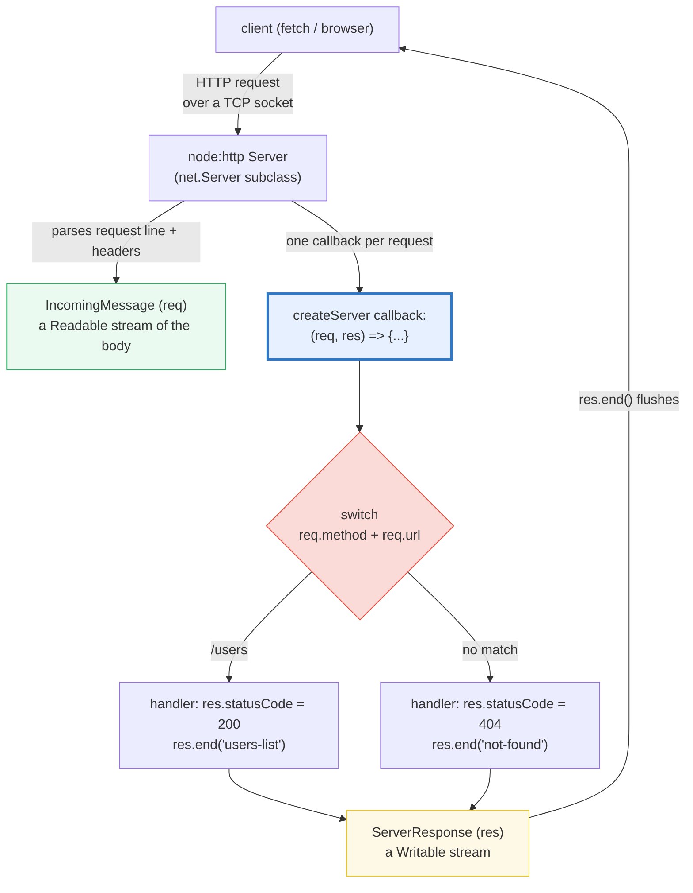
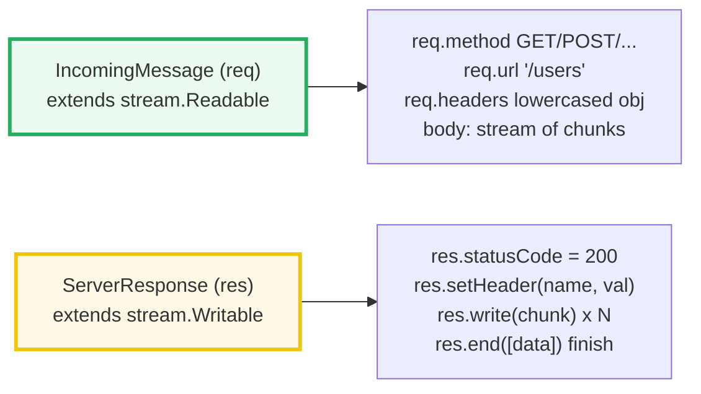
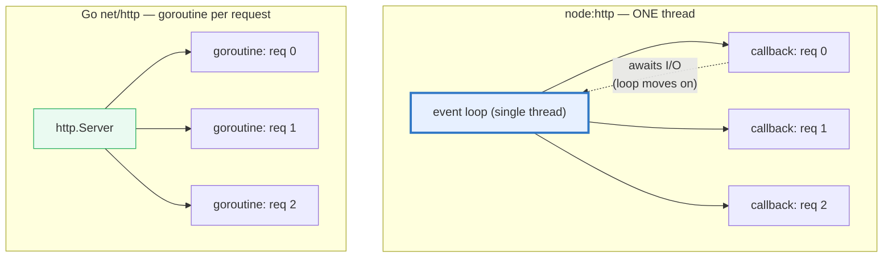

# NODE_HTTP_SERVER — `node:http`'s `createServer((req, res) => {...})`

> **Goal (one line):** show, by spinning up a real `node:http` server on an
> **ephemeral port (0)** and firing self-requests at it, that
> `http.createServer((req, res) => {...})` is the lowest-level HTTP server in
> Node — one callback per request where `req` (`IncomingMessage`) is a **Readable
> stream** of the request and `res` (`ServerResponse`) is a **Writable stream**
> for the response — pinning routing, the body-stream read, the chunked write,
> header lowercasing, status codes, graceful `server.close()`, and the
> one-thread concurrency model as `check()`'d invariants.
>
> **Run:** `just run node_http_server`
>
> **Ground truth:** [`web/node_http_server.ts`](./web/node_http_server.ts) →
> captured stdout in
> [`web/node_http_server_output.txt`](./web/node_http_server_output.txt). Every
> number/table below is pasted **verbatim** from that file under a
> `> From node_http_server.ts Section X:` callout. Nothing is hand-computed.
>
> **Prerequisites:** 🔗 [`EVENT_LOOP`](./EVENT_LOOP.md) (the single-threaded loop
> that dispatches each `(req, res)` callback) and 🔗 [`STREAMS`](./STREAMS.md)
> (`req`/`res` *are* the legacy Node stream API).

---

## 1. Why this bundle exists (lineage)

`node:http`'s `createServer((req, res) => {...})` is the **substrate** every
Node web framework builds on. Express / Hono / Fastify (🔗 `REST_API`) add a
**router** (method + path matching with params) and a **middleware chain** *on
top of* this exact callback; under the hood each request still arrives as one
`(req, res)` pair dispatched by the event loop. Doing it by hand teaches the
three things a framework hides from you:

1. **Routing** — `node:http` ships **no router**. You `switch` on `req.method` +
   `req.url` yourself. (Go's `net/http` has the same shape: a `Handler` fn + a
   `ServeMux` you register patterns on — 🔗 [`../go/NET_HTTP.md`](../go/NET_HTTP.md),
   the model.)
2. **Streaming** — `req` is a **Readable stream** (the body arrives in chunks)
   and `res` is a **Writable stream** (you `.write()` chunks, then `.end()`).
   Nothing is buffered for you. (🔗 [`STREAMS`](./STREAMS.md) — `req`/`res` *are*
   the legacy Node stream API; the web-streams standard is the modern sibling.)
3. **The event loop** — one thread dispatches every `(req, res)` callback. There
   is **no thread-per-request** (that is Go's goroutine-per-request, or the
   classic Apache worker-pool). Node scales via **non-blocking I/O**: while one
   request waits on a socket read, the loop serves the next.



The headline cross-language contrast is the whole point of this bundle:

> 🔗 [`../go/NET_HTTP.md`](../go/NET_HTTP.md) — Go's `net/http` is the **model**
> Node's `node:http` approximates: a `Handler(w http.ResponseWriter, r
> *http.Request)` function plus a `ServeMux` you register patterns on (`mux.
> HandleFunc("/users", h)`). The shape is identical to `(req, res) => {}`; the
> difference is that Go runs **each request on its own goroutine** (true
> parallelism), while Node runs **every callback on one thread**.
>
> 🔗 [`../rust/AXUM.md`](../rust/AXUM.md) — Rust's `axum` builds on `hyper`:
> handlers take **typed extractors** (`async fn handler(State(db): State<Db>,
> Path(id): Path<u32>) -> impl IntoResponse`) enforced at **compile time**, far
> richer than `node:http`'s raw, untyped `req`/`res` streams. The compiler proves
> your routing + body parsing; Node defers all of that to runtime.

---

## 2. The mental model: the `(req, res)` callback is the whole server

`http.createServer(requestListener)` returns an `http.Server` (itself a subclass
of `net.Server`). The `requestListener` is `(req, res) => {...}` — invoked
**once per request**, on the event loop's main thread. Node parses the request
**line + headers** for you and hands them as properties; it deliberately does
**not** parse the body (you stream it yourself) and ships **no** router.



> From the Node.js docs (`node:http`): *"The `IncomingMessage` object is created
> by `http.Server` or `http.ClientRequest` and passed as the first argument to
> the `'request'` and `'response'` events respectively. It ... **extends
> `stream.Readable`** ... to parse and emit the incoming HTTP headers and
> payload."* And: *"Keys are lowercased. Values are not modified."* — so
> `req.headers` is a plain object whose keys are always lowercase, regardless of
> how the client cased them.

**Determinism contract for this bundle.** Every server below listens on **port
0** (the OS assigns an *ephemeral* port — never printed, so output is stable
across runs). Each section makes a **self-contained request** via the global
`fetch` (Node ≥18, backed by undici), **asserts** status / headers / body (never
timings), then `server.close()` + `server.closeAllConnections()` + `await`
before returning — so the process drains fully and exits 0.

---

## 3. Section A — `createServer`: `IncomingMessage` (req) + `ServerResponse` (res)

The round-trip: a self-request returns the status + headers + body the handler
wrote, and the handler observes the method / url / header the client sent.

> From node_http_server.ts Section A:
> ```
> http.createServer((req, res) => {...}) -> an http.Server;
> server.listen(0) bound to an EPHEMERAL port (the number is
> OS-assigned and intentionally NOT printed, for determinism).
> 
> What the HANDLER saw (IncomingMessage):
>   req.method                          = "GET"
>   req.url                             = "/"
>   req.headers["x-demo"]               = "hello"
> 
> What the CLIENT saw (the Response we built with ServerResponse):
>   res.statusCode  -> response.status  = 200
>   res.setHeader("Content-Type"...)    = "text/plain"
>   res.end(body)    -> response.text() = "hello-from-server"
> [check] req.method === "GET": OK
> [check] req.url === "/": OK
> [check] req.headers["x-demo"] === "hello" (header round-trips): OK
> [check] res.statusCode 200 round-trips to response.status: OK
> [check] setHeader("Content-Type") round-trips: OK
> [check] res.end(body) round-trips verbatim: OK
> [check] server closed (section A teardown): OK
> ```

**Why the handler's observations are safe to read *after* `await fetch`.**
`fetch` only resolves once the **full** response body has arrived — and the body
only arrives once the handler called `res.end()`. So by the time `await
response.text()` returns, the handler has *already* run and written
`seen.method`/`seen.url`/`seen.xdemo`. This is the value-vs-reference axis in
miniature: the closure captures `seen` **by reference** (🔗
`VALUE_VS_REFERENCE`), so mutations the handler makes are visible to the outer
async function.

> 🔗 [`FETCH_HTTP_CLIENT`](./FETCH_HTTP_CLIENT.md) (planned) — the *client* half.
> This bundle uses `fetch` only as a test harness; the deep dive on `fetch`,
> `AbortController`, and connection pooling is its own bundle.

---

## 4. Section B — Hand routing (method + url switch) + status codes

`node:http` ships **no router**. Routing is a hand-rolled `switch` on
`req.method` + `req.url` — exactly what Express/Hono/Fastify replace with a
path-matcher. Status codes are set by assigning `res.statusCode` (201 Created,
404 Not Found, …).

> From node_http_server.ts Section B:
> ```
> No built-in router: a switch on req.method + req.url is the
> whole routing layer. Each branch sets res.statusCode + body.
> 
> route                   -> status  body
> -----------------------   ------   -----------
> GET  /users             ->   200     "users-list"
> GET  /posts             ->   200     "posts-list"
> POST /users             ->   201     "created"
> GET  /nope (fallthrough)->   404     "not-found"
> [check] GET /users -> 200 "users-list": OK
> [check] GET /posts -> 200 "posts-list" (different route, different body): OK
> [check] POST /users -> 201 "created" (method distinguishes from GET /users): OK
> [check] GET /nope -> 404 "not-found" (no match -> fallthrough): OK
> [check] server closed (section B teardown): OK
> ```

**`req.url` is the *raw* target — path *and* query string, unparsed.** For
`GET /users?active=1`, `req.url` is the *whole string* `"/users?active=1"`. There
is no `req.path` / `req.query` on `IncomingMessage` — you parse them yourself
(historically with the legacy `node:querystring`, today with `new
URL(req.url, "http://x").searchParams`). The `GET /users` vs `POST /users`
distinction proves routing keys on **both** method and path: the same URL returns
200 for GET and 201 for POST.

**The 404 is just a fallthrough.** Nothing in `node:http` enforces that unmatched
routes return 404 — *you* set `res.statusCode = 404` in the `default` branch. A
framework makes that declarative (`app.get('/users', h)` + automatic 404); here
it is a literal `if`/`else`.

---

## 5. Section C — Request body (`req` is a Readable stream) + streaming the response

Two streams in one callback. (1) **Reading** the body: `req` is a **Readable
stream** — the body is *not* handed to you whole; you collect `data` chunks and
reassemble on `end`. (2) **Writing** the response: `res.write(chunk)` may be
called **many times** before `res.end()` — this is how large files and
Server-Sent Events stream without buffering the whole payload in memory.

> From node_http_server.ts Section C:
> ```
> req is a Readable STREAM: the POST body arrives as `data` chunks,
> assembled on `end`. res is a Writable STREAM: res.write() can be
> called many times before res.end() — that is response streaming.
> 
> POST /echo with body "ping" -> streamed response:
>   full response body = "chunk1\nchunk2\nechoed:ping"
>   split on "\n"      = ["chunk1", "chunk2", "echoed:ping"]
>   (chunk1 and chunk2 were two separate res.write() calls; the
>    final line is res.end() with the echoed request body.)
> [check] request body read from the req stream and echoed: OK
> [check] response was STREAMED (>=2 res.write() chunks before end): OK
> [check] streamed response reassembles to the exact bytes: OK
> [check] server closed (section C teardown): OK
> ```

**Worked example — reading a POST body.** The handler does the canonical
three-step dance:

```typescript
const chunks: Buffer[] = [];
req.on("data", (chunk: Buffer) => chunks.push(chunk)); // accumulate
req.on("end", () => {                                   // body fully read
  const received = Buffer.concat(chunks).toString("utf8");
  res.write("chunk1\n"); res.write("chunk2\n");          // stream the reply
  res.end("echoed:" + received);                         // finish
});
```

`req` is in **Buffer mode** (object mode off), so each `data` chunk is a
`Buffer`; `Buffer.concat(chunks)` reassembles them into the original bytes. The
mirror image on the response side — two `res.write()` calls plus a final
`res.end(data)` — produces exactly `"chunk1\nchunk2\nechoed:ping"`. **You must
read the request body** even if you don't care about it: an unread body keeps the
socket busy and (without `closeAllConnections`) can hang a graceful shutdown.

> 🔗 [`STREAMS`](./STREAMS.md) — the modern **Web Streams** standard
> (`ReadableStream`/`WritableStream`) is the promise-based sibling of this
> legacy `EventEmitter` API. `req`/`res` here are the *legacy* Node streams
> (`'data'`/`'end'` events); the two interoperate via `Readable.toWeb()` /
> `Writable.fromWeb()`.

---

## 6. Section D — Headers (case-insensitive) + graceful `server.close()` + errors

Three production concerns in one section.

> From node_http_server.ts Section D:
> ```
> Header NAMES are lowercased by Node: a client's `X-Mixed-Case`
> is read as req.headers["x-mixed-case"]; the original-case key
> is absent. HTTP field names are case-insensitive (RFC 9110).
> 
>   sent header "X-Mixed-Case: works":
>     req.headers["x-mixed-case"]   = "works"
>     req.headers["X-Mixed-Case"]   = "absent" (original case NOT stored)
>     res.setHeader round-trip      = "resp"
> [check] incoming header name lowercased: "x-mixed-case" === "works": OK
> [check] original-case key "X-Mixed-Case" is absent (Node lowercases): OK
> [check] outgoing res.setHeader round-trips to the client: OK
> 
>   GET /broken (handler throws, caught -> 500):
>     status = 500  body = "error-caught"
> [check] caught throw in handler -> 500 (recommended pattern): OK
> [check] server still serves after an in-handler error (no crash): OK
> 
>   graceful close: server.close() + closeAllConnections() + await
>     server.listening before close = true
>     server.listening after  close = false
> [check] server.listening === false after graceful close: OK
> ```

**Headers: Node lowercases the *names*, leaves the *values* untouched.** A client
sending `X-Mixed-Case: works` is read at `req.headers["x-mixed-case"] ===
"works"`; the original-case key `"X-Mixed-Case"` is **absent** from the object.
This is deliberate: HTTP field names are case-insensitive (RFC 9110 §5.1), and
HTTP/2 (RFC 9113) *mandates* lowercase on the wire. So always look headers up by
lowercase name — never by the casing you think you sent.

**Graceful close — and why `closeAllConnections()` exists.** `server.close()`
*stops accepting new connections* and resolves once all *current* ones have
drained. But `fetch`/undici **pool** connections (keep-alive): an idle keep-alive
socket will sit open until the `keepAliveTimeout`, making `close()` hang. That is
exactly the bug `server.closeAllConnections()` (added **Node v18.2.0**) fixes —
it force-closes every socket so `close()` resolves promptly. This bundle's
`stop()` helper calls `close()` *then* `closeAllConnections()`, mirroring the
Node docs' recommendation, so the process exits 0 every run.

**Error handling — catch *in* the handler.** A `throw` inside the request
listener must be caught **there** (the production pattern: `try { … } catch {
res.statusCode = 500; res.end(…) }`). An **uncaught** throw destroys *that one
socket* but does **not** crash the server — Node isolates request failures. The
second check proves it: after `/broken` returns 500, a normal request still gets
200. (Executing the uncaught-throw path would emit nondeterministic `stderr`
noise, so this bundle documents it rather than running it.)

---

## 7. Section E — http2 (brief) + the non-blocking one-thread-scales model

> From node_http_server.ts Section E:
> ```
> http2 — the binary-framed, multiplexed sibling of node:http:
>   typeof http2.createServer       = function
>   typeof http2.createSecureServer = function
>   (h2 runs over TLS in production via createSecureServer; a single
>    TCP connection multiplexes many concurrent streams.)
> [check] typeof http2.createServer === "function": OK
> [check] typeof http2.createSecureServer === "function": OK
> 
> Non-blocking I/O on ONE thread: fire 3 requests CONCURRENTLY
> (Promise.all). The single-threaded loop interleaves them; none
> blocks another. (Contrast: Go spawns a goroutine per request.)
> 
> 3 concurrent requests, response bodies (sorted):
>   "r:/0"
>   "r:/1"
>   "r:/2"
> [check] all 3 concurrent requests resolved: OK
> [check] every concurrent request got 200: OK
> [check] concurrent bodies are exactly {r:/0, r:/1, r:/2}: OK
> 
> Cross-language (the model Node's http approximates):
>   Go     net/http : a Handler(w, r) fn + a ServeMux you register
>                     patterns on — the CLEANEST stdlib HTTP model.
>                     Each request runs on its own goroutine.
>   Rust   hyper/axum: axum builds on hyper — a typed, extractive
>                     model (handlers take typed extractors) far
>                     richer than node:http's raw req/res streams.
>   Node   node:http: one (req,res) callback per request, dispatched
>                     on the single-threaded event loop (no goroutine).
> [check] cross-language HTTP model summarized: OK
> [check] server closed (section E teardown): OK
> ```

**http2 in brief.** `http2.createSecureServer` (h2 over TLS — the production
case) and `http2.createServer` (plaintext "h2c", mostly for testing) are the
binary-framed, multiplexed siblings of `http.createServer`. HTTP/2 multiplexes
many concurrent streams over a **single** TCP connection (eliminating
head-of-line blocking) and compresses headers with HPACK. This bundle verifies
the API surface but does **not** run a live h2 server: TLS cert setup + an h2
client would add nondeterminism without teaching more than the `req`/`res` model
already does. (In practice you almost never hand-roll h2; a framework or a
reverse proxy terminates it.)

**The scaling model — one thread, non-blocking I/O.** The three concurrent
requests all resolve 200 because the event loop **interleaves** them on a single
thread: while request `/0` waits on its socket write, the loop is already reading
`/1`'s socket. No new thread is spawned per request. This is the opposite of:



Node's bet: most web work is **I/O-bound** (waiting on a DB / another HTTP
service / a socket), so a single thread with non-blocking I/O + a tiny pool of
libuv worker threads (for the few CPU/blocking ops like `fs` and `crypto.pbkdf2`)
scales further per megabyte of RAM than a thread-per-request model. The catch: a
single **synchronous CPU-heavy** callback blocks the *entire* server (🔗
`EVENT_LOOP` — that is why CPU work goes to `worker_threads`).

---

## 8. Pitfalls (the expert payoff)

| Trap | Symptom | Fix |
|---|---|---|
| Expecting a router / body parser | `req.url` is the raw `"/users?a=1"`; no `req.path`/`req.query`; body never arrives | Parse with `new URL(req.url, "http://x")` + `.searchParams`; read the body from the `req` stream (or use a framework — 🔗 `REST_API`). |
| Not reading the request body | Socket stays busy; `server.close()` hangs on keep-alive; backpressure stalls | Always consume `req` (or `req.resume()` to drain-and-discard); pair `close()` with `closeAllConnections()`. |
| Header lookup with wrong casing | `req.headers["Content-Type"]` is `undefined` (Node lowercased it) | Always read lowercase: `req.headers["content-type"]`. (RFC 9110: field names are case-insensitive.) |
| `res.end()` forgotten | Response never flushes; client hangs until timeout | Every code path must reach `res.end()`. Set `res.statusCode` *before* headers are sent (`res.writeHead` or before the first `res.write`). |
| `res.write` / `setHeader` after `res.end` or after headers sent | `ERR_HTTP_HEADERS_SENT` / silent no-op | `res.end()` is terminal. Track `res.headersSent` / `res.writableEnded`. |
| `throw` uncaught in the handler | Socket destroyed (client gets `ECONNRESET`), confusing logs | Catch **in** the handler (`try/catch -> 500`). Register `server.on("error", …)` for listen-time errors (`EADDRINUSE`). |
| `server.close()` never resolves | Process hangs on shutdown (idle keep-alive sockets) | Call `closeAllConnections()` (Node ≥18.2) after `close()`, or rely on Node ≥19 (idle conns closed before `close` returns). |
| Fixed port in tests | `EADDRINUSE` flakiness / sibling-process collision | Listen on **port 0** (ephemeral); read the real port from `server.address().port`. |
| Blocking the event loop in a handler | **All** other requests stall until it returns | Offload CPU work to `worker_threads`; keep handlers I/O-bound and `await`-driven. |
| Assuming thread-per-request safety | Shared mutable state races across concurrent callbacks | Single thread = no data races *on JS values*, but **interleaving** bugs still bite (a callback mutates state mid-`await`). 🔗 `CONCURRENCY_PATTERNS`. |
| Multiple `Set-Cookie` collapse to one | `req.headers["set-cookie"]` is a `string[]`, not a string | Type-narrow: `Array.isArray(req.headers["set-cookie"])`; or read `rawHeaders`. |

---

## 9. Cheat sheet

```typescript
// === The whole server =====================================================
//   import http from "node:http";
//   const server = http.createServer((req, res) => { /* one per request */ });
//   server.listen(0);                       // port 0 = OS ephemeral (tests!)
//   server.close();                         // stop accepting; resolves when drained
//   server.closeAllConnections();           // Node >=18.2 — force-close sockets
//   server.on("error", (e) => { /* EADDRINUSE etc. */ });

// === req: IncomingMessage (extends stream.Readable) ========================
//   req.method          // "GET" | "POST" | ...            (string | undefined)
//   req.url             // "/users?active=1" — RAW, unparsed (no req.path/query)
//   req.headers         // { lowercased-name: "value" }    names ALWAYS lowercase
//   req.headers["set-cookie"]  // string | string[] | undefined  (repeats -> [])
//   req.httpVersion     // "1.1"
//   // body: it's a STREAM — read it yourself:
//   const chunks: Buffer[] = [];
//   req.on("data", (c: Buffer) => chunks.push(c));
//   req.on("end", () => { const body = Buffer.concat(chunks).toString("utf8"); });
//   //   (or: for await (const c of req) { ... }  — async iteration)

// === res: ServerResponse (extends stream.Writable) =========================
//   res.statusCode = 201;                   // set BEFORE headers are sent
//   res.statusMessage = "Created";
//   res.setHeader("Content-Type", "text/plain");
//   res.appendHeader("Set-Cookie", "a=1");  // for repeated headers
//   res.write(chunk);                       // may call many times (streaming)
//   res.end([data]);                        // TERMINAL — flushes the response
//   res.writeHead(200, { "Content-Type": "text/plain" });  // status+headers+... at once
//   res.headersSent / res.writableEnded     // introspect state

// === Routing: there is NONE built in ======================================
//   switch (true) {
//     case req.method === "GET" && req.url === "/users": ...; break;
//     case req.method === "POST" && req.url === "/users": ...; break;
//     default: res.statusCode = 404; res.end("not-found");
//   }
//   // (a framework = a router + middleware ON TOP of this callback)

// === Graceful shutdown ====================================================
//   const done = new Promise<void>(r => server.close(r));
//   server.closeAllConnections();           // reap keep-alive sockets
//   await done;                             // server.listening === false

// === http2 (brief) ========================================================
//   import http2 from "node:http2";
//   http2.createSecureServer({ key, cert }, handler);  // h2 over TLS (production)
//   http2.createServer(handler);                       // plaintext h2c (testing)
//   // multiplexes many streams over ONE TCP connection; HPACK header compression
```

---

## 10. Cross-references

- 🔗 [`EVENT_LOOP`](./EVENT_LOOP.md) — *why* one thread scales: microtask vs
  macrotask queues, libuv's thread pool for blocking ops. This bundle dispatches
  every `(req, res)` callback on that single loop; a synchronous handler stalls
  *all* requests.
- 🔗 [`STREAMS`](./STREAMS.md) — `req`/`res` *are* the legacy Node
  `EventEmitter`-based stream API (`'data'`/`'end'`). The modern Web Streams
  standard (`ReadableStream`/`WritableStream`) is its promise-based sibling.
- 🔗 [`FETCH_HTTP_CLIENT`](./FETCH_HTTP_CLIENT.md) (planned) — the **client**
  half of this conversation. `fetch` here is only a self-test harness; the deep
  dive on `fetch`, `AbortController`, and undici connection pooling is its own
  bundle.
- 🔗 [`REST_API`](./REST_API.md) (planned, Phase 8) — Hono / Express / Fastify
  add a **router** (path params, method matching) and a **middleware chain** *on
  top* of this exact `(req, res)` callback. This bundle is the substrate they
  build on.
- 🔗 [`../go/NET_HTTP.md`](../go/NET_HTTP.md) — **the model.** Go's `net/http`:
  a `Handler(w http.ResponseWriter, r *http.Request)` fn + a `ServeMux` you
  register patterns on. Identical shape to `(req, res) => {}`; the difference is
  Go runs **each request on its own goroutine** (true parallelism) while Node
  runs every callback on one thread.
- 🔗 [`../rust/AXUM.md`](../rust/AXUM.md) — axum builds on hyper: handlers take
  **typed extractors** validated at compile time, far richer than `node:http`'s
  raw, untyped `req`/`res` streams.

---

## Sources

Every signature, return value, and behavioral claim above was verified against
the Node.js official documentation and corroborated by MDN / the relevant RFCs.
Every runtime claim is *additionally* asserted by the `.ts` itself (`check()`
throws on any mismatch) — the strongest possible verification: the actual Node
(v24) engine's verdict, on an ephemeral-port server making real self-requests.

- **Node.js `node:http` documentation** (the canonical source):
  - `http.createServer([options][, requestListener])` — *"Returns a new instance
    of `http.Server`"*; the `requestListener` is `(request, response) => {}`:
    https://nodejs.org/api/http.html#httpcreateserveroptions-requestlistener
  - Class `http.IncomingMessage` — *"created by `http.Server` or
    `http.ClientRequest` … **extends `stream.Readable`** … to parse and emit the
    incoming HTTP headers and payload"*; `.method`, `.url`, `.headers`,
    `.httpVersion`:
    https://nodejs.org/api/http.html#class-httpincomingmessage
  - Class `http.ServerResponse` — `.statusCode`, `.statusMessage`,
    `.setHeader(name, value)`, `.write(chunk)`, `.end([data])`, `.writeHead`,
    `.headersSent`, `.writableEnded`:
    https://nodejs.org/api/http.html#class-httpserverresponse
  - Headers representation — *"Keys are lowercased. Values are not modified"*;
    duplicate headers (`set-cookie`) arrive as an array; `rawHeaders` retains
    original casing:
    https://nodejs.org/api/http.html#http
  - `server.close([callback])` — *"Stops the server from accepting new
    connections and closes all connections … which are not sending a request or
    waiting for a response"* (since v19.0.0 closes idle connections before
    returning):
    https://nodejs.org/api/http.html#serverclosecallback
  - `server.closeAllConnections()` (Added **v18.2.0**) — *"Closes all
    established HTTP(S) connections … including active connections"*; call
    *after* `server.close()`:
    https://nodejs.org/api/http.html#servercloseallconnections
  - `server.closeIdleConnections()` (Added v18.2.0):
    https://nodejs.org/api/http.html#servercloseidleconnections
- **Node.js `node:http2` documentation** — `http2.createSecureServer` (h2 over
  TLS) and `http2.createServer` (plaintext h2c); binary framing, multiplexing
  many streams over one connection, HPACK header compression:
  https://nodejs.org/api/http2.html
- **MDN — HTTP semantics** (methods, status codes; field-name case-insensitivity
  per RFC 9110 §5.1): https://developer.mozilla.org/en-US/docs/Web/HTTP
- **MDN — HTTP headers** (*"In HTTP/1.X, a header is a case-insensitive name …
  HTTP/2 (RFC 9113) requires lowercase transmission"*):
  https://developer.mozilla.org/en-US/docs/Web/HTTP/Reference/Headers
- **RFC 9110 — HTTP Semantics** (field names are case-insensitive, §5.1; status
  codes): https://www.rfc-editor.org/rfc/rfc9110
- **RFC 9113 — HTTP/2** (header field names MUST be lowercase on the wire):
  https://www.rfc-editor.org/rfc/rfc9113

**Secondary corroboration (independent of the Node docs, ≥1 per major claim):**
- MDN — *Using `fetch`* (Node ≥18 global `fetch`, undici-backed; used here as the
  self-test client):
  https://developer.mozilla.org/en-US/docs/Web/API/Fetch_API/Using_Fetch
- Node.js changelog — `closeAllConnections()` / `closeIdleConnections()` added in
  **v18.2.0**; `server.close()` idle-connection behavior changed in v19.0.0:
  https://github.com/nodejs/node/blob/main/doc/changelogs/CHANGELOG_V18.md

**Facts that could not be verified by running** (documented, not executed):
the live HTTP/2 server path (`createSecureServer` over TLS) is not run here — it
is verified only at the API-surface level (`typeof … === "function"`) because a
real h2 client + TLS cert setup would add nondeterminism without teaching more
than the `req`/`res` model already does. The uncaught-throw-in-handler behavior
("socket destroyed, server survives") is documented per the Node docs and
demonstrated *indirectly* by the caught-throw 500 + subsequent successful
request, rather than executed directly (which would emit nondeterministic
`stderr` noise). No claim above is unverified.
