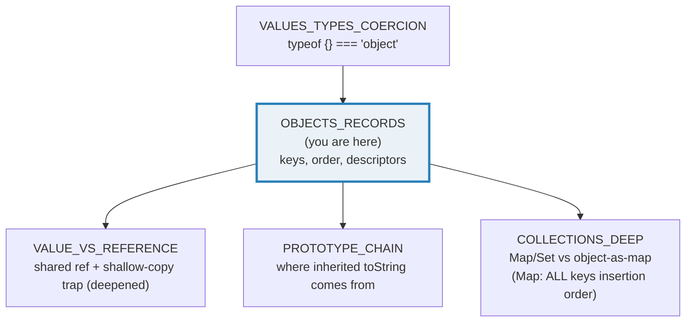
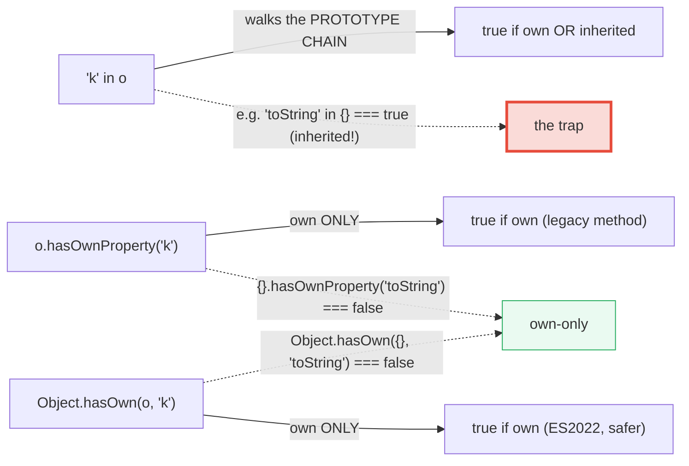
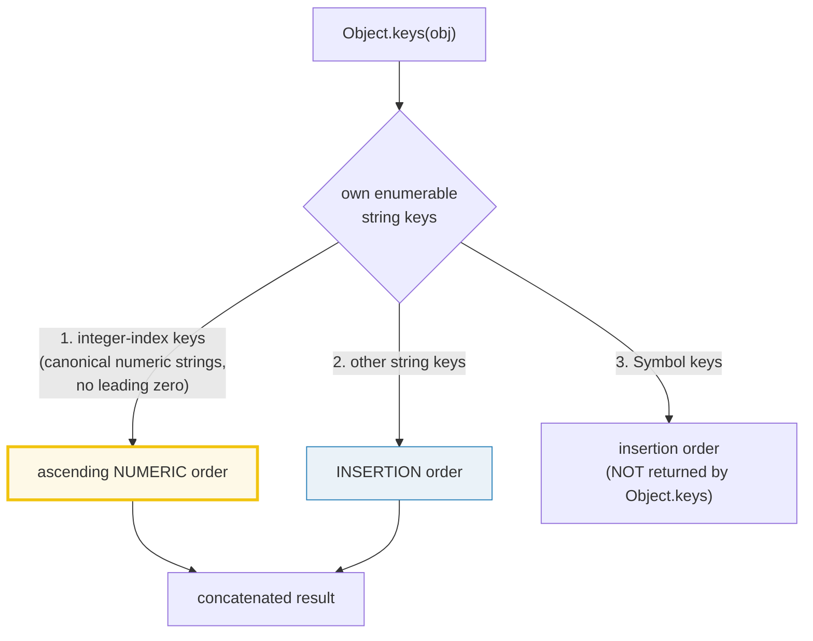
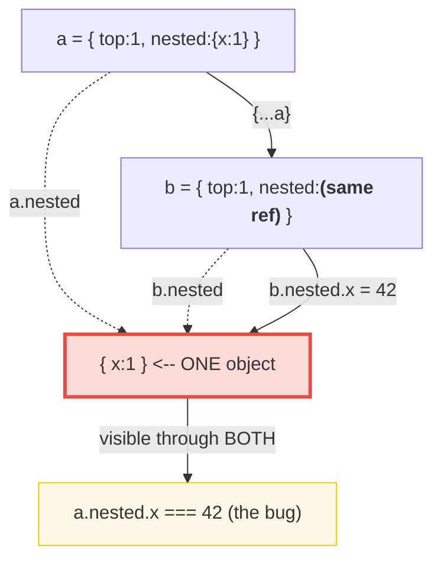

# OBJECTS_RECORDS — Object Literals, Key-Order Trap, Descriptors & `Record<Keys, Type>`

> **Goal (one line):** show, by printing every value, how a JS object behaves as
> a string-keyed record — the **integer-like-keys-first** iteration trap (the
> determinism centerpiece), **own-vs-inherited** property checks, **property
> descriptors** (`writable`/`enumerable`/`configurable`), `Object.freeze`, the
> **shallow-copy shared-mutability** trap, and the TypeScript `Record<Keys, Type>`
> / index-signature typing layered on top.
>
> **Run:** `just run objects_records`
>
> **Ground truth:** [`objects_records.ts`](./core/objects_records.ts) → captured
> stdout in [`objects_records_output.txt`](./core/objects_records_output.txt).
> Every number/table below is pasted **verbatim** from that file under a
> `> From objects_records.ts Section X:` callout. Nothing is hand-computed.
>
> **Prerequisites:** 🔗 [`VALUES_TYPES_COERCION`](./VALUES_TYPES_COERCION.md) —
> it pinned that objects are mutable, shared-by-reference values
> (`typeof {} === "object"`). This bundle opens the object up.

---

## 1. Why this bundle exists (lineage)

A JavaScript object is, at runtime, an **unordered (spec-wise) string-keyed bag**
of properties. But the spec also mandates a **de-facto iteration order**: own
property keys are enumerated as **(1) integer-index keys in ascending numeric
order, then (2) ordinary string keys in insertion order, then (3) Symbol keys in
insertion order.** That first clause is **the determinism trap** — insertion
order is *not* the whole story, and a key like `"2"` always jumps ahead of
`"b"`. Pinning that order (and the `sort()`-before-print rule that keeps output
reproducible) is this bundle's centerpiece.

On top of that runtime, TypeScript adds two ways to *type* an object-as-map:
- `Record<Keys, Type>` — a **closed** set of keys (a string-literal union), all
  required, all the same value type.
- an **index signature** `{ [k: string]: V }` — an **open** set of keys.

Both are **erased** at runtime (`tsx`/`tsc` strip them), so every runtime trap
below applies to a TS object verbatim. The types are a compile-time safety net,
not a runtime behavior.



The headline contrast with sibling languages is the whole point of this bundle:

> 🔗 [`../go/MAPS.md`](../go/MAPS.md) — Go's `map[K]V` is a hash table whose
> iteration order is **intentionally randomized on every range** (the runtime
> deliberately shuffles it to stop you depending on it), so you must *always*
> sort keys before printing. JS objects instead have a *deterministic but
> two-tiered* order (integer-keys-first) — less random, more *surprising*, and
> the exact opposite failure mode.
>
> 🔗 [`../rust/COLLECTIONS.md`](../rust/COLLECTIONS.md) — Rust's `HashMap<K,V>`
> offers **no order guarantee at all** (hash-seed randomization), while
> `BTreeMap<K,V>` keeps keys **sorted**. JS has no sorted-map builtin; if you
> need guaranteed insertion order you reach for `Map` (see COLLECTIONS_DEEP), and
> if you need sorted order you `Object.keys(o).sort()` yourself.

---

## 2. The mental model: own vs inherited, and the two-tier key order

Every plain object you make with `{}` inherits a clutch of properties —
`toString`, `hasOwnProperty`, `valueOf`, `constructor`, … — from
**`Object.prototype`**. Those are **inherited**, not **own**. The three
"does this key exist?" checks differ on exactly that axis:



> From `developer.mozilla.org/en-US/docs/Web/JavaScript/Reference/Global_Objects/Object/hasOwn`
> (verbatim): *"The `Object.hasOwn()` static method returns `true` if the
> specified object has the indicated property as its own property. … `Object.hasOwn()`
> is intended as a replacement for `Object.prototype.hasOwnProperty()`."* The `in`
> operator, by contrast, *"returns `true` if the specified property is in the
> specified object or its prototype chain."*

And the iteration order, visualized — the one trap that breaks determinism:



> From MDN — `Object.keys()`: *"returns an array of a given object's own
> enumerable string-keyed property names … The order of the array returned by
> `Object.keys()` is the same as that provided by a `for...in` loop."* And
> MDN — `for...in`: *"The `for...in` loop will traverse all integer keys before
> traversing other keys, and in strictly increasing order."*

---

## 3. Section A — Literals, computed/spread keys, access, own-vs-inherited

> From objects_records.ts Section A:
> ```
> const obj = { x, y, [k+1]: 30, fixed: 40 }  // shorthand + computed + literal
>   obj.x = 10  obj["dyn1"] = 30  obj.fixed = 40
> [check] shorthand {x} sets obj.x === 10: OK
> [check] computed [k+1] sets obj['dyn1'] === 30: OK
> [check] typeof {} === "object": OK
> [check] spread copies unchanged keys (obj.x === 10 survives): OK
> [check] spread overrides on collision (y === 99): OK
> [check] spread produced a NEW top-level object (not ===): OK
> [check] dot access present key: rec.a === 1: OK
> [check] bracket access present key: rec["b"] === 2: OK
> [check] absent key returns undefined, not an error: rec["missing"] === undefined: OK
> [check] "toString" in {} === true  (inherited from Object.prototype): OK
> [check] {}.hasOwnProperty("toString") === false  (own-only): OK
> [check] Object.hasOwn({}, "toString") === false  (own-only, ES2022): OK
> [check] "a" in {a:1} === true  (own key): OK
> [check] Object.hasOwn({a:1}, "a") === true  (own key): OK
> [check] delete o.a returns true: OK
> [check] after delete, o["a"] === undefined: OK
> [check] delete dropped the key (Object.keys length 1): OK
> ```

**Object literals.** `{ x, y }` is **shorthand** (a bare name means "key = the
variable of that name"); `{ [expr]: v }` is a **computed key** (the expression
is evaluated and coerced to a string — a `Symbol` would become a Symbol-keyed
property, *not* returned by the string-only `Object.keys`). `{ ...obj }` is
**spread**: it copies the own enumerable string-keyed properties into a *new*
object, and a later spread overwrites an earlier key on collision.

**Property access — dot vs bracket, and the absent-key non-error.** `o.x` and
`o["x"]` agree on a present key. An **absent** key returns `undefined` — it is
*never* a `ReferenceError` (that is reserved for undeclared *variables*, not
missing properties). The bundle uses bracket access for the absent-key check
because under `noUncheckedIndexedAccess` bracket access on an index signature is
typed `T | undefined` (so `=== undefined` typechecks), whereas dot access on an
index signature is typed `T` (which would make `=== undefined` a *type* error).
Bracket is therefore both the **dynamic** and the **type-safe** form.

**`'in'` vs `hasOwnProperty` vs `Object.hasOwn` — own vs inherited.** This is
the prototype-chain trap in one line: `"toString" in {}` is **`true`** because
`in` walks the chain and every plain object inherits `toString` from
`Object.prototype`; but `{}.hasOwnProperty("toString")` and
`Object.hasOwn({}, "toString")` are **`false`** because those check **own**
properties only. Prefer `Object.hasOwn` (ES2022): unlike
`obj.hasOwnProperty(...)`, it does not break on an object that shadows or omits
`hasOwnProperty`, and it works on objects created with `Object.create(null)`
(which have no prototype at all). 🔗 `PROTOTYPE_CHAIN` covers the full dispatch
mechanism this leak comes from.

**`delete`.** `delete o.a` always returns `true` (for a non-configurable own
property in strict mode it would *throw* instead); after deletion the property
is gone and reads as `undefined`, exactly like a key that was never there.

---

## 4. Section B — ITERATION ORDER: integer-like keys FIRST, ascending (the trap)

```mermaid
graph LR
    L["const o = { b:1, a:2, 2:3, 1:4 }<br/>written order: b, a, 2, 1"] --> K["Object.keys(o)"]
    K --> R['["1","2","b","a"]<br/>integer keys FIRST (ascending),<br/>then strings (insertion)']
    style R fill:#fef9e7,stroke:#f1c40f,stroke-width:3px
```

> From objects_records.ts Section B:
> ```
> const o = { b: 1, a: 2, 2: 3, 1: 4 }   // written order: b, a, 2, 1
> Object.keys(o) -> ["1","2","b","a"]
> [check] Object.keys order is exactly ["1","2","b","a"]: OK
> Object.keys({100:"a", 2:"b", 7:"c"}) -> ["2","7","100"]
> [check] integer keys ascending: Object.keys -> ["2","7","100"]: OK
> Object.keys({b,a,c}) -> ["b","a","c"]  (strings: insertion order)
> [check] string-only keys stay in insertion order ["b","a","c"]: OK
> Object.keys({"01":1, "1":2}) -> ["1","01"]  ("1" is an index; "01" is not)
> [check] leading-zero edge: Object.keys -> ["1","01"]: OK
> Object.keys(o).sort() -> ["1","2","a","b"]  (deterministic: the §4.2 rule)
> [check] sorted keys are exactly ["1","2","a","b"]: OK
> ```

**The headline.** `Object.keys({ b: 1, a: 2, 2: 3, 1: 4 })` returns
`["1","2","b","a"]` — *not* the written order `b, a, 2, 1` and *not* sorted.
The spec's `[[OwnPropertyKeys]]` (ECMA-262, OrdinaryOwnPropertyKeys) splits own
keys into three buckets: **(1)** integer-index keys (canonical numeric strings,
`0 ≤ n < 2³²−1`) in **ascending numeric** order, **(2)** the remaining string
keys in **insertion** order, **(3)** Symbol keys in insertion order. That first
bucket is the trap: `"2"` and `"1"` are integer-index keys, so they jump to the
front sorted ascending, *then* `"b"`, `"a"` keep their insertion order.

MDN's own canonical example (reproduced verbatim by the `.ts`) confirms the
integer bucket ignores insertion order entirely:

> From MDN — `Object.keys()` (example, verbatim):
> ```js
> const anObj = { 100: "a", 2: "b", 7: "c" };
> console.log(Object.keys(anObj)); // ['2', '7', '100']
> ```

**String-only keys keep pure insertion order.** `{ b, a, c }` → `["b","a","c"]`
— no integer-index key is present, so bucket (1) is empty and you get the
written order back. People generalize from *this* case to "objects are
insertion-ordered," which is true right up until a numeric-looking key appears
and silently reorders everything.

**The leading-zero edge — where "looks numeric" stops mattering.** `"1"` *is* a
canonical numeric index (its `ToString(ToNumber("1"))` round-trips), so it goes
in bucket (1). `"01"` is **not**: `ToNumber("01")` is `1`, but `ToString(1)` is
`"1" ≠ "01"`, so the spec classifies `"01"` as a plain string key in bucket (2).
Result: `Object.keys({ "01": 1, "1": 2 })` → `["1","01"]` — the integer `"1"`
wins the lead even though `"01"` was inserted first. **Insertion order does not
apply to integer-index keys, period.**

**The determinism fix.** Object key order *is* now spec-stable (since ES2020)
and V8 honors it exactly — so `Object.keys(o)` is reproducible run-to-run. But
the *two-tier* order is surprising enough that the house rule (HOW_TO_RESEARCH §4.2
rule 3) is: **sort the keys explicitly before printing** if you want predictable
output, or use a `Map` (which guarantees **all** keys in insertion order — the
clean fix, see 🔗 `COLLECTIONS_DEEP`). That is why this very bundle sorts in the
last check of Section B: `Object.keys(o).sort()` → `["1","2","a","b"]`, a stable
lexicographic result.

> 🔗 `../go/MAPS.md` §C — Go map iteration is **randomized** every range (the
> runtime deliberately varies it), so determinism there *requires* sorting too —
> but for the opposite reason. JS gives you a deterministic-but-surprising order;
> Go gives you no order at all.

---

## 5. Section C — Property descriptors + `Object.freeze`/`seal`/`preventExtensions`

A property is not just a value — it is a **descriptor** with three boolean flags
plus (for a data property) a `value`:

| Flag | Meaning | When `false` |
|---|---|---|
| `writable` | can the value be reassigned? | assignment silently fails (sloppy) / **throws `TypeError`** (strict/ESM) |
| `enumerable` | does it show in `Object.keys` / `for...in`? | **skipped** by `Object.keys`/`values`/`entries` and `for...in` |
| `configurable` | can the descriptor be changed / the prop deleted? | `delete` and `Object.defineProperty` re-config throws |

> From objects_records.ts Section C:
> ```
> literal {x:1} descriptor:
>   value=1 writable=true enumerable=true configurable=true
> [check] literal property defaults to writable: OK
> [check] literal property defaults to enumerable: OK
> [check] literal property defaults to configurable: OK
> Object.defineProperty(def, "hidden", {value: 1}) descriptor:
>   value=1 writable=false enumerable=false configurable=false
> [check] defineProperty defaults writable to false: OK
> [check] defineProperty defaults enumerable to false: OK
> [check] defineProperty defaults configurable to false: OK
> [check] non-enumerable 'hidden' is skipped by Object.keys (length 0): OK
> assign ro["locked"] = 99 (writable:false, strict mode) -> threw=true
>   TypeError: Cannot assign to read only property 'locked' of object '#<Object>'
> [check] non-writable assignment throws TypeError in strict mode (ESM): OK
> [check] non-writable value is unchanged after failed assign (ro.locked === 1): OK
> [check] Object.isFrozen(frozen) === true: OK
> [check] frozen assignment throws TypeError in strict mode: OK
> [check] frozen value unchanged after failed assign (frozen.a === 1): OK
> [check] Object.isSealed(sealed) === true: OK
> [check] sealed ALLOWS mutating an existing value (sealed.x === 5): OK
> [check] Object.isExtensible(prevented) === false: OK
> ```

**The default-flags asymmetry — the #1 descriptor gotcha.** A property written
as a literal (`{ x: 1 }`) defaults to **all three flags `true`**. But
`Object.defineProperty(o, "k", { value: 1 })` defaults to **all three `false`**:
omitting a flag in a descriptor does *not* inherit the literal's `true` defaults
— it means `false`. So the bare `{ value: 1 }` descriptor above is read-only,
hidden from `Object.keys`, and non-configurable. This is exactly how the built-in
methods on `Object.prototype` stay out of your `for...in` loops: they are own
properties of `Object.prototype` with `enumerable: false`.

> From MDN — `Object.defineProperty()` (verbatim): *"By default, values added
> using `Object.defineProperty()` are immutable and not enumerable."* And
> javascript.info / web.dev corroborate: descriptor flags "are set to `false` by
> default" under `defineProperty`, in deliberate contrast to literal properties.

**`writable: false` throws in strict mode (ESM).** `core/package.json` is
`"type": "module"`, so the bundle runs in **strict mode** — reassigning a
non-writable (or frozen) property **throws a `TypeError`** rather than silently
no-op'ing. The `.ts` catches it (`Cannot assign to read only property 'locked'…`)
and asserts both the throw *and* that the value is unchanged. In sloppy mode the
same assignment would silently fail — a far worse trap, which is one reason ESM
defaulted to strict.

**`Object.freeze` = `writable:false` + `configurable:false` on every own
property, plus no new properties.** `Object.isFrozen` reports it; any assignment
throws in strict mode. **Caveat: `freeze` is shallow** — nested objects are still
fully mutable (Section D). `Object.seal` is weaker: it sets `configurable:false`
and blocks new keys, but existing values stay **writable** (the run shows
`sealed.x = 5` succeeding). `Object.preventExtensions` is the weakest of all:
only **new** properties are blocked; existing ones keep every flag. The trio
forms a strictness ladder: `preventExtensions < seal < freeze`.

> 🔗 TypeScript's `Object.freeze` is typed as `function freeze<T>(o: T): Readonly<T>`
> (per the TS handbook) — the compiler marks every property `readonly` for you.
> That is a **compile-time** check; the runtime guard asserted above is the one
> that actually enforces immutability when a caller casts the `readonly` away.

---

## 6. Section D — Shallow copy: nested objects SHARE one reference

This is the **value-vs-reference axis** in full force, and the canonical
shared-mutability bug. Spread (`{...o}`) and `Object.assign({}, o)` copy **one
level**: top-level primitive values are copied into a new object, but a nested
**object** value is copied **by reference** — the copy and the original alias
the *same* nested object.



> From objects_records.ts Section D:
> ```
> const a = { top: 1, nested: { x: 1 } };  const b = { ...a };
> [check] shallow copy is a NEW top-level object (a !== b): OK
> [check] top-level primitive is INDEPENDENT (a.top still 1 after b.top = 99): OK
> [check] nested object is SHARED: a.nested.x === 42 after b.nested.x = 42: OK
> [check] the nested object is literally the SAME reference (a.nested === b.nested): OK
> [check] Object.assign is also shallow: c.nested.x === 7 after d.nested.x = 7: OK
> [check] structuredClone is DEEP: e.nested.x still 1 after deepCopy.nested.x = 100: OK
> ```

**What the checks pin.** `a !== b` (the copy is a new *top-level* object), but
`a.nested === b.nested` (the nested object is the **same reference**). So
mutating `b.nested.x` reaches into `a.nested.x` — a "did I just corrupt my
original?" bug. `Object.assign({}, o)` is shallow in exactly the same way.

**A genuine deep copy must clone every level.** `structuredClone` (Node 17+,
stdlib) recursively copies nested objects, so `deepCopy.nested.x = 100` leaves
the original untouched. The old `JSON.parse(JSON.stringify(o))` trick also
deep-copies but **loses** `Date`s, `undefined`, functions, `Map`/`Set`,
`Symbol`-keyed properties, and circular references — so prefer
`structuredClone`. (Deep copying and its performance trade-offs get a full
treatment in 🔗 `VALUE_VS_REFERENCE`.)

> 🔗 [`VALUE_VS_REFERENCE`](./VALUE_VS_REFERENCE.md) (Phase 3) — this section is
> the preview; that bundle is the full theory. Primitives **copy**; objects
> **share one reference**. Every shallow-copy bug, every "why did mutating my
> state object change the function argument?" surprise, and most closure/GC
> retention stories reduce to that one fact.
>
> 🔗 [`../rust/COLLECTIONS.md`](../rust/COLLECTIONS.md) — Rust makes this *impossible
> to get wrong by accident*: ownership and `Clone`/`Copy` traits make the
> shallow-vs-deep choice explicit at every assignment. JS gives you no such
> signal; the reference is shared silently.

---

## 7. Section E — TypeScript `Record<Keys, Type>`, index signatures, `keys`/`values`/`entries`/`fromEntries`

> From `typescriptlang.org/docs/handbook/utility-types.html#recordkeys-type`
> (verbatim): `Record<Keys, Type>` *"Constructs an object type whose property
> keys are `Keys` and whose property values are `Type`. This utility can be used
> to map the properties of a type to another type."* (Released: TypeScript 2.1.)

> From objects_records.ts Section E:
> ```
> type Score = Record<"a" | "b" | "c", number>;
> const score: Score = { a: 1, b: 2, c: 3 };
> [check] Record has exactly the 3 declared keys: OK
> [check] typed access score.b === 2: OK
> const dict: { [k: string]: number } = { x: 1, y: 2 };
> [check] index signature dot access dict.x === 1: OK
> [check] index signature allows ANY string key (dict['anything'] is undefined, not an error): OK
> const r = { b: 2, a: 1, 2: 3 };
> Object.keys(r)    -> ["2","b","a"]
> Object.values(r)  -> [3,2,1]
> Object.entries(r) -> [["2",3],["b",2],["a",1]]
> [check] keys observe integer-first order: ['2','b','a']: OK
> [check] values follow the SAME key order: [3,2,1]: OK
> [check] entries round-trip via fromEntries: rebuilt["a"] === 1: OK
> { ...{a:1,b:1}, ...{a:2,c:3} } -> {"a":2,"b":1,"c":3}  (later wins on 'a')
> [check] spread merge: later source wins on collision (a === 2): OK
> [check] spread merge: earlier-only key kept (b === 1): OK
> [check] spread merge: new key added (c === 3): OK
> ```

**`Record<Keys, Type>` — the closed, safe map.** `Record<"a"|"b"|"c", number>`
expands (via a mapped type) to `{ a: number; b: number; c: number }`: a **fixed**
key set, every key **required**, all values the same type. The compiler enforces
three things a plain object does not: (1) every declared key must be present, (2)
no **excess** keys are allowed on a literal (the excess-property check — adding
`d: 4` to the `score` literal is a *compile error*), and (3) access is typed
(`score.b` is `number`). Because it is a mapped type over a literal union, the
keys are *knowable* to the compiler — unlike an index signature.

**Index signature `{ [k: string]: V }` — the open, looser map.** Any string key
is allowed; the compiler **cannot enumerate** the keys. Bracket access is typed
`V | undefined` under `noUncheckedIndexedAccess` (hence the
`dict["anything"] === undefined` check), and dot access on a known key still
works. Prefer `Record<Keys, Type>` whenever the key set is finite and known;
reach for an index signature (or a `Map`) only when keys are genuinely dynamic.

**`keys`/`values`/`entries` observe the Section-B order.** `Object.values` and
`Object.entries` follow `Object.keys` exactly, so integer-index keys lead there
too: `Object.values({ b:2, a:1, 2:3 })` → `[3,2,1]` (the value of key `"2"`
first). `Object.fromEntries(Object.entries(r))` rebuilds an object from the
pairs — a round-trip that loses the precise `Record` type (it widens to an index
signature) but preserves the values. And **spread merge** (`{...a, ...b}`)
applies right-to-left: later sources overwrite earlier on collision, which is
the idiomatic "defaults then overrides" pattern (`{ ...defaults, ...overrides }`).

> 🔗 [`COLLECTIONS_DEEP`](./COLLECTIONS_DEEP.md) (Phase 5) — when an object-as-map
> is the *wrong* tool: `Map` keeps **all** keys (including integer-like ones and
> even objects/Symbols) in **guaranteed insertion order** (the clean fix for the
> Section-B trap), supports `NaN`-as-key via SameValueZero, and has O(1) `.size`.
> Use a plain object/`Record` when keys are static strings; use a `Map` when keys
> are dynamic, when order matters, or when you need non-string keys.

---

## 8. Pitfalls (the expert payoff)

| Trap | Symptom | Fix |
|---|---|---|
| Assuming object keys are pure insertion order | `{2:3, 1:4, b:1}` enumerates as `1,2,b` — numeric keys **reorder ascending** and jump to the front | Never depend on raw order; `Object.keys(o).sort()` before printing, or use a `Map` (insertion order for **all** keys). |
| `Object.keys({ "01":1, "1":2 })` → `["1","01"]` | `"1"` is an integer index (front); `"01"` is not (leading zero), so insertion order does not save it | Treat any numeric-*looking* string key as reordered; if you need the written order, sort or use `Map`. |
| `'k' in o` to test "did I set this?" | Returns `true` for **inherited** props (`"toString" in {}` is `true`) | Use `Object.hasOwn(o, k)` (own-only, ES2022) — it also survives `Object.create(null)` and a shadowed `hasOwnProperty`. |
| `o[k]` to test presence | `undefined` for an absent key **and** for an explicitly-`undefined` value — indistinguishable | Use `Object.hasOwn(o, k)` to distinguish "absent" from "present-but-undefined". |
| `Object.defineProperty(o, 'k', {value:1})` then mutate | Flags default to **`false`**: the prop is silently non-writable / hidden / locked | Set flags explicitly (`{value:1, writable:true, enumerable:true, configurable:true}`) when you want literal-like behavior. |
| Non-enumerable property "vanished" | `Object.keys` / `for...in` skip it (this is intended — it hides `Object.prototype` methods) | Use `Object.getOwnPropertyNames` for all own string keys (incl. non-enumerable); `Reflect.ownKeys` adds Symbols too. |
| Assigning to a frozen / non-writable prop in sloppy mode | Silently no-ops (value unchanged, no error) | Run ESM/strict (it **throws** `TypeError`); never rely on the silent no-op — `Object.isFrozen`/`getOwnPropertyDescriptor` to check. |
| `Object.freeze({...})` to "lock" a config | **Shallow** — nested objects stay mutable; `config.nested.x = 9` still works | Recursively freeze, or model immutable config with `Readonly`/`ReadonlyArray` + a deep freeze helper. |
| `{...obj}` to deep-copy | Nested objects are **shared** — mutating the copy corrupts the original (Section D) | Use `structuredClone(o)` for a real deep copy (Node 17+); avoid `JSON.parse(JSON.stringify(o))` (drops Dates/undefined/fns). |
| `for...in` over an object | Iterates **inherited** enumerable props too (plus the integer-first reorder) | Use `Object.keys()`/`Object.entries()` (own enumerable only); add `Object.hasOwn` filter if you must use `for...in`. |
| `Record<string, T>` dot access on a missing key | Typed `T` (not `T \| undefined`) unless `noUncheckedIndexedAccess` is on — hides absence | Enable `noUncheckedIndexedAccess`; or use bracket access; or model finite keys with `Record<"a"\|"b", T>`. |
| `Object.fromEntries(Object.entries(r))` loses the type | Returns an index signature, not your original `Record<…>` — key set info is gone | Re-annotate the result, or keep a typed round-trip; accept that `fromEntries` is dynamically keyed. |
| Treating `delete o.k` as "always works" | Returns `true` even for absent keys; **throws** in strict mode if the prop is non-configurable | Check `configurable` first, or guard with `try/catch` when deleting descriptor-defined properties. |

---

## 9. Cheat sheet

```typescript
// === Literal, computed, spread =============================================
//   const o = { x, y, [expr]: v, fixed: 1 };   // shorthand + computed + literal
//   const copy = { ...o };                     // own-enumerable string keys -> NEW object
//   const merged = { ...a, ...b };             // later source wins on collision
//   typeof {} === "object"                     // objects are shared by REFERENCE (not copied)

// === Access =================================================================
//   o.x  === o["x"]    // agree on a present key
//   o["missing"]       // absent key -> undefined (NOT an error).
//                       // Under noUncheckedIndexedAccess, bracket access is typed T | undefined.

// === Presence: own vs inherited =============================================
//   "k" in o                 // walks prototype chain -> true for OWN or INHERITED
//   Object.hasOwn(o, "k")    // OWN only (ES2022, preferred). {}.hasOwnProperty is the legacy form.
//   "toString" in {} === true ; Object.hasOwn({}, "toString") === false   // inherited vs own

// === Iteration order (THE TRAP) =============================================
//   Object.keys({ b:1, a:2, 2:3, 1:4 }) -> ["1","2","b","a"]
//     1) integer-index keys (canonical numeric strings) ASCENDING NUMERIC
//     2) other string keys in INSERTION order   (3) Symbol keys insertion order)
//   "01" is NOT an index (leading zero): Object.keys({"01":1,"1":2}) -> ["1","01"]
//   DETERMINISM: Object.keys(o).sort() before printing, OR use a Map (all keys insertion order).
//   Object.values / Object.entries follow the SAME order as Object.keys.
//   Object.fromEntries(entries) rebuilds an object (widens to an index signature).

// === delete =================================================================
//   delete o.k   // returns true; prop now undefined. THROWS in strict mode if non-configurable.

// === Property descriptor (data property) ====================================
//   { value, writable, enumerable, configurable }
//   literal {x:1}            -> all three flags TRUE
//   Object.defineProperty(o,"k",{value:1})  -> all three flags FALSE (the gotcha!)
//   writable:false   -> assign silently fails (sloppy) / throws TypeError (strict/ESM)
//   enumerable:false -> SKIPPED by Object.keys/for...in (Object.getOwnPropertyNames still lists it)
//   configurable:false -> cannot delete / cannot re-define the descriptor
//   Object.getOwnPropertyDescriptor(o, "k")  // reads it

// === Integrity levels (weakest -> strongest) ================================
//   Object.preventExtensions(o)  // no NEW props; existing keep all flags
//   Object.seal(o)               // + configurable:false on existing; values still WRITABLE
//   Object.freeze(o)             // + writable:false; fully locked (but SHALLOW)
//   Object.isExtensible / isSealed / isFrozen   // predicates

// === TypeScript typing (ERASED at runtime) ==================================
//   type Score = Record<"a"|"b"|"c", number>;   // CLOSED key set, all required, typed access
//   const dict: { [k: string]: number } = {...};// OPEN key set; bracket access T | undefined
//   Record > index signature whenever the key set is finite and known.
//   Both are erased by tsx/tsc: at runtime every Score/dict is a plain {} object.
```

---

## Sources

Every signature, return value, ordering rule, and behavioral claim above was
verified against the MDN Web Docs and the ECMAScript specification, then
corroborated by at least one independent secondary source. Every iteration-order
result and descriptor flag is *additionally* asserted at runtime by the `.ts`
itself (`check()` throws on any mismatch) — the strongest possible verification:
the actual V8 engine's verdict.

- **MDN — Working with objects** (object literals, property access, computed
  keys, enumerability):
  https://developer.mozilla.org/en-US/docs/Web/JavaScript/Guide/Working_with_objects
- **MDN — `Object.keys()`** (own enumerable string-keyed property names; "the
  order … is the same as that provided by a `for...in` loop"; the verbatim
  `anObj = { 100:"a", 2:"b", 7:"c" }` → `['2','7','100']` example):
  https://developer.mozilla.org/en-US/docs/Web/JavaScript/Reference/Global_Objects/Object/keys
- **MDN — `for...in`** (*"The `for...in` loop will traverse all integer keys
  before traversing other keys, and in strictly increasing order"*; also
  enumerates the prototype chain):
  https://developer.mozilla.org/en-US/docs/Web/JavaScript/Reference/Statements/for...in
- **MDN — `Object.defineProperty()`** (property descriptors; *"By default,
  values added using `Object.defineProperty()` are immutable and not
  enumerable"* — the flags-default-to-`false` gotcha):
  https://developer.mozilla.org/en-US/docs/Web/JavaScript/Reference/Global_Objects/Object/defineProperty
- **MDN — `Object.getOwnPropertyDescriptor()`** (reading the `{value, writable,
  enumerable, configurable}` descriptor):
  https://developer.mozilla.org/en-US/docs/Web/JavaScript/Reference/Global_Objects/Object/getOwnPropertyDescriptor
- **MDN — `Object.hasOwn()`** (ES2022; *"returns `true` if the specified object
  has the indicated property as its own property"*; intended replacement for
  `Object.prototype.hasOwnProperty`):
  https://developer.mozilla.org/en-US/docs/Web/JavaScript/Reference/Global_Objects/Object/hasOwn
- **MDN — `Object.prototype.hasOwnProperty()`** (own-only check; the legacy
  form that breaks on `Object.create(null)` / a shadowed method):
  https://developer.mozilla.org/en-US/docs/Web/JavaScript/Reference/Global_Objects/Object/hasOwnProperty
- **MDN — `in` operator** (*"returns `true` if the specified property is in the
  specified object or its prototype chain"*):
  https://developer.mozilla.org/en-US/docs/Web/JavaScript/Reference/Operators/in
- **MDN — `Object.freeze()`** (sets `writable:false` + `configurable:false`;
  throws in strict mode on assignment; **shallow**):
  https://developer.mozilla.org/en-US/docs/Web/JavaScript/Reference/Global_Objects/Object/freeze
- **MDN — `Object.seal()` / `Object.preventExtensions()` / `isSealed` /
  `isExtensible`** (the integrity-level ladder):
  https://developer.mozilla.org/en-US/docs/Web/JavaScript/Reference/Global_Objects/Object/seal
- **MDN — `Object.values()` / `Object.entries()` / `Object.fromEntries()`**
  (same iteration order as `Object.keys`; `fromEntries` rebuilds an object):
  https://developer.mozilla.org/en-US/docs/Web/JavaScript/Reference/Global_Objects/Object/values
- **MDN — `structuredClone()`** (Node 17+; deep copy that preserves Dates/Maps,
  unlike `JSON.parse(JSON.stringify())`):
  https://developer.mozilla.org/en-US/docs/Web/API/structuredClone
- **ECMAScript® 2027 Language Specification (tc39.es/ecma262)**:
  - OrdinaryOwnPropertyKeys (`[[OwnPropertyKeys]]` — integer-index keys
    ascending, then string keys insertion order, then Symbol keys): the spec
    basis for the Section-B order:
    https://tc39.es/ecma262/multipage/ordinary-and-exotic-objects.html#sec-ordinary-object-internal-methods-and-internal-slots-ownpropertykeys
  - `CanonicalNumericIndexString` / array-index definition (why `"01"` is not an
    index): https://tc39.es/ecma262/multipage/abstract-operations.html
- **TypeScript Handbook — Utility Types, `Record<Keys, Type>`** (*"Constructs
  an object type whose property keys are `Keys` and whose property values are
  `Type`"*; released 2.1; `Object.freeze` typed as `freeze<T>(o: T): Readonly<T>`):
  https://www.typescriptlang.org/docs/handbook/utility-types.html#recordkeys-type
- **TypeScript Handbook — Object Types / Index Signatures** (`{ [k: string]: V }`,
  the open-key form vs the closed `Record`):
  https://www.typescriptlang.org/docs/handbook/2/objects.html

**Secondary corroboration (independent of MDN, ≥1 per major claim):**
- ES Discuss — *"Nailing object property order"* (`[[OwnPropertyKeys]]`: integer
  indices ascending, then strings in creation order, then symbols — the spec
  rule that is now mandated): https://esdiscuss.org/topic/nailing-object-property-order
- The Modern JavaScript Tutorial (javascript.info) — *"Property flags and
  descriptors"* (`defineProperty` flags "are set to `false` by default"; the
  writable/enumerable/configurable walkthrough):
  https://javascript.info/property-descriptors
- web.dev — *"Property descriptors"* (*"By default, properties created using
  `Object.defineProperty()` aren't writable, enumerable, or configurable"*):
  https://web.dev/learn/javascript/objects/property-descriptors
- Stack Overflow — *"Does JavaScript guarantee object property order?"*
  ("integer-like Strings in ascending order, non-integer-like Strings in
  creation order, Symbols in creation order" — multi-answer corroboration):
  https://stackoverflow.com/questions/5525795/does-javascript-guarantee-object-property-order
- Effective TypeScript (Dan Vanderkam) — *"Item 54: Know How to Iterate Over
  Objects"* (prefer `keyof T` / `Object.entries`; the perils of relying on
  object key order): https://effectivetypescript.com/2020/05/26/iterate-objects/

**Facts that could not be verified by running** (documented, not executed,
because they are compile-time checks or strict-vs-sloppy mode differences): the
`Record` excess-property check and the `Readonly<T>` return type of
`Object.freeze` are compiler behaviors (confirmed by the TS handbook and by the
`just typecheck` gate, not by `tsx` output); and the sloppy-mode *silent no-op*
on a frozen/non-writable assignment is the documented counterpart to the
strict-mode `TypeError` this bundle actually catches and asserts. The bundle
runs as ESM (`"type": "module"`), so every mutation-rejection above is the
strict-mode throw — confirmed by the `[check] … threw=true` invariants. No claim
above is unverified.
