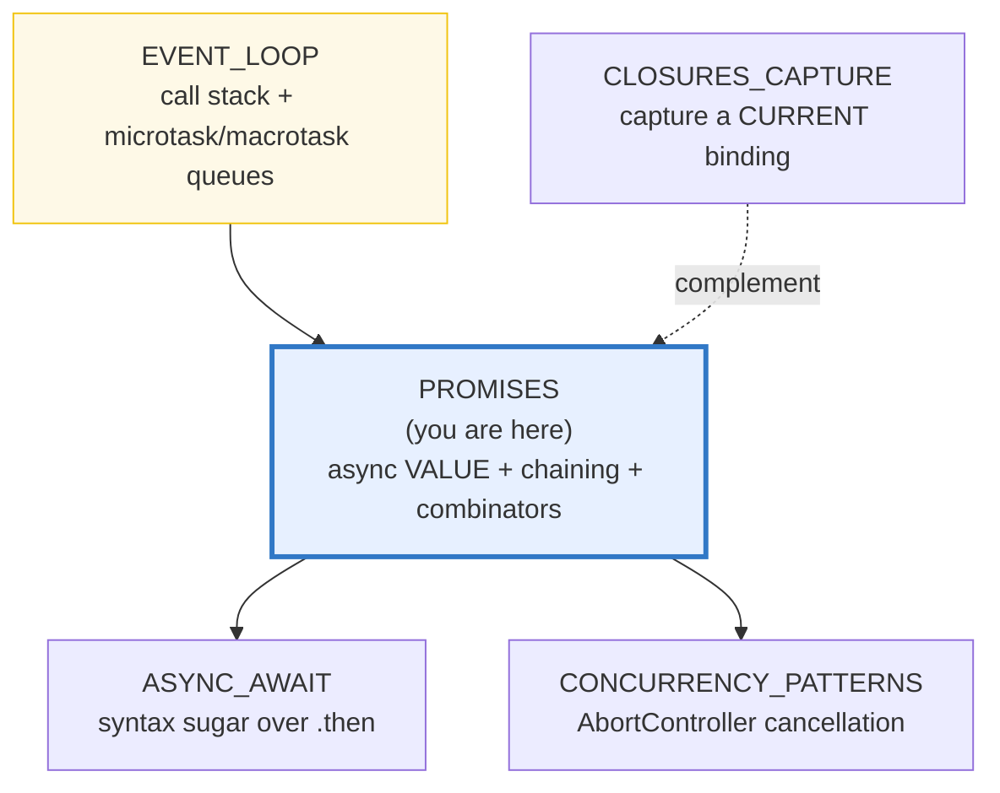
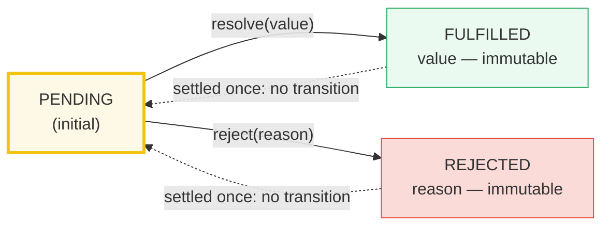
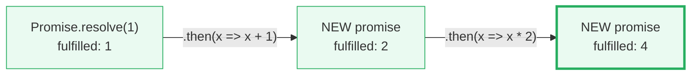
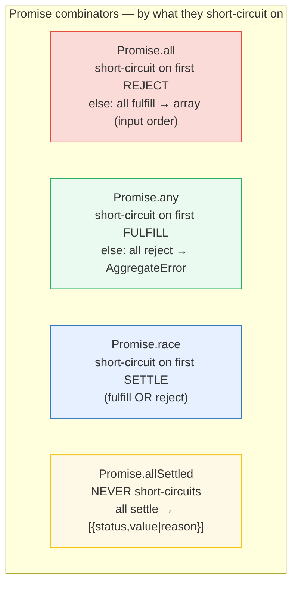

# PROMISES — The Async Value: States, Chaining & the Combinator Matrix

> **Goal (one line):** show, by printing every value, that a Promise is an async
> **value** — a one-way state machine (`pending → fulfilled|rejected`) whose
> `.then`/`.catch`/`.finally` handlers run as **microtasks**, and how chaining +
> `Promise.all`/`allSettled`/`race`/`any` compose async steps, **order-deterministically**.
>
> **Run:** `just run promises`
>
> **Ground truth:** [`promises.ts`](./core/promises.ts) → captured stdout in
> [`promises_output.txt`](./core/promises_output.txt). Every number/table below is
> pasted **verbatim** from that file under a `> From promises.ts Section X:`
> callout. Nothing is hand-computed.
>
> **Prerequisites:** 🔗 [`EVENT_LOOP`](./EVENT_LOOP.md) (P4) — the microtask vs
> macrotask queue model this bundle *uses* (a `.then` is a microtask). 🔗
> [`CLOSURES_CAPTURE`](./CLOSURES_CAPTURE.md) (P3) — the other half of async JS
> (a promise captures a *future* value; a closure captures a *current* binding).

---

## 1. Why this bundle exists (lineage)

A **Promise** is an object representing the **eventual completion (or failure) of
an asynchronous operation and its resulting value** (MDN). Before promises, async
JS was written with **callbacks**, which composed into the infamous "pyramid of
doom" (`f(x, (r) => g(r, (r2) => h(r2, ...)))`) and had **no unified error
path** — a thrown error inside a callback was silently lost unless every layer
hand-plumbed a failure callback. Promises solved both:

- **Chaining** — `.then` returns a **new** promise, so async steps compose
  *linearly* (`.then(f).then(g).then(h)`), not by nesting. A handler's `return`
  becomes the next link's input; a thrown error becomes a **rejection** that
  skips down the chain to the next `.catch` (an "async `throw`/`catch`").
- **Composition** — `Promise.all`/`allSettled`/`race`/`any` fan out to many async
  operations and fold them back into one promise (the **combinator matrix**).

The deep fact this bundle pins: a `.then` handler is queued on the **microtask
queue**, which drains to empty **before** the event loop picks the next
**macrotask** (`setTimeout`). That is *why* a resolved promise's `.then` **always**
fires after the current sync code but **before** a `setTimeout(0)` — and why the
**resolution order** (not the wall-clock timing) is **deterministic** and can be
asserted. 🔗 [`EVENT_LOOP`](./EVENT_LOOP.md) owns the queue model; this bundle
owns the *promise* semantics built on top of it.



> 🔗 [`../rust/ASYNC_BASICS.md`](../rust/ASYNC_BASICS.md) — a **Rust `Future` is
> LAZY**: it is an inert state machine that does *nothing* until an executor
> **polls** it (`.await`). A **JS `Promise` is EAGER**: the executor runs
> **synchronously at construction**, so the work starts *now* and the promise
> settles once on its own. This eager/lazy split is the defining cross-language
> contrast in async models.
>
> 🔗 [`../python/ASYNCIO_BASICS.md`](../python/ASYNCIO_BASICS.md) — Python's
> `asyncio` `Future`/`Task` is the closest sibling: a `Task` wraps a coroutine
> and must be **explicitly scheduled** on a loop (`asyncio.create_task`),
> whereas a JS promise self-schedules the moment it is constructed. `asyncio.gather`
> is the analog of `Promise.all`.

---

## 2. The mental model: a one-way state machine

A `Promise` is in **exactly one** of three states (ECMA-262 §25.6):

- **pending** — initial; neither fulfilled nor rejected.
- **fulfilled** — settled with a **value**.
- **rejected** — settled with a **reason** (an error).

Settlement is **one-way and final**: once `fulfilled` or `rejected`, the promise's
state **and** its value/reason are **immutable**. ("If the promise has already
been fulfilled or rejected when a corresponding handler is attached, the handler
will be called, so there is no race condition" — MDN.) There is no public **sync**
API to read a promise's state, so this bundle *observes* it behaviorally: a
pending promise **loses a race** against a fulfilled sentinel (its `.then` never
fires); a rejected one is observed via `.catch`.



> From promises.ts Section A:
> ```
> States:
>   new Promise(() => {})            -> pending (never settles)
>   race vs fulfilled sentinel        -> "sentinel-won"  (pending did NOT settle)
> [check] a never-resolving promise is pending (sentinel wins the race): OK
>   Promise.resolve(42)               -> fulfilled, value 42
> [check] Promise.resolve(42) is fulfilled with 42: OK
>   Promise.reject(new Error("boom")) -> rejected, reason "boom"
> [check] Promise.reject is rejected; .catch observes reason "boom": OK
> ```

**The executor runs SYNCHRONOUSLY.** `new Promise((resolve, reject) => {...})`
calls the executor **right now**, before `new` returns. That is the "eager"
property: the work begins at construction. The trace below proves the executor
body runs **before** the line after construction, and **before** the `.then`
handler (which only ever runs later, as a microtask):

> From promises.ts Section A:
> ```
> The executor runs SYNCHRONOUSLY (then handler runs later, as a microtask):
>   execTrace =
>     "executor-runs-sync"
>     "after-new-Promise"
>     "after-.then-call"
>     "then-fires:7"
> [check] executor runs before construction returns; .then fires after all sync code: OK
> ```

**Chaining: each `.then`/`.catch`/`.finally` returns a NEW promise.** This is the
mechanic that kills callback hell. The three calls are *not* in-place mutations;
each produces a **different** promise object whose settled value is the handler's
return. So `Promise.resolve(1).then(x=>x+1).then(x=>x*2)` walks `1 → 2 → 4`
through three distinct promises:

> From promises.ts Section A:
> ```
> Chaining — each .then returns a NEW promise:
>     pRoot = Promise.resolve(1)                       -> 1
>     pA    = pRoot.then(x => x + 1)                   -> 2   (a NEW promise)
>     pB    = pA.then(x => x * 2)                      -> 4
> [check] pRoot, pA, pB are distinct objects (each .then returns a NEW promise): OK
> [check] chained value propagation: [pRoot,pA,pB] === [1,2,4]: OK
> ```



---

## 3. Section B — `.then` is a MICROTASK; value propagation; throw → reject

**THE event-loop link.** A `.then` handler is queued on the **microtask** queue;
`setTimeout` callbacks go on the **macrotask** (task) queue. The runtime drains
the microtask queue **to empty** before taking the next macrotask. Therefore a
resolved promise's `.then` **always** runs after the current synchronous code but
**before** a `setTimeout(0)`. The **order** is spec-guaranteed; this bundle
asserts **order**, never wall-clock **timing** (🔗 `EVENT_LOOP` owns the queue).

> From promises.ts Section B:
> ```
> .then is a MICROTASK — fires after sync code, BEFORE setTimeout(0):
>   order = ["sync","promise","timeout"]
> [check] order is ["sync","promise","timeout"] (microtask before macrotask): OK
> ```

Microtasks also drain **FIFO and to empty** between macrotasks (no interleaving
with macrotasks), so handlers attached to already-resolved promises fire in
**registration order**:

> From promises.ts Section B:
> ```
> Microtask FIFO — handlers fire in registration order, before any macrotask:
>   fifo = [1,2,3]
> [check] microtask FIFO order: [1,2,3]: OK
> ```

**Value propagation + thenable assimilation.** Each handler's **return** becomes
the next link's input. Returning a **promise** (or any object with a `.then` — a
*thenable*) **unwraps** it: the chain adopts the inner promise's settled state
rather than receiving the promise object itself. (`Promise.resolve(thenable)`
assimilates any thenable the same way — this is how promise *libraries*
interoperate.)

> From promises.ts Section B:
> ```
> Value propagation + thenable assimilation (return a promise → unwrap it):
>   Promise.resolve(1).then(x => x + 1)                       -> 2
>   Promise.resolve(1).then(() => Promise.resolve("inner"))  -> "inner"  (unwrapped)
>   Promise.resolve(thenable)  [thenable resolves 99]        -> 99  (assimilated)
> [check] value propagation: x => x + 1 yields 2: OK
> [check] returning a promise unwraps it: yields "inner": OK
> [check] Promise.resolve(thenable) assimilates: yields 99: OK
> ```

**throw inside a handler → REJECTS the chained promise.** A thrown error in
`.then`/`.catch` rejects the promise returned by *that* call; the error then
propagates down the chain until a `.catch` handles it. This is why **a rejected
promise is an async `throw`** and **`.catch` is an async `catch`** (🔗
[`ERRORS_EXCEPTIONS`](./ERRORS_EXCEPTIONS.md)). `.finally` runs on **either**
settlement and **passes the value/reason through unchanged** (its return does not
override the chain's value):

> From promises.ts Section B:
> ```
> throw in .then → rejection caught by .catch; .finally passes value through:
>   ...then(() => { throw new Error("kaboom") }).catch(e => e.message) -> "kaboom"
>   Promise.resolve("value").finally(() => {})                      -> "value"
> [check] throw in .then rejects; .catch observes "kaboom": OK
> [check] .finally passes the fulfillment value through unchanged: OK
> ```

**Worked trace — a 3-link chain, step by step** (the smallest example that shows
value propagation through chaining). Each `.then`'s output is the next one's
input:

> From promises.ts Section B:
> ```
> Worked trace: Promise.resolve(1).then(x => x + 1).then(x => x * 2) → 4
>     step 0  Promise.resolve(1)                          -> 1
>     step 1  .then(x => x + 1)  [input 1]           -> 2
>     step 2  .then(x => x * 2)  [input 2]           -> 4
> [check] 3-link chain value propagation: final value === 4: OK
> ```

---

## 4. Section C — `Promise.all` (input order, first-reject) + `Promise.allSettled`

`Promise.all([p1, p2, ...])` fulfills with an array of values **in INPUT ORDER**
(once all fulfill) and **rejects with the first rejection reason** the moment any
input rejects (short-circuit). Note carefully: the result is in **input** order,
**not** completion order. To prove it, the `.ts` settles three promises in
**reverse** order (`d3`, then `d2`, then `d1`) and observes `all()` still returns
them in input order:

> From promises.ts Section C:
> ```
> Promise.all — result is in INPUT order (completion order was reversed 3,2,1):
>   inputs settled as d3=30, d2=20, d1=10
>   await Promise.all([d1, d2, d3]) -> [10,20,30]
> [check] Promise.all preserves INPUT order: [10,20,30]: OK
> ```

**First-reject short-circuit.** If any input rejects, `all()` rejects with that
reason; fulfillments of the *other* inputs are ignored by `all()`. (The other
operations **keep running** — JS has **no cancellation** — but their results are
not surfaced. 🔗 `CONCURRENCY_PATTERNS` covers `AbortController`.)

> From promises.ts Section C:
> ```
> Promise.all short-circuits on the FIRST rejection:
>   inputs: r2 resolves 200, r1 rejects "first-reject"
>   await Promise.all([r1, r2]).catch(e => e.message) -> "first-reject"
> [check] Promise.all rejects with the first rejection reason: OK
> ```

**Edge case — `Promise.all([])` fulfills immediately with `[]`** (vacuously, all
zero inputs are fulfilled):

> From promises.ts Section C:
> ```
> Promise.all([]) -> []  (vacuously fulfilled)
> [check] Promise.all([]) === []: OK
> ```

**`Promise.allSettled` — never rejects; describes every outcome.** Unlike `all()`,
`allSettled` **waits for all inputs to settle** and fulfills with an array of
`{status:"fulfilled", value}` | `{status:"rejected", reason}` in **input order**.
Use it for "best effort" fan-out where partial failure is acceptable (e.g. pinging
several replicas and keeping whichever respond). Because it never rejects, the
all-reject case just yields an array of rejected entries:

> From promises.ts Section C:
> ```
> Promise.allSettled — never rejects; describes every outcome:
>   [0] { status: "fulfilled", value: "ok" }
>   [1] { status: "rejected",  reason: "bad" }
>   [2] { status: "fulfilled", value: 42 }
> [check] allSettled length matches input length: OK
> [check] allSettled[0] fulfilled value "ok": OK
> [check] allSettled[1] rejected reason "bad": OK
> [check] allSettled[2] fulfilled value 42: OK
> [check] allSettled never rejects — all-reject input yields two rejected entries: OK
> ```

---

## 5. Section D — `Promise.race` + `Promise.any` — the combinator matrix

`Promise.race([p1, ...])` settles with the **first input to settle** — whether
that is a fulfillment **or** a rejection. The other inputs keep running (no
cancellation) but are ignored by `race()`. `race()` therefore short-circuits on
a **rejection** if that rejection settles first:

> From promises.ts Section D:
> ```
> Promise.race — first to SETTLE wins (others ignored):
>   fast resolves "fast" before slow -> race -> "fast"
> [check] race returns the first settled value: "fast": OK
> 
> Promise.race short-circuits on rejection if it settles first:
>   rejection settles before fulfillment -> race rejects -> "race-rejected-first"
> [check] race rejects when a rejection settles first: OK
> ```

`Promise.any([p1, ...])` (ES2021) is the **dual** of `all()`: it fulfills with
the **first FULFILLMENT**, ignoring rejections until one arrives. It **rejects
only if every input rejects**, in which case it rejects with an
**`AggregateError`** whose `.errors` array holds all the reasons:

> From promises.ts Section D:
> ```
> Promise.any — first FULFILL wins (rejections ignored until then):
>   [reject, resolve "winner", reject] -> any -> "winner"
> [check] any returns the first fulfillment: "winner": OK
> 
> Promise.any — ALL reject → AggregateError (holds every reason):
>     AggregateError.errors -> ["a","b","c"]
> [check] any all-reject yields AggregateError with all reasons [a,b,c]: OK
> ```

**THE combinator matrix — the payoff table.** These four static methods are the
complete parallel-composition toolkit. The way to remember them is *what they
short-circuit on*:



> From promises.ts Section D:
> ```
> THE combinator matrix (the payoff table):
>   Promise.all        all fulfill -> array (INPUT order)   | any reject -> first reject reason (short-circuit)
>   Promise.allSettled all settle  -> [{status,value|reason}] | NEVER rejects
>   Promise.race       first SETTLE (fulfill OR reject) wins | the rest ignored (NOT cancelled)
>   Promise.any        first FULFILL wins                     | all reject -> AggregateError(reasons)
> [check] matrix: 4 combinators demonstrated: OK
> ```

Read the matrix as a 2×2: `all`/`any` are duals (all-fulfill vs all-reject);
`race`/`allSettled` are duals (first-settle vs all-settle, never-short-circuit).
When the inputs can fail and you want the *survivors*, use `allSettled`. When you
want the *fastest success* (e.g. multiple mirrors, first to respond), use `any`.
When you want a *timeout race* (a value vs. a rejecting timeout), use `race`.

---

## 6. Section E — Unhandled rejections, `resolve`/`reject`, non-cancellable

**Unhandled rejections — ALWAYS attach `.catch`.** A rejected promise with **no**
rejection handler becomes an **"unhandled rejection"**. Node emits an
`unhandledRejection` event and — since Node 15, where
`--unhandled-rejections=throw` became the **default** — **terminates the
process**. The `.ts` safely observes the event by registering a one-shot
`unhandledRejection` listener that **captures** (and swallows) it, so the process
does not crash; the assertion proves the event fired:

> From promises.ts Section E:
> ```
> Unhandled rejections — a rejected promise with NO .catch is flagged by Node:
>   Promise.reject(new Error("orphaned-rejection"))  [NO .catch]
>   -> process 'unhandledRejection' fired, reason.message = "orphaned-rejection"
> [check] unhandled rejection captured by the process listener: reason "orphaned-rejection": OK
> 
> The fix — attach .catch synchronously (no unhandled-rejection event):
>   Promise.reject(new Error("handled-rejection")).catch(e => e.message)
>     -> caught (handled), reason = "handled-rejection"
> [check] attaching .catch makes the rejection handled: caught "handled-rejection": OK
> ```

> ⚠️ The rule: a `.catch` (or a second `.then` arg, or an `await` inside
> `try`/`catch`) must be attached to **every** promise chain that can reject.
> The safest idiom is to **end every chain with a `.catch`** (🔗 `ASYNC_AWAIT`
> shows the equivalent `try`/`catch` around `await`).

**`Promise.resolve` / `Promise.reject` — quick settled promises.**
`Promise.resolve(x)` is an already-fulfilled promise with value `x`;
`Promise.reject(e)` is an already-rejected one with reason `e`. As shown in §B,
`Promise.resolve(thenable)` **assimilates** a thenable. These are the seeds from
which chains start:

> From promises.ts Section E:
> ```
> Promise.resolve / Promise.reject — quick settled promises:
>   await Promise.resolve("quick-ok")            -> "quick-ok"
>   await Promise.reject(new Error("quick-bad")) -> "quick-bad"  (via .catch)
> [check] Promise.resolve("quick-ok") yields "quick-ok": OK
> [check] Promise.reject observed via .catch yields "quick-bad": OK
> ```

**Promises are NOT cancellable — `AbortSignal` is the cancellation story.**
"`Promise` itself has no first-class protocol for cancellation" (MDN). Once the
executor's work begins, the promise runs to settlement; there is no `.cancel()`.
Cancellation is achieved by passing an **`AbortSignal`** to the *underlying*
operation (`fetch`, `setTimeout`, a DB driver, …) and calling
`controller.abort()`, which sets `signal.aborted` and fires the `'abort'`
listeners. The promise is not "cancelled" — the *work behind it* stops. 🔗
[`CONCURRENCY_PATTERNS`](./CONCURRENCY_PATTERNS.md) owns the full cancellation
patterns.

> From promises.ts Section E:
> ```
> Promises are NOT cancellable — AbortSignal/AbortController is the story:
>   // a Promise has no .cancel(); abort the SIGNAL passed to the work instead
>   before abort: ac.signal.aborted -> false
>   after  abort: ac.signal.aborted -> true  ;  'abort' listener fired -> true
> [check] AbortController.abort() sets signal.aborted and fires the abort listener: OK
> ```

**The cross-language model.** A JS Promise is **EAGER** (the executor runs at
construction; it self-schedules). A Rust `Future` is **LAZY** (inert until an
executor polls it via `.await`). Python's `asyncio` `Task` is **loop-scheduled**
(a coroutine explicitly wrapped into a Task). The eager/lazy distinction is why a
JS `Promise` "represents processes that are already happening" (MDN) while a Rust
future "does nothing until you drive it":

> From promises.ts Section E:
> ```
> Cross-language model (full treatment in PROMISES.md):
>   JS Promise  : EAGER   — the executor runs at construction; settles once.
>   Rust Future  : LAZY    — inert until an executor (.await) polls it.
>   asyncio Task : scheduled onto a loop; a coroutine wrapped into a Task.
> [check] cross-language model summarized: OK
> ```

---

## 7. Pitfalls (the expert payoff)

| Trap | Symptom | Fix |
|---|---|---|
| **Floating promise** (forgot `return` in a `.then`) | The next `.then` runs before the inner async finishes; `result` is `undefined`; "no way to know whether it succeeded" (MDN). | **Always `return`** the inner promise from the handler (`return fetch(url)`), or use `async`/`await`. |
| **No `.catch` on a rejectable chain** | `UnhandledPromiseRejection`; since Node 15 the process **terminates** by default. | End every chain with `.catch` (or `await` inside `try`/`catch`). Never let a rejection go unhandled. |
| **`Promise.all` rejects → other work orphaned** | One rejection short-circuits `all()`; the other inputs **keep running** (no cancellation) but their results are lost / may leave half-written state. | Use `Promise.allSettled` when partial failure is OK; or pass an `AbortSignal` and abort on first failure (🔗 `CONCURRENCY_PATTERNS`). |
| **Expecting `Promise.all` result in completion order** | You index `[0]` expecting the *fastest* result. | `all()` returns **input** order, always. For "first to finish" use `Promise.race`/`any`. |
| **`Promise.race` does NOT cancel the losers** | The slow/losing operations keep consuming resources (CPU, sockets, memory) after the race resolves. | There is no built-in cancellation — pass an `AbortSignal` and `abort()` once the winner is known. |
| **`.catch` swallows then "fixes" the error** | A `catch` that returns normally **resolves** the chain — the error is gone downstream. | If the error must propagate, **re-throw** from the `catch` (`throw e` or `throw new Error(..., {cause: e})`). |
| **`.finally` does NOT receive the value** | `finally(() => value + 1)` cannot transform the chain — its return is ignored for the value. | Use `.then`/`.catch` to transform; reserve `.finally` for side effects (cleanup, logging). |
| **Throwing a non-`Error`** | `Promise.reject("oops")` (a string) loses the stack trace and breaks `instanceof Error` / `.cause`. | Always reject/throw an `Error` (`new Error("oops")`); use the `cause` option for chaining (`new Error("x", { cause: inner })`). |
| **`Promise.all` of an empty array** | Surprises devs by fulfilling **immediately** with `[]` (vacuously all-fulfilled) — not by hanging. | It's correct behavior; just be aware `await Promise.all([])` never waits. |
| **`any` of all-reject → `AggregateError`, not the reason** | Code that does `.catch(e => e.message)` gets `undefined` (an `AggregateError` has no useful `.message`). | Check `e instanceof AggregateError` and read `e.errors` (the array of reasons). |
| **Treating a pending promise as "done"** | `new Promise(() => {})` never settles; `await`ing it hangs forever. | Ensure the executor always calls `resolve` **or** `reject`; race against a timeout if a 3rd-party promise may hang. |
| **Resolved ≠ fulfilled** | A promise resolved *with another promise* is "resolved" (locked-in) but still **pending** until the inner one settles. | "Resolved" means "following another promise"; "fulfilled"/"rejected" means actually settled. Don't conflate them. |

---

## 8. Cheat sheet

```typescript
// === States (one-way, immutable once settled) ==============================
//   pending  →  fulfilled(value)   // resolve(value)
//   pending  →  rejected(reason)   // reject(reason)
//   settles EXACTLY ONCE; no public sync state inspector — observe via .then/.catch.

// === Construction: executor runs SYNCHRONOUSLY (promise is EAGER) ==========
//   const p = new Promise((resolve, reject) => {  // runs NOW, before `new` returns
//     /* do work */ resolve(value);               // or reject(new Error(...))
//   });
//   Promise.resolve(x)        // already-fulfilled with x (assimilates a thenable)
//   Promise.reject(new Error) // already-rejected  (ALWAYS attach .catch)

// === Handlers return a NEW promise (chaining) ==============================
//   p.then(onFulfilled, onRejected)   // each returns a NEW promise
//   p.catch(onRejected)               // === p.then(null, onRejected)
//   p.finally(onSettled)              // runs on either settle; passes value/reason THROUGH
//   - return value  → next link's input        (Promise.resolve(1).then(x=>x+1) → 2)
//   - return promise → UNWRAPS it              (.then(() => Promise.resolve("i")) → "i")
//   - throw         → REJECTS the chained promise  (caught by the next .catch)

// === .then handlers are MICROTASKS (FIFO, before any setTimeout) ===========
//   Promise.resolve().then(() => log("p")); setTimeout(() => log("t"), 0); log("s");
//   // logs: s, p, t   (sync → microtask → macrotask). ORDER is deterministic.

// === The combinator matrix (the payoff table) ==============================
//   Promise.all([p1,p2,..])        all fulfill → array in INPUT order
//                                  any reject  → first reject reason (short-circuit)
//   Promise.allSettled([p1,..])    all settle  → [{status:"fulfilled",value}|{status:"rejected",reason}]
//                                  NEVER rejects (use for best-effort fan-out)
//   Promise.race([p1,..])          first SETTLE wins (fulfill OR reject); losers ignored, NOT cancelled
//   Promise.any([p1,..])           first FULFILL wins; all reject → AggregateError(.errors = reasons)

// === Unhandled rejections: ALWAYS .catch ===================================
//   A rejected promise with no handler → Node 'unhandledRejection' event;
//   since Node 15 (--unhandled-rejections=throw default) the process TERMINATES.
//   End every chain with .catch, or await inside try/catch.

// === NOT cancellable: AbortSignal is the story =============================
//   const ac = new AbortController();
//   doWork(ac.signal);   // pass the signal to the work
//   ac.abort();          // signal.aborted = true; 'abort' listeners fire
//   // (the promise is not cancelled — the WORK behind it stops)

// === Cross-language ========================================================
//   JS Promise   : EAGER   — executor runs at construction; settles once.
//   Rust Future  : LAZY    — inert until an executor polls it (.await).
//   asyncio Task : a coroutine scheduled onto a loop (asyncio.gather ≈ Promise.all).
```

---

## Sources

Every state, signature, return shape, and behavioral claim above was verified
against the MDN Web Docs and the ECMAScript specification, then corroborated by
the Promises/A+ specification and (for Node behavior) the Node.js docs. Every
combinator result, ordering claim, and state observation is **additionally
asserted at runtime** by the `.ts` itself (`check()` throws on any mismatch) —
the strongest possible verification: the actual V8/Node engine's verdict.

- **MDN — `Promise`** (the three states — pending/fulfilled/rejected; *"settled"
  means fulfilled or rejected*; *"If the promise has already been fulfilled or
  rejected when a corresponding handler is attached, the handler will be called,
  so there is no race condition"*; chained promises; the executor; thenables;
  *"Promise itself has no first-class protocol for cancellation …
  AbortController"*; *"Promises in JavaScript represent processes that are
  already happening"* — the eager/lazy contrast):
  https://developer.mozilla.org/en-US/docs/Web/JavaScript/Reference/Global_Objects/Promise
- **MDN — Using promises** (chaining returns a **new** promise; value
  propagation; *"floating promise"* / the missing-`return` trap; error
  handling symmetry with `try`/`catch`; composition; **Timing / Guarantees**:
  *"callbacks added with then() will never be invoked before the completion of
  the current run of the JavaScript event loop"*, and the microtask-vs-task
  example `// 1, 2, 3, 4`; cancellation via `AbortController`):
  https://developer.mozilla.org/en-US/docs/Web/JavaScript/Guide/Using_promises
- **MDN — `Promise.all`** (*"fulfills when all of the input's promises fulfill
  … with an array of the fulfillment values … rejects when any of the input's
  promises reject, with this first rejection reason"* — confirms **input order**;
  `Promise.all([])` fulfills with `[]`):
  https://developer.mozilla.org/en-US/docs/Web/JavaScript/Reference/Global_Objects/Promise/all
- **MDN — `Promise.allSettled`** (*"fulfills when all of the input's promises
  settle … with an array of objects that describe the outcome of each promise"* —
  never rejects):
  https://developer.mozilla.org/en-US/docs/Web/JavaScript/Reference/Global_Objects/Promise/allSettled
- **MDN — `Promise.race`** (*"settles with the eventual state of the first
  promise that settles"*):
  https://developer.mozilla.org/en-US/docs/Web/JavaScript/Reference/Global_Objects/Promise/race
- **MDN — `Promise.any`** (*"fulfills when any of the input's promises fulfill …
  rejects when all of the input's promises reject … with an AggregateError
  containing an array of rejection reasons"*):
  https://developer.mozilla.org/en-US/docs/Web/JavaScript/Reference/Global_Objects/Promise/any
- **MDN — `Promise.resolve`** / **`Promise.reject`** (already-settled promises;
  `resolve(thenable)` assimilation):
  https://developer.mozilla.org/en-US/docs/Web/JavaScript/Reference/Global_Objects/Promise/resolve
- **MDN — `AggregateError`** (the all-reject reason of `Promise.any`, with
  `.errors`):
  https://developer.mozilla.org/en-US/docs/Web/JavaScript/Reference/Global_Objects/AggregateError
- **MDN — Microtask guide** (promise callbacks are microtasks; `setTimeout`
  callbacks are tasks; the microtask queue drains before the next task):
  https://developer.mozilla.org/en-US/docs/Web/API/HTML_DOM_API/Microtask_guide
- **ECMAScript® 2027 Language Specification (tc39.es/ecma262)** — §25.6 Promise
  Objects (states pending/fulfilled/rejected; one-way settlement; the executor;
  `then`/`catch`/`finally`; `all`/`allSettled`/`race`/`any`/`resolve`/`reject`;
  the HostPromiseRejectionTracker, which underpins unhandled-rejection detection):
  https://tc39.es/ecma262/multipage/control-abstraction-objects.html#sec-promise-objects
- **Promises/A+ specification** (the `.then` scheduling semantics — handlers run
  asynchronously, never synchronously, even for an already-resolved promise —
  the basis for the microtask-order guarantees asserted in §B):
  https://promisesaplus.com/
- **Node.js — Process: `'unhandledRejection'` event** (a rejected promise with no
  handler emits the event; since Node 15 `--unhandled-rejections=throw` is the
  default and **terminates the process**; adding a listener suppresses the
  default):
  https://nodejs.org/api/process.html#event-unhandledrejection

**Secondary corroboration (independent of MDN, ≥1 per major claim):**
- Domenic Denicola — *"States and fates"* (the canonical distinction between
  *resolved* and *fulfilled*, and why a promise resolved with another promise can
  still be *pending* — referenced verbatim by MDN):
  https://github.com/domenic/promises-unwrapping/blob/master/docs/states-and-fates.md
- Nolan Lawson — *"We have a problem with promises"* (the floating-promise /
  missing-`return` trap; the `.catch`-resolves-the-chain subtlety — MDN cites
  this): https://pouchdb.com/2015/05/18/we-have-a-problem-with-promises.html
- Jake Archibald (web.dev) — *"JavaScript Promises: an introduction"* (HTML
  async/await over `.then`; the microtask-before-setTimeout ordering):
  https://web.dev/articles/promises

**Facts that could not be verified by running** (documented, observed indirectly,
or host-dependent): the Node 15 *default* `--unhandled-rejections=throw`
**process-termination** behavior is documented in the Node.js `process` docs and
*demonstrated in safe form* by this `.ts` (which registers a capturing listener
so the process does not actually terminate); the browser-only
`unhandledrejection`/`rejectionhandled` DOM events are documented on MDN but do
not exist in Node, so they are not printed. Every ordering claim and combinator
result above **is** verified by running — the `.ts` asserts each one.
