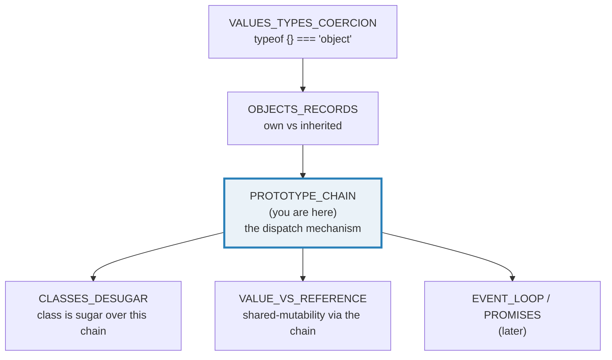
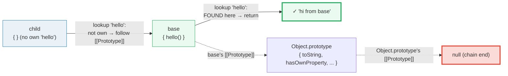
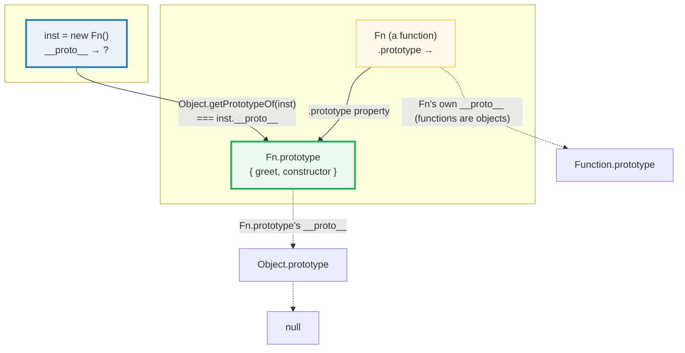
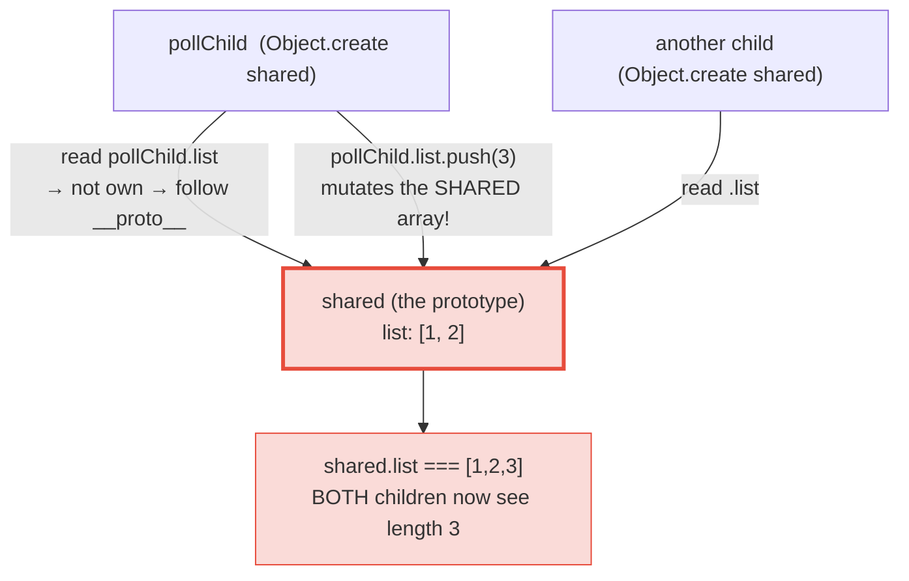

# PROTOTYPE_CHAIN — `[[Prototype]]`, the Lookup Walk, `Object.create`, `new`, & the `__proto__`/`.prototype` Split

> **Goal (one line):** show, by printing every link, how JavaScript's
> `[[Prototype]]` chain is THE dispatch mechanism — every object carries a hidden
> link to another object, property lookup WALKS that chain until found or `null`,
> and `class` is just sugar layered on top of it.
>
> **Run:** `just run prototype_chain`
>
> **Ground truth:** [`core/prototype_chain.ts`](./core/prototype_chain.ts) →
> captured stdout in
> [`core/prototype_chain_output.txt`](./core/prototype_chain_output.txt).
> Every link, value, and chain walk below is pasted **verbatim** from that file
> under a `> From prototype_chain.ts Section X:` callout. Nothing is hand-computed.
>
> **Prerequisites:** 🔗 [`VALUES_TYPES_COERCION`](./VALUES_TYPES_COERCION.md) —
> it pinned that objects are mutable, shared-by-reference values
> (`typeof {} === "object"`). 🔗 [`OBJECTS_RECORDS`](./OBJECTS_RECORDS.md) — it
> opened the object up and distinguished **own** from **inherited** properties,
> but deferred *where the inherited ones come from*. **Answer: this bundle.**

---

## 1. Why this bundle exists (lineage)

JavaScript has **prototypal inheritance**, not class-based inheritance. Every
object has a hidden internal slot called **`[[Prototype]]`** pointing to another
object (or `null`). When you read a property — `obj.foo`, `[].map`,
`(42).toFixed`, the `speak()` on a `class Animal` instance — the runtime does a
**lookup walk**: it checks the object's own properties, and if the key is not
there it follows the `[[Prototype]]` link to the next object, and the next,
until the key is found **or** the walk reaches `null` (the chain's end). That
walk *is* method dispatch in JS.

The root of (almost) every chain is **`Object.prototype`**, and `Object.prototype`'s
own `[[Prototype]]` is **`null`** — the spec-mandated terminator. This is why
*every* plain object has `.toString`, `.hasOwnProperty`, `.valueOf` for free:
those live on `Object.prototype`, and the lookup walk finds them.

The `class` keyword (🔗 `CLASSES_DESUGAR`) adds **no new inheritance mechanism**:
a method declaration goes on `C.prototype`; `new C()` wires the instance's
`[[Prototype]]` to `C.prototype`; `extends` just links two prototype objects.
Understanding the chain is what makes `class` predictable.



The headline contrast with sibling languages is the whole point of this bundle:

> 🔗 [`../python/INHERITANCE_MRO.md`](../python/INHERITANCE_MRO.md) — Python
> inheritance is **class-based with a Method Resolution Order** (the C3
> linearization): an instance has a *fixed, ordered* list of classes to search,
> computed when the class is defined. JS instead gives **every object** a single
> `[[Prototype]]` link that is **per-instance and rewireable at runtime** — there
> is no class MRO; the "order" is just the chain of links, and you can swap a
> link with `Object.setPrototypeOf` (slow, but legal).
>
> 🔗 [`../rust/TRAIT_OBJECTS.md`](../rust/TRAIT_OBJECTS.md) &amp;
> [`../rust/TRAITS_BASICS.md`](../rust/TRAITS_BASICS.md) — Rust has **no runtime
> prototype chain**: by default trait methods are **statically dispatched at
> compile time** (monomorphized, zero cost). Only *trait objects* (`&dyn Trait`)
> carry a vtable, and that vtable is **fixed at construction** — it is not a
> chain and cannot be rewired per-instance. JS's chain is the opposite: dynamic,
> per-instance, and mutable. There is no `static dispatch` in JS.

---

## 2. The mental model: one link per object, the walk to `null`

Every object has **exactly one** `[[Prototype]]` link (or `null`). The lookup
walk is a simple loop: *is the key an own property here? yes → return it; no →
follow `[[Prototype]]`; repeat; if you hit `null`, the key is `undefined`.*



> From `developer.mozilla.org/en-US/docs/Web/JavaScript/Inheritance_and_the_prototype_chain`
> (verbatim): *"Each object has an internal link to another object called its
> prototype. That prototype object has a prototype of its own, and so on until an
> object is reached with `null` as its prototype. By definition, `null` has no
> prototype and acts as the final link in this prototype chain."*

Three APIs read `[[Prototype]]` — they are equivalent in the value they return:

- **`Object.getPrototypeOf(obj)`** — the canonical reader (static method).
- **`Reflect.getPrototypeOf(obj)`** — the same operation, mirrored on the
  `Reflect` namespace (returns the identical value; not the *same function
  object*).
- **`obj.__proto__`** — the legacy **accessor** (a getter/setter inherited from
  `Object.prototype`); deprecated, but de-facto universal. Note this is distinct
  from the standardized `{ __proto__: x }` **literal syntax** (Section D).

> From prototype_chain.ts Section A:
> ```
> The [[Prototype]] link, read three equivalent ways:
>   Object.getPrototypeOf(child) === base : true
>   Reflect.getPrototypeOf(child) === base: true
>   Object.getPrototypeOf === Reflect.getPrototypeOf (same fn? false)
> [check] Object.getPrototypeOf(child) === base: OK
> [check] Reflect.getPrototypeOf(child) === base (mirror API, same value): OK
> [check] Object.getPrototypeOf({}) === Object.prototype (root): OK
> [check] Reflect.getPrototypeOf({}) === Object.prototype: OK
> ```
> ```
> THE chain end:
>   Object.getPrototypeOf(Object.prototype) === null
> [check] Object.getPrototypeOf(Object.prototype) === null (chain end!): OK
> [check] Reflect.getPrototypeOf(Object.prototype) === null: OK
> ```

**`Object.getPrototypeOf(Object.prototype) === null`** is *the* load-bearing
fact of the whole model: it is why the walk terminates. A missing property
resolves to `undefined` precisely because the walk reaches `null` without a hit
(it is **not** an error):

> From prototype_chain.ts Section A:
> ```
> Property lookup walks the chain (child has no own 'hello'):
>   Object.hasOwn(child, "hello") : false   (not on child)
>   child.hello()                : "hi from base"   (found on base via [[Prototype]])
> [check] Object.hasOwn(child, "hello") === false (it is inherited): OK
> [check] child.hello() === "hi from base" (found by walking the chain): OK
> 
> A missing property resolves to undefined (walk reached null):
>   child.nope (walked to null, found nothing): undefined
> [check] child.nope === undefined (chain walked to null, nothing found): OK
> 
> The full chain walk (rendered):
>   child -> {plain object} -> Object.prototype -> null
>   (i.e. child -> base -> Object.prototype -> null)
> ```

---

## 3. Section B — `in` (whole chain) vs `hasOwnProperty`/`Object.hasOwn` (own only)

Two ownership questions are constantly conflated. They have **different
answers** for the same key:

- **`"k" in obj`** — does the key exist *anywhere* reachable on the chain (own
  **or** inherited)?
- **`obj.hasOwnProperty("k")`** / **`Object.hasOwn(obj, "k")`** — is the key an
  **own** property of *this* object only?

A bare `{}` has **no** own properties, yet `"toString" in {}` is `true`, because
`toString` is reachable on `Object.prototype`:

> From prototype_chain.ts Section B:
> ```
> The two ownership questions on a bare {}:
>   "toString" in {}                     : true   (walks the WHOLE chain)
>   ({}).hasOwnProperty("toString")      : false   (own only)
>   Object.hasOwn({}, "toString")        : false   (own only)
> [check] "toString" in {} === true (reachable on Object.prototype): OK
> [check] {}.hasOwnProperty("toString") === false (not OWN): OK
> [check] Object.hasOwn({}, "toString") === false (not OWN): OK
> 
> Same key, different receiver — ownership is per-object:
>   Object.hasOwn(Object.prototype, "toString"): true
> [check] Object.hasOwn(Object.prototype, "toString") === true (it is defined HERE): OK
> [check] "toString" in Object.prototype === true: OK
> [check] hasOwnProperty and Object.hasOwn agree (own 'a'): OK
> ```

**`Object.hasOwn` (ES2022) vs `hasOwnProperty` (ES1).** `hasOwnProperty` is
itself an *inherited* method (it lives on `Object.prototype`). That bites for
objects with a `null` prototype (Section C) — they have no `hasOwnProperty` at
all — or objects whose own property shadows it. `Object.hasOwn` is a static
method that works on **any** object regardless of its chain, which is why it is
the modern preferred form.

**Property shadowing.** The lookup walk stops at the **first** hit walking up
from the receiver. So an own property at key `k` *hides* an inherited one at the
same `k` — it never looks further. Crucially, shadowing does **not** mutate the
prototype: it creates a fresh own property on the receiver.

> From prototype_chain.ts Section B:
> ```
> Property shadowing (own hides inherited at the same key):
>   ownShadow.b            : own-b   (own wins; lookup stops here)
>   protoShadow.b          : proto-b   (untouched — not mutated)
>   Object.hasOwn(ownShadow,"b"): true
> [check] ownShadow.b === "own-b" (own property shadows inherited): OK
> [check] protoShadow.b === "proto-b" (shadowing does NOT mutate the prototype): OK
> [check] Object.hasOwn(ownShadow, "b") === true (the shadow is an own property): OK
> ```

> 🔗 `OBJECTS_RECORDS` — the `for...in` loop enumerates **inherited enumerable**
> properties too (another reason `hasOwnProperty`/`Object.hasOwn` matter inside
> it). That bundle covers enumerability and ownership in depth.

---

## 4. Section C — `Object.create` + the `function.prototype`/`new` link (THE payoff)

There are several ways to **set** a `[[Prototype]]`. The two you must internalize:

- **`Object.create(proto)`** — create a **new** object whose `[[Prototype]]` is
  `proto`. The preferred way to set the prototype **at creation** (engines can
  optimize it; no later rewire). `Object.create(null)` yields a genuinely
  prototype-less object — the clean "dictionary" that inherits *nothing* (no
  `toString`, no `hasOwnProperty`, no risk of colliding with `__proto__`).

- **The `function` + `new` link.** A function (and *only* a function) has a
  `.prototype` property. `new Fn()` sets the instance's `[[Prototype]]` to
  `Fn.prototype`. This is THE mechanism that constructor-function "inheritance"
  and `class` both rest on.

**THE classic confusion — `__proto__` vs `.prototype` — pinned once and for all:**

| | `__proto__` | `.prototype` |
|---|---|---|
| What it is | the **actual `[[Prototype]]` link** | a plain property |
| Lives on | **every object** (instances) | **functions only** |
| Meaning | "who do I inherit from?" | "what will my *instances* inherit from?" |
| Read via | `Object.getPrototypeOf(obj)` / `Reflect.getPrototypeOf(obj)` | `Fn.prototype` |

They are different properties on different things, despite the name clash. An
*instance*'s `__proto__` **equals** its constructor's `.prototype` — that is the
*one* relationship that ties them together:



> From prototype_chain.ts Section C:
> ```
> Object.create(proto) — set the [[Prototype]] at creation:
>   o.greet()                          : "hi"   (inherited)
>   Object.getPrototypeOf(o) === proto : true
> [check] o.greet() === "hi" (inherited from the Object.create prototype): OK
> [check] Object.getPrototypeOf(o) === greeterProto: OK
> 
> Object.create(null) — a prototype-less object (the clean dict):
>   Object.getPrototypeOf(dict) === null : true
>   typeof (dict as object).toString     : undefined   (NOT inherited — none exists)
> [check] Object.getPrototypeOf(dict) === null (truly prototype-less): OK
> [check] dict.toString is undefined at runtime (no Object.prototype reached): OK
> ```
> ```
> The function.prototype + new link (instances chain to Fn.prototype):
>   inst.greet()                                : "hi"
>   Object.getPrototypeOf(inst) === Fn.prototype: true
>   Fn.prototype.constructor === Fn             : true
> [check] inst.greet() === "hi" (inherited from Fn.prototype): OK
> [check] Object.getPrototypeOf(new Fn()) === Fn.prototype (the new link): OK
> [check] Fn.prototype.constructor === Fn (the back-reference): OK
> [check] inst.__proto__ === Fn.prototype (the INSTANCE link === the FUNCTION's .prototype target): OK
> 
> __proto__ vs .prototype — two different links on two different things:
>   Object.getPrototypeOf(inst)   === Fn.prototype  (INSTANCE link)
>   Object.getPrototypeOf(Fn)     === Function.prototype  (Fn is itself an object: a function)
>   Fn.prototype                  is the object instances chain to
> [check] Object.getPrototypeOf(Fn) === Function.prototype (functions are objects; they chain to Function.prototype): OK
> [check] Object.create(Fn.prototype) wires the same [[Prototype]] as new Fn(): OK
> [check] Object.create(Fn.prototype).greet() === "hi" (same inherited method): OK
> ```

Note the last two checks: `Object.create(Fn.prototype)` **mimics `new Fn()`** —
it wires the identical `[[Prototype]]` (MDN documents this equivalence). The
difference is that `Object.create` does **not** run the constructor body, so any
`this.x = ...` initialization is skipped.

**`Fn.prototype.constructor === Fn`** is the back-reference every default
prototype carries. It is how `instance.constructor` traces back to the factory —
and it is why **re-assigning** `Fn.prototype = Object.create(...)` (rather than
*mutating* it) silently drops `constructor` and is a classic footgun.

---

## 5. Section D — Built-in chains + `Object.setPrototypeOf` (rewire, discouraged)

Every literal desugars to a constructor whose `.prototype` sits in the chain.
This is why arrays get `.map`/`.forEach`/`.filter` "for free": those methods live
on `Array.prototype`, one hop up from every array instance.

> From prototype_chain.ts Section D:
> ```
> Built-in chains (literal -> Constructor.prototype -> Object.prototype -> null):
>   [] -> Array.prototype -> Object.prototype -> null
>   fn -> Function.prototype -> Object.prototype -> null
> [check] Object.getPrototypeOf([]) === Array.prototype: OK
> [check] Object.getPrototypeOf(Array.prototype) === Object.prototype: OK
> [check] Object.getPrototypeOf(Object.prototype) === null (chain end): OK
> [check] Array.prototype.__proto__ === Object.prototype (legacy accessor agrees): OK
> [check] function f(){} chains to Function.prototype: OK
> [check] Function.prototype chains to Object.prototype: OK
> [check] Object.hasOwn([], "map") === false (map is inherited, not own): OK
> [check] "map" in [] === true (reachable on Array.prototype): OK
> [check] Array.prototype.map === [].map (same function, shared by all arrays): OK
> ```

The payoff of the chain: `[].map` is **not own** on the array — it is reached by
walking one hop to `Array.prototype`. And `Array.prototype.map === [].map`:
every array shares the *same* function object (one copy in memory, not one per
instance — that is the whole point of putting methods on the prototype).

**`Object.setPrototypeOf` rewires an existing object's `[[Prototype]]`** — but
MDN is blunt about the cost:

> From `developer.mozilla.org/.../Object/setPrototypeOf` (verbatim): *"Changing
> the `[[Prototype]]` of an object is, by the nature of how modern JavaScript
> engines optimize property accesses, currently a very slow operation in every
> browser and JavaScript engine… you should avoid setting the `[[Prototype]]` of
> an object. Instead, create a new object with the desired `[[Prototype]]` using
> `Object.create()`."*

Engines attach an **inline cache** to each call site that records "the property
is at depth N on this shape"; rewiring the chain invalidates those caches and
forces de-optimization. Prefer setting the prototype **at creation**:
`Object.create(proto)`, the `{ __proto__: proto }` literal, or `class extends`.

> From prototype_chain.ts Section D:
> ```
> Object.setPrototypeOf — rewire an existing object's [[Prototype]] (slow!):
>   obj.rewired before setProto: undefined   (undefined — not on the chain)
>   typeof obj.rewired after     : function
> [check] Object.setPrototypeOf rewires: Object.getPrototypeOf(obj) === newProto: OK
> [check] obj.rewired is now reachable ("function"): OK
> 
> __proto__ literal setter (standardized, optimized — set at creation):
>   viaLiteral.inherited: 42   (inherited via __proto__ literal)
>   viaLiteral.own      : 1   (own)
> [check] Object.getPrototypeOf(viaLiteral) === parentLit (via __proto__ literal): OK
> [check] viaLiteral.inherited === 42 (inherited through the literal-set prototype): OK
> ```

Note the distinction MDN draws: the **`{ __proto__: x }` literal syntax** is
**standardized and optimized** (it sets the prototype at creation, like
`Object.create`). That is *different* from the **`Object.prototype.__proto__`
accessor** (`obj.__proto__ = ...`), which is **deprecated**. Same spelling, two
different mechanisms — prefer `Object.create` or the literal, never the accessor.

---

## 6. Section E — `class` is sugar + the prototype-pollution gotcha

**`class` adds no new inheritance mechanism.** A method declaration lands on
`C.prototype`; an instance field becomes an **own** property of each instance; a
`static` method lands on `C` itself (the class is a function object). The deep
dive is 🔗 `CLASSES_DESUGAR`; here we only confirm it is the *same* chain:

> From prototype_chain.ts Section E:
> ```
> class is sugar over [[Prototype]] — same chain, nicer syntax:
>   Object.getPrototypeOf(a) === Animal.prototype : true
>   Object.hasOwn(Animal.prototype, "speak")      : true   (method lives here)
>   Object.hasOwn(a, "speak")                     : false   (NOT own on the instance)
>   Object.hasOwn(a, "kind")                      : true   (field IS own)
>   Object.hasOwn(Animal, "kingdom")              : true   (static is on the class)
>   a.speak()                                     : "..."   (inherited via the chain)
> [check] Object.getPrototypeOf(new Animal()) === Animal.prototype: OK
> [check] Object.hasOwn(Animal.prototype, "speak") === true (method on the prototype): OK
> [check] Object.hasOwn(a, "speak") === false (method NOT own on the instance): OK
> [check] Object.hasOwn(a, "kind") === true (instance FIELD is own): OK
> [check] Object.hasOwn(Animal, "kingdom") === true (static is own on the class function): OK
> [check] a.speak() === "..." (inherited method, dispatched via the chain): OK
> [check] Animal.kingdom() === "Animalia" (static, NOT inherited by instances): OK
> [check] a instanceof Animal (walks the chain, finds Animal.prototype): OK
> [check] a instanceof Object (Object.prototype is further up the SAME chain): OK
> ```

**`instanceof` walks the chain too:** `a instanceof C` is true iff `C.prototype`
appears *anywhere* on `a`'s `[[Prototype]]` chain. That is why `a instanceof
Object` is true for every plain object — `Object.prototype` is always near the
top. (🔗 `TYPE_NARROWING` owns the full `instanceof` treatment; here it is just
one more chain walk.)

**THE prototype-pollution / shared-state gotcha.** Reading an inherited
**object/array** property returns the **shared prototype object**. Calling a
**mutator** on it (`push`, `splice`, assigning a sub-key) mutates the prototype
itself — visible to *every* object that shares it. Contrast with assigning a
**new primitive** to the key, which creates a fresh **own** property (a shadow)
and leaves the prototype untouched.



> From prototype_chain.ts Section E:
> ```
> Prototype-pollution gotcha (inherited array is SHARED state):
>   shared.list after pollChild.list.push(3): [1,2,3]   <-- PROTOTYPE MUTATED
> [check] prototype pollution: pollChild.list.push(3) mutated shared.list: OK
> [check] both children see the mutation (shared reference): OK
> 
> Safe counterpart — assigning a NEW value shadows (no mutation):
>   safeChild.count after =99 : 99   (own)
>   shared2.count (untouched) : 0
> [check] assigning a new value shadows: shared2.count still 0 (not mutated): OK
> [check] assigning a new value shadows: safeChild.count === 99 (own): OK
> [check] Object.hasOwn(safeChild, "count") === true (the shadow is own): OK
> [check] JS chain is DYNAMIC: dispatch changed by Object.setPrototypeOf (no static dispatch): OK
> [check] JS chain is REWIREABLE per-instance (each Object.create sets its own link): OK
> ```

The rule of thumb: **a read-mutate of an inherited reference value pollutes; an
assignment to the key itself shadows.** (`pollChild.list.push(3)` reads `.list`
→ shared array → mutates it; `safeChild.count = 99` writes a new own `count`.)
This is the prototype-flavored instance of the shared-mutability bug class that
🔗 `VALUE_VS_REFERENCE` treats in full — and it is also the mechanism behind
real-world **prototype-pollution security attacks** (untrusted input writing to
`__proto__`/`constructor.prototype`). The defense is the same as for the dict
pattern: `Object.create(null)` where you store untrusted keys, so there is no
chain to pollute.

> 🔗 `../python/MEMORY_MODEL.md` — Python's class attributes have the **same**
> shared-state hazard: a mutable class attribute (a list/dict) is shared across
> all instances, and mutating `instance.attr` where `attr` is an inherited
> mutable object mutates the class attribute. The bug class is identical; only
> the lookup machinery (MRO vs chain) differs.

---

## 7. Pitfalls (the expert payoff)

| Trap | Symptom | Fix |
|---|---|---|
| Confusing `__proto__` with `.prototype` | "`inst.prototype` is `undefined`!" / "where does `.map` come from?" | `__proto__`/`getPrototypeOf` = the link on **instances**; `.prototype` = the property on **functions** that `new` wires instances to. An instance's `__proto__` === its constructor's `.prototype`. |
| `obj.__proto__ = ...` to set a prototype | Deprecated accessor; silently fails for non-object values; de-optimizes | Use `Object.create(proto)` at creation, or the `{ __proto__: proto }` literal — never the accessor. |
| `Object.setPrototypeOf` in a hot path | Very slow: invalidates inline caches, forces de-opt | Set the prototype **once at creation** (`Object.create` / `__proto__` literal / `class extends`). |
| Prototype pollution via shared mutable props | `child.items.push(x)` mutates the prototype's array → all siblings see it | Don't store mutable defaults on the prototype; create fresh per-instance (`this.items = []` in the constructor), or use `Object.create(null)` for untrusted-key dicts. |
| `"k" in obj` to test "is `k` set?" | Returns `true` for inherited props (e.g. `"toString" in {}`) | Use `Object.hasOwn(obj, "k")` (or `obj.hasOwnProperty("k")`) for own-only. |
| `for...in` leaking inherited enumerable keys | Iterates inherited props too; integer-like keys reorder | Use `Object.keys()`/`Object.entries()` (own, string keys); filter with `Object.hasOwn` inside `for...in`. |
| `hasOwnProperty` missing on a null-prototype object | `dict.hasOwnProperty("k")` → `TypeError` (no chain) | Use the **static** `Object.hasOwn(dict, "k")` — works on any object. |
| Re-assigning `Fn.prototype = ...` | Drops the `constructor` back-reference; splits old/new instances onto different prototypes | Mutate `Fn.prototype` in place (`Object.setPrototypeOf(Fn.prototype, ...)`) or re-add `constructor`, or just use `class extends`. |
| `obj.constructor` to detect the type | Unreliable: `constructor` is an inherited, writable, shadowable prototype property; `Object.create(null)` has none | Use `instanceof` or `Object.getPrototypeOf` for identity, not `constructor`. |
| Treating the chain like a Python MRO | Expecting a fixed ordered list of "classes" | There is no MRO — each object has **one** `[[Prototype]]` link; the "order" is the chain of links, per-instance and rewireable. |
| Assuming `class` introduced a new model | "How does `extends` *really* work?" | `class` is sugar: methods → `C.prototype`; `extends` → `Object.setPrototypeOf(Child.prototype, Parent.prototype)`; `new` wires `[[Prototype]]`. Same chain. |
| `Object.create(null)` then `dict.toString()` | `TypeError: dict.toString is not a function` (no `Object.prototype` reached) | It's a *feature* (clean dict); call `Object.prototype.toString.call(dict)` if you really need it. |

---

## 8. Cheat sheet

```typescript
// === [[Prototype]]: every object has ONE link (or null) ===================
//   Object.getPrototypeOf(obj)   // canonical reader  -> object | null
//   Reflect.getPrototypeOf(obj)  // mirror API        -> object | null
//   obj.__proto__                // legacy accessor (deprecated; use getPrototypeOf)
//   Object.getPrototypeOf(Object.prototype) === null  // THE chain end

// === The lookup walk =======================================================
//   obj.foo -> own? -> obj.__proto__.foo -> ... -> found, or null -> undefined
//   (a missing property is `undefined`, never an error)

// === `in` (whole chain) vs own-only ========================================
//   "toString" in {}                    // true   (reachable on Object.prototype)
//   {}.hasOwnProperty("toString")       // false  (ES1, inherited method)
//   Object.hasOwn({}, "toString")       // false  (ES2022 static — preferred)

// === Setting [[Prototype]] (PREFER at creation) ============================
//   Object.create(proto)                // new obj whose [[Prototype]] === proto
//   Object.create(null)                 // prototype-less dict (no toString!)
//   { __proto__: proto, ...own }        // standardized literal setter (optimized)
//   function Fn(){}; new Fn()           // instance.__proto__ === Fn.prototype
//   Object.setPrototypeOf(obj, proto)   // REWIRE (slow! de-opts) — avoid in hot paths
//   Object.getPrototypeOf(new Fn()) === Fn.prototype   // the `new` link

// === __proto__ vs .prototype (THE payoff) ==================================
//   __proto__   = the actual [[Prototype]] link, on EVERY object (instances)
//   .prototype  = a property on FUNCTIONS only; what `new` wires instances to
//   inst.__proto__ === Fn.prototype   // the ONE relationship tying them together
//   Fn.prototype.constructor === Fn   // the back-reference

// === Built-in chains =======================================================
//   []             -> Array.prototype    -> Object.prototype -> null
//   function f(){} -> Function.prototype -> Object.prototype -> null
//   ({}).map       // undefined  — plain objects don't reach Array.prototype

// === class is sugar (same chain) ===========================================
//   class C { f(){} static s(){} x=1 }
//   //   C.prototype.f        (method)
//   //   C.s                   (static, own on C the function)
//   //   new C().x             (instance FIELD -> own property)
//   //   Object.getPrototypeOf(new C()) === C.prototype

// === Gotcha: prototype pollution ===========================================
//   const p = { list: [] };
//   const c = Object.create(p);
//   c.list.push(1);            // MUTATES the shared p.list! (read -> mutate)
//   c.list = [1];              // SAFE: creates own 'list' (shadow), p untouched
```

---

## Sources

Every link, lookup result, and behavioral claim above is asserted at runtime by
the `.ts` itself (`check()` throws on any mismatch) — the strongest possible
verification: the actual V8 engine's verdict. Every signature and the
spec-mandated chain-termination fact were additionally verified against the MDN
Web Docs and corroborated by at least one independent secondary source.

- **MDN — Inheritance and the prototype chain** (the foundational guide:
  *"`null` has no prototype and acts as the final link in this prototype chain"*;
  property lookup walk and shadowing; the `__proto__` literal vs the deprecated
  accessor; `Object.getPrototypeOf(new Box()) === Box.prototype`;
  `Object.getPrototypeOf(Object.prototype) === null`; `Constructor.prototype.constructor`;
  the warning against monkey-patching built-in prototypes; the `Object.create(null)`
  dict; performance of `setPrototypeOf`):
  https://developer.mozilla.org/en-US/docs/Web/JavaScript/Inheritance_and_the_prototype_chain
- **MDN — `Object.create()`** (*"creates a new object, using an existing object
  as the prototype"*; `Object.create(null)` ≡ `{ __proto__: null }`;
  `Object.create(Constructor.prototype)` mimics `new`; the
  `propertiesObject`/property-descriptor second argument):
  https://developer.mozilla.org/en-US/docs/Web/JavaScript/Reference/Global_Objects/Object/create
- **MDN — `Object.getPrototypeOf()`** (*"returns the prototype… the value of the
  internal `[[Prototype]]` property… which may be `null`"*; non-object coercion
  behavior across ES5/ES2015):
  https://developer.mozilla.org/en-US/docs/Web/JavaScript/Reference/Global_Objects/Object/getPrototypeOf
- **MDN — `Object.setPrototypeOf()`** (the verbatim performance warning quoted in
  §5; immutable-prototype exotic objects like `Object.prototype`; the preference
  for `Object.create`):
  https://developer.mozilla.org/en-US/docs/Web/JavaScript/Reference/Global_Objects/Object/setPrototypeOf
- **MDN — `Reflect.getPrototypeOf()`** (the mirror of `Object.getPrototypeOf`;
  returns `object | null`): https://developer.mozilla.org/en-US/docs/Web/JavaScript/Reference/Global_Objects/Reflect/getPrototypeOf
- **MDN — `Object.prototype.__proto__`** (the deprecated accessor; distinction
  from the standardized `{ __proto__: x }` literal syntax):
  https://developer.mozilla.org/en-US/docs/Web/JavaScript/Reference/Global_Objects/Object/proto
- **MDN — `Object.hasOwn()`** (ES2022; static; works on null-prototype objects
  unlike the inherited `hasOwnProperty`):
  https://developer.mozilla.org/en-US/docs/Web/JavaScript/Reference/Global_Objects/Object/hasOwn
- **MDN — `hasOwnProperty()`** and the **`in` operator**
  (own-only vs whole-chain): https://developer.mozilla.org/en-US/docs/Web/JavaScript/Reference/Global_Objects/Object/hasOwnProperty
  and https://developer.mozilla.org/en-US/docs/Web/JavaScript/Reference/Operators/in
- **ECMAScript® 2027 Language Specification (tc39.es/ecma262)**:
  - `[[Get]]` / the ordinary-object property lookup algorithm (the chain walk):
    https://tc39.es/ecma262/multipage/ordinary-and-exotic-objects-behaviours.html
  - `Object.create` (§sec-object.create), `Object.getPrototypeOf`
    (§sec-object.getprototypeof), `Object.setPrototypeOf`
    (§sec-object.setprototypeof):
    https://tc39.es/ecma262/multipage/fundamental-objects.html

**Secondary corroboration (independent of MDN, ≥1 per major claim):**
- Axel Rauschmayer (2ality) — *"JavaScript terminology: the two prototypes"*
  (the canonical disambiguation of `__proto__` the instance link vs `prototype`
  the function property; the "`[[Prototype]]` internal property" framing):
  https://2ality.com/2013/01/two-prototypes.html
- Axel Rauschmayer (2ality) — *"An easy way to understand JavaScript's prototypal
  inheritance"* (using `__proto__` to override/delegate; method dispatch via the
  chain): https://2ality.com/2010/12/javascripts-prototypal-inheritance.html
- Mathias Bynens — *"JavaScript engine fundamentals: optimizing prototypes"*
  (the V8 inline-cache story behind *why* `Object.setPrototypeOf` is slow —
  cited by MDN's `setPrototypeOf` page):
  https://mathiasbynens.be/notes/prototypes

**Facts that could not be verified by running this bundle** (documented, not
executed, because they are language-design facts about *other* languages):
Python's C3-linearized MRO being a fixed ordered list computed at class-definition
time (🔗 `../python/INHERITANCE_MRO.md`), and Rust's trait methods being
statically dispatched / trait-object vtables being fixed at construction with no
runtime rewireable chain (🔗 `../rust/TRAIT_OBJECTS.md`) — these are stated only
as contrasts and are verified in their own bundles. Every claim *about the JS
prototype chain* above is asserted by the `.ts` at runtime under V8.
