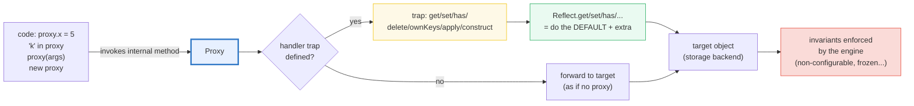

# PROXY_REFLECT — `Proxy` Traps + `Reflect` Forwarding: JS's Runtime Metaprogramming

> **Goal (one line):** show, by printing every intercept, how `Proxy` traps the
> fundamental operations on an object (`get`/`set`/`has`/`delete`/`ownKeys`/
> `apply`/`construct`) and how `Reflect` forwards a trap back to the default
> behavior — pinning validation, observability, revocation, and the invariant
> guarantees as `check()`'d invariants.
>
> **Run:** `just run proxy_reflect`
>
> **Ground truth:** [`metaprog/proxy_reflect.ts`](./metaprog/proxy_reflect.ts)
> → captured stdout in
> [`metaprog/proxy_reflect_output.txt`](./metaprog/proxy_reflect_output.txt).
> Every intercept/table below is pasted **verbatim** from that file under a
> `> From proxy_reflect.ts Section X:` callout. Nothing is hand-computed.
>
> **Prerequisites:** 🔗 [`OBJECTS_RECORDS`](./OBJECTS_RECORDS.md) (property
> descriptors — `Reflect.defineProperty` mirrors them), 🔗
> [`PROTOTYPE_CHAIN`](./PROTOTYPE_CHAIN.md) (proxy + prototype interplay).

---

## 1. Why this bundle exists (lineage)

Every JavaScript object exposes a fixed set of **internal methods** —
`[[Get]]`, `[[Set]]`, `[[HasProperty]]`, `[[Delete]]`, `[[OwnPropertyKeys]]`,
and (for functions) `[[Call]]` and `[[Construct]]`, plus a handful of
prototype/extensibility methods. There is nothing magical about `obj.x` or
`x in obj` or `delete obj.x` or `f()` or `new C()`: each is *just* an
invocation of one of those internal methods. **`Proxy` lets a `handler`
override them with *traps***, so a read, a write, an `in` check, a `delete`,
an `Object.keys`, even a function **call** or **`new`**, can all be
intercepted at **runtime**, transparently to the caller.

`Reflect` is the companion object: it exposes the **same** operations as plain
functions, so a trap can do its extra work and then **forward to the default**
via `Reflect.get(target, prop, receiver)`. The two share an identical trap
vocabulary:



This is JavaScript's **runtime metaprogramming** engine: validation, logging,
virtualization, negative-array-indexing, observability — all implemented at
runtime, behind the same interface the caller always used. That runtime
property is the headline cross-language contrast:

> 🔗 [`../rust/MACRO_RULES.md`](../rust/MACRO_RULES.md) and
> [`../rust/PROC_MACROS.md`](../rust/PROC_MACROS.md) — Rust's metaprogramming is
> **compile-time code generation**: `macro_rules!` and procedural macros expand
> *before* the program runs. There is **no runtime interception** — you cannot
> trap a `struct` field access at runtime in safe Rust. JS `Proxy` is the
> opposite: the trap fires *on every access, forever*, at runtime.
>
> 🔗 [`../python/METACLASSES.md`](../python/METACLASSES.md) — Python is the
> **closest sibling**: `__getattr__`/`__setattr__` and metaclasses intercept
> attribute access and class *creation* at runtime, exactly the idea `Proxy`
> generalizes. The difference: Python's hooks are per-class magic methods;
> JS's traps are a uniform handler object you can wrap around *any* target.

In the TS expertise spine, this bundle sits where **objects meet their
dispatch mechanism**: a `Proxy` is itself an *exotic object* whose internal
methods are the traps. To understand it you need 🔗 `OBJECTS_RECORDS`
(descriptors), 🔗 `PROTOTYPE_CHAIN` (the `get` trap sits *in front of* the
prototype walk), and the value-vs-reference axis (a proxy **aliases** its
target — `proxy.x` and `target.x` see the same storage unless a trap lies).

---

## 2. The mental model: 13 traps, and what each intercepts

`new Proxy(target, handler)` returns an object that forwards every operation to
`target` **unless** a trap is defined on `handler`. All traps are optional; an
empty `{}` handler is a transparent **passthrough**. The 13 traps map 1:1 to
the object internal methods (MDN "Proxy" / "handler"):

| Operation in code | Internal method | Trap | `Reflect` forward |
|---|---|---|---|
| `proxy.x` / `proxy[k]` | `[[Get]]` | `get(t, p, receiver)` | `Reflect.get` |
| `proxy.x = v` | `[[Set]]` | `set(t, p, v, receiver)` | `Reflect.set` |
| `k in proxy` | `[[HasProperty]]` | `has(t, p)` | `Reflect.has` |
| `delete proxy.x` | `[[Delete]]` | `deleteProperty(t, p)` | `Reflect.deleteProperty` |
| `Object.keys`/`getOwnPropertyNames` | `[[OwnPropertyKeys]]` | `ownKeys(t)` | `Reflect.ownKeys` |
| `Object.defineProperty` | `[[DefineOwnProperty]]` | `defineProperty(t, p, desc)` | `Reflect.defineProperty` |
| `Object.getOwnPropertyDescriptor` | `[[GetOwnProperty]]` | `getOwnPropertyDescriptor(t, p)` | `Reflect.getOwnPropertyDescriptor` |
| `Object.getPrototypeOf` | `[[GetPrototypeOf]]` | `getPrototypeOf(t)` | `Reflect.getPrototypeOf` |
| `Object.setPrototypeOf` | `[[SetPrototypeOf]]` | `setPrototypeOf(t, proto)` | `Reflect.setPrototypeOf` |
| `Object.isExtensible` | `[[IsExtensible]]` | `isExtensible(t)` | `Reflect.isExtensible` |
| `Object.preventExtensions` | `[[PreventExtensions]]` | `preventExtensions(t)` | `Reflect.preventExtensions` |
| `proxy(...args)` *(target is a fn)* | `[[Call]]` | `apply(t, thisArg, args)` | `Reflect.apply` |
| `new proxy(...args)` *(target is a fn)* | `[[Construct]]` | `construct(t, args, newTarget)` | `Reflect.construct` |

The headline facts, pinned by Section A as runtime asserts:

- A **passthrough** proxy (`handler === {}`) is observationally identical to the
  target for plain objects — reads return target values, writes land on the
  target.
- The **`get` trap** intercepts reads (logging, virtualization, defaults).
- The **`set` trap** intercepts writes and can **validate**: returning `false`
  fails the assignment (in strict mode, that's a `TypeError`).

> From `developer.mozilla.org/en-US/docs/Web/JavaScript/Reference/Global_Objects/Proxy`
> (verbatim): *"You create a `Proxy` with two parameters: `target` ... and
> `handler`, an object that defines which operations will be intercepted ... If
> the handler is the empty object, the proxy behaves just like the original
> target. Handler functions are sometimes called traps."* And on the validation
> idiom: the `set()` handler that rejects an invalid value must *"Indicate
> success"* by `return true`, and otherwise the assignment fails.

> From proxy_reflect.ts Section A:
> ```
> passthrough.name = Alice
> target.age after proxy write = 31
> [check] passthrough proxy returns target values: OK
> [check] passthrough write forwards to target: OK
> reads recorded: ["x","y","x"]
> [check] get trap records reads in order: OK
> person.age after valid set = 25
> [check] set trap accepts a valid age: OK
>   person.age = 999 (invalid): threw TypeError (observed)
>   person.age after rejected write = 25 (unchanged)
> [check] set trap rejects invalid age (returns false -> strict TypeError): OK
> [check] rejected value never landed on the target: OK
> ```

**Why a `set` trap returning `false` throws in strict mode.** The `[[Set]]`
internal method returns a boolean: `true` = the property was set, `false` = it
was not. In **strict-mode code** (and ESM is *always* strict), the `obj.x = v`
syntax checks that boolean and throws a `TypeError` when it is `false`. So a
validating `set` trap that `return false`s for a bad value makes `person.age =
999` throw — *and* because the trap returns *before* calling `Reflect.set`, the
target is never poisoned (`person.age` stays `25`). This is exactly how you
build a runtime-validated record without a schema library.

> 🔗 [`OBJECTS_RECORDS`](./OBJECTS_RECORDS.md) — the `set`/`defineProperty`
> traps sit on top of the **property descriptor** model (writable/configurable/
> enumerable). A frozen/non-configurable property cannot be silently mutated
> even through a proxy — see Section 4's invariants.

---

## 3. Section B — `Reflect.*`: forward to the default

`Reflect` is *not* a constructor — it is a namespace of static functions (like
`Math`) whose names match the proxy traps one-for-one. Its purpose, per MDN:
*"The major use case of `Reflect` is to provide default forwarding behavior in
`Proxy` handler traps."* Inside a trap, `Reflect.<op>(target, ...)` runs *the
same algorithm the engine would have run with no trap*, so the pattern is
always: *do your extra work, then `return Reflect.<op>(...)`.*

The expert nuances:
- `Reflect.set`/`Reflect.defineProperty`/`Reflect.deleteProperty` **return a
  boolean** (success/failure) instead of throwing — composable inside a trap.
- `Reflect.has` *is* the `in` operator as a function (checks own + inherited).
- `Reflect.ownKeys` returns own string **and** symbol keys in spec order:
  integer-like keys ascending, then other strings in insertion order, then
  symbols in insertion order.

> From proxy_reflect.ts Section B:
> ```
> Reflect.get(o, "k") = 42
> o.k               = 42
> [check] Reflect.get(t,'k') === t.k (forward-to-default): OK
> Reflect.set(o,'k',100) -> true; o.k now 100
> [check] Reflect.set returns true on success: OK
> [check] Reflect.set actually mutated the target: OK
> [check] Reflect.has(o,"k") === "k" in o: OK
> [check] Reflect.has(o,"absent") === false: OK
> Reflect.ownKeys({a:1, 2:2, [Symbol('s')]:3}) = ["2","a","Symbol(s)"]
> [check] Reflect.ownKeys order: integer-key, then string, then symbol: OK
> Reflect.defineProperty -> true; d.frozen = 7
> [check] Reflect.defineProperty defines a property (returns true): OK
> Reflect.deleteProperty(non-configurable 'frozen') -> false
> [check] Reflect.deleteProperty returns false on a non-configurable property: OK
> [check] non-configurable property still present after the failed delete: OK
> ```

**The key-order fact (worth memorizing).** `Reflect.ownKeys({a:1, 2:2,
[Symbol('s')]:3})` is `["2","a","Symbol(s)"]`, *not* insertion order: the
integer-like `"2"` is hoisted to the front and sorted ascending, then the
non-integer string `"a"`, then the symbol. This is the same rule that reorders
numeric object keys (🔗 `VALUES_TYPES_COERCION` pitfalls), and it is the one
place proxy/Reflect output is *not* obviously deterministic — so sort before
you print, or use a `Map`.

> 🔗 `../python/METACLASSES.md` — `Reflect` has no exact Python twin. Python's
> `getattr`/`setattr`/`hasattr` are the closest, but they are per-call builtins
> tied to `__getattr__`; `Reflect` is a *static table of the spec's own internal
> methods*, designed specifically to be the trap-forwarding primitive.

---

## 4. Section C — `has`/`deleteProperty`/`ownKeys` + `apply`/`construct`

The remaining object traps (`has`, `deleteProperty`, `ownKeys`) intercept `in`,
`delete`, and key enumeration. The two **function** traps only apply when the
target is callable: `apply` intercepts a plain **call** `proxy(...)`, and
`construct` intercepts **`new proxy(...)`** — letting you proxy a function the
same way you proxy an object.

> From proxy_reflect.ts Section C:
> ```
> "real"   in hidden = true
> "secret" in hidden = false
> [check] has trap can hide "secret" (returns false): OK
> [check] has trap still reports "real": OK
> deletions recorded: ["a"]
> [check] deleteProperty trap recorded the delete of 'a': OK
> [check] deleted property is gone; sibling survives: OK
> Object.getOwnPropertyNames(keyProxy) = ["x","y","z"]
> [check] ownKeys trap fired for Object.getOwnPropertyNames: OK
> [check] ownKeys trap forwarded the three own keys: OK
> proxiedSum(1,2,3) = 6
> calls recorded   = [[1,2,3]]
> [check] apply trap intercepts the function call (forwarded result correct): OK
> [check] apply trap recorded the argument list: OK
> new ProxiedThing(7).id = 7
> [check] construct trap intercepts `new` (instance built correctly): OK
> [check] construct trap observed the argument count: OK
> ```

**`has` can hide a key, but `get` still returns its value.** The traps are
independent: making `"secret" in proxy` return `false` does *not* stop
`proxy.secret` from returning data via the `get` trap (there is no `get` trap
in Section C's `hidden`, so it forwards to the target where `secret`... is
absent anyway). This independence is powerful but a footgun: keep your traps
*consistent*, or `in` and `get` will disagree.

**`apply`/`construct` make a function observable.** Because the target is a
function, the proxy is *callable* and *constructable*: `proxiedSum(1,2,3)` runs
the `apply` trap (which logs the args and forwards via `Reflect.apply`), and
`new ProxiedThing(7)` runs the `construct` trap. `Reflect.construct(t, args,
newTarget)` is the *only* way to forward a construct while preserving
`new.target` — essential for correct subclassing.

> 🔗 [`CLASSES_DESUGAR`](./CLASSES_DESUGAR.md) — `new.target` and the
> `construct` trap are how the class desugaring (`[[Construct]]` + `new.target`)
> stays correct under a proxy. Decorators (🔗 `DECORATORS`, Phase 6) are a
> *related* metaprogramming tool, but decorators **wrap a definition once** at
> class-evaluation time; a `Proxy` **wraps an instance** and intercepts every
> operation forever.

---

## 5. Section D — `Proxy.revocable` + invariants (the engine's guardrails)

`Proxy.revocable(target, handler)` returns `{ proxy, revoke }`. The proxy works
normally until `revoke()` is called; afterward **any operation that would
trigger a trap throws `TypeError`**, permanently. Crucially, `typeof` does
**not** invoke a trap, so `typeof revokedProxy` is still `"object"` even after
revocation — the only way to "detect" a revoked proxy is to *try* an operation
and catch.

The **invariants** are the more subtle guardrail: the proxy engine *enforces
language semantics even inside a trap*. The classic case — a
**non-configurable, non-writable** data property's `get` trap **must** return
the property's real value; returning anything else throws `TypeError`. This is
why `Object.freeze`'d state stays frozen even behind a proxy, and why Vue 3
*cannot* make a frozen object reactive.

> From proxy_reflect.ts Section D:
> ```
> pre-revoke  proxy.msg = hi
> [check] revocable proxy works before revoke: OK
>   post-revoke read proxy.msg: threw TypeError (observed)
> [check] post-revoke: any operation throws TypeError: OK
> [check] typeof revoked proxy === "object" (typeof triggers NO trap): OK
> get trap returns 'LIE' for a non-configurable non-writable 'p':
>   lyingProxy.p: threw TypeError (observed)
> [check] get-trap invariant: lying about a non-configurable non-writable prop throws: OK
> ```

**Why revocability matters for GC and security.** Per MDN, the `revoke`
function detaches `target` and `handler` from the proxy: *"if `target` is not
referenced elsewhere, it will ... be eligible for garbage collection, even when
its proxy is still alive."* So handing a caller a *revocable* proxy lets you
control the lifetime of the access you granted — revoke it, and their
reference becomes a dead handle that throws on any use.

> From `developer.mozilla.org/en-US/docs/Web/JavaScript/Reference/Global_Objects/Proxy`
> (verbatim, on invariants): *"Invariants (semantics that remain unchanged)
> regarding object non-extensibility or non-configurable properties are verified
> against the target. ... If your trap implementation violates the invariants of
> a handler, a `TypeError` will be thrown."*

---

## 6. Section E — Use cases: negative indices, defaults, reactivity (Vue 3)

These three patterns show why proxies earn their keep — each is a few lines of
trap and would otherwise require rewriting every call site:

- **Negative array indexing** (`arr[-1]` → last element): a `get` trap rewrites
  a negative integer index into a positive one, Python-style.
- **Default-value object**: a `get` trap returns a default for absent keys
  instead of `undefined` (a tiny config/RPC-stub pattern).
- **Observability** — the **mini model of Vue 3 / MobX reactivity**: a `get`
  trap records *which effect depends on the property* ("track"), and a `set`
  trap *re-runs those effects* ("trigger"). Vue 3 wraps reactive state in
  exactly such a proxy.

> From proxy_reflect.ts Section E:
> ```
> negArr[-1] = 30
> negArr[-2] = 20
> negArr[0]  = 10
> [check] negative index -1 reads the last element: OK
> [check] negative index -2 reads the second-to-last: OK
> [check] positive index 0 still forwards normally: OK
> [check] negArr.length forwards via Reflect.get: OK
> withDefaults.a      = 1
> withDefaults.absent = 0
> [check] default-value proxy returns the real value when present: OK
> [check] default-value proxy returns 0 when the key is absent: OK
> reactive effects ran: ["render"]
> state.count now 1
> [check] Vue 3-style proxy: get tracks, set triggers the effect: OK
> [check] reactive set updated the underlying value: OK
> ```

**How Vue 3 actually uses this.** Vue 3's reactivity system (vuejs.org
"Reactivity in Depth") wraps each reactive object in a `Proxy` whose `get` trap
calls `track(target, key)` (recording the currently-running effect as a
dependent of that key) and whose `set` trap calls `trigger(target, key)`
(queueing those effects to re-run). This is *runtime* interception of every
property access — impossible to express in a compile-time-metaprogramming
language like Rust, and the reason Vue 3 dropped Vue 2's getter/setter rewrite
in favor of `Proxy`.

> 🔗 [`CLOSURES_CAPTURE`](./CLOSURES_CAPTURE.md) — the track/trigger sets and
> the "currently-running effect" are retained by closures; reactivity *is*
> closure-based dependency tracking driven by proxy traps.

---

## 7. Pitfalls (the expert payoff)

| Trap | Symptom | Fix |
|---|---|---|
| No-op `{}` proxy around a `Map`/`Set`/DOM node | `TypeError: method called on incompatible Proxy` | Native objects have **internal slots** (`[[MapData]]`) the proxy lacks; use a "this-recovering" trap that binds methods to the target, not the proxy. |
| `set` trap returns `false` in non-strict code | Assignment **silently fails** (no throw) | Always run in strict mode (ESM is strict by default), or have the trap `throw` explicitly. |
| `set` trap forgets `return true` | Strict-mode `TypeError: trap returned falsish` even for a *valid* set | End every `set` trap with `return Reflect.set(...)` (which returns the boolean). |
| `get` trap lies about a non-configurable/non-writable prop | `TypeError: proxy must report the same value` (the invariant) | The trap **must** return the real value for frozen/non-configurable data props — you cannot virtualize them. |
| `get` trap calls `Reflect.get(target, prop, receiver)` where `receiver` is the proxy | Private fields (`#x`) and methods break: `Cannot read private member` | The trap runs with `this === proxy`; rebind methods to the **target** (`value.apply(target, args)`) or read via `target[prop]`. |
| `ownKeys` trap omits a non-configurable key | `TypeError: trap result did not include <key>` (invariant) | `ownKeys` must include all non-configurable own keys; forward via `Reflect.ownKeys`. |
| `ownKeys`/key order looks nondeterministic | Integer-like keys hoist+sort ascending before strings | Sort before printing, or use a `Map` (insertion-ordered). |
| `has` hides a key but `get` still returns it | `in` and `[]` disagree — confusing/insecure | Keep `has` and `get` traps **consistent**. |
| Revoked proxy: `typeof` still says `"object"` | You tried to detect revocation via `typeof` | `typeof` triggers **no** trap; you must try an operation and `catch`. |
| Revoked proxy reused | Every op throws `TypeError` forever (revocation is one-way) | Treat the proxy as dead; drop the reference (revocation also enables GC of target/handler). |
| Proxies are **slow** vs. plain objects (extra trap dispatch) | Hot path regresses | Don't proxy tight inner loops; proxy at boundaries (reactive state, API stubs), not per-element. |
| `Reflect.get` inside a `get` trap that reads the **proxy** again | Infinite recursion (trap re-enters itself) | Forward against the **target**, not the proxy: `Reflect.get(target, prop, receiver)`. |

---

## 8. Cheat sheet

```typescript
// === new Proxy(target, handler) ============================================
//   - empty handler {} => transparent passthrough (reads/writes hit target)
//   - 13 traps, all optional; map 1:1 to internal methods:
//       get/set/has/deleteProperty/ownKeys/defineProperty/
//       getOwnPropertyDescriptor/getPrototypeOf/setPrototypeOf/
//       isExtensible/preventExtensions   (+ apply/construct for fn targets)
//   - proxy ALIASES its target unless a trap lies.

// === get(target, prop, receiver) : intercept reads =========================
//   return Reflect.get(target, prop, receiver);   // forward to default
//   - log/virtualize/compute/return-a-default here.
//   - INVARIANT: for a non-configurable NON-writable prop, MUST return the
//     real value or the engine throws TypeError.

// === set(target, prop, value, receiver) : intercept writes =================
//   if (invalid) return false;          // strict-mode assignment -> TypeError
//   return Reflect.set(target, prop, value, receiver);   // ALWAYS return a bool
//   - validate / coerce / log here.

// === has(target, prop) : intercepts `in` ===================================
//   - return false to HIDE a key (keep consistent with `get`).

// === apply(target, thisArg, args) / construct(target, args, newTarget) =====
//   - only when target is a FUNCTION; proxy becomes callable / constructable.
//   - Reflect.construct(t, args, newTarget) preserves new.target (subclassing).

// === Reflect : same ops as functions, for forwarding =======================
//   Reflect.get / set / has / deleteProperty / ownKeys / defineProperty /
//   apply / construct / getPrototypeOf / setPrototypeOf /
//   isExtensible / preventExtensions / getOwnPropertyDescriptor
//   - Reflect.set/defineProperty/deleteProperty return a BOOLEAN (no throw).
//   - Reflect.ownKeys order: int-keys ASC, then strings, then symbols.
//   - Reflect.has(t,k) === (k in t).

// === Proxy.revocable(target, handler) -> { proxy, revoke } =================
//   revoke();  // any op on proxy now throws TypeError (one-way; typeof is fine)

// === The forwarding idiom (do extra, then default) =========================
//   new Proxy(target, {
//     get(t, p, r)  { log(p);          return Reflect.get(t, p, r); },
//     set(t, p, v, r){ validate(v);    return Reflect.set(t, p, v, r); },
//   });

// === Use cases =============================================================
//   - validation (set trap)  - logging (get/set)  - default values (get)
//   - negative indexing (get) - observability / Vue 3 reactivity (get+set)
//   - RPC stubs / memo keys   - revocable access control (Proxy.revocable)

// === The two guardrails ====================================================
//   1. INVARIANTS: non-configurable/frozen props can't be lied about -> TypeError.
//   2. INTERNAL SLOTS: a no-op proxy around Map/Set/DOM breaks (bind to target).
```

---

## Sources

Every trap signature, return value, invariant, and behavioral claim above was
verified against the MDN Web Docs and the ECMAScript specification, then
corroborated by at least one independent secondary source. Every intercept is
*additionally* asserted at runtime by the `.ts` itself (`check()` /
`expectTypeError` throw on any mismatch) — the strongest possible verification:
the actual V8 engine's verdict.

- **MDN — `Proxy`** (target/handler; the empty-handler passthrough; traps
  intercept internal methods; `Reflect` for default forwarding; the validation
  example using the `set` trap; "invariants ... verified against the target ...
  if your trap violates the invariants ... a `TypeError` will be thrown"; the
  no-private-field / internal-slot caveat for `Map`/DOM):
  https://developer.mozilla.org/en-US/docs/Web/JavaScript/Reference/Global_Objects/Proxy
- **MDN — Proxy `handler`** (the 13 traps are optional; "if a trap has not been
  defined, the default behavior is to forward the operation to the target";
  the 11 object internal methods + `[[Call]]`/`[[Construct]]` for functions):
  https://developer.mozilla.org/en-US/docs/Web/JavaScript/Reference/Global_Objects/Proxy/handler
- **MDN — `Reflect`** (`Reflect` is not a constructor; *"the major use case of
  `Reflect` is to provide default forwarding behavior in `Proxy` handler
  traps"*; the static methods mirror the trap names; `Reflect.construct` is the
  only way to set a custom `new.target`):
  https://developer.mozilla.org/en-US/docs/Web/JavaScript/Reference/Global_Objects/Reflect
- **MDN — `Proxy.revocable()`** (returns `{ proxy, revoke }`; *"After the
  `revoke()` function gets called, the proxy becomes unusable: any trap to a
  handler throws a `TypeError`"*; revocation is one-way; `typeof` triggers no
  trap; revoke detaches target/handler enabling GC):
  https://developer.mozilla.org/en-US/docs/Web/JavaScript/Reference/Global_Objects/Proxy/revocable
- **MDN — Proxy `handler.set()`** (the `set` trap must indicate success with
  `return true`; returning a falsy value fails the assignment, throwing in
  strict mode): https://developer.mozilla.org/en-US/docs/Web/JavaScript/Reference/Global_Objects/Proxy/Proxy/set
- **ECMAScript® 2027 Language Specification (tc39.es/ecma262)** — Proxy object
  internal methods & internal slots (the 13 `[[Get]]`/`[[Set]]`/... traps and
  their **invariants**, e.g. the get-trap must report the same value for a
  non-configurable, non-writable property):
  https://tc39.es/ecma262/multipage/ordinary-and-exotic-objects-behaviours.html#sec-proxy-object-internal-methods-and-internal-slots

**Secondary corroboration (independent of MDN, ≥1 per major claim):**
- Vue.js — *"Reactivity in Depth"* (Vue 3 wraps reactive state in a `Proxy`;
  the `get`/`set` traps drive track/trigger, replacing Vue 2's getter/setter
  rewrite): https://vuejs.org/guide/extras/reactivity-in-depth
- The Modern JavaScript Tutorial (javascript.info) — *"Proxy and Reflect"*
  (proxy wraps an object and intercepts reads/writes/etc., optionally handling
  them; `Reflect` forwards to the default): https://javascript.info/proxy
- Tom Van Cutsem — *"Proxies and Frozen Objects"* (the get-trap invariant: a
  lying get trap "may return a different value", which the engine rejects for
  non-configurable/non-writable props — the rationale for the invariant):
  https://tvcutsem.github.io/frozen-proxies
- read262 / ES Discuss (the spec's exact invariant wording: *"A property cannot
  be reported as both non-configurable and non-writable, unless it exists as a
  non-configurable, non-writable own property of the target"*): https://read262.jedfox.com/ordinary-and-exotic-objects-behaviours/proxy-object-internal-methods-and-internal-slots/

**Cross-language (the headline contrast):**
- 🔗 [`../rust/MACRO_RULES.md`](../rust/MACRO_RULES.md) + 🔗
  [`../rust/PROC_MACROS.md`](../rust/PROC_MACROS.md) — Rust metaprogramming is
  **compile-time** codegen (macros expand before the program runs; no runtime
  interception of field access). JS `Proxy` fires traps **at runtime, every
  access** — the opposite design point.
- 🔗 [`../python/METACLASSES.md`](../python/METACLASSES.md) — Python's
  `__getattr__`/`__setattr__` and metaclasses are the **closest sibling**
  (runtime attribute/class-creation interception), but expressed as per-class
  magic methods rather than a uniform wrap-any-target handler.

**Facts that could not be verified by running** (documented, not executed):
the `Proxy`/`Reflect` spec invariant text and the internal-slot breakage for
`Map`/DOM nodes are language-design facts corroborated by MDN + read262 +
real-world `TypeError` reports; the Vue 3 reactivity architecture is from the
official Vue docs (the `.ts` models a *miniature* of it, not Vue's actual
source). The Rust/Python cross-language claims are design-direction facts
(Rust macros are compile-time; Python hooks are runtime) corroborated by each
language's own docs. No claim above is unverified.
