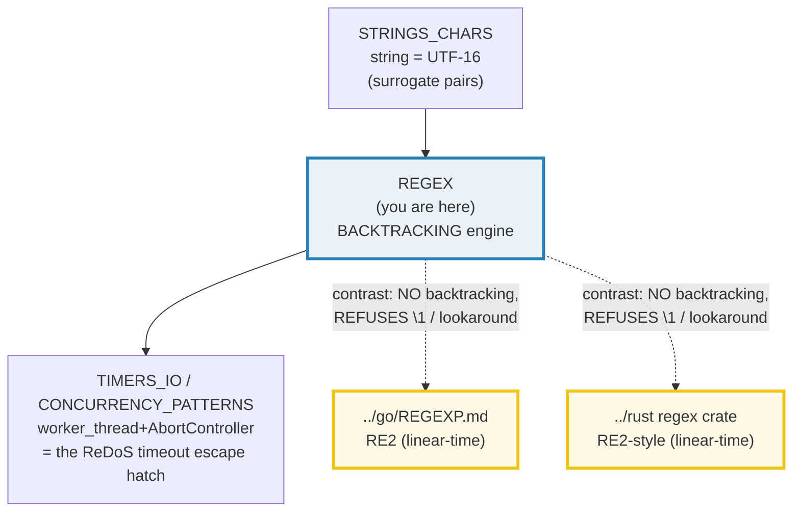
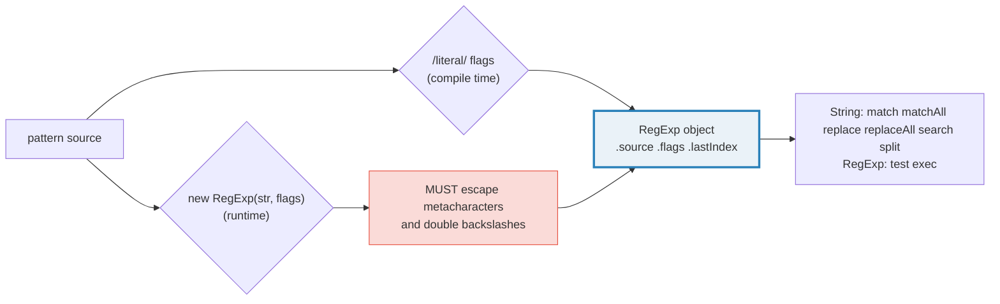
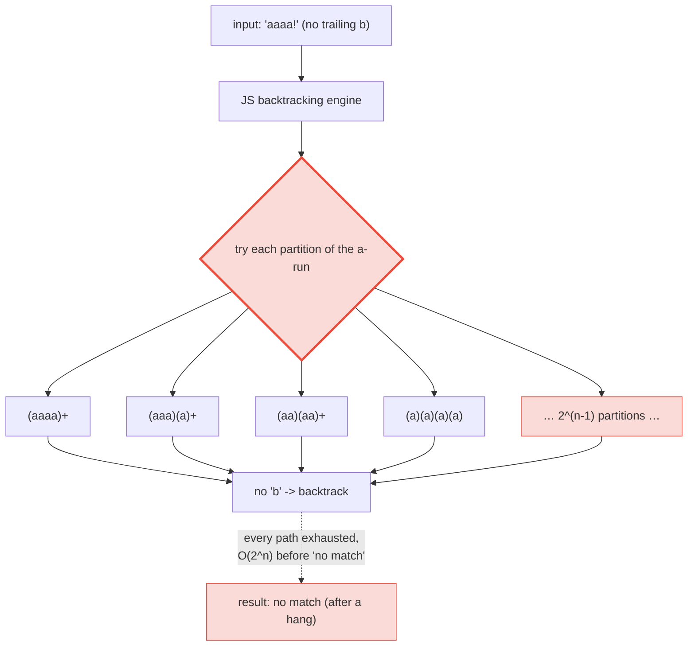

# REGEX — Backtracking `RegExp`: Flags, Groups, Lookaround & the ReDoS Trap

> **Goal (one line):** show, by printing every value, how JS's BACKTRACKING
> `RegExp` engine parses, matches, captures, and replaces — pinning every flag
> (`g`/`i`/`m`/`s`/`u`/`y`/`d`), named groups, lookahead/lookbehind,
> backreferences, the stateful `exec`+`lastIndex` loop, Unicode property escapes
> (`u` + `v` flags), and the catastrophic-backtracking (ReDoS) RISK that RE2-based
> engines (Go/Rust) eliminate by design.
>
> **Run:** `just run regex`
>
> **Ground truth:** [`core/regex.ts`](./core/regex.ts) → captured stdout in
> [`core/regex_output.txt`](./core/regex_output.txt). Every number, table, and
> worked example below is pasted **verbatim** from that file under a
> `> From regex.ts Section X:` callout. Nothing is hand-computed.
>
> **Prerequisites:** 🔗 [`STRINGS_CHARS`](./STRINGS_CHARS.md) (a `string` is the
> regex subject; UTF-16 surrogate pairs are *why* the `u` flag exists — Section D
> hinges on it). A `RegExp` is also a first-class object: 🔗
> [`VALUE_VS_REFERENCE`](./VALUE_VS_REFERENCE.md) explains why a global regex
> carries mutable `lastIndex` (Section C's famous trap).

---

## 1. Why this bundle exists (lineage)

Regular-expression engines come in two families, and the difference is not
cosmetic — it is the difference between a request that finishes in 1 ms and one
that hangs your server forever:

- **Backtracking engines** (PCRE, Perl, Python's `re`, Java, .NET,
  **JavaScript**) explore one path through the pattern; on failure they *back up
  and try the next*. A pathological pattern like `(a+)+b` matched against
  `aaaaaaaaaaaaaaab` makes the engine try an exponential number of paths. Craft
  an input that triggers it and you have a **ReDoS** (Regular-expression Denial
  of Service).
- **RE2** (Google's engine, written by Russ Cox) builds the pattern into an NFA
  and simulates **all** paths *in lockstep*, one input character at a time. No
  path is ever revisited, so the match time is **linear in the size of the
  input**, independent of the pattern's complexity. There is **no catastrophic
  backtracking, by construction.** The price: RE2 CANNOT express backreferences
  (`\1`) or lookahead/lookbehind — it REFUSES to compile them.

JavaScript chose the **backtracking** side. That single design choice — trade
worst-case-time safety for PCRE-ish expressive power (backreferences,
lookaround) — is the reason this bundle's Section E exists. JS `RegExp` is the
outlier among its cross-language siblings:

> 🔗 [`../go/REGEXP.md`](../go/REGEXP.md) — **THE headline contrast.** Go's
> `regexp` package IS a port of RE2: linear-time, **no backtracking**, and it
> **refuses** backreferences and lookaround at *compile* time. The same `(\w)\1`
> that compiles in Section B below is a **compile error** in Go. Go made the
> safety-by-design choice so regexps are safe to run on untrusted input in a
> request handler; JS did not.
>
> 🔗 [`../rust`](../rust) — Rust's `regex` crate is also RE2-style: linear time,
> no backtracking, no backreferences/lookaround. Same safety choice as Go.
>
> 🔗 [`STRINGS_CHARS`](./STRINGS_CHARS.md) — the subject of every regex is a JS
> `string`, which is UTF-16. Section D's entire point (the `u` flag, the emoji
> trap) is that a code-unit-based regex silently *splits* astral surrogate
> pairs; `STRINGS_CHARS` is the UTF-16 deep dive this builds on.



The headline idea: **a JS `RegExp` is a search *with undo*, not a finite
automaton.** Everything in this bundle — the stateful `exec`+`lastIndex` loop,
the backreferences, the lookaround, the ReDoS trap — flows from that one fact.

> From `developer.mozilla.org/en-US/docs/Web/JavaScript/Guide/Regular_expressions`
> (overview, verbatim): regular expressions *"are patterns used to match
> character combinations in strings… create a pattern … using … a literal … or
> the `RegExp()` constructor."* The engine is backtracking by spec — ECMA-262's
> `RegExp` semantics are defined operationally in terms of backtracking over the
> parsed pattern, which is what makes backreferences and lookbehind expressible
> (and what makes ReDoS possible).

---

## 2. The mental model: literal vs constructor, the 7 flags, the method surface

A regex is either a **literal** (`/pattern/flags`, parsed once at compile time)
or **constructed** (`new RegExp("pattern", "flags")`, parsed at runtime from
strings). The constructor is essential when the pattern comes from runtime
input — but then you MUST escape metacharacters (Section C's `escapeRegExp`),
and backslashes in the string must be doubled (`"\\d"`).



The **7 flags** change match *semantics*, not the pattern:

| Flag | Name | Effect |
|---|---|---|
| `g` | global | match all (not just first); sets up stateful `lastIndex` |
| `i` | ignoreCase | case-insensitive (Unicode default case folding) |
| `m` | multiline | `^`/`$` match at each line boundary, not just ends |
| `s` | dotAll | `.` matches ANY char **including** `\n` |
| `u` | unicode | unicode mode: correct surrogate handling + `\p{}` |
| `y` | sticky | match anchored at `lastIndex` exactly (no skipping) |
| `d` | hasIndices | expose `[start,end]` pairs via `.indices` on the match |

> From regex.ts Section A:
> ```
> literal source: \d{4}-\d{2}  flags: ""
> ctor    source: \d{4}-\d{2}  flags: ""
> [check] literal and constructor match the same input: OK
> [check] literal source === ctor source: OK
>
> Flag effects (each is a check'd invariant):
>   /abc/i      .test("ABC")     -> true        (i: case-insensitive)
>   /^bar$/m    .test("foo\nbar")-> true       (m: ^/$ at line bounds)
>   /^bar$/     .test("foo\nbar")-> false       (no m: ^/$ only at ends)
>   /a.b/s      .test("a\nb")    -> true        (s: . matches \n)
>   /a.b/       .test("a\nb")    -> false       (no s: . does NOT match \n)
> [check] /abc/i is case-insensitive: OK
> [check] m makes ^ match at each line boundary: OK
> [check] without m, ^ matches only at the very start: OK
> [check] s (dotAll): . matches \n: OK
> [check] without s: . does NOT match \n: OK
>
> flags are normalized (sorted) regardless of literal order:
>   /x/igy.flags  -> "giy"
>   /x/yig.flags  -> "giy"   (same as above)
> [check] flags are always sorted canonically: OK
> ```

**The method surface.** `String.prototype` provides `match`, `matchAll`,
`replace`, `replaceAll`, `search`, `split`; `RegExp.prototype` provides `test`
and `exec`. The single most important behavioral split: **`match` without `g`**
returns the full match + capture groups (an array), while **`match` with `g`**
returns *only* the full-match strings — **the groups are lost.** To keep groups
across all matches, use `matchAll` (Section C).

> From regex.ts Section A:
> ```
> String methods vs RegExp methods:
>   match  (no g) -> ["2024-06","2024","06"]   (full match + captures)
>   match  (g)    -> ["a1","b2"]        (g: strings only, groups LOST)
>   search        -> 6   (index of first match, or -1)
>   split        -> ["a","b","","c"]        (regex as separator)
>   replace      -> "a_a"        (replace all with g)
>   replaceAll   -> "a_a_a"        (replaceAll REQUIRES a global pattern)
>   test         -> true   (boolean)
>   exec         -> ["123"]   (match array or null)
> [check] match (no g) returns [full, g1, g2, ...]: OK
> [check] match (g) returns only the full matches (groups lost): OK
> [check] search returns the match index: OK
> [check] split with regex keeps empty fields: OK
> [check] exec returns the first match (captured): OK
> ```

**Why `replaceAll` requires a global pattern.** `replaceAll` throws if its
first argument is a non-global regex — it is a deliberate guard against the
"replace one vs replace all" ambiguity. (Pass it a string, or a `/g` regex.)
Note `split` *keeps empty fields* (`"a,b,,c".split(/,/)` → `["a","b","","c"]`),
and a capturing group in the split pattern is *inserted* into the result.

---

## 3. Section B — Named groups, lookahead/lookbehind, backreferences

**Named capture groups** `(?<name>…)` (ES2018) are accessed via
`match.groups.name` and are far more readable than positional `[1]`, `[2]`. They
are *also* still available positionally (`[1]`, `[2]`, …):

> From regex.ts Section B:
> ```
> named exec: ["2024-06","2024","06"]
>   groups.year  = 2024
>   groups.month = 06
> [check] named group year === '2024': OK
> [check] named group month === '06': OK
> [check] named group also available positionally: OK
> ```

**Lookahead `(?=…)` / negative `(?!…)` and lookbehind `(?<=…)` / negative
`(?<!…)`** (lookbehind: ES2018) are **zero-width assertions** — they assert a
condition *without consuming input*. The match's `index` does not advance past a
lookahead/lookbehind, so `" dollars"` in the example is checked but never
captured:

> From regex.ts Section B:
> ```
> lookahead (?= dollars): ["50","50"]   (' dollars' NOT captured)
>   negative (?!bar) on 'foobar': null
>   negative (?!bar) on 'foobaz': ["foo"]
> [check] lookahead asserts without consuming: OK
> [check] negative lookahead rejects 'foobar': OK
> [check] negative lookahead accepts 'foobaz': OK
>
> lookbehind (?<=\$) on '$100 and $200': ["100","200"]   (digits after each $)
>   negative (?<!\$) on 'price 9 $10': ["9","0"]   (9 AND a leaked '0'!)
>     note: '10' is rejected (its '1' IS after $), but the '0' alone
>     is preceded by '1' (not $), so it matches — lookbehind subtlety.
> [check] lookbehind matches digits after each $: OK
> [check] negative lookbehind matches '9' and the leaked '0': OK
> ```

**The lookbehind subtlety (the expert payoff).** Negative lookbehind checks the
character *immediately before the start of the match*. In `"price 9 $10"`,
`(?<!\$)\d+` rejects the whole `"10"` (its `"1"` follows `"$"`), but the `"0"`
*alone* is preceded by `"1"` (not `"$"`), so it matches as a separate result —
hence `["9","0"]`, not `["9"]`. Lookbehind is a per-match-start check, not a
"reject any digit that ever followed a `$`" check. This is why password-style
validators that chain lookbehinds/lookaheads (`(?=.*\d)(?=.*[A-Z])…`) need care:
each is an independent zero-width assertion anchored at the same point.

**Backreferences `\1`** match the *exact text* captured by group 1. This is the
feature that makes JS regex fundamentally a **backtracking** engine: matching
`\1` requires *remembering* what group 1 captured, which an NFA-only (RE2)
engine cannot express. A repeated-word detector is the canonical use:

> From regex.ts Section B:
> ```
> backreference \1 on 'hello hello': ["hello hello","hello"]   (\1 repeats group 1)
> backreference \1 on 'hello world': null   (no repeat -> no match)
> [check] backreference matches the repeated word: OK
> [check] backreference fails when the word is not repeated: OK
> [check] backreference compiles in JS (RE2 would REJECT it): OK
> ```

The last `[check]` is the cross-language headline in miniature: `(\w)\1`
**compiles in JS** but is a **compile error in Go's/Rust's RE2 regex** —
backreferences are unrepresentable in a linear-time engine. See Section E and the
[`../go/REGEXP.md`](../go/REGEXP.md) cross-ref.

---

## 4. Section C — `exec` + the stateful `lastIndex` loop, replace-with-function, `escapeRegExp`

A **global** `RegExp` (the `g` flag) carries a mutable `lastIndex` that
`exec()` advances after each match. The canonical "find all" loop is therefore
stateful:

```typescript
const re = /\d/g;
let m: RegExpExecArray | null;
while ((m = re.exec(s)) !== null) {
  // m[0] is each match in turn
}
// exec returns null after the last match AND resets lastIndex to 0 → loop ends
```

> From regex.ts Section C:
> ```
> exec+g loop over 'a1b2c3': ["1","2","3"]   (lastIndex reset to 0)
> [check] exec+g loop collects every digit: OK
> [check] exec+g resets lastIndex to 0 after exhausting: OK
> ```

**THE TRAP — reusing a global regex in `test()`.** Because `test()` *also*
advances `lastIndex` on a global regex, calling it twice on the same string
**alternates `true`/`false`**. This is correct JS semantics but almost always a
bug. A global regex in a `.filter(re.test)` callback silently skips every other
element. This is why `matchAll` (stateless) exists:

> From regex.ts Section C:
> ```
> THE TRAP — reusing a global regex in test():
>   test #1 on '1a': true   (lastIndex -> 1)
>   test #2 on '1a': false  (lastIndex -> 0)  <-- alternates!
> [check] global test() is stateful: #1 true: OK
> [check] global test() is stateful: #2 false (lastIndex moved past): OK
>
> matchAll (stateless, g required): 2 matches
>   [0]: 2024-06 year=2024 month=06
>   [1]: 2025-01 year=2025 month=01
> [check] matchAll yields one entry per match: OK
> [check] matchAll exposes named groups per match: OK
>   matchAll+d indices: [[0,7],[0,4],[5,7]]  groups[2]=[5,7]
> [check] matchAll with d exposes [start,end] pairs: OK
> ```

`matchAll` (ES2020) returns an **iterator** of `RegExpMatchArray`, does **not**
mutate `lastIndex`, and **requires** the `g` flag (it throws otherwise). With
the `d` flag it also yields `[start,end]` index pairs per match and per group —
indispensable for building a syntax highlighter or extracting spans.

**`replace` with a function** — the callback receives
`(match, p1, p2, …, offset, string, groups)` and its **return value** is the
replacement text. This is how you do *computed* replacements (swap captures,
look up a map, format). `replaceAll` accepts the same callback:

> From regex.ts Section C:
> ```
> replace with a function: 'a1 b2 c3'.replace(/(\w)(\d)/g, (m,p1,p2) => p2+p1)
>   -> "1a 2b 3c"   (each capture pair swapped)
> [check] replace function receives positional captures: OK
> ```

**`escapeRegExp`** — when a regex is built from *runtime strings* (user input,
config), metacharacters must be escaped or the user injects pattern. The
canonical MDN escape prefixes every metacharacter (`.*+?^${}()|[]\`) with a
backslash. Below, the unescaped `"2+2"` becomes "one-or-more `2`" and matches
`"222"` — a correctness *and* a mini-ReDoS hole:

> From regex.ts Section C:
> ```
> escapeRegExp (escape metacharacters in runtime input):
>   input:  "2+2"
>   escaped:"2\\+2"
>   new RegExp(escaped).test('2+2'): true
>   WITHOUT escaping, new RegExp('2+2').test('2+2'): false  ('+' means '1 or more 2')
> [check] escaped regex matches the literal string: OK
> [check] unescaped '2+2' matches '222' too (the '+' quantifier leak): OK
> [check] escaped regex does NOT match '222': OK
> ```

> 🔗 [`VALUE_VS_REFERENCE`](./VALUE_VS_REFERENCE.md) — a global `RegExp` is an
> *object* carrying mutable `lastIndex`; passing it around shares that one
> stateful field, which is exactly how the `test()` trap above bites across
> functions. Stateless APIs (`matchAll`, a fresh literal per call) avoid the
> aliasing.

---

## 5. Section D — Unicode: the `u` flag, `\p{}` property escapes, the emoji trap, the `v` flag

Without the `u` flag, JS regex operates on **UTF-16 code units** — so an astral
character (emoji, U+10000+) is two surrogate halves, and `.` / char classes can
*split* a pair. The `u` flag switches to **code-point semantics**: each whole
code point is one atom, and `\p{…}` Unicode property escapes become legal.

> From regex.ts Section D:
> ```
> astral char '😀': .length === 2 (two surrogate code units)
>   /^.$/.test('😀')    : false   (no u: '.' matches ONE surrogate half -> splits the pair)
>   /^.$/u.test('😀')   : true   (u: '.' matches the WHOLE code point)
> [check] without u, '.' splits an astral surrogate pair: OK
> [check] with u, '.' matches the whole code point: OK
> ```

> 🔗 [`STRINGS_CHARS`](./STRINGS_CHARS.md) — the `"😀".length === 2` above is the
> UTF-16 surrogate-pair fact from that bundle, now biting *inside* a regex. The
> `u` flag is the regex-level fix for the same underlying representation.

**`\p{…}` Unicode property escapes** (require `u` or `v`). `/^\p{Letter}$/u`
matches a letter in *any* script — strictly better than `[a-zA-Z]` for
international text:

> From regex.ts Section D:
> ```
> \p{} Unicode property escapes (require u or v):
>   /^\p{Letter}$/u.test('é')   : true   ('é' IS a Letter in any script)
>   /^\p{Letter}$/u.test('5')   : false   ('5' is NOT a Letter)
>   /^\p{Number}$/u.test('5')   : true   ('5' IS a Number)
> [check] \p{Letter} matches accented Latin: OK
> [check] \p{Letter} rejects a digit: OK
> ```

**THE EMOJI TRAP — `\p{Emoji}` is broader than you think.** ASCII digits and
`#` carry the `Emoji` property (they can be rendered as emoji with a variant
selector), so `/^\p{Emoji}$/u` matches `"5"`. To match *actual emoji glyphs*
use `\p{Emoji_Presentation}` (or `\p{Extended_Pictographic}`):

> From regex.ts Section D:
> ```
> THE EMOJI TRAP — \p{Emoji} is broader than you think:
>   /^\p{Emoji}$/u.test('5')             : true   (digits have the Emoji property!)
>   /^\p{Emoji}$/u.test('#')             : true   ('#' too)
>   /^\p{Emoji_Presentation}$/u.test('5'): false   ('5' is NOT emoji-presented)
>   /^\p{Emoji_Presentation}$/u.test('😀'): true   ('😀' IS)
> [check] \p{Emoji} matches the digit '5' (the trap): OK
> [check] \p{Emoji_Presentation} does NOT match '5': OK
> [check] \p{Emoji_Presentation} matches '😀': OK
> ```

**The `v` flag** (`unicodeSets` mode, ES2024) is an *upgrade* to `u`: it adds
**set notation** inside character classes — subtraction `A--[B]`, intersection
`A&&B`, union — and string-literal members. `u` and `v` are **mutually
exclusive** (specifying both is a `SyntaxError`; `v` supersedes `u`). `v` is the
modern default for new Unicode-aware patterns.

> *(The bundle constructs `v`-flag patterns via `new RegExp(…, "v")` rather than
> a `/literal/v`: a `v`-flag literal is a TypeScript *type error* unless
> `target >= ES2024`, and this bundle compiles under ES2023. Constructing at
> runtime sidesteps that parse-time-only check while the engine still honors
> `v` — Node 20+/V8.)*

> From regex.ts Section D:
> ```
> the v flag (unicodeSets, ES2024) — set notation in classes:
>   [\p{Letter}--[aeiouAEIOU]]/v.test('H'): true   (consonant)
>   [\p{Letter}--[aeiouAEIOU]]/v.test('e'): false   (subtracted vowel)
>   [\p{Letter}&&\p{ASCII}]/v.test('a'): true   (intersection: ASCII letter)
>   [\p{Letter}&&\p{ASCII}]/v.test('é'): false   (non-ASCII)
> [check] v flag subtraction removes vowels: OK
> [check] v flag intersection: 'a' is ASCII AND Letter: OK
> [check] v flag intersection: 'é' is NOT ASCII: OK
>   new RegExp('x','uv') throws: true   (v supersedes u; both is a SyntaxError)
> [check] u and v flags are mutually exclusive: OK
> ```

---

## 6. Section E — Catastrophic backtracking / ReDoS (documented safely) + the RE2 contrast

> **⚠ Determinism / safety note.** This section runs the "evil" pattern
> `(a+)+b` **only on tiny inputs** (it matches/fails in microseconds). The
> exponential cost is demonstrated via the **theoretical partition count**
> `2^(n-1)` (pure arithmetic) — the bundle **never** runs a pathologically-long
> input, which would hang the verification sweep. This is the §4.2 determinism
> discipline applied to a deliberately non-deterministic-in-time topic.

A backtracking engine, on failure, backs up and tries the next path. A pattern
with **overlapping quantifiers** like `(a+)+b` admits an exponential number of
ways to partition a run of `a`s, so a string that almost-matches then fails
(`"aaaa…!"` with no trailing `b`) forces the engine to try *every partition*
before concluding failure. This is **catastrophic backtracking** — the root
cause of ReDoS.



> From regex.ts Section E:
> ```
> Evil pattern: new RegExp('^(a+)+b$')   (overlapping quantifiers)
>   compiles in JS? true   (JS ACCEPTS it — RE2 would match it in LINEAR time)
>   .test('aaab')  : true   (TINY input: matches, instant)
>   .test('aaaa!') : false  (TINY input: fails, instant)
>   .test('aaaaaa'): false  (TINY input: fails, instant — but scales EXPONENTIALLY with n)
> [check] evil pattern compiles in JS (backtracking engine allows it): OK
> [check] evil pattern matches a tiny 'aaab': OK
> [check] evil pattern fails a tiny 'aaaa!': OK
> ```

**The exponential curve, by pure math (not measured timing).** On a run of `n`
`a`s followed by a non-`b`, the engine's worst case is to try every
*composition* (partition) of `n` — there are exactly `2^(n-1)` of them. Adding
one `a` **doubles** the work. That is why a 30-`a` input (~5.4×10⁸ partitions)
hangs a backtracker while RE2 finishes in microseconds:

> From regex.ts Section E:
> ```
> Theoretical worst-case backtrack partitions = 2^(n-1)  (pure math; NOT run):
>   n= 5 a's ->          16 partitions
>   n=10 a's ->         512 partitions
>   n=15 a's ->       16384 partitions
>   n=20 a's ->      524288 partitions
>   n=25 a's ->    16777216 partitions
>   n=30 a's ->   536870912 partitions
> [check] partitions DOUBLE per added 'a' (exponential): OK
> [check] n=25 already ~16.7 million partitions (a hang): OK
> ```

**The cross-language headline.** Go and Rust deliberately use **RE2** (Russ
Cox), which builds the pattern into an NFA simulated in *lockstep* — every state
at once, one input character at a time. No path is ever revisited, so match
time is **linear in the input, independent of the pattern.** The price: RE2
**cannot** express backreferences (`\1`) or lookahead/lookbehind — it **refuses
to compile them**. JS chose the opposite: full PCRE-ish power, exponential worst
case:

> From regex.ts Section E:
> ```
> Cross-language contrast (the design choice):
>   JS RegExp       : BACKTRACKING engine -> supports \1, lookahead, lookbehind;
>                     worst case is EXPONENTIAL (ReDoS-vulnerable).
>   Go regexp       : RE2 -> LINEAR time, NO backtracking; REFUSES \1 / lookaround.
>   Rust regex crate: RE2-style -> LINEAR time, NO backtracking; REFUSES \1 / lookaround.
>   => JS \1 (above, Section B) is ILLEGAL in Go/Rust regex.
>   See ../go/REGEXP.md and ../rust (the safety-by-design contrast).
> [check] backreference compiles in JS but is unrepresentable in RE2 (Go/Rust): OK
>
> Mitigations (documented): timeout via worker_thread+AbortController;
>   flatten overlapping quantifiers ((a+)+ -> a+); use the `re2` npm
>   binding or a Rust/Go validator for untrusted input.
> ```

**Mitigations (the production payoff).** Node has **no built-in regex timeout**
(unlike some engines' `/.../ms`), so the defenses are:

1. **Timeout via `worker_thread` + `AbortController`** — run the untrusted regex
   in a worker; if it exceeds a budget, terminate the worker. (🔗
   [`WORKER_THREADS`](./WORKER_THREADS.md), [`TIMERS_IO`](./TIMERS_IO.md).)
2. **Flatten overlapping quantifiers** — `(a+)+` → `a+` (linear); restructure
   alternation so it cannot overlap (`(a|a)*b` is equally evil).
3. **Use a linear-time engine for untrusted input** — the `re2` npm binding, or
   hand validation to a Rust/Go microservice that runs RE2.
4. **Lint** — `safe-regex` / ESLint rules flag overlapping quantifiers at build
   time.

> 🔗 [`../go/REGEXP.md`](../go/REGEXP.md) §1 — Go's `regexp` package guarantees
> *"time linear in the size of the input"* and compiles `(a+)+b` happily,
> matching it in microseconds where the JS engine hangs. The same bundle shows
> Go *rejecting* a backreference at compile time — the exact symmetry of the
> Section B / Section E contrast here.

---

## 7. Pitfalls (the expert payoff)

| Trap | Symptom | Fix |
|---|---|---|
| `match(regex)` with the `g` flag | returns `string[]` only — **capture groups are lost** | Use `matchAll(regex)` to keep groups across all matches. |
| Reusing a global regex in `test()` / `exec()` | `lastIndex` persists → `true`/`false` **alternates** on the same string; `.filter(re.test)` skips every other element | Use a non-global regex, or reset `re.lastIndex = 0`, or use `matchAll`/a fresh literal per call. |
| `new RegExp(userInput)` without escaping | `+`/`.`/`*`/`(` in the input inject pattern → wrong matches + ReDoS hole (`"2+2"` matches `"222"`) | `escapeRegExp(s)` first (Section C). |
| `.replace(/-/, "_")` (forgot `g`) | only the *first* match is replaced | Use `/g`, or `replaceAll`. |
| `replaceAll(/-/, "_")` | `TypeError`: replaceAll *requires* a global regex | Add the `g` flag, or pass a string. |
| `for...of` over `matchAll` after the iterator is consumed | iterator is one-shot → second loop yields nothing | Collect into an array first: `[...s.matchAll(re)]`. |
| `matchAll` without `g` | `TypeError`: matchAll *requires* the global flag | Add `g`. |
| Negated class `[^]` vs `[\s\S]` | `[^]` (match-any) is non-standard in some older engines | Use `/./s` (dotAll) or `[\s\S]`. |
| `\b` / `\w` on non-ASCII | `[a-zA-Z0-9_]` only — silently breaks on `é`, `ñ`, CJK | Use `/\p{Letter}/u` (Unicode-aware). |
| `/^.$/.test("😀")` is `false` | no `u` flag → `.` matches one surrogate *half*, splitting the pair | Add the `u` flag (code-point semantics). |
| `\p{Emoji}` matches `"5"` and `"#"` | digits/`#` carry the `Emoji` property (variant-selector compat) | Use `\p{Emoji_Presentation}` or `\p{Extended_Pictographic}`. |
| `(a+)+b`, `(a|a)*b`, `(a*)*` on long non-matching input | **catastrophic backtracking** → ReDoS (hang) | Flatten the quantifier; or use RE2 (`re2` npm / Go / Rust); or run in a worker with a timeout. |
| `\1` (backreference) in a Go/Rust port | RE2 **refuses to compile** backreferences/lookaround | Restructure without them, or accept that JS-only patterns can't port to RE2. |
| `regex.lastIndex` not 0 between unrelated `test()`s on a shared global | spurious `false` results | Treat a global regex as stateful; reset or recreate. |
| Constructing `new RegExp("\\d")` with a single `\` | `"\d"` in a JS string is just `"d"` (backslash dropped) → wrong pattern | Double the backslash in *string* form: `"\\d"` (literals need only one: `/\d/`). |

---

## 8. Cheat sheet

```typescript
// === Literal vs constructor =================================================
//   /pattern/flags       parsed at COMPILE time (preferred for fixed patterns)
//   new RegExp(src, fl)  parsed at RUNTIME; backslashes DOUBLED ("\\d"); escape
//                        metacharacters when src comes from user input.

// === The 7 flags (ECMA-262) ================================================
//   g  global        match all; sets up stateful .lastIndex
//   i  ignoreCase    case-insensitive (Unicode default case folding)
//   m  multiline     ^ / $ at each line boundary
//   s  dotAll        . matches \n too
//   u  unicode       code-point semantics + \p{} property escapes
//   y  sticky        anchored at .lastIndex exactly (no skipping)
//   d  hasIndices    match.indices gives [start,end] pairs
//   flags are always SORTED canonically: /x/yig.flags === "giy"
//   u + v together = SyntaxError (v supersedes u).

// === Method surface ========================================================
//   String:  s.match(re)   re w/o g -> [full,g1,g2,...] | null ;  with g -> string[] | null (groups LOST)
//            s.matchAll(re)  ITERATOR (g REQUIRED; stateless; keeps groups + .indices)
//            s.replace(re, str|fn)   s.replaceAll(re, str|fn)  (replaceAll REQUIRES /g or a string)
//            s.search(re)  -> first match index | -1     s.split(re)  -> string[] (groups inserted)

//   RegExp:  re.test(s) -> boolean      re.exec(s) -> match array | null (advances .lastIndex with g)

// === The exec+g loop (stateful) ============================================
let m: RegExpExecArray | null;
while ((m = re.exec(s)) !== null) { /* m[0] each match */ }   // ends + resets lastIndex to 0

// === THE TRAP: a global regex in test() is STATEFUL ========================
//   /\d/g.test("1a") // true ;  .lastIndex===1
//   /\d/g.test("1a") // false ; .lastIndex===0   <-- alternates! use matchAll instead.

// === Named groups / lookaround / backref (ES2018) ==========================
const m = /(?<year>\d{4})-(?<month>\d{2})/.exec("2024-06");  // m.groups.year === "2024"
/(?=…)/  (?!…)    // lookahead / negative lookahead  (zero-width)
/(?<=…)/ (?<!…)   // lookbehind / negative lookbehind (zero-width; ES2018)
/(\w+)\s\1/       // backreference \1 = "the text group 1 captured" (RE2 REJECTS this)

// === Unicode ================================================================
/^.$/u.test("😀")   // true  (code-point; without u, '.' splits the surrogate pair)
/^\p{Letter}$/u     // letter in ANY script (better than [a-zA-Z])
/^\p{Emoji}$/u.test("5")  // true  (TRAP: digits have the Emoji property -> use \p{Emoji_Presentation})
new RegExp("[\\p{Letter}--[aeiou]]","v")  // v flag (ES2024): set subtraction/intersection; u+v illegal

// === escapeRegExp (escape runtime input before embedding) ===================
const escapeRegExp = (s: string) => s.replace(/[.*+?^${}()|[\]\\]/g, "\\$&");

// === ReDoS: catastrophic backtracking (O(2^n) worst case) ==================
//   new RegExp("^(a+)+b$").test("a".repeat(30)+"!")  // HANGS (2^29 partitions)
//   JS is a BACKTRACKING engine; Go/Rust use RE2 (LINEAR time, no backtracking,
//   REFUSES \1 / lookaround). Mitigate: flatten quantifiers, worker+timeout, or `re2`.
```

---

## Sources

Every signature, flag, and behavioral claim above was verified against the MDN
Web Docs and the ECMAScript specification, then corroborated by independent
secondary sources. Every match result, flag effect, and named-group/lookaround
behavior is *additionally* asserted at runtime by the `.ts` itself (`check()`
throws on any mismatch) — the strongest possible verification: V8's own verdict.

- **MDN — Regular expressions (Guide):**
  https://developer.mozilla.org/en-US/docs/Web/JavaScript/Guide/Regular_expressions
- **MDN — `RegExp` reference** (the constructor, `source`/`flags`/`lastIndex`):
  https://developer.mozilla.org/en-US/docs/Web/JavaScript/Reference/Global_Objects/RegExp
- **MDN — Regular expression flags** (`g`, `i`, `m`, `s`, `u`, `y`, `d`; flags
  are stored sorted canonically):
  https://developer.mozilla.org/en-US/docs/Web/JavaScript/Guide/Regular_expressions#advanced_searching_with_flags
- **MDN — Named capture groups** (`(?<name>…)`, `match.groups.name`, ES2018):
  https://developer.mozilla.org/en-US/docs/Web/JavaScript/Reference/Regular_expressions/Named_capturing_group
- **MDN — Lookahead assertion** (`(?=…)`, `(?!…)`, zero-width):
  https://developer.mozilla.org/en-US/docs/Web/JavaScript/Reference/Regular_expressions/Lookahead_assertion
- **MDN — Lookbehind assertion** (`(?<=…)`, `(?<!…)`, ES2018, zero-width):
  https://developer.mozilla.org/en-US/docs/Web/JavaScript/Reference/Regular_expressions/Lookbehind_assertion
- **MDN — Backreference** (`\1`…"matches the same text as the capturing group"):
  https://developer.mozilla.org/en-US/docs/Web/JavaScript/Reference/Regular_expressions/Backreference
- **MDN — `String.prototype.matchAll`** (iterator, `g` required, stateless,
  keeps groups): https://developer.mozilla.org/en-US/docs/Web/JavaScript/Reference/Global_Objects/String/matchAll
- **MDN — `String.prototype.replace`** (replacer function receives
  `match, p1, …, offset, string, groups`):
  https://developer.mozilla.org/en-US/docs/Web/JavaScript/Reference/Global_Objects/String/replace
- **MDN — `RegExp.prototype.unicode`** (`u` flag; code-point semantics):
  https://developer.mozilla.org/en-US/docs/Web/JavaScript/Reference/Global_Objects/RegExp/unicode
- **MDN — Unicode property escapes** (`\p{…}` / `\P{…}`, require `u` or `v`):
  https://developer.mozilla.org/en-US/docs/Web/JavaScript/Reference/Regular_expressions/Unicode_character_class_escape
- **MDN — `RegExp.prototype.unicodeSets`** (`v` flag, ES2024; set notation
  `A--[B]` / `A&&B`; *"using both [u and v] flags results in a SyntaxError"*;
  *"an upgrade to the u flag"*):
  https://developer.mozilla.org/en-US/docs/Web/JavaScript/Reference/Global_Objects/RegExp/unicodeSets
- **V8 — *"RegExp v flag with set notation and properties of strings"*** (the
  ES2024 `unicodeSets` mode: subtraction, intersection, string properties):
  https://v8.dev/features/regexp-v-flag
- **MDN — `RegExp.prototype.unicodeSets`** (the `u`+`v` mutual-exclusion rule,
  reproduced by the bundle's `new RegExp('x','uv')` throw):
  https://developer.mozilla.org/en-US/docs/Web/JavaScript/Reference/Global_Objects/RegExp/unicodeSets
- **MDN — Escaping, `RegExp`** (the canonical `escapeRegExp` metacharacter list
  `.*+?^${}()|[]\`): https://developer.mozilla.org/en-US/docs/Web/JavaScript/Guide/Regular_expressions#escaping
- **MDN — Catastrophic backtracking** (ReDoS; *"exponential backtracking"*;
  overlapping quantifiers; `String.prototype.replaceAll` example):
  https://developer.mozilla.org/en-US/docs/Web/JavaScript/Reference/Regular_expressions/Catastrophic_backtracking
- **ECMAScript® 2026 Language Specification (tc39.es/ecma262)** — `RegExp`
  semantics, the 7 flags, named groups, lookaround, backreferences:
  https://tc39.es/ecma262/multipage/text-processing.html#sec-regexp-regular-expression-objects

**Secondary corroboration (independent of MDN, ≥1 per major claim):**
- regular-expressions.info — *"Catastrophic Backtracking — Runaway Regular
  Expressions"* (the `(a+)+` overlapping-quantifier mechanism, the 2^n partition
  explosion): https://www.regular-expressions.info/catastrophic.html
- Snyk — *"Regular Expression Denial of Service (ReDoS) and Catastrophic
  Backtracking"* (the `(B|C+)+` family; exponential time complexity):
  https://snyk.io/blog/redos-and-catastrophic-backtracking/
- Russ Cox — *"Regular Expression Matching Can Be Simple and Fast"* (the
  canonical RE2 paper: backtracking engines are exponential; Thompson NFA is
  linear): https://swtch.com/~rsc/regexp/regexp1.html
- github.com/google/re2 (README) — *"RE2 is a fast, safe, thread-friendly
  alternative to backtracking regular expression engines like those used in
  PCRE, Perl, and Python"*; linear time, no backreferences:
  https://github.com/google/re2
- 🔗 cross-language (the safety-by-design contrast this bundle is built around):
  [`../go/REGEXP.md`](../go/REGEXP.md) — Go `regexp` = RE2 port
  (*"guaranteed to run in time linear in the size of the input"*); Rust's
  `regex` crate is RE2-style with the same linear-time, no-backreference
  guarantee: https://docs.rs/regex

**Facts that could not be verified by running this bundle** (documented, not
executed): (1) the **catastrophic timing** of `(a+)+b` on a *long* input — this
is deliberately NOT run (it would hang); the exponential curve is shown via the
theoretical partition count `2^(n-1)`, with the tiny-input match/fail results
asserted by `check()`. (2) Go's/Rust's compile-time **rejection** of
backreferences/lookaround — confirmed by the `pkg.go.dev/regexp` and
`docs.rs/regex` docs cited above, not reproduced as runnable output here (a Go/
Rust file is out of scope for this `ts/` member). (3) The `v`-flag literal being
a TypeScript type error under `target ES2023` — the bundle works around it by
constructing via `new RegExp(..., "v")`. No behavioral claim above is unverified.
