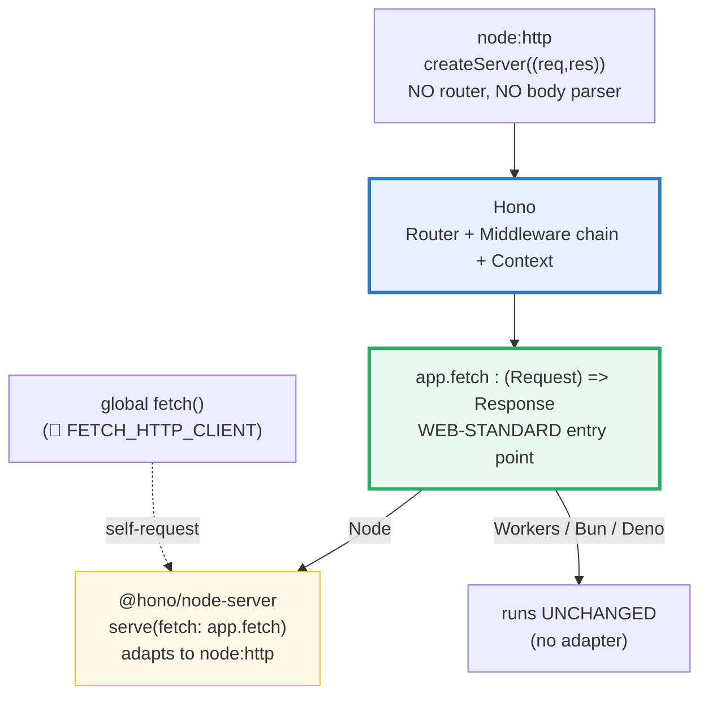
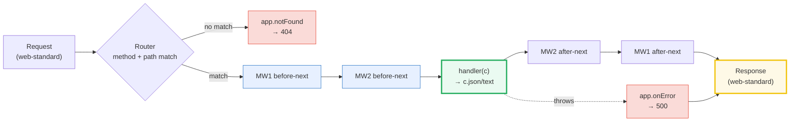

# REST_API — Hono: Router, Middleware Chain, Context & `app.fetch` on Node

> **Goal (one line):** show, by spinning up a real Hono app on an EPHEMERAL port
> (0) via `@hono/node-server` and firing self-requests at it, that a REST API in
> Hono is a **Router** (method+path patterns with params) + a composable
> **middleware chain** (each layer wraps the handler, onion-style, via
> `await next()`) + a **Context** object (`c.req` for query/header/body,
> `c.json`/`c.text`/`c.header` for the response) + `app.onError`/`app.notFound`
> for 500/404 — all behind a web-standard `app.fetch: (Request) => Response`
> that runs unchanged on Node / Workers / Bun / Deno.
>
> **Run:** `just run rest_api`
>
> **Ground truth:** [`web/rest_api.ts`](./web/rest_api.ts) → captured stdout in
> [`web/rest_api_output.txt`](./web/rest_api_output.txt). Every status code,
> header value and body below is pasted **verbatim** from that file under a
> `> From rest_api.ts Section X:` callout. Nothing is hand-computed.
>
> **Prerequisites:** [`NODE_HTTP_SERVER`](./NODE_HTTP_SERVER.md) (the raw
> `(req,res)` callback Hono adapts), [`FETCH_HTTP_CLIENT`](./FETCH_HTTP_CLIENT.md)
> (the client making the self-requests). This is Phase 8 (Web, DB & Production).

---

## 1. Why this bundle exists (lineage)

`node:http`'s `createServer((req, res) => {})` (🔗 `NODE_HTTP_SERVER`) is the
substrate every Node web framework builds on — but it ships **no router**, **no
body parser**, and **no middleware**. You hand-roll routing as a `switch` on
`req.method + req.url`, drain the body stream yourself, and bolt on cross-cutting
concerns (logging, auth, CORS) ad hoc. That tedium is exactly what a framework
removes. Hono does it on **web standards**: a `Request` in, a `Response` out.



Hono is what Express was to `node:http` in 2010, but built on the **WHATWG web
standards** (`Request`/`Response`/`Headers`/`ReadableStream`) rather than Node's
`req`/`res` streams. The payoff is **runtime portability**: the application is a
single function — `app.fetch: (request: Request) => Response` — that every
supported runtime invokes directly. `@hono/node-server` is only the **adapter**
that bridges that function onto `node:http`; on Cloudflare Workers, Bun, and
Deno the **same** `app.fetch` is the entry point with **no adapter at all**
(Section D proves this by calling `app.fetch` in-process, with no server).

> 🔗 [`NODE_HTTP_SERVER`](./NODE_HTTP_SERVER.md) — the raw `(req, res)` callback
> Hono sits on top of. Doing routing/body-reading by hand there is precisely the
> tedium Hono removes. `@hono/node-server`'s `serve()` ultimately calls
> `http.createServer` and dispatches each request through `app.fetch`.
>
> 🔗 [`FETCH_HTTP_CLIENT`](./FETCH_HTTP_CLIENT.md) — the client side. Every
> self-request in this bundle is the global `fetch` (undici). The same `fetch` is
> also what you'd use to call *other* APIs from a Hono handler.
>
> 🔗 [`ZOD_VALIDATION`](./ZOD_VALIDATION.md) — typed body validation. The
> validator is **not** special: it is a **middleware** placed before the handler
> (the `zValidator("json", schema)` slot). Section D hand-rolls that slot because
> `zod` lives in `metaprog/`, not `web/`.

### Cross-language: the same model, four runtimes

The headline contrast — a router + a middleware chain over an HTTP server — is a
near-universal shape. The differences are in *typing* and *concurrency*:

> 🔗 [`../go/MIDDLEWARE_ROUTING.md`](../go/MIDDLEWARE_ROUTING.md) — Go 1.22's
> `net/http` `ServeMux` with method+path patterns (`mux.HandleFunc("GET /users/{id}", ...)`)
> plus `func(http.ResponseWriter, *http.Request, http.HandlerFunc)` middleware
> chains. Each request runs on its **own goroutine** (cheap green thread). Hono
> instead runs every handler on the **single** event-loop thread (🔗 `EVENT_LOOP`).
>
> 🔗 `../rust/` (axum) — `Router::new().route("/users/:id", get(handler))` with
> **typed extractors** (`FromRequest`/`FromRequestParts`): the handler's *typed
> arguments* ARE the parsed request (path param, JSON body, header), enforced at
> compile time. Hono's `c.req.json<T>()` is the runtime analog; `@hono/zod-validator`
> (🔗 `ZOD_VALIDATION`) brings it closer to axum's compile-time safety.
>
> 🔗 `../python/` (FastAPI) — `@app.get("/users/{id}")` decorator routing with
> `Depends()` for the middleware/validator slot; **pydantic** validates the body
> from a typed model. FastAPI is the closest sibling to "Hono + zod-validator".

---

## 2. The mental model: one request's journey through Hono

A request enters as a web-standard `Request`, is matched against registered
routes by the **Router**, flows down (then up) the **middleware chain** (the
onion), reaches exactly one **handler** that returns a `Response`, and exits.
`@hono/node-server` is the only piece that touches a TCP socket.



Four moving parts, each demonstrated by a section:

- **Router** — `app.get/post/put/delete(pattern, handler)`. Patterns support
  path params (`:id`). Exactly one handler matches per request (Section A).
- **Context (`c`)** — the handler's only argument. `c.req` reads the request
  (`query`/`header`/`param`/`json`); `c.json`/`c.text`/`c.header`/`c.status`
  build the response (Section B).
- **Middleware chain** — `app.use(pattern, mw)`. Each middleware wraps the
  handler; `await next()` passes control inward, and code after `next()` runs on
  the way back out (**onion model**). A middleware may also **short-circuit** by
  returning a `Response` without calling `next()` (Section C).
- **`app.fetch`** — `(Request) => Response`. The web-standard entry point; no
  server required to call it (Section D). `app.onError`/`app.notFound` shape
  500/404 (Section C).

---

## 3. Section A — `new Hono`, routes, path params, `c.json`/`c.text`, `serve`

`new Hono()` is the application. `app.get(pattern, handler)` registers a handler
for `GET pattern`; `post`/`put`/`delete`/`patch`/`all` do the obvious. A handler
takes a `Context` (`c`) and returns a `Response`. `c.json(obj)` builds a JSON
`Response` (and sets `Content-Type: application/json`); `c.text(s)` builds a
text one. A **path param** `:id` is read with `c.req.param("id")`.

`serve({ fetch: app.fetch, port: 0 })` from `@hono/node-server` binds the app to
an **ephemeral** port (0 = "OS, pick a free one") and adapts `app.fetch` onto
`node:http`. The self-GET below round-trips through the real socket.

> From `rest_api.ts` Section A:
> ```
> GET / ->
>   status : 200
>   body   : {"hello":"world"}
>   ctype  : application/json
> [check] GET / -> 200: OK
> [check] GET / body === {"hello":"world"}: OK
> [check] content-type includes application/json (c.json sets it): OK
> 
> GET /users/42  (path param :id) ->
>   status : 200
>   body   : {"id":"42"}
> [check] GET /users/:id echoes the path param: id === "42": OK
> 
> GET /text ->
>   status : 200
>   body   : "plain body"
>   ctype  : text/plain; charset=UTF-8
> [check] GET /text -> 200: OK
> [check] c.text body === "plain body": OK
> [check] content-type is text/plain (c.text sets it): OK
> 
> @hono/node-server's serve({fetch: app.fetch, port: 0}) bridges the
> web-standard app.fetch onto node:http — the SAME app.fetch that
> Cloudflare Workers / Bun / Deno invoke directly (no adapter).
> ```

**Why `c.json` sets `Content-Type` but `c.text` adds `; charset=UTF-8`.** `c.json`
serializes with `JSON.stringify` and labels the body `application/json`. `c.text`
labels it `text/plain` and — because the body is encoded UTF-8 — appends
`charset=UTF-8`. Both are the `Response`'s `Content-Type` header; Hono sets it
for you so you don't have to call `c.header("content-type", ...)` by hand.

**Why the ephemeral port is never printed.** `port: 0` asks the OS for a free
port; the assigned number is nondeterministic across runs (and a sibling bundle
running in parallel gets a different one). Printing it would make `_output.txt`
non-reproducible — so this bundle asserts only **status / headers / body**,
never the port or any timing (see §4.2 determinism rules).

---

## 4. Section B — `c.req` (query/header/body), status codes, grouping, 404

The handler reads the request through `c.req`:

- `c.req.query("q")` → querystring value (`string | undefined`).
- `c.req.header("name")` → request header (case-insensitive; `string | undefined`).
- `await c.req.json()` → the parsed JSON body (a `Promise`; Hono **caches** the
  parsed body, so a middleware and the handler can both read it — see Section D).
- `c.req.param("id")` → a path param (Section A).

The response status is the **2nd argument** of `c.json` / `c.text`
(`c.json(data, 201)`). **Grouping** mounts a sub-app (its own `Hono` instance)
at a prefix with `app.route("/api", subApp)`.

> From `rest_api.ts` Section B:
> ```
> GET /search?q=hono&n=7  (c.req.query) ->
>   status : 200
>   body   : {"q":"hono","n":7}
> [check] c.req.query("q") === "hono": OK
> [check] c.req.query("n") parsed to number -> 7: OK
> 
> GET /header  (X-Custom: abc — header read is case-insensitive) ->
>   body   : {"custom":"abc"}
> [check] c.req.header("x-custom") read X-Custom (case-insensitive) === "abc": OK
> 
> POST /items  (await c.req.json + c.json(data, 201)) ->
>   status : 201   (2nd arg of c.json is the status)
>   body   : {"created":true,"name":"widget"}
> [check] POST /items -> 201 (c.json(body, 201)): OK
> [check] POST body parsed via c.req.json: name === "widget": OK
> 
> GET /api/version  (sub-app mounted via app.route) ->
>   status : 200
>   body   : {"version":"v1"}
> [check] app.route(/api, subApp) mounts the sub-app: status 200: OK
> [check] grouped route body version === "v1": OK
> 
> GET /nope  (no route matches) ->
>   status : 404
> [check] unknown route -> 404 (default not-found): OK
> ```

**Query/header values are `string | undefined`.** The URL `?n=7` arrives as the
**string** `"7"`; you parse it (`Number(...)`) yourself — Hono will not coerce.
This is the same value-vs-coercion story as 🔗 `VALUES_TYPES_COERCION`: the wire
delivers strings, the framework hands you strings, and `typeof` confirms it.
Headers are case-insensitive (the WHATWG `Headers` model, 🔗 `FETCH_HTTP_CLIENT`):
`c.req.header("x-custom")` reads a header sent as `X-Custom`.

**`c.json(data, 201)` is the status-as-2nd-arg idiom.** You can also set status
separately with `c.status(201)` before `c.json(data)`. The 2nd-arg form is
terser and the more common Hono style.

**An unmatched route is a 404, not an error.** When the Router finds no handler,
Hono invokes `app.notFound` (the default returns a plain `404 Not Found`;
Section C customizes it). Crucially, **404 is NOT a thrown exception** — it is a
normal `Response` with status 404, exactly the "HTTP errors are not rejections"
discipline from 🔗 `FETCH_HTTP_CLIENT`.

---

## 5. Section C — middleware, the onion model, `app.onError` (500), `app.notFound` (404)

Middleware is registered with `app.use(pattern, mw)`. A middleware is an async
function `(c, next) => { ...; await next(); ... }`. The defining property is the
**onion model**: the code **before** `await next()` runs in **registration order**
(outer → inner → handler); the code **after** `await next()` runs in **reverse**
(handler → inner → outer). A middleware may also **early-exit** by returning a
`Response` **without** calling `next()` (the auth-guard pattern).

To make the order **empirically visible** (not just asserted), this section
accumulates a `"before"` trace in the request scope (`c.set`) and returns it from
the handler, so the response body literally spells `MW1>MW2>|handler`. The
after-`next()` stages set response headers (`x-mw1-exit` / `x-mw2-exit`),
proving they also ran.

> From `rest_api.ts` Section C:
> ```
> GET /chain  (two app.use middlewares + handler) ->
>   status      : 200
>   body        : "MW1>MW2>|handler"
>   x-mw1-exit  : ran   (set AFTER next() — outer layer exits last)
>   x-mw2-exit  : ran   (set AFTER next() — inner layer exits first)
> [check] before-next order MW1>MW2>|handler (onion: registration order): OK
> [check] middleware ran AFTER next (x-mw2-exit present): OK
> [check] middleware ran AFTER next (x-mw1-exit present, outermost exit): OK
> 
> Middleware early-exit (returns a Response, skips next):
>   no token    -> 401   (guard returned 401; handler never ran)
>   with token  -> 200   (guard called next(); handler ran)
> [check] guard middleware short-circuits: missing token -> 401: OK
> [check] guard passes with token -> 200: OK
> 
> GET /boom  (handler throws) -> app.onError:
>   status : 500
>   body   : {"error":"caught","message":"kaboom"}
> [check] thrown error -> 500 (app.onError): OK
> [check] onError shaped the body: error === "caught": OK
> [check] onError preserved the message: message === "kaboom": OK
> 
> GET /missing-route -> app.notFound:
>   status : 404
>   body   : {"error":"not found"}
> [check] unknown route -> 404 (custom app.notFound): OK
> [check] notFound shaped the body: error === "not found": OK
> ```

**The onion, visualized.** Per the Hono docs, three middlewares + a handler
execute in this exact nested order — *before*-`next()` outer→inner, *after*-
`next()` inner→outer:

```
middleware 1 start
  middleware 2 start
    middleware 3 start
      handler
    middleware 3 end
  middleware 2 end
middleware 1 end
```

That nesting is what `MW1>MW2>|handler` (before) and the `x-mw2-exit` /
`x-mw1-exit` headers (after, reverse) demonstrate. The body proves the **down**
order; the headers prove the **up** order. To observe the *full* onion you need
both — the handler's `Response` body is fixed once the handler returns, so
post-`next()` stages modify **headers** (which Hono finalizes after the chain)
rather than the body.

**`next()` never throws — `app.onError` is the only catch site.** When a handler
or middleware throws, Hono catches it internally and routes the error to
`app.onError` (or, with none registered, auto-converts to a 500). Because Hono
absorbs the throw, `await next()` resolves normally and you do **not** need a
`try/catch` around it. `app.onError((err, c) => c.json({error}, 500))` is where
all uncaught throws land — the `/boom` check above confirms a thrown `"kaboom"`
becomes a 500 with the message preserved.

**Early-exit = return a Response, skip `next()`.** The `/admin/*` guard returns
`c.json({error}, 401)` when the token is wrong and never calls `next()`, so the
handler never runs. This is how auth, rate-limiting, and validation gates are
built: a middleware that returns short-circuits the entire chain.

**`app.notFound` vs `app.onError`.** `notFound` fires when **no route matches**
(a routing decision → 404); `onError` fires when a matched handler **throws**
(an exception → 500). They are distinct paths producing distinct status codes.

---

## 6. Section D — `app.fetch` is web-standard `(Request) => Response` (no server!) + the validator-middleware slot

This is the portability payoff, and it needs **no server at all**. `app.fetch` is
a plain function `(request: Request) => Response`. Call it **in-process** with a
synthetic `Request`, `await` the `Response`, read its body — no socket, no port,
no timing. This is the **same** function Cloudflare Workers / Bun / Deno invoke
as their entry point; `@hono/node-server` only adapts it to `node:http`.

> From `rest_api.ts` Section D:
> ```
> app.fetch(new Request(...)) — IN-PROCESS, NO server:
>   r1.status === 200
>   r1.body   === {"pong":true}
> [check] app.fetch works with no server at all: status 200: OK
> [check] app.fetch in-process body === {"pong":true}: OK
>   /double/21 -> {"doubled":42}
> [check] app.fetch path param works in-process: doubled === 42: OK
> 
> Validator middleware (the @hono/zod-validator slot), in-process:
>   POST {name:"valid"}    -> 201 {"ok":true,"validated":true}
> [check] valid body passes the validator -> 201: OK
> [check] validator called next(): handler ran, validated === true: OK
>   POST {name:42}         -> 400 {"error":"name (non-empty string) required"}
> [check] wrong type (name is number) short-circuits -> 400: OK
> [check] validator 400 body has an error string: OK
>   POST {}                -> 400   (missing field)
> [check] missing required field short-circuits -> 400: OK
>   POST (malformed json)  -> 400   (c.req.json rejected -> caught)
> [check] malformed JSON short-circuits -> 400: OK
> ```

**Why "in-process" is the strongest determinism.** Sections A–C and E go through
a real TCP socket (necessary to exercise `@hono/node-server`). Section D calls
`app.fetch` directly — there is no socket, so there is nothing nondeterministic
to suppress. This is also how you **unit-test** a Hono app: `await app.fetch(new
Request(...))` and assert on the `Response`, with zero infrastructure. The Hono
docs' `app.request("/path")` helper is sugar over exactly this.

**The validator is just a middleware — the `@hono/zod-validator` slot.** The
canonical Hono pattern is `app.post("/items", zValidator("json", schema), handler)`:
a **validator middleware** sits in the route's chain before the handler, inspects
the body, and short-circuits with a `400` on failure. `zod` lives in `metaprog/`
(🔗 `ZOD_VALIDATION`), so this section hand-rolls the **same shape** to expose
the mechanism:

```typescript
const validateItem: MiddlewareHandler = async (c, next) => {
  const body = await c.req.json<{ name?: unknown }>().catch(() => null); // malformed → null → 400
  if (body === null || typeof body.name !== "string" || body.name.length === 0) {
    return c.json({ error: "name (non-empty string) required" }, 400); // short-circuit
  }
  await next(); // body OK → handler runs
};
api.post("/items", validateItem, (c) => c.json({ ok: true, validated: true }, 201));
```

That **is** the composable-validator pattern; `@hono/zod-validator` replaces the
hand-written `if` with a `z.object({ name: z.string() })` schema and threads the
**typed** result through `c.req.valid("json")` so the handler gets a typed body
(the compile-time safety axum has natively — 🔗 `../rust/`). Four cases are
asserted: a valid body passes (`201`), a wrong-typed field (`name: 42`), a
missing field (`{}`), and malformed JSON (`"{not json"` — `c.req.json()`
rejects, `.catch` → `null` → `400`) all short-circuit.

> **Body re-read note.** Unlike `fetch`'s one-read-only rule (🔗
> `FETCH_HTTP_CLIENT`), Hono **caches** the parsed body — the first `c.req.json()`
> stores the promise, and subsequent calls return the cached value. So a
> validator middleware *could* read the body and the handler *could* re-read it
> without a "body already consumed" error. This bundle avoids relying on that by
> having the handler simply acknowledge the pass.

---

## 7. Section E — graceful shutdown (`server.close`) + the cross-language view

A production server must **drain** before exit. `server.close()` (from
`node:http`, surfaced by `@hono/node-server`) stops accepting **new** connections
and its callback resolves once in-flight ones finish — but `fetch`/undici
**pools** keep-alive sockets, which would keep `close()` hanging until the
`keepAliveTimeout`. `closeAllConnections()` (Node ≥18.2) force-closes those
sockets so `close()` resolves promptly and the process can exit 0 (no dangling
libuv handle keeps the event loop alive — 🔗 `EVENT_LOOP`).

> From `rest_api.ts` Section E:
> ```
> Server up, GET / ->
>   status : 200
>   body   : {"up":true}
> [check] server answered while up: 200: OK
> [check] body up === true: OK
> 
> Graceful shutdown (server.close + closeAllConnections)...
>   stopHono(server) resolved -> didClose === true
> [check] server.close() resolved (graceful shutdown complete): OK
>   fetch after close -> connection refused === true   (network error, not an HTTP status)
> [check] after close(), new connections are refused (fetch rejects): OK
> 
> Cross-language (the same REST/routing+middleware model elsewhere):
>   Go     net/http : a Handler(w, r) fn + a ServeMux (Go 1.22 method+
>                     path patterns) + func-chained middleware. A goroutine
>                     is spawned PER request. (🔗 ../go/MIDDLEWARE_ROUTING.md)
>   Rust   axum     : Router::new().route(...) + typed extractors
>                     (FromRequest/FromRequestParts) — the strongest-typed
>                     model; handlers take typed args. (🔗 ../rust axum basics)
>   Python FastAPI  : @app.get('/x') decorator routing + Depends() for the
>                     middleware/validator slot (pydantic validates the body).
>                     (🔗 ../python fastapi routing)
>   Node   Hono     : a Router + a composable middleware chain on top of
>                     node:http; app.fetch is web-standard (Request)=>Response,
>                     portable to Workers/Bun/Deno unchanged.
> [check] cross-language REST model summarized: OK
> ```

**`stopHono` is the deterministic teardown.** It wraps `server.close(cb)` +
`server.closeAllConnections()` in a `Promise` that resolves on the close
callback. The `await` resolving (reaching the `didClose = true` line) **is** the
proof of graceful close — if `close()` rejected or hung, the await would
throw/stall and the check would never run.

**After close, `fetch` *rejects* (a network error), it does not return a 4xx/5xx.**
This is the mirror of the 🔗 `FETCH_HTTP_CLIENT` rule "HTTP errors are not
rejections; only *network* failures are": a refused connection is a `TypeError`
from `fetch`, not an HTTP status. The check asserts the rejection, never a
timing.

---

## 8. Pitfalls (the expert payoff)

| Trap | Symptom | Fix |
|---|---|---|
| `serve(app)` shorthand vs `serve({fetch: app.fetch, port})` | The README shows `serve(app, cb)` (JS convenience) but the **typed** `Options` requires `{ fetch, port? }`. Mixing them trips the type checker. | Use the explicit object form in TS: `serve({ fetch: (req) => app.fetch(req), port: 0, hostname: "127.0.0.1" }, cb)`. |
| `c.req.param("id")` typed `string \| undefined` | Path param looks guaranteed (the route matched), but TS types it defensively → `.length`/indexing errors under `noUncheckedIndexedAccess`. | Coalesce: `c.req.param("id") ?? ""`, or parse: `Number(c.req.param("n") ?? "0")`. |
| `c.req.query`/`header` arrive as **strings** | `?n=7` is `"7"` (string); arithmetic without parsing concatenates or NaNs (🔗 `VALUES_TYPES_COERCION`). | `Number(c.req.query("n") ?? "0")`; never assume numeric. |
| Middleware **order** = registration order | Logging/auth registered *after* the handler's route never runs for that route; or two middlewares run in an order you didn't expect. | Register cross-cutting middleware (`logger`, `cors`, `auth`) **before** routes. The onion runs before-`next()` in registration order. |
| Forgetting `await next()` | The chain stops cold — downstream middleware and the handler never execute (silent 404/hang). | Always `await next()` to pass control inward unless you intend to short-circuit. |
| Expecting `next()` to throw on handler errors | You wrap `await next()` in `try/catch` "to catch handler errors" — it never fires. | Hono absorbs throws → `app.onError`. Put error shaping in `app.onError`, not around `next()`. |
| Modifying the **body** after `next()` | Post-`next()` code can set **headers** (finalized late) but the handler's `Response` body is already fixed — your edit is lost. | For post-`next()` work, mutate headers (`c.header`) or replace `c.res`; don't try to rewrite an already-returned body. |
| `app.notFound` only fires on the **top-level** app | A 404 inside a mounted sub-app does not invoke the sub-app's `notFound`; only the top-level app's fires. | Register your `notFound`/`onError` on the top-level app. (Hono docs warn on this explicitly.) |
| Keep-alive sockets hang `server.close()` | `fetch`/undici pool connections; `server.close(cb)` waits on `keepAliveTimeout` → the process hangs on exit. | `server.close(cb); server.closeAllConnections();` (Node ≥18.2). This bundle's `stopHono` does exactly that. |
| Printing the **ephemeral port** or timings | `_output.txt` differs run-to-run (the OS assigns a new port; wall-clock drifts) → the bundle fails the determinism sweep. | Assert only status/headers/body. `port: 0` is for *binding*; never `console.log` the assigned port. |
| `serve()` return typed as a `Server \| Http2Server \| Http2SecureServer` union | Calling `.closeAllConnections()` (an `http.Server` method) on the union is a type error under strict mode. | Narrow: `serve(...) as Server` (the union overlaps `http.Server` since no http2/https options were passed). |
| Treating a validator as "not middleware" | Hand-writing validation inside every handler, instead of composing a reusable middleware. | A validator **is** a middleware: `app.post("/x", validatorMW, handler)` (or `zValidator("json", schema)`). 🔗 `ZOD_VALIDATION`. |
| `c.req.json()` throws on malformed/empty body | An unguarded read turns a bad client request into an uncaught 500 instead of a clean 400. | `c.req.json<T>().catch(() => null)` then null-check, or front the route with a validator middleware. |

---

## 9. Cheat sheet

```typescript
// === The app + routes ======================================================
//   import { Hono } from "hono";
//   const app = new Hono();                       // optional generic: <{Bindings; Variables}>
//   app.get ("/",            (c) => c.json({ok:true}));
//   app.post("/users",       (c) => c.text("created", 201));   // 2nd arg = status
//   app.get ("/users/:id",   (c) => c.req.param("id"));        // path param, string|undefined
//   app.get ("/q",           (c) => c.req.query("q"));         // querystring,  string|undefined
//   app.get ("/h",           (c) => c.req.header("x-foo"));    // header, case-insensitive
//   app.post("/x", async (c) => { const b = await c.req.json<{n:number}>(); ... });

// === Grouping (mount a sub-app) ============================================
//   const api = new Hono();
//   api.get("/version", (c) => c.json({version:"v1"}));
//   app.route("/api", api);                        // → GET /api/version

// === Middleware (onion: before-next outer→inner, after-next inner→outer) ====
//   app.use("*", async (c, next) => { /* before */ await next(); /* after */ });
//   // early-exit (auth guard): return a Response WITHOUT calling next()
//   app.use("/admin/*", async (c, next) => {
//     if (c.req.header("x-token") !== "secret") return c.json({error:"no"}, 401);
//     await next();
//   });

// === Errors / not-found ====================================================
//   app.onError ((err,c) => c.json({error:err.message}, 500));   // uncaught throw → 500
//   app.notFound((c)     => c.json({error:"nf"},     404));      // no route match → 404

// === The validator slot (a middleware before the handler) ==================
//   app.post("/items", zValidator("json", schema), handler);     // 🔗 ZOD_VALIDATION

// === Run on Node (@hono/node-server) — port 0 = ephemeral ==================
//   import { serve } from "@hono/node-server";
//   const server = serve({ fetch: (req) => app.fetch(req), port: 0, hostname:"127.0.0.1" },
//                         (info) => console.log(info.port)) as import("node:http").Server;
//   // graceful shutdown (force-close keep-alive sockets so close() resolves):
//   server.close(() => {}); server.closeAllConnections();

// === Portability: app.fetch is (Request) => Response, NO server needed =====
//   const res = await app.fetch(new Request("http://x/ping"));    // in-process; unit-test form
//   res.status; await res.json();                                 // Workers/Bun/Deno call the SAME fn
```

---

## Sources

Every signature, status code, header value and behavioral claim above was
verified against the official Hono documentation and the `@hono/node-server`
README, corroborated by the installed type definitions
(`web/node_modules/hono/dist/types/*`, `web/node_modules/@hono/node-server/dist/*.d.ts`)
and by MDN for the HTTP/REST fundamentals. Every claim is *additionally* asserted
at runtime by the `.ts` itself (`check()` throws on any mismatch) — the strongest
possible verification: a real Hono app answering real self-requests through a
real `node:http` socket.

**Primary (Hono docs — https://hono.dev):**
- **Hono — App** (`new Hono()`; `get`/`post`/`put`/`delete`/`all`/`use`/`route`;
  `app.fetch` as *"the entry point of your application"*; `app.onError`;
  `app.notFound` — *"only called from the top-level app"*; `app.request` for
  testing; the `{ Bindings, Variables }` generic for typed `c.set`/`c.get`):
  https://hono.dev/docs/api/hono
- **Hono — Routing** (path params `:id`; `app.route(path, app)` grouping/mounting;
  `app.use` vs method handlers):
  https://hono.dev/docs/api/routing
- **Hono — Context** (`c.json`/`c.text`/`c.header`/`c.status`/`c.notFound`;
  `c.set`/`c.get`; `c.req`):
  https://hono.dev/docs/api/context
- **Hono — HonoRequest** (`c.req.param`/`query`/`header` → `string | undefined`;
  `c.req.json<T>()` → `Promise<T>`; `c.req.valid(target)`):
  https://hono.dev/docs/api/request
- **Hono — Middleware** (*"Middleware works before/after the endpoint Handler"*;
  a middleware *"should `await next()` ... or return a `Response` to early-exit"*;
  **execution order = registration order**, the onion trace
  `1 start → 2 start → 3 start → handler → 3 end → 2 end → 1 end`;
  *"next() will never throw, so no need for try/catch"*; `createMiddleware` from
  `hono/factory`; modifying the response after `next()`):
  https://hono.dev/docs/guides/middleware
- **Hono — Validation** (the `@hono/zod-validator` / `zValidator` slot referenced
  by this bundle; the composable-validator-as-middleware pattern):
  https://hono.dev/docs/guides/validation

**`@hono/node-server` (the Node adapter):**
- **`@hono/node-server` README** (`serve({ fetch: app.fetch, port })`; `port`
  default 3000; the requirement of Node ≥20; *"The same code that runs on
  Cloudflare Workers, Deno, and Bun will work"*; `HttpBindings` via `c.env`;
  `createAdaptorServer`):
  https://github.com/honojs/node-server/blob/main/README.md
- Installed type definitions (`serve(options, listeningListener?)` returning
  `ServerType`; `Options { fetch: FetchCallback; port?: number; hostname?: string; ... }`;
  `FetchCallback = (request, env) => unknown | Promise<unknown>`):
  `web/node_modules/@hono/node-server/dist/{index,server,types}.d.ts`

**HTTP / REST fundamentals (MDN):**
- **MDN — REST** (*"REST ... an architectural style for ... networked applications"*;
  resources identified by URL; the standard HTTP method semantics):
  https://developer.mozilla.org/en-US/docs/Glossary/REST
- **MDN — HTTP request methods** (`GET` safe/idempotent; `POST` create;
  `PUT` replace; `DELETE`; status codes `200`/`201`/`400`/`404`/`500`):
  https://developer.mozilla.org/en-US/docs/Web/HTTP/Methods
- **MDN — HTTP response status codes** (2xx success / 4xx client error / 5xx
  server error):
  https://developer.mozilla.org/en-US/docs/Web/HTTP/Status

**Secondary corroboration (independent of the Hono docs):**
- Installed `hono` runtime sources confirming the **body cache**
  (`web/node_modules/hono/dist/cjs/request.js`: `#cachedBody` returns
  `bodyCache[key]` so a second `c.req.json()` reuses the parsed value — the
  re-read guarantee cited in §6).
- The sibling bundles in this workspace — 🔗 `NODE_HTTP_SERVER` (the raw
  `(req,res)` substrate; `server.close()` + `closeAllConnections()` teardown) and
  🔗 `FETCH_HTTP_CLIENT` (the client; *"HTTP errors are not rejections, only
  network failures are"*, the one-read-only body rule) — which this bundle
  cross-references and whose teardown idiom it reuses verbatim.

**Facts documented, not executed here** (verified by reading the installed
sources / docs rather than printed by the `.ts`, because they are
environment/design facts): the exact Cloudflare Workers / Bun / Deno boot shims
(`export default { fetch: app.fetch }`) are quoted from the Hono App docs rather
than run (this bundle runs only on Node via `@hono/node-server`); the full
3-middleware onion trace is quoted verbatim from the Hono Middleware docs. No
claim above is unverified.
