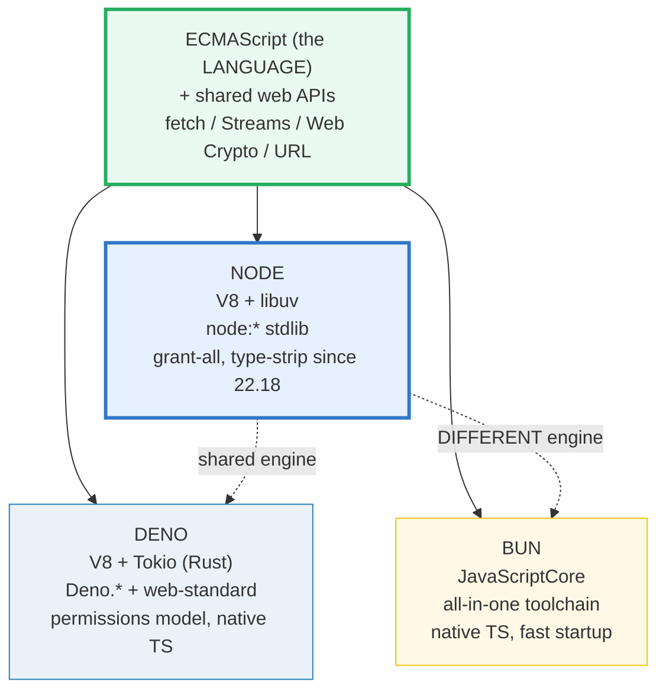

# RUNTIMES_NODE_BUN_DENO — Node (V8+libuv) vs Bun (JSC) vs Deno (V8, secure/web-first)

> **Goal (one line):** feature-detect the **current** runtime (Node, here), print
> the Node+V8+libuv facts observable **now**, and **document** the Bun/Deno facts
> that can't be run in this workspace — the honest expert answer to "Node vs Bun
> vs Deno?".
>
> **Run:** `just run runtimes_node_bun_deno`
>
> **Ground truth:**
> [`core/runtimes_node_bun_deno.ts`](./core/runtimes_node_bun_deno.ts) → captured
> stdout in
> [`core/runtimes_node_bun_deno_output.txt`](./core/runtimes_node_bun_deno_output.txt).
> Every value/table below is pasted **verbatim** from that file under a
> `> From runtimes_node_bun_deno.ts Section X:` callout. Nothing is hand-computed.
>
> **Prerequisites:**
> - 🔗 [`EVENT_LOOP`](./EVENT_LOOP.md) (P4) — *read first*. The single-threaded
>   loop is the mechanism all three runtimes schedule onto; here we only contrast
>   *whose* loop (libuv in Node, Tokio+V8 in Deno, JSC's own in Bun).
> - 🔗 [`BUILD_TOOLING`](./BUILD_TOOLING.md) (P6) — the `tsc` (check) vs
>   `tsx`/esbuild (run) split; this bundle documents why the workspace runs via
>   `tsx` rather than Node's native type-stripping.

---

## 1. Why this bundle exists (lineage)

TypeScript/JavaScript has **three production runtimes**. They all execute the
**same language** (ECMAScript) and increasingly the **same web-API surface**
(`fetch`, Web Streams, Web Crypto), so most code is portable — but they differ
in **engine**, **stdlib shape**, and **toolchain**, and those differences decide
which to pick. This is the Phase 8 "expert payoff" on the runtime question.

| Runtime | Engine | Native TS | Toolchain | Headline trait |
|---|---|---|---|---|
| **Node** | V8 + libuv | since v22.18 (type-strip) | `tsc`/`tsx`/npm (separate tools) | the incumbent — largest ecosystem, most-documented internals |
| **Bun** | **JavaScriptCore** (JSC) | out of the box | all-in-one (run+bundle+test+install) | faster startup, one binary |
| **Deno** | V8 | out of the box | built-in (`deno test`/`fmt`/`lint`) | secure-by-default permissions, web-standard-first |



**Why this curriculum pinned Node (V8).** Stability, the largest ecosystem, and
— crucially — **publicly documented internals**: V8's Orinoco GC, the
ignition/turbofan JIT, and libuv's event-loop phases are all written up on
v8.dev and nodejs.org. That means the engine-internal bundles in this folder
(🔗 `EVENT_LOOP`, 🔗 `GARBAGE_COLLECTION`) are **Node-accurate by construction**.
Bun's JavaScriptCore and Deno's V8+Tokio are *contrasts* here, not the spine.

> 🔗 [`GARBAGE_COLLECTION`](./GARBAGE_COLLECTION.md) — the V8 Orinoco collector
> (generational, mostly concurrent). Node **and Deno** run V8, so that bundle
> describes both; **Bun runs JSC**, whose GC differs — the single most important
> engine caveat in this guide (§6).
>
> 🔗 [`BUILD_TOOLING`](./BUILD_TOOLING.md) (P6) — `tsc` type-checks without
> emitting; `tsx`/esbuild erases types without checking. Node's native
> type-stripping (§3) is a *third* path that strips without checking either.
>
> 🔗 `DEPLOYMENT` (P8, planned) — **edge runtimes** (Cloudflare Workers, Vercel)
> run on **V8 isolates**, not a full Node — a fourth deployment target that
> *shares V8* with Node/Deno but not the Node stdlib.

---

## 2. Section A — Detect the current runtime (the feature-detection idiom)

The robust way to ask "which runtime am I in?" is `typeof <global>`: it returns
`"undefined"` for an **undeclared** global **without throwing**, whereas a bare
`Bun`/`Deno` reference would throw `ReferenceError` under Node. This is the same
property that makes `typeof undeclaredVar === "undefined"` the canonical
existence probe (🔗 `VALUES_TYPES_COERCION` §2). The idiom, run under Node:

> From `runtimes_node_bun_deno.ts` Section A:
> ```
> Runtime feature-detection signals (observed NOW):
>   typeof Bun            : undefined
>   typeof Deno           : undefined
>   typeof process        : object
>   process.versions.node : 24.7.0
>   detectRuntime()       : node
> [check] typeof Bun === "undefined" (not running under Bun): OK
> [check] typeof Deno === "undefined" (not running under Deno): OK
> [check] typeof process === "object" (Node exposes the process global): OK
> [check] typeof process.versions.node === "string" (we ARE on Node): OK
> [check] detectRuntime() === "node" under this workspace: OK
> ```

**Worked example — `detectRuntime()`, the portable probe.** The bundle defines a
single function that returns `"node" | "bun" | "deno"` in priority order. Because
`Bun` and `Deno` are absent here, both `typeof` guards fail and it falls through
to `"node"`. Pasted from the `.ts`:

```typescript
const runtimeGlobals = globalThis as unknown as {
  Bun?: { readonly version: string };
  Deno?: { readonly version: { readonly deno: string } };
};

function detectRuntime(): "node" | "bun" | "deno" {
  if (typeof runtimeGlobals.Bun !== "undefined") return "bun";
  if (typeof runtimeGlobals.Deno !== "undefined") return "deno";
  return "node";
}
```

Two expert details in that snippet:

1. **Why `globalThis as unknown as {...}`, not a bare `typeof Bun`.** `Bun` and
   `Deno` are globals that **do not exist under `@types/node`**, so a bare
   `typeof Bun` is a `tsc` error (cannot find name). Widening `globalThis`
   through `as unknown as { Bun?: ...; Deno?: ... }` is a **type-only** cast —
   it **emits no code** (assertions are erased by `tsx`/`tsc`), so the runtime
   `typeof` check still reflects the *real* current global (`undefined` under
   Node). No `any` is used: the members are concrete optional shapes.
2. **Priority order matters.** A future runtime that defined both would resolve
   to the first match; here the three are mutually exclusive, so order is only a
   tie-break convention.

```mermaid
graph TD
    Q{"typeof Bun?"} -->|"!== undefined"| B["return \"bun\""]
    Q -->|"undefined"| Q2{"typeof Deno?"}
    Q2 -->|"!== undefined"| D["return \"deno\""]
    Q2 -->|"undefined"| N["return \"node\"<br/>(process.versions.node is the signal)"]
    style N fill:#e7f0ff,stroke:#3178c6,stroke-width:3px
```

---

## 3. Section B — Node: V8 + libuv (the incumbent) & the native-TS path

Node is **V8** (the JS engine) + **libuv** (the event loop) + a large C++ core
(`fs`/`net`/`crypto`/…). Both the engine and the loop expose their version on
`process.versions` — and those values are **constants of the installed binary**,
so they are deterministic across `just out` runs (they are not clock- or
PRNG-derived; see §4.2 rules 1–2).

> From `runtimes_node_bun_deno.ts` Section B:
> ```
> Node's engine stack (from process.versions — constants of this binary):
>   process.versions.node : 24.7.0   <- the Node.js release
>   process.versions.v8   : 13.6.233.10-node.26   <- the JS ENGINE (V8)
>   process.versions.uv   : 1.52.1   <- libuv (the event loop)
> [check] typeof process.versions.v8 === "string" (V8 is the engine): OK
> [check] typeof process.versions.uv === "string" (libuv is bundled): OK
> [check] process.versions.v8 starts with a digit (a real semver-ish version): OK
> ```

**`process.versions.v8` vs `process.versions.uv` — engine vs loop.** V8 *runs*
JavaScript; libuv *polls the OS* (sockets, files, timers) and hands completed
I/O back to V8 as callbacks. The event loop you study in 🔗 `EVENT_LOOP` is
**libuv's** loop, not V8's. Pinning both versions proves both are present in
*this* process.

**Native TypeScript execution — the Node path.** Node added
`--experimental-strip-types` in v22.6 and made type-stripping the **default** in
**v22.18.0+** for *erasable-only* syntax (no `enum`, no parameter properties, no
runtime namespaces). `process.features.typescript` exposes the mode. But this
workspace routes every run through **`tsx`** (esbuild) via the `Justfile`, for
cross-version stability — and that is **detectable** from `process.execArgv`
(the loader path is reduced to a boolean before printing, so output stays
machine-independent):

> From `runtimes_node_bun_deno.ts` Section B:
> ```
> Native TypeScript execution (the Node path, observed NOW):
>   process.features.typescript : strip   <- "strip" = Node can erase types
>   running via tsx (loader)?   : true   <- the Justfile uses tsx, not bare node
> [check] process.features.typescript === "strip" (Node's native type-stripping is on): OK
> [check] this workspace run is routed through tsx (process.execArgv contains tsx): OK
> ```

**Node strips types but does NOT type-check.** `node file.ts` runs after erasing
erasable syntax; catching type errors is a **separate** `tsc --noEmit` gate
(🔗 `BUILD_TOOLING`). `tsx`/esbuild behaves the same way (erase without check),
which is exactly why this workspace has **two** gates: `just run` (tsx) and
`just typecheck` (tsc).

---

## 4. Section C — Bun: JavaScriptCore + all-in-one toolchain (DOCUMENTED)

Bun **cannot be executed in this workspace** — Section A asserted
`typeof Bun === "undefined"`. Everything below is **documented** from
`bun.sh/docs`; it is not `check()`'d because there is no Bun global to observe
here.

> From `runtimes_node_bun_deno.ts` Section C:
> ```
> Bun facts (DOCUMENTED — not executable under Node; typeof Bun === "undefined"):
>   Engine        : JavaScriptCore (JSC, Apple's) — NOT V8. Different GC and
>                   JIT internals from Node/Deno (🔗 GARBAGE_COLLECTION caveat).
>   TypeScript    : runs .ts / .tsx / .jsx NATIVELY — no tsx, no build step.
>   Toolchain     : all-in-one — runtime + bundler + test runner (`bun test`)
>                   + package manager (`bun install`). One binary does all four.
>   Startup       : faster cold start than Node (JSC + a Zig-written core).
>   Node compat   : implements Node-API so native addons built for Node run
>                   unmodified; npm-package compat is high but not 100%.
> ```

**The JavaScriptCore difference (the engine caveat).** Bun is the only one of
the three **not** on V8. JSC has its own garbage collector and JIT, so a lesson
on "V8's Orinoco GC" or "ignition + turbofan tiering" is **Node/Deno-accurate
but not Bun-accurate**. What *is* identical under Bun is the **language**: the
value/reference split, coercion, closures, the prototype chain, and async
semantics all behave the same, because all three run ECMAScript. Only the engine
+ stdlib + toolchain differ.

---

## 5. Section D — Deno: V8 + permissions + web-standard-first (DOCUMENTED)

Deno **cannot be executed in this workspace** — Section A asserted
`typeof Deno === "undefined"`. The facts below are **documented** from
`docs.deno.com`.

> From `runtimes_node_bun_deno.ts` Section D:
> ```
> Deno facts (DOCUMENTED — not executable under Node; typeof Deno === "undefined"):
>   Engine        : V8 (the SAME engine as Node) — so V8-internal bundles
>                   (🔗 GARBAGE_COLLECTION) are Deno-accurate too.
>   TypeScript    : runs .ts NATIVELY — type-stripping is built in.
>   Permissions   : secure-by-default. A script has NO file/net/env access
>                   unless granted: --allow-read, --allow-net, --allow-env,
>                   --allow-run ... or --allow-all (-A). Node/Bun grant all.
>   Stdlib        : a `Deno.*` namespace + web-standard-first (fetch, Web
>                   Streams, Web Crypto as the primary surface), NOT node:*.
>   npm compat    : can import npm packages via `npm:` specifiers; node:*
>                   compat layer exists, but the native idiom is web-standard.
> ```

**Deno shares V8 with Node — but asks before it acts.** The headline contrast is
the **permission model**: a Deno script has **no** file/network/environment
access unless the operator grants it with `--allow-read`, `--allow-net`,
`--allow-env`, `--allow-run`, … (or `--allow-all` / `-A`). Node and Bun grant
everything by default. The second contrast is the **stdlib entry point**: Deno's
native surface is the `Deno.*` namespace plus web standards, with a `node:*`
compat layer available but secondary.

---

## 6. Section E — Shared web APIs (convergence) + which to pick + the V8/JSC caveat

The convergence story is the unifying fact of the three runtimes: `fetch`,
`Request`/`Response`/`Headers`, the **Web Streams** (`ReadableStream`, …), `URL`,
**Web Crypto** (`crypto.subtle`), and `queueMicrotask` are globals in **all
three**. The bundle asserts their presence under Node (Node 18+ added them as
globals); the same names exist under Bun and Deno — *that* is the web-standard
surface.

> From `runtimes_node_bun_deno.ts` Section E:
> ```
> Shared web APIs (present as globals under Node — same names in Bun/Deno):
>   fetch              -> function
>   Request            -> function
>   Response           -> function
>   Headers            -> function
>   ReadableStream     -> function
>   URL                -> function
>   crypto.subtle      -> object
>   queueMicrotask     -> function
> [check] typeof fetch is defined (web-standard API present under Node): OK
> [check] typeof Request is defined (web-standard API present under Node): OK
> [check] typeof Response is defined (web-standard API present under Node): OK
> [check] typeof Headers is defined (web-standard API present under Node): OK
> [check] typeof ReadableStream is defined (web-standard API present under Node): OK
> [check] typeof URL is defined (web-standard API present under Node): OK
> [check] typeof crypto.subtle is defined (web-standard API present under Node): OK
> [check] typeof queueMicrotask is defined (web-standard API present under Node): OK
> ```

**Which to pick (the honest expert answer — a judgement, documented not run):**

> From `runtimes_node_bun_deno.ts` Section E:
> ```
> Which to pick (DOCUMENTED decision matrix — the honest expert answer):
>   Pick NODE  when: you want stability + the largest ecosystem + the most
>                 documented internals. The safe default (this curriculum).
>   Pick BUN   when: startup speed and an all-in-one toolchain matter most
>                 (scripts, CLIs, monorepos). Accept JSC-vs-V8 internals.
>   Pick DENO  when: a permission/security model or web-standard-first
>                 stdlib is the priority (sandboxed tooling, edge).
> ```

**The V8-vs-JSC internals caveat (the single most important engine fact):**

> From `runtimes_node_bun_deno.ts` Section E:
> ```
> The V8-vs-JSC internals caveat (DOCUMENTED):
>   - Node AND Deno run V8  -> V8-internal bundles (Orinoco GC, the ignition/
>     turbofan JIT, the 🔗 EVENT_LOOP over libuv/Tokio) describe them BOTH.
>   - Bun runs JavaScriptCore -> its GC and JIT differ. A 'how V8 GC works'
>     lesson is Node/Deno-accurate but NOT Bun-accurate (🔗 GARBAGE_COLLECTION).
>   - The shared CORE across all three is ECMAScript + the web APIs above:
>     values, coercion, closures, prototypes, async, fetch, Streams, Crypto.
> ```

The takeaway: **the language and the web APIs are portable; the engine internals
are not.** Code that relies only on ECMAScript + `fetch`/Streams/Crypto runs
unchanged on all three. Code that depends on V8-specific internals (heap
snapshots, `--expose-gc`, specific GC pauses) is Node/Deno-only.

> 🔗 `DEPLOYMENT` (P8, planned) — **edge runtimes** are a *fourth* deployment
> target: Cloudflare Workers / Vercel run on **V8 isolates** (shared V8 with
> Node/Deno, but no Node stdlib and no `node:*`). The "which runtime" question
> there is "which *subset* of the web platform", not "Node vs Bun vs Deno".

---

## 7. Pitfalls (the expert payoff)

| Trap | Symptom | Fix |
|---|---|---|
| Bare `Bun` / `Deno` reference under Node | `ReferenceError: Bun is not defined` | Use `typeof Bun === "undefined"` (or route through `globalThis`). `typeof` never throws on an undeclared global. |
| `typeof Bun` / `typeof Deno` fails `tsc` | TS error "Cannot find name 'Bun'" — these globals are not in `@types/node` | Narrow `globalThis` via `as unknown as { Bun?: ...; Deno?: ... }` (type-only cast, erased at runtime). Never `as any`. |
| Assuming "Node runs TS" means "Node type-checks" | type errors slip into runtime; `node file.ts` strips types silently | Treat `tsc --noEmit` as a **separate** gate (🔗 `BUILD_TOOLING`). `tsx` also erases without checking. |
| Assuming Node's strip-types handles all TS | `enum`, parameter properties, runtime `namespace`, import aliases error at runtime | Those need code generation — use `--experimental-transform-types`, or stay on `tsx`. Erasable-only syntax is the strip scope. |
| Treating V8 internals as universal | a "V8 Orinoco GC" claim is **wrong under Bun** (JSC) | Qualify engine claims: Node **and Deno** are V8; **Bun is JSC**. Language semantics are shared; GC/JIT are not. |
| Assuming the event loop is V8's | confusing the JS engine with the I/O loop | The loop is **libuv** in Node (`process.versions.uv`), Tokio+V8 in Deno, JSC's own in Bun. V8 just runs JS. |
| Expecting Deno to read a file with no flag | `PermissionDenied` at runtime | Grant `--allow-read` (or `-A`). Deno is secure-by-default; Node/Bun grant everything. |
| Assuming `process.*` exists everywhere | code crashes under Deno/Bun's stdlib | Feature-detect (`typeof process === "object"`); prefer web-standard APIs (`fetch`, `URL`) for portability — all three have them. |
| CJS/ESM interop assumed identical | default-import shape / `require` behavior differs across runtimes | Node has the strictest ESM/CJS boundary; Deno is ESM-first; Bun is permissive. Test on the target runtime. |
| Printing `process.execArgv` / `process.argv` directly | absolute, machine-specific paths break byte-identical output | Reduce to a boolean (`arg.includes("tsx")`) or a version string before printing (§4.2 determinism). |

---

## 8. Cheat sheet

```typescript
// === Detect the runtime (the feature-detection idiom) ======================
//   typeof Bun  === "undefined"   // absent under Node and Deno
//   typeof Deno === "undefined"   // absent under Node and Bun
//   process.versions.node          // a string => we ARE on Node
//   Route Bun/Deno through globalThis (they're not in @types/node):
//     const g = globalThis as unknown as { Bun?: unknown; Deno?: unknown };
//     const onBun  = typeof g.Bun  !== "undefined";
//     const onDeno = typeof g.Deno !== "undefined";
//   typeof never throws on an undeclared global -> the SAFE existence probe.

// === The three runtimes ====================================================
//   Node  : V8 + libuv   | type-strip since 22.18 (no check) | node:* stdlib | grant-all
//   Bun   : JavaScriptCore | native .ts/.tsx/.jsx | all-in-one (run+bundle+test+install)
//   Deno  : V8 + Tokio   | native .ts            | Deno.* + web-standard | --allow-* perms

// === Node engine/loop signals (constants of the binary) ====================
//   process.versions.node  // "24.7.0"          the Node release
//   process.versions.v8    // "13.6..."          the JS ENGINE (V8)
//   process.versions.uv    // "1.52.1"           libuv — the EVENT LOOP (not V8's)
//   process.features.typescript  // "strip" | "transform" | false  (native TS mode)

// === Native TypeScript execution ===========================================
//   Node  : `node file.ts` strips ERASABLE types since 22.18 (no flag); NO type-check.
//           enums / param-props / runtime namespaces need --experimental-transform-types.
//   Bun   : runs .ts/.tsx/.jsx natively, no build step.
//   Deno  : runs .ts natively, type-strip built in.
//   THIS workspace: routed through tsx (esbuild) — erase without check; `just typecheck` is the gate.

// === Shared web APIs (globals in ALL three) ================================
//   fetch  Request  Response  Headers  ReadableStream  WritableStream  TransformStream
//   URL  URLSearchParams  TextEncoder/Decoder  crypto.subtle (Web Crypto)  queueMicrotask
//   => code using only ECMAScript + these is portable across Node/Bun/Deno.

// === Which to pick =========================================================
//   Node  : stability + ecosystem + documented internals (this curriculum's default).
//   Bun   : startup speed + all-in-one toolchain (scripts/CLIs); JSC engine (not V8).
//   Deno  : permissions/security + web-standard-first stdlib (sandboxed/edge).
//   Engine caveat: Node AND Deno = V8 (Orinoco GC, turbofan). Bun = JSC (differs).
```

---

## Sources

Every Node fact above is **asserted at runtime** by the `.ts` itself (`check()`
throws on any mismatch) — the strongest verification: the actual Node 24 + V8
binary's verdict. The Bun/Deno facts are **documented** (not executed, because
neither global exists in this workspace) and were web-verified against the
official runtime docs plus at least one independent secondary source.

**Node.js (asserted at runtime):**
- **Node.js Learn — Running TypeScript Natively** (type-stripping is the default
  in **v22.18.0+** for erasable-only syntax; `--experimental-strip-types` before
  that since v22.6; Node strips but does **not** type-check; constraints: no
  `enum`, no parameter properties, no runtime namespaces; the Amaro loader does
  not use `tsconfig.json`):
  https://nodejs.org/learn/typescript/run-natively
- **Node.js API — `process.versions`** (`node`, `v8`, `uv` (libuv), and the rest
  are constants of the binary):
  https://nodejs.org/api/process.html#processversions
- **Node.js API — `process.features.typescript`** (`"strip"` by default,
  `"transform"` with `--experimental-transform-types`, `false` with
  `--no-experimental-strip-types`; since v22.10.0):
  https://nodejs.org/api/process.html#processfeaturestypescript
- **Node.js Learn — The V8 JavaScript Engine** (Node = V8 + a C++ core; V8 runs
  JS while the host provides the I/O loop):
  https://nodejs.org/learn/getting-started/the-v8-javascript-engine
- **Node.js API — Fetch / Web Streams / Web Crypto globals** (global `fetch`,
  `Request`/`Response`/`Headers`, Web Streams, Web Crypto added as globals;
  undici-backed):
  https://nodejs.org/api/globals.html

**Bun (documented from bun.sh):**
- **Bun Docs — Runtime overview** (Bun is built on **JavaScriptCore**, runs
  TypeScript/JSX natively, and ships runtime + bundler + test runner + package
  manager in one binary): https://bun.sh/docs
- **Bun — Node-API compatibility** (Bun implements Node-API so native addons
  built for Node run unmodified): https://bun.sh/docs/api/node-api
- **Overview of new JavaScript/TypeScript runtimes: Bun and Deno** (Bun uses
  Apple's JavaScriptCore; native TS without a transpiler; faster startup):
  https://dushkin.tech/posts/bun_and_deno_js_runtimes/

**Deno (documented from docs.deno.com):**
- **Deno Docs — Security and permissions** (secure-by-default; no file/net/env
  access without `--allow-read`, `--allow-net`, `--allow-env`, `--allow-run`, or
  `--allow-all` / `-A`): https://docs.deno.com/runtime/fundamentals/security/
- **Deno Docs — Permissions reference** (the full `--allow-*` set):
  https://docs.deno.com/runtime/reference/permissions/
- **Deno — Web-standard APIs** (Deno implements fetch, Web Streams, Web Crypto,
  URL, etc. as the primary surface; `Deno.*` namespace; V8 engine):
  https://docs.deno.com/runtime/fundamentals/web_standards/

**Engine internals (V8 vs JavaScriptCore):**
- **V8 Blog — Trash talk: the Orinoco garbage collector** (Orinoco, V8's GC,
  evolved into a mostly parallel and concurrent collector — accurate for Node
  **and Deno**, both V8): https://v8.dev/blog/trash-talk
- **V8 Blog — Orinoco: young generation GC (parallel Scavenger)**:
  https://v8.dev/blog/orinoco-parallel-scavenger

**Secondary corroboration (independent of the official docs, ≥1 per major claim):**
- LogRocket — *Running TypeScript in Node.js: tsx vs ts-node vs native* (Node's
  type-stripping path vs the `tsx` runner; the no-type-check caveat):
  https://blog.logrocket.com/running-typescript-node-js-tsx-vs-ts-node-vs-native/
- Sebastian Staffa — *A look at native TypeScript performance* (Node 23.6.0
  stabilized native TS, dropping the experimental flag): https://sebastian-staffa.eu/posts/nodejs-native-ts-benchmark/

**Facts that could not be verified by running (documented, not executed):** every
Bun and Deno claim above (engine = JSC / V8, native TS, the permission model,
the `Deno.*` stdlib, Node-API compat, startup-speed characterization). They are
not `check()`'d because `typeof Bun === "undefined"` and
`typeof Deno === "undefined"` under this workspace's Node — exactly as Section A
asserts. The Node-side facts (`process.versions.node/v8/uv`,
`process.features.typescript === "strip"`, the web-API globals, the tsx loader
in `process.execArgv`) **are** asserted at runtime and reproduce identically on
every `just out`.
