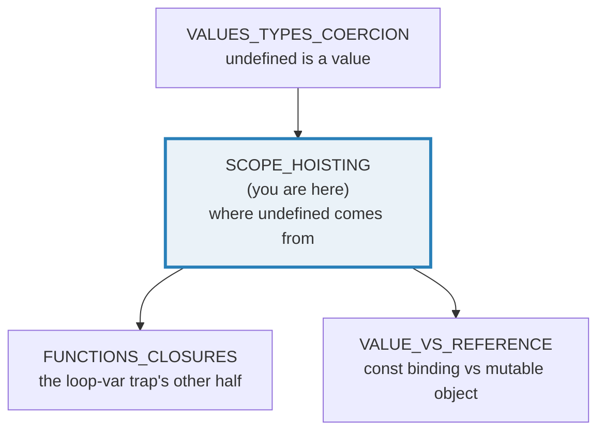
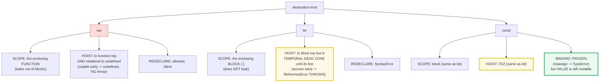
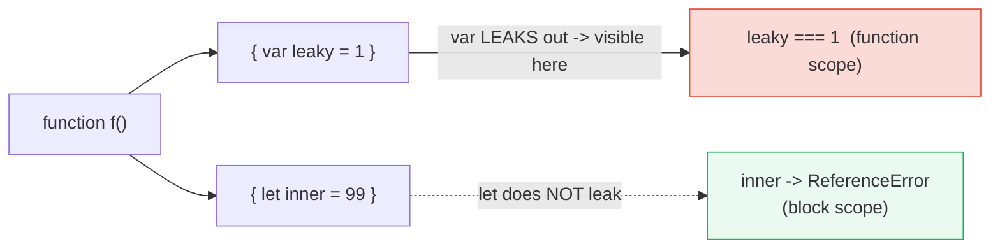
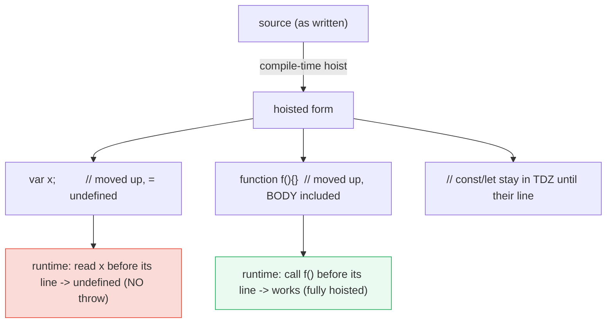
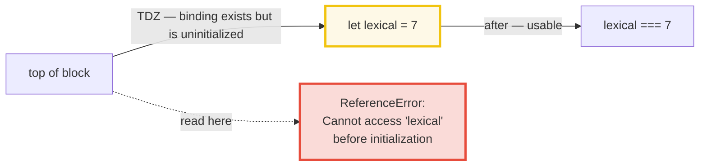
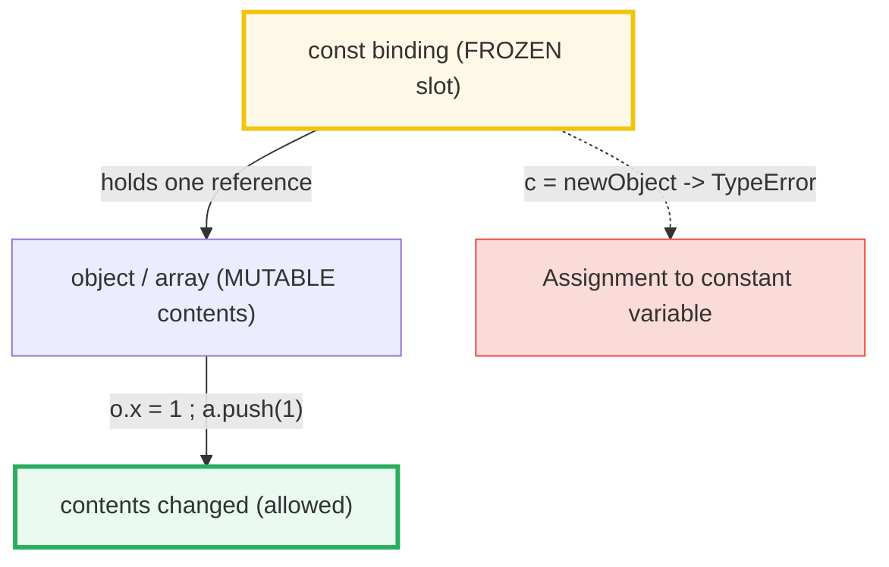
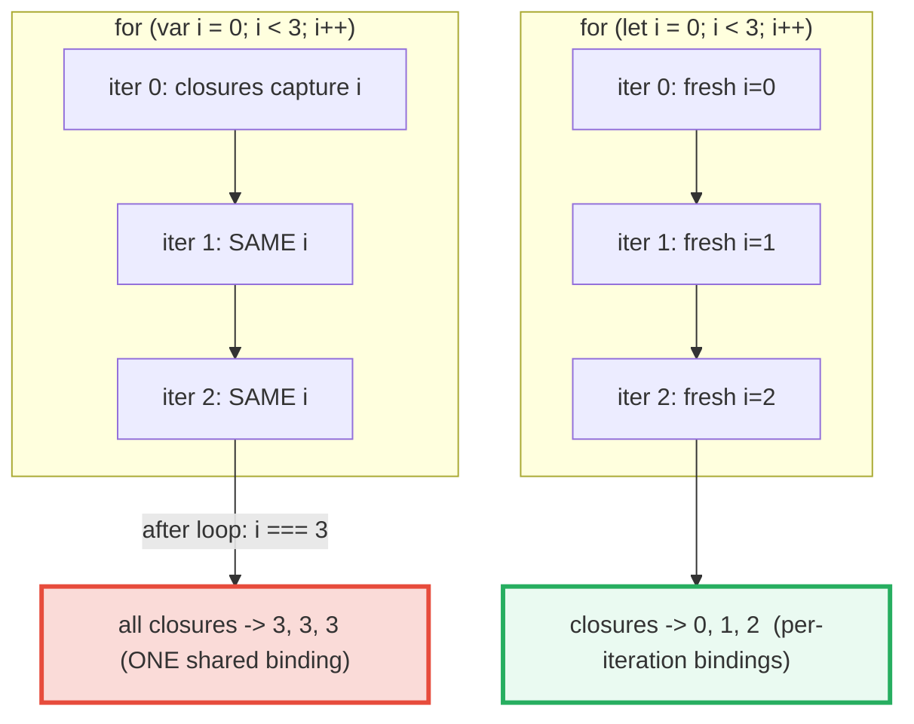

# SCOPE_HOISTING — `var` vs `let`/`const`: Scope, Hoisting & the Temporal Dead Zone

> **Goal (one line):** show, by printing every value, how `var` (function-scoped,
> hoisted, silently `undefined`) differs from `let`/`const` (block-scoped, hoisted
> but in a **Temporal Dead Zone** until initialized) — pinning the two most
> infamous JS bugs (the loop-var-capture closure trap and the TDZ throw) and the
> `const`-binding-vs-value distinction as `check()`'d invariants.
>
> **Run:** `just run scope_hoisting`
>
> **Ground truth:** [`scope_hoisting.ts`](./core/scope_hoisting.ts) → captured
> stdout in [`scope_hoisting_output.txt`](./core/scope_hoisting_output.txt).
> Every number/table/error below is pasted **verbatim** from that file under a
> `> From scope_hoisting.ts Section X:` callout. Nothing is hand-computed.
>
> **Prerequisites:** 🔗 [`VALUES_TYPES_COERCION`](./VALUES_TYPES_COERCION.md)
> (you must already know `undefined` is a primitive and that TS types are erased
> at runtime). The loop-var trap pairs with 🔗
> [`FUNCTIONS_CLOSURES`](./FUNCTIONS_CLOSURES.md) — closures capture the
> *binding*, which is the trap's other half.

---

## 1. Why this bundle exists (lineage)

`var` (function-scoped, hoisted to the top of its function and initialized to
`undefined`) caused the **two most infamous JavaScript bugs**:

1. **The loop-var-capture trap.** A `for (var i …)` loop creates **one**
   function-scoped binding reused across every iteration. Every closure created
   inside the loop captures *that same cell* — so by the time the closures run,
   they all see the **final** value of `i`. (🔗 `FUNCTIONS_CLOSURES` — this is the
   closure half; `var` supplies the single shared binding the closures latch onto.)
2. **Silent-`undefined` reads.** Using a `var` *before* its assignment line never
   threw — it just returned `undefined`, because the declaration was hoisted and
   auto-initialized. Bugs from "I forgot to assign it" became silent `undefined`s
   instead of loud errors.

`let`/`const` (ES2015) fix **both**. They are **block-scoped** (no leaking out of
`{ }`), and although they **also hoist**, they land in a **Temporal Dead Zone
(TDZ)** — any access *before* the declaration line throws a `ReferenceError`.
`const` adds one more rule: it freezes the **binding** (reassignment throws
`TypeError`), but **not the value** (object/array contents stay mutable).



The headline contrast with sibling languages is the whole point:

> 🔗 [`../go/FUNCTIONS_CLOSURES.md`](../go/FUNCTIONS_CLOSURES.md) — Go had the
> **identical** loop-var-capture bug pre-1.22 (one loop variable reused per
> iteration). Go 1.22 fixed it by creating a **fresh variable per iteration** —
> *exactly* what JS `let` already does. Same bug class, different language;
> `let` is JS's built-in version of the Go 1.22 fix.
>
> 🔗 [`../rust/OWNERSHIP.md`](../rust/OWNERSHIP.md) — Rust has **no hoisting at
> all**: a binding must be declared before use (the compiler enforces it), and
> everything is block-scoped by default. There is no `var`, no TDZ, and no
> silent-`undefined` — Rust's compile-time checks make both bug classes
> impossible. JS instead hoists everything and relies on the TDZ to turn the
> silent bug into a *loud runtime* error.

---

## 2. The mental model: three declaration kinds, two scope shapes

Every variable declaration is one of `var`, `let`, or `const`. They differ on
**scope** (where the name is visible) and on **initialization timing** (when the
binding becomes usable):



> From `developer.mozilla.org/en-US/docs/Web/JavaScript/Reference/Statements/let`
> (verbatim): *"let allows you to declare variables that are limited to the
> scope of a block statement… let declarations are hoisted to the top of the
> (block) scope and are NOT initialized. … This is called the **temporal dead
> zone**."* And from the TDZ error page:
> `ReferenceError: Cannot access 'X' before initialization` — *"accessing a
> `let` or `const` variable before it's been initialized"*.

**The one-sentence summary of this whole bundle:** `var` hoists *and* initializes
to `undefined` (silent); `let`/`const` hoist but **do not initialize** until
their line (loud `ReferenceError` if you read them early). That initialization
gap *is* the TDZ.

---

## 3. Section A — `var` is FUNCTION-scoped (leaks); `let`/`const` are BLOCK-scoped

A block is any `{ … }` — the body of an `if`/`for`/`while`, a standalone `{ }`,
or a `catch (e)` clause. `var` ignores block boundaries (its scope is the whole
enclosing **function**); `let`/`const` honor them.



> From scope_hoisting.ts Section A:
> ```
> var in an if-block LEAKS out (function-scoped):
>   after if-block: leaky=1  (var leaked out of the block)
> [check] var declared inside an if-block is visible outside it (function scope): OK
>
> let in a block does NOT leak (block-scoped) -> ReferenceError outside:
>   inside-block value was 99; after block -> ReferenceError: inner is not defined
> [check] let block-scoped: referencing it outside its block throws ReferenceError: OK
>
> catch (e) binds e ONLY to the catch clause (block-scoped):
>   inside catch: e.message="boom" | outside catch -> ReferenceError: e is not defined
> [check] catch parameter is block-scoped: out of scope after the catch: OK
> ```

**What to notice.** `var leaky` declared inside an `if` block is **visible
outside it** — `leaky === 1` after the block. That is the function-scope leak.
The `let inner` declared inside a `{ }` block throws `ReferenceError: inner is
not defined` once you step outside the block — the binding simply does not exist
there (note: this is **not** a TDZ; the binding is *gone*, not uninitialized).
Likewise the `catch (e)` parameter `e` is scoped **only** to the catch clause.

**ESM module scope (top-level `var` is not global).** This bundle runs as an ES
module (`package.json` `"type": "module"`), so a top-level `var` is
**module-scoped** and does **not** attach to `globalThis`:

> From scope_hoisting.ts Section A:
> ```
> ESM module scope (top-level var is module-scoped, NOT global):
>   moduleScopedVar (direct access)        = 7
>   globalThis.moduleScopedVar            = undefined   (NOT leaked onto globalThis in a module)
> [check] ESM module: top-level var is accessible within the module: OK
> [check] ESM module: top-level var is NOT on globalThis (module-scoped, not global): OK
> ```

In a **classic `<script>`** (non-module), that same top-level `var` *would*
become a property of `globalThis` — a global. ES modules closed that leak: a
module is its own scope, so top-level `var`/`let`/`const` never pollute the
global object. (Functions/`var` at the top of a classic script are the only
constructs that create globals; `let`/`const`/`class` at the top of a classic
script are *script-scoped* and also not on `globalThis`.)

> From `developer.mozilla.org/en-US/docs/Web/JavaScript/Guide/Grammar_and_types`
> (verbatim): *"At the top level of programs and functions, `let`, unlike `var`,
> does not create a property on the global object."*

---

## 4. Section B — Hoisting: `var` hoists + inits to `undefined` (no throw); function declarations fully hoisted

**Hoisting** means the declaration is moved to the top of its scope *during
compilation, before execution*. The crucial difference is what gets initialized:

- **`var`** hoists the declaration **and** initializes it to `undefined`. So
  reading it before the assignment line returns `undefined` — **no throw**. This
  is the silent-undefined hole.
- **`function` declarations** hoist the binding **and the entire body**, so the
  function is fully callable from lines above its definition.
- **function expressions** (`const fn = function () {…}`) are *not* hoisted as
  functions — the `const` is in the TDZ until its line (Section C).



> From scope_hoisting.ts Section B:
> ```
> var is hoisted AND initialized to undefined (usable early, NO throw):
>   before: typeof="undefined" value=undefined (NO throw) | after: value=1
> [check] var hoists + inits to undefined: typeof-before === 'undefined' (no throw): OK
> [check] var usable before its assignment line returns undefined (NOT an error): OK
>
> function DECLARATION is fully hoisted (callable before its line):
>   called from a line ABOVE this declaration (function declarations are fully hoisted)
> [check] function declaration callable before its source line (fully hoisted): OK
>
> function EXPRESSION (const fn = ...) is NOT hoisted -> TDZ before its line:
>   ReferenceError: Cannot access 'exprFn' before initialization | after init: exprFn()="expression result"
> [check] function expression in TDZ before its const line: throws ReferenceError: OK
> ```

**Read the var line carefully:** `before: typeof="undefined" value=undefined (NO
throw)`. The `var x = 1` *assignment* happens on its own line at runtime, but the
*declaration* was hoisted and initialized to `undefined`, so an early read yields
`undefined` rather than an error. Contrast that with `let`/`const`, where the
identical early read **throws** (Section C). That single behavioral difference —
silent `undefined` vs loud `ReferenceError` — is the entire reason the TDZ was
invented.

> From `developer.mozilla.org/en-US/docs/Web/JavaScript/Guide/Grammar_and_types`
> (verbatim): *"Because variable declarations (and declarations in general) are
> processed before any code is executed, declaring a variable anywhere in the
> code is equivalent to declaring it at the top. This also means that a variable
> can appear to be used before it's declared. This behavior is called
> **hoisting**… `var` variables are hoisted and initialized with `undefined`."*

**Function declarations vs expressions.** `function f() {}` (a *declaration*
statement) hoists in full — `f()` works before its line. `const f = () => {}`
(an *expression* assigned to `const`) does **not**: `f` is a `const` in the TDZ
until the assignment line, so calling it early throws
`ReferenceError: Cannot access 'exprFn' before initialization`. The `const`
overload is the modern default, which is why you must define your `const fn`
*before* you use it (and why TypeScript's "used before declaration" lint catches
this at compile time).

---

## 5. Section C — The Temporal Dead Zone: `let`/`const` before initialization THROWS

`let` and `const` **are hoisted** (the binding exists from the top of the block),
but they are **not initialized** until execution reaches the declaration line.
The span between the top of the scope and that line is the **Temporal Dead Zone
(TDZ)**: any read in that window throws `ReferenceError`.



> From scope_hoisting.ts Section C:
> ```
> let IS hoisted but sits in the TDZ until its line -> ReferenceError:
>   ReferenceError: Cannot access 'lexical' before initialization | after init: lexical=7
> [check] let TDZ: reading before initialization throws ReferenceError: OK
> [check] let TDZ message includes "before initialization": OK
>
> const follows the SAME TDZ rule as let:
>   ReferenceError: Cannot access 'frozen' before initialization | after init: frozen=7
> [check] const TDZ: reading before initialization throws ReferenceError: OK
> [check] const TDZ message includes "before initialization": OK
>
> Re-declaration: var allows it silently; let/const is a SyntaxError:
>   var r=1; var r=2; -> r=2 (re-declaration silently allowed)
>   let d=1; let d=2; -> SyntaxError: Identifier 'd' has already been declared
> [check] var re-declaration in the same scope is silently allowed (no error): OK
> [check] let re-declaration in the same scope throws SyntaxError: OK
> [check] let re-declare message includes "already been declared": OK
> ```

**Why the TDZ exists.** The TDZ is a **deliberate** design choice (ES2015) to
kill the silent-`undefined` bug class. Before ES2015, `console.log(x); var x =
1;` printed `undefined` — no error, just a silent wrong value. With `let`, the
identical pattern **throws**, turning a confusing runtime `undefined` into an
immediate, locatable error. The error message is *temporal* because the rule is
about **time** (the moment of initialization), not just position: even
`typeof lexical` throws in the TDZ (unlike `typeof` of a truly-undeclared name,
which safely returns `"undefined"`).

**The determinism discipline in the `.ts`.** TDZ throws are *deterministic*
(same throw every run, no scheduling involved), but the *exact wording* varies
across engines. The bundle catches the throw, formats it via `describe()`, and
asserts a **stable substring** of the message — `"before initialization"` for the
TDZ, `"already been declared"` for re-declaration — never the full engine string.

**Re-declaration rules.** `var r = 1; var r = 2;` is **silently allowed** (the
second wins; `r === 2`). `let d = 1; let d = 2;` in the same scope is a
**`SyntaxError: Identifier 'd' has already been declared`**. This is a
**parse-time** error — it would fail the whole file if written literally — so the
`.ts` isolates it via `eval("let d = 1; let d = 2;")`, parsing an independent
string so the `SyntaxError` is thrown (and caught) at runtime without breaking
the bundle. `const` follows the same no-redeclare rule as `let`.

> From `developer.mozilla.org/en-US/docs/Web/JavaScript/Reference/Errors/Cant_access_lexical_declaration_before_init`
> (verbatim): *"The variable is in the **Temporal Dead Zone**… You cannot access
> a `let` or `const` variable before it's been initialized."* Message (V8):
> `ReferenceError: Cannot access 'X' before initialization`.

> 🔗 [`VALUES_TYPES_COERCION`](./VALUES_TYPES_COERCION.md) §3 — that bundle asserts
> an unassigned `let` *is* `undefined`, but it does **not** explain the
> distinction at the heart of this bundle: `undefined` **the value** (a `var`
> read early, or a `let` read *after* its declaration but before assignment) vs.
> the **TDZ error** (a `let`/`const` read *before* its declaration line). This
> bundle is where that distinction lives.

---

## 6. Section D — `const` BINDING vs VALUE: reassignment throws, contents stay mutable

`const` freezes the **binding** (the variable slot that holds the reference), not
the **value** (the object/array the reference points at). So:

- **Reassigning the binding** (`c = …`) throws `TypeError: Assignment to constant
  variable.` — the slot is frozen.
- **Mutating the value** (`o.x = 1`, `a.push(1)`) **works** — the object/array is
  still fully mutable; only the reference cannot be pointed elsewhere.



> From scope_hoisting.ts Section D:
> ```
> const freezes the BINDING, not the value (object/array contents mutate):
>   const o={}; o.x=1 -> o.x=1 (mutation OK) | const a=[]; a.push(1) -> a=[1] (mutation OK)
> [check] const object: mutating a property through the binding works (o.x === 1): OK
> [check] const array: pushing through the binding works (a=[1]): OK
>
> Reassigning the const BINDING itself throws TypeError:
>   const c={n:1}; c={n:2} -> TypeError: Assignment to constant variable. | c is still {"n":1}
>   const p=1; p=2 -> TypeError: Assignment to constant variable. | p is still 1
> [check] const reassign (object) throws TypeError: OK
> [check] const reassign (primitive) throws TypeError: OK
> [check] const reassign message includes "Assignment to constant variable": OK
> ```

**`const` is not `final`, and it is not immutability.** This is the #1
misconception about `const`: people read it as "this value never changes." It is
not — it means "this *binding* never changes." `const o = {}` does **not** make
`o` immutable; `o.x = 1` works and is visible everywhere `o` is shared. (🔗
`VALUE_VS_REFERENCE` — this is exactly the shared-mutability hazard: a `const`
object is a *constant reference to a mutable object*.) If you genuinely need an
immutable object, reach for `Object.freeze(o)` (shallow) or a frozen/readonly
type — `const` alone never freezes contents.

> From `developer.mozilla.org/en-US/docs/Web/JavaScript/Reference/Statements/const`
> (verbatim): *"An identifier for a variable which value can be reassigned
> [sic]… `const` declarations are block-scoped… The `const` declaration creates a
> **read-only reference to a value**. It does **not** mean the value it holds is
> immutable — just that the variable identifier cannot be reassigned. For
> instance, in the case where the content is an object, this means the object's
> contents (e.g., its properties) may be mutated."* Error on reassignment:
> `TypeError: Assignment to constant variable.`

---

## 7. Section E — THE loop-var-capture trap: `var` shares ONE binding, `let` makes one per iteration

This is the expert payoff — the bug that made a generation of JS developers
switch to `let`. A `for (var i …)` loop creates **one** function-scoped `i`,
reused across every iteration. Every closure created in the loop captures *that
same cell*, so they all read the **final** value. A `for (let i …)` loop, per
spec, creates a **fresh binding per iteration** — each closure captures its own
copy, and the trap vanishes.



> From scope_hoisting.ts Section E:
> ```
> for (var i=0; i<3; i++) fns.push(()=>i):  captured = [3, 3, 3]
>   (all closures share ONE i; by call-time i === 3 for every closure)
> [check] var loop capture: all closures return the SAME final value 3: OK
> for (let j=0; j<3; j++) fns.push(()=>j):  captured = [0, 1, 2]
>   (each closure captures its OWN per-iteration binding -> 0, 1, 2)
> [check] let loop capture: each closure returns its own per-iteration value [0, 1, 2]: OK
> ```

**Read the two lines side by side.** Identical loop, identical closures, the
*only* difference is `var` → `let`. With `var`, `captured = [3, 3, 3]` — all
three closures return `3`, because they share the single `i`, which reached `3`
when the loop terminated. With `let`, `captured = [0, 1, 2]` — each closure got
its own per-iteration binding. **One keyword fixes the entire bug class.**

**Why `let` does this (the spec detail).** When a `for` loop's variable is
declared with `let`, the spec mandates a **fresh lexical binding for each
iteration**: at the end of each iteration, the current value is copied into a new
binding for the next iteration, and any closure created in that iteration closes
over *that* copy. So `let` in a loop is *not* merely "block-scoped `var`" — it
has a special per-iteration semantics that exists precisely to fix this closure
trap. (The pre-`let` workaround was an IIFE: `fns.push((function (iCopy) { return
() => iCopy; })(i));` — `let` makes the IIFE implicit.)

> From `developer.mozilla.org/en-US/docs/Web/JavaScript/Closures` (the
> *"Creating closures in a loop"* section, verbatim): *"Alternatively, you could
> use the `let` keyword… If the name `i` is a `let` variable, then a **new
> binding** is created for each iteration of the loop."*

> 🔗 [`FUNCTIONS_CLOSURES`](./FUNCTIONS_CLOSURES.md) — this bundle shows the *scope*
> half of the trap (one `var` binding vs per-iteration `let` bindings). The
> sibling shows the *closure* half: a closure captures the **binding by
> reference**, not by value. The trap is the *intersection* of those two facts:
> `var` supplies one binding, and a closure captures that one binding by
> reference — so every closure ends up aliasing the same final cell.
>
> 🔗 [`../go/FUNCTIONS_CLOSURES.md`](../go/FUNCTIONS_CLOSURES.md) §D — Go had the
> **same** bug pre-1.22: `for i := 0; i < n; i++ { go func() { …i… }() }` made
> every goroutine read the final `i`. Go 1.22 fixed it exactly the way `let`
> does — a fresh `i` per iteration. The Go and JS traps are structurally
> identical; `let` is JS's permanent, built-in version of the Go 1.22 fix.

---

## 8. Pitfalls (the expert payoff)

| Trap | Symptom | Fix |
|---|---|---|
| `for (var i …)` + closures/async callbacks | every closure sees the **final** `i` (`[3,3,3]`) instead of its iteration's value | Use `let i` (fresh binding per iteration). This is THE reason `let` exists in loops. |
| `console.log(x); var x = 1;` | prints `undefined`, **no error** — a silent wrong value | Use `let`/`const` (TDZ throws `ReferenceError` on early access). |
| `console.log(x); let x = 1;` | throws `ReferenceError: Cannot access 'x' before initialization` (TDZ) | Declare `let`/`const` **before** use. The TDZ is the *fix*, not the bug. |
| `typeof tdz` inside the TDZ | throws `ReferenceError` (unlike `typeof undefinedName`, which is safe) | Only `typeof` of a **truly undeclared** name is safe; `typeof` of a TDZ name still throws. |
| `const o = {}; o.x = 1` mutates `o` | `const` did NOT prevent mutation — `o.x` changed | `const` freezes the **binding**, not the value. Need `Object.freeze(o)` (shallow) or a readonly type for immutability. |
| `const a = []; a.push(1)` mutates the array | array contents changed despite `const` | Same as above — `const` is a constant reference, not a frozen value. Use a frozen/readonly structure. |
| `const x = 1; x = 2;` | `TypeError: Assignment to constant variable.` | You cannot reassign a const binding at all — restructure so you don't need to, or use `let`. |
| `let x = 1; let x = 2;` in the same scope | `SyntaxError: Identifier 'x' has already been declared` (parse-time — fails the whole file/module) | Don't redeclare. Use `let` once; reassign with `x = 2`, or pick a different name. (`var` allows redeclare silently — avoid `var`.) |
| `var` inside an `if`/`for`/`while` "stays" in the block | it **leaks out** of the block (function-scoped) — pollutes the whole function | Use `let`/`const` (block-scoped) so block-bound names don't escape. |
| `catch (e) { … } e` after the catch | `ReferenceError: e is not defined` (the catch binding is block-scoped to the clause) | If you need the error after the catch, assign it to an outer `let` inside the clause. |
| Top-level `var` "is global" | in a **classic script** it lands on `globalThis`; in an **ES module** it is module-scoped (not on `globalThis`) | Never rely on global-`var` leaking. ESM modules don't leak; prefer modules + explicit imports/exports. |
| Calling a `const fn = …` before its line | `ReferenceError` (TDZ on the const) — the function expression is not hoisted | Define `const fn` **before** use, OR use a function *declaration* `function fn() {}` (fully hoisted) if you need hoisting. |
| `var` used across reused bindings in async (timers, promises) | same as the loop trap: callbacks read the shared final value | `let` per iteration/declaration; or pass the value as an argument to the callback. |

---

## 9. Cheat sheet

```typescript
// === Scope: WHERE the name is visible =====================================
//   var            -> FUNCTION scope (leaks out of { } / if / for / while)
//   let / const    -> BLOCK scope ({ }, if/for/while bodies, catch clause)
//   top-level var  -> MODULE-scoped in ESM (NOT on globalThis); global in a classic <script>

// === Hoisting: WHEN the binding becomes usable =============================
//   var x           hoisted to fn top AND initialized to undefined.
//                    read-before-line -> undefined (NO throw). The silent hole.
//   let x / const x hoisted to block top but UNINITIALIZED (Temporal Dead Zone).
//                    read-before-line -> ReferenceError "Cannot access 'x' before initialization".
//   function f(){}  hoisted in FULL (binding + body) -> callable before its line.
//   const f = ()=>{} NOT hoisted as a fn -> TDZ before its line (throws).

// === Re-declaration ========================================================
//   var x; var x;   allowed, silent (second wins)
//   let x; let x;   SyntaxError "Identifier 'x' has already been declared" (parse-time)
//   const x; const x;  same SyntaxError as let

// === const: binding vs value ===============================================
//   const o = {}; o.x = 1;   // OK   (binding frozen, VALUE still mutable)
//   const a = []; a.push(1); // OK   (array contents still mutable)
//   const c = 1; c = 2;      // TypeError: Assignment to constant variable. (binding frozen)
//   => const is a constant REFERENCE, NOT immutability. Use Object.freeze() for that.

// === THE loop-var-capture trap (the payoff) =================================
//   for (var i = 0; i < 3; i++) fns.push(() => i);  // fns() -> 3,3,3  (ONE shared i)
//   for (let j = 0; j < 3; j++) fns.push(() => j);  // fns() -> 0,1,2  (fresh j per iter)
//   WHY: `let` in a for-loop creates a FRESH binding each iteration (per spec),
//        so each closure captures its OWN copy. `var` reuses one cell.

// === Deterministic error assertions (what the .ts checks) ==================
//   TDZ          -> ReferenceError, message includes "before initialization"
//   block-scope  -> ReferenceError, message includes "is not defined"
//   const reassign -> TypeError,   message includes "Assignment to constant variable"
//   let redeclare  -> SyntaxError, message includes "already been declared"
```

---

## Sources

Every behavioral claim above was verified against the MDN Web Docs and the
ECMAScript specification, then corroborated by at least one independent secondary
source. Every error message and captured value is *additionally* asserted at
runtime by the `.ts` itself (`check()` throws on any mismatch) — the strongest
possible verification: the actual V8 engine's verdict (Node).

- **MDN — `let` statement** (block scope; *"let declarations are hoisted to the
  top of the (block) scope… NOT initialized… temporal dead zone"*; per-iteration
  binding in `for` loops):
  https://developer.mozilla.org/en-US/docs/Web/JavaScript/Reference/Statements/let
- **MDN — `const` statement** (block scope; *"creates a read-only reference to a
  value… It does not mean the value it holds is immutable — just that the
  variable identifier cannot be reassigned… the object's contents… may be
  mutated"*; reassignment throws `TypeError: Assignment to constant variable.`):
  https://developer.mozilla.org/en-US/docs/Web/JavaScript/Reference/Statements/const
- **MDN — `var` statement** (function scope; hoisting; initialized to
  `undefined`; *"all `var` statements… are hoisted"*; re-declaration allowed):
  https://developer.mozilla.org/en-US/docs/Web/JavaScript/Reference/Statements/var
- **MDN — Grammar and types** (*"This behavior is called **hoisting**… a variable
  can appear to be used before it's declared"*; *"at the top level of programs and
  functions, `let`, unlike `var`, does not create a property on the global
  object"*):
  https://developer.mozilla.org/en-US/docs/Web/JavaScript/Guide/Grammar_and_types
- **MDN — Closures** (the *"Creating closures in a loop"* section; the loop-var
  trap; *"if the name `i` is a `let` variable, then a **new binding** is created
  for each iteration of the loop"*; the IIFE workaround `let` replaces):
  https://developer.mozilla.org/en-US/docs/Web/JavaScript/Closures
- **MDN — ReferenceError: can't access lexical declaration 'X' before
  initialization** (the TDZ error; *"accessing a `let` or `const` variable before
  it's been initialized"*; V8 message `Cannot access 'X' before initialization`):
  https://developer.mozilla.org/en-US/docs/Web/JavaScript/Reference/Errors/Cant_access_lexical_declaration_before_init
- **MDN — SyntaxError: Identifier 'X' has already been declared** (duplicate
  `let`/`const` in the same scope is a parse-time error):
  https://developer.mozilla.org/en-US/docs/Web/JavaScript/Reference/Errors/Identifier_already_declared
- **MDN — TypeError: invalid assignment to const "x"** (`const` reassignment
  throws; Chrome message `Assignment to constant variable.`):
  https://developer.mozilla.org/en-US/docs/Web/JavaScript/Reference/Errors/Invalid_const_assignment
- **ECMAScript® 2027 Language Specification (tc39.es/ecma262)**:
  - §14.3.1 `let` / `const` declarations (block scope; the per-iteration binding
    mechanics for `let` in `for`): https://tc39.es/ecma262/multipage/ecmascript-language-statements-and-declarations.html
  - §9.2 `for` statement — *"CreatePerIterationEnvironment"* (the spec mechanism
    that gives `let` a fresh binding each iteration): https://tc39.es/ecma262/multipage/ecmascript-language-statements-and-declarations.html#sec-forbodyevaluation
  - §14.2.2 `var` declarations (function scope, hoisting, `undefined` init).

**Secondary corroboration (independent of MDN, ≥1 per major claim):**
- Axel Rauschmayer (2ality) — *"Variables and scoping in ECMAScript 6"* (the
  canonical `var`/`let`/`const` + TDZ deep dive; the per-iteration-binding
  explanation for `let` in loops; TDZ is *"the time between entering scope and
  execution of the declaration"*):
  https://2ality.com/2015/02/es6-scoping.html
- Mathias Bynens — *"ES2015 `const` is not about immutability"* (`const` freezes
  the binding, not the value; `const o = {}; o.foo = …` is allowed; only
  `Object.freeze` gives shallow immutability):
  https://mathiasbynens.be/notes/es6-const
- Stack Overflow — *"How do JavaScript closures work? "* (the loop-var-capture
  explanation; the IIFE workaround; multi-answer corroboration that `let` fixes
  it via per-iteration bindings): https://stackoverflow.com/questions/111102

**Facts that could not be verified by running** (documented, not executed,
because they are about a *different* execution context than the bundle's ESM
module): the classic-`<script>` behavior where a top-level `var` attaches to
`globalThis` (this bundle runs as an ES module, where it is module-scoped and
asserted as `undefined` on `globalThis`), and the pre-`let` IIFE workaround.
These are confirmed by the MDN *Grammar and types* / *Closures* pages and the
2ality source cited above, not reproduced as runnable output (the bundle cannot
be both an ES module and a classic script at once). No claim about the bundle's
own runtime behavior is unverified — every value and error above is pasted
verbatim from `scope_hoisting_output.txt`.
