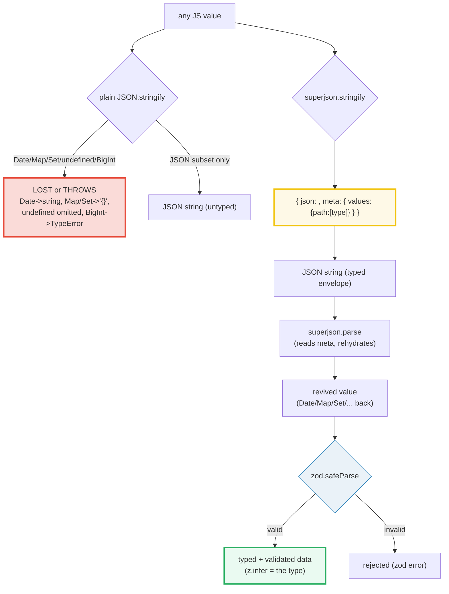
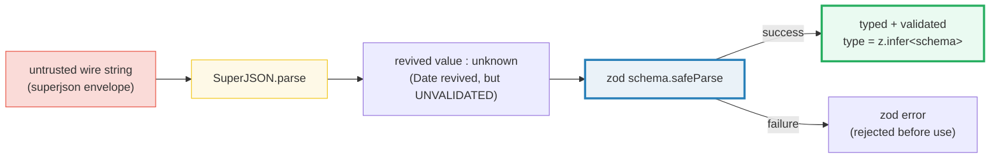

# SERIALIZATION_ADVANCED — Type-Preserving Round-Trips with `superjson` + `zod`

> **Goal (one line):** show, by printing every value, how plain JSON **loses**
> `Date`/`Map`/`Set`/`undefined`/`BigInt`, and how `superjson`'s `{json, meta}`
> envelope plus a `zod` schema give **schema-validated, type-preserving**
> round-trips — the runtime JS analog of Rust's `serde` with custom
> `Serialize`/`Deserialize`.
>
> **Run:** `just run serialization_advanced`
>
> **Ground truth:** [`metaprog/serialization_advanced.ts`](./metaprog/serialization_advanced.ts)
> → captured stdout in
> [`metaprog/serialization_advanced_output.txt`](./metaprog/serialization_advanced_output.txt).
> Every number/table below is pasted **verbatim** from that file under a
> `> From serialization_advanced.ts Section X:` callout. Nothing is hand-computed.
>
> **Prerequisites:**
> - 🔗 [`JSON`](./JSON.md) (Phase 5) — the base `stringify`/`parse` and **exactly
>   what it loses** (this bundle is the fix for those losses).
> - 🔗 [`ZOD_VALIDATION`](./ZOD_VALIDATION.md) (Phase 6) — schema → type, the
>   validation half of the pipeline below.
> - 🔗 [`COLLECTIONS_DEEP`](./COLLECTIONS_DEEP.md) (Phase 5) — why `Map`/`Set`
>   store data in internal slots and so vanish to `"{}"` under plain JSON.

---

## 1. Why this bundle exists (lineage)

Plain JSON is the wire format of the web, but its grammar admits **only**
`string` / `number` / `boolean` / `null` / `array` / `object`. Every other JS
value is **mangled at the boundary**: `Date` → an ISO string that `JSON.parse`
does **not** revive, `Map`/`Set` → `"{}"` (data silently lost), `undefined` →
key omitted, `BigInt` → `TypeError`. The native escape hatch — `toJSON()` and a
`replacer` — is manual and per-call-site (🔗 `JSON` §4 documents both).

Real applications need these values to **round-trip**. [`superjson`](https://github.com/flightcontrolhq/superjson)
(originally built for the Blitz.js fullstack framework, which serialized backend
return values straight to the frontend) is a thin wrapper over
`JSON.stringify`/`parse` that solves this with a **`meta` envelope**: it
rewrites each non-JSON type into a JSON-compatible form and records the original
type on a **path-keyed `meta.values` map**; `parse` reads that map and rehydrates
each path to the right constructor. Layer a [`zod`](https://zod.dev) schema on
top and you get **one source of truth**: the schema is simultaneously the TS
type (`z.infer`), the runtime validator, and (via a JSON Schema emitter) the
cross-language contract.



The headline **cross-language** contrast is the whole point of this bundle:

> 🔗 [`../rust/SERDE_ADVANCED.md`](../rust/SERDE_ADVANCED.md) — Rust's `serde`
> with `#[derive(Serialize, Deserialize)]` is the **strongest model**: the
> (de)serializer is **generated from the type at compile time**, so a
> `DateTime<Utc>` round-trips as a `DateTime<Utc>` with **no runtime revival**
> and **no `meta` envelope** — Rust's types are *not erased*. JS types **are**
> erased at runtime, so `JSON` sees none of them; `superjson`'s `meta` map +
> `zod`'s runtime schema are the **JS analog**: they re-add at runtime what the
> type system cannot carry across the boundary.

> 🔗 [`JSON`](./JSON.md) — this bundle is a **direct sequel**. Every loss in
> `JSON`'s §2/§3/§5 (Date→string, Map/Set→`{}`, undefined→omitted,
> BigInt→`TypeError`) is closed by `superjson` here. The native `toJSON`/replacer
> hooks documented there are the **no-library escape hatch** recapped in §2.

---

## 2. The JSON gaps recap + the native escape hatch (Section A)

Five value kinds that JSON mangles — each is the engine's own verdict, asserted
by `check()`:

> From serialization_advanced.ts Section A:
> ```
> JSON.stringify({d: new Date(0)}) -> {"d":"1970-01-01T00:00:00.000Z"}
> JSON.parse(...) .d typeof        -> string  (a STRING, not a Date)
> parsed .d is a Date instance?    -> false
> [check] JSON.stringify Date -> quoted ISO string: OK
> [check] plain JSON.parse does NOT revive Date (comes back a string): OK
> [check] parsed Date is NOT a Date instance (type info LOST): OK
> JSON.stringify({m: new Map(...)}) -> {"m":{}}   (data LOST)
> JSON.stringify({s: new Set(...)}) -> {"s":{}}   (data LOST)
> [check] plain JSON turns Map into {} (data lost): OK
> [check] plain JSON turns Set into {} (data lost): OK
> JSON.stringify({a: undefined, b:1}) -> {"b":1}   (key 'a' OMITTED)
> [check] plain JSON omits undefined keys from objects: OK
> JSON.stringify({b: 1n})          -> THROWS TypeError
> [check] plain JSON THROWS TypeError on BigInt: OK
> {x: {toJSON: () => 42}} stringify -> {"x":42}   (return value replaces object)
> [check] custom toJSON() return value is serialized: OK
> replacer converts Map to entries  -> {"m":[["k",1]]}
> [check] function replacer serializes a Map to entries: OK
> ```
> ```
> Summary of the JSON boundary (each loss is a gap superjson closes):
>   Date      -> ISO string (no auto-revive)
>   Map/Set   -> {} (internal slots; data LOST)
>   undefined -> omitted from objects
>   BigInt    -> THROWS TypeError
>   Native hatch: toJSON() + replacer (manual, per call site).
> ```

**Why each loss happens (the mechanism).** `JSON.stringify` only visits
**enumerable own string-keyed properties**. `Date`'s time is an internal
**number**, exposed via `toJSON()` → `toISOString()` (an ISO-8601 string), so it
leaves as a string and `JSON.parse` has no type metadata to revive it from.
`Map`/`Set` store their entries in **internal slots** (`[[MapData]]`/
`[[SetData]]`), not in enumerable own props, so there is nothing to visit → they
collapse to `"{}"` and their data is **silently lost**. `undefined` has no JSON
representation, so object keys holding it are **omitted** (contrast arrays,
where the slot becomes `null` to keep index stability). `BigInt` exceeds the
IEEE-754 double range with no lossless target, so the engine **refuses** and
throws `TypeError`. (Full treatment: 🔗 [`JSON`](./JSON.md).)

**The native escape hatch — `toJSON()` + `replacer`.** When you control both
ends and don't want a dependency, JSON's two hooks let you carry types by hand.
`toJSON()` is a method whose **return value is serialized in the object's
place** (`{x:{toJSON:()=>42}}` → `{"x":42}`); the function **replacer** sees
every value and can convert a `Map` to an entries array on the way out. This is
**exactly what `superjson` automates** (Section B) — but generalized, recursive,
and reversible without you writing the reviver.

> 🔗 [`COLLECTIONS_DEEP`](./COLLECTIONS_DEEP.md) — the internal-slot storage that
> makes `Map`/`Set` collapse to `"{}"` is the same reason their data is invisible
> to `Object.keys`/`for...in`. That bundle covers `Map`/`Set` in depth; this one
> pins only the **serialization-boundary** consequence.

---

## 3. `superjson`: the `{json, meta}` envelope + typed round-trips (Section B)

**THE payoff.** `SuperJSON.stringify({d: new Date(0)})` produces the envelope
`{"json":{...},"meta":{"values":{"d":["Date"]},"v":1}}`. `SuperJSON.parse` reads
that `meta` map, walks each path, and rehydrates the value to the original
constructor — so `parse(stringify({d: new Date(0)})).d` **is** a `Date` again:

> From serialization_advanced.ts Section B:
> ```
> SuperJSON.stringify({d: new Date(0)}) ->
>   {"json":{"d":"1970-01-01T00:00:00.000Z"},"meta":{"values":{"d":["Date"]},"v":1}}
> SuperJSON.parse(wire).d instanceof Date -> true
> SuperJSON.parse(wire).d.getTime()       -> 0
> [check] superjson wire is the {json, meta} envelope: OK
> [check] superjson round-trips Date: parse(stringify).d instanceof Date: OK
> [check] superjson round-trips Date: getTime() === 0 (value preserved): OK
> ```

**The envelope, decomposed.** `SuperJSON.serialize()` returns the two halves as
separate JSON-compatible objects (`stringify` just `JSON.stringify`s them).
`json` holds the **rewritten** values (Date → ISO string, Map → `[[k,v],...]`
entries, Set → `[v,...]` values); `meta.values` is the **path-keyed type map**
that records how to reverse each rewrite. Nested paths use dotted notation
(`arr.0`); the trailing `"v":1` is the envelope **version**:

> From serialization_advanced.ts Section B:
> ```
> serialize() decomposes the envelope (both halves are JSON-compatible):
>   json : {"d":"1970-01-01T00:00:00.000Z","m":[["k",1]],"arr":["1970-01-01T00:00:00.000Z"]}
>   meta : {"values":{"d":["Date"],"m":["map"],"arr.0":["Date"]},"v":1}
> [check] envelope .json carries the rewritten values: OK
> [check] envelope .meta.values maps each path to its type: OK
> [check] nested path 'arr.0' records the Date type: OK
> ```

**Every type JSON loses, `superjson` round-trips.** Each row is a `check()`'d
invariant — `instanceof` preserved, value preserved, `get()`/`size`/`href`/
`message`/`flags` all intact after a full `parse(stringify(...))` cycle:

> From serialization_advanced.ts Section B:
> ```
> Type         : round-trips?  : meta tag
> ------------- : ------------- : --------
> Date         : true      : ["Date"]
> Map          : true      : ["map"]
> Set          : true      : ["set"]
> BigInt       : true      : ["bigint"]
> URL          : true      : ["URL"]
> Error        : true      : ["Error"]
> RegExp       : true      : ["regexp"]
> undefined    : true      : ["undefined"]
> [check] superjson round-trips Map (instanceof Map, get() works): OK
> [check] superjson round-trips Set (instanceof Set, size preserved): OK
> [check] superjson round-trips BigInt (typeof bigint, value preserved): OK
> [check] superjson round-trips URL (instanceof URL, href preserved): OK
> [check] superjson round-trips Error (instanceof Error, message preserved): OK
> [check] superjson round-trips RegExp (instanceof RegExp, source+flags preserved): OK
> [check] superjson round-trips undefined (stays undefined, not omitted): OK
> [check] superjson stringify is deterministic (byte-identical re-run, fixed dates): OK
> ```

**How the envelope reverses itself (the mechanism).** On `stringify`, superjson
walks the value recursively; for each non-JSON leaf it (a) rewrites the value
into JSON-compatible form and (b) appends an entry to `meta.values` keyed by the
dotted **path** from the root (`""`, `"d"`, `"arr.0"`). On `parse`, it reads
`meta.values` **deepest-path-first** (so children revive before parents) and
calls the matching constructor: `new Date(iso)`, `new Map(entries)`,
`new Set(values)`, `BigInt(str)`, `new URL(str)`, etc. The path-keying is also
what lets superjson preserve **referential equality** and **circular
references** (a separate `meta` section aliases one path to another) — see the
[Simon Knott design post](https://simonknott.de/articles/SuperJSON.html). The
`v:1` field is the envelope schema version, so future formats can evolve without
breaking older payloads.

> 🔗 [`VALUE_VS_REFERENCE`](./VALUE_VS_REFERENCE.md) — superjson's ability to
> preserve referential equality (`options[0] === selected` after round-trip)
> matters precisely because objects are shared references; plain JSON would
> produce two *distinct* objects. That bundle explains the reference semantics
> this leans on.

---

## 4. `zod` + `superjson`: revive untrusted JSON, THEN validate → typed (Section C)

**One source of truth.** A `zod` schema is simultaneously (a) the TS type via
`z.infer<typeof schema>`, (b) the **runtime validator**, and (c) the shape you
can emit as a JSON Schema (§5). The safe pipeline for **untrusted** wire data is
two stages: `SuperJSON.parse` **revives** types (Date, Map, …) and returns
`unknown`; `schema.safeParse` then **validates and narrows** to the schema type.
SuperJSON handles revival; zod handles validation. **Neither trusts the input.**



> From serialization_advanced.ts Section C:
> ```
> outgoing (typed)    : {"id":7,"name":"deploy","at":"1970-01-01T00:00:00.000Z","tags":["prod","v2"]}
> superjson wire      : {"json":{"id":7,"name":"deploy","at":"1970-01-01T00:00:00.000Z","tags":["prod","v2"]},"meta":{"values":{"at":["Date"]},"v":1}}
> SuperJSON.parse wire: revived .at instanceof Date -> true
> [check] SuperJSON.parse revives .at back to a real Date: OK
> [check] zod safeParse accepts the revived value: OK
> validated .id       : 7 (number)
> validated .name     : deploy (string)
> validated .at       : 1970-01-01T00:00:00.000Z (Date)
> validated .tags     : ["prod","v2"] (string[])
> [check] validated data: id is number: OK
> [check] validated data: at is Date: OK
> [check] validated data: tags is string[] of length 2: OK
> ```

**`z.date()` is what makes the pipeline coherent.** The schema declares `at:
z.date()` — a **real `Date`**, not a string. That works because `SuperJSON.parse`
already revived `.at` to a `Date` *before* zod sees it; zod then only has to
assert `instanceof Date`. If you used plain `JSON.parse`, `.at` would be a
string and `z.date()` would **reject** it — which is exactly the right failure.
The schema and the serializer agree on the runtime shape; the TS type
(`z.infer`) is derived from that one schema, so there is no drift between the
type annotation and the validator.

**The rejection path — validate BEFORE use.** `safeParse` never throws; it
returns `{success:false, error}` for invalid input. A payload **missing `name`**
and sending a **string** for `at` (an attacker who doesn't speak superjson) is
rejected, with zod reporting each offending path:

> From serialization_advanced.ts Section C:
> ```
> rejection path (missing 'name', string 'at'):
>   safeParse.success  -> false
>   issues             -> ["name: Required","at: Expected date, received string"]
> [check] zod rejects invalid payload (safeParse.success === false): OK
> [check] zod reports the missing 'name' field: OK
> ```

**The security contract.** `JSON.parse` (and `SuperJSON.parse`) are **safe from
code execution** — the JSON grammar has no function calls or identifiers to
evaluate, unlike `eval()` (🔗 [`JSON`](./JSON.md) §6). But "safe to parse" ≠
"safe to use": a parsed value is untyped `unknown` until validated. The
discipline is **always** revive → **then** validate → **then** trust. Skipping
the zod step means downstream code operates on attacker-shaped data — the
classic prototype-pollution / unexpected-type bug class.

> 🔗 [`ZOD_VALIDATION`](./ZOD_VALIDATION.md) — this bundle uses `safeParse`,
> `z.object`/`z.number`/`z.string`/`z.date`/`z.array`, and `z.infer` as given.
> The full treatment of schema composition, transforms, refinements, and
> discriminated unions is that bundle's subject; this one shows the
> **serialization-pipeline** role a schema plays.

---

## 5. JSON Schema from `zod` (DOCUMENTED; hand-built, no extra dep) (Section D)

**The concept.** A `zod` schema is also a *description of shape* — you can walk
it and emit a **JSON Schema** (the cross-language contract used by OpenAPI,
codegen generators, and validators in *every* language). The community package
[`zod-to-json-schema`](https://github.com/StefanTerdell/zod-to-json-schema) is
the full emitter for zod v3, and a built-in `z.toJSONSchema()` ships in
**zod v4** — but the installed version here is **zod 3.25**, which has *neither*
(no `z.toJSONSchema` on the namespace at runtime). Per this bundle's
stdlib-+-zod-+-superjson-only rule, we **deliberately do not import the extra
dependency**: instead we build a tiny illustrative emitter for the five common
kinds, to show the mechanism. The emitted object **is** the contract.

> From serialization_advanced.ts Section D:
> ```
> zod schema:
>   z.object({ id: z.number(), name: z.string(),
>             tags: z.array(z.string()), note: z.string().optional() })
> emitted JSON-Schema shape (hand-built emitter, no zod-to-json-schema dep):
>   {"type":"object","properties":{"id":{"type":"number"},"name":{"type":"string"},"tags":{"type":"array","items":{"type":"string"}},"note":{"type":"string"}},"required":["id","name","tags"]}
> [check] emitted top-level type is object: OK
> [check] 'note' is NOT required (optional field omitted from required[]): OK
> [check] 'name' IS required: OK
> [check] emitted shape lists id/name/tags/note properties: OK
> [check] tags emits as an array shape: OK
> ```
> ```
> Documentation note (NOT imported here):
>   - zod-to-json-schema  : community pkg, full emitter for zod v3.
>   - z.toJSONSchema()    : built-in emitter arriving in zod v4.
>   This bundle imports neither; the schema is the single source of
>   truth, and the emitted JSON Schema is the OpenAPI / cross-lang contract.
> ```

**Why one schema, three uses.** The emitter output above is a plain JSON value —
you can hand it to an OpenAPI doc generator, a Python/Go/Rust codegen tool, or a
non-JS validator, and they all agree on the shape because they all read the
*same contract*. That is the strategic payoff of "schema as source of truth":
**one** zod schema → TS type (`z.infer`) + runtime validator (`safeParse`) +
wire contract (JSON Schema). In Rust the type itself is all three (via
`#[derive]`); in JS the schema is the runtime artifact that stands in for the
erased type, and the JSON Schema is its language-neutral projection.

> ⚠️ **`Date` is not a JSON Schema type.** A cross-language contract modeling
> `at: z.date()` would emit `{type:"string", format:"date-time"}` (the emitter
> here falls back to `{type:"string"}` for unsupported kinds — kept minimal on
> purpose). The wire-level revival stays superjson's job; the contract-level
> representation stays JSON Schema's job. They are two different layers.

---

## 6. Choosing a strategy + the cross-language (Rust serde) contrast (Section E)

| Strategy | Round-trips types? | Validates? | Both ends need | Use when |
|---|---|---|---|---|
| plain JSON | NO (`Date`→string) | NO | nothing | simple, trusted, JSON-subset only |
| superjson | YES (meta envelope) | NO | superjson on both | full-fidelity JS↔JS wire |
| zod (parse) | via transform | YES | zod on consumer | validate untrusted input |
| superjson + zod | YES + YES | YES | both libs on consumer | typed, validated, reviving pipeline |
| JSON Schema | contract only | (external) | a validator per lang | cross-language / OpenAPI contract |

> From serialization_advanced.ts Section E:
> ```
> Strategy          | Round-trips types? | Validates? | Both ends need       | Use when
> ------------------|--------------------|------------|----------------------|--------------------------------
> plain JSON        | NO (Date->string)  | NO         | nothing              | simple, trusted, JSON-subset only
> superjson         | YES (meta envelope)| NO         | superjson on both    | full-fidelity JS<->JS wire
> zod (parse)       | via transform      | YES        | zod on consumer      | validate untrusted input
> superjson + zod   | YES + YES          | YES        | both libs on consumer| typed, validated, reviving pipeline
> JSON Schema       | contract only      | (external) | a validator per lang | cross-language / OpenAPI contract
> ```
> ```
> Cross-language contrast (🔗 ../rust/SERDE_ADVANCED.md):
>   Rust serde #[derive(Serialize, Deserialize)] is COMPILE-TIME typed:
>     the (de)serializer is generated from the type; a DateTime round-trips
>     as a DateTime with NO runtime revival and NO extra 'meta' envelope.
>   JS types are ERASED at runtime, so JSON sees none of them. superjson's
>   `meta` map + zod's runtime schema are the JS ANALOG: they re-add at
>   runtime what the type system cannot carry across the boundary.
> [check] strategy table has 5 rows (plain/superjson/zod/both/schema): OK
> [check] superjson+zod is the only row that BOTH round-trips types AND validates: OK
> ```

**The decision rule.** Use **plain JSON** when both ends are trusted and the
data is already in the JSON subset. Add **superjson** when you need full-fidelity
JS values across a JS↔JS boundary you control (it is a *drop-in* for
`JSON.stringify`/`parse`). Add **zod** whenever the input is untrusted —
validation is the security boundary. Use **superjson + zod together** when you
want *both* typed revival *and* validation (the pipeline in §4). Emit a **JSON
Schema** when the contract must cross language boundaries (OpenAPI, codegen).

---

## 7. Pitfalls (the expert payoff)

| Trap | Symptom | Fix |
|---|---|---|
| `SuperJSON.parse` returns `unknown` / `any` | Downstream code uses `.field` without validation → runtime crash on attacker-shaped input | Feed the revived value through `schema.safeParse` first; use `z.infer` for the type. |
| Mixing `superjson` wire with a plain-`JSON` consumer | The consumer sees `{"json":...,"meta":...}` as a normal object and the types never revive | Both ends must use superjson; otherwise use `SuperJSON.serialize`/`deserialize` with `{json,meta}` split, or fall back to plain JSON. |
| Schema says `z.date()` but producer used plain `JSON.stringify` | `.at` arrives as a **string**; `safeParse` rejects with *"Expected date, received string"* | Make the producer use `SuperJSON.stringify` (so `at` revives to a Date), OR change the schema to `z.coerce.date()` / `z.string().datetime()`. |
| `z.infer` type drifts from runtime | Code compiles but data is wrong at runtime | Derive the type ONLY via `z.infer<typeof schema>`; never hand-write a parallel interface. The schema is the single source. |
| Expecting superjson to revive a **custom class** | A `class User {}` comes back as a plain object (instanceof fails) | `SuperJSON.registerCustom({isApplicable, serialize, deserialize}, 'name')` — built-in types only by default (Date/Map/Set/BigInt/URL/Error/RegExp). |
| Treating `meta.values` paths as stable public API | An internal path-format change breaks your hand-rolled reviver | Use `SuperJSON.parse`/`deserialize`; treat `meta` as opaque. The `v:1` field exists precisely for forward-compat. |
| Relying on key order inside `meta.values` | Object-key iteration order is not contractually defined for this map | Don't depend on `meta.values` ordering; superjson revives by path lookup, not iteration. |
| `BigInt` over plain JSON **throws** silently caught | A `try/catch` swallows the `TypeError` and the value becomes `undefined` | Let superjson serialize it, or convert explicitly; never broad-`catch` around `JSON.stringify`. |
| `undefined` round-trips but **disappears** under plain JSON | A field present-as-`undefined` is omitted; consumers can't tell "absent" from "explicit undefined" | Use superjson (it tags `["undefined"]`), or normalize to `null` explicitly at the boundary. |
| JSON Schema emitter ignores `z.date()` | Cross-language consumers see `{type:"string"}` with no `format:"date-time"` | Map `z.date()` → `{type:"string", format:"date-time"}` in your emitter (the full `zod-to-json-schema` / `z.toJSONSchema()` do this). |
| Assuming `SuperJSON.parse` is "safe to use" like `JSON.parse` | Safe from **code execution**, yes — but the *revived* value is still unvalidated | Always `safeParse` after `parse`. "Safe to parse" ≠ "safe to use". |
| Re-stringifying a superjson wire string with plain `JSON.stringify` | Double-wraps: you get a string containing the envelope, not a revived value | Round-trip through `SuperJSON.parse` first, then re-`SuperJSON.stringify`. |

---

## 8. Cheat sheet

```typescript
// === Plain JSON gaps (what this bundle FIXES) ==============================
//   Date      -> ISO string (JSON.parse does NOT revive)
//   Map/Set   -> "{}" (internal slots; data LOST)
//   undefined -> omitted from objects (null in arrays)
//   BigInt    -> THROWS TypeError
//   Native hatch: toJSON() (return value replaces object) + replacer fn.

// === superjson: drop-in typed round-trips ==================================
//   import SuperJSON from "superjson";
//   SuperJSON.stringify({d: new Date(0)})
//     // '{"json":{"d":"1970-01-01T00:00:00.000Z"},"meta":{"values":{"d":["Date"]},"v":1}}'
//   SuperJSON.parse(wire).d instanceof Date  // true  (THE payoff)
//   Envelope: { json: <rewritten values>, meta: { values: {path:[type]}, v: 1 } }
//   serialize()/deserialize() give the {json, meta} objects directly (split wire).
//   Preserves: Date, Map, Set, BigInt, URL, Error, RegExp, undefined (+ refs/cycles).
//   registerCustom() adds a custom type via {isApplicable, serialize, deserialize}.

// === zod + superjson pipeline (untrusted -> typed) =========================
//   import { z } from "zod";
//   const schema = z.object({ id: z.number(), at: z.date(), tags: z.array(z.string()) });
//   type T = z.infer<typeof schema>;           // ONE source of truth: schema == type
//   const revived = SuperJSON.parse(wire);     // unknown — do NOT trust yet
//   const r = schema.safeParse(revived);       // {success:true,data} | {success:false,error}
//   if (r.success) { const evt: T = r.data; }  // typed + validated
//   Rule: revive (superjson) -> validate (zod) -> trust.  Never skip validate.

// === JSON Schema from zod (the cross-language contract) ====================
//   zod-to-json-schema  : community pkg, full emitter (zod v3).
//   z.toJSONSchema()    : built-in emitter (zod v4; NOT in zod 3.25).
//   Hand-built emitter  : walk z.ZodObject/.ZodString/.ZodNumber/.ZodBoolean/
//                         .ZodArray (via .shape / .element) -> {type, properties,
//                         required}. One schema -> type + validator + contract.

// === Strategy (one line each) ==============================================
//   plain JSON      : simple, trusted, JSON-subset only (Date/Map/Set LOST).
//   superjson       : full-fidelity JS<->JS wire (both ends need it).
//   zod             : validate untrusted input (types via transform only).
//   superjson + zod : typed + validated + reviving pipeline (the combo).
//   JSON Schema     : cross-language / OpenAPI contract (contract, not runtime).
//   Rust serde      : all of the above at COMPILE time (types not erased).
```

---

## Sources

Every signature, return value, and behavioral claim above was verified against
the superjson README/source, the MDN Web Docs, and the ECMAScript specification,
then corroborated by at least one independent secondary source. Every
round-trip result is *additionally* asserted at runtime by the `.ts` itself
(`check()` throws on any mismatch) — the strongest possible verification: the
actual V8 engine's verdict.

- **superjson (flightcontrolhq/superjson) — README** (the `{json, meta}` envelope;
  `stringify`/`parse`; `serialize`/`deserialize` split; the supported-types table —
  `undefined`/`bigint`/`Date`/`RegExp`/`Set`/`Map`/`Error`/`URL`; the verbatim
  example `superjson.stringify({date: new Date(0)})` →
  `'{"json":{"date":"1970-01-01T00:00:00.000Z"},"meta":{"values":{date:"Date"}}}'`;
  the Blitz.js origin story; `registerCustom` recipe):
  https://github.com/flightcontrolhq/superjson
- **Simon Knott — "SuperJSON - JSON on steroids"** (the design post by superjson's
  author: how the path-keyed `meta.values` "notes" record each non-trivial
  transformation; how `Set` → `["foo","bar"]`, `Map` → `[[1,11],[2,22]]`; how
  referential equality and circular references are preserved via a separate
  `meta` alias section):
  https://simonknott.de/articles/SuperJSON.html
- **MDN — `JSON.stringify()`** (the `toJSON` hook; the function/array `replacer`;
  `Map`/`Set` → `"{}"` via internal slots; `BigInt` → `TypeError`; `undefined`/
  `Function`/`Symbol` omitted-in-object / nulled-in-array; `Infinity`/`NaN` →
  `null`; circular → `TypeError`):
  https://developer.mozilla.org/en-US/docs/Web/JavaScript/Reference/Global_Objects/JSON/stringify
- **MDN — `JSON.parse()`** (returns untyped output — the `any`/`unknown` gap zod
  closes; the `reviver`; `SyntaxError` on invalid JSON; safe from code execution
  vs `eval`):
  https://developer.mozilla.org/en-US/docs/Web/JavaScript/Reference/Global_Objects/JSON/parse
- **MDN — `Date.prototype.toJSON()`** (delegates to `toISOString()` → ISO-8601 UTC
  string; the reason `Date` leaves the JSON boundary as a string and needs
  revival):
  https://developer.mozilla.org/en-US/docs/Web/JavaScript/Reference/Global_Objects/Date/toJSON
- **MDN — `BigInt`** (*"JSON does not support BigInt ... serialization throws
  TypeError"*):
  https://developer.mozilla.org/en-US/docs/Web/JavaScript/Reference/Global_Objects/BigInt
- **Zod documentation** (`z.object` / `z.string` / `z.number` / `z.date` /
  `z.array`; `safeParse` vs `parse`; `z.infer<typeof schema>` as the derived type;
  `.optional()` / `.nullable()`; the schema-as-single-source-of-truth pattern):
  https://zod.dev
- **`zod-to-json-schema` (StefanTerdell)** (the community emitter that converts a
  zod schema to a JSON Schema for OpenAPI/cross-language contracts — referenced,
  NOT imported by this bundle):
  https://github.com/StefanTerdell/zod-to-json-schema
- **ECMAScript® 2027 Language Specification (tc39.es/ecma262)** — §The JSON Object
  (`JSON.stringify` / `JSON.parse`; the JSON grammar as a strict subset of JS):
  https://tc39.es/ecma262/multipage/structured-data.html#sec-json

**Facts that could not be verified by running** (documented, not pinned to a
number): the `z.toJSONSchema()` built-in API is a **zod v4** feature and is
**absent** from the installed zod 3.25.76 (confirmed at runtime: `typeof
z.toJSONSchema === "undefined"`), so this bundle documents it as the future
production path rather than calling it; the full `zod-to-json-schema` emitter is
likewise referenced but deliberately not imported (stdlib + zod + superjson
only). The `meta.values` path-format and the `v:1` envelope version are
superjson-internal and may evolve — treated as opaque here. Every other claim
above is asserted at runtime by the `.ts` (37 `check()` invariants) and matches
the superjson README + MDN + ECMA-262.
