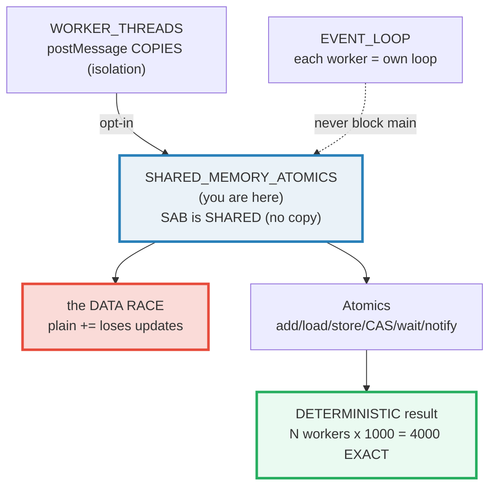
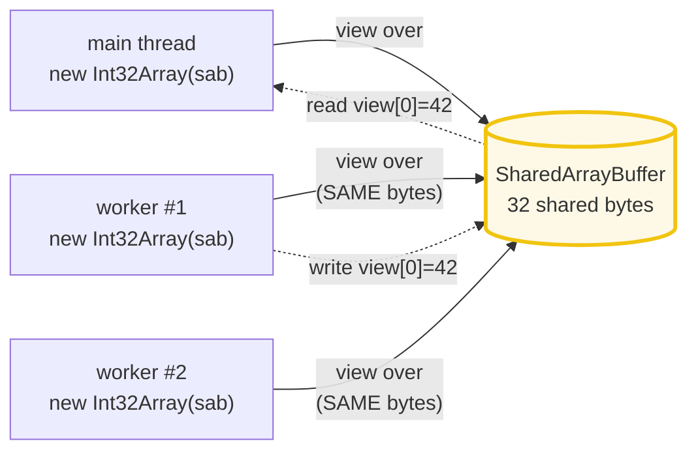
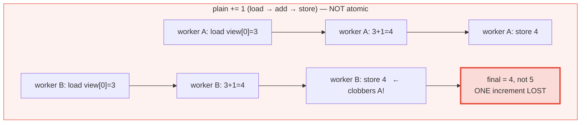

# SHARED_MEMORY_ATOMICS — `SharedArrayBuffer` + `Atomics` (the only shared-memory primitive in JS)

> **Goal (one line):** show, by writing to a `SharedArrayBuffer` from real
> `node:worker_threads` workers, that SAB is **shared** (not copied) across
> threads, that plain parallel writes **data-race** (lost updates), and that
> `Atomics` (`add`/`load`/`store`/`compareExchange`/`wait`/`notify`) makes
> shared-memory concurrency **deterministic** and correct.
>
> **Run:** `just run shared_memory_atomics`
>
> **Ground truth:** [`shared_memory_atomics.ts`](./core/shared_memory_atomics.ts)
> → captured stdout in
> [`shared_memory_atomics_output.txt`](./core/shared_memory_atomics_output.txt).
> Every number/table below is pasted **verbatim** from that file under a
> `> From shared_memory_atomics.ts Section X:` callout. Nothing is hand-computed.
>
> **Prerequisites:** 🔗 [`WORKER_THREADS`](./WORKER_THREADS.md) (this bundle is
> its Section E "preview" deep-dived — SAB is the no-copy alternative to
> `postMessage` cloning); 🔗 [`EVENT_LOOP`](./EVENT_LOOP.md) (each worker has its
> own loop; `Atomics.wait` must never block the main loop).

---

## 1. Why this bundle exists (lineage)

JavaScript is **single-threaded** — one call stack, one event loop
(🔗 `EVENT_LOOP`). `worker_threads` (🔗 `WORKER_THREADS`) is how CPU-bound JS
escapes that single thread: each `Worker` is a fully separate V8 isolate with its
own event loop, heap, and globals, running **truly parallel** JS. But workers do
**not share memory by default** — `postMessage` **copies** via the
structured-clone algorithm (🔗 `VALUE_VS_REFERENCE`), so an object sent to a
worker is a deep copy whose mutations never leak back.

`SharedArrayBuffer` (**SAB**) is the **one exception**. A SAB passed via
`workerData` is **shared by reference**: the main thread and every worker see the
**same backing bytes** — no copy, no ownership move. With shared memory come
**data races** (lost updates when two threads read-modify-write the same cell
unsynchronized), and `Atomics` is the standard-library primitive that fixes
them: atomic read-modify-write (`add`/`sub`/`exchange`/`compareExchange`),
ordered single-cell `load`/`store`, and the futex-like `wait`/`notify`.

**SAB + Atomics is the only real shared-memory parallelism primitive in JS** —
and the direct cross-language analog of Go's `sync/atomic` + memory model and
Rust's `std::sync::atomic` + `Ordering`.



The headline cross-language contrast is the **whole point** of this bundle:

> 🔗 [`../go/ATOMIC_STATE.md`](../go/ATOMIC_STATE.md) — Go's `sync/atomic`
> (`atomic.Int32`, `atomic.Pointer[T]`, `CompareAndSwap`) plus an **explicit
> happens-before memory model** is the direct analog. Go goroutines **share**
> the address space by default (the opposite of JS's copy-by-default); JS needs
> SAB to opt into sharing. Both use atomics to coordinate the shared bytes.
>
> 🔗 [`../rust/ATOMICS.md`](../rust/ATOMICS.md) — Rust's
> `std::sync::atomic` (`AtomicUsize`, `AtomicBool`) makes the memory ordering an
> **explicit compile-time parameter** you must choose: `Ordering::SeqCst` /
> `Acquire` / `Release` / `Relaxed`. JS **spares you the choice** — every
> `Atomics` op is sequentially consistent (the strongest) — at the cost of some
> performance and flexibility.
>
> 🔗 [`WORKER_THREADS`](./WORKER_THREADS.md) §E — that bundle *previews* SAB (one
> worker writes `42`, main reads `42`); **this** bundle is the deep dive: typed
> views, the race, `Atomics.add`, CAS, and `wait`/`notify`.

---

## 2. Section A — `SharedArrayBuffer` is SHARED (not copied)

A `SharedArrayBuffer` is a fixed-length block of **raw bytes**, sharable across
threads. A typed-array **view** (`Int32Array`) overlays it — reads and writes go
straight to the shared backing memory. `byteLength` is in **bytes**;
`Int32Array.BYTES_PER_ELEMENT === 4`, so 8 int32 slots == 32 bytes.



Section A spawns **one** worker, hands it the SAB via `workerData`, and the
worker does a **plain** `view[0] = 42`. Because the SAB is shared (not cloned),
main reads `42` back after the worker joins — **no copy, no message**:

> From shared_memory_atomics.ts Section A:
> ```
> SharedArrayBuffer + Int32Array view (created on MAIN):
>   sab.byteLength          === 32
>   view.length             === 8   (32 bytes / 4 per int32)
>   view[SLOT_VALUE] before === 0
> [check] sab.byteLength === 32 (8 int32 slots * 4 bytes): OK
> [check] view.length === 8: OK
> ```
> ```
> Worker wrote view[0] = 42 into the SAME buffer (passed via workerData):
>   main reads view[0]      === 42   (visible: shared memory, NO copy)
>   worker exited code       0
> [check] worker write to SAB is VISIBLE to main (view[0] === 42): OK
> [check] worker exited code 0: OK
> ```
> ```
> After passing the SAB to a worker, main's reference is STILL valid:
>   sab.byteLength still    === 32   (NOT detached — SAB is shared)
> [check] main's SAB is NOT detached after passing (byteLength still 32): OK
> ```

**The contrast with `ArrayBuffer` (🔗 `WORKER_THREADS` §B/§C).** A plain
`ArrayBuffer` is **copied** on `postMessage` (structured clone gives the worker a
deep copy), or, if listed in `transferList`, its **ownership moves** and the
sender's is **detached** (`byteLength` becomes `0`). A `SharedArrayBuffer` is
**neither** — it is shared by reference, so main's reference stays valid and
points at the **same bytes** the worker mutated. That is why the last check holds
(`byteLength` still 32). Per MDN *"SharedArrayBuffer"*: structured clone of a SAB
*"results in both objects referencing the same memory data"* — the only object
type for which this is true.

**The view, not the buffer, is the API.** `Atomics.*` and typed-array index
access operate on a **view** (`Int32Array`/`BigInt64Array`). Two workers can each
create their own `new Int32Array(sameSab)` — independent view objects, but both
backed by the **same** memory, so a write through one is a read through the
other. `Int32Array` is the view this bundle uses throughout.

---

## 3. Section B — the DATA RACE: plain `+=` loses updates

The moment more than one thread writes the **same** cell, plain operations
**race**. `view[0] += 1` is **not** one operation — it is three: **load** the
current value, **add** 1, **store** the result. Between the load and the store,
another thread can do its own load/store, so the two stores **clobber** each
other and one increment is **lost**.



Section B spawns **4 workers**, each doing `view[0] += 1` **1000×** with plain
writes to the **same** cell. A correct counter would reach `4 × 1000 = 4000`;
the race loses an unpredictable number of updates:

> From shared_memory_atomics.ts Section B:
> ```
> Spawning 4 workers; each does view[0] += 1 x 1000 with PLAIN writes:
>   (plain += is load+add+store — NOT atomic; concurrent stores clobber)
> 
> Expected (CORRECT counter): 4000
> Plain-write race final value: NONDETERMINISTIC (lost updates) — bounded in [0, 4000]
>   (exact value NOT printed: it varies per run — run `just run` again to see it change)
> [check] racy total <= N*iters (never exceeds a correct counter, 4000): OK
> [check] racy total >= 0 (starts at 0, only increments): OK
> [check] all 4 racy workers exited code 0: OK
> ```

**Why the racy value is deliberately NOT printed (or asserted).** A data race is,
by definition, **nondeterministic** — the lost-update count depends on OS
scheduling, so the final value **varies on every run**. Printing it would make
`_output.txt` non-reproducible (violating the §4.2 reproducibility rule). Instead
this bundle asserts the two **deterministic** bounds that hold for *every* run:
the racy total can **never exceed** `N*iters` (each of the 4000 increments lands
at most once; lost updates only *reduce* it) and can **never go below 0** (it
starts at 0 and only increments). Run `just run shared_memory_atomics` repeatedly
and you will watch the racy total jump around — always `<= 4000`, usually far
below it. **That variance is the demonstration.** The fix is Section C.

> 🔗 `VALUE_VS_REFERENCE` — the cell is a plain mutable int32 slot; the bug here
> is **not** aliasing but **interleaving**: the read-modify-write is not atomic,
> so a concurrent store overwrites an in-flight increment.

---

## 4. Section C — `Atomics.add` (DETERMINISTIC) + `load`/`store` + `compareExchange`

`Atomics.add(view, i, 1)` is an **atomic read-modify-write**: the load, the add,
and the store happen as **one indivisible** operation — no other thread can
observe or clobber an intermediate state. Run the **exact same** workload as
Section B (4 workers × 1000) but with `Atomics.add` instead of plain `+=`, and
the total is **exactly 4000 every run**. **This is the payoff that fixes the
race.**

> From shared_memory_atomics.ts Section C:
> ```
> Atomics.add — atomic read-modify-write (N=4 workers x 1000 adds each):
>   Expected (N*iters): 4000
>   Atomics.add total : 4000   (EXACT — no lost updates, every run)
> [check] Atomics.add total === N*iters (4000, deterministic): OK
> [check] all 4 atomic workers exited code 0: OK
> ```

**`Atomics.store` / `Atomics.load`** are the ordered single-cell operations —
sequentially consistent (Section E), so a `store` in one thread is guaranteed
visible to a `load` in another with a defined ordering:

> From shared_memory_atomics.ts Section C:
> ```
> Atomics.store / Atomics.load — ordered single-cell ops:
>   Atomics.store(view, 1, 1234) -> 1234   (returns the stored value)
>   Atomics.load(view, 1)        -> 1234
> [check] Atomics.store returns the value stored (1234): OK
> [check] Atomics.load reads back the stored value (1234): OK
> ```

**`Atomics.compareExchange` — CAS (compare-and-swap).** This is the universal
building block of every lock-free algorithm (mutexes, lock-free stacks, channels,
RCU). Its contract: **if** `view[i] === expected`, write `value` and return
`expected` (the old); **else** do not write and return the current value. Section
C exercises **both** arms on the main thread (no race, so both are deterministic):

> From shared_memory_atomics.ts Section C:
> ```
> Atomics.compareExchange — CAS (compare-and-swap):
>   start view[2]=5; compareExchange(view,2, expected=5, value=10)
>     -> returned 5 (old matched expected -> SWAPPED), view[2] now 10
> [check] CAS success: returned old (5) when expected matched: OK
> [check] CAS success: cell updated to 10: OK
>   start view[2]=10; compareExchange(view,2, expected=5, value=99)
>     -> returned 10 (old != expected -> NO swap), view[2] still 10
> [check] CAS failure: returned current (10) when expected did NOT match: OK
> [check] CAS failure: cell UNCHANGED (still 10, no write): OK
> ```

**How CAS builds a lock-free update.** The pattern is a retry loop: read `old`,
compute `next`, then `compareExchange(view, i, old, next)`. If it returns `old`,
you won the race and the write happened; if it returns anything else, another
thread changed the cell under you, so you loop, re-read, and retry. This is
exactly how `Atomics.add` is *implemented* under the hood (and how you'd build a
lock-free stack `push`). Every `Atomics` RMW op is a specialized, single-shot CAS.

---

## 5. Section D — `Atomics.wait` / `Atomics.notify` (futex-like synchronization)

`Atomics.wait` **blocks** the calling thread until notified (or the cell's value
differs from the expected, or a timeout elapses) — it is JS's futex. **Browsers
forbid `wait` on the main thread** (it throws `TypeError` — the main thread
cannot block); **Node technically allows it** but doing so **blocks the event
loop** (🔗 `EVENT_LOOP`), which is almost always wrong. So the idiom is: **a
worker waits; main (or another worker) notifies.** This bundle follows it.

The handoff uses the **condition-variable pattern**, which is deterministic
**regardless of timing**: the worker waits while cell 0 `=== 0`; main **stores**
a new value (`0 → 7`) and then **notifies**. Two valid outcomes, **both a correct
handoff**:

- `"ok"` — the worker was blocked; main's `notify` woke it.
- `"not-equal"` — the worker hadn't waited yet; when it called `wait`, the cell
  was already `7 ≠ 0`, so `wait` returned immediately (the **value change is the
  signal**).

In **both** cases the worker proceeds and **observes the new value** (`7`). (A
third outcome, `"timed-out"`, is a failsafe that must not happen here.) This is
why the bundle can assert the handoff **deterministically** while the exact wake
path (`ok` vs `not-equal`) and the notify count are timing-dependent:

> From shared_memory_atomics.ts Section D:
> ```
> Atomics.wait/notify handoff (worker waits on cell 0; main sets 7 + notifies):
>   (browsers forbid wait on main; Node allows it but blocks the event loop -> WORKER waits)
>   main: Atomics.store(view, 0, 7) then Atomics.notify(view, 0, 1)
>   worker observed view[0] === 7 after waking (handoff OK)
>   worker exit code: 0
> [check] wait/notify handoff: worker observed main's value (7): OK
> [check] wait/notify handoff: worker did NOT time out (wait returned ok or not-equal): OK
> [check] waiter worker exited code 0: OK
> [check] Atomics.notify returned a non-negative count (spec guarantee): OK
> ```

**Why the value-change is the real signal (the lost-wakeup defense).** A naive
`notify`-only protocol has a race: if main notifies *before* the worker calls
`wait`, the wakeup is **lost** and the worker blocks forever. The
condition-variable pattern defeats this by coupling the wakeup to the **predicate
(the cell value)**: `Atomics.wait(view, i, v)` only blocks if `view[i] === v` at
call time. So if main already changed the value, the worker's `wait` returns
`"not-equal"` immediately instead of blocking. The `notify` then only matters in
the case where the worker *is* already blocked. This is the same
predicate-then-notify discipline as POSIX `pthread_cond_wait`/`signal`.

> 🔗 `EVENT_LOOP` — `Atomics.wait` **must not** run on the main thread of a Node
> app: it blocks the libuv loop, freezing all I/O. Always `wait` in a worker; if
> the main thread must await a worker, use `postMessage` or `Atomics.waitAsync`
> (ES2024, promise-returning) instead.

---

## 6. Section E — memory ordering (sequentially consistent by default)

**The JS memory model** (ECMA-262 §29): `Atomics` operations are **sequentially
consistent** by default — the **strongest** ordering. Every thread agrees on a
single **total order** of all atomic operations, and no plain read/write can be
reordered around an atomic op in a way that is visible across threads. Plain
(non-atomic) reads/writes have **no** cross-thread ordering guarantee — which is
precisely the Section B data race. **The fix is always `Atomics`.**

This matters most in cross-language comparison: **JS offers no ordering choice.**
Rust forces you to *choose* (`SeqCst` / `Acquire` / `Release` / `Relaxed`) per
operation for performance; Go exposes a happens-before model with `sync/atomic`
plus fences; JS simply makes **every** `Atomics` op the strongest, simplest case,
trading a little performance for a model you cannot get wrong.

Every `Atomics` **read-modify-write** op returns the **old** value — the property
that lets you compose them into lock-free algorithms:

> From shared_memory_atomics.ts Section E:
> ```
> The Atomics API surface (all seq-consistent; RMW ops return the OLD value):
>   Atomics.load(ta, i)                atomic read (ordered)
>   Atomics.store(ta, i, v)            atomic write (ordered); returns v
>   Atomics.add(ta, i, v)              atomic RMW; returns OLD value
>   Atomics.sub(ta, i, v)              atomic RMW; returns OLD value
>   Atomics.and/or/xor(ta, i, v)       atomic bitwise RMW; returns OLD
>   Atomics.exchange(ta, i, v)         atomic swap; returns OLD value
>   Atomics.compareExchange(ta, i, e, v) CAS; returns OLD (swaps only if old===e)
>   Atomics.wait(ta, i, v, t?)         block while ta[i]===v (futex); worker-side
>   Atomics.notify(ta, i, count)       wake up to count waiters; returns # woken
>   Atomics.isLockFree(n)              true if size-n ops are hardware-atomic
> ```
> ```
> Atomics.add returns the OLD value (atomic read-modify-write):
>   store(view,0,100); add(view,0,5) -> returned 100; cell now 105
> [check] Atomics.add returns the OLD value (100): OK
> [check] cell is now 105 after the add: OK
>   exchange(view,0,999) -> returned 105 (old); cell now 999
> [check] Atomics.exchange returns OLD (105) and swaps to 999: OK
>   Atomics.isLockFree(4) -> true   (int32 ops are natively atomic in V8)
> [check] Atomics.isLockFree(4) === true (int32 is natively atomic): OK
> ```

`Atomics.isLockFree(4)` is `true` on V8: int32 atomic ops compile to a single
hardware instruction (e.g. `LOCK XADD` on x86), with **no** global lock — the
fast path. (`isLockFree` lets size-generic code choose between a lock-free atomic
and a fallback lock for sizes the hardware can't do natively.)

**The cross-language headline** — the same shared-memory concurrency model,
three surface syntaxes:

> From shared_memory_atomics.ts Section E:
> ```
> Cross-language — shared-memory concurrency primitives:
>   JS SharedArrayBuffer + Atomics : shared mem; Atomics seq-consistent by default (no ordering choice)
>   Go sync/atomic                 : atomic Int32/Pointer/Uintptr + CAS; explicit happens-before memory model
>   Rust std::sync::atomic         : AtomicUsize etc.; you MUST pick Ordering (SeqCst/Acq/Rel/Relaxed)
> [check] all three languages model shared-memory atomics (3 rows): OK
> ```

> 🔗 `../go/ATOMIC_STATE.md` — Go goroutines **share** the address space by
> default (no opt-in SAB needed); `sync/atomic` provides `atomic.Int32`,
> `atomic.Pointer[T]`, and `CompareAndSwapInt32`. Go's memory model is defined in
> terms of **happens-before** edges (channel ops, `sync` primitives, atomics all
> establish them). JS's `Atomics` is the moral equivalent, but you must first opt
> into sharing via SAB.
>
> 🔗 `../rust/ATOMICS.md` — Rust makes ordering an **explicit** compile-time
> parameter: `AtomicUsize::new(0).fetch_add(1, Ordering::SeqCst)`. Picking
> `Relaxed`/`Acquire`/`Release` vs `SeqCst` is a real performance lever Rust
> hands you (and the borrow checker gates *which* atomics can cross threads via
> `Send`/`Sync`). JS removes that lever entirely — always `SeqCst`.

---

## 7. Pitfalls (the expert payoff)

| Trap | Symptom | Fix |
|---|---|---|
| Plain `view[0] += 1` across workers | **Lost updates** — final < N*iters, nondeterministic (Section B) | Use `Atomics.add(view, 0, 1)` — atomic RMW, no lost updates. |
| Reading a SAB cell a worker is writing with a plain read | Torn/tearing reads, no ordering vs the writer | Use `Atomics.load`/`Atomics.store` for any cross-thread cell; reserve plain access for thread-local work. |
| `Atomics.wait` on the main thread | Browsers **throw `TypeError`** (main can't block); Node blocks the event loop, freezing I/O | Always `wait` in a **worker**; on main use `postMessage` or `Atomics.waitAsync` (ES2024). |
| Lost-wakeup: `notify` before the worker called `wait` | Worker blocks forever (the wakeup was lost) | Use the **condition-variable pattern**: change the cell value *then* notify; `wait` checks the value so it returns `"not-equal"` if it missed the notify. |
| Treating `compareExchange`'s return as a boolean | It returns the **old/current** value, not `true`/`false` | Compare the return **to `expected`**: success iff `returnValue === expected`. |
| `Atomics.wait` on a non-`Int32Array`/`BigInt64Array` view | `TypeError` (only those two views are waitable) | Use `Int32Array` (32-bit) or `BigInt64Array` (64-bit) for `wait`/`notify`. |
| Expecting `SharedArrayBuffer` to be copied like `ArrayBuffer` | It is **shared** — the sender's stays valid (no detach) | That is the feature: same bytes, no clone. For a one-way ownership *move*, use `ArrayBuffer` + `transferList` instead. |
| `new SharedArrayBuffer(n)` with `n` not a multiple of the view's element size | View length truncates; `Atomics` on a misaligned index can throw | Size SABs as `BYTES_PER_ELEMENT * slots` (this bundle: `4 * 8`). |
| SAB in a **browser** without cross-origin isolation | `SharedArrayBuffer` is **undefined** (requires `COOP`/`COEP` headers) | In Node `worker_threads` SAB works by default (no headers); the header requirement is browser-only. |
| Assuming any ordering on plain reads/writes | The JS memory model gives plain ops **no** cross-thread ordering — the data race | Wrap every cross-thread cell access in `Atomics` (seq-consistent) — there is no weaker option to "optimize" with. |
| `Atomics.add` ignoring the return value | You lose the **old** value, which you often need (e.g. to assign a unique ticket) | Capture the return: `const old = Atomics.add(view, i, 1)`. |

---

## 8. Cheat sheet

```typescript
// === SharedArrayBuffer (SAB) — the ONLY shared memory in JS ================
//   new SharedArrayBuffer(byteLength)         // raw bytes, SHARED across threads
//   new Int32Array(sab)                       // a VIEW over the SAB (the API)
//   Passed via workerData -> SHARED (not copied, not detached). ArrayBuffer is
//   COPIED (or detached if transferred); SAB is neither. Browser needs COOP/COEP.

// === Atomics — seq-consistent by default (the ONLY ordering in JS) ==========
//   Atomics.load(ta, i)                       // ordered read  -> value
//   Atomics.store(ta, i, v)                   // ordered write  -> v
//   Atomics.add(ta, i, v)                     // atomic RMW     -> OLD value
//   Atomics.sub/and/or/xor(ta, i, v)          // atomic RMW     -> OLD value
//   Atomics.exchange(ta, i, v)                // atomic swap    -> OLD value
//   Atomics.compareExchange(ta, i, expected, v) // CAS          -> OLD/current
//        // writes v ONLY if ta[i] === expected; success iff return === expected
//   Atomics.isLockFree(n)                     // true if size-n ops are hw-atomic

// === wait / notify — futex (ONLY Int32Array / BigInt64Array; never main thread)
//   Atomics.wait(ta, i, value, timeout?)      // block while ta[i]===value
//        // -> "ok" | "not-equal" | "timed-out";  throws on a browser main thread
//   Atomics.notify(ta, i, count)              // wake <= count waiters -> # woken
//        // pattern: store NEW value THEN notify (value-change IS the signal)

// === The two results this bundle pins =======================================
//   worker writes SAB[0] = 42  -> main reads 42          (shared, no copy)
//   N workers x Atomics.add(1) -> EXACTLY N*iters        (no lost updates)
//   plain view[0] += 1 across workers -> <= N*iters      (DATA RACE, nondeterministic)
//   compareExchange: swap iff old === expected           (CAS building block)
//   wait/notify: worker wakes & observes the new value   (deterministic handoff)

// === Cross-language =========================================================
//   JS  : SharedArrayBuffer + Atomics    (seq-consistent only, no ordering choice)
//   Go  : sync/atomic + happens-before   (shared address space by default)
//   Rust: AtomicUsize + Ordering::*      (SeqCst/Acq/Rel/Relaxed explicit, Send/Sync gated)
```

---

## Sources

Every signature, return value, and behavioral claim above was verified against
the MDN Web Docs and the ECMAScript specification, then corroborated by at least
one independent secondary source. The atomic results are *additionally* asserted
at runtime by the `.ts` itself (`check()` throws on any mismatch) — the strongest
possible verification: the actual V8 engine's verdict. The one value that is
**not** asserted is the Section B race total, because a data race is
nondeterministic by definition (it is bounded deterministically instead).

- **MDN — `SharedArrayBuffer`** (raw bytes shared across agents; structured clone
  *"results in both objects referencing the same memory data"*; `byteLength`):
  https://developer.mozilla.org/en-US/docs/Web/JavaScript/Reference/Global_Objects/SharedArrayBuffer
- **MDN — `Atomics`** (the atomic operations namespace; all ops on a typed-array
  view; sequentially consistent):
  https://developer.mozilla.org/en-US/docs/Web/JavaScript/Reference/Global_Objects/Atomics
- **MDN — `Atomics.add()`** (*"adds a value to the array element... and returns
  the old value at that position"* — the atomic RMW contract):
  https://developer.mozilla.org/en-US/docs/Web/JavaScript/Reference/Global_Objects/Atomics/add
- **MDN — `Atomics.compareExchange()`** (*"stores a given value at a specific
  position... if it equals an expected value; returns the old value"* — CAS):
  https://developer.mozilla.org/en-US/docs/Web/JavaScript/Reference/Global_Objects/Atomics/compareExchange
- **MDN — `Atomics.wait()`** (*"verifies that a given position... still contains
  a given value and if so sleeps, awaiting notification or timeout"*; throws
  `TypeError` on an agent that cannot block — i.e. the browser main thread):
  https://developer.mozilla.org/en-US/docs/Web/JavaScript/Reference/Global_Objects/Atomics/wait
- **MDN — `Atomics.notify()`** (*"notifies some agents that are sleeping in the
  wait queue"*; returns the number woken):
  https://developer.mozilla.org/en-US/docs/Web/JavaScript/Reference/Global_Objects/Atomics/notify
- **ECMAScript® 2027 Language Specification (tc39.es/ecma262)**:
  - §25 **StructuredClone** of `SharedArrayBuffer` (shared, not copied):
    https://tc39.es/ecma262/multipage/structured-data.html
  - §25 **The `Atomics` Object** (`load`/`store`/`add`/`compareExchange`/
    `wait`/`notify`/`isLockFree`; RMW ops return the old value):
    https://tc39.es/ecma262/multipage/structured-data.html#sec-atomics-object
  - §29 **Memory Model** (relational constraints on SharedArrayBuffer/Atomics
    events; sequentially consistent by construction):
    https://tc39.es/ecma262/multipage/memory-model.html
- **TC39 — Shared Memory and Atomics proposal** (the ES2017 proposal that
  introduced SAB + Atomics; rationale and the memory-model design):
  https://github.com/tc39/proposal-ecmascript-sharedmem
- **V8.dev — "Atomics.wait, Atomics.notify, Atomics.waitAsync"** (*"since
  Atomics.wait is blocking, it's not possible to call it on the main thread
  (trying to do so throws a TypeError)"*; `waitAsync` as the main-thread-safe
  ES2024 addition):
  https://v8.dev/features/atomics

**Secondary corroboration (independent of MDN, ≥1 per major claim):**
- Russ Cox — *"Programming Language Memory Models"* (the JS/Java memory model
  *"limits the atomic operations to just sequentially consistent atomics"* — no
  Acquire/Release/Relaxed choice, the key cross-language contrast with Rust):
  https://research.swtch.com/plmm
- Node.js — *"Worker threads"* (SAB is shared via `workerData`; Node's main
  thread can call `Atomics.wait` but it blocks the libuv event loop):
  https://nodejs.org/api/worker_threads.html
- Surma (web.dev) — *"Shared Memory and Atomics"* (the lost-update race between
  unsynchronized workers; the condition-variable wait/notify discipline):
  https://web.dev/articles/shared-memory

**Facts that could not be verified by running** (documented, not executed,
because they are language-design or browser-only facts): the browser requirement
for cross-origin isolation (`COOP`/`COEP` headers) to even define
`SharedArrayBuffer` (irrelevant in Node, so not exercised); the `TypeError` on
calling `Atomics.wait` from a browser main thread (Node's main thread does not
throw, so this bundle uses a worker to follow the portable idiom). Every
*printable* claim above is asserted by the `.ts` and verified against MDN/ECMA-262.
