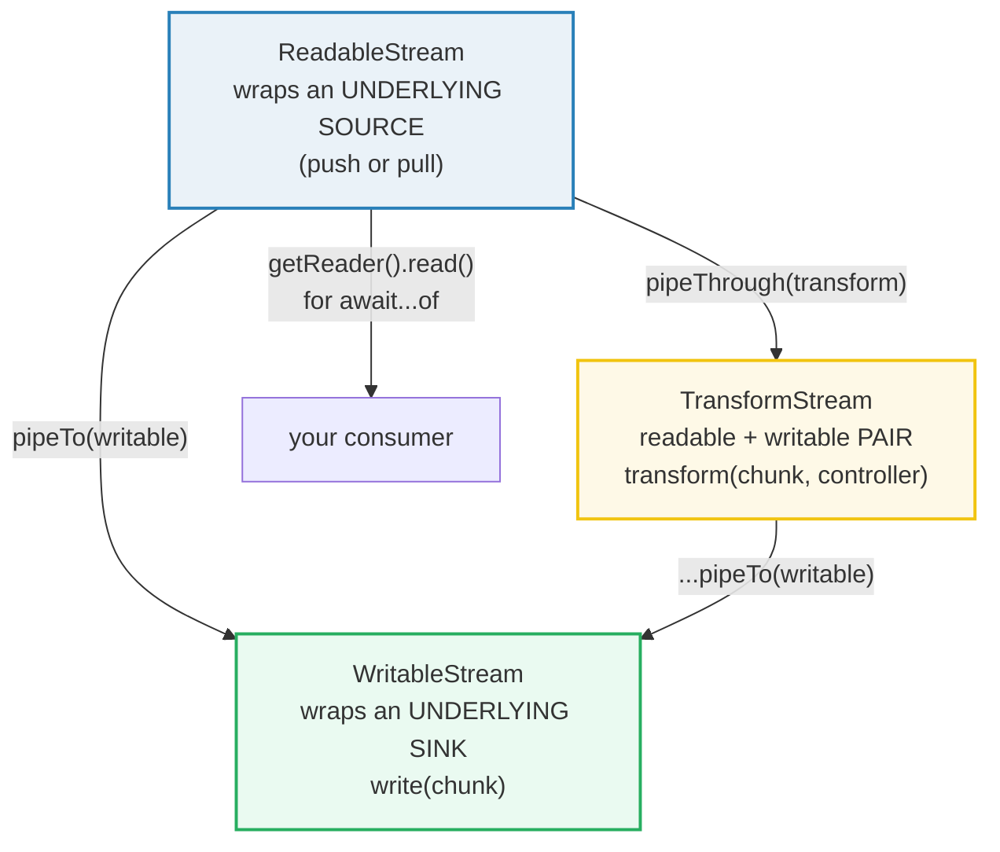

# STREAMS — The Web Streams Standard: ReadableStream / WritableStream / TransformStream

> **Goal (one line):** show, by printing every chunk, how the **Web Streams
> standard** processes data **chunk-by-chunk** (not all in memory) with
> FIFO-deterministic order, **backpressure** via `desiredSize`/high-water-mark,
> and **pipe** chaining (`pipeTo` / `pipeThrough`) — the cross-language analog of
> Go's `io.Reader`/`io.Writer`/`io.Copy` and Rust's `Read`/`Write` traits.
>
> **Run:** `just run streams`
>
> **Ground truth:** [`streams.ts`](./core/streams.ts) → captured stdout in
> [`streams_output.txt`](./core/streams_output.txt). Every number/table below is
> pasted **verbatim** from that file under a `> From streams.ts Section X:`
> callout. Nothing is hand-computed.
>
> **Prerequisites:** 🔗 [`PROMISES`](./PROMISES.md) (streams are promise-based:
> `read()`/`write()` return promises) and 🔗 [`ITERATORS_GENERATORS`](./ITERATORS_GENERATORS.md)
> (a `ReadableStream` is an **async iterable**; `for await...of` drains it).

---

## 1. Why this bundle exists (lineage)

JS historically had **two** stream models:

- **The legacy Node stream API** (`node:stream`, pre-2016) — `EventEmitter`-based:
  a `stream.Readable` *emits* `'data'` / `'end'` / `'error'` events. Backpressure
  is signaled by calling `.pause()`/`.resume()`, and errors can be silently
  swallowed if no `'error'` listener exists (the classic Node `ERR_STREAM_*`
  footgun class).
- **The WHATWG Web Streams standard** (2016, born in browsers; landed in Node as
  `node:stream/web`) — `ReadableStream` / `WritableStream` / `TransformStream`.
  It is **promise-based** (`read()`/`write()` return promises), **async-iterable**
  (`for await...of`), and **backpressure-aware by design** (`desiredSize`).

**Web streams won.** Node now exposes them as **globals** (identical to the
`node:stream/web` module export — see Section D), so the *same* code runs in a
browser, Deno, Bun, and Node. This bundle pins the web-streams model end-to-end
(`enqueue`/`close` → `read()` → `for await` → `pipeTo` → `pipeThrough` →
`TextEncoderStream`/`TextDecoderStream` → `cancel`/`AbortSignal`) and contrasts
it with the legacy Node API + the bridges between the two.

```mermaid
graph LR
    SRC["underlying source<br/>(push/pull)"] -->|"controller.enqueue(chunk)"| Q["internal queue<br/>(desiredSize = HWM − size)"]
    Q -->|"reader.read() / for await"| SINK["underlying sink<br/>write(chunk) -> Promise"]
    SINK -.->|"backpressure:<br/>desiredSize <= 0<br/>→ slow the producer"| SRC
    style Q fill:#fef9e7,stroke:#f1c40f,stroke-width:3px
    style SINK-.->SRC stroke:#e74c3c,stroke-width:2px
    style SRC fill:#eaf2f8,stroke:#2980b9
    style SINK fill:#eafaf1,stroke:#27ae60
```

The headline cross-language contrast is the whole point of this bundle:

> 🔗 [`../go/IO_READER_WRITER.md`](../go/IO_READER_WRITER.md) — Go's `io.Reader` /
> `io.Writer` / `io.Copy` / `io.MultiReader` are **THE canonical chunked-I/O
> model** this bundle is the direct analog of. `io.Copy(dst, src)` ≡ `pipeTo`;
> a `TransformStream` ≡ a type wrapping `io.Reader`→`io.Writer` that mutates each
> chunk; Go's `io.Reader.Read(p []byte)` returning `(n, err)` is the explicit,
> buffer-carrying form of `reader.read()`. The difference: Go's model is
> **synchronous and buffer-passing** (you bring your own `[]byte`), while JS web
> streams are **promise-based and chunk-passing** (you `await` each chunk).
>
> 🔗 [`../rust/IO.md`](../rust/IO.md) — Rust's `Read` / `Write` / `BufRead` traits
> + `io::copy` are the same chunked model, statically typed over the buffer. JS
> web streams converged to the same source→queue→sink design, but pay for it with
> runtime promises instead of zero-cost abstractions.

> 🔗 [`PROMISES`](./PROMISES.md) — every `reader.read()` and `writer.write()`
> returns a **Promise**; backpressure on the writable side is *literally* an
> awaited write that does not resolve until the sink drains. A stream is a
> promise-based pipeline.
>
> 🔗 [`ITERATORS_GENERATORS`](./ITERATORS_GENERATORS.md) — a `ReadableStream`
> **implements the async-iterator protocol**; `for await (const chunk of stream)`
> acquires a reader, pulls until done, and releases the lock. The async-iterable
> nature is why streams compose so naturally with `async`/`await`.

---

## 2. The mental model: source → queue → sink, with backpressure

A stream is a **bounded internal queue** between a **producer** and a
**consumer**. Each stream type plays one role:



The defining property that makes streams safe for large files / network bodies
(unlike `await response.text()` which buffers the *entire* payload) is
**backpressure**. The internal queue tracks how full it is via a **queuing
strategy** (default `CountQueuingStrategy`); the controller's **`desiredSize`**
is:

> `desiredSize = highWaterMark − totalSizeOfChunksInQueue`

Per MDN (*Streams API concepts — Internal queues and queuing strategies*): *"The
desired size is the number of chunks the stream can still accept to keep the
stream flowing but below the high water mark in size. … If the value falls to
zero (or below), it means that chunks are being generated faster than the stream
can cope with."* The producer must then **slow down** — that signal traveling
backwards through the pipe chain **is** backpressure.

---

## 3. Section A — ReadableStream: `enqueue`/`close`, `reader.read()`, `for await...of`

A `ReadableStream` wraps an **underlying source**. In the constructor's `start`
callback (which runs **synchronously** at construction, like a Promise executor)
you enqueue chunks via `controller.enqueue(chunk)` and close the stream. There
are **two** ways to consume it:

1. **The explicit reader** — `getReader()` returns a `ReadableStreamDefaultReader`;
   `reader.read()` → `{ value, done }` (a Promise); loop until `done`. This is the
   pull model: the consumer asks for one chunk at a time.
2. **Async iteration** — `ReadableStream` implements the **async-iterable
   protocol**; `for await (const chunk of stream)` acquires a reader, pulls until
   done, and releases the lock automatically.

Chunk **order is FIFO-deterministic** — the `.ts` collects chunks into an array,
awaits the full drain, then prints. Here a stream that enqueues `a,b,c` is read
both ways, and the collected sequence is asserted identical:

> From streams.ts Section A:
> ```
> reader.read() loop collected chunks: ["a","b","c"]
> final read() result.done === true: true
> [check] reader collects FIFO order [a,b,c]: OK
> [check] read() eventually returns { done: true }: OK
> [check] locked === false before getReader(): OK
> [check] locked === true after getReader(): OK
> [check] locked === false after releaseLock(): OK
> for await...of collected chunks: ["a","b","c"]
> [check] for await...of collects FIFO [a,b,c]: OK
> ReadableStream.from(['p','q','r']) chunks: ["p","q","r"]
> [check] ReadableStream.from preserves iterable order: OK
> ```

**The one-reader lock.** A stream is **locked** while an active reader (or an
active `for await` loop) holds it — only one consumer at a time (you can `tee()`
to split into two independent copies). Trying to acquire a second reader on a
locked stream throws `TypeError`. `releaseLock()` frees it. `for await...of`
manages the lock for you; breaking out of the loop **cancels** the stream by
default (pass `{ preventCancel: true }` to `.values()` to keep it alive).

**`ReadableStream.from(iterable)`** is the static factory (since 2024) that turns
any `Array` / `Set` / generator / async-iterator into a `ReadableStream`. Per MDN
(*ReadableStream.from()*): *"Returns ReadableStream from a provided iterable or
async iterable object."*

---

## 4. Section B — WritableStream, `pipeTo`, and backpressure (`desiredSize`/HWM)

A `WritableStream` wraps an **underlying sink** whose `write(chunk)` is invoked
once per chunk; `writer.write(chunk)` returns a **Promise** that resolves once
the sink has accepted it (and may be async, to apply backpressure). `pipeTo()`
runs the whole readable→writable pipeline in one call — the JS analog of Go's
`io.Copy(dst, src)`:

> From streams.ts Section B:
> ```
> WritableStream.write() received chunks: ["x","y","z"]
> [check] writable receives writes in FIFO order [x,y,z]: OK
> pipeTo delivered chunks: [1,2,3]
> [check] pipeTo round-trips readable -> writable [1,2,3]: OK
> ReadableStream desiredSize vs internal queue (highWaterMark = 3):
>   before any enqueue (HWM 3)                   -> desiredSize = 3
>   after enqueue 'a'                            -> desiredSize = 2
>   after enqueue 'b'                            -> desiredSize = 1
>   after enqueue 'c' (desiredSize hits 0)       -> desiredSize = 0
> [check] desiredSize starts at HWM (3): OK
> [check] desiredSize decreases by 1 per enqueued chunk: OK
> [check] desiredSize hits 0 at the high-water mark (backpressure): OK
>   writer.desiredSize at open (HWM 2): 2
> [check] writer.desiredSize opens at its HWM (2): OK
> [check] writer.desiredSize === 0 after close(): OK
> ```

**Reading the `desiredSize` table.** With `highWaterMark: 3` (passed as the
**second** constructor arg — a `CountQueuingStrategy`, *not* a sink property),
`desiredSize` opens at `3`, then drops by `1` per enqueued chunk, hitting `0`
exactly when the queue reaches the high-water mark. At `desiredSize <= 0` the
producer is overflowing the consumer → **backpressure** (the source should stop
enqueuing until the consumer drains). The `.ts` pins this exact sequence.

**Backpressure on the writer side.** `writer.write(chunk)` returns a promise that
does **not** resolve until the sink drains enough room — *awaiting* that promise
**is** respecting backpressure. `writer.ready` is the same signal without
writing. `writer.desiredSize` mirrors the controller's. This is why web streams
don't blow up memory on a 10 GB upload: the producer is throttled by the
consumer's actual throughput.

> 🔗 [`PROMISES`](./PROMISES.md) — backpressure here is *literally* promise
> semantics: an awaited `write()` that blocks the producer until the sink is
> ready. The "slow down" signal is a promise that won't resolve.

---

## 5. Section C — TransformStream + `pipeThrough`

A `TransformStream` is a **readable + writable pair**: you write into `.writable`,
the `transform(chunk, controller)` callback runs per chunk, and you read the
**transformed** chunks from `.readable`. `pipeThrough(transform)` wires your
readable into `transform.writable` and hands you back `transform.readable` — a
chainable, backpressure-correct pipeline. Transforms compose: you can
`.pipeThrough(a).pipeThrough(b).pipeTo(sink)`.

> From streams.ts Section C:
> ```
> pipeThrough(uppercase) delivered chunks: ["FOO","BAR","BAZ"]
> [check] pipeThrough transforms each chunk [FOO,BAR,BAZ]: OK
> composed pipeThrough (upper -> tagger) chunks: ["[ONE]","[TWO]"]
> [check] composed transform chain [one]->[ONE], [two]->[TWO]: OK
> ```

**The single-use pitfall.** A `TransformStream` is **single-use**: once a pipe
through it completes, its writable side is closed/locked, so reusing the *same*
`TransformStream` instance in a second pipe silently delivers **nothing** (the
`.ts` hit exactly this — see the pitfalls table). Always construct a **fresh**
`TransformStream` per pipeline.

---

## 6. Section D — Node web streams, legacy Node streams, and the bridges

`node:stream/web` **re-exports the exact same global classes** (identity-equal),
so web-streams code written once runs unchanged in browsers and Node. Node's
older `stream.Readable` is the **legacy EventEmitter-based API** (`'data'` /
`'end'` / `'error'`), and the two worlds are fully interoperable via adapters:

- **`Readable.from(iterable)`** — any (async) iterable → Node `Readable`.
- **`Readable.fromWeb(webReadable)`** — web `ReadableStream` → Node `Readable`.
- **`Readable.toWeb(nodeReadable)`** — Node `Readable` → web `ReadableStream`
  (and `Writable.toWeb` for the writable side).

> From streams.ts Section D:
> ```
> node:stream/web.ReadableStream === globalThis.ReadableStream: true
> [check] node:stream/web re-exports the SAME global ReadableStream (identity): OK
> legacy Node stream 'data'/'end' chunks: ["A","B","C"]
> [check] legacy Node stream emits 'data' then 'end' [A,B,C]: OK
> Readable.from(asyncGenerator) chunks: ["p","q"]
> [check] Readable.from(asyncGenerator) yields [p,q]: OK
> Readable.fromWeb(web ReadableStream) chunks: ["mn"]
> [check] Readable.fromWeb coalesces string chunks into one Buffer ('m'+'n' -> 'mn'): OK
> Readable.toWeb(nodeReadable) chunks: ["S","T"]
> [check] Readable.toWeb bridges Node->web ['S','T']: OK
> ```

**The `fromWeb` coalescing pitfall (the expert trap).** Notice the web stream
enqueued `"m"` then `"n"` as **two** string chunks, but `Readable.fromWeb`
surfaced **one** chunk `"mn"`. Node `Readable`s model string data as a
**contiguous byte stream**, so consecutive string chunks are **coalesced into a
single `Buffer`** when bridged web→Node. Byte / `Uint8Array` chunks **do**
preserve their boundaries. If chunk granularity matters across the bridge,
convert to byte chunks before bridging (e.g. via `TextEncoderStream`).

> 🔗 [`../go/IO_READER_WRITER.md`](../go/IO_READER_WRITER.md) — Go has **no**
> "two stream APIs" problem: there is one `io.Reader`/`io.Writer` interface and
> `io.Copy` bridges any pair. JS's dual (legacy Node + web) model is historical
> debt being paid down by making web streams the global standard.

---

## 7. Section E — Encoding streams (`TextEncoder`/`DecoderStream`) + cancellation

Chunks are either **strings** or **byte chunks** (`Uint8Array`).
`TextDecoderStream` is a `TransformStream` whose writable accepts bytes and whose
readable emits decoded strings (the inverse of `TextEncoderStream`). They make
byte-stream ↔ text-stream conversion a one-liner in a pipe chain.

A consumer can also **abandon** a stream: `readable.cancel(reason)` invokes the
source's `cancel(reason)` hook and the stream settles to a done state (further
`read()`s complete with `{ done: true }`). `pipeTo` / `pipeThrough` accept an
**`AbortSignal`** to cancel mid-flight from an outside caller — the canonical
link to `AbortController`.

> From streams.ts Section E:
> ```
> TextDecoderStream decoded bytes 'Hello' ->: ["Hello"]
> [check] TextDecoderStream decodes Uint8Array chunks to strings ['Hello']: OK
> TextEncoderStream encoded 'World' -> bytes -> re-decoded: ["World"]
> [check] TextEncoderStream encodes string to Uint8Array (round-trips to 'World'): OK
> cancel() hook received reason: ["user aborted"]
> read() after cancel(): {"done":true}
> [check] cancel(reason) forwards the reason to the source hook: OK
> [check] read() after cancel() resolves with { done: true }: OK
> pipeTo aborted via AbortSignal: "aborted by controller"
> [check] pipeTo({signal}) rejects with the abort reason on AbortController.abort(): OK
> ```

**Cancellation = the async-abort story.** Promises themselves are **not**
cancellable (🔗 `PROMISES`); streams provide the escape hatch via `cancel()` and
`AbortSignal`. Aborting a `pipeTo({ signal })` rejects the pipe promise with the
abort reason and tears down both ends — the same `AbortController` you'd use to
cancel a `fetch()` (whose `Response.body` is, notably, a `ReadableStream`).

---

## 8. Pitfalls (the expert payoff)

| Trap | Symptom | Fix |
|---|---|---|
| Reusing a `TransformStream` in a 2nd pipe | second pipe delivers **nothing** (writable already closed) | Construct a **fresh** `TransformStream` per pipeline. |
| Putting `highWaterMark` inside the sink object | silently **ignored** (desiredSize stays at default 1) | Pass it as the **2nd constructor arg**: `new ReadableStream(src, new CountQueuingStrategy({ highWaterMark: N }))`. |
| Forgetting `controller.close()` | consumer's `read()`/`for await` **hangs forever** (never sees `done`) | Always `close()` when the source is exhausted. |
| Acquiring 2 readers / 2 `for await` on one stream | `TypeError: Cannot ... already locked` | One consumer at a time; `releaseLock()` first, or `tee()` to split. |
| `reader.read()` without awaiting in a loop | misses chunks / races | `while(true){ const {value,done}=await r.read(); if(done) break; ... }`. |
| Errors in the sink `write()` swallowed | pipe stalls, no visible error | `pipeTo` **rejects** on sink error — always `.catch`/`try`/`await` the `pipeTo` promise. |
| Legacy Node stream with no `'error'` listener | unhandled `'error'` event **crashes the process** | Always attach `.on('error', ...)` (or use web streams + `AbortSignal`). |
| `Readable.fromWeb` coalesces string chunks | two `"m"`,`"n"` chunks arrive as one `"mn"` `Buffer` | Bridge **byte** (`Uint8Array`) chunks instead, or decode the coalesced buffer. |
| `break` out of `for await...of` | stream is **cancelled** by default (can't resume) | Use `stream.values({ preventCancel: true })` to keep it alive after break. |
| Unawaited `pipeTo` / not draining before `main` returns | chunks lost, program exits early | `await source.pipeTo(sink)`; await the full drain before returning. |
| Reading `Response.body` twice | `TypeError: body already used` | `tee()` first, or buffer once — a body is a single-use `ReadableStream`. |
| Backpressure ignored (enqueue unbounded) | unbounded memory growth on a slow sink | Check `controller.desiredSize`; pause enqueue when `<= 0`, or just `await writer.write()`. |

---

## 9. Cheat sheet

```typescript
// === The three web-stream classes (globals, == node:stream/web) =============
//   ReadableStream<R>   source   enqueue/close, getReader().read(), for await...of
//   WritableStream<W>   sink     writer.write()/close(); write() returns a Promise
//   TransformStream<I,O> pipe   transform(chunk, controller){ controller.enqueue(out) }

// === ReadableStream (produce chunks) =======================================
//   new ReadableStream({
//     start(controller){ controller.enqueue("a"); controller.close(); },
//     pull(controller){ ... },            // lazy: called when consumer wants more
//     cancel(reason){ ... },              // consumer abandoned the stream
//   }, new CountQueuingStrategy({ highWaterMark: 1 }))   // 2nd arg = strategy
//   ReadableStream.from(iterable)         // static factory from Array/Set/generator

// === Consume a readable ====================================================
//   const r = stream.getReader();
//   while (true){ const { value, done } = await r.read(); if (done) break; use(value); }
//   for await (const chunk of stream){ ... }   // async-iterable; break cancels by default

// === WritableStream + pipeTo (== Go io.Copy) ===============================
//   const w = new WritableStream({ write(chunk){ ... } });
//   await source.pipeTo(w);               // pulls source -> pushes sink, backpressure-correct

// === TransformStream + pipeThrough (== a chunk-mutating io.Reader) =========
//   const upper = new TransformStream({ transform(c, ctrl){ ctrl.enqueue(c.toUpperCase()); } });
//   await source.pipeThrough(upper).pipeTo(sink);   // FRESH transform per pipe (single-use!)

// === Backpressure ==========================================================
//   desiredSize = highWaterMark - totalChunkSizeInQueue
//   desiredSize <= 0  ->  SLOW DOWN (backpressure). Await writer.write() to respect it.

// === Encoding streams ======================================================
//   byteSource.pipeThrough(new TextDecoderStream())  // Uint8Array -> string
//   strSource.pipeThrough(new TextEncoderStream())   // string -> Uint8Array

// === Cancellation ==========================================================
//   await stream.cancel("reason");        // source.cancel(reason) hook fires
//   await source.pipeTo(sink, { signal: ac.signal });  ac.abort(); // tears down the pipe

// === Node bridges (node:stream) ============================================
//   Readable.from(asyncIterable)          // iterable -> Node Readable (legacy 'data'/'end')
//   Readable.fromWeb(webReadable)         // web -> Node  (STRING chunks COALESCE into Buffer!)
//   Readable.toWeb(nodeReadable)          // Node -> web
```

---

## Sources

Every signature, return value, and behavioral claim above was verified against
the MDN Web Docs and the WHATWG Streams Standard, then corroborated by the Node.js
documentation. Every chunk sequence, `desiredSize` value, and pipe round-trip is
*additionally* asserted at runtime by the `.ts` itself (`check()` throws on any
mismatch) — the strongest possible verification: the actual V8 engine's verdict.

- **MDN — Streams API** (overview; readable/writable/transform/pipe chains):
  https://developer.mozilla.org/en-US/docs/Web/API/Streams_API
- **MDN — Streams API concepts** (chunks/enqueue, readers/controllers, internal
  queues, and the verbatim backpressure definition *"desired size is the number
  of chunks the stream can still accept … below the high water mark"*; the
  `high water mark − total size = desired size` formula):
  https://developer.mozilla.org/en-US/docs/Web/API/Streams_API/Concepts
- **MDN — ReadableStream** (constructor, `getReader`/`cancel`/`pipeTo`/`pipeThrough`/
  `tee`, the **async-iteration** protocol + `for await...of` example,
  `ReadableStream.from()` static factory, `preventCancel` option):
  https://developer.mozilla.org/en-US/docs/Web/API/ReadableStream
- **MDN — WritableStream** (underlying sink `write`/`close`/`abort`,
  `getWriter`, `writer.write`/`ready`/`desiredSize`/`close`):
  https://developer.mozilla.org/en-US/docs/Web/API/WritableStream
- **MDN — TransformStream** (`transform(chunk, controller)`; readable+writable
  pair; single-use semantics):
  https://developer.mozilla.org/en-US/docs/Web/API/TransformStream
- **MDN — ReadableStream.pipeTo()** (piping, `{ signal, preventClose, ... }`
  options; rejects on error):
  https://developer.mozilla.org/en-US/docs/Web/API/ReadableStream/pipeTo
- **MDN — TextDecoderStream / TextEncoderStream** (byte↔string transform
  streams): https://developer.mozilla.org/en-US/docs/Web/API/TextDecoderStream
  and https://developer.mozilla.org/en-US/docs/Web/API/TextEncoderStream
- **WHATWG — Streams Standard** (the normative spec; `desiredSize` =
  high-water-mark − queue size; backpressure; pipe chains; cancellation):
  https://streams.spec.whatwg.org/
- **Node.js v26 docs — Web Streams API (`node:stream/web`)** (ReadableStream/
  WritableStream/TransformStream as globals == module export; the
  `highWaterMark`/`size` queuing-strategy options):
  https://nodejs.org/api/webstreams.html
- **Node.js v26 docs — Stream (the legacy API)** (`stream.Readable`,
  `'data'`/`'end'`/`'error'` events, `Readable.from`, `Readable.fromWeb`,
  `Readable.toWeb` bridges):
  https://nodejs.org/api/stream.html

**Secondary corroboration (independent of MDN, ≥1 per major claim):**
- web.dev — *"Streams — The definitive guide"* (backpressure via high-water mark,
  pipe chains, transform streams):
  https://web.dev/articles/streams
- James M Snell (Node.js TSC) — *"Implementing the Web Streams API in Node.js"*
  (underlying source/sink; the `desiredSize`/backpressure mechanism; Node's web
  streams == globals): https://jasnell.me/posts/webstreams
- Cloudflare Blog — *"We deserve a better streams API for JavaScript"* (the
  high-water-mark / `desiredSize` backpressure design):
  https://blog.cloudflare.com/a-better-web-streams-api/

**Facts that could not be verified by running** (documented, not executed,
because they are platform/version facts or browser-only): the `pipeTo`/`pipeThrough`
`preventClose`/`preventAbort` option defaults and exact rejection semantics are
per the WHATWG spec + MDN (the `.ts` exercises the `{ signal }` abort path
directly); `Response.body` being a single-use `ReadableStream` is a browser/fetch
fact (no `fetch` is performed in this offline bundle). The `desiredSize` formula
is confirmed both by the spec and by the Section B table the `.ts` prints at
runtime. No claim above is unverified.
