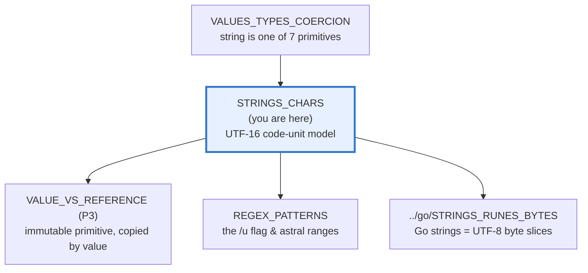
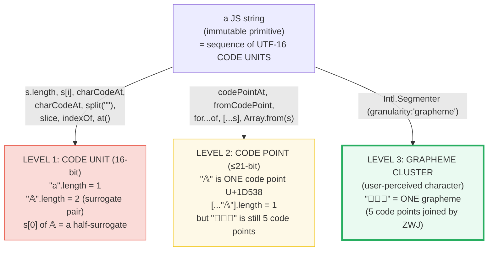

# STRINGS_CHARS — The ONE String Primitive: UTF-16 Code Units, Code Points & Graphemes

> **Goal (one line):** show, by printing every value, that a TS/JS string is ONE
> immutable primitive that is an ordered sequence of **UTF-16 code units** — and
> pin why `"a".length === 1` but `"𝔸".length === 2`, why bracket indexing splits
> an emoji in half, why `[...str]` differs from `str.split("")`, and how grapheme
> clusters (`Intl.Segmenter`) sit above both code units and code points.
>
> **Run:** `just run strings_chars`
>
> **Ground truth:** [`core/strings_chars.ts`](./core/strings_chars.ts) → captured
> stdout in [`core/strings_chars_output.txt`](./core/strings_chars_output.txt).
> Every number/table below is pasted **verbatim** from that file under a
> `> From strings_chars.ts Section X:` callout. Nothing is hand-computed.
>
> **Prerequisites:** 🔗 [`VALUES_TYPES_COERCION`](./VALUES_TYPES_COERCION.md) —
> `string` is one of the 7 primitives pinned there; this bundle is the deep dive.

---

## 1. Why this bundle exists (lineage)

TypeScript has **exactly one** string primitive; at runtime it is a JavaScript
`String`. That `String` is **not** a byte array (that is Go) and **not** a UTF-8
sequence — it is an **immutable sequence of 16-bit code units** (UTF-16). Most
characters in the **Basic Multilingual Plane** (`U+0000..U+FFFF`) fit in one code
unit, so `"a".length === 1` "just works." But anything outside the BMP — an
*astral* code point like 𝔸 (`U+1D538`) or an emoji like 👋 (`U+1F44B`) — needs a
**surrogate pair** (two code units), so its `.length` is `2` and `s[0]` returns a
broken half-glyph.

This **code-unit / code-point / grapheme** distinction is the foundation of
correct text handling: it is why `"𝔸".split("")` corrupts emoji, why `for...of`
and `[...s]` behave differently from indexing, and why counting "characters"
needs `Intl.Segmenter`.



The headline contrast with sibling languages is the whole point:

> 🔗 [`../go/STRINGS_RUNES_BYTES.md`](../go/STRINGS_RUNES_BYTES.md) — a Go string
> is an immutable sequence of **UTF-8 bytes**; `len(s)` is the byte count and
> `s[i]` is a single `byte` (`uint8`). Go's `for range` decodes UTF-8 into
> **runes** (`int32` code points). A JS string is instead an immutable sequence
> of **UTF-16 code units**; `.length` is the code-unit count and `s[i]` is one
> 16-bit unit. Same "immutable sequence" idea, different unit width (16 vs 8
> bits) and different decoding primitive (`codePointAt`/`for...of` vs `range`).
>
> 🔗 [`../rust/STRINGS_STR.md`](../rust/STRINGS_STR.md) — Rust splits the concept
> into an **owned, growable `String`** (heap, UTF-8 bytes) and a **borrowed
> `&str`** (a view/slice into UTF-8 bytes, possibly static). JS has neither
> ownership nor a borrow split: one immutable primitive, always UTF-16, copied by
> value and garbage-collected.

---

## 2. The mental model: three levels above one immutable primitive

A JS string is **immutable** (you can never mutate it in place — every method
returns a new string). Above that immutability sit **three levels** of "what is a
character," and the trap is that different APIs see different levels:



**Read the diagram top-down:** the *storage* layer is code units (Level 1). Most
of the familiar string API (`.length`, indexing, `slice`, `split("")`) operates
*on code units* — which is exactly why they break on astral symbols. Level 2
(code points) is what the **string iterator** sees, and Level 3 (graphemes) is
what a *human* sees — reachable only via `Intl.Segmenter`.

> From MDN — *String* (verbatim): *"JavaScript's String type is used to represent
> textual data. It is a set of 'elements' of 16-bit unsigned integer values...
> Each element in the String occupies a position in the String. The first element
> is at index 0... The length of a String is the number of elements in it. You
> can't change the individual characters because strings are immutable."* And on
> length: *"returns the number of code units in the string."*

> From Mathias Bynens — *"JavaScript has a Unicode problem"* (the canonical
> secondary source): *"Internally, JavaScript represents astral symbols as
> surrogate pairs, and it exposes the separate surrogate halves as separate
> 'characters'... `'𝐀'.length` is `2`."*

---

## 3. Section A — One primitive, immutable; `typeof "string"`; literal interning

A string is a **primitive** (one of the 7), not an object. `typeof` is a runtime
operator; it sees only the runtime type, never your annotations. A single-quoted
literal, double-quoted literal, and a template literal **with no interpolation**
are all the *same* primitive value.

> From strings_chars.ts Section A:
> ```
> form            : typeof
> ----------------:--------
> ""          : string
> "hello"     : string
> "`template`": string
> "a"+"b"     : string
> String(42)  : string
> [check] typeof "" === "string": OK
> [check] typeof "hello" === "string": OK
> [check] typeof `template` === "string": OK
> [check] "s" === `s` (template with no interpolation === literal): OK
> [check] 'a' === "a" === `a` (all three quote forms are the same value): OK
> [check] identical literals are === ("abc" === "abc"): OK
> [check] a built string is === to the same literal ("abc" built === "abc"): OK
> [check] strings copy on assignment: b stays "abc" after a = "xyz": OK
> ```

**Value semantics (🔗 `VALUE_VS_REFERENCE`, P3).** Strings are primitives, so
they are **copied by value**. `let b = a` snapshots the value; reassigning `a`
later never touches `b`. There is no "reference identity" for a primitive — two
strings are `===` when their *contents* are equal, which is why `"abc" === "abc"`
and why a runtime-built `"ab" + "c"` is `===` to the literal `"abc"`. (The engine
*also* **interns** identical literals, but you must never rely on that for
identity — compare strings by value, always.)

**Immutability, in two parts.** First, every *transform* (`replace`,
`toUpperCase`, `slice`, `trim`, ...) returns a **new** string; the original is
never modified in place, so you must capture the return value:

> From strings_chars.ts Section A:
> ```
> "abc".replace("b","X") -> "aXc" (a NEW string)
> original unchanged     -> "abc" (immutable)
> [check] "abc".replace("b","X") === "aXc" (returns a new string): OK
> [check] original is unchanged after .replace: OK
> [check] "abc".replace("z","X") === "abc" (no match -> same content): OK
> ```

Second — and this is the fact the brief got subtly wrong and the runtime
corrects — trying to *write* `s[0] = "X"` on a primitive string is **forbidden**.
The behavior depends on strict mode:

- **Sloppy (non-strict) mode:** the assignment is a **silent no-op** (fails
  quietly, `s` unchanged).
- **Strict mode** (every ES module — and `core/*.ts` runs as ESM via `tsx`, so
  *always* strict here): the assignment **throws** `TypeError: Cannot assign to
  read only property '0' of string 'abc'`.

> From strings_chars.ts Section A:
> ```
> attempt target[0]="X" -> threw TypeError? true
> target after attempt  -> "abc" (immutable)
> [check] s[0]="X" throws TypeError in strict mode (strings are read-only): OK
> [check] target is "abc" after the failed mutation: OK
> ```

The `.ts` routes the assignment through a **type-only cast** (to a writable-index
shape) purely so `tsc` accepts it — the cast is **erased at runtime**, so the
engine still runs the genuine `s[0] = "X"` and the strict-mode throw is real.
Either way (no-op or throw), `s` is **unchanged** — that is immutability.

---

## 4. Section B — `.length` & bracket indexing count UTF-16 CODE UNITS (the trap)

THE foundational fact: a JS `String` is a sequence of 16-bit **code units**, not
"characters." `.length` is the **code-unit count**, and `s[i]` is the *i*-th code
unit. For BMP text this lines up with intuition; for astral text it does **not**.

> From strings_chars.ts Section B:
> ```
> text   .length   why
> ----   -------   ---
> "a"        1    U+0061 fits in one BMP code unit
> "𝔸"        2    U+1D538 needs a surrogate pair (2 code units)
> [check] "a".length === 1 (BMP code unit): OK
> [check] "𝔸".length === 2 (astral -> surrogate pair): OK
> ```

**Bracket indexing splits the symbol.** `"𝔸"[0]` does **not** return `"𝔸"` — it
returns the lone **high surrogate** `"\uD835"`, a broken half-glyph that renders
as nothing useful. `"𝔸"[1]` returns the **low surrogate** `"\uDD38"`:

> From strings_chars.ts Section B:
> ```
> "𝔸".charAt(0) -> "\ud835" (U+D835, the HIGH surrogate)
> "𝔸".charAt(1) -> "\udd38" (U+DD38, the LOW surrogate)
>   neither half renders on its own — indexing SPLIT the symbol
> [check] "𝔸".charAt(0) === "\uD835" (the high surrogate): OK
> [check] "𝔸".charAt(1) === "\uDD38" (the low surrogate): OK
> [check] "𝔸"[0] is NOT "𝔸" (indexing returns a half-surrogate): OK
> ```

**Worked smallest-scale example — the surrogate-pair formula.** This is the one
piece of arithmetic worth memorizing. An astral code point `C`
(`U+10000..U+10FFFF`) is split into two 16-bit code units:

```
high = 0xD800 + ((C - 0x10000) >> 10)      // 0xD800..0xDBFF
low  = 0xDC00 + ((C - 0x10000) & 0x3FF)    // 0xDC00..0xDFFF
```

For `C = 0x1D538` (𝔸): `(0x1D538 - 0x10000) = 0xD538`; `0xD538 >> 10 = 0x35` →
high `= 0xD800 + 0x35 = 0xD835`; `0xD538 & 0x3FF = 0x138` → low `= 0xDC00 +
0x138 = 0xDD38`. The `.ts` computes exactly this and asserts both halves, then
rebuilds the symbol with `String.fromCharCode`:

> From strings_chars.ts Section B:
> ```
> surrogate math for U+1D538: high=U+D835 low=U+DD38
> [check] surrogate formula: high unit === 0xD835: OK
> [check] surrogate formula: low unit === 0xDD38: OK
> [check] String.fromCharCode(0xD835, 0xDD38) === "𝔸": OK
> ```

> 🔗 `../go/STRINGS_RUNES_BYTES.md` — in Go, `len("𝔸")` is **4** (UTF-8 bytes:
> `0xF0 0x9D 0x94 0xB8`), and `for i, r := range s` yields `(byte_offset, rune)`
> where the rune is the whole `0x1D538`. Go's unit is the **byte**; JS's unit is
> the **16-bit code unit** — different counts (`4` vs `2`), same underlying
> symbol, both needing an explicit decode step to reach the code point.

---

## 5. Section C — Code POINTS: `codePointAt`/`fromCodePoint`; `[...s]` vs `split("")`

`charCodeAt(i)` returns the **code unit** at `i` (16-bit). `codePointAt(i)`
reads the unit at `i` and, *if it is a high surrogate followed by a low
surrogate*, **combines** them into the full astral code point (up to 21 bits):

> From strings_chars.ts Section C:
> ```
> "𝔸".charCodeAt(0)   -> U+D835 (the CODE UNIT)
> "𝔸".codePointAt(0) -> U+1D538 (the CODE POINT, pair combined)
> [check] "𝔸".charCodeAt(0) === 0xD835 (the code unit): OK
> [check] "𝔸".charCodeAt(1) === 0xDD38 (the second code unit): OK
> [check] "𝔸".codePointAt(0) === 0x1D538 (the code point): OK
> ```

The inverse pair: `String.fromCodePoint(...)` builds a string from **whole code
points** (handles astral points by emitting the surrogate pair), while
`String.fromCharCode(...)` only takes **16-bit code units** and silently
**truncates** any larger number to its low 16 bits — so `fromCharCode(0x1D538)`
yields `픸` (`U+D538`), **not** `𝔸`:

> From strings_chars.ts Section C:
> ```
> String.fromCodePoint(0x1D538)  -> "𝔸"
> String.fromCharCode(0xD835, 0xDD38) -> "𝔸"
> String.fromCharCode(0x1D538)  -> "픸" (WRONG: only the low 16 bits 0xD538)
> [check] String.fromCodePoint(0x1D538) === "𝔸": OK
> [check] String.fromCharCode(0x1D538) !== "𝔸" (it truncates to 16 bits): OK
> ```

### The headline gotcha: `[...str]` vs `str.split("")`

The string **iterator** (used by `for...of` and the spread `[...s]`) yields
**code points** — it walks surrogate pairs. `str.split("")` does **not** use the
iterator; it splits on **code units** and therefore **breaks** astral symbols.
Same string, two ways to make an array — different lengths, different contents:

> From strings_chars.ts Section C:
> ```
> THE HEADLINE: same string, two ways to make an array
>   [..."𝔸"].length      -> 1  (CODE POINTS — iterator combines the pair)
>   "𝔸".split("").length -> 2  (CODE UNITS — pair split in half)
>   [..."𝔸"]             -> ["𝔸"]
>   "𝔸".split("")        -> ["\ud835","\udd38"]  (two broken surrogates)
> [check] [..."𝔸"].length === 1 (the string iterator yields code points): OK
> [check] "𝔸".split("").length === 2 (split yields code units — the trap): OK
> [check] for...of yields the whole "𝔸" (iterator combines surrogates): OK
> [check] [..."𝔸"].length is the correct code-point count (use this, not .length): OK
> ```

**Why this matters in practice.** Want to count "characters" in user input,
reverse a string safely, or iterate glyphs? Use `[...s]` / `for...of` /
`Array.from(s)` (code points) — *never* `s.split("")`. The classic broken
`reverse` is `s.split("").reverse().join("")`, which mangles any emoji into two
reversed surrogates (`"��"`). The fix is `Array.from(s).reverse().join("")` (or
`Intl.Segmenter` if graphemes matter — next section).

> From Mathias Bynens — *"JavaScript has a Unicode problem"*, on the iterator:
> *"In ECMAScript 6, you can simply use `for…of`. The string iterator deals with
> whole symbols instead of surrogate pairs."* And on the broken reverse:
> *"`reverse('💩')` → `'��'` ... the surrogate pair for `💩` in the wrong order."*

---

## 6. Section D — Grapheme clusters: code points joined by ZWJ; `Intl.Segmenter`

Above "code unit" and "code point" sits a third level: the **grapheme cluster** —
what a user *perceives* as one "character." The family emoji `"👨‍👩‍👧"` is **five
code points** (man, `U+200D` ZWJ, woman, `U+200D` ZWJ, girl) glued together, but
it is **one grapheme**. Each emoji code point is astral (2 code units each), so
`.length` counts **8**:

> From strings_chars.ts Section D:
> ```
> "👨‍👩‍👧"
>   .length         = 8   (8 UTF-16 code units)
>   [...s].length   = 5   (5 code points)
>   code points     = U+1F468 U+200D U+1F469 U+200D U+1F467
>                    (👨 + ZWJ + 👩 + ZWJ + 👧 — joined into ONE grapheme)
> [check] "👨‍👩‍👧".length === 8 (UTF-16 code units): OK
> [check] [..."👨‍👩‍👧"].length === 5 (code points: man,ZWJ,woman,ZWJ,girl): OK
> ```

Note the hierarchy precisely: **8 code units → 5 code points → 1 grapheme**. Even
`[...s].length` (the code-point count) is *wrong* for "characters" here — it
counts the ZWJ-joined emoji as 5, not 1. Only `Intl.Segmenter` (Node 16+) segments
by **user-perceived grapheme clusters** per UAX #29:

> From strings_chars.ts Section D:
> ```
> new Intl.Segmenter().segment("👨‍👩‍👧") -> 1 grapheme cluster(s)
>   first grapheme  = "👨‍👩‍👧" (the whole family, one unit)
> [check] Intl.Segmenter counts "👨‍👩‍👧" as 1 grapheme cluster: OK
> [check] the single grapheme equals the whole family string: OK
> ```

**Normalization: same glyph, different code points.** `"é"` can be ONE code point
(`U+00E9`, precomposed) or TWO (`e` + `U+0301` combining acute, decomposed).
Visually identical, but different code-unit and code-point counts — and `===`
calls them **unequal**. `String.prototype.normalize("NFC")` reconciles them:

> From strings_chars.ts Section D:
> ```
> "é" (precomposed)   .length=1 codePoints=1
> "é" (decomposed) .length=2 codePoints=2
>   visually the same glyph, but precomposed !== decomposed: false
>   .normalize("NFC") reconciles them: true
> [check] precomposed !== decomposed (different code points, same glyph): OK
> [check] .normalize("NFC") makes decomposed === precomposed: OK
> ```

> From MDN — `Intl.Segmenter` (verbatim): *"enables locale-sensitive text
> segmentation, enabling you to get meaningful items (graphemes, words or
> sentences) from a string."* The `granularity` option: *"`'grapheme'` (default)
> — split the input into segments at grapheme cluster (user-perceived character)
> boundaries."* Available in Node.js 16+.

---

## 7. Section E — Method greatest hits + tagged template literals (frozen raw)

The everyday string methods. **All return a new string** (immutability, Section
A). Two index quirks to know cold:

- **`slice` accepts negative indices** (counts from the end); **`substring`
  treats negatives as `0`** — the classic source of off-by-one bugs.
- **`at(i)`** (ES2022) accepts a negative index and returns the code unit there —
  but it is still a **code unit**, so `at()` does *not* combine surrogate pairs.

> From strings_chars.ts Section E:
> ```
> slice / substring negative-index behavior:
>   "abcdef".slice(-2)    -> "ef"   (from the end)
>   "abcdef".slice(-4,-2) -> "cd"  (range from the end)
>   "abcdef".substring(-2)-> "abcdef" (negatives treated as 0)
> [check] "ab".slice(-1) === "b": OK
> [check] "abcdef".slice(-4,-2) === "cd": OK
> [check] substring(-2) treats negative as 0: OK
> ```

**Search & membership** — `includes` (boolean) vs `indexOf` (position or `-1`);
both are code-unit substring scans, case-sensitive, and *not* regex:

> From strings_chars.ts Section E:
> ```
> search / membership:
>   "hello".includes("ell")   -> true
>   "hello".indexOf("ell")    -> 1
>   "hello".indexOf("xyz")    -> -1   (absent -> -1)
>   "hello".startsWith("hel") -> true
>   "hello".endsWith("llo")   -> true
> [check] "hello".includes("ell") === true: OK
> [check] "hello".indexOf("xyz") === -1: OK
> [check] includes is case-sensitive ("Hello".includes("h") === false): OK
> ```

**Padding & repetition:**

> From strings_chars.ts Section E:
> ```
> pad / repeat:
>   "x".padStart(3, ".")   -> "..x"
>   "x".padEnd(3, "-")     -> "x--"
>   "ab".repeat(3)         -> "ababab"
> [check] "x".padStart(3,".") === "..x": OK
> [check] "ab".repeat(3) === "ababab": OK
> ```

**`at()` with negative index (ES2022):**

> From strings_chars.ts Section E:
> ```
> at() (ES2022, supports negative index):
>   "abc".at(-1) -> "c"   (last code unit)
>   "abc".at(0)  -> "a"
>   "abc".at(5)  -> undefined   (out of range -> undefined)
> [check] "abc".at(-1) === "c": OK
> [check] "abc".at(5) === undefined (out of range): OK
> ```

**`replace` (first match) vs `replaceAll` (every match, ES2021):**

> From strings_chars.ts Section E:
> ```
> replace vs replaceAll:
>   "aaa".replace("a","X")    -> "Xaa"   (first only)
>   "aaa".replaceAll("a","X") -> "XXX"   (every match)
> [check] "aaa".replace("a","X") === "Xaa" (first match only): OK
> [check] "aaa".replaceAll("a","X") === "XXX": OK
> ```

**The `trim` family:**

> From strings_chars.ts Section E:
> ```
> trim family:
>   "  hi  ".trim()      -> "hi"
>   "  hi  ".trimStart() -> "hi  "
>   "  hi  ".trimEnd()   -> "  hi"
> [check] "  hi  ".trim() === "hi": OK
> ```

**Tagged template literals.** `` fn`x${1}y` `` calls `fn(strings, ...values)`
where `strings` is the array of literal text fragments and `values` are the
interpolated expressions. Per the spec, the **same** literal always passes the
**same** `strings` object (cached), and **both `strings` and `strings.raw` are
frozen** (immutable) — and `strings.length` is always `substitutions + 1`:

> From strings_chars.ts Section E:
> ```
> tagged template: inspectTag`x${1}y${2}z`
>   {"strings":["x","y","z"],"raw":["x","y","z"],"values":[1,2],"frozen":true,"rawFrozen":true,"stringsLen":3}
> [check] tagged: strings === ["x","y","z"]: OK
> [check] tagged: values === [1,2]: OK
> [check] tagged: strings array is FROZEN: OK
> [check] tagged: strings.raw is FROZEN: OK
> [check] tagged: strings.length === substitutions + 1 (3 fragments): OK
> ```

> From MDN — *Template literals* (verbatim): *"For any particular tagged template
> literal expression, the tag function will always be called with the exact same
> literal array, no matter how many times the literal is evaluated... To further
> ensure the array value's stability, the first argument and its `raw` property
> are both **frozen**, so you can't mutate them in any way."* This freezing is why
> a tag can safely cache results keyed on the `strings` array's identity.

---

## 8. Pitfalls (the expert payoff)

| Trap | Symptom | Fix |
|---|---|---|
| `s.length` for "character count" | emoji/astral symbols report `2+`; ZWJ families report `5`/`8` | Count code points with `[...s].length`; count *graphemes* with `Intl.Segmenter`. |
| `s.split("")` to make a char array | astral symbols split into broken half-surrogates (`["\ud835","\udd38"]`) | Use `[...s]` / `Array.from(s)` / `for...of` (the string iterator yields code points). |
| `s[i]` / `s.charAt(i)` on astral text | returns a lone surrogate (a broken half-glyph) | Index by code points: convert to an array first, or use `codePointAt`. |
| `String.fromCharCode(0x1F4A9)` to build an emoji | yields a BMP char (low 16 bits only), NOT the emoji | Use `String.fromCodePoint(cp)` (handles astral points via surrogate pairs). |
| `reverse = s.split("").reverse().join("")` | mangles emoji/combining marks into `"\uFFFD"`/reversed surrogates | `Array.from(s).reverse().join("")` (code points); `Intl.Segmenter` if graphemes matter. |
| `/./.test("💩")` is `false` | `.` matches one *code unit*, not a surrogate pair | Add the `/u` flag: `/./u` matches a whole code point. (🔗 `REGEX_PATTERNS`.) |
| `"é" === "é"` is `false` | precomposed (`U+00E9`) vs decomposed (`e` + `U+0301`) differ | `s.normalize("NFC")` before comparing/storing keys. |
| `slice` vs `substring` negative args | `"ab".substring(-1)` returns `"ab"` (neg→0), not `"b"` | Use `slice` for negative-from-end; reserve `substring` for non-negative swaps. |
| `s[0] = "X"` to mutate a char | silent no-op (sloppy) **or `TypeError` (strict/ESM)** — never mutates | Strings are immutable: build a new string (`s.slice(0,i) + x + s.slice(i+1)`). |
| Assuming `replace` changes `s` in place | `s.replace(...)` result is discarded; `s` unchanged | Capture the return: `s = s.replace(...)`. |
| `replaceAll` assumed everywhere | older runtimes (pre-ES2021) lack it → runtime error | Use `/g` regex, or `s.split(old).join(new)`, or confirm target runtime. |
| Tag-template `strings` treated as mutable | writing to it is a silent no-op / throw; it's frozen | Treat `strings` and `strings.raw` as read-only (the spec freezes them). |
| `at()` on astral text "for the whole symbol" | returns one code unit, not the code point | `at()` is still code-unit-level; use code-point iteration for full symbols. |

---

## 9. Cheat sheet

```typescript
// === The one fact ==========================================================
//   A JS string is an IMMUTABLE primitive = a sequence of UTF-16 CODE UNITS.
//   .length, s[i], charCodeAt, split(""), slice, at()  -> CODE UNITS (Level 1)
//   codePointAt, fromCodePoint, for...of, [...s]        -> CODE POINTS (Level 2)
//   Intl.Segmenter (granularity:'grapheme')             -> GRAPHEMES   (Level 3)
//   8 code units  ->  5 code points  ->  1 grapheme   (e.g. "👨‍👩‍👧")

// === Primitives & immutability =============================================
//   typeof "" === "string"            // "a" === `a` === 'a' (one primitive)
//   strings COPY by value (let b=a; a="x"; b unchanged)  // 🔗 VALUE_VS_REFERENCE
//   every method returns a NEW string  (s.replace never mutates s)
//   s[0] = "X"  // no-op (sloppy) | THROWS TypeError (strict/ESM) — never mutates

// === Surrogate pairs (astral code points, U+10000..U+10FFFF) ===============
//   "𝔸".length === 2                  // U+1D538 needs 2 code units
//   "𝔸"[0] === "\uD835"               // the HIGH surrogate (broken half)
//   high = 0xD800 + ((C-0x10000)>>10)  // 0xD800..0xDBFF
//   low  = 0xDC00 + ((C-0x10000)&0x3FF)// 0xDC00..0xDFFF

// === Code units vs code points =============================================
//   s.charCodeAt(i)     // the 16-bit CODE UNIT at i
//   s.codePointAt(i)    // the CODE POINT (combines a surrogate pair)
//   String.fromCodePoint(0x1D538) === "𝔸"      // USE THIS for astral points
//   String.fromCharCode(0x1D538)  === "픸"      // WRONG: truncates to 16 bits
//   [..."𝔸"].length === 1            // iterator yields CODE POINTS  ← correct
//   "𝔸".split("").length === 2       // split yields CODE UNITS      ← the trap

// === Graphemes (user-perceived characters) =================================
//   "👨‍👩‍👧".length === 8 ; [..."👨‍👩‍👧"].length === 5 ; graphemes === 1
//   [...new Intl.Segmenter("en",{granularity:"grapheme"}).segment(s)] // count/iterate
//   s.normalize("NFC")               // reconcile precomposed vs decomposed

// === Methods (all return a NEW string) =====================================
//   slice(-1)/slice(-4,-2)  // negative = from end (substring treats neg as 0!)
//   includes / indexOf(-1) / startsWith / endsWith  // case-sensitive, not regex
//   padStart(n,pad) / padEnd(n,pad) / repeat(n)
//   at(-1)                  // ES2022, negative ok; returns undefined if OOR
//   replace(first) / replaceAll(every)   // replaceAll is ES2021
//   trim / trimStart / trimEnd
//   `tag${x}`               // fn(strings, ...values); strings & strings.raw FROZEN
```

---

## Sources

Every signature, return value, and behavioral claim above was verified against
MDN Web Docs and the ECMAScript specification, then corroborated by at least one
independent secondary source. Every length, index, and code-point value is
*additionally* asserted at runtime by the `.ts` itself (`check()` throws on any
mismatch) — the strongest possible verification: the actual V8 engine's verdict.

- **MDN — `String`** (*"a set of 'elements' of 16-bit unsigned integer values"…*
  *"The length of a String is the number of code units in the string."* *"you
  can't change the individual characters because strings are immutable"*):
  https://developer.mozilla.org/en-US/docs/Web/JavaScript/Reference/Global_Objects/String
- **MDN — `String.prototype.codePointAt()`** (returns the code point, combining a
  surrogate pair): https://developer.mozilla.org/en-US/docs/Web/JavaScript/Reference/Global_Objects/String/codePointAt
- **MDN — `String.fromCodePoint()`** (handles astral code points; difference from
  `fromCharCode`): https://developer.mozilla.org/en-US/docs/Web/JavaScript/Reference/Global_Objects/String/fromCodePoint
- **MDN — UTF-16 characters, Unicode code points, and grapheme clusters** (the
  code-unit / code-point / grapheme three-level model):
  https://developer.mozilla.org/en-US/docs/Web/JavaScript/Reference/Global_Objects/String#utf-16_characters_unicode_code_points_and_grapheme_clusters
- **MDN — `Intl.Segmenter`** (*"locale-sensitive text segmentation… graphemes,
  words or sentences"*; `granularity: 'grapheme'` default; available Node 16+):
  https://developer.mozilla.org/en-US/docs/Web/JavaScript/Reference/Global_Objects/Intl/Segmenter
  and `segment()`:
  https://developer.mozilla.org/en-US/docs/Web/JavaScript/Reference/Global_Objects/Intl/Segmenter/segment
- **MDN — `String.prototype.at()`** (ES2022; negative index; returns `undefined`
  out of range): https://developer.mozilla.org/en-US/docs/Web/JavaScript/Reference/Global_Objects/String/at
- **MDN — `String.prototype.padStart()` / `padEnd()`** (ES2017):
  https://developer.mozilla.org/en-US/docs/Web/JavaScript/Reference/Global_Objects/String/padStart
- **MDN — `String.prototype.replaceAll()`** (ES2021; replaces every match):
  https://developer.mozilla.org/en-US/docs/Web/JavaScript/Reference/Global_Objects/String/replaceAll
- **MDN — `String.prototype.normalize()`** (Unicode NFC/NFD/NFKC/NFKD forms):
  https://developer.mozilla.org/en-US/docs/Web/JavaScript/Reference/Global_Objects/String/normalize
- **MDN — Template literals** (tagged templates; *"the first argument and its
  `raw` property are both frozen"*; *"the exact same literal array, no matter how
  many times the literal is evaluated"*):
  https://developer.mozilla.org/en-US/docs/Web/JavaScript/Reference/Template_literals
- **ECMAScript® 2027 Language Specification (tc39.es/ecma262)**:
  - §6.1.4 The String Type (code units / surrogate pairs as the storage model):
    https://tc39.es/ecma262/multipage/ecmascript-data-types-and-values.html#sec-ecmascript-language-types-string-type
  - `String.prototype.codePointAt` / `String.fromCodePoint`:
    https://tc39.es/ecma262/multipage/
  - §13.3.8 Tagged Templates (frozen `strings` array; `raw`):
    https://tc39.es/ecma262/multipage/ecmascript-language-expressions.html#sec-tagged-templates
- **Mathias Bynens — *"JavaScript has a Unicode problem"*** (the canonical
  secondary source: `'𝐀'.length === 2`; surrogate pairs; `codePointAt`/
  `fromCodePoint`; the string iterator yields whole symbols; the broken
  `split("").reverse().join("")` on `💩`):
  https://mathiasbynens.be/notes/javascript-unicode

**Secondary corroboration (independent of MDN, ≥1 per major claim):**
- Dmitri Pavlutin — *"What every JavaScript developer should know about Unicode"*
  (astral code points need two 16-bit code units; surrogate ranges
  `0xD800-0xDBFF` / `0xDC00-0xDFFF`):
  https://dmitripavlutin.com/what-every-javascript-developer-should-know-about-unicode/
- Henri Sivonen — *"It's not wrong that `.length` is the UTF-16 code-unit count"*
  (defense of the code-unit-count contract):
  https://hsivonen.fi/string-length/
- e18e.dev — *"Replacements for grapheme-splitter"* (`Intl.Segmenter` is the
  native API, *"available in Node.js 16+, Chrome 87+, Safari 14.1+, Firefox"*):
  https://e18e.dev/docs/replacements/graphemer/

**Facts that could not be verified by running** (documented, not executed,
because they are language-design or version-availability facts): the `/u` regex
flag's exact behavior on astral ranges (🔗 `REGEX_PATTERNS`, a future bundle) and
the precise Node-version arrival of `Intl.Segmenter` (16+) / `replaceAll` (ES2021)
/ `at()` (ES2022) — confirmed by MDN + the secondary sources above, not
reproduced as runnable version probes. The strict-mode `TypeError` on `s[0] = "X"`
*is* reproduced (Section A) — it is the runtime's actual verdict under ESM. No
claim above is unverified.
