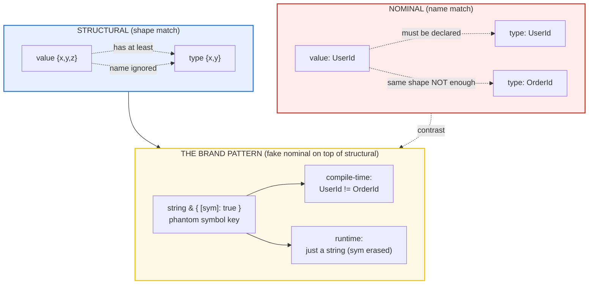
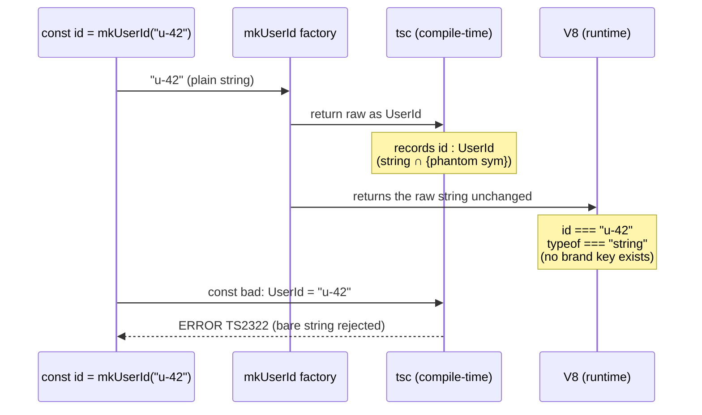

# STRUCTURAL_TYPING — TypeScript is duck-typed (shape, not name)

> **One-line goal:** show — by printing every value AND by compile-time gates —
> that TypeScript matches types by SHAPE (`has at least` these members), and
> trace every sharp edge that follows: excess-property-on-literals, the brand
> pattern that fakes nominal typing (and erases to a plain string at runtime),
> `satisfies` vs annotation, function bivariance, and the `typeof`/`keyof`
> queries.
>
> **Run: `just run structural_typing`** &nbsp;·&nbsp; Typecheck: `just typecheck structural_typing`

**Prerequisites:** read [`VALUES_TYPES_COERCION.md`](./VALUES_TYPES_COERCION.md)
first — it pins the foundation this bundle stands on: **TS types are ERASED at
runtime**. `interface`/`type`/annotations/generics leave no trace in the
executed code; only the runtime operators `typeof` / `instanceof` survive.
Everything below is the COMPILE-TIME story of how the (erased) type system
decides "is X assignable to Y" — and how that story leaks into runtime values
only via `typeof` and the absence of the types themselves.

---

## Lineage — why this bundle exists

VALUES_TYPES_COERCION answered "what is a value at runtime?" This bundle
answers the next question: **"how does the type system decide a value fits a
type?"** The answer is the single design choice that makes TypeScript feel like
"just JavaScript with types":

> **TypeScript is STRUCTURALLY typed.** A value matches a type iff it has the
> right MEMBERS (the right property names with compatible types) — regardless
> of the type's NAME. No `implements` keyword, no declaration-site linkage.

This was a deliberate fit for JavaScript, which is built on anonymous object
literals and function expressions — shapes flying around with no class names
attached. A nominal system (Java/C#/Rust) would fight that; a structural one
(like Go's interfaces) matches it.

The sharp edges that follow are the expert payoff, and each is a *consequence*
of the structural choice:

1. **Excess property checks** — a safety net STRONGER than pure structural
   matching, fired only on fresh object literals (to catch typos like
   `{ colour }` vs `{ color }`). It is asymmetric: a variable bypasses it.
2. **No nominal safety** — two same-shaped types are interchangeable, so the
   community invented the **brand pattern** (a phantom symbol property) to fake
   it. The brand is compile-time-only: at runtime a branded `UserId` is just a
   string.
3. **Function bivariance** — method parameters are checked BIVARIANTLY (either
   direction), an unsound-but-ergonomic carve-out from `strictFunctionTypes`,
   which otherwise enforces (sound) CONTRAVARIANCE on function-typed properties.



---

## Evidence modes (read this once)

Unlike a Phase 1 runtime bundle, **most of this bundle's claims are
compile-time.** A `[check] ... OK` line in the output comes from ONE of two
gates — both count, and both must hold for the bundle to be "green":

| Gate | What it proves | How it fails |
|---|---|---|
| `check(desc, ok)` | a **runtime** invariant (e.g. `typeof branded === "string"`) | throws → non-zero exit |
| `expectType<Equal<Inferred, Expected>>(msg)` | a **compile-time** type-equality claim | if `Equal<>` is `false`, `T extends true` fails → `tsc` errors before any code runs |
| `// @ts-expect-error` on a line | the line **does** error (type rejection is real) | if the line ever stops erroring, tsc fails on the UNUSED directive |

`Equal<A, B>` is the canonical exact-equality trick (resolves to `true` only
when A and B are identical, not just mutually assignable). `expectType` is its
runtime-visible wrapper — it both typechecks the claim AND prints a `[check]`
line, so the verification sweep counts it.

> From `structural_typing.ts` header:
> ```
> Reminder: TS types are ERASED at runtime. The COMPILE-TIME claims
> below are gated by `expectType<...>` (compiles only if true) and by
> `// @ts-expect-error` on lines that SHOULD error (tsc fails if unused).
> RUNTIME claims are gated by `check(...)`.
> ```

---

## Section A — Structural compatibility: "has at least" the members

The basic rule (handbook *Type Compatibility*): **`x` is assignable to `y` iff
`y` has at least the same members as `x`.** Only the TARGET's members are
inspected; EXTRA members on the source are silently ignored. A `{x,y,z}` value
satisfies a `{x,y}` target — the extra `z` is invisible through the target
type.

> From `structural_typing.ts` Section A:
> ```
> type Point = { x: number; y: number }
> const p = { x: 1, y: 2, z: 3 }   (inferred: { x; y; z })
> const q: Point = p              -> OK (p has AT LEAST x and y)
> runtime: q.x = 1, q.y = 2   (z is invisible through Point)
> [check] typeof q === "object" (Point type erased at runtime): OK
> [check] q.x === 1 and q.y === 2 (structural assignment copies the reference): OK
> [check] typeof q === Point: OK
> [check] typeof p === { x: number; y: number; z: number } (source shape preserved): OK
>
> magnitude(p) -> 2.2361   (extra z ignored by the callee)
> [check] magnitude(p) === sqrt(5) (structural arg check): OK
> ```

**Why this matters (the internals):** the same "has at least" rule applies to
function *call arguments* — a `{x,y,z}` argument is accepted by a `(pt: Point)`
parameter. The callee can only see `x` and `y`; the extra `z` travels with the
object but is unreachable through `Point`. This is structural *width*
subtyping: a wider type is assignable to a narrower target.

> From `structural_typing.ts` Section A (same width, different names):
> ```
> type Screen = { horizontal: number; vertical: number }
> Screen and Point have the SAME width (two numbers) but DIFFERENT
> member NAMES -> a Screen is NOT assignable to a Point.
> [check] keyof Screen === "horizontal" | "vertical": OK
> ```

**The catch:** structural typing keys on member **NAME + type**, not on shape
*width*. Two types with identical cardinality but different property names are
NOT compatible. The `// @ts-expect-error` on `const asPoint: Point = screen`
proves the rejection is real (the directive would fail the build if unused).

---

## Section B — Excess property checks (literals) & `satisfies` vs annotation

### The asymmetry

A FRESH object literal assigned directly to a typed target is checked MORE
strictly than a variable: the literal cannot have ANY property the target lacks
— **even though pure structural typing would allow it.** This is an anti-typo
net (catches `{ colour }` when you meant `{ color }`). But assign the same
object via a variable and the check is skipped.

> From `structural_typing.ts` Section B:
> ```
> type Point = { x: number; y: number }
>   const fromLiteral: Point = { x:1, y:2, z:3 }   -> ERROR (excess z)
>   const v = { x:1, y:2, z:3 }; const q: Point = v -> OK (variable bypass)
>   fromVariable.x = 1
> [check] fromVariable.x === 1 (variable assignment bypasses excess check): OK
> ```

The `// @ts-expect-error` on `const fromLiteral: Point = { x:1, y:2, z:3 }` is
the load-bearing evidence: it suppresses the real "excess property" error
(TS2561). Both lines have the IDENTICAL shape; only the freshness of the
literal differs. That is the asymmetry.

> From `structural_typing.ts` Section B (weak-type guard):
> ```
> type Options = { color?: string; width?: number }  (all-optional = weak type)
>   const badOpts: Options = { flavour: 'chocolate' } -> ERROR (no common prop)
> ```

**Weak types** (all-optional properties) get an additional guard: even via a
variable, if the source shares NO property name with the target, TS errors
(TS2559) — such an assignment is almost certainly a typo'd key set.

### `satisfies` (TS 4.9) vs type annotation

`const x = expr satisfies T` **validates** that `expr` conforms to `T`, but the
**inferred type of each property is PRESERVED.** `const x: T = expr`
**replaces** each property's type with `T`'s declared one (widening). The
classic payoff (TS 4.9 release notes): a palette whose values are EITHER a
string OR an `[r,g,b]` tuple.

> From `structural_typing.ts` Section B:
> ```
> type RGB = [number, number, number]; type ColorEntry = string | RGB
> const paletteSat = { red:[255,0,0], green:'#00ff00' } satisfies Record<...,ColorEntry>
> const paletteAnn: Record<...,ColorEntry>       = { red:[255,0,0], green:'#00ff00' }
>   typeof paletteSat.red   === [number,number,number]   (satisfies: per-key type PRESERVED)
>   typeof paletteSat.green === string                  (satisfies: per-key type PRESERVED)
>   typeof paletteAnn.red   === ColorEntry (the union)  (annotation: WIDENED to declared type)
>   typeof paletteAnn.green === ColorEntry (the union)  (annotation: WIDENED to declared type)
> [check] satisfies preserves typeof paletteSat.red === [number, number, number]: OK
> [check] satisfies preserves typeof paletteSat.green === string: OK
> [check] annotation widens typeof paletteAnn.red === ColorEntry (the union): OK
> [check] annotation widens typeof paletteAnn.green === ColorEntry (the union): OK
> [check] paletteSat.green === paletteAnn.green === "#00ff00" at runtime (satisfies emits no code): OK
> [check] paletteSat.red[0] === 255 === paletteAnn.red[0] (identical values at runtime): OK
> ```

**The payoff:** `paletteSat.red` is the specific tuple `[number,number,number]`
— so `paletteSat.red[0]` works with no narrowing. `paletteAnn.red` is the full
union `ColorEntry` — so `.red[0]` would require narrowing first. Same runtime
values, different static precision. And `satisfies` emits **no code** (the two
objects are byte-identical at runtime) — it is a pure typecheck-time operator.

🔗 **`TYPE_ASSERTIONS_UNKNOWN.md`** (P2) — `satisfies` is the SOUND alternative
to `as`: `as` is an unchecked assertion (you can lie), `satisfies` is a checked
validation. Reach for `satisfies` whenever you would otherwise write
`as MyType`.

---

## Section C — Nominal faking via brands (THE payoff)

TypeScript has **no nominal typing.** Two type aliases over the same primitive
are fully interchangeable — a `Username` silently flows into an `Email`
parameter. The **brand pattern** fakes nominal typing by intersecting the
primitive with a phantom property keyed by a DECLARED `unique symbol`:

```ts
declare const userIdBrand: unique symbol;          // declared, NEVER created
type UserId  = string & { readonly [userIdBrand]: true };
```

The symbol is a *type-level* marker: it is `declare`d (ambient — compile-time
only, no runtime value), so a `UserId` is **indistinguishable from a plain
string at runtime**, yet at compile time `UserId` and `OrderId` (different
unique symbols) are DISTINCT types.

> From `structural_typing.ts` Section C:
> ```
> declare const userIdBrand: unique symbol;
> type UserId  = string & { readonly [userIdBrand]: true };
> type OrderId = string & { readonly [orderIdBrand]: true };
> (the unique symbols are DECLARED but never created as values)
>
> const id  = mkUserId("u-42") -> runtime: typeof = string, value = "u-42"
> const ord = mkOrderId("o-7") -> runtime: typeof = string, value = "o-7"
>   id.length = 4, JSON.stringify(id) = "u-42"   (brand is a phantom symbol key;
>   declared but NEVER created as a runtime value, so id is just the raw string)
> [check] typeof branded UserId === "string" (brand erased at runtime): OK
> [check] typeof branded OrderId === "string": OK
> [check] the brand is a phantom symbol never created at runtime (id is just the raw string): OK
> [check] id === "u-42" at runtime (raw string preserved): OK
> ```

**(a) Runtime half:** the brand is a phantom. `typeof id === "string"`,
`id.length === 4`, `JSON.stringify(id) === '"u-42"'`. The intersection member
is never actually created on the value — types are erased. (NB: because the
symbol is `declare`d ambient, you CANNOT write `[userIdBrand] in id` at runtime
— the symbol has no runtime value. The phantom nature is observed *by the
absence of any brand key*, not by probing for it.)

**(b) Compile-time half** — the whole point:

> From `structural_typing.ts` Section C (continued):
> ```
>   const directAssign: UserId = "u-42"   -> ERROR (bare string rejected)
>   const crossBrand: OrderId = id         -> ERROR (UserId != OrderId)
> [check] mkUserId returns exactly UserId: OK
> [check] idOk === "u-99" (factory output is the raw string at runtime): OK
>
> Without brands: type Email = string; type Username = string;
>   const username: Username = email  -> OK (purely structural; NO protection)
> [check] unbranded aliases are interchangeable (no nominal safety by default): OK
> ```

The two `// @ts-expect-error`s are the gate: a bare string is rejected for
`UserId`, and a `UserId` is rejected for `OrderId` — even though both erase to
`string` at runtime. The single trusted boundary is the **factory**
(`mkUserId`), which casts a plain string through to the branded type once; all
other code gets the protection for free.

**The contrast that motivates the pattern** (last block above): without brands,
`type Email = string; type Username = string;` are interchangeable — a
`Username` flows silently into an `Email` parameter. That silent cross-flow is
the bug class the brand pattern exists to prevent.

---

## Section D — Function variance, `typeof`, `keyof` & indexed access

### Function parameter variance

Under `strict` (which turns ON `strictFunctionTypes`):

- **Function-typed properties** (`type H = (e: Base) => void`) check parameters
  **CONTRAVARIANTLY**: a function accepting a WIDER type is assignable where a
  NARROWER-accepting one is expected (sound), but NOT the reverse.
- **Method syntax** (`interface E { handle(e: Base): void }`) is **EXEMPT** and
  stays **BIVARIANT** (either direction allowed). This is deliberately unsound,
  to keep real-world callback-heavy JS typed (the handbook's `EventType`
  example).

> From `structural_typing.ts` Section D:
> ```
> [check] (e: BaseEvent) => number is assignable to (e: ClickEvent) => void (contravariance): OK
> interface Emitter { emit(e: BaseEvent): void }   (METHOD -> bivariant)
> const emitter: Emitter = { emit: logClick }       -> OK (methods are bivariant)
> emitter.emit({ timestamp: 99 })                   -> runtime: logClick reads .x = undefined
> [check] method-syntax bivariance allows the unsound assignment (strictFunctionTypes exempts methods): OK
> ```

The first `[check]` is the SOUND direction: `(e: BaseEvent) => number` IS
assignifiable to `(e: ClickEvent) => void` (a function accepting the wider
`BaseEvent` can handle any `ClickEvent`; the non-void return is also allowed
for a void-returning target). The `// @ts-expect-error` (in the `.ts`, not the
output) proves the REVERSE — `(e: ClickEvent) => number` to
`(e: BaseEvent) => void` — is rejected for function properties. Yet the SAME
assignment via METHOD syntax (`emitter.emit = logClick`) is allowed, and at
runtime `logClick` reads `.x` on a `BaseEvent` that has none → `undefined`
(the unsoundness made visible).

### `typeof`, `keyof`, indexed access

> From `structural_typing.ts` Section D (continued):
> ```
> const defaultPoint = { x: 0, y: 0, label: "origin" }
> type DefaultPoint = typeof defaultPoint
> [check] typeof defaultPoint === { x: number; y: number; label: string }: OK
>
> type Point = { x: number; y: number }
> type PointKeys = keyof Point        // "x" | "y"
> type PointX = Point["x"]            // number
> [check] keyof Point === "x" | "y": OK
> [check] Point["x"] === number: OK
> [check] DefaultPoint["label"] === string: OK
> [check] typeof defaultPoint === object (keyof/indexed-access emit no runtime code): OK
> ```

- **`typeof v`** — the type query: lift a VALUE's inferred type into a named
  type. The bridge from the runtime world to the type world (it is how the
  `satisfies`/brand types above get reused).
- **`keyof T`** — the union of `T`'s property names.
- **`T[K]`** — indexed access: the type of the property at key `K`.

All three are **pure type-level operators** — they emit no code and have no
runtime representation. The only thing that exists at runtime is the value
itself.

---

## Section E — Cross-language framing: Go (structural) vs Rust (nominal)

TS's structural typing is not unique. It is the SAME model Go uses for
interfaces; Rust is the opposite (nominal); Python's `Protocol` is structural
too.

> From `structural_typing.ts` Section E:
> ```
> language     : model      : satisfaction         : nominal escape hatch
> ------------ : ---------- : -------------------- : ---------------------------
> TypeScript   : structural : implicit (by shape)  : yes (the brand pattern)
> Go           : structural : implicit (by shape)  : n/a (interfaces are the model)
> Python       : structural : implicit (Protocol)  : no (Protocol is structural)
> Rust         : nominal    : EXPLICIT `impl Trait for T` : native (traits are nominal)
> [check] TS + Go are structural (shape-based); Rust is nominal (declaration-based): OK
> [check] Go interfaces are IMPLICIT (no implements keyword) — TS's closest sibling: OK
> [check] Rust requires EXPLICIT `impl Trait for T` — the starkest contrast to TS: OK
>
> Expert consequence: TS gives you nominal safety ONLY if you ask
> for it (brands). Rust gives it to you for free. Go — like TS — does
> not, which is why both ecosystems lean on conventions/linters.
> ```

---

## Worked example — why a `UserId` is not an `OrderId` (trace)

The brand pattern's payoff in one trace, combining the runtime and
compile-time halves:

```ts
declare const userIdBrand: unique symbol;
type UserId = string & { readonly [userIdBrand]: true };

const id = mkUserId("u-42");
//  compile-time: id : UserId                                    (branded)
//  runtime:      id === "u-42", typeof id === "string"          (brand erased)

const bad: UserId = "u-42";   // ERROR — bare string lacks the phantom brand
//  tsc: Type 'string' is not assignable to type 'UserId'.       (TS2322)
```



The brand is a **compile-time fiction**: `tsc` enforces it; V8 never sees it.
That is the entire mechanism — nominal safety rented for zero runtime cost.

---

## Pitfalls

| Trap | Symptom | Fix |
|---|---|---|
| **Trusting structural identity for "same type"** | A `Username` silently flows into an `Email` param; two same-shaped types are interchangeable, bugs pass silently | Brand the primitive (`string & { [sym]: true }`) — see Section C |
| **Excess-property confusion** | `const p: Point = {x,y,z}` errors but `const v={x,y,z}; const p: Point = v` doesn't, and you can't tell why | Remember: excess checks fire ONLY on fresh literals; assign via a variable to bypass (intentionally or not) |
| **`as` lying about a brand** | `("x" as UserId)` compiles and silently forges a branded value, defeating the pattern | Keep ONE trusted factory that casts; never `as UserId` at call sites. Prefer `satisfies` over `as` everywhere else |
| **Method bivariance unsoundness** | An `emit(e: Base)` method accepts a `(e: Sub) => void`; at runtime the handler reads `.x` on a `Base` → `undefined` | Use a function-TYPED property (`on: (e: Base) => void`) instead of method shorthand where soundness matters — `strictFunctionTypes` then enforces contravariance |
| **`satisfies` vs annotation, wrong pick** | Annotated `const cfg: Config = {...}` widens every property to `Config`'s declared type, losing literal precision downstream | Use `const cfg = {...} satisfies Config` to validate conformance while preserving the narrower inferred type (Section B) |
| **Probing a phantom brand at runtime** | `[brandSymbol] in id` throws `ReferenceError` — the `declare`d symbol has no runtime value | Don't probe brands at runtime; they are compile-time-only. Assert via `typeof === "string"` instead |
| **Index access flagged possibly-undefined** | `rows[i][j]` errors under `noUncheckedIndexedAccess` even for a literal array | Type the array as a tuple (`as const` or `readonly [T,T,...]`) so known indices are exact, not `T \| undefined` |
| **Unused `@ts-expect-error`** | You refactor and the suppressed error disappears; tsc now fails on the unused directive | Treat unused-directive failures as REAL signals — they mean your "error" no longer errors (a type got wider or a bug got fixed) |

---

## Cheat sheet

```ts
// STRUCTURAL: x is assignable to y iff y has at least x's members (by NAME+type).
type Point = { x: number; y: number };
const p = { x: 1, y: 2, z: 3 };
const q: Point = p;                  // OK (extra z allowed via variable)

// EXCESS PROPERTY: fires ONLY on fresh literals.
// const bad: Point = { x: 1, y: 2, z: 3 };   // ERROR (excess z)
const v = { x: 1, y: 2, z: 3 };
const ok: Point = v;                 // OK (variable bypasses the check)

// satisfies (TS 4.9): validate conformance, PRESERVE the narrower type.
type ColorEntry = string | [number, number, number];
const palette = { red: [255,0,0], green: "#00ff00" } satisfies Record<string, ColorEntry>;
//   palette.red   : [number,number,number]   (preserved, NOT widened to the union)

// BRAND (fake nominal): phantom unique-symbol intersection; erased at runtime.
declare const userIdBrand: unique symbol;
type UserId = string & { readonly [userIdBrand]: true };
const mkUserId = (s: string): UserId => s as UserId;   // the ONE trusted factory
const id = mkUserId("u-42");                            // runtime: plain string
// const forged: UserId = "u-42";                       // ERROR (bare string rejected)

// VARIANCE: function props CONTRAVARIANT (strict); methods BIVARIANT.
type Handler = (e: BaseEvent) => void;
// const h: Handler = (e: ClickEvent) => 0;             // ERROR (contravariance)
interface Emitter { emit(e: BaseEvent): void; }
const em: Emitter = { emit: (e: ClickEvent) => 0 };     // OK (method bivariance)

// TYPE QUERIES (pure type-level, emit no runtime code).
type T = typeof someValue;           // derive a type from a value
type Keys = keyof Point;             // "x" | "y"
type X = Point["x"];                 // number

// EQUALITY ASSERT (compile-time check that prints a [check] line):
type Equal<A, B> = (<T>() => T extends A ? 1 : 2) extends <T>() => T extends B ? 1 : 2 ? true : false;
const expectType = <T extends true>(msg: string): void => { console.log(`[check] ${msg}: OK`); };
//   expectType<Equal<typeof palette.red, [number, number, number]>>("palette.red === tuple");
```

---

## Cross-references

- 🔗 **[`INTERFACES_VS_ALIASES.md`](./INTERFACES_VS_ALIASES.md)** (P2) — `interface`
  vs `type alias`: both are structural and (for object shapes) interchangeable;
  the differences are declaration-merging and extension semantics, not the
  compatibility model.
- 🔗 **[`TYPE_ASSERTIONS_UNKNOWN.md`](./TYPE_ASSERTIONS_UNKNOWN.md)** (P2) — the
  three ways to bend types: `satisfies` (sound, validates + preserves), `as`
  (unsound, unchecked assertion), and type predicates (`x is T`). `satisfies`
  vs `as` is the Section B contrast, expanded.
- 🔗 **[`../go/INTERFACES_BASICS.md`](../go/INTERFACES_BASICS.md)** — **Go's
  closest sibling.** Go interfaces are IMPLICIT and structural (a value
  satisfies an interface iff it has the methods; no `implements` keyword), and
  satisfied at the call site via an `itable`. TS and Go share the same
  duck-typing model — and the same lack of nominal safety.
- 🔗 **[`../rust/TRAITS_BASICS.md`](../rust/TRAITS_BASICS.md)** — **the starkest
  contrast.** Rust traits are NOMINAL: a struct must EXPLICITLY
  `impl Trait for Type`, so identity is by declaration. The boundary TS makes
  you opt into (brands) is enforced by the Rust compiler for free.
- 🔗 **[`../python/`](../python/)** — Python's `typing.Protocol` (with
  `@runtime_checkable`) is structural too: a class satisfies a Protocol by
  shape, with no inheritance link. The cross-language structural family is
  {TypeScript, Go, Python-Protocol}; the nominal family is {Rust, Java, C#}.

---

## Sources

- TypeScript Handbook — *Type Compatibility* (structural subtyping, function
  parameter bivariance, `strictFunctionTypes`):
  https://www.typescriptlang.org/docs/handbook/type-compatibility.html
- TypeScript Handbook — *Object Types* (excess property checks, weak types,
  the literal-vs-variable asymmetry):
  https://www.typescriptlang.org/docs/handbook/2/objects.html
- TypeScript Handbook — *TypeScript 4.9 Release Notes* (the `satisfies`
  operator, preserving the narrower inferred type):
  https://www.typescriptlang.org/docs/handbook/release-notes/typescript-4-9.html#the-satisfies-operator
- Microsoft TypeScript Wiki — *FAQ: Nominal typing* (the brand pattern as the
  community workaround for TS having no nominal types):
  https://github.com/microsoft/TypeScript/wiki/FAQ#can-i-make-a-type-alias-immutable-or-nominal
- TypeScript Handbook — *Keyof Type Operator* / *Typeof Type Operator* /
  *Indexed Access Types* (the type-level query operators):
  https://www.typescriptlang.org/docs/handbook/2/keyof-types.html ·
  https://www.typescriptlang.org/docs/handbook/2/typeof-types.html ·
  https://www.typescriptlang.org/docs/handbook/2/indexed-access-types.html
- Ecma International — *ECMA-262: The structural object model* (the runtime
  object/property model that TS's structural typing mirrors):
  https://tc39.es/ecma262/#sec-objects
- Microsoft/TypeScript Issue #49803 — `strictFunctionTypes` excludes methods
  and constructors (methods stay bivariant):
  https://github.com/microsoft/TypeScript/issues/49803
