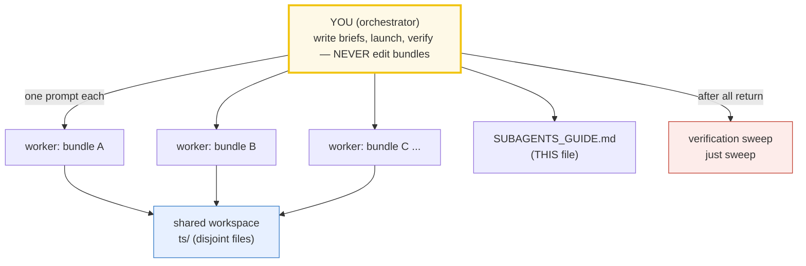

# SUBAGENTS_GUIDE — Delegating Bundle-Building at Scale (TypeScript)

> A note from past-me to future-me: **how to spin up many `ts/` concept bundles
> in parallel using subagents, without losing rigor.**
>
> This sits **above** [`HOW_TO_RESEARCH.md`](./HOW_TO_RESEARCH.md) (which is the
> per-bundle workflow). That guide defines *what* a bundle is and *how* to build
> one. This guide defines *how to delegate* that work to many agents at once —
> the worker prompt template, the coordination rules, and the verification sweep.
>
> Sister guides: [`../go/SUBAGENTS_GUIDE.md`](../go/SUBAGENTS_GUIDE.md),
> [`../rust/SUBAGENTS_GUIDE.md`](../rust/SUBAGENTS_GUIDE.md).



---

## 0. When to use this mode

Use subagent delegation when you need **≥3 concept bundles** built to a uniform
bar. For 1–2 bundles, just build them by hand (follow `HOW_TO_RESEARCH.md`) —
the overhead of writing tight prompts and running a verification sweep isn't
worth it. The moment you're doing a whole phase (Phase 1, Phase 2…), delegate.

**The trap it prevents:** when you build many things yourself in one session,
context fills up, quality drifts, and the later bundles get sloppy. Subagents
each get a *fresh* context, so bundle #52 is as rigorous as bundle #1.

**The throughput rule:** launch **at most 4 workers per batch** (parallel
`Task` calls in one message). After each batch returns, run `just sweep`, then
launch the next batch of 4. This keeps the swarm observable and failures
isolated.

---

## 1. The mental model: orchestrator + workers

- **You (the orchestrator)** do NOT write bundle code. You: (a) write the worker
  prompt template (§2), (b) fill one brief per bundle (§3), (c) launch workers
  in parallel — **max 4 per batch**, all `Task` calls in ONE message, (d) run
  the verification sweep (`just sweep`) after each batch, (e) re-spawn any
  worker that failed verification.
- **Each worker** owns exactly ONE bundle (its `.ts` + `_output.txt` + `.md`)
  and is told to follow `HOW_TO_RESEARCH.md` to the letter. It is forbidden from
  touching any other bundle's files, the `Justfile`, `package.json` /
  `pnpm-workspace.yaml` / `pnpm-lock.yaml`, `tsconfig*.json`, `scripts/`,
  `HOW_TO_RESEARCH.md`, `SUBAGENTS_GUIDE.md`, and `TODO.md`.
- **The workspace is shared** (`ts/`), but file ownership is disjoint, so
  parallel writes are safe.

---

## 2. The standard worker prompt (copy this, fill the blanks)

Every worker gets this preamble verbatim, then a per-concept "brief". This is the
single most important artifact in this guide — get it right and the bundles come
back uniform.

```text
You are building ONE "concept bundle" for the TypeScript learning repo. Work
ENTIRELY inside /Volumes/data/workspace/tutorials/ts/. Do NOT touch any file
that is not part of your assigned bundle, and do NOT edit package.json,
pnpm-workspace.yaml, pnpm-lock.yaml, tsconfig*.json, Justfile,
HOW_TO_RESEARCH.md, SUBAGENTS_GUIDE.md, TODO.md, or anything under scripts/.

=== STEP 0: ABSORB THE WORKFLOW (mandatory, do first, in order) ===
1. Read /Volumes/data/workspace/tutorials/ts/HOW_TO_RESEARCH.md IN FULL.
   It is the law: the bundle = {name}.ts (ground truth) +
   {name}_output.txt (captured stdout) + {NAME}.md (guide). There is NO .html.
2. Study the canonical model bundle(s) and COPY THEIR STYLE EXACTLY:
   {MODEL_BUNDLES}   # e.g. core/values_types_coercion.ts + .md (Phase 1 onward)
   Match: the sectionBanner()/check() helpers; the section_*() print structure of
   the .ts; the "> From {name}.ts Section X:" verbatim callouts + mermaid +
   pitfalls table + cheat sheet + ## Sources in the .md; the three-layer depth
   (what / why-internals / gotchas). Start from scripts/skeleton.ts.

=== STEP 1: MINE THE AUTHORITATIVE SOURCE ===
Read these and quote real code/API/signatures, not paraphrases:
{CITE_SOURCES}   # e.g. "MDN reference; typescriptlang.org/docs/handbook;
                 #        nodejs.org/docs; v8.dev; tc39.es/ecma262"

=== STEP 2: FACT-CHECK VIA WEB SEARCH (mandatory, do NOT skip) ===
For every signature, version, and behavioral claim: web-search the official docs
(MDN, typescriptlang.org, nodejs.org, v8.dev, tc39.es) and >=1 other
authoritative source (2ality, Mathias Bynens, Jake Archibald, web.dev blogs).
Verify the EXACT behavior in >=2 places. Record every URL in a "## Sources"
section at the bottom of {NAME}.md.
NEVER guess a signature or a number. If you cannot verify a fact, search until
you can, or flag it explicitly in your final report. Start your searches at:
{WEB_ANCHORS}

=== HARD RULES (TypeScript-specific) ===
- Run via `just run {name}` (== pnpm exec tsx <member>/{name}.ts). NEVER compile
  a .js into the source dir. tsx erases types in-memory; no artifact is left.
- NEVER hand-compute. The .ts prints every value. The .md pastes values verbatim
  under "> From {name}.ts Section X:" callouts.
- DETERMINISM (or _output.txt won't reproduce):
  * NO Math.random() for a printed value -> use the mulberry32(seed) helper.
  * NO Date.now()/new Date() for a printed value -> fixed dates only.
  * Object keys: string keys are insertion-order EXCEPT integer-like keys
    (numeric order) -> SORT keys before printing, OR use a Map.
  * Async/worker output ORDER is nondeterministic -> collect into an array,
    SORT, print from main()/awaited aggregate. Never console.log from a
    callback/Promise.then/worker thread directly.
  * Floats: print to fixed precision if a drift across V8 versions is possible.
- NO console.assert: use the check(description, ok) helper (prints
  "[check] desc: OK", throws on failure -> non-zero exit -> sweep catches it).
- TYPECHECK IS CANON: run `just typecheck {name}` (tsc --noEmit under strict
  mode + noUncheckedIndexedAccess + all no* checks). A type error FAILS
  verification. Fix the type; do NOT reach for `any`. Narrow possibly-undefined
  index access with a check, not a reflexive `!`.
- STDLIB-FIRST: use ONLY the deps installed in your bundle's member
  (core/ is pure Node stdlib for Phase 1-5). Do NOT add any dependency or edit
  manifests. If you "need" another lib, implement from scratch (more
  educational) or flag it.
- Self-contained single file (no sibling-package imports). Tiny-but-complete
  examples so every value prints while every behavior shows.
- VALUE-VS-REFERENCE is a teaching axis: when a section touches a value, the .md
  must say whether it is a primitive (copied) or object (shared reference),
  whether it is mutated through an alias, and whether a closure/timer/listener
  retains it.

=== DELIVERABLES (exact paths) ===
- /Volumes/data/workspace/tutorials/ts/{MEMBER}/{name}.ts
- /Volumes/data/workspace/tutorials/ts/{MEMBER}/{name}_output.txt
    (produce via:  just out {name}   # == pnpm exec tsx <member>/{name}.ts > {name}_output.txt 2>/dev/null)
- /Volumes/data/workspace/tutorials/ts/{MEMBER}/{NAME}.md

{NAME}.md MUST contain: the lineage old->new with WHY each step happened (for
ecosystem bundles) or the mechanism (for language bundles); mermaid diagrams;
"> From {name}.ts Section X:" verbatim output blocks; a worked smallest-scale
example; a pitfalls table (trap | symptom | fix); a cheat sheet; the
value-vs-reference analysis where relevant; cross-references to sibling bundles
(🔗) AND cross-language parallels where they exist (../go/ ../rust/ ../python/);
and a "## Sources" section (URLs).

=== VERIFICATION (do ALL of these, then report) ===
Run from /Volumes/data/workspace/tutorials/ts/ :
1. `just check {name}` -> "tsx run: OK", checks printed > 0, typecheck: OK.
2. `just out {name}` -> {name}_output.txt non-empty; byte-identical on a 2nd run.
3. Every "[check] ... OK" line in _output.txt is mirrored verbatim under a
   "> From {name}.ts Section X:" callout in the .md.

=== REPORT BACK (your final message) ===
- The 3 file paths created.
- Check result: how many "[check] ... OK" printed, and `just check` verdict.
- Web sources used (list URLs).
- Any fact you could NOT verify (do not hide uncertainty).

=== YOUR CONCEPT BRIEF ===
Bundle name: {name} / {NAME}     Member: {MEMBER}
Phase: {PHASE_N} ({PHASE_THEME})
Lineage (old -> new): {LINEAGE}
Anchor concepts/signatures (verify on web, implement in the .ts, assert):
  {ANCHOR_CONCEPTS}
Suggested .ts sections: {SECTION_LIST}
Suggested mermaid in .md: {MERMAID_IDEAS}
A concrete value the .ts must print (pin it so you can sanity-check):
  {PINNED_VALUE_OR_HOW_TO_DERIVE_IT}
Cross-references to wire up: {SIBLING_LINKS}
```

The `{BLANK}` fields are the only thing that changes between workers. Everything
else is constant — that's what keeps the bundles uniform.

> **Bootstrap note (Phase 1 only):** the very first bundle has no model to copy.
> Give it a richer brief (spell out the banner style, the callout format, the
> pitfalls-table columns), then designate it the style anchor for all later
> workers by putting its path in `{MODEL_BUNDLES}`.

---

## 3. Filling the brief — the per-concept fields

For each concept you delegate, you (orchestrator) fill in:

| Field | What to put |
|---|---|
| `{MEMBER}` | The workspace member dir: `core` (P1–5), `metaprog` (P6), `web` (P7–8), `db` (P8). Walkthroughs: `hono`/`drizzle`/`ioredis`. |
| `{MODEL_BUNDLES}` | 1–2 already-shipped bundles to copy style from (Phase 1's first bundle onward). |
| `{CITE_SOURCES}` | Real docs refs: `developer.mozilla.org/en-US/docs/Web/JavaScript/...`, `typescriptlang.org/docs/handbook/...`, `nodejs.org/docs/...`, `v8.dev/...`, `tc39.es/ecma262/...`. |
| `{WEB_ANCHORS}` | Official doc URL + a search phrase, e.g. "MDN event loop; microtask vs macrotask; Jake Archibald tasks vs microtasks". |
| `{ANCHOR_CONCEPTS}` | The exact behaviors/signatures to verify & assert, e.g. "typeof null === 'object' (the famous lie); NaN !== NaN; 0.1+0.2 !== 0.3". |
| `{SECTION_LIST}` | Suggested teachable points (A: the basic API, B: internals, C: worked example, D: contrast/gotcha). |
| `{PINNED_VALUE}` | A concrete output the .ts must print, so the worker (and you) can sanity-check. |
| `{SIBLING_LINKS}` | Which 🔗 bundles to reference, e.g. "VALUE_VS_REFERENCE (why a shared object reference is the shared-mutability bug class)". |

**Rule of thumb:** spend 5 minutes on the brief. A lazy brief → a lazy bundle.
The brief is where your judgment as orchestrator actually lives.

---

## 4. Coordination rules (keep the swarm safe)

1. **Disjoint file ownership.** Each worker writes only its 3 files (inside its
   assigned member). State the exact paths in the prompt and forbid edits
   elsewhere (including `Justfile`, `package.json`, `tsconfig*.json`, `scripts/`,
   and all other bundles). This makes parallel writes safe.
2. **No dependency edits.** `package.json` / `pnpm-workspace.yaml` /
   `pnpm-lock.yaml` / `tsconfig*.json` are read-only to workers. If a worker
   "needs" another lib, it implements from scratch — or you add the dep/member
   between batches (and run `pnpm install`).
3. **Max 4 workers per batch.** Send up to 4 worker `Task` calls in ONE message.
   After they return + you sweep, launch the next 4. Independent file ownership =
   safe concurrency; small batches = observable, recoverable failures.
4. **One concept per worker.** Never let a worker build two bundles — context
   splits and both degrade. A huge concept is still one worker with a richer brief.

---

## 5. The verification sweep (do this after EACH batch returns)

Workers self-verify, but you independently re-check the whole batch. Run it with
the Justfile (it loops every `.ts`, runs it, counts `[check]`s, and confirms
`_output.txt` presence):

```bash
cd /Volumes/data/workspace/tutorials/ts
just sweep
```

That single command is the whole sweep. Then also run the typecheck gate (the
sweep reports run + checks + output; typecheck is a separate pass):

```bash
just typecheck
```

Then spot-check: open 2–3 `.md` files, confirm a couple of `> From ... Section
X:` callouts match the corresponding `_output.txt` values byte-for-byte.

**Re-spawn failures.** Any bundle that fails the sweep: re-launch ONE worker for
just that bundle, paste its prior output + the failing check as context, and ask
it to fix only the failure. Don't rewrite from scratch unless the whole bundle is
wrong. Common fixes are mapped in §7.

---

## 6. Handling style drift (the "improve existing" worker)

When new bundles raise the bar (e.g. they add a `## Sources` section, or a
value-vs-reference analysis, that older bundles lack), spawn a
**style-consistency worker** to backport. Its brief:

```text
Bring the EXISTING bundles up to the current house style. Edit ONLY:
  {OLD_BUNDLE_PATHS}   # the specific files to backport
Do NOT change any computed value (they are ground truth — the .ts output). Do
NOT touch the new bundles. Conformance checklist per bundle:
  - .md has a "## Sources" section with MDN/typescriptlang/node/v8/tc39 URLs.
  - .md has the value-vs-reference analysis where relevant.
  - .md cross-references the new sibling bundles where relevant (links) AND
    cross-language parallels (../go/ ../rust/ ../python/) where they exist.
  - .go / .md style matches the new bundles (banners, callouts, pitfalls table).
  - .ts still typechecks clean (`just typecheck {name}`).
Verify: re-run `just check {name}` for each (must still pass); report what changed.
```

Run this worker **in parallel** with the new-bundle workers — it edits disjoint
files (the old bundles), so there's no conflict.

---

## 7. Common failure modes (and the fix)

| Worker symptom | Cause | Fix |
|---|---|---|
| `tsx run: FAILED` (runtime throw) | bad logic / wrong API / `undefined` access / off-by-one | re-spawn with the correct `{ANCHOR_CONCEPTS}` + exact signature |
| `typecheck: FAIL` | a strict-mode type error (`any` leak, possibly-undefined index access, wrong signature) | re-spawn: fix the type; narrow with a check; avoid `any`; `noUncheckedIndexedAccess` is the usual culprit |
| `_output.txt` differs on re-run | `Math.random()` / `Date.now()` / unsorted integer-like object keys / unordered async/worker output | re-spawn citing the DETERMINISM hard rules (seed RNG; fixed dates; sort keys; serialize async output) |
| `[check]` count is 0 | worker skipped invariants | re-spawn, emphasize "add a `check(...)` for every invariant" |
| Numbers in `.md` don't match `_output.txt` | worker hand-typed a table | re-spawn, emphasize "paste verbatim under callouts"; run `just out {name}` to regenerate |
| No `## Sources` | worker skipped web search | re-spawn, make Step 2 non-optional |
| No pitfalls table | worker wrote a junior tutorial | re-spawn, cite the "expert payoff" (HOW_TO_RESEARCH.md §3) |
| Worker edited another bundle's file (or package.json/Justfile) | brief was loose | restore from git; tighten the "do NOT touch" clause |

---

## 8. The batch-run checklist (orchestrator's pre-flight)

Before launching a batch of up to 4 workers:
- [ ] The member dir for this phase exists and has a `package.json` +
      `tsconfig.json`; its deps are installed (`pnpm install`).
- [ ] Each worker's 3 file paths are disjoint from every other worker's in the
      batch.
- [ ] Each brief has `{CITE_SOURCES}`, `{WEB_ANCHORS}`, `{ANCHOR_CONCEPTS}`.
- [ ] Each brief has a concrete `{PINNED_VALUE}` (or a way to derive it).
- [ ] For Phase 1, the first bundle is designated the style anchor (ship it solo
      or first).
- [ ] `just sweep` and `just typecheck` are your post-batch checks.

After the batch returns:
- [ ] `just sweep` green for all bundles in the batch.
- [ ] `just typecheck` clean for the batch's member(s).
- [ ] Spot-checked 2–3 `.md` callouts against `_output.txt`.
- [ ] Re-spawned any failures (max 4 again).
- [ ] Ticked the boxes in [`TODO.md`](./TODO.md); updated its Progress table.

---

## 9. Why this works (and where it breaks)

- **Fresh context per bundle** → bundle #52 is as rigorous as #1. (This is the
  whole point; it's why hand-building many in one session degrades.)
- **Disjoint file ownership** → safe parallel writes; no merge conflicts.
- **The constant preamble** → uniform style without you micromanaging each.
- **The `Justfile` sweep** → one command (`just sweep` + `just typecheck`)
  catches every silent failure: a worker that reported OK but shipped a
  non-deterministic output, a type error, or a missing `_output.txt`.
- **The brief is the leverage** → your judgment is concentrated in 5-minute
  briefs, not 50-minute hand-writes.

Where it breaks: if a brief is vague, the worker guesses; if you skip the sweep,
silent bugs ship. **The brief + the sweep are non-negotiable.** Everything else
is automation.
