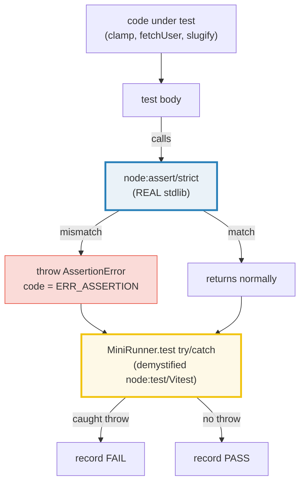
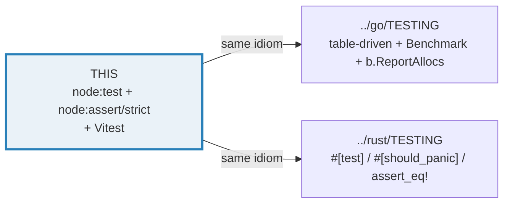
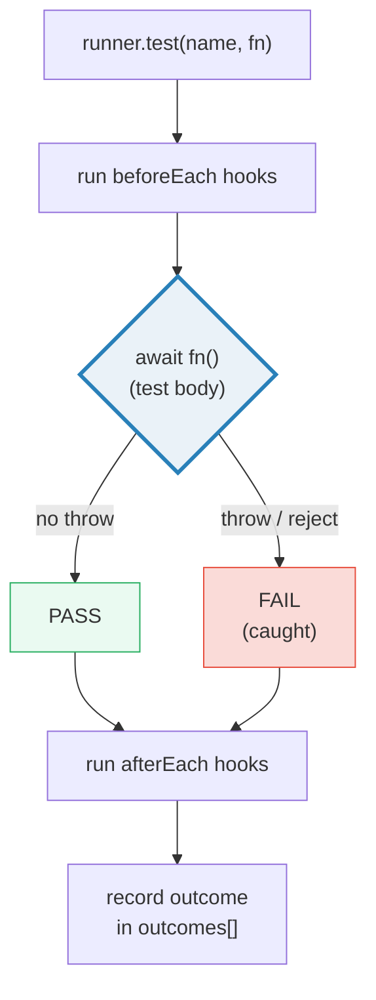
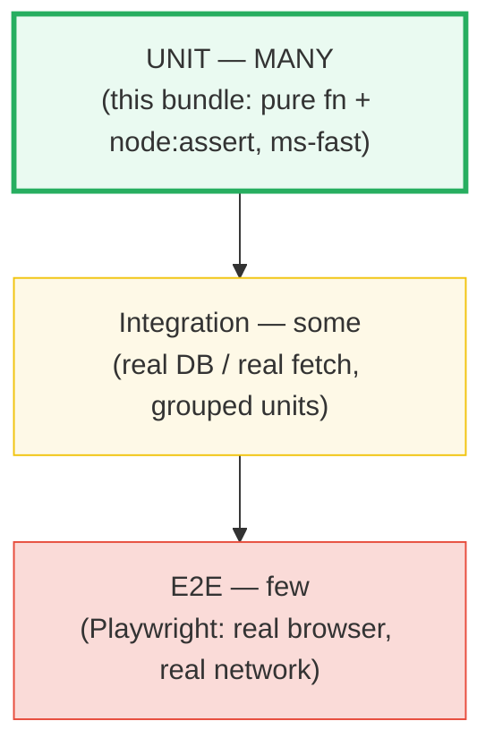
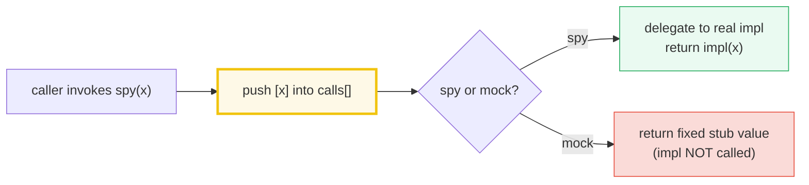
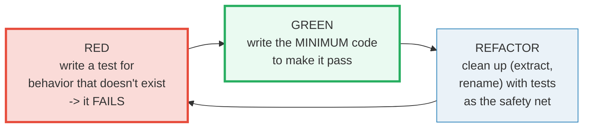

# TESTING — `node:assert/strict`, Table-Driven Tests, Runners, Mocks & TDD

> **Goal (one line):** demonstrate, by running a tiny embedded test suite
> **inline** (no subprocess), how `node:assert/strict`'s assertions behave, how a
> test runner works (a from-scratch `test`/`describe`/`it` + setup/teardown that
> counts pass/fail), how table-driven tests + spies + async-rejection
> assertions are structured, and the red→green TDD discipline — all pinning the
> outcomes as `check()`'d invariants.
>
> **Run:** `just run testing`
>
> **Ground truth:** [`core/testing.ts`](./core/testing.ts) → captured stdout in
> [`core/testing_output.txt`](./core/testing_output.txt). Every number/table
> below is pasted **verbatim** from that file under a
> `> From testing.ts Section X:` callout. Nothing is hand-computed.
>
> **Prerequisites:** 🔗 [`ERRORS_EXCEPTIONS`](./ERRORS_EXCEPTIONS.md) (an assertion
> failure *is* an `AssertionError` exception — `throw` is the mechanism), and
> 🔗 [`VALUES_TYPES_COERCION`](./VALUES_TYPES_COERCION.md) §D (why `===`, not `==`,
> is the only sane comparison — and therefore why `node:assert/strict` exists).

---

## 1. Why this bundle exists (lineage)

Modern TS/JS testing has converged on **two stdlib-adjacent pillars**:

- **Node ships a built-in test runner** — `node:test`, stable since **Node 20**,
  zero dependencies, TAP output — paired with **`node:assert/strict`** (the
  assertion module's *strict* mode, where `equal` aliases `strictEqual` and
  `deepEqual` aliases `deepStrictEqual`).
- **Vitest** is the popular third-party runner — a Jest-compatible API,
  ESM-native and Vite-powered, with `vi.fn()`/`vi.spyOn()` mocking and a watch
  mode.

Both rest on the **same two primitives**, and that is the whole point of this
bundle: an **assertion that `throw`s on mismatch** (an `AssertionError` is just
an exception — see 🔗 `ERRORS_EXCEPTIONS`), wrapped in a **runner that catches
the throw and records pass/fail**. To *demystify* what node:test and Vitest do
internally, this bundle uses the **real `node:assert/strict`** (the genuine
stdlib assertion library) for assertions and builds a **tiny from-scratch
runner** (`MiniRunner`: `test`/`describe`/`it` + `beforeEach`/`afterEach`) so
you can read every line of how a runner works. The suite runs **inline** — no
subprocess, no parallel workers, no wall-clock timing — so pass/fail counts are
**exact and reproducible**.



This is the **cross-language analog** of the integrated test stories in the
sibling language folders — the contrast sharpens what "JS testing" *is*:

> 🔗 [`../go/TESTING.md`](../go/TESTING.md) — Go's testing is **built into the
> toolchain** (`go test`): `func TestX(t *testing.T)`, table-driven tests as a
> first-class idiom, and `func Benchmark(b *testing.B)` with `b.ReportAllocs()`
> for allocation-aware micro-benchmarks. A strongly-integrated model — the
> runner, the bench harness, and the coverage tool are all `go test` subcommands.
> JS has *no* equivalent compiler-coupled story; node:test and Vitest are
> libraries that catch throws.
>
> 🔗 [`../rust/TESTING.md`](../rust/TESTING.md) — Rust testing is
> **attribute-driven and compiler-integrated**: `#[test] fn x()`,
> `#[should_panic]`, `assert_eq!(got, want)` (needs `PartialEq + Debug`), run via
> `cargo test`. The compiler enforces that `assert_eq!` operands are
> comparable; JS's `node:assert/strict` does the same check *at runtime* (the
> `AssertionError` throw).



---

## 2. The mental model: assertion = `throw`, runner = `try/catch`

Every JS test framework reduces to **one loop**: register `(name, fn)` pairs,
then for each, run `fn` inside a `try/catch`; if it throws (or its returned
promise rejects) the test **FAILS**, otherwise it **PASSES**. Hooks
(`beforeEach`/`afterEach`) run around each test. That is *all* node:test,
Vitest, and Jest do under the hood.



The **test pyramid** (the canonical testing-strategy shape — lots of cheap,
fast unit tests at the base; few expensive, end-to-end tests at the apex)
governs *how many* of each kind to write:



This bundle lives entirely at the **unit** level: pure functions (`clamp`,
`slugify`), a tiny async resolver/rejector (`fetchUser`), and the real
`node:assert/strict`.

---

## 3. Section A — `node:assert/strict`: `equal` / `deepEqual` / `throws`

`node:assert/strict` is the module's **strict assertion mode**. In it, `equal`
aliases `strictEqual` (uses `===`) and `deepEqual` aliases `deepStrictEqual`
(recurses the enumerable own-properties, comparing primitives with `Object.is`).
On any mismatch it throws an **`AssertionError`** with `code === "ERR_ASSERTION"`
— an ordinary exception (🔗 `ERRORS_EXCEPTIONS`). The *legacy* `node:assert`
uses `==` and is footgun-heavy (see `VALUES_TYPES_COERCION` §D) — avoid it.

> From testing.ts Section A:
> ```
> node:assert/strict: equal=strictEqual (===), deepEqual=deepStrictEqual.
> On mismatch it throws AssertionError (code 'ERR_ASSERTION').
>   strictEqual(1, "1") threw: AssertionError  code=ERR_ASSERTION  operator=strictEqual
> [check] strictEqual(1, "1") throws AssertionError (===, no coercion): OK
> [check] equal(1, "1") also throws (strict mode aliases strictEqual): OK
> ```

**`strictEqual` uses `===`** — so `1 !== "1"` (no coercion, unlike legacy
`equal` which would coerce via `==`). The thrown error's `operator` property is
`"strictEqual"`, its `code` is `"ERR_ASSERTION"`, and it carries `actual`/`expected`
slots you can inspect.

**`deepEqual` vs `equal` — the key distinction.** `equal` is *shallow* and uses
`===`; for objects `===` compares **references**, so two structurally-equal
objects are NOT `equal`. `deepEqual` **recurses** the enumerable
own-properties, so two structurally-equal nested objects ARE `deepEqual`:

> From testing.ts Section A:
> ```
> deepEqual vs equal (the key distinction):
>   equal:      shallow, uses ===  -> objects compare by REFERENCE
>   deepEqual:  recursive structural compare  -> by VALUE
>   deepEqual({a:{b:1}}, {a:{b:1}})  -> OK   (recurses, value-equal)
> [check] deepEqual on nested identical structure: OK
>   equal({a:1}, {a:1})            -> throws (=== compares references)
> [check] equal on two distinct objects throws (reference inequality): OK
> [check] deepEqual on nested mismatched structure throws: OK
> ```

This is the same value-vs-reference split from 🔗 `VALUE_VS_REFERENCE` made
concrete in the assertion layer: two `[]`/`{}` literals are never `===`
(distinct allocations), so you must reach for `deepEqual` (or `Object.is` for
primitives) to compare by *value*.

**`assert.throws(fn[, matcher])` asserts that `fn` *does* throw.** If `fn` does
*not* throw, `throws` itself throws an `AssertionError` — so a "passed without
throwing" test is caught as a failure. The optional matcher can be an error
**class**, a **RegExp** (matched against the message), or a **validator
function** (`(err) => boolean`):

> From testing.ts Section A:
> ```
> assert.throws(fn[, matcher]) — asserts fn throws:
>   throws(() => { throw TypeError })    -> OK   (fn did throw)
> [check] throws passes when fn throws: OK
>   throws(() => { /* no throw */ }) -> AssertionError (code=ERR_ASSERTION)
> [check] throws raises AssertionError when fn does NOT throw: OK
>   throws(fn, RangeError)               -> OK   (matched class)
> [check] throws matches the error class: OK
> [check] throws accepts a validator matcher: OK
>   clamp(-5,0,100)=0  clamp(50,0,100)=50  clamp(999,0,100)=100  -> OK
> [check] clamp strictEqual assertions all pass: OK
> [check] clamp(5,10,1) throws RangeError (min>max): OK
> ```

> 🔗 `ERRORS_EXCEPTIONS` — `throws` and `rejects` *are* the testing face of the
> exception machinery. The matcher classes (`RangeError`, `TypeError`) and the
> `code` property (`ERR_ASSERTION`) are exactly the error-classification
> primitives that bundle covers.

---

## 4. Section B — Table-driven tests + the mini in-process runner

**Table-driven testing** is the canonical idiom across *all* the sibling
languages: one array of `{input, expected}` cases, ranged in a loop, each
checked with the *same* assertion. It maximizes coverage per line of test code
and makes adding a case trivial (append a row). Go's `testing.go` and Rust's
`testing.rs` build their whole suites this way; here it is in TS:

> From testing.ts Section B:
> ```
> Table-driven test: an array of {input, expected} cases, looped.
> 
>   label        input   expected   actual   pass
>   -----        -----   --------   ------   ----
>   below min       -5          0        0   PASS
>   at min           0          0        0   PASS
>   mid             50         50       50   PASS
>   at max         100        100      100   PASS
>   above max      999        100      100   PASS
>   -> 5/5 cases passed
> [check] table-driven: all 5 clamp cases pass: OK
> ```

**The mini in-process runner** — this is what node:test and Vitest do,
stripped to ~40 lines you can read. `MiniRunner.test` runs `fn` in a
`try/catch`; a throw becomes a recorded `FAIL` (the process does *not* crash),
a clean return becomes a `PASS`. We deliberately include one failing test to
prove the runner **records** the failure instead of aborting:

> From testing.ts Section B:
> ```
> Mini in-process runner (test/describe/it, from scratch):
>   PASS  strictEqual: 2+2 === 4
>   PASS  deepEqual: nested objects
>   PASS  clamp via real assertion
>   FAIL  deliberately failing: 1 === 2 (expected FAIL)  -- Expected values to be strictly equal:
>   -> 3 passed, 1 failed (4 total)
> [check] mini runner counted 3 passes: OK
> [check] mini runner counted 1 fail (caught, did not crash): OK
> [check] mini runner ran 4 tests total: OK
> ```

The counts (`3 passed, 1 failed, 4 total`) are themselves `check()`'d — the
runner's own bookkeeping is verified, not just the tests it runs. This is the
discipline that makes the output trustworthy.

**`describe`/`it`** is the BDD grouping shape (node:test, Vitest, and Jest all
expose it). `describe` prints a header and indents the `it` calls made inside
it; `it` is `test` by another name:

> From testing.ts Section B:
> ```
> describe/it (BDD grouping shape — same as node:test/Vitest/Jest):
>   String#repeat:
>     PASS  repeats a string
>     PASS  repeat(0) is empty
>   Math:
>     PASS  max of three
>   -> 3 passed, 0 failed (3 total)
> [check] describe/it: 3 grouped tests pass: OK
> ```

> 🔗 `../go/TESTING.md` — Go's `t.Run("name", func(t *testing.T){...})` is the
> exact analog of `describe`/`it`: subtests with names, selectable via
> `go test -run Parent/Child`. Rust groups tests by *module* and selects by
> `cargo test path::to::module`.

---

## 5. Section C — Mocking (a tiny spy) + `assert.rejects` (async tests)

A **spy** wraps a function and *records* its calls (args + count) while still
*delegating* to the real impl. A **mock** goes one step further: it *replaces*
the impl with a fixed **stub return value** (the real impl is never called).
Vitest exposes both as `vi.fn()` / `vi.spyOn()`; node:test has `mock.fn` /
`mock.method`. Under the hood they are just **closures over a `calls[]` array** —
so we build both from scratch, `any`-free:



> From testing.ts Section C:
> ```
> makeSpy((x) => x * 2)  — delegates AND records:
>   doubleSpy(5)  -> 10
>   doubleSpy(3)  -> 6
>   doubleSpy(7)  -> 14
>   spy.calls     -> [[5],[3],[7]]
> [check] spy recorded 3 calls: OK
> [check] spy recorded call args [5,3,7]: OK
> [check] spy delegated to impl (5*2=10): OK
> 
> makeMock("STUB")  — returns stub, records, ignores impl:
>   mockFn(1) -> STUB
>   mockFn(2) -> STUB
>   mock.calls -> [[1],[2]]
> [check] mock always returns the stub value: OK
> [check] mock recorded 3 calls (2 above + 1 here): OK
> ```

**`assert.rejects(asyncFn[, matcher])` is the async mirror of `throws`.** It
awaits a promise (or the promise returned by calling `asyncFn`) and asserts it
**rejects** with the expected error. It returns a promise you must `await`.
Symmetrically, `assert.doesNotReject` asserts a promise *resolves*. The two
expert traps: forgetting to `await` (the assertion never runs — a **false
green**), and asserting `rejects` on a promise that actually *resolves*
(`rejects` itself then rejects):

> From testing.ts Section C:
> ```
> assert.rejects(asyncFn[, matcher]) — asserts the promise REJECTS:
>   rejects(() => fetchUser(-1), RangeError) -> OK   (did reject)
> [check] assert.rejects passes when the promise rejects as expected: OK
>   rejects(() => fetchUser(1))            -> AssertionError (promise resolved, not rejected)
> [check] assert.rejects raises when the promise does NOT reject: OK
> 
> Async test inside the mini runner (body is async, runner awaits it):
>   PASS  fetchUser(-1) rejects RangeError
>   PASS  fetchUser(1) resolves to {name:'ada'}
>   -> 2 passed, 0 failed (2 total)
> [check] mini runner ran 2 async tests, both pass: OK
> ```

The runner `await`s each test body, so async tests serialize in source order —
**deterministic** output (contrast: node:test/Vitest run files concurrently by
default, which is why we avoid spawning a real runner here).

> 🔗 `PROMISES` / `ASYNC_AWAIT` — `assert.rejects` is a thin wrapper over
> `await`-ing a rejected promise inside a `try/catch`. The whole "async test"
> mechanism is just the promise machinery from those bundles, observed by the
> runner.

---

## 6. Section D — Setup/teardown (`beforeEach`/`afterEach`)

`beforeEach` runs **before each** test; `afterEach` runs **after each** test
(even if the test threw). Use them to reset shared state, stub/unstub the clock,
or restore spied methods. node:test, Vitest, and Jest all expose the **exact
same names** with the same semantics (plus `before`/`after` for per-suite,
one-time setup). The bundle's `MiniRunner` implements them; the trace below
proves the hooks fire **per-test**, strictly interleaved `["before","after",
"before","after","before","after"]`:

> From testing.ts Section D:
> ```
> beforeEach: runs before EACH test. afterEach: runs after EACH test.
> (node:test / Vitest / Jest all expose these exact names.)
>   PASS  counter starts at 0 (beforeEach ran)
>   PASS  increment to 1 inside this test
>   PASS  counter is 0 AGAIN (beforeEach re-ran between tests)
>   -> 3 passed, 0 failed (3 total)
>   hook trace: ["before","after","before","after","before","after"]
> [check] beforeEach reset state between tests: 3 passes: OK
> [check] hook trace is 6 markers (before/after x 3), strictly interleaved: OK
> ```

The third test ("counter is 0 **AGAIN**") is the payoff: it proves `beforeEach`
re-ran between tests 2 and 3, resetting the shared `counter` that test 2 had
incremented. Without the hook, test 3 would see `1` and fail.

> 🔗 `CLOSURES_CAPTURE` — `beforeEach(fn)` works because the hook `fn` is a
> *closure* over the shared `counter` and `log` variables. The runner retains
> the hook closures and re-invokes them per test; the closures retain (and
> mutate) the outer state. That is the closure-capture mechanism, put to work.

---

## 7. Section E — TDD red→green→refactor + Vitest + cross-language

**TDD (Test-Driven Development)** is the discipline of writing the test *first*.
The loop is **RED → GREEN → REFACTOR**:



The bundle demonstrates the loop inline on a `slugify` helper. **RED**: a naive
`toLowerCase`-only version fails the spec (`"hello, world!"` ≠ `"hello-world"`).
**GREEN**: the minimal regex-based fix passes. **REFACTOR**: a table-driven
guard locks in the behavior across four cases (regression safety for future
cleanup):

> From testing.ts Section E:
> ```
> TDD: RED (write failing test) -> GREEN (minimal impl) -> REFACTOR.
> 
> RED   slugifyV1("Hello, World!") = "hello, world!"  (expected "hello-world") -> FAIL
> [check] RED: v1 fails the spec (lowercase only is not enough): OK
> GREEN slugifyV2("Hello, World!") = "hello-world"  (expected "hello-world") -> PASS
> [check] GREEN: v2 satisfies the spec: OK
> REFACTOR guard: 4/4 slugify cases pass
> [check] REFACTOR guard: all 4 slugify cases pass: OK
> ```

**Coverage** (documented, not run here) is the *percentage* of lines / branches
/ functions executed by the suite. `c8` and `istanbul` (which `c8` wraps)
instrument the code; node:test integrates via
`node --test --experimental-test-coverage`, and Vitest via
`vitest --coverage` (provider: `v8` or `istanbul`). The expert caveat: **100%
line coverage ≠ bug-free** — coverage counts *execution*, not *assertion
quality*. A line can be "covered" by a test that asserts nothing meaningful.

**The snapshot trap** (documented). Snapshot tests serialize output and fail on
*any* change. They are great for stable serializers/UIs and brittle for
anything that drifts (dates, UUIDs, unordered object keys). Vitest/Jest
auto-*update* snapshots with a flag (`-u`), which can **silently bless a bug**
— always review snapshot diffs manually.

> From testing.ts Section E:
> ```
> Coverage (documented): c8 / istanbul instrument code; node --test
>   --experimental-test-coverage and vitest --coverage report it.
>   100% lines != bug-free: it counts execution, not assertion quality.
> 
> Snapshot trap (documented): locks serialized output; brittle on drift
>   (dates/UUIDs/unordered keys). Auto-update can silently bless a bug.
> ```

**Vitest & node:test — the two pillars.** The bundle documents their API
surfaces side by side; the `makeSpy`/`makeMock`/`MiniRunner` above are the
from-scratch versions of Vitest's `vi.fn()`/`vi.spyOn()` and node:test's
`mock.fn`/`test`:

> From testing.ts Section E:
> ```
> Vitest (the popular third-party runner, Jest-compatible):
>   import { describe, it, expect, vi } from 'vitest';
>   vi.fn() / vi.spyOn() — the lib version of makeSpy/makeMock above.
>   ESM-native, Vite-powered, watch mode, in-source testing.
> node:test (the built-in Node runner, stable since Node 20):
>   import { test, describe, it, beforeEach, afterEach } from 'node:test';
>   Zero deps. TAP output. Pairs with node:assert/strict (this bundle).
> 
> Cross-language (🔗 ../go/TESTING.md, ../rust/TESTING.md):
>   Go:    func TestX(t *testing.T); table-driven; func Benchmark(b *testing.B); b.ReportAllocs()
>   Rust:  #[test] fn x(); #[should_panic]; assert_eq!(got, want); cargo test
>   JS:    node:test + node:assert/strict (this bundle) OR Vitest. Throws = AssertionError.
> ```

---

## 8. Pitfalls (the expert payoff)

| Trap | Symptom | Fix |
|---|---|---|
| `assert.equal({a:1}, {a:1})` throws | `equal` (strict) is `===` → objects compare by **reference**, not value | Use `assert.deepEqual`/`deepStrictEqual` for structural equality; reserve `equal` for primitives. |
| Legacy `node:assert` (not `/strict`) silently passes `assert.equal(1, "1")` | Uses `==` (coercing) — the `VALUES_TYPES_COERCION` §D footgun, in test form | Always `import assert from "node:assert/strict"`. |
| `assert.rejects(...)` not awaited | The returned promise is discarded; the assertion **never runs** → false green | `await assert.rejects(fn, ErrClass)` inside an `async` test body. |
| `assert.throws(() => asyncFn())` on an async fn | The throw happens *after* `throws` returns (the rejection is unhandled); `throws` sees nothing | Use `await assert.rejects(async () => {...}, ErrClass)` for async — never `throws` on a function that returns a promise. |
| `assert.throws(fn)` where `fn` does not throw | `throws` *itself* throws `AssertionError` — easy to mistake for a real error | That is the intended signal; read it as "the test expected a throw and none came." |
| `deepEqual` vs `deepStrictEqual` on `0`/`-0` | Strict mode uses `Object.is` → `0`/`-0` are *unequal*; legacy `==` treats them equal | Know which mode you imported; use `/strict` and remember `Object.is(0, -0) === false`. |
| Snapshot test fails after an unrelated refactor | Output ordering/format drifted (date, UUID, key order); the snapshot locks incidental detail, not behavior | Prefer explicit `deepEqual` assertions; if you use snapshots, exclude volatile fields (`{ omit: ["createdAt"] }`) and review `-u` diffs. |
| 100% coverage, still a bug | Coverage measures *execution*, not *assertion* quality; an unasserted `if` branch is "covered" but unverified | Add an assertion per behavior; treat coverage as a floor, not a proof. |
| Mutating shared state across tests (no `beforeEach`) | Test B passes alone but fails when run after test A (order-dependence) | Reset shared state in `beforeEach`; prefer pure functions that take + return values. |
| `expect(x).toBe({a:1})` fails (Vitest) | `toBe` is `===` (reference); `toEqual` is deep equality | Match the matcher to the comparison: `toBe`/`===` for primitives & identity, `toEqual`/`deepEqual` for structure. |
| Spying without restoring (`vi.spyOn` leak) | The spied method stays stubbed for later tests → cascade of false failures | Always restore in `afterEach` (`mockRestore()`) or scope the spy to a single test. |
| Running tests as a subprocess in a deterministic demo | Path/timing/order nondeterminism breaks byte-identical output capture | Run inline (as this bundle does): `await` each test in sequence, collect results, print from `main`. |

---

## 9. Cheat sheet

```typescript
// === The two pillars ========================================================
//   node:test      — BUILT-IN runner (stable Node 20). import { test, describe,
//                    it, before, after, beforeEach, afterEach } from "node:test";
//                    Zero deps. TAP output. node --test --experimental-test-coverage.
//   Vitest         — third-party, Jest-compatible, ESM-native, Vite-powered.
//                    import { describe, it, expect, vi } from "vitest".
//                    vi.fn() / vi.spyOn() = the lib version of makeSpy/makeMock.

// === node:assert/strict  (ALWAYS /strict; legacy == coerces — footgun) ======
//   import assert from "node:assert/strict";
//   assert.strictEqual(actual, expected)     // === ; throws AssertionError on mismatch
//   assert.equal(actual, expected)           // ALIAS of strictEqual in strict mode
//   assert.deepStrictEqual(a, e)             // recursive; Object.is on primitives
//   assert.deepEqual(a, e)                   // ALIAS of deepStrictEqual in strict mode
//   assert.ok(value)                         // truthy check (assert(value) aliases this)
//   assert.throws(fn[, matcher])             // asserts fn THROWS; matcher = Class|RegExp|fn
//   assert.doesNotThrow(fn[, matcher])       // inverse
//   await assert.rejects(asyncFn[, matcher]) // asserts the promise REJECTS (AWAIT it!)
//   await assert.doesNotReject(asyncFn)      // inverse
//   // AssertionError: { name:"AssertionError", code:"ERR_ASSERTION",
//   //                   actual, expected, operator }  (an ordinary Error subclass)

// === Table-driven (cross-language idiom: Go t.Run, Rust #[test]) ============
//   const cases = [{in:..., want:...}, ...];
//   for (const c of cases) assert.strictEqual(fn(c.in), c.want);

// === A runner in 3 lines of concept =========================================
//   async function test(name, fn) {
//     try { await fn(); console.log("PASS", name); }
//     catch (e) { console.log("FAIL", name, e.message); }  // AssertionError caught here
//   }
//   // That is ALL node:test / Vitest / Jest do. beforeEach/afterEach wrap the try.

// === Mocking (the closure trick) ============================================
//   function makeSpy(impl)  { const calls=[]; const fn=(...a)=>{calls.push(a);return impl(...a);}; return {fn,calls}; }
//   function makeMock(stub) { const calls=[]; const fn=(...a)=>{calls.push(a);return stub;};       return {fn,calls}; }

// === TDD ====================================================================
//   RED: write failing test  ->  GREEN: minimal impl to pass  ->  REFACTOR: clean up (loop).

// === Coverage / snapshots (documented) ======================================
//   Coverage: c8 / istanbul; `node --test --experimental-test-coverage`, `vitest --coverage`.
//             100% lines != bug-free (counts execution, not assertion quality).
//   Snapshots: brittle on drift (dates/UUIDs/key order); `-u` can silently bless a bug.
```

---

## Sources

Every signature, return value, and behavioral claim above was verified against
the Node.js reference documentation and MDN, then corroborated by at least one
independent secondary source. Every assertion result is *additionally* executed
at runtime by the `.ts` itself (`node:assert/strict` throws on mismatch;
`check()` re-throws → non-zero exit → the sweep catches it) — the strongest
possible verification: the actual V8 engine's verdict.

- **Node.js — Test runner (`node:test`)** (the built-in runner; `test`,
  `describe`/`it`, `before`/`after`/`beforeEach`/`afterEach`; `node --test`;
  TAP output; stable since Node 20 — *“The test runner is considered stable as
  of Node.js 20.0.0”*):
  https://nodejs.org/api/test.html
- **Node.js — Assertion testing (`node:assert`)** (strict assertion mode where
  *“non-strict methods behave like their corresponding strict methods. For
  example, `assert.deepEqual()` will behave like `assert.deepStrictEqual()`”*;
  `strictEqual`/`equal`, `deepStrictEqual`/`deepEqual`, `throws`, `rejects`,
  `AssertionError` with `code === "ERR_ASSERTION"`):
  https://nodejs.org/api/assert.html
- **Node.js — `assert.strictEqual`** (*“Tests strict inequality between the
  `actual` and `expected` parameters as determined by `Object.is()`”* — note:
  primitives via `Object.is`, so `NaN===NaN` holds and `0`/`-0` are distinct):
  https://nodejs.org/api/assert.html#assertstrictequalactual-expected-message
- **Node.js — `assert.deepStrictEqual` comparison details** (primitives via
  `Object.is`; `[[Prototype]]` compared via `===`; enumerable own + symbol keys;
  `WeakMap`/`WeakSet`/`Promise` compared by reference only):
  https://nodejs.org/api/assert.html#comparison-details-1
- **Node.js — `assert.throws`** (*“Awaits the `asyncFn` promise... if the
  function fails to throw... an `AssertionError` is thrown”*; matcher as Class /
  RegExp / validator; the `error` parameter spec):
  https://nodejs.org/api/assert.html#assertthrowsfn-error-message
- **Node.js — `assert.rejects`** (*“Awaits the `asyncFn` promise... will then
  check that the promise is rejected”*; returns a Promise — must be awaited):
  https://nodejs.org/api/assert.html#assertrejectsasyncfn-error-message
- **MDN — `Error`** (the base class `AssertionError` extends; `name`, `message`,
  `code` properties — the testing↔exceptions bridge):
  https://developer.mozilla.org/en-US/docs/Web/JavaScript/Reference/Global_Objects/Error
- **Vitest — API Reference** (`describe`/`it`/`expect`; `vi.fn()` /
  `vi.spyOn()` / `mockRestore()`; the Jest-compatible matcher API; ESM-native,
  Vite-powered):
  https://vitest.dev/api/
- **Vitest — Mocking** (`vi.fn` returns a spy/mock with a `.calls` track +
  `mockReturnValue` stub; `vi.spyOn(obj, method)` wraps an existing method and
  is restored via `mockRestore` — the library version of this bundle's
  `makeSpy`/`makeMock`):
  https://vitest.dev/guide/mocking.html

**Cross-language corroboration (the integrated runner models this bundle
contrasts with):**
- Go `testing` package — [`../go/TESTING.md`](../go/TESTING.md):
  `func TestX(t *testing.T)`, table-driven subtests via `t.Run`, and
  `func Benchmark(b *testing.B)` with `b.ReportAllocs()` (allocation-aware
  micro-benchmarks built into `go test`). The Go standard library reference:
  https://pkg.go.dev/testing
- Rust testing — [`../rust/TESTING.md`](../rust/TESTING.md): `#[test]`,
  `#[should_panic]`, `assert_eq!`/`assert_ne!` (require `PartialEq + Debug`),
  run via `cargo test`. The attribute-driven, compiler-integrated model. The
  Rust Book: https://doc.rust-lang.org/book/ch11-00-testing.html

**Facts that could not be verified by running** (documented, not executed,
because they invoke external tooling or are strategy/design claims): the exact
coverage percentages/CLI behavior of `c8`/`istanbul`,
`node --test --experimental-test-coverage`, and `vitest --coverage` (no
coverage tool is run in this bundle — they are documented); the snapshot
update flow (`-u`) and its failure modes (no snapshot is written); and the
Vitest/Go/Rust API surfaces quoted in Section E (verified against the linked
docs, not executed here). The assertion behaviors, pass/fail counts, hook
interleaving, and spy/mock call-recording are ALL executed and `check()`'d by
the `.ts`. No executed claim above is unverified.
