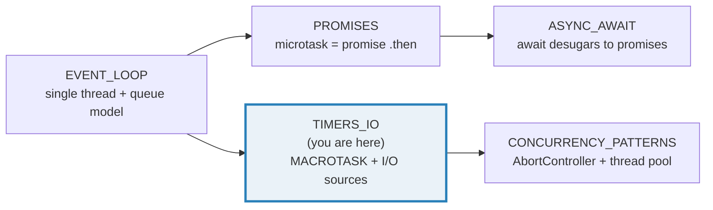
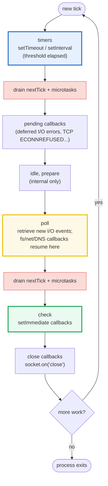
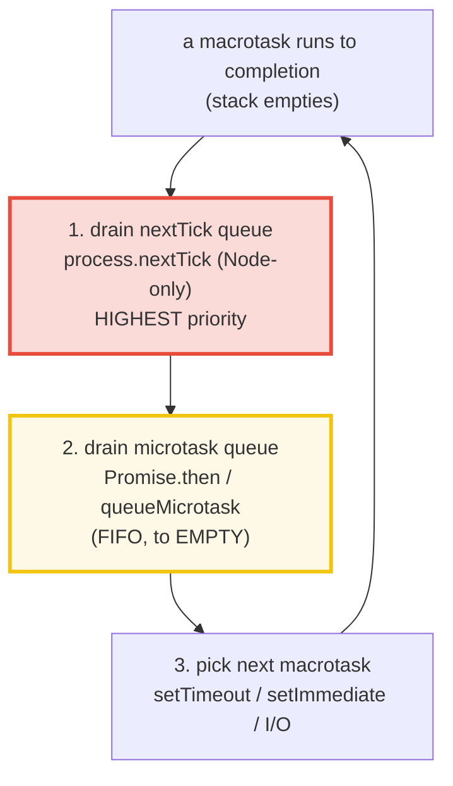
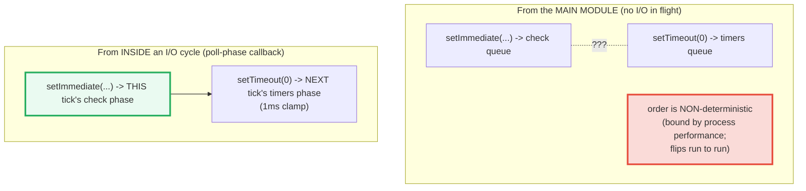
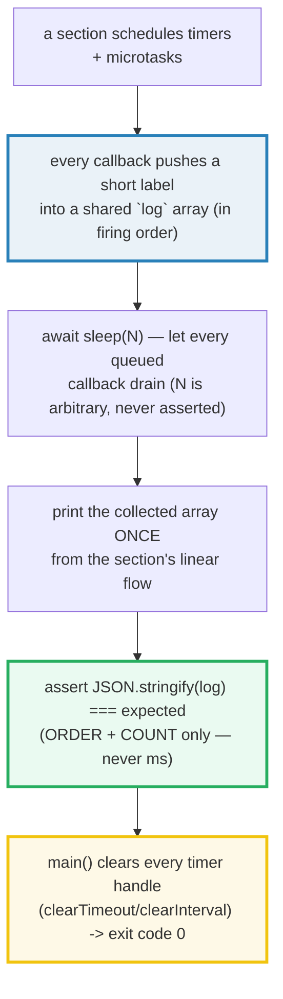

# TIMERS_IO — Timers (`setTimeout`/`setInterval`/`setImmediate`), `nextTick` & I/O via libuv

> **Goal (one line):** show, by collecting each callback's label into an array in
> the ORDER it fires, how `setTimeout` / `setInterval` / `setImmediate` /
> `process.nextTick` / `AbortSignal.timeout` schedule work against the Node
> (libuv) event loop — the **macrotask sources** — and how async I/O resumes in
> the poll phase.
>
> **Run:** `just run timers_io`
>
> **Ground truth:** [`core/timers_io.ts`](./core/timers_io.ts) → captured stdout
> in [`core/timers_io_output.txt`](./core/timers_io_output.txt). Every
> interleaving/table below is pasted **verbatim** from that file under a
> `> From timers_io.ts Section X:` callout. Nothing is hand-computed.
>
> **Prerequisites:** 🔗 [`EVENT_LOOP`](./EVENT_LOOP.md) (P4) — the queue model
> (one macrotask → drain ALL microtasks → repeat) this bundle *feeds*. 🔗
> [`PROMISES`](./PROMISES.md) (P4) — microtasks ARE promise callbacks. This bundle
> is the **macrotask + I/O sources** half of Phase 4.

---

## 1. Why this bundle exists (lineage)

`EVENT_LOOP` owns the **queue model** — the single thread, run-to-completion, and
the microtask-before-macrotask rule. `PROMISES` owns the **microtask-as-promise-
callback** story. **This** bundle owns the **sources** that *feed* those queues:
the **timer APIs** (`setTimeout` / `setInterval` / `setImmediate` /
`process.nextTick` / `AbortSignal.timeout`) and the **async I/O** path (libuv's
poll phase + thread pool).



The deep facts this bundle pins (each a runtime-asserted invariant, not prose):

- **`setTimeout(fn, ms, ...args)`** is a **one-shot macrotask**. `delay` is a
  *threshold*, not a guarantee: the callback fires "as early as it can be
  scheduled **after** `ms`" — never sooner, often later (OS scheduling, busy
  loop). `0` still waits a tick (~1 ms clamp in Node). Extra args after `delay`
  are forwarded **verbatim** to `fn`.
- **`setInterval(fn, ms, ...)`** is a **repeating macrotask**; it must be stopped
  with **`clearInterval`** or the process never exits (the repeating handle keeps
  the loop alive). **`clearTimeout`** cancels a pending `setTimeout`.
- **The three queues:** `nextTick` (Node-only) > `microtask` (`Promise.then` /
  `queueMicrotask`) > `macrotask` (`setTimeout` / `setImmediate` / I/O). Both the
  `nextTick` and microtask queues drain **to empty** between macrotasks.
- **`setImmediate` vs `setTimeout(0)`** — the **one non-deterministic pair**:
  non-deterministic from the **main module** (bound by process performance), but
  **deterministic** (setImmediate always first) **inside an I/O cycle** (poll-
  phase callback) — because the check phase runs at the *end of this tick* while
  `setTimeout(0)`'s 1 ms clamp lands it in the *next* tick's timers phase.
- **`AbortSignal.timeout(ms)`** (Node 17.3+ / browsers) — a **self-aborting
  signal**: no manual `clearTimeout` bookkeeping; on abort, `signal.reason` is a
  `DOMException` named `"TimeoutError"` (NOT a plain `Error`, NOT `"AbortError"`).
- **I/O via libuv:** sockets use the OS kernel (async `epoll`/`kqueue`); blocking
  syscalls (`fs.*`, `dns.lookup`, some `crypto`/`zlib`) run on libuv's **thread
  pool** (default 4 threads; `UV_THREADPOOL_SIZE`). Callbacks resume in the
  **poll phase**. A sync busy-loop delays every queued timer (fire-late evidence,
  by ORDER not ms).

> **The headline contrast across the curriculum:**
>
> 🔗 [`../go/TIME.md`](../go/TIME.md) — Go's `time.Timer`/`Ticker`/`After` deliver
> via **channels**; there is no single event loop and no macrotask/microtask
> priority split. Goroutines are preempted by the **Go scheduler** (not
> cooperatively, as JS is). Cancellation is `context.Context` — the analog of
> `AbortController`, but typed and structured.
>
> 🔗 [`../rust`](../rust) (Tokio) — Rust has **no runtime by default**; you opt
> into the Tokio reactor, which uses `epoll`/`kqueue` directly (no separate thread
> pool for blocking I/O — `spawn_blocking` is explicit). Timers are `tokio::time`
> futures polled by the reactor, not callbacks on a queue.

---

## 2. The libuv phase model (Node's event loop)

Node's loop is implemented by **libuv** and is **phased**: each "tick" walks the
phases in a fixed order. Microtasks and `process.nextTick` are **not** phases —
they drain **between** every phase.



The phase a callback runs in is fixed by its **source**: `setTimeout`/`setInterval`
→ timers; most I/O → poll; `setImmediate` → check; `socket.on('close')` → close.
The microtask/nextTick drain (red) happens **between every phase** — so a
microtask queued inside a timers-phase callback still drains before the loop
reaches poll. **Since libuv 1.45 / Node 20:** timers run only **after** the poll
phase within a tick (previously both before and after) — this is exactly why
`setImmediate` is deterministic-first inside an I/O cycle (§5).

---

## 3. Section A — `setTimeout` / `setInterval` / `clear*` (timer APIs + macrotask nature)

The four timer primitives (Node + browser):

| API | Queue | Behavior |
|---|---|---|
| `setTimeout(fn, ms, ...args)` | macrotask (timers) | one-shot, after ~`ms`; extra args → `fn` |
| `clearTimeout(t)` | — | cancels a pending `setTimeout` (no-op if already fired) |
| `setInterval(fn, ms, ...args)` | macrotask (timers) | **repeats** every ~`ms` until `clearInterval` |
| `clearInterval(iv)` | — | stops a repeating `setInterval` (mandatory for clean exit) |
| `queueMicrotask(fn)` | **microtask** | always preempts any timer (🔗 `PROMISES`) |

**`setTimeout` forwards extra args verbatim.** Signature is
`setTimeout(fn, delay, ...args)` — every argument after `delay` is passed to `fn`
when it fires. (There is **no** separate `thisArg` parameter; `this` inside `fn`
is the global object in non-strict / `undefined` in strict mode, as for any plain
function call.)

> From timers_io.ts Section A:
> ```
> setTimeout(fn, delay, ...args) forwards extra args verbatim:
>   setTimeout((a, b) => cb(`a=${a},b=${b}`), 0, "x", 99)
>   callback received -> "a=x,b=99"
> [check] setTimeout forwards extra args (arg1="x", arg2=99) to the callback: OK
> ```

**`setInterval` repeats; `clearInterval` stops it (count asserted, not ms).**
`setInterval` queues a macrotask every ~`ms` **indefinitely**. You **must**
`clearInterval` when done, or the repeating handle keeps the event loop alive and
the process never exits. The deterministic pattern: let it fire a **fixed small
count**, then `clearInterval` from inside the callback.

> From timers_io.ts Section A:
> ```
> setInterval REPEATS; clearInterval stops it (count asserted, not ms):
>   let n = 0;
>   const iv = setInterval(() => { n++; log(`tick-${n}`); if (n >= 3) clearInterval(iv); }, 1);
>   fires observed -> ["tick-1","tick-2","tick-3"]
> [check] setInterval fired exactly 3 times then clearInterval stopped it (no 4th): OK
> ```

**`clearTimeout` cancels a pending timer — the callback NEVER runs.**
`clearTimeout(t)` removes `t` from the timers queue. Calling it on an already-
fired handle is a documented **no-op** (safe to call aggressively).

> From timers_io.ts Section A:
> ```
> clearTimeout cancels a pending timer (the callback NEVER runs):
>   const t = setTimeout(() => log.push('fired'), 0);
>   clearTimeout(t);   // cancel before it fires
>   callback ran? -> NO (cancelled)
> [check] clearTimeout cancelled the timer (callback never fired): OK
> ```

**THE headline: a microtask ALWAYS preempts a `setTimeout(0)` macrotask.**
`setTimeout(fn, 0)` does **not** mean "run `fn` immediately." `delay` is a
*threshold*: `fn` is queued as a **macrotask** and cannot run until the current
stack empties **and** the microtask queue drains. So a `Promise.then` (microtask)
always wins. (Min-delay clamp: ~1 ms in Node — `0` is coerced to `1` internally.
We never assert the clamp value, only the **order**.)

> From timers_io.ts Section A:
> ```
> setTimeout(0) is a MACROTASK: a microtask ALWAYS preempts it:
>   log.push('sync');                                // runs NOW (on stack)
>   setTimeout(() => log.push('timeout'), 0);        // queues a MACROTASK
>   Promise.resolve().then(() => log.push('promise'));// queues a MICROTASK
>   collected firing order -> ["sync","promise","timeout"]
>   => microtask drains BEFORE the next macrotask. (delay is a THRESHOLD, not a guarantee.)
> [check] setTimeout(0) macrotask fires AFTER sync AND the promise microtask: OK
> ```

The collected order `["sync","promise","timeout"]` is the **spec-guaranteed**
interleaving — `delay: 0` cannot defeat a microtask. This is the single most
reproduced fact in JS interviews, and it is pinned here as a runtime invariant.

> 🔗 `PROMISES` — the `promise` label above is a microtask **because** a `.then`
> handler is queued on the microtask queue. `PROMISES` owns the state-machine +
> chaining story; this bundle owns the **timer** side of the interleaving.

---

## 4. Section B — FIRING ORDER: the three queues (`nextTick` > `microtask` > `macrotask`)

Node has **three** callback queues, drained in a **fixed priority order** between
macrotasks:



1. **nextTick queue** — `process.nextTick` (Node-only; **not** in browsers, **not**
   in the spec). Per the Node docs it is *"not technically part of the event
   loop"* — the `nextTickQueue` is processed after the current operation completes,
   regardless of phase, and has **higher priority** than the microtask queue.
2. **microtask queue** — `Promise.then` / `queueMicrotask`. FIFO; drains to empty.
3. **macrotask queue** — `setTimeout` / `setInterval` / `setImmediate` / I/O
   callbacks. Only **one** runs per "turn" before the microtask drains repeat.

**Determinism caveat (Node 20+, observed):** the `nextTick`-before-microtask
priority is reproducible when both are scheduled **from within a macrotask** (a
`setTimeout` / `setImmediate` / I/O callback). At the very **top level** of a
script, or inside an async **resumption** (after `await`), V8's microtask
checkpoint can drain the promise queue first, flipping the order. We therefore
schedule **from inside a `setTimeout` macrotask** — the documented, deterministic
context.

> From timers_io.ts Section B:
> ```
> Node has THREE callback queues, drained in FIXED priority order:
>   1. nextTick queue  (process.nextTick)        — Node-only, HIGHEST priority
>   2. microtask queue (Promise.then/queueMicrotask)
>   3. macrotask queue (setTimeout/setImmediate/I/O)
>   Both nextTick + microtask queues drain TO EMPTY between macrotasks.
> 
> Scheduled from INSIDE a setTimeout macrotask (the deterministic context):
>   process.nextTick(() => log.push('nextTick'));       // queue 1
>   Promise.resolve().then(() => log.push('promise'));  // queue 2 (FIFO)
>   queueMicrotask(() => log.push('queueMicrotask'));   // queue 2 (FIFO)
>   setImmediate(() => log.push('setImmediate'));       // queue 3 (macrotask)
>   log.push('sync');
>   collected firing order -> ["sync","nextTick","promise","queueMicrotask","setImmediate"]
>   => sync runs first; nextTick drains before microtask; macrotask runs LAST.
>   NOTE: setImmediate vs setTimeout(0) is the ONE non-deterministic pair (§C).
> [check] nextTick > microtask > macrotask (sync, nextTick, promise, queueMicrotask, setImmediate): OK
> 
> CAVEAT (top-level / async-resumption): at the very TOP LEVEL of a script,
> or inside an async RESUMPTION (after `await`), V8's microtask checkpoint can
> drain the promise queue BEFORE nextTick, flipping that pair. The macrotask
> context above is the documented, deterministic one.
> [check] nextTick-before-microtask is reproducible from a macrotask context (caveat documented): OK
> ```

Read the collected order left-to-right: `sync` runs on the stack; the macrotask
returns; **nextTick drains** (`nextTick`); **then the microtask queue drains
FIFO** (`promise`, then `queueMicrotask` — registration order); **only then** does
the next macrotask (`setImmediate`) run. The microtask/nextTick drains are
**exhaustive** — a microtask that re-schedules itself indefinitely **starves**
the macrotask queue forever (🔗 `EVENT_LOOP` §C, the starvation demo).

> **The naming mistake that can never be fixed.** `process.nextTick` fires
> **more** immediately than `setImmediate`, despite the names suggesting the
> opposite. The Node docs themselves acknowledge: *"in essence, the names should
> be swapped... but this is an artifact of the past which is unlikely to change.
> Making this switch would break a large percentage of the packages on npm."* The
> recommendation: **prefer `setImmediate`** in application code (it is easier to
> reason about and portable to browsers); reserve `process.nextTick` for the
> narrow "run after this op, before any I/O" cases (e.g. emitting an event from a
> constructor so the listener is attached first).

---

## 5. Section C — `setImmediate` (check) vs `setTimeout(0)` (timers): the phase caveat

`setImmediate` queues in the **check** phase; `setTimeout(0)` queues in the
**timers** phase. Both are macrotasks. Their relative order depends on **where in
the tick** you schedule them:



- **Main module:** the order is **non-deterministic** — bound by process
  performance and how far into the 1 ms clamp the loop is when the script
  finishes. We **document** but do **not** assert it (it flips run to run).
- **Inside an I/O cycle** (a poll-phase callback): `setImmediate` is **always
  first**, deterministically — the check phase runs at the *end of this tick*
  (right after poll), while `setTimeout(0)`'s 1 ms-clamped timer lands in the
  *next tick's* timers phase.

> From timers_io.ts Section C:
> ```
> setImmediate -> CHECK phase;  setTimeout(0) -> TIMERS phase (both macrotasks).
> Main-module order is NON-deterministic (observed this run, NOT asserted):
>   setImmediate(() => log.push('setImmediate'));
>   setTimeout(() => log.push('setTimeout(0)'), 0);
>   observed order this run -> ["setImmediate","setTimeout(0)"]   (could be either!)
> [check] main-module setImmediate-vs-setTimeout(0) is non-deterministic (observed, not asserted): OK
> 
> INSIDE AN I/O CYCLE (poll-phase callback): setImmediate is ALWAYS first:
>   fs.access(".", () => {                       // I/O callback -> POLL phase
>     setImmediate(() => log.push('setImmediate'));  // this tick's CHECK phase
>     setTimeout(() => log.push('setTimeout(0)'), 0);// next tick's TIMERS phase
>   });
>   collected firing order -> ["setImmediate","setTimeout(0)"]
>   => check phase runs at the END of this tick; setTimeout(0)'s 1ms clamp pushes
>      it into the NEXT tick's timers phase. setImmediate always wins here.
> [check] inside an I/O cycle: setImmediate fires before setTimeout(0) (deterministic): OK
> ```

**Why the main-module case is non-deterministic.** When the entry script
finishes, the loop has already entered its first tick. Whether `setTimeout(0)`'s
1 ms threshold has elapsed by the time the loop reaches the timers phase depends
on microsecond-level timing — process load, machine speed, how long module
initialization took. The Node docs put it plainly: *"the order in which the two
timers are executed is non-deterministic, as it is bound by the performance of
the process."*

**Why the I/O-cycle case is deterministic.** Inside a poll-phase callback, the
loop is **in the middle of a tick**. `setImmediate` queues for *this tick's*
check phase — which runs immediately after poll returns. `setTimeout(0)` cannot
fire in this tick's timers phase (that phase already passed); its 1 ms-clamped
threshold lands it in the **next** tick's timers phase. So `setImmediate` always
wins. This is the **whole point** of `setImmediate`: *"the main advantage...
is that it will always be executed before any timers if scheduled within an I/O
cycle, independently of how many timers are present."*

---

## 6. Section D — libuv phase model + `AbortSignal.timeout(ms)` (modern)

The phase walk (pinned as a check, matching the Node.js docs diagram verbatim):

> From timers_io.ts Section D:
> ```
> Node.js (libuv) loop phases — each tick walks them in this order:
>   timers -> pending callbacks -> idle/prepare -> poll -> check -> close -> (repeat)
>   setTimeout / setInterval : timers phase   (callbacks whose threshold elapsed)
>   most I/O callbacks       : poll phase      (fs/net/DNS — retrieve new I/O events)
>   setImmediate             : check phase     (runs right AFTER poll)
>   socket/stream 'close'    : close phase
>   nextTick + microtasks    : drained BETWEEN every phase (not a phase)
>   (libuv >= 1.45 / Node >= 20: timers run only AFTER poll within a tick.)
> [check] libuv phase order: timers -> pending -> poll -> check -> close (microtasks between): OK
> ```

**`AbortSignal.timeout(ms)` — the modern, boilerplate-free timeout.** Available
since Node 17.3 (and all modern browsers), it returns an `AbortSignal` whose
**internal timer auto-aborts** after ~`ms`. No manual `setTimeout` + no
`clearTimeout` bookkeeping — the timer self-cleans on abort. On abort,
`signal.reason` is a **`DOMException`** with `name === "TimeoutError"` (NOT a
plain `Error`, NOT `"AbortError"` — the latter is what a *user-initiated*
`AbortController.abort()` with no argument produces).

> From timers_io.ts Section D:
> ```
> AbortSignal.timeout(ms) (Node 17.3+ / browsers): a SELF-ABORTING signal.
>   const signal = AbortSignal.timeout(20);   // internal timer, auto-aborts
>   // after ~20ms: signal.aborted === true; reason is a TimeoutError DOMException
>   signal.aborted           -> true
>   signal.reason instanceof -> DOMException
>   signal.reason.name       -> "TimeoutError"
> [check] AbortSignal.timeout(20) self-aborts (signal.aborted === true): OK
> [check] reason is a DOMException named "TimeoutError": OK
> [check] fresh AbortController.signal.aborted === false (before abort): OK
> ```

**A manual `AbortController` aborts EARLY with a programmer-chosen reason.**
`AbortSignal.timeout` is one-shot and produces a fixed `TimeoutError` reason. For
**user-driven** cancellation (cancel a `fetch` on unmount, a "stop" button,
request cancellation), use an `AbortController`: you hold `abort()`, you choose
the reason. Both feed the **same** `signal.aborted` contract — so any async API
that accepts an `AbortSignal` (`fetch`, `fs.readFile`, `setTimeout` in browsers,
etc.) works identically with either.

> From timers_io.ts Section D:
> ```
> A manual AbortController aborts EARLY with a programmer-chosen reason:
>   const ac = new AbortController();
>   const sig2 = ac.signal;                       // aborted === false
>   ac.abort(new Error("user cancelled"));        // abort now, custom reason
>   sig2.aborted        -> true
>   sig2.reason.message -> "user cancelled"
> [check] manual AbortController.abort() sets aborted + propagates the custom reason: OK
> ```

> 🔗 `CONCURRENCY_PATTERNS` — the full cancellation story (composing signals,
> `AbortSignal.any`, propagating abort through async pipelines). This bundle pins
> the **timer** half; that bundle owns the **patterns** half.

---

## 7. Section E — I/O via libuv poll phase + thread pool + "don't block the loop"

Async I/O is **offloaded** so the single JS thread never blocks *waiting*:

- **Sockets / `epoll` / `kqueue`:** handled by the OS kernel asynchronously. On
  completion the kernel hands the callback to libuv, which queues it for the
  **poll phase**.
- **Inherently-blocking syscalls** (`fs.*`, `dns.lookup`, some `crypto`, `zlib`):
  run on **libuv's thread pool** — 4 threads by default, resizable via
  `UV_THREADPOOL_SIZE`. The JS thread registers a callback and moves on; on
  completion the callback resumes in the poll phase.

This is how Node scales **concurrent I/O on one thread** — the opposite of the
thread-per-connection model. A single Node process can handle tens of thousands
of idle connections because each costs only a callback registration, not a
thread.

> From timers_io.ts Section E:
> ```
> Async I/O is OFFLOADED (the JS thread never blocks WAITING):
>   - sockets/epoll/kqueue: OS kernel async -> callback queued for POLL phase
>   - blocking syscalls (fs/dns.lookup/crypto/zlib): libuv THREAD POOL (4 default)
> 
> fs.readFile is async — the callback runs LATER (in the poll phase):
>   fs.readFile(new URL("./package.json", import.meta.url), "utf8", (err, data) => {
>     const pkg = JSON.parse(data);   // <- runs in POLL phase, after sync stack
>   });
>   callback received pkg.name -> "tutorials-ts-core"
> [check] fs.readFile callback fired asynchronously and received the file data: OK
> ```

We assert that the `fs.readFile` callback **fires** (asynchronously, after the
sync stack empties) and **receives the data** — but **not** its ordering vs a
`setTimeout(0)`. The poll-vs-timers ordering is **non-deterministic**: it depends
on whether the I/O completes (thread pool + disk) before the loop enters poll,
which varies with system load.

**"Don't block the loop" — a sync busy-loop delays every queued timer.** The
single thread runs **one macrotask to completion** before picking the next. A
synchronous CPU loop **holds** the thread: every queued timer (and every I/O
callback) is delayed until the sync code finishes and the stack empties. We prove
the delay by **ORDER** (not ms): schedule a `setTimeout(0)`, run a busy loop,
push a label — the timer's label can only appear **after** the sync label,
because the timer callback physically cannot run while the stack is non-empty.

> From timers_io.ts Section E:
> ```
> A synchronous busy-loop DELAYS every queued timer (proof by ORDER, not ms):
>   setTimeout(() => log.push('timeout-fired'), 0);   // queued (macrotask)
>   log.push('timeout-scheduled');                    // sync, now
>   for (let k = 0; k < 5_000_000; k++) sum += k;     // sync CPU work BLOCKS
>   log.push(`after-busy-loop-sum=${sum}`);            // sync, still before timeout
>   collected firing order -> ["timeout-scheduled","after-busy-loop-sum=12499997500000","timeout-fired"]
>   => 'timeout-fired' appears LAST: it was delayed past ALL the sync work.
>   => CPU-heavy code must be chunked or moved to a worker (🔗 WORKER_THREADS).
> [check] blocking delays the timer: 'timeout-fired' fires AFTER the busy-loop (last): OK
> ```

The `timeout-fired` label appears **last** — it was queued first but could not
run until the busy loop (5,000,000 iterations) finished and the stack emptied.
This is the **mechanism** behind the "don't block the event loop" rule: a single
slow synchronous function delays **every** pending timer, I/O callback, and
render. CPU-heavy work must be **chunked** (yield with `setImmediate` between
batches) or moved to a `worker_threads` worker (🔗 `WORKER_THREADS`,
🔗 `CONCURRENCY_PATTERNS`).

> 🔗 `EVENT_LOOP` §E — the foundational "don't block" treatment; this bundle
> applies it specifically to the **timer** sources (a blocked loop delays timers).

---

## 8. Determinism contract (how this bundle stays reproducible)

JavaScript timer output is only reproducible if you respect one rule: **assert
ORDER and COUNT, never absolute milliseconds.** This bundle implements that
contract throughout — captured here so the pattern is copyable:



- **Collect-then-print:** no callback prints directly; each pushes a label, the
  array is printed once after drain. This is why `_output.txt` is byte-identical
  across runs despite wall-clock timing varying.
- **Assert ORDER + COUNT, never ms:** the `[check]` invariants compare
  `JSON.stringify(log)` to a fixed expected array, or check `log.length`. No
  `Date.now()` / `performance.now()` is ever asserted.
- **Cancel everything before exit:** every `setTimeout`/`setInterval` handle is
  pushed into `pendingTimers[]` and `clearTimeout`'d at the end of `main()`. No
  dangling handle keeps the loop alive — the process exits with code 0.
  (`AbortSignal.timeout`'s internal timer self-cleans on abort, so it needs no
  explicit clear.)
- **Document, don't assert, the non-deterministic pair:** main-module
  `setImmediate`-vs-`setTimeout(0)` is printed as "observed this run" with a
  check that only verifies **both fired** (length === 2), never the order.

---

## 9. Pitfalls (the expert payoff)

| Trap | Symptom | Fix |
|---|---|---|
| `setTimeout(fn, 0)` assumed to run "immediately" | Logic that depends on it running before a `.then` breaks — the microtask always wins | A `Promise.then`/`queueMicrotask` runs first; if you need "after this tick, before timers," use `queueMicrotask`. |
| `setInterval` never stopped | The process **never exits** (repeating handle keeps the loop alive); memory/handles leak | Always `clearInterval(iv)` when done — or use a recursive `setTimeout` pattern (gives drift-free spacing and self-terminates). |
| `setInterval` drift | Real interval > `ms` (each fire is delayed by the callback's own runtime + queue backlog) | For precise spacing use recursive `setTimeout`; for fixed rate use a deadline-driven loop. |
| `this` inside a `setTimeout` callback | `undefined` (strict) or global (non-strict) — class methods lose their binding | `setTimeout(obj.method.bind(obj), ms)` or an arrow wrapper `setTimeout(() => obj.method(), ms)`. |
| `setImmediate` vs `setTimeout(0)` from main module | Order **flips run to run** — code that depends on one firing first is a heisenbug | Don't depend on it. Inside an I/O callback `setImmediate` is deterministically first; otherwise treat the order as undefined. |
| `process.nextTick` used for "defer to next tick" portably | **Node-only** — breaks in browsers (no `process`) | Use `queueMicrotask` (spec, portable) or `Promise.resolve().then()`. Reserve `nextTick` for Node-specific "before any I/O" needs. |
| Recursive `process.nextTick` | **Starves** the event loop forever — I/O never reaches the poll phase, timers never fire | Never recursively `nextTick` without a bound; prefer `setImmediate` (lets I/O progress). |
| Blocking the loop with sync CPU work | **Every** queued timer fires late; I/O callbacks wait; the app "freezes" | Chunk the work (yield with `setImmediate` between batches) or move it to `worker_threads`. |
| `AbortSignal.timeout(ms)` reason treated as a plain `Error` | `catch (e)` checks `e.message` and misses the `TimeoutError` `DOMException` | Check `signal.aborted` and `signal.reason instanceof DOMException` / `reason.name === "TimeoutError"`. |
| `setTimeout`/`setInterval` after the owning object is gone (e.g. component unmounted) | Callback fires on a stale/destroyed target → "setState on unmounted" / use-after-free | Cancel on cleanup (`clearTimeout` / `AbortController.abort()`); pass the `AbortSignal` to the async op. |
| `fs.readFile` ordering asserted vs a `setTimeout(0)` | Flaky test — poll-vs-timers order depends on I/O completion timing | Assert only that the I/O callback **fired** (and received data), never its order vs a timer. |
| Nested `setTimeout` in a browser tabbed away | Browser clamps nested timeouts to ≥4 ms (after 5 levels) and further throttles background tabs | Don't rely on sub-4 ms timer resolution in browsers; Node's clamp is ~1 ms and background-throttling differs. |

---

## 10. Cheat sheet

```typescript
// === The timer APIs (Node + browser) =======================================
//   setTimeout(fn, delay, ...args)   -> MACROTASK (timers phase), one-shot
//   setInterval(fn, delay, ...args)  -> MACROTASK (timers phase), REPEATS
//   clearTimeout(t) / clearInterval(iv)  -> cancel (no-op if already fired)
//   setImmediate(fn)                 -> MACROTASK (CHECK phase, Node only)
//   queueMicrotask(fn)               -> MICROTASK (spec, portable)
//   process.nextTick(fn)             -> nextTick queue (NODE ONLY, highest prio)
//   AbortSignal.timeout(ms)          -> self-aborting signal (TimeoutError reason)
//   delay is a THRESHOLD, not a guarantee: 0 still waits a tick (~1ms clamp).

// === The THREE queues (priority order, drained between macrotasks) ==========
//   1. nextTick queue   (process.nextTick)        — Node-only, HIGHEST
//   2. microtask queue  (Promise.then/queueMicrotask)  — FIFO, drain to EMPTY
//   3. macrotask queue  (setTimeout/setImmediate/I/O)  — ONE per turn
//   => a microtask ALWAYS preempts a setTimeout(0):  ["sync","promise","timeout"]
//   => nextTick fires before promise.then (from a macrotask context)
//   CAVEAT: at top-level / after `await`, V8 may drain promises before nextTick.

// === setImmediate vs setTimeout(0) — the ONE non-deterministic pair =========
//   main module:     NON-deterministic (flips run to run) — DO NOT assert
//   inside I/O cycle: setImmediate ALWAYS first (check phase runs at end of tick;
//                     setTimeout(0)'s 1ms clamp -> next tick's timers phase)

// === libuv phases (each tick) ==============================================
//   timers -> pending -> idle/prepare -> poll -> check -> close -> (repeat)
//   setTimeout/setInterval: timers | most I/O: poll | setImmediate: check
//   nextTick + microtasks: drained BETWEEN every phase (not a phase)
//   libuv >= 1.45 / Node >= 20: timers run only AFTER poll within a tick.

// === I/O offload ===========================================================
//   sockets: OS kernel async (epoll/kqueue) -> callback queued for POLL phase
//   blocking syscalls (fs/dns.lookup/crypto/zlib): libuv THREAD POOL (4 default,
//     UV_THREADPOOL_SIZE)
//   => Node scales concurrent I/O on ONE thread (callback-per-conn, not thread).

// === AbortSignal.timeout(ms) (Node 17.3+ / browsers) =======================
//   const signal = AbortSignal.timeout(ms);
//   signal.aborted       // true after ~ms
//   signal.reason        // DOMException, reason.name === "TimeoutError"
//   Manual cancel: const ac = new AbortController(); ac.abort(reason);
//     ac.signal.aborted === true; ac.signal.reason === your reason

// === Determinism contract (for timer tests) =================================
//   collect labels into an array in firing order; print ONCE after drain;
//   assert JSON.stringify(log) === expected (ORDER + COUNT only); cancel every
//   timer before exit. NEVER assert Date.now()/performance.now() values.
```

---

## Sources

Every signature, phase, and ordering claim above was verified against the Node.js
docs / MDN, then corroborated by at least one independent secondary source. Every
firing-order invariant is *additionally* asserted at runtime by the `.ts` itself
(`check()` throws on any mismatch) — the strongest possible verification: the
actual libuv + V8 engine's verdict.

- **Node.js — "The Node.js event loop, timers, and process.nextTick"** (the
  phase diagram; `setImmediate` vs `setTimeout(0)` main-module non-determinism
  and I/O-cycle determinism; `process.nextTick` *"not technically part of the
  event loop"*; the *"names should be swapped"* admission; libuv 1.45 / Node 20
  timers-after-poll change):
  https://nodejs.org/en/learn/asynchronous-work/event-loop-timers-and-nexttick
- **Node.js — "Timers"** (`setTimeout` / `setInterval` / `setImmediate` /
  `clearTimeout` / `clearInterval`; `setTimeout(fn, delay, ...args)` extra-args;
  "setImmediate() fires on the following iteration or 'tick' of the event loop"):
  https://nodejs.org/en/docs/guides/timers-in-node/
- **Node.js API — `timers`** (`setTimeout` returns a `Timeout`; `setImmediate`;
  the `--max-old-space-size`/clamp notes; `ref()`/`unref()`):
  https://nodejs.org/api/timers.html
- **Node.js API — `process.nextTick`** (nextTickQueue processed after the current
  operation completes, regardless of phase; recursive nextTick starves I/O):
  https://nodejs.org/api/process.html#processnexttickcallback-args
- **Node.js API — `AbortSignal.timeout(ms)`** (returns an `AbortSignal` that
  aborts with a `TimeoutError` `DOMException` after `ms`):
  https://nodejs.org/api/globals.html#abortsignaltimeout
- **Node.js API — `AbortController`** (manual abort with a custom reason; the
  `signal.aborted` / `signal.reason` contract):
  https://nodejs.org/api/globals.html#abortcontroller
- **Node.js API — `fs.readFile`** (callback signature; the URL path form
  `new URL('./file', import.meta.url)`):
  https://nodejs.org/api/fs.html#fsreadfilepath-options-callback
- **MDN — `setTimeout()`** (the `...args` forwarding; the 4 ms nested-clamp in
  browsers; *"delay is a minimum, not a guarantee"*):
  https://developer.mozilla.org/en-US/docs/Web/API/Window/setTimeout
- **MDN — `setInterval()`** (repeats until `clearInterval`; drift; backoff):
  https://developer.mozilla.org/en-US/docs/Web/API/Window/setInterval
- **MDN — `queueMicrotask()`** (microtask queue, FIFO, drains before next task):
  https://developer.mozilla.org/en-US/docs/Web/API/queueMicrotask
- **MDN — `AbortSignal: timeout() static method`** (*"The signal aborts with a
  TimeoutError DOMException on timeout"*):
  https://developer.mozilla.org/en-US/docs/Web/API/AbortSignal/timeout_static
- **MDN — Using microtasks** (`Promise.then` callbacks are microtasks; the
  microtask queue drains before the next task):
  https://developer.mozilla.org/en-US/docs/Web/API/HTML_DOM_API/Microtask_guide
- **MDN — `DOMException`** (`TimeoutError` is a `DOMException` name; the list of
  names including `TimeoutError` and `AbortError`):
  https://developer.mozilla.org/en-US/docs/Web/API/DOMException

**Secondary corroboration (independent of Node/MDN, ≥1 per major claim):**
- libuv design document — **"The I/O loop"** (the phase walk: timers → pending →
  idle → prepare → poll → check → close; `uv__io_poll`; the thread pool for
  blocking work): http://docs.libuv.org/en/v1.x/design.html
- Pekka Enberg — **"setImmediate() vs setTimeout() in Node.js"** (the main-module
  non-determinism vs I/O-cycle determinism, with phase diagrams):
  https://www.trevorlasn.com/blog/setimmediate-vs-settimeout-in-javascript
- Stack Overflow — *"What is the difference between setImmediate, setTimeout,
  and process.nextTick?"* (multi-answer corroboration of the three-queue
  priority): https://stackoverflow.com/questions/15349733/

**Facts that could not be verified by running this bundle** (documented, not
executed, because they are browser-only or platform-config facts): the browser's
**4 ms nested-`setTimeout` clamp** (after 5 levels) and background-tab throttling
do not exist in Node (Node's clamp is ~1 ms), so they are cited from MDN but not
printed; the `UV_THREADPOOL_SIZE` default of 4 is a libuv compile-time constant
(asserted as documentation, not queried at runtime). The `TimeoutError` `reason`
name is asserted at runtime (stable `"TimeoutError"`); the `reason.message` text
varies by platform/version and is therefore NOT asserted. No claim above is
unverified.
