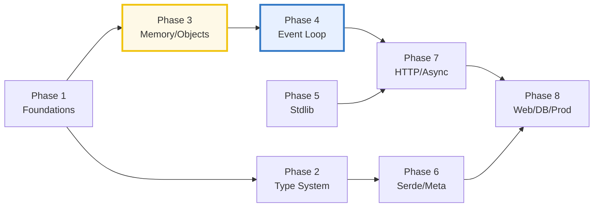

# TODO.md — The TypeScript Expertise Curriculum (build checklist)

> **Goal:** a reader who walks every bundle start-to-finish becomes a
> **TypeScript/JavaScript expert** — fluent in the structural/erased type system
> and the value/reference semantics, the single-threaded event loop (V8 +
> libuv), the garbage collector, the standard library, and the production
> patterns built on top.
>
> **How bundles get built:** see [`HOW_TO_RESEARCH.md`](./HOW_TO_RESEARCH.md)
> (per-bundle workflow) and [`SUBAGENTS_GUIDE.md`](./SUBAGENTS_GUIDE.md)
> (delegation at scale). The orchestrator **never edits a bundle by hand** — each
> bundle is produced by a subagent (one worker per bundle, **max 4 per batch**),
> then passed through `just sweep` + `just typecheck`.
>
> Each bundle = `{name}.ts` (ground truth) + `{name}_output.txt` (captured
> stdout) + `{NAME}.md` (guide). No `.html`.
>
> **Cross-language siblings:** [`../go/`](../go/) · [`../rust/`](../rust/) ·
> [`../python/`](../python/). Phase 1 mirrors all three; the type-system and
> concurrency phases are designed for direct cross-comparison.

---

## Progress

| Phase | Theme | Member | Bundles | Status |
|---|---|---|---|---|
| 1 | Language Foundations | core | 8 | ✅ done (8/8, 460 checks) |
| 2 | Type System & Generics | core | 8 | ✅ done (8/8, 318 checks) |
| 3 | Memory & Object Semantics | core | 6 | ✅ done (6/6, 240 checks) |
| 4 | Concurrency & the Event Loop | core | 7 | ✅ done (7/7, 214 checks) |
| 5 | Standard Library Essentials | core | 7 | ✅ done (7/7, 282 checks) |
| 6 | Serialization, Validation & Metaprogramming | metaprog | 5 | ✅ done (5/5, 199 checks) |
| 7 | Async Runtime, HTTP & Realtime | web | 5 | ⬜ pending |
| 8 | Web, DB & Production | web + db | 6 | ⬜ pending |
| — | Companion walkthroughs | hono/drizzle/ioredis | 22 | ⬜ pending |
| | **Total** | | **52 + 22** | **43/52 built** |

> ### 🔖 RESUME POINT (coordinator handoff)
> **State:** Phases 1–3 ✅ done (committed `c8e7661`→`d4fa0c4`); Phase 4 ◑ — `event_loop`
> + `promises` done (commit `74ecd34`). Working tree clean. `pnpm exec tsc --noEmit -p
> core/tsconfig.json` exits 0; `just sweep` green.
> **Next batch (launch 4 parallel subagents):** `async_await`, `timers_io`,
> `concurrency_patterns`, `worker_threads` (all `core/`). Then `shared_memory_atomics`
> to finish Phase 4, then Phase 5 (7), 6 (5, add `metaprog/` + zod), 7 (5, add `web/`),
> 8 (6, add `web/`+hono, `db/`+drizzle), then the 22 walkthroughs (hono/drizzle/ioredis),
> then `ts/index.html` dashboard + root `TS →` pill.
> **How to build (unchanged):** read `HOW_TO_RESEARCH.md` + `SUBAGENTS_GUIDE.md`; copy
> the style anchor `core/values_types_coercion.ts` + `VALUES_TYPES_COERCION.md`; each
> bundle = `core/<stem>.ts` + `core/<stem>_output.txt` + **`<STEM>.md` at the ts/ ROOT**
> (NOT in core/). Verify: isolated `tsc` (the long strict command), `just out` twice for
> byte-identical determinism, mirror every `[check]` in the `.md`. The prior session's
> detailed per-bundle briefs are reconstructable from each Phase-4 list item below + the
> `SUBAGENTS_GUIDE.md` §2 worker-prompt template.

**Reading order is the phase order.** Each phase assumes the prior — Phase 3's
value/reference leans on Phase 1's primitives; Phase 4's event loop leans on
Phase 3's closures; Phase 6+ ecosystem leans on the whole core. Do not skip
ahead.

---

## Phase 1 — Language Foundations (8) · `core`

> **Goal:** rock-solid command of the language primitives. Every downstream
> concept (closures, prototypes, the event loop) rests on these.
> **Cross-language:** 1:1 with Go P1, Rust P1, Python P1.

- [ ] **1. `values_types_coercion`** — the 7 primitive types, `typeof` (and the
  `typeof null === "object"` lie), `==` vs `===`, truthiness/falsiness, `null`
  vs `undefined`, implicit coercion rules. *(Designated **style anchor** — ship
  first.)*
- [ ] **2. `strings_chars`** — `string` (immutable, UTF-16), code units vs code
  points, the emoji-breaks-`.length` surrogate-pair trap, template literals,
  `String` methods.
- [ ] **3. `arrays_tuples`** — `Array<T>`, tuple types, spread/rest, sparse
  arrays, `Array.isArray`, `length` mutation, the `sort()` default-lexicographic
  trap, typed arrays (`Uint8Array`).
- [ ] **4. `objects_records`** — object literals, `Record<K,V>`, property flags
  (`writable`/`enumerable`/`configurable`), computed keys, shallow vs deep,
  integer-like-key reordering.
- [ ] **5. `functions_closures`** — first-class functions, arrow vs `function`
  and the `this` binding, the `arguments` object, default params, closures
  (capture by reference).
- [ ] **6. `control_flow`** — `if`/`switch` (no automatic fallthrough), `for`/
  `for...of`/`for...in` (the key trap), labeled break/continue, nullish
  coalescing `??` and optional chaining `?.`.
- [ ] **7. `scope_hoisting`** — `var`/`let`/`const`, the temporal dead zone,
  hoisting, block vs function scope, the var-loop-capture bug (vs `let`'s
  per-iteration binding).
- [ ] **8. `errors_exceptions`** — `throw`/`try`/`catch`/`finally`, `Error` +
  `cause`, custom error classes, the `never` type, rethrowing, EAFP in JS.

---

## Phase 2 — Type System & Generics (8) · `core`

> **Goal:** mastery of TypeScript's structural, erased type system — its killer
> feature. *This is the layer that separates TS users from TS experts.*
> **Cross-language:** analog to Go P2 (interfaces), Rust P2 (traits/generics),
> Python type_hints.

- [ ] **9. `structural_typing`** — structural (duck) vs nominal typing, shape
  compatibility, excess property checks on literals, the brand-pattern to fake
  nominal, `satisfies`.
- [ ] **10. `unions_intersections`** — `|` (union) and `&` (intersection),
  literal types, discriminated unions (the tagged-union idiom ⟷ Rust enums),
  exhaustive `switch`.
- [ ] **11. `type_narrowing`** — `typeof`/`in`/`instanceof` guards,
  user-defined type predicates (`x is T`), `asserts x is T`, narrowing through
  control flow.
- [ ] **12. `interfaces_vs_aliases`** — `interface` vs `type`, declaration
  merging, `extends`/`implements`, when each wins (interface = open/mergeable,
  type = algebraic).
- [ ] **13. `generics`** — type parameters, constraints (`extends`), defaults,
  the **types are erased at runtime** truth (no reification; ⟷ Java, ≠ C#).
- [ ] **14. `mapped_conditional_types`** — `[K in keyof T]`, conditional
  `T extends U ? X : Y`, `infer`, template-literal types (`${A}${B}`). *Type-level
  computation — TS's "macro" power.*
- [ ] **15. `utility_types`** — `Partial`/`Required`/`Readonly`/`Pick`/`Omit`/
  `Record`/`ReturnType`/`Parameters`/`Awaited`, variance (in/out), implementing
  your own.
- [ ] **16. `type_assertions_unknown`** — `as`, `unknown` vs `any` vs `never`,
  `satisfies` vs `as`, type predicates vs assertions, the danger of `any`.

---

## Phase 3 — Memory & Object Semantics (6) · `core`

> **Goal:** see the machine beneath the language — value vs reference, the
> prototype chain, the GC. *This is where "expert" actually lives.*
> **Cross-language:** analog to Go P4 (memory/GC), Rust P3 (smart pointers),
> Python memory_model.

- [ ] **17. `value_vs_reference`** — primitives (copied) vs objects (shared
  reference), aliasing, the shared-mutability bug class, shallow vs deep clone,
  `structuredClone`. *(THE cross-compare: Go value/pointer ⟷ Rust ownership ⟷
  JS references.)*
- [ ] **18. `prototype_chain`** — `[[Prototype]]`, `Object.create`,
  `__proto__` vs `prototype`, property lookup walk, `Object.getPrototypeOf`,
  why `class` is sugar over this.
- [ ] **19. `classes_desugar`** — `class` syntax → constructor+prototype,
  `extends`/`super`, `static`, fields, `#private`, accessor, mixins.
- [ ] **20. `closures_capture`** — capture-by-reference (always, no `move`),
  the loop-var trap (var vs let), IIFE, module pattern, retention/leak traps.
- [ ] **21. `garbage_collection`** — V8 generational (Orinoco) GC, reachability,
  `WeakRef`/`FinalizationRegistry`, `WeakMap`/`WeakSet`, closure/timer/listener
  retention, `--expose-gc` demo.
- [ ] **22. `iterators_generators`** — the iterator protocol (`Symbol.iterator`),
  generators (`yield`/`yield*`), `for...of`, async iterators + `for await...of`.

---

## Phase 4 — Concurrency & the Event Loop (7) · `core`

> **Goal:** the defining JS constraint — single-threaded + an event loop.
> Mastery of microtask/macrotask, promises, and the parallelism escape hatches.
> **Cross-language:** THE cross-compare — Go goroutines ⟷ Rust threads+async ⟷
> Python GIL+asyncio ⟷ JS event loop.

- [x] **23. `event_loop`** — the call stack, task (macrotask) queue, microtask
  queue, `queueMicrotask`, why `Promise.then` runs before `setTimeout`, the
  Node.js (libuv) vs browser loop, starvation.
- [x] **24. `promises`** — Promise states (pending/fulfilled/rejected),
  `.then`/`.catch`/`.finally`, chaining, `Promise.all`/`race`/`allSettled`/`any`,
  unhandled rejections.
- [ ] **25. `async_await`** — `async`/`await`, desugar to promises, top-level
  await (ESM), error propagation, the serial-vs-parallel trap (`await` in a
  loop).
- [ ] **26. `timers_io`** — `setTimeout`/`setInterval`/`setImmediate` (Node),
  `process.nextTick`, I/O via libuv (the phase model), `AbortSignal.timeout`.
- [ ] **27. `concurrency_patterns`** — semaphores/pools (p-limit style),
  AbortController/AbortSignal cancellation (⟷ Go `context`), async queues,
  event emitters.
- [ ] **28. `worker_threads`** — `worker_threads` (Node) / Web Workers,
  `MessagePort`, `postMessage`, structured-clone transfer, when threads beat
  async.
- [ ] **29. `shared_memory_atomics`** — `SharedArrayBuffer`, `Atomics`
  (the ONLY real parallelism primitive), the JS memory model, `--harmony-sharedarraybuffer`.

---

## Phase 5 — Standard Library Essentials (7) · `core`

> **Goal:** fluent with the built-ins every real program leans on.
> **Cross-language:** near-identical to Go P5, Rust P5.

- [ ] **30. `json`** — `JSON.parse`/`stringify`, replacer/reviver, the
  `Date`/`Map`/`Set` non-serializability trap, `toJSON`, BigInt refusal.
- [ ] **31. `collections_deep`** — `Map`/`Set`/`WeakMap`/`WeakSet`, insertion
  order, equality (`SameValueZero`), performance vs object-as-map, `Object`/
  `Map` decision.
- [ ] **32. `regex`** — regex literals + flags, character classes, lookahead/
  lookbehind, named groups, the "no atomic/possessive" gap, backtracking
  catastrophe, `s` (`dotAll`), `d` (indices).
- [ ] **33. `date_time`** — `Date` pitfalls (0-indexed months, mutable, parser
  ambiguity, timezone), `Intl` formatting, `performance.now()` (monotonic-ish),
  the Temporal proposal preview.
- [ ] **34. `streams`** — web streams (`ReadableStream`/`WritableStream`/
  `TransformStream`), Node streams (the older model), backpressure, piping,
  async iteration.
- [ ] **35. `modules_packages`** — ESM vs CJS, `import`/`export`, dynamic
  `import()`, `package.json` `exports`/`imports`, `node_modules` resolution,
  `__esModule` interop.
- [ ] **36. `testing`** — `node:test` (or Vitest), assertions, mocks/stubs,
  fixtures, coverage, snapshot traps, the red→green discipline.

---

## Phase 6 — Serialization, Validation & Metaprogramming (5) · `metaprog`

> **Goal:** runtime shapes, validation, and the meta-programming power TS adds
> over JS. *Analog to Rust P6 (serde & macros), Python P2 (decorators).*
> **Deps:** add `metaprog/` member with `zod`, `reflect-metadata`.

- [ ] **37. `zod_validation`** [metaprog] — `z.object`, schemas, `parse` vs
  `safeParse`, `z.infer` (type-from-schema), transforms, refinements, error
  trees. *(⟷ Rust serde, Go struct-tag validation, Pydantic.)*
- [ ] **38. `decorators`** [metaprog] — TC39 stage-3 decorators
  (`@auto`, method/class/field), metadata, the legacy `experimentalDecorators`
  contrast, what desugars to.
- [ ] **39. `proxy_reflect`** [metaprog] — `Proxy` traps, `Reflect`, revocable
  proxies, the meta-programming power (validation/logging/virtualization).
  *(⟷ Rust macro_rules, Python metaclasses.)*
- [ ] **40. `serialization_advanced`** [metaprog] — class-transformer,
  `superjson` (Date/Map/Set round-trip), schema→zod generation, JSON Schema.
- [ ] **41. `build_tooling`** [metaprog] — `tsconfig` (strict, target, module
  resolution), `tsc` vs `tsx`/esbuild vs `tsup`, sourcemaps, `.d.ts`,
  declaration emit. *(⟷ Rust build.rs, Go ldflags.)*

---

## Phase 7 — Async Runtime, HTTP & Realtime (5) · `web`

> **Goal:** the production I/O layer — HTTP clients/servers, async patterns,
> realtime. *Analog to Rust P7 (Tokio), Go P6 (net/http).*
> **Deps:** add `web/` member with `ws` (undici ships with Node).

- [ ] **42. `fetch_http_client`** [web] — `fetch` (undici in Node), `Request`/
  `Response`/`Headers`, streaming bodies, `AbortController`/timeout, retries,
  redirects.
- [ ] **43. `node_http_server`** [web] — `node:http`, `IncomingMessage`/
  `ServerResponse`, routing by hand, streaming responses, `http2` basics.
- [ ] **44. `async_patterns`** [web] — concurrency pools, mutex-via-promise,
  `EventEmitter`, async iterables as streams, the producer/consumer backpressure
  pattern.
- [ ] **45. `websockets_sse`** [web] — `ws` (Node) / WebSockets (browser),
  Server-Sent Events, the framing/backpressure story, reconnection.
- [ ] **46. `observability`** [web] — structured logging (pino), OpenTelemetry
  JS traces, `AsyncLocalStorage` (the context-propagation primitive ⟷ Go
  context).

---

## Phase 8 — Web, DB & Production (6) · `web` + `db`

> **Goal:** ship production-grade APIs — REST, DB, auth, CLI, deploy, lint.
> *Analog to Go P6/P8, Rust P8, Python P7/P8.*
> **Deps:** add `web/` `hono`; add `db/` `better-sqlite3` + `drizzle-orm`.

- [ ] **47. `rest_api`** [web] — Hono (or Express/Fastify) routing, middleware
  composition, the listener lifecycle, graceful shutdown. *(⟷ Go
  middleware_routing, Rust axum, Python fastapi_routing.)*
- [ ] **48. `database_drivers`** [db] — raw `better-sqlite3`, then Drizzle ORM,
  schema/migrations, prepared statements, connection pooling, N+1.
  *(⟷ Go sqlx/gorm, Rust sqlx, Python SQLAlchemy.)*
- [ ] **49. `auth_sessions`** [db] — JWT issue/verify (`jose`), session cookies,
  bcrypt/argon2 hashing, `Secure`/`HttpOnly`/`SameSite`, OAuth/OIDC basics.
- [ ] **50. `cli_tooling`** [web] — `commander`/`yargs`/`clipanion`, subcommands,
  shell completion, prompts (`@inquirer/prompts`), progress/spinners.
- [ ] **51. `deployment`** [web] — Docker multi-stage (distroless Node),
  serverless/edge (Cloudflare Workers/Vercel), bundling for the edge, secrets.
- [ ] **52. `runtimes_node_bun_deno`** [core] — V8 vs JavaScriptCore vs V8+Deno,
  native TS stripping, startup cost, compat surface, when Bun/Deno win vs Node.
  *(The honest "expert payoff" on the runtime question.)*

---

## Companion walkthroughs (22) · `hono` / `drizzle` / `ioredis`

> **Goal:** deep, end-to-end notes on the three production pillars — the direct
> ecosystem mirror of Rust's `axum/`/`sqlx/`/`fred.rs/`. Built last, as a swarm.
> **Deps:** add `hono/` + `hono` (in web); `drizzle/` + `drizzle-orm`+`better-sqlite3`;
> `ioredis/` + `ioredis`.

### `hono/` (8) — the web framework ⟷ Rust axum ×7
- [ ] 01-hello-world · 02-routing-patterns · 03-context-helpers ·
  04-middleware · 05-error-handling · 06-context-storage-als ·
  07-streaming · 08-testing

### `drizzle/` (8) — the ORM ⟷ Rust sqlx ×10
- [ ] 01-schema-setup · 02-select-queries · 03-insert-update-delete ·
  04-relations · 05-migrations · 06-transactions · 07-rqb-query-builder ·
  08-type-safety

### `ioredis/` (6) — the Redis client ⟷ Rust fred.rs ×9
- [ ] 01-basic-client · 02-pipelines-batches · 03-pub-sub ·
  04-transactions-multi-exec · 05-cluster · 06-streams

---

## Cross-cutting 🔗 map (the expertise chain + cross-language)

Key cross-links workers should wire up:
- `value_vs_reference` (P3) ⟷ `closures_capture` (P3) ⟷ `garbage_collection`
  (P3) — **the reference→closure→retention→GC chain is the heart of "JS expert".**
- `event_loop` (P4) ⟷ `promises` (P4) ⟷ `async_await` (P4) — one async story.
- `structural_typing` (P2) ⟷ `type_narrowing` (P2) — the type system ↔ runtime
  guards link (types erased; narrowing is runtime).
- **Cross-language:** `event_loop` ⟷ `../go/GOROUTINES.md` ⟷ `../rust/ASYNC_BASICS.md`
  ⟷ `../python/ASYNCIO_BASICS.md`; `value_vs_reference` ⟷ `../go/POINTERS.md`
  ⟷ `../rust/OWNERSHIP.md` ⟷ `../python/MEMORY_MODEL.md`; `generics` ⟷
  `../go/GENERICS.md` ⟷ `../rust/GENERICS.md`.

---

## How to run a phase (orchestrator recipe)

For each phase:
1. **Confirm deps:** add the phase's member dir + `package.json` + `tsconfig.json`
   + deps; append to `pnpm-workspace.yaml`; `pnpm install`. (`core/` is ready now.)
2. **Write briefs:** fill the `SUBAGENTS_GUIDE.md` §2 template for each bundle in
   the phase (5 min each).
3. **Launch the swarm:** one `Task` worker per bundle, up to **4 per batch**
   (disjoint file ownership = safe parallelism). For Phase 1, ship
   `values_types_coercion` first as the style anchor, then launch the rest
   against it.
4. **Verify:** run `just sweep` + `just typecheck`; spot-check 2–3 `.md` callouts
   against `_output.txt`.
5. **Re-spawn** any failures; tick the boxes above; update the Progress table.
