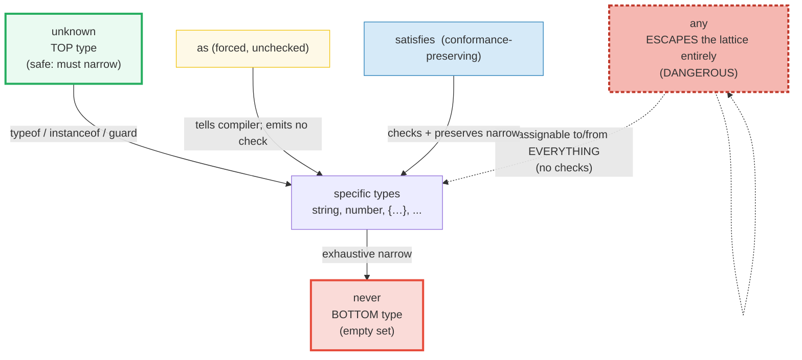
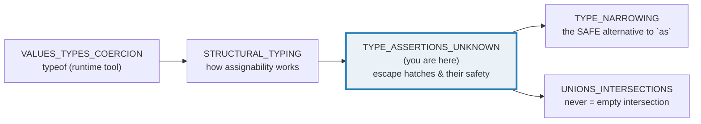

# TYPE_ASSERTIONS_UNKNOWN — `as`, `any`, `unknown`, `satisfies`, `as const` & `never`

> **Goal (one line):** show, by `check()`'d runtime behavior AND `tsc`-verified
> `expectType<>`/`@ts-expect-error` compile-time proofs, the four ways to relate
> a value to a type the compiler can't (or won't) infer — and their wildly
> different **safety profiles**: `as` (forced, **unchecked**, can *lie*), `any`
> (the type-system **off switch**), `unknown` (the **top** type — safe because
> you *must* narrow), `satisfies`/`as const` (the modern,
> conformance-preserving choices) — plus `never`, the **bottom** type.
>
> **Run:** `just run type_assertions_unknown`
>
> **Ground truth:**
> [`type_assertions_unknown.ts`](./core/type_assertions_unknown.ts) → captured
> stdout in
> [`type_assertions_unknown_output.txt`](./core/type_assertions_unknown_output.txt).
> Every table/line below is pasted **verbatim** from that file under a
> `> From type_assertions_unknown.ts Section X:` callout. Nothing is
> hand-computed.
>
> **Prerequisites:**
> - 🔗 [`VALUES_TYPES_COERCION`](./VALUES_TYPES_COERCION.md) — `typeof` is the
>   *runtime* narrowing tool this bundle leans on (`typeof x === "string"`); that
>   bundle pins `typeof`'s 8 return values (incl. the `typeof null` lie reused in
>   Section C).
> - 🔗 [`STRUCTURAL_TYPING`](./STRUCTURAL_TYPING.md) — *how* the compiler decides
>   "is X assignable to Y" (by shape). This bundle is about what you reach for
>   when the answer the compiler gives is *not* the one you know to be true.

---

## 1. Why this bundle exists (lineage)

TypeScript adds a **static** type system on top of JavaScript's **runtime**.
That static layer — `interface`, `type`, annotations, generics, and the
assertion operators in this bundle — is **erased at runtime** by
`tsx`/`esbuild`/`tsc --noEmit`: it emits no code and leaves no trace. So
`as`, `satisfies`, and `as const` are **compile-only**: they change the
*compiler's view* of a value but emit zero runtime checks. The only type
information that survives to runtime is what the **runtime operators**
`typeof`/`instanceof` and **user-defined type guards** can see.

That erasure is the whole story of this bundle. There are four escape hatches
you reach for when the compiler cannot or will not infer the type you know to be
true, and they have **wildly different safety profiles**:

| Operator | What it does | Runtime check? | Safety |
|---|---|---|---|
| `expr as T` | **Tells** the compiler "this is T" | **None** (erased) | Can **lie** — runtime value unchanged |
| `any` | Opts **out** of all checking | None | **Dangerous** — silences errors AND defeats safety |
| `unknown` | The **top** type (accepts any value) | Forces you to **narrow** | **Safe** — unusable until proven |
| `expr satisfies T` | **Checks** conformance, **preserves** narrow type | None (erased) | **Safe & precise** (TS 4.9) |
| `expr as const` | Asserts the **narrowest** literal/readonly type | None (erased) | Safe (type-only) |

The **expert rule** this bundle pins (Section E): **prefer `unknown` +
narrowing over `any`; prefer `satisfies` over `as`; prefer a type *predicate*
(`x is T`) over `as T`** — because a predicate narrows via a *real runtime
check* the compiler can see, while `as` is an unchecked promise.



### Sibling cross-references

- 🔗 [`STRUCTURAL_TYPING`](./STRUCTURAL_TYPING.md) §B — has the canonical
  `satisfies` palette example (per-key union preservation). This bundle adds the
  **annotation-widening** contrast and the assertion-safety taxonomy; read both.
- 🔗 [`TYPE_NARROWING`](./TYPE_NARROWING.md) — **the safe alternative to
  assertions.** A type predicate `x is T` narrows via a runtime check; this
  bundle's Section E shows it replacing `as`. `typeof`/`in`/`instanceof`
  narrowing is the bridge between TS's erased types and JS's runtime.
- 🔗 [`UNIONS_INTERSECTIONS`](./UNIONS_INTERSECTIONS.md) §C — `string & number`
  is `never` (the empty intersection); this bundle's Section E uses that fact.
  Unions are also what `as` most often narrows.
- 🔗 [`VALUES_TYPES_COERCION`](./VALUES_TYPES_COERCION.md) — `typeof` is the
  runtime narrowing operator (Section C leans on it); that bundle pins its 8
  return values including the `typeof null === "object"` lie reused here.
- 🔗 [`ERRORS_EXCEPTIONS`](./ERRORS_EXCEPTIONS.md) — a function returning
  `never` (Section E) *never* returns because it `throw`s; the throw/catch
  mechanics live there.



> 🔗 `../go/VALUES_TYPES_ZERO.md` — Go has **no `any` escape hatch**: a value of
> `interface{}` must be **type-asserted** (`v.(T)`) which *panics at runtime* if
> wrong (or `v, ok := v.(T)` for the safe two-value form). TS's `as` is the
> silent version — it never panics, it just *lies*. Go forces you to handle the
> failure; TS's `as` lets you pretend it cannot happen.
>
> 🔗 `../rust/OWNERSHIP.md` — Rust has **no type erasure**: `as` casts are
> **real numeric conversions** (`x as u32` emits a conversion instruction), not
> compiler promises, and downcasting a `dyn Trait` requires `Any` + `downcast`
> which **returns `Option`/`Result`** (you cannot lie). TS's `as` is uniquely
> dangerous because *nothing checks it*.

---

## 2. Section A — `as`: a forced assertion, UNCHECKED at runtime (it can LIE)

`expr as T` **tells** the compiler "trust me, this is T." It emits no runtime
check (it is erased like every other type construct), so the runtime value is
left **exactly** as it was. When you are right, `as` is a convenient narrowing
tool; when you are wrong, the compiler is silenced and the lie propagates.

**The overlap rule** (handbook "Type Assertions"): `as` is allowed **only**
between types that *overlap* (one is assignable to the other in some direction).
Asserting between **disjoint** types is a compile error — TS suspects you are
wrong. The **double-assertion escape hatch** (`as unknown as T`) routes through
`unknown` (which overlaps everything) to defeat the rule — and it is a loaded
footgun: it compiles even when the assertion is a flat lie.

> From `type_assertions_unknown.ts` Section A:
> ```
> const maybe: string | number = 42;
> const asNum = maybe as number;            -> OK (number overlaps string|number)
>   asNum = 42   (typeof number)
> [check] typeof asNum === number (union narrowed by `as`): OK
> [check] asNum === 42 at runtime (value unchanged by the assertion): OK
> ```
> ```
> THE OVERLAP RULE: `as` is allowed only between overlapping types.
>   123 as string   -> ERROR (number and string do not overlap)
>   123 as unknown as string -> COMPILES (the escape hatch; loaded footgun)
>   forced = 123   (typeof number — runtime value is a NUMBER)
> [check] TS believes forced === string (the escape hatch lied): OK
> [check] typeof forced === "number" at runtime (escape hatch does NOT change the value): OK
> ```

**THE LIE — the payoff of type erasure.** An assertion changes the
**compile-time** type but emits **no runtime check**, so the runtime value
passes through unchanged. Here a function promises `number`, the caller passes
a string (e.g. from an untyped source like `JSON.parse` or a foreign boundary),
and `as number` inside silences the compiler. The result: TS is *certain* it is
a `number`; V8 is holding a `"string"`:

> From `type_assertions_unknown.ts` Section A:
> ```
> THE LIE (a realistic function boundary):
>   function asNumber(x: unknown): number { return x as number; }
>   const liedTo = asNumber("hello");
>     TS type of liedTo : number   (the compiler TRUSTS the assertion)
>     runtime typeof     : string   (THE LIE — runtime value unchanged)
> [check] TS believes liedTo === number (compile-time view): OK
> [check] typeof liedTo === "string" at runtime (the assertion LIED — value untouched): OK
> ```

**Read the two `[check]`s as a single proof.** `expectType<Equal<typeof liedTo,
number>>` compiles (so `tsc` *believes* `liedTo` is a `number`); the very next
`check('typeof liedTo === "string"')` passes at runtime (so V8 *knows* it is a
`"string"`). **That gap is the danger of `as`: a promise the compiler cannot
verify and the runtime cannot enforce.** The `@ts-expect-error` on the disjoint
`123 as string` proves the overlap rule is real (tsc fails the build if the
suppressed error ever disappears).

---

## 3. Section B — `any`: opts out of ALL checking (the danger)

`any` is the type-system **off switch**. A value typed `any` is assignable
**to** and **from** every type, with **no checks on either side**. The compiler
treats it as "I promise this is fine" — and silently drops all safety,
including autocompletion. The result is code that **compiles** but **throws** at
runtime. This section deliberately writes the `any` token to *show* the danger;
the rest of the bundle (and the house rule) forbids `any` — `unknown` (§C) is
the safe replacement.

> From `type_assertions_unknown.ts` Section B:
> ```
> let danger: any = 1;                       // a number, typed any (the off switch)
> danger.toUpperCase();                       // COMPILES (any allows it), then:
>   runtime -> threw TypeError   (number has no .toUpperCase)
> [check] any: danger.toUpperCase() threw at runtime (compiler was silenced): OK
> [check] any throw is a TypeError: OK
> [check] runtime typeof danger === "number" (the real value underneath any): OK
> ```
> ```
> const leaked: string = danger;             // COMPILES, but at runtime:
>   typeof leaked === number   (a number sitting in a string slot)
> [check] TS believes leaked === string (any leaked through): OK
> [check] typeof leaked === "number" at runtime (a number in a string-typed slot): OK
> ```

**Two dangers, pinned by `check()`.** First, `any` **silences** the compiler:
`danger.toUpperCase()` on a number makes no sense, but `any` suppresses the
error, so it *compiles* — then V8 throws a `TypeError` because numbers have no
`.toUpperCase`. Second, `any` is **contagious in both directions**: assigning
`danger` (a number typed `any`) to a `string` slot *compiles*, and at runtime
the slot holds a `number`. `expectType<Equal<typeof leaked, string>>` proves
`tsc` *believes* `leaked` is `string` while the runtime `check` proves it is a
`number`. **`any` leaks invalid values silently through the entire type
system.**

> 🔗 `VALUES_TYPES_COERCION` — note that `any` is *not* a coercion: no
> `ToPrimitive`/`ToNumber` runs. The number `1` is not *converted* to a string;
> it sits, unconverted, in a slot the compiler *thinks* is a string. That is
> worse than coercion — coercion at least produces a value of the right runtime
> type. `any` produces a type *mismatch* the compiler cannot see.

---

## 4. Section C — `unknown`: the safe TOP type (you MUST narrow)

`unknown` is the **top type**: *every* value is assignable **to** `unknown`,
but *nothing* is usable **through** `unknown` without first narrowing. It is the
type-safe replacement for `any` — the same "I don't know the type yet" intent
(e.g. the output of `JSON.parse` or a value from a foreign boundary), but the
compiler **refuses** to let you touch the value until you have *proven* (via a
runtime check) what it is.

> From `type_assertions_unknown.ts` Section C:
> ```
> unknown accepts ANY value (everything assignable TO the top type):
>   const u1: unknown = 1;        // number
>   const u2: unknown = "hello";  // string
>   const u3: unknown = { a: 1 }; // object
>   const u4: unknown = [1,2,3];  // object
>   const u5: unknown = null;     // object
> [check] unknown accepts number: OK
> [check] unknown accepts string: OK
> [check] unknown accepts object: OK
> [check] unknown accepts array (typeof object): OK
> [check] unknown accepts null (typeof object — the lie): OK
> ```
> ```
> Through unknown, NOTHING is usable without narrowing:
>   u2.toUpperCase();  -> COMPILE ERROR (Object is of type 'unknown')
>   if (typeof u2 === 'string') u2.toUpperCase();  -> OK after narrowing
>   narrowed result: "HELLO"
> [check] unknown narrowed via typeof: u2.toUpperCase() === 'HELLO' after the check: OK
> ```

**The `@ts-expect-error` on `u2.toUpperCase()` is the whole point.** Compare
with Section B: `any` allowed `.toUpperCase()` to *compile* (and throw);
`unknown` stops you at **compile time**, *before any code runs*. After a
`typeof` check, TS narrows `unknown` to the checked type along that branch
(🔗 `TYPE_NARROWING`), so `u2.toUpperCase()` is safe inside the `if`. The
runtime `typeof` operator is doing double duty: it is the *runtime* narrowing
*and* the *compile-time* type guard.

**`unknown` vs `any` — the contrast, side by side.** Same intent ("untyped
boundary"), opposite safety:

> From `type_assertions_unknown.ts` Section C:
> ```
> unknown vs any — the contrast (same intent, opposite safety):
>                    any                          unknown
>   assign TO it:    any value (1,'x',{})         any value (1,'x',{})   [same]
>   read FROM it:    ANY operation COMPILES      NOTHING compiles until narrowed
>   assign FROM it:  assignable to any type      assignable ONLY to unknown/any
> [check] a value typed any, read as unknown, is unknown: OK
> [check] unknown is a safe SINK for any-typed values (no info lost, no use allowed): OK
> ```

The asymmetry is the design: `any` is assignable **from** any type *and*
**to** any type (both directions unchecked — the contagion); `unknown` is
assignable **from** any type (it is the top type) but assignable **to** *only*
`unknown`/`any` (you cannot smuggle an `unknown` into a `string` slot without
narrowing). That single restriction is what makes `unknown` safe where `any` is
dangerous.

---

## 5. Section D — `satisfies` + `as const`: preserve the narrow type (TS 4.9+)

Three ways to relate a value to a type (the expert taxonomy):

```typescript
const a = v as T;          // TELL the compiler v is T   (unchecked, can lie — §A)
const b: T = v;            // CHECK v conforms to T, WIDEN b's type to T
const c = v satisfies T;   // CHECK v conforms to T, PRESERVE c's narrow type
```

`satisfies` (TS 4.9) is the **modern safe choice**: it gives you a conformance
**check** (so typos/shape errors are caught) **without** throwing away the
precise per-property type the way an annotation would. The release notes put it
precisely: *"`satisfies` … validate[s] that the type of an expression matches
some type, **without changing the resulting type of that expression**."*

> From `type_assertions_unknown.ts` Section D:
> ```
> type Port = number | { host: string; port: number };
> type Config = { db: Port; cache: Port };
> const cfgSat = { db: 5432, cache: { host:'redis', port:6379 } } satisfies Config;
> const cfgAnn: Config = { db: 5432, cache: { host:'redis', port:6379 } };
>   typeof cfgSat.db    === number                       (satisfies: PRESERVED)
>   typeof cfgSat.cache === { host: string; port: number } (satisfies: PRESERVED)
>   typeof cfgAnn.db    === Port (the union)             (annotation: WIDENED)
>   typeof cfgAnn.cache === Port (the union)             (annotation: WIDENED)
> [check] satisfies preserves cfgSat.db === number: OK
> [check] satisfies preserves cfgSat.cache === { host: string; port: number }: OK
> [check] annotation widens cfgAnn.db === Port (the union): OK
> [check] annotation widens cfgAnn.cache === Port (the union): OK
> ```

All four type claims are pinned by `expectType<Equal<…>>` — `tsc` *fails the
build* if any is wrong. `satisfies` kept `cfgSat.db` as `number` and
`cfgSat.cache` as the object shape; the annotation *widened* both to the full
`Port` union.

**THE PAYOFF — the narrowing you avoid downstream.** Because `satisfies`
preserved `cfgSat.db` as `number`, you can use it **directly**. `cfgAnn.db` was
widened to `Port` (`number | { host; port }`), so the *same* `.toFixed()` access
is a **compile error** until you narrow. The `@ts-expect-error` proves it:

> From `type_assertions_unknown.ts` Section D:
> ```
> THE PAYOFF — satisfies keeps downstream usage type-safe:
>   const dbPortDirect: number = cfgSat.db;   -> OK (cfgSat.db === number)
>   cfgAnn.db.toFixed();                      -> ERROR (cfgAnn.db === Port, must narrow)
> [check] satisfies: cfgSat.db usable directly as number (=== 5432): OK
> [check] satisfies emits no code: cfgSat.db === cfgAnn.db === 5432 at runtime: OK
> [check] satisfies emits no code: cfgSat.cache.port === cfgAnn cache port === 6379: OK
> ```

**`satisfies` emits NO code** (it is a pure typecheck-time operator): the two
objects are byte-identical at runtime — `cfgSat.db === cfgAnn.db === 5432`. The
difference is *only* in what the compiler lets you do without narrowing.

> 🔗 `STRUCTURAL_TYPING` §B — the canonical `satisfies` example uses a palette
> whose values are a `string | [r,g,b]` union; `satisfies` keeps each entry's
> specific type so `palette.red[0]` needs no narrowing. This bundle's
> `Config`/`Port` example makes the **annotation-widening** contrast explicit.

**`as const` — assert the narrowest literal/readonly type.** `expr as const`
makes every literal as narrow as possible AND every property `readonly`. On an
array it produces a readonly **tuple** of literals; on an object it produces a
fully-`readonly` object of literal types. Like `as` and `satisfies`, it emits
**no runtime code**:

> From `type_assertions_unknown.ts` Section D:
> ```
> as const — assert the narrowest literal/readonly type:
>   const tuple = [1, 2] as const;            -> typeof tuple === readonly [1, 2]
>   const obj = { kind: "ok", code: 200 } as const;  -> { readonly kind: "ok"; readonly code: 200 }
> [check] as const: [1, 2] -> readonly [1, 2]: OK
> [check] as const: object -> { readonly kind: "ok"; readonly code: 200 }: OK
>   as const is TYPE-ONLY — it does NOT Object.freeze at runtime.
>   Object.isFrozen(tuple) === false   (readonly type, mutable value)
> [check] as const is type-only: tuple is NOT frozen at runtime: OK
> [check] as const runtime values unchanged: tuple[0] === 1, tuple[1] === 2: OK
> ```

**The expert trap: `readonly` (the *type*) ≠ frozen (the *runtime*).** `as const`
makes the type `readonly [1, 2]`, so the compiler rejects `tuple.push(3)` — but
it does **not** call `Object.freeze`, so at runtime the array is still a mutable
plain array (`Object.isFrozen(tuple) === false`). If a *real* runtime guarantee
is required, pair `as const` with `Object.freeze(...)`. This is the same
type-vs-runtime split that lets `as` lie: the type says one thing, the runtime
value is another.

---

## 6. Section E — `never` (the BOTTOM type) + THE RULE: prefer a guard over `as`

`never` is the **bottom type** — the **empty set** of values. No value has type
`never`. It is the dual of `unknown` (the top type, which holds *every* value).
It arises in three places, each useful:

1. **The return type of a function that never returns** (it `throw`s or loops
   forever). Because there is no value of type `never`, `never` is assignable to
   *every* type (the empty set fits anywhere) — so `return fail(...)` typechecks
   inside any function regardless of its return type.
2. **The empty intersection** — `string & number` is `never` (no value is both).
3. **The unreachable branch of an exhaustive switch** — after every case is
   handled, the remaining value is `never`. This is the **exhaustiveness tool**.

> From `type_assertions_unknown.ts` Section E:
> ```
> (1) never-returning functions (throw or loop forever):
>   function fail(msg: string): never { throw new Error(msg); }
>   never is assignable to EVERY type (the empty set fits anywhere).
> [check] ReturnType<typeof fail> === never: OK
> ```
> ```
> (2) The empty intersection:
>   type EmptyIntersection = string & number;   -> never (no value is both)
> [check] string & number === never (empty intersection): OK
> ```

**Exhaustiveness via `never`.** After both arms of the `Result` discriminated
union return, the `default` branch sees `r` as `never`. Routing it through
`fail(r)` (which takes `never` and returns `never`, assignable to `string`) both
documents unreachability and **enforces exhaustiveness at compile time**: add a
union member without a case and `r` stops being `never`, so `fail(r)` becomes a
compile error. This is the JS/TS analog of Rust's exhaustive `match`:

> From `type_assertions_unknown.ts` Section E:
> ```
> (3) Exhaustive switch (never is the exhaustiveness tool):
>   type Result = { ok: true; value: number } | { ok: false; error: string };
>   function handle(r: Result): string {
>     switch (r.ok) {
>       case true:  return `value=${r.value}`;
>       case false: return `error=${r.error}`;
>       default:    return fail(`unexpected: ${r}`);  // r is never here
>     }
>   }
>   handle({ ok: true, value: 7 })       -> "value=7"
>   handle({ ok: false, error: "boom" }) -> "error=boom"
> [check] never exhaustiveness: handle({ok:true,value:7}) === "value=7": OK
> [check] never exhaustiveness: handle({ok:false,error:"boom"}) === "error=boom": OK
> ```

**THE RULE — the expert takeaway for the whole bundle.** Prefer `unknown` + a
runtime guard over `any`; prefer a type **predicate** (`x is T`) over `as T`. A
predicate narrows via a **real runtime check** (🔗 `TYPE_NARROWING`), so it is
the **safe alternative to the unchecked `as`**:

> From `type_assertions_unknown.ts` Section E:
> ```
> (4) THE RULE — prefer a type PREDICATE over `as`:
>   function isNumberGuard(x: unknown): x is number { return typeof x === 'number'; }
>   function safeDouble(x: unknown): number {
>     if (isNumberGuard(x)) return x * 2;   // SAFE: narrowed by a runtime check
>     throw new TypeError(`expected number, got ${typeof x}`);
>   }
>   // Contrast: `return (x as number) * 2;` would COMPILE for any value and LIE.
>   safeDouble(21) -> 42   (predicate narrowed x to number)
> [check] type predicate (safe alt to `as`): safeDouble(21) === 42: OK
> [check] isNumberGuard accepts unknown (the safe top type): OK
> [check] unknown is the TOP type, never is the BOTTOM type (this bundle's spine): OK
> ```

The predicate's body is an ordinary `typeof` check; the **`x is number` return
type annotation** is what makes TS narrow the caller's argument in the true
branch. Contrast `safeDouble` with `asNumber` from Section A: both accept
`unknown` and produce a `number`, but `safeDouble` *verifies* at runtime (and
`throw`s if wrong) while `asNumber` *asserts* (and lies if wrong). **Same
signature, opposite safety — that is the entire lesson of this bundle.**

---

## 7. Pitfalls (the expert payoff)

| Trap | Symptom | Fix |
|---|---|---|
| `x as T` lies | Compiles; runtime value is the wrong type; crash far from the cause | Narrow with a runtime check (`typeof`/`in`/`instanceof`/a predicate) instead. Reserve `as` for when you have *checked* but the compiler can't see it. |
| `as unknown as T` to defeat the overlap rule | The disjoint-types error is silenced; any lie now compiles | Almost always a bug. If you genuinely need it, narrow through `unknown` with a real check, not a double assertion. |
| `any` from `JSON.parse` / foreign boundary | `.foo.bar` compiles; `TypeError: Cannot read properties of undefined` at runtime | Type the boundary as `unknown` and narrow (or validate with a schema like `zod`). Never let `any` propagate. |
| `let x: any` to "make the error go away" | The error is silenced, not fixed; `any` is contagious (assigns to/from everything) | Use `unknown` + a guard. `any` disables checking in **both** directions. |
| `unknown` value used without narrowing | Compile error "Object is of type 'unknown'" | That error *is* the safety. Narrow with `typeof`/`in`/a predicate before use. |
| `satisfies` expected to narrow at runtime | Expecting `Object.freeze`-like runtime behavior | `satisfies` is **type-only** (emits no code). It checks conformance + preserves the type; nothing happens at runtime. |
| `as const` mistaken for `Object.freeze` | Code mutates a "readonly" array/object at runtime | `as const` is type-only (`Object.isFrozen(x) === false`). Pair with `Object.freeze(...)` for a runtime guarantee. |
| Annotation widens away a narrow type | `const c: Config = {...}` makes every property the declared (union) type; downstream `.foo` needs narrowing | Use `const c = {...} satisfies Config` to *check* conformance while *preserving* the narrow per-property type. |
| `as` to narrow a discriminated union | Compiles but skips the runtime discriminant check; wrong arm selected | Use the discriminant (`if (s.kind === "circle")`) — TS narrows for free, no assertion. See 🔗 `TYPE_NARROWING`. |
| Non-exhaustive `switch` on a union | Missing case silently falls through; no compile error | Add a `default: return assertNever(x)` sink — the `never` parameter errors if a case is missing. (Section E.) |
| `never` confused with `void`/`undefined` | Expecting a `never`-returning function to produce a value | `never` = *never returns* (throws/loops). `void` = returns but caller ignores it. `undefined` = returns the `undefined` value. |
| `any` defeats autocompletion/tooling | No IntelliSense on `any`-typed values | `unknown`/a precise type restores tooling; `any` erases it along with the checks. |

---

## 8. Cheat sheet

```typescript
// === The four escape hatches (and their safety profiles) ===================
//   expr as T          TELL the compiler; NO runtime check; can LIE.   (unsafe)
//   any                opt OUT of all checking (both directions).      (DANGER)
//   unknown            TOP type; accepts any value, unusable til narrowed. (safe)
//   expr satisfies T   CHECK conformance, PRESERVE narrow type. (TS 4.9) (safe)
//   expr as const      narrowest literal/readonly type. TYPE-ONLY.      (safe)

// === as — forced, unchecked assertion ======================================
//   const n = (x as number);            // OK if number overlaps x's type
//   OVERLAP RULE: 123 as string         // ERROR (number/string don't overlap)
//   ESCAPE HATCH: 123 as unknown as T   // compiles (unknown overlaps all) — footgun
//   THE LIE: typeof (asNumber("hi")) === "string"  even though tsc says number
//   => prefer a runtime check / predicate over `as`.

// === any — the off switch (avoid) ==========================================
//   let x: any = 1; x.toUpperCase();    // COMPILES, THROWS at runtime
//   const s: string = x;                // COMPILES, s is a number at runtime
//   any is CONTAGIOUS: assignable to/from EVERY type; defeats tooling + checks.

// === unknown — the safe top type ===========================================
//   const u: unknown = JSON.parse(s);   // accepts any value
//   u.toUpperCase();                    // COMPILE ERROR — must narrow first
//   if (typeof u === "string") u.toUpperCase();   // OK after narrowing
//   unknown assignable TO: everything. FROM: only unknown/any. (the asymmetry)

// === satisfies (TS 4.9) — check + preserve ================================
//   const c = { db: 5432 } satisfies Config;   // checked; typeof c.db === number
//   const c: Config = { db: 5432 };            // checked; typeof c.db === Port (WIDENED)
//   satisfies emits NO code — pure typecheck-time operator.

// === as const — narrowest literal/readonly ================================
//   [1, 2] as const          -> readonly [1, 2]                 (literal tuple)
//   { k: "ok" } as const     -> { readonly k: "ok" }            (literal + readonly)
//   TYPE-ONLY: Object.isFrozen([1,2] as const) === false.       (no runtime freeze)

// === never — the bottom type (empty set) ===================================
//   function fail(msg: string): never { throw new Error(msg); }   // never returns
//   never is assignable to EVERY type (empty set fits anywhere).
//   string & number === never                                     (empty intersection)
//   EXHAUSTIVENESS: switch default -> r is never; assertNever(r) catches missing cases.

// === THE RULE ==============================================================
//   PREFER unknown + a guard OVER any.
//   PREFER satisfies OVER as.
//   PREFER a type predicate (x is T) OVER as T.   // <- the safe narrowing
//   function isNum(x: unknown): x is number { return typeof x === "number"; }
```

---

## Sources

Every signature, return value, and behavioral claim above was verified against
the TypeScript Handbook and release notes, then corroborated by independent
secondary sources. Every type-level claim is *additionally* asserted by the
`.ts` itself — either `expectType<Equal<…>>` (tsc fails the build if the
equality is wrong) or `@ts-expect-error` (tsc fails if the suppressed error is
not real) — and every runtime claim is asserted by `check()` (throws on any
mismatch). The strongest possible verification: both the compiler's and the V8
engine's verdict.

- **TypeScript Handbook — Everyday Types → "Type Assertions"** (`as`, the
  `as unknown as T` form; that assertions are a *hint* to the compiler and emit
  no runtime check): https://www.typescriptlang.org/docs/handbook/2/everyday-types.html#type-assertions
- **TypeScript Handbook — Everyday Types → "`any`"** (the type-system escape
  hatch; *"Using `any` disables all further type checking"*; `noImplicitAny`):
  https://www.typescriptlang.org/docs/handbook/2/everyday-types.html#any
- **TypeScript Handbook — Narrowing** (the `unknown` top type as the narrowing
  target; `typeof`/`in`/`instanceof` narrowing — the safe runtime checks that
  replace assertions): https://www.typescriptlang.org/docs/handbook/2/narrowing.html
- **TypeScript Handbook — Narrowing → "Using type predicates"** (`x is T`, the
  *safe* runtime-checked alternative to `as`): https://www.typescriptlang.org/docs/handbook/2/narrowing.html#using-type-predicates
- **TypeScript Handbook — Narrowing → "the `never` type" / exhaustiveness**
  (the bottom type; `assertNever` for exhaustive checks):
  https://www.typescriptlang.org/docs/handbook/2/narrowing.html#exhaustiveness-checking
- **TypeScript Handbook — Everyday Types → "Type assertions / `as const`"
  & TS 4.9 "satisfies"** (literal-narrowing assertion; the conformance operator):
  https://www.typescriptlang.org/docs/handbook/2/everyday-types.html#type-assertions
- **Announcing TypeScript 4.9 → "The `satisfies` Operator"** (the verbatim
  definition: *"validate that the type of an expression matches some type,
  **without changing the resulting type of that expression**"*; the palette
  example): https://devblogs.microsoft.com/typescript/announcing-typescript-4-9/
- **TypeScript 4.9 Release Notes → "The satisfies Operator"**:
  https://www.typescriptlang.org/docs/handbook/release-notes/typescript-4-9.html
- **MDN — `typeof` operator** (the runtime narrowing tool this bundle leans on;
  the 8 return values incl. `typeof null === "object"`): https://developer.mozilla.org/en-US/docs/Web/JavaScript/Reference/Operators/typeof
- **MDN — `Object.isFrozen()`** (used to prove `as const` does *not* freeze at
  runtime): https://developer.mozilla.org/en-US/docs/Web/JavaScript/Reference/Global_Objects/Object/isFrozen
- **ECMAScript® 2027 Language Specification (tc39.es/ecma262)** — §6.1
  (ECMAScript language types; `undefined`/`null`/Object); §14 (`throw` /
  `TypeError` runtime semantics for Section B):
  https://tc39.es/ecma262/multipage/

**Secondary corroboration (independent of the Handbook, ≥1 per major claim):**
- **Total TypeScript — "Annotations and Assertions"** (the overlap rule; that
  `as unknown as T` removes the red squiggly but "doesn't mean the operation is
  safe"): https://www.totaltypescript.com/books/total-typescript-essentials/annotations-and-assertions
- **Google TypeScript Style Guide — "Type assertions and object literals"**
  (`as unknown as` to force an incompatible cast; "use `unknown` (instead of
  `any`) as the intermediate type"): https://google.github.io/styleguide/tsguide.html
- **Axel Rauschmayer (2ality) — "TypeScript: `satisfies` vs type
  annotations"** (the conformance-vs-widening distinction the bundle pins):
  https://2ality.com/2022/11/typescript-satisfies.html
- **Microsoft TypeScript Wiki — "Type Narrowing"** (the predicate
  `x is T` as the safe alternative to `as`):
  https://github.com/microsoft/TypeScript/wiki

**Facts that could not be verified by running** (documented, not executed):
the exact wording of the `as`-overlap compile error and the `unknown`-use
compile error are confirmed by the `@ts-expect-error` directives in the `.ts`
(tsc fails the build if either suppressed error is not real), and by the
isolated `tsc --noEmit` gate (exit 0). The TS-version-at-introduction of
`satisfies` (4.9, Nov 2022) and `as const` (3.4) are language-design facts
taken from the release notes. No behavioral claim above is unverified.
