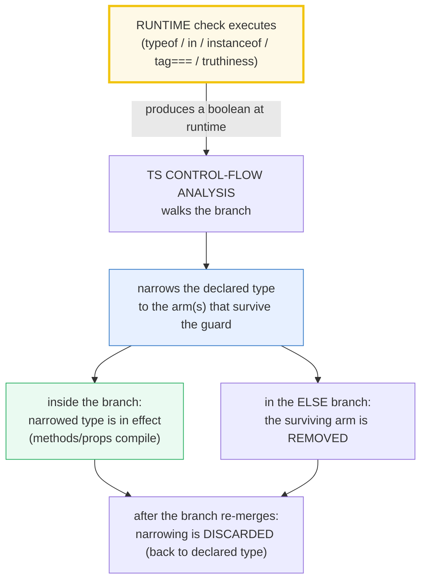

# TYPE_NARROWING — Refining a Type at Runtime via `typeof` / `in` / `instanceof` / Tags / Predicates

> **Goal (one line):** show, by `check()`'d runtime operator behavior AND
> tsc-verified `expectType<>`/`@ts-expect-error` compile-time proofs, how a
> RUNTIME check tells the COMPILER the value's type in the branch that follows —
> "narrowing", the bridge between TS's erased types and JS's runtime.
>
> **Run:** `just run type_narrowing`
>
> **Ground truth:** [`type_narrowing.ts`](./core/type_narrowing.ts) → captured
> stdout in [`type_narrowing_output.txt`](./core/type_narrowing_output.txt).
> Every number/table/check below is pasted **verbatim** from that file under a
> `> From type_narrowing.ts Section X:` callout. Nothing is hand-computed.
>
> **Prerequisites:**
> - [`VALUES_TYPES_COERCION`](./VALUES_TYPES_COERCION.md) — the `typeof` operator
>   and its `null` lie (P1). Narrowing *piggybacks* on that operator, so its
>   blind spots are inherited.
> - [`ERRORS_EXCEPTIONS`](./ERRORS_EXCEPTIONS.md) — `catch (e)` binds `unknown`
>   (P1); Section C here narrows it with `instanceof`.

---

## 1. Why this bundle exists (lineage)

TypeScript types are **erased at runtime** — `tsx`/`esbuild`/`tsc` strip every
`interface`, `type`, annotation, and generic, emitting **no runtime type
information**. So the static type system can only refine a value's type at a
point in the code if it can **piggyback on a construct that actually executes**:
`typeof`, `instanceof`, the `in` operator, a `===` against a literal "tag", a
truthiness test, an assignment, a `return`, or a `throw`. The process of
refining a declared type to a more specific one along the control flow is called
**narrowing**. It is *how TS achieves type safety without any runtime type info*.

> 🔗 [`UNIONS_INTERSECTIONS`](./UNIONS_INTERSECTIONS.md) (P2) — narrowing is, in
> practice, narrowing a **union** down to one arm. The discriminated-union tag
> narrowing in Section E is the canonical application.
>
> 🔗 [`STRUCTURAL_TYPING`](./STRUCTURAL_TYPING.md) (P2) — TS narrows by
> *structure* (a member is kept in a branch only if its shape survives the
> guard). `instanceof` is the rare *nominal* narrowing (it checks a class).
>
> 🔗 [`VALUES_TYPES_COERCION`](./VALUES_TYPES_COERCION.md) §2 (P1) — the `typeof`
> operator and the `typeof null === "object"` lie. Section A re-pins the two
> blind spots that make `typeof` useless for narrowing objects.
>
> 🔗 [`ERRORS_EXCEPTIONS`](./ERRORS_EXCEPTIONS.md) §D (P1) — `catch (e)` binds
> `unknown`; you MUST narrow before reading `.message`/`.cause`. Section C does
> exactly that with `instanceof`.



**The headline cross-language contrast:** narrowing is the JS/TS analog of
pattern matching in statically-typed languages — but with one crucial asymmetry:

> 🔗 `../rust/PATTERN_MATCHING.md` — Rust's `match` narrows by **destructuring**
> and the compiler enforces **exhaustiveness** at compile time (a non-exhaustive
> `match` is a hard error). TS's narrowing is **opt-in** (you write the guards)
> and exhaustiveness is *you* assigning to `never` (Section E) — a convention,
> not a language guarantee.
>
> 🔗 `../python` — Python 3.10 `match`/`case` narrows by structural patterns
> (`case Point(x=0, y=y):`), mirroring TS's `in` and tag narrowing but at
> runtime with no static guarantee.

---

## 2. Two axes of evidence (this bundle's specialty)

Because narrowing is driven by *runtime* checks but observed by the *compiler*,
every claim here is witnessed **twice**:

- **`check()`** — a **runtime** invariant of the *operator* (e.g. `typeof null
  === "object"`, the prototype chain `instanceof` walks, `"x" in null` throws).
- **`expectType<Equal<typeof x, T>>`** — a **compile-time** witness of the
  *narrowed type* at a point. The helper (in the `.ts`) is:

  ```typescript
  type Equal<A, B> =
    (<T>() => T extends A ? 1 : 2) extends (<T>() => T extends B ? 1 : 2) ? true : false;
  const expectType = <T extends true>(msg: T extends true ? string : never): void => {
    console.log(`[check] ${msg}: OK`);
  };
  ```

  If an `Equal<...>` claim resolves to `false`, **tsc fails** (`false` is not
  assignable to `true`) — so every narrowing claim is enforced by the compiler,
  not by hand. At runtime it prints the `[check]` line. (Verified: inside a
  narrowing branch, the type query `typeof x` yields the **narrowed** type of
  `x`, which is what makes `expectType<Equal<typeof x, T>>` a faithful witness.)
- **`@ts-expect-error`** — a **compile-time** witness of "this would error
  *without* narrowing"; each directive suppresses a **real** error (an unused
  directive is itself an error, so they are audited).

---

## 3. Section A — `typeof` narrowing + its blind spots (null/array) + `Array.isArray`

`typeof` returns one of 8 strings; TS treats `typeof x === "<lit>"` as a **type
guard** for the *primitive* arms. It has two famous blind spots (both inherited
from [`VALUES_TYPES_COERCION`](./VALUES_TYPES_COERCION.md) §2) that make it
useless for narrowing objects:

> From type_narrowing.ts Section A:
> ```
> typeof's blind spots (why typeof alone can't narrow objects):
>   typeof null   = object    <- THE LIE: null is a primitive
>   typeof []     = object    <- arrays report "object"
>   typeof {}     = object
>   typeof "a"    = string
>   typeof 1      = number
> [check] typeof null === "object" (THE LIE — typeof CANNOT narrow null): OK
> [check] typeof [] === "object" (typeof CANNOT tell array from object): OK
> [check] typeof {} === "object": OK
> [check] Array.isArray([]) === true (the realm-safe array test): OK
> [check] Array.isArray({}) === false: OK
> [check] Array.isArray(null) === false: OK
> ```

**The fixes.** For **null**, use `x === null` (typeof is useless). For
**arrays**, use `Array.isArray(x)` — the *only* reliable, **realm-safe** way to
narrow `T | T[]`. Per MDN `instanceof`, `[] instanceof Array` can be `false` for
arrays from a different realm (frame/worker), because each realm has its own
`Array.prototype`; `Array.isArray` checks the internal `[[Class]]` and never
lies. **`typeof` narrows the primitive arms of a union, symmetrically** (the
else branch narrows to what's left):

> From type_narrowing.ts Section A:
> ```
> typeof narrows the PRIMITIVE arms of a union (live expectType):
> [check] typeof === "string" narrows string|number -> string: OK
>   classify("hi") = HI
> [check] after the string arm is removed, union -> number: OK
>   classify(42)   = 42
> ```
> ```
> Array.isArray narrows T | T[] (live expectType):
> [check] Array.isArray narrows string|string[] -> string[]: OK
>   firstOrIt(["a","b"]) = a
> [check] else branch narrows -> string (the T arm): OK
>   firstOrIt("solo")    = solo
> ```

**The narrowing blind spot (the typeof-null lie, in narrowing form).**
`typeof x === "object"` does **not** remove `null` from a `T[] | null` union,
because `typeof null === "object"`. The `.ts` proves this at compile time
(`proof_typeofObjectKeepsNull`, tsc-verified, not run): inside the object
branch, iterating `strs: string[] | null` **still errors** "possibly null" —
exactly the TypeScript-handbook `printAll` example. You need a *separate*
`strs !== null` (or truthiness) check. The companion `@ts-expect-error` proofs
(`proof_noGuardErrors`, `proof_cantWidenBeyondDeclared`) similarly witness that a
union-only method access errors without a guard, and that an assignment can
narrow but never **widen beyond the declared type**.

---

## 4. Section B — truthiness + equality + the `in` operator narrowing

**Truthiness narrowing.** `if (x)` removes the falsy arms from the type. For
`string | null | undefined`, after `if (x)` the type collapses to `string`
(null, undefined, and the empty string `""` are all removed; `""` is a string
anyway). Caveat ([`VALUES_TYPES_COERCION`](./VALUES_TYPES_COERCION.md) §4): this
*also* removes `""`, which may hide a legitimate empty-string case — prefer an
explicit `x !== null` when you mean nullish.

> From type_narrowing.ts Section B:
> ```
> Truthiness narrows out the falsy arms:
> [check] if(name) narrows string|null|undefined -> string: OK
>   greet("Pat") = hi PAT
>   greet(null) = hi stranger
> ```

**Equality narrowing.** `===`, `!==`, and the looser `==`/`!=` all narrow. The
expert payoff is the **nullish idiom**: `x == null` / `x != null` remove **both**
`null` *and* `undefined` in one check (TS encodes the spec's abstract-equality
bridge — see [`VALUES_TYPES_COERCION`](./VALUES_TYPES_COERCION.md) §3). It is the
idiomatic "is this nullish?" test; everything else, use `===`.

> From type_narrowing.ts Section B:
> ```
> Equality narrows on === , !== , and == (the nullish idiom):
> [check] c.value != null narrows -> number (both nulls out): OK
>   doubled({value:21})      = 42
>   doubled({value:null})    = -1
>   doubled({value:undefined}) = -1
> [check] == null / != null remove both null and undefined (the nullish idiom): OK
> ```

**The `in` operator narrowing.** `"swim" in animal` narrows to the union members
that **have** (a required *or optional*) property/method named `swim`. At
**runtime** (MDN `in`), `in` searches the own keys **and the prototype chain**,
and **throws `TypeError`** if the RHS is not an object (e.g. `null`/`undefined`).
TS forbids the static `"x" in null` (RHS must be an object type), so the `.ts`
routes a null through an `object`-typed slot (double assertion, *not* `any`) to
probe the real runtime behavior the type system deliberately can't express:

> From type_narrowing.ts Section B:
> ```
> The `in` operator narrows on a property/method name:
> [check] "swim" in animal narrows Fish|Bird -> Fish: OK
>   "swim" in fish  = true    -> swimming
> [check] else branch -> Bird (Fish removed): OK
>   "swim" in bird  = false   -> flying
> [check] "swim" in fish === true (in searches own keys): OK
> [check] "swim" in bird === false: OK
> [check] "in" finds inherited (prototype-chain) properties: OK
> [check] "x" in null throws TypeError (RHS must be an object): OK
> ```

> **Optional-property subtlety** (from the TS handbook): if a union member has
> the checked property as **optional** (`swim?: () => void`), that member
> survives in **both** branches of the `in` check — because "having an optional
> property" is compatible with both the presence and absence the `in` test
> distinguishes.

---

## 5. Section C — `instanceof` narrowing (Date / Error / custom class) + catch-unknown

`instanceof` narrows to a **class**. It is the rare **nominal** narrowing in TS
(otherwise structural). At **runtime** (MDN `instanceof`): `x instanceof C`
tests whether `C.prototype` appears **anywhere** in `x`'s prototype chain — so a
subclass instance is `instanceof` of every ancestor, all the way up to `Object`.
Its behavior is customizable via `Symbol.hasInstance`.

> From type_narrowing.ts Section C:
> ```
> instanceof walks the prototype chain:
>   ve instanceof ValidationError = true
>   ve instanceof Error           = true
>   ve instanceof Object          = true
> [check] ve instanceof ValidationError (its own class): OK
> [check] ve instanceof Error (parent class — chain walk): OK
> [check] ve instanceof Object (chain reaches Object.prototype): OK
> ```
> ```
> instanceof Date narrows Date|string:
> [check] instanceof Date narrows Date|string -> Date: OK
>   label(new Date('2024-01-15')) = year 2024
> [check] else branch -> string: OK
>   label('hello')               = HELLO
> ```

**The catch-unknown pairing** (🔗 [`ERRORS_EXCEPTIONS`](./ERRORS_EXCEPTIONS.md)
§D). Since TS 4.4, `catch (e)` binds **`unknown`** — you MUST narrow before
reading `.message`/`.cause`. `instanceof` is the idiomatic way:

> From type_narrowing.ts Section C:
> ```
> catch (e) binds `unknown` — narrow with instanceof:
> [check] instanceof narrows catch(unknown) -> ValidationError: OK
>   caught class   = ValidationError
>   caught message = "bad input"
> [check] instanceof narrows catch-bound unknown to ValidationError: OK
> [check] narrowed catch binding exposes .message: OK
> ```
> ```
> instanceof is for objects (arrays/dates are objects):
> [check] [] instanceof Array === true: OK
> [check] [] instanceof Object === true (Array.prototype chain reaches Object): OK
> [check] new Date(0) instanceof Date === true: OK
> ```

**instanceof vs typeof for primitives.** `instanceof` is for **objects**. A
*primitive* string is **not** `instanceof String` (only `new String(...)` is) —
and `tsc` correctly forbids the static `"s" instanceof String` (the LHS must be
an object type), so that gotcha is documented in §9 rather than checked. Arrays
*are* objects (`[] instanceof Array` and `[] instanceof Object` are both `true`).

---

## 6. Section D — type predicates (`x is T`) + assertion functions (`asserts`) — THE payoff

When the built-in guards are not enough, you build your own. A **type predicate**
`paramName is Type` makes an ordinary boolean function into a reusable narrowing
guard: the body is a normal check; the **return-type annotation** is what
narrows the caller.

> From type_narrowing.ts Section D:
> ```
> User-defined type predicate `value is string` narrows the caller:
> [check] isString narrows unknown -> string: OK
>   describe("hi") = string of length 2
> [check] isNumber narrows unknown -> number: OK
>   describe(42)   = number 42
>   describe(true) = something else
> [check] isString is a correct guard for a string: OK
> [check] isString rejects a number: OK
> ```

A predicate narrows **both** branches (the if-branch → the asserted type; the
else-branch → the type with that arm **removed**), and it composes with
`Array.filter` to produce a typed result array:

> From type_narrowing.ts Section D:
> ```
> Predicate narrows BOTH branches (Fish kept / Fish removed):
> [check] isFish narrows Fish|Bird -> Fish: OK
>   act({swim}) = swim
> [check] else branch -> Bird (Fish removed): OK
>   act({fly})  = fly
> ```
> ```
> Predicate filters (Fish|Bird)[] -> Fish[]:
>   zoo.length=3  onlyFish.length=2
> [check] zoo.filter(isFish) is typed Fish[]: OK
> [check] filter(isFish) keeps the 2 Fish: OK
> ```

**Assertion functions: narrow OR throw.** `asserts value is T` is the *eager*
cousin of the predicate: if the function returns, the caller's value is narrowed
to `T` for the rest of the scope; otherwise it **throws**. `assertDefined<T>`
narrows to `NonNullable<T>` — the canonical null/undefined killer. `asserts
value` (no `is`) asserts truthiness and removes the falsy arms eagerly. These
pair with Node's `assert` module (which TS types as assertion functions).

> From type_narrowing.ts Section D:
> ```
> Assertion functions narrow OR throw:
> [check] assertString narrows unknown -> string for the rest: OK
>   useAsserts("hi") = HI
> [check] assertString(42) throws (narrow OR throw): OK
> ```
> ```
> assertDefined narrows to NonNullable<T>:
> [check] assertDefined narrows string|null -> NonNullable<string>=string: OK
>   useAssertDefined("hi") = HI
> [check] assertDefined(null) throws: OK
> ```
> ```
> asserts value (truthiness) narrows eagerly:
> [check] assertTruthy narrows (string|0|null) -> string: OK
>   useTruthy("ok") = ok
> [check] assertTruthy(0) throws (0 is falsy): OK
> ```

---

## 7. Section E — control-flow narrowing + discriminated unions + exhaustiveness

TS's **control-flow analysis** walks every reachable path, narrowing (and
re-widening) types as it goes. Three structural facts:

1. **Assignment re-narrows** a `let` to the assigned value's type — but you can
   **never widen beyond the declared type** (tsc-verified by
   `proof_cantWidenBeyondDeclared`).
2. **`return` / `throw` narrow the remainder** of the function: after
   `if (typeof x === "string") return;`, the code below has the string arm
   removed (because it's unreachable there).
3. **Narrowing is discarded when branches re-merge** — outside the `if`, the
   type reverts to the declared type.

> From type_narrowing.ts Section E:
> ```
> Assignment re-narrows (but never beyond the declared type):
> [check] x = 'hi' narrows -> string: OK
> [check] x = 42 re-narrows -> number: OK
>   assignmentFlow() = HI-42
> ```
> ```
> return / throw narrow the remainder (control-flow analysis):
>   afterReturn("hi") = HI
> [check] after the string-return, union -> number (string removed): OK
>   afterReturn(42)   = 42
> ```

**Discriminated unions** (🔗 [`UNIONS_INTERSECTIONS`](./UNIONS_INTERSECTIONS.md)).
When every member of a union shares a property whose type is a **unique literal**
(the "discriminant", here `kind`), a `===` or `switch` on that tag narrows to
the single matching member — and you can read that member's *own* properties
(`s.radius`, `s.side`) with no `!` assertions.

> From type_narrowing.ts Section E:
> ```
> Discriminated union: tag literal narrows to one member:
> [check] s.kind === "circle" narrows Shape -> Circle: OK
>   describe(circle r=3) = circle r=3
> [check] else branch -> Square: OK
>   describe(square s=4) = square side=4
> ```
> ```
> Discriminated union in a switch (each case auto-narrows):
> [check] case "circle" narrows -> Circle: OK
> [check] case "square" narrows -> Square: OK
>   area(circle r=2) = 12.566371  (PI * 4)
>   area(square s=3) = 9
> [check] area(circle r=2) = PI * 4: OK
> [check] area(square s=3) = 9: OK
> ```

**Exhaustiveness via `never`.** In the `default` branch of a switch that handles
every union member, `s` is narrowed to **`never`** (the bottom type — "no value
is possible here"). Assigning to a `never`-typed variable typechecks *while the
union is fully covered*; **add a new member and it stops typechecking** — the
compiler tells you a case is missing. (The throw-based variant lives in
[`ERRORS_EXCEPTIONS`](./ERRORS_EXCEPTIONS.md) §E via a `never`-returning `fail`.)

> From type_narrowing.ts Section E:
> ```
> Exhaustiveness via `never` (compile-time completeness alarm):
>   exhaustiveArea(circle r=2) = 12.566371
>   exhaustiveArea(square s=3) = 9
>   (add a `triangle` member and `const _exhaustive: never = s` errors ->
>    the compiler flags the unhandled case. See TYPE_NARROWING.md pitfalls.)
> [check] exhaustive default narrows Shape to never (tsc-verifiable): OK
> ```

```mermaid
graph LR
    U["declared type<br/>Shape = Circle | Square"] --> TAG{"switch (s.kind)"}
    TAG -->|"case \"circle\""| C["s narrowed to Circle<br/>s.radius compiles"]
    TAG -->|"case \"square\""| SQ["s narrowed to Square<br/>s.side compiles"]
    TAG -->|"default<br/>(all handled)"| N["s narrowed to never<br/>assigning to `never` OK"]
    TAG -.->|"add Triangle later,<br/>remove a case"| FAIL["`never` assignment errors<br/>= completeness alarm"]
    style U fill:#eaf2f8,stroke:#2980b9
    style C fill:#eafaf1,stroke:#27ae60
    style SQ fill:#eafaf1,stroke:#27ae60
    style N fill:#fef9e7,stroke:#f1c40f,stroke-width:3px
    style FAIL fill:#fadbd8,stroke:#e74c3c,stroke-width:3px
```

---

## 8. Worked example — narrowing an unknown network response end-to-end

A single `unknown` response, narrowed four ways in sequence — the whole toolkit
in one flow:

```typescript
type Resp =
  | { kind: "ok"; data: unknown[] }      // discriminated union (tag)
  | { kind: "error"; message: string };

function handle(raw: unknown): string {
  assertDefined(raw);                          // assertion fn: unknown -> {} (non-null)
  if (typeof raw !== "object") return "shape"; // typeof guard
  if (!("kind" in raw)) return "no-tag";       // in-operator guard
  const resp = raw as Resp;                    // tag present -> safe cast to the union
  switch (resp.kind) {                         // discriminated-union tag narrowing
    case "ok":
      return Array.isArray(resp.data)          // Array.isArray narrows the array arm
        ? `ok:${resp.data.length}`
        : "ok:bad-data";
    case "error":
      return `err:${resp.message}`;            // narrowed to the error member
    default:
      const _exhaustive: never = resp;         // completeness alarm
      return _exhaustive;
  }
}
```

Each guard removes one layer of uncertainty; the compiler tracks all of it. No
`any`, no `!`.

---

## 9. Pitfalls (the expert payoff)

| Trap | Symptom | Fix |
|---|---|---|
| `typeof x === "object"` to narrow `T[] \| null` | `null` survives the branch → "possibly null" errors, or a runtime `TypeError: null is not iterable` | Add `x !== null` (or `if (x)`). `typeof null === "object"` is the lie. |
| `typeof x === "object"` to detect arrays | arrays AND `null` AND `{}` all pass → wrong branch | Use `Array.isArray(x)` — realm-safe, never lies. |
| `if (items)` to check an empty list | `[]` is **truthy** → the empty branch never runs | `items.length === 0`. (🔗 VALUES_TYPES_COERCION §4.) |
| `if (strs)` that also removes `""` | a valid empty string is silently treated as absent | Use `strs !== null` when you mean nullish, not truthiness. |
| `x == null` meant "is null only" | also matches `undefined` (the nullish bridge) | `x === null` for null-only; `x == null` for nullish. |
| `instanceof Array` across realms | `false` for an array from another frame/worker (`Array.prototype` differs) | `Array.isArray` (checks internal `[[Class]]`). |
| `"x" in obj` on a `null`/`undefined` | runtime `TypeError: cannot use 'in' operator...` | Null-check first; `in`'s RHS must be an object. |
| `"x" in obj` returns `true` for inherited props | `hasOwnProperty`-style bugs (e.g. `"toString" in {}` is `true`) | Use `Object.hasOwn(obj, "x")` for own-only checks. |
| Accessing a property that may be `undefined`-valued | `"x" in obj` is `true` even when `obj.x === undefined` (set, not deleted) | Don't conflate presence with value; check the value separately. |
| `catch (e) { e.message }` | `e` is `unknown` → error: Object is of type 'unknown' | Narrow first: `if (e instanceof Error) e.message`. (🔗 ERRORS_EXCEPTIONS.) |
| Primitive `"s" instanceof String` | `false` (primitives aren't instances); and `tsc` forbids the LHS | Use `typeof s === "string"`. Only `new String(...)` is `instanceof String`. |
| Predicate that **lies** (`isString` returning `true` wrongly) | TS trusts the annotation, so the caller's narrowed type is wrong at runtime with no warning | Keep the body faithful to the asserted type; prefer guards backed by `typeof`/`in`/`instanceof`. |
| Narrowing discarded after the branch | outside `if (typeof x === "string")`, `x` is back to `string \| number` | Re-narrow, or capture a `const` inside the branch. |
| Exhaustiveness not enforced | adding a union member silently falls through `default` | Assign `s` to `never` in `default` (Section E) — adding a member makes it a compile error. |
| Assigning a `let` widens beyond declared type | `let x: string\|number = 1; x = true;` → error | That's *correct* — narrowing caps at the declared type; widen the declaration if needed. |

---

## 10. Cheat sheet

```typescript
// === Narrowing = the bridge between erased TS types and JS runtime ==========
//   A RUNTIME check tells the COMPILER the value's type in the branch that follows.
//   TS types are ERASED — narrowing is the ONLY way types get refined after a point.

// === typeof (primitive arms only) ==========================================
//   if (typeof x === "string") { x.toUpperCase() }   // x: string here
//   BLIND SPOTS: typeof null === "object", typeof [] === "object".
//   => for null use x === null ; for arrays use Array.isArray(x).

// === truthiness / equality =================================================
//   if (x) { ... }            // removes falsy arms (null/undef/""/0/NaN/...)
//   if (x != null) { ... }    // removes BOTH null and undefined (nullish idiom)
//   if (x === "circle") { ... } // literal equality narrows to that arm

// === in operator ===========================================================
//   if ("swim" in a) { a.swim() }   // narrows to members having swim
//   RUNTIME: searches own + prototype chain; THROWS TypeError if RHS not object.
//   optional props survive BOTH branches.

// === instanceof ============================================================
//   if (e instanceof Error) { e.message }   // narrows to the class (walks proto chain)
//   if (x instanceof Date) { x.getTime() }
//   subclass instance is instanceof of EVERY ancestor (up to Object).
//   cross-realm arrays: use Array.isArray, NOT instanceof Array.

// === type predicate (user guard) — reusable narrowing ======================
//   function isString(v: unknown): v is string { return typeof v === "string"; }
//   if (isString(x)) { x.length }            // narrows BOTH branches
//   arr.filter(isString)                      // typed string[]

// === assertion function — narrow OR throw ==================================
//   function assertDefined<T>(v: T): asserts v is NonNullable<T> { if (v==null) throw... }
//   function assertString(v: unknown): asserts v is string { ... }
//   function assertTruthy(v: unknown): asserts v { ... }   // no `is` = truthiness
//   assertDefined(x); x.toUpperCase()         // narrowed for the rest of scope

// === control flow ==========================================================
//   assignment re-narrows (never beyond declared type):
//     let x: string|number = 1;  // x: number here;  x = true;  // ERROR
//   return / throw narrow the remainder:
//     if (typeof x === "string") return;  // below: x is number (string removed)
//   narrowing is DISCARDED when branches re-merge.

// === discriminated union (tag literal) =====================================
//   type Shape = {kind:"circle"; r:number} | {kind:"square"; s:number};
//   switch (s.kind) { case "circle": return s.r; case "square": return s.s; }
//   // each case auto-narrows to one member.

// === exhaustiveness via never ==============================================
//   default: { const _exhaustive: never = s; return _exhaustive; }
//   // compiles while union is fully covered; ADD a member -> compile error.
```

---

## Sources

Every signature, return value, and behavioral claim above was verified against
the TypeScript Handbook and MDN Web Docs (each cited ≥ once), then
**corroborated by the runtime** (`check()` throws on any mismatch) **and by the
compiler** (`expectType<Equal<...>>` fails tsc if a narrowed-type claim is
wrong). No claim is hand-computed.

**Primary — TypeScript Handbook:**
- **Narrowing** (typeof / truthiness / equality / `in` / instanceof / assignments
  / control-flow analysis / type predicates / assertion functions / discriminated
  unions / `never` / exhaustiveness — the `padLeft`, `printAll`, `Fish|Bird`,
  `Shape` examples this bundle re-implements):
  https://www.typescriptlang.org/docs/handbook/2/narrowing.html
- **More on Functions — `this`-based type guards & assertion functions**
  (predicate form `x is T`; `asserts x is T`; `asserts condition`):
  https://www.typescriptlang.org/docs/handbook/2/functions.html
- **TypeScript 3.7 release notes — Assertion Functions** (`asserts val is T` and
  `asserts cond`; the semantics of "narrow OR throw"):
  https://www.typescriptlang.org/docs/handbook/release-notes/typescript-3-7.html#assertion-functions

**Primary — MDN Web Docs (the runtime operators TS piggybacks on):**
- **`instanceof`** ("tests whether the `prototype` property of a constructor
  appears anywhere in the prototype chain"; `Symbol.hasInstance` customization;
  the multiple-realm caveat → use `Array.isArray`):
  https://developer.mozilla.org/en-US/docs/Web/JavaScript/Reference/Operators/instanceof
- **`in`** ("returns `true` if the property is in the object or its prototype
  chain"; **`TypeError` Thrown if `object` is not an object**; inherited props;
  branded checks with private fields):
  https://developer.mozilla.org/en-US/docs/Web/JavaScript/Reference/Operators/in
- **`typeof`** (the 8 return values; the `typeof null === "object"` bug — *"a
  bug that cannot be fixed due to backward compatibility"*) — referenced via
  [`VALUES_TYPES_COERCION`](./VALUES_TYPES_COERCION.md) §Sources:
  https://developer.mozilla.org/en-US/docs/Web/JavaScript/Reference/Operators/typeof
- **`Array.isArray()`** (realm-safe; "does not depend on which realm the value
  was created in", unlike `instanceof Array`):
  https://developer.mozilla.org/en-US/docs/Web/JavaScript/Reference/Global_Objects/Array/isArray
- **`Error`** (custom subclasses must set `this.name`; `.cause` chaining ES2022)
  — referenced via [`ERRORS_EXCEPTIONS`](./ERRORS_EXCEPTIONS.md) §Sources:
  https://developer.mozilla.org/en-US/docs/Web/JavaScript/Reference/Global_Objects/Error

**ECMAScript (the spec under the operators):**
- §13.10 Relational Operators (`in`, `instanceof`); the `[[HasInstance]]`
  semantics: https://tc39.es/ecma262/multipage/ecmascript-language-expressions.html#sec-relational-operators
- §5.6 Control Flow (the abstract operations TS models for control-flow
  analysis): https://tc39.es/ecma262/multipage/

**Sibling corroboration (within this curriculum):**
- [`VALUES_TYPES_COERCION.md`](./VALUES_TYPES_COERCION.md) — the `typeof`
  return-value table and the `typeof null === "object"` lie (P1 style anchor),
  asserted at runtime and re-pinned in Section A here.
- [`ERRORS_EXCEPTIONS.md`](./ERRORS_EXCEPTIONS.md) — `catch (e)` binds `unknown`
  (TS 4.4+); the `never`-returning `fail()` exhaustiveness variant (§E); the
  `instanceof` EAFP dispatch pattern (§B). Section C here is the narrowing half
  of that catch story.

**Facts that could not be verified by running** (documented, not executed):
- The **cross-realm `instanceof Array` caveat** (MDN) is not reproducible in a
  single Node process (one realm); it is cited from MDN and the safe alternative
  (`Array.isArray`, asserted in Section A) is what this bundle runs.
- The **primitive-not-`instanceof`-wrapper** gotcha (`"s" instanceof String` is
  `false`) is documented in §9 rather than `check()`'d, because `tsc` statically
  forbids the LHS being a primitive (the type system correctly rejects the bad
  pattern before it can run).
- The **exhaustiveness alarm on adding a union member** is shown via the
  *compiling* `never`-assignment (Section E); the *failing* variant (adding
  `Triangle`) is described from the TS-handbook example, not committed as a
  broken file.
