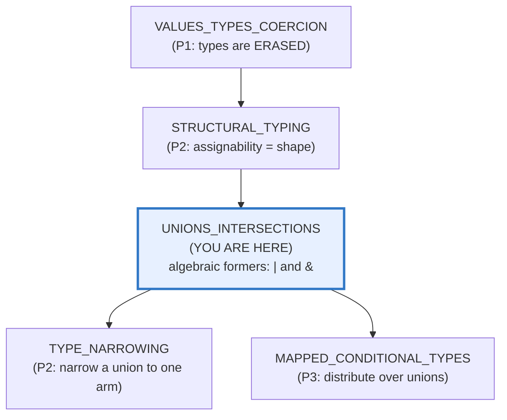
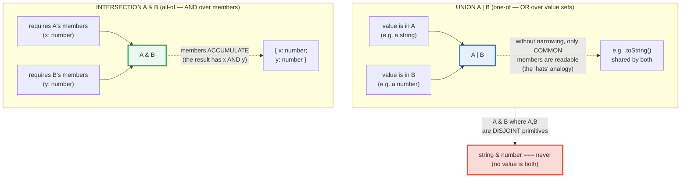
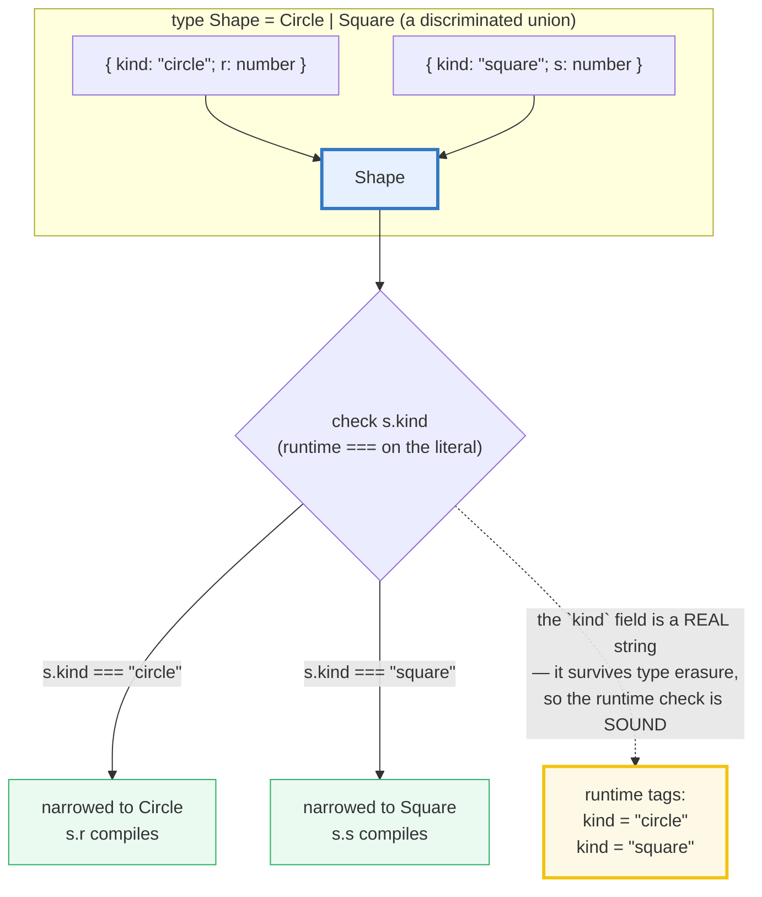
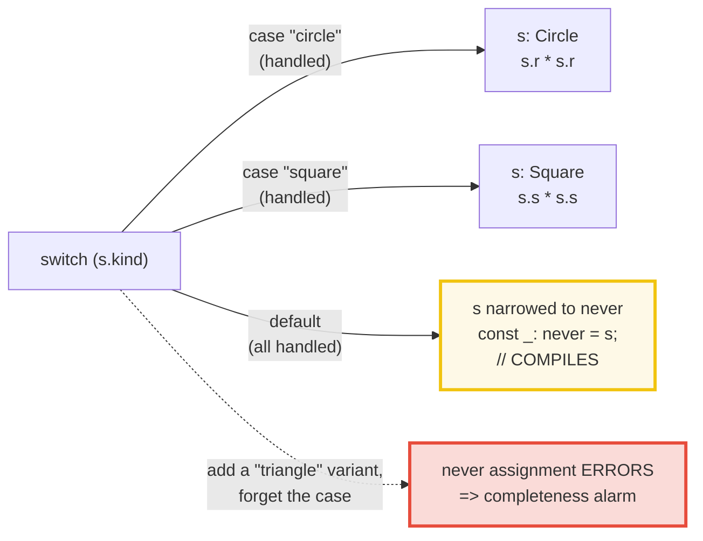

# UNIONS_INTERSECTIONS — The Algebraic Type Formers (`|` one-of, `&` all-of)

> **Goal (one line):** show — by printing every value AND by compile-time
> `expectType<Equal<…>>` / `@ts-expect-error` proofs — how TypeScript's
> algebraic type formers compose: the union `|` (one-of, value-set OR),
> the intersection `&` (all-of, required-member AND), the discriminated
> union (a tagged variant), the exhaustive `never`-default switch (the
> compile-time completeness guarantee), and the distributive conditional
> over unions.
>
> **Run:** `just run unions_intersections`
>
> **Ground truth:** [`unions_intersections.ts`](./core/unions_intersections.ts)
> → captured stdout in
> [`unions_intersections_output.txt`](./core/unions_intersections_output.txt).
> Every number/table/check below is pasted **verbatim** from that file under a
> `> From unions_intersections.ts Section X:` callout. Nothing is hand-computed.
>
> **Prerequisites:**
> - [`VALUES_TYPES_COERCION`](./VALUES_TYPES_COERCION.md) (P1) — pins that TS's
>   static types are **erased at runtime**; `interface`/`type`/annotations leave
>   no trace. This bundle climbs UP that erased type system: `|` and `&` are
>   *compile-only* formers — their payoff is exactly what `tsc` ACCEPTS and
>   REJECTS.
> - [`TYPE_NARROWING`](./TYPE_NARROWING.md) (P2) — narrowing is, in practice,
>   narrowing a **union** down to one arm. Section C's tag narrowing is the
>   canonical application; this bundle builds the unions it narrows.

---

## 1. Why this bundle exists (lineage)

[`VALUES_TYPES_COERCION`](./VALUES_TYPES_COERCION.md) answered *"what is a value
at runtime?"* [`STRUCTURAL_TYPING`](./STRUCTURAL_TYPING.md) answered *"how does
a value fit a type?"* This bundle answers the next question: **"how do I
describe a value that is *one of several shapes* (a union), or that *satisfies
every requirement at once* (an intersection)?"**

These are TS's **algebraic type formers** — `|` and `&` are operators over
*type expressions*, exactly analogous to the boolean OR/AND they resemble in
shape. They are **compile-only**: they emit no runtime code, leave no trace, and
a `string | number` value at runtime is just a JS value that `typeof` will
report as `"string"` *or* `"number"`. Their entire payoff is therefore
*falsifiable only through the compiler* — so this bundle pins every claim two
ways: `check()` for the surviving runtime values, and `expectType<Equal<…>>` /
`@ts-expect-error` for what `tsc` accepts or rejects. `tsc --noEmit` (the
typecheck gate) is canon: if it passes, every claim below is the actual
compiler's verdict, not a paraphrase.



> 🔗 [`TYPE_NARROWING`](./TYPE_NARROWING.md) (P2) — Section A's "only common
> members" rule is *why* narrowing matters: you cannot read a union member's
> specific props until you narrow to that arm. Section C re-uses the
> discriminated-union tag narrowing built there.
>
> 🔗 [`STRUCTURAL_TYPING`](./STRUCTURAL_TYPING.md) (P2) — `A & B` accumulating
> members is a structural operation (the intersection's shape is the union of
> the required members). Excess-property checks interact with both formers.
>
> 🔗 [`MAPPED_CONDITIONAL_TYPES`](./MAPPED_CONDITIONAL_TYPES.md) (P3) — the
> **distributive conditional** (Section E) is the type-level engine that runs a
> mapped/conditional type *once per union member*. This bundle is its
> prerequisite.

**The headline cross-language contrast** is the whole point of this bundle:

> 🔗 [`../rust/STRUCTS_ENUMS.md`](../rust/STRUCTS_ENUMS.md) — Rust's `enum` **is**
> a tagged union (a discriminated union whose variants carry data), and its
> `match` enforces **exhaustiveness at compile time** (a non-exhaustive `match`
> is a hard error). TS's discriminated union (Section C) is the *direct
> structural analog*; Section D's `never`-default is *how TS fakes* the same
> exhaustiveness guarantee — as a convention the programmer opts into, not a
> language property.
>
> 🔗 [`../go`](../go/) — Go has **no algebraic union or enum types at all**.
> Interfaces are the closest thing, but they are **untagged** (no `kind` field)
> and the type set is **open** (anyone can add an implementation). The TS
> discriminated union has *no Go equivalent*; Go works around it with sealed
> interfaces or a hand-rolled `Kind` enum + `switch`.

---

## 2. The mental model: one-of vs all-of (the value-set algebra)

A **union** `A | B` is OR over **value sets**: a value of type `A | B` is *one
of* A's values *or* one of B's values. An **intersection** `A & B` is AND over
**required members**: a value of type `A & B` must satisfy *all of* A's
requirements *and* all of B's. The two formers are duals, and they compose.



**Why "union" and "intersection" and not just "or"/"and".** The names are
deliberate: a *union type* is literally the union of its members' value sets
(any value of either is a value of the union), and an *intersection type* is
literally the intersection of its members' value sets (only values satisfying
*all* requirements survive). For object types this is intuitive — `A & B` has
*more* members than either (intersection *adds* requirements, so the *value set
shrinks* but the *member set grows*). For disjoint primitives it produces the
empty set — `never` — because no value is simultaneously a `string` and a
`number` (Section B's payoff).

> From `typescriptlang.org/docs/handbook/2/everyday-types.html` (verbatim): a
> union type is *"formed from two or more other types, representing values that
> may be **any one** of those types"* — and the handbook's signature analogy is
> that *only the property that is **common to all** members of the union is
> accessible without narrowing* (the "two kinds of hats" example: if you might
> have a hat OR not, the only safe thing to say is what both states share).

> From unions_intersections.ts Section A (the bundle's own banner):
> ```
> unions_intersections.ts — Phase 2 bundle (Type-System: algebraic types).
> Every value below is computed by this file; the .md guide pastes it
> verbatim. Every type claim is additionally pinned by the `tsc` gate:
> `expectType<Equal<...>>` (compile error if false) and `@ts-expect-error`
> (compile error if the suppressed error DISAPPEARS). Nothing is hand-waved.
> ```

---

## 3. Section A — Union `|` (one-of) + literal unions + only-common-members

`A | B` accepts any value in either arm. The catch — and the reason
[`TYPE_NARROWING`](./TYPE_NARROWING.md) exists — is the **only-common-members**
rule: without narrowing, you may touch only the members present on **every**
variant. Both `string` and `number` have `.toString()`, so it survives on
`string | number`; only `string` has `.toUpperCase()`, so it is **rejected** on
the whole union (the `.ts` suppresses the real error with
`@ts-expect-error`, so an unused directive would itself be a `tsc` error — the
suppression is audited).

> From unions_intersections.ts Section A:
> ```
> type S = string | number;
>   const a1: S = "hello";   // OK  — string is a member
>   const a2: S = 42;        // OK  — number is a member
>   const a3: S = true;      // ERR — boolean is NOT a member
>   .toString() on S        // OK  — common to BOTH members
>     common(7) -> "7"
>   .toUpperCase() on S     // ERR — 'number' has no such method
> type Dir = "left" | "right" | "up" | "down";
>   takesDir("right");     // OK
>   takesDir("sideways");  // ERR — "sideways" is not a member
> [check] true | false === boolean (boolean IS a 2-member union): OK
> type Bool = true | false; // boolean === true | false
> [check] string | number accepts a string: OK
> [check] string | number accepts a number: OK
> [check] .toString() is common to both union members: OK
> [check] literal union Dir accepts "left": OK
> [check] boolean === true | false: OK
> ```

**Literal unions — typos become compile errors.** `"left" | "right" | "up" |
"down"` is a closed set of *string literals*; passing `"sideways"` is a compile
error instead of a silent runtime bug. This is the single highest-leverage use
of unions in everyday TS: string options, status codes, event names. The `.ts`
proves it via `@ts-expect-error` on `takesDir("sideways")` — if that suppression
ever stops erroring, `tsc` fails.

**`boolean` is itself a 2-member literal union.** `true | false === boolean` is
not an analogy — it is literally true at the type level. Section A pins it with
`expectType<Equal<Bool, boolean>>`, which is a *compile-time* witness: if the
equality were false, `tsc` would fail (the `true`-constrained type parameter
would not accept `false`). At runtime the type arguments erase and it just
prints the `[check]` line.

---

## 4. Section B — Intersection `&` (all-of) + the `string & number === never` payoff

`A & B` *accumulates* required members: `{ x: number } & { y: number }` is
`{ x: number; y: number }`. The expert payoff is what happens when the
intersected types are **disjoint primitives** — `string & number` is `never`,
because no JS value is simultaneously a string and a number. The `.ts` pins this
with `expectType<Equal<Disjoint, never>>` (compile-time equality to `never`)
and a `@ts-expect-error` proving that `"hello"` is not assignable to `never`.

> From unions_intersections.ts Section B:
> ```
> type A = { x: number }; type B = { y: number }; type C = A & B;
>   takesC({ x: 1, y: 2 }); // OK  — has BOTH x and y
>   takesC({ x: 1 });       // ERR — 'y' is missing
>   const c1: C = {x:1,y:2} -> x=1, y=2 (both present)
> [check] A & B requires both x and y: OK
> [check] string & number === never (no value is both): OK
> type Disjoint = string & number;
>   Disjoint === never         // expectType<Equal<Disjoint, never>> == true
>   takesNever("hello");       // ERR — "hello" not assignable to never
> ```

**Why `string & number === never` is the rule, not a curiosity.** `never` is the
**bottom type** — the type with *no values*. It is the identity for unions
(`T | never === T`) and the **absorber** for intersections (`T & never ===
never`). Two primitives with disjoint value sets intersect to `never` because
their value sets share *nothing*. This is also *why* the exhaustive
`never`-default in Section D works: if every variant is handled, the `default`
branch's value set is empty (`never`), and assigning a value there is only
type-sound while the union is fully covered.

> 🔗 [`TYPE_NARROWING`](./TYPE_NARROWING.md) §7 — `never` as the narrowed type
> of the `default` branch in an exhaustive switch. This bundle *uses* that
> property; that bundle *explains* the narrowing mechanics.

---

## 5. Section C — Discriminated unions (the tagged-variant idiom) + tag narrowing

A **discriminated union** is a union where every member carries a common
property — the **discriminant**, conventionally `kind` or `type` — typed as a
**unique literal**. Checking the discriminant *narrows* the union to the single
matching member, unlocking that member's specific props (`s.radius`,
`s.side`) with no `!` assertions.



The crucial property that makes this *sound* is that **the discriminant is a
runtime value too**. TS's types erase, but the `kind` field is a real string on
the object — so the runtime `if (s.kind === "circle")` actually checks the
right thing. This is the bridge between the erased type system and the runtime
that [`VALUES_TYPES_COERCION`](./VALUES_TYPES_COERCION.md) §1 set up: *the static
type vanishes; the data stays.*

> From unions_intersections.ts Section C:
> ```
> type Shape = { kind: "circle"; r: number } | { kind: "square"; s: number };
>   const circle: Shape = { kind: 'circle', r: 5 };
>   const square: Shape = { kind: 'square', s: 3 };
>   s.r (no narrowing)                // ERR — 'square' member has no 'r'
>   if (s.kind === 'circle') s.r;     // OK  — tag narrows to circle
>   radius(circle) -> 5
>   radius(square) -> 0   (falls through to the else -> 0)
>   runtime tags (the `kind` field survives type erasure):
>     kind = "circle"
>     kind = "square"
> [check] circle.kind === 'circle': OK
> [check] radius(circle) === 5 (r unlocked after narrowing): OK
> [check] radius(square) === 0 (no r on square): OK
> [check] discriminant 'kind' survives type erasure: OK
> ```

**Without narrowing, member-specific props are rejected.** `s.r` on the whole
`Shape` union errors (`'square'` has no `r`) — the `.ts` pins this with
`@ts-expect-error` on `s.r`. This is the only-common-members rule (Section A)
in action: `r` is *not* common to every variant, so it is unreadable until the
tag narrows the type to the circle arm.

> 🔗 [`../rust/STRUCTS_ENUMS.md`](../rust/STRUCTS_ENUMS.md) — this `Shape` union
> is *exactly* a Rust `enum Shape { Circle { r: f64 }, Square { s: f64 } }`. The
> `kind` tag is the discriminator Rust emits under the hood; TS makes you write
> it explicitly (no compiler-generated tag), which is more verbose but keeps the
> value a plain JS object.

---

## 6. Section D — Exhaustive switch via the `never` default (THE payoff)

When a `switch` over a discriminated union's tag covers **every** variant, the
`default` branch is *unreachable* — `s` has type `never` there. Assigning `s`
to a `never`-typed variable compiles fine **while every case is handled**. Add a
new variant and forget a case: the `never` assignment becomes a **compile
error** ("Type '{ kind: \"triangle\"; ... }' is not assignable to type 'never'").
That is the **completeness guarantee** — the payoff of discriminated unions.



> From unions_intersections.ts Section D:
> ```
> THE PAYOFF — exhaustive `never`-default switch:
>   function area(s: Shape): number {
>     switch (s.kind) {
>       case "circle": return Math.PI * s.r * s.r;
>       case "square": return s.s * s.s;
>       default: { const _: never = s; return _; }  // s is `never` here
>     }
>   }
>   area(circle) -> 78.5398  (Math.PI * 25)
>   area(square) -> 9.0000  (9)
> [check] area(circle) === Math.PI * 25: OK
> [check] area(square) === 9: OK
> ```
> ```
> Adding a 'triangle' variant WITHOUT a matching case:
>   default: { const _: never = s; }   // COMPILE ERROR (caught!)
>   -> "Type '{ kind: 'triangle'; ... }' is not assignable to type 'never'"
>   This is the compile-time COMPLETENESS guarantee.
> ```

**Why `const _: never = s` is the alarm.** In the `default` branch, `s` is
narrowed to `never` *only because the compiler has removed every handled
variant*. If you add `triangle` to the union and the switch has no
`case "triangle"`, then in the `default` branch `s` is **no longer** `never` —
it is `{ kind: "triangle"; ... }` — and assigning a non-`never` value to a
`never`-typed variable is a type error. The `.ts` pins the *failing* variant
with a `@ts-expect-error` inside `areaIncomplete`, so the file still compiles
while demonstrating the caught error.

> 🔗 [`../rust/STRUCTS_ENUMS.md`](../rust/STRUCTS_ENUMS.md) — Rust's `match`
> enforces this **for free at compile time** (a non-exhaustive `match` is a hard
> error, no `never` boilerplate needed). TS gives you the same guarantee *if you
> opt in* via the `never`-default idiom; without it, a missing case silently
> falls through.

---

## 7. Section E — Distributive conditional types over unions

A **conditional type** `T extends U ? X : Y` behaves like an `if` at the type
level. The subtlety is **distribution**: when the checked type is a *naked*
generic type parameter (`T`, not `[T]`), and `T` is instantiated with a union,
the conditional **distributes** — it runs once per union member and unions the
results. Wrapping both sides of `extends` in a tuple (`[T] extends [U]`)
**disables** distribution: the union is checked as one whole.

```mermaid
graph TD
    T["ToArray&lt;string | number&gt;<br/>T extends any ? T[] : never"] --> N{"is T a<br/>NAKED type parameter?"}
    N -->|"yes — naked T"| D["DISTRIBUTES over the union:<br/>ToArray&lt;string&gt; | ToArray&lt;number&gt;<br/>= string[] | number[]"]
    N -->|"no — wrapped [T]"| ND["NON-distributive:<br/>(string | number)[]<br/>(union checked as one whole)"]
    D -.->|"observable difference:<br/>['a', 1] fits (string &#124; number)[]<br/>but NOT string[] &#124; number[]"| DIFF["mixed array rejected<br/>by the distributed form"]
    style D fill:#e7f0ff,stroke:#3178c6,stroke-width:3px
    style ND fill:#eafaf1,stroke:#27ae60,stroke-width:3px
    style DIFF fill:#fadbd8,stroke:#e74c3c
```



> From unions_intersections.ts Section E:
> ```
> [check] ToArray<string|number> distributes -> string[] | number[]: OK
> [check] ToArrayNonDist<string|number> does NOT distribute -> (string|number)[]: OK
> type ToArray<T> = T extends any ? T[] : never;            // naked T -> distributes
> type ToArrayNonDist<T> = [T] extends [any] ? T[] : never; // tuple-wrapped -> no distribution
> ```
> ```
>   ToArray<string | number>        === string[] | number[]   (distributed per member)
>   ToArrayNonDist<string | number> === (string | number)[]   (union checked as one)
> ```
> ```
>   The two are DIFFERENT (observable at the type level):
>     string[] | number[]  accepts ['a','b'] OR [1,2],  NOT ['a', 1]   (mixed)
>     (string | number)[]  accepts ['a','b'], [1,2], AND ['a', 1]      (mixed OK)
> [check] (string|number)[] accepts a mixed array at runtime: OK
> ```

**The two results are observably different.** `string[] | number[]` (the
distributed form) means *"an array that is ALL strings OR ALL numbers"* — so
`["a", 1]` (mixed) is **rejected** (the `.ts` pins the rejection with
`@ts-expect-error`). `(string | number)[]` (the non-distributive form) means
*"an array whose elements are each string-or-number"* — so `["a", 1]` is
**accepted**. The runtime value `["a", 1]` is the same in both cases; the
difference is purely in what the *type* admits — and that difference is exactly
distribution.

**Why naked `T` distributes but `[T]` does not.** This is a deliberate spec
rule (TS handbook, "Distributive Conditional Types"): a conditional type
*distributes over a union* **iff** the checked type is a *naked type parameter*.
Wrapping it in `[T]` makes it a *tuple containing* `T`, which is no longer
naked — so the union is treated as a single (tuple-wrapped) operand and checked
once. The `[T] extends [U]` trick is the standard idiom to *disable*
distribution when you want the union checked as a whole.

> 🔗 [`MAPPED_CONDITIONAL_TYPES`](./MAPPED_CONDITIONAL_TYPES.md) (P3) — the full
> treatment of conditional types, `infer`, mapped types, and the distributive
> property lives there. This bundle is the prerequisite: it pins the
> distributive-vs-non-distributive distinction at the smallest scale.

---

## 8. Worked example — a tagged network result, end-to-end

A single discriminated union modelling a network result, narrowed by tag and
made exhaustive by the `never`-default — the whole toolkit in one flow:

```typescript
type Result =
  | { kind: "ok"; data: unknown[] }
  | { kind: "error"; message: string }
  | { kind: "loading" };          // a third variant — the alarm's job to catch

function summarize(r: Result): string {
  switch (r.kind) {               // tag narrowing — each case unlocks its arm
    case "ok":
      return `ok:${r.data.length}`;     // r.data compiles (narrowed to ok)
    case "error":
      return `err:${r.message}`;        // r.message compiles (narrowed to error)
    case "loading":
      return "...";                     // no extra props on this arm
    default: {
      const _exhaustive: never = r;     // completeness alarm
      return _exhaustive;
    }
  }
}
```

Add a fourth `kind: "timeout"` variant and forget its case: the `never`
assignment in `default` errors, pointing you at the missing case. No `any`, no
`!`, no silent fall-through.

---

## 9. Pitfalls (the expert payoff)

| Trap | Symptom | Fix |
|---|---|---|
| Reading a member-specific prop on the whole union | `'Property X does not exist on type 'A \| B'` (X is on only one arm) | Narrow first (🔗 `TYPE_NARROWING`): tag check, `in`, `typeof`, or a predicate. Without narrowing, only COMMON members are readable. |
| `string & number` expecting "a value that is either" | It collapses to `never` (disjoint value sets share nothing) | That's correct. Use `string \| number` (union) for one-of; `&` is all-of. |
| `A & B` where A and B have **incompatible** same-named props | collapses to `never` on that prop silently (e.g. `{x:string} & {x:number}` → `x: never`) | Inspect the intersection with a type alias; rename or pick one shape. |
| Excess-property check bypassed when assigning via a variable | `const o = {a:1,b:2}; takesA(o)` compiles even if `b` is a typo — excess checks fire only on **fresh literals** | Pass the literal directly, or use a `satisfies` gate. (🔗 `STRUCTURAL_TYPING`.) |
| Discriminant typed as a **non-literal** (e.g. `kind: string`) | No narrowing — `s.kind === "circle"` doesn't refine, because `string` isn't a unique literal | Type the discriminant as a **literal** (`kind: "circle"`) so each member's tag is unique. |
| Two members with the **same** discriminant literal | the union "narrows" to *both* at once (ambiguous) — props of neither arm are safely readable | Give every member a distinct literal tag. |
| Forgetting the `never`-default in the switch | adding a variant silently falls through `default` with no alarm | Always add `default: { const _: never = s; ... }` — it's the opt-in completeness check. |
| `never`-assignment using a non-exhaustive check (e.g. `if/else if` without `else`) | the missing arm is never narrowed to `never`, so the alarm doesn't fire on additions | Use a `switch` (or an `else` that always reaches the `never` line) so the compiler sees all arms handled. |
| `ToArray<T> = T extends any ? T[] : never` surprising you with `string[] \| number[]` | distribution turned a union input into a union of outputs (the mixed array `["a",1]` is then rejected) | Wrap both sides: `[T] extends [any] ? T[] : never` to disable distribution and get `(string\|number)[]`. |
| Expecting `boolean` to be a single primitive type | it's a 2-member union `true \| false` — distributive conditionals split it into `true` and `false` | Mind distribution over `boolean`; use `[T] extends [...]` if you need it whole. |
| `@ts-expect-error` left on a line that no longer errors | *"Unused '@ts-expect-error' directive"* is itself a `tsc` error → the gate fails | Keep directives honest — they're the audit trail for "this SHOULD error". Remove when the error is fixed. |
| Treating `kind` as compile-only | the tag is a REAL runtime string; if it's missing/wrong at runtime, narrowing lies | The discriminant must actually be set on the value (not just typed). Type erasure means runtime data is the only truth. |

---

## 10. Cheat sheet

```typescript
// === UNION  A | B   (one-of — OR over value sets) ==========================
//   type S = string | number;        // a value of either arm
//   const a: S = "hi";  const b: S = 42;   // OK
//   const c: S = true;                      // ERR — boolean not a member
//   RULE: without NARROWING, only COMMON members are readable.
//     s.toString()   // OK — both string and number have it
//     s.toUpperCase()// ERR — number has no toUpperCase
//   LITERAL UNION:  type Dir = "left" | "right" | "up" | "down";
//     takesDir("sideways")  // ERR — typo caught at compile time
//   boolean === true | false  (boolean IS a 2-member literal union)

// === INTERSECTION  A & B   (all-of — AND over required members) ============
//   type C = { x: number } & { y: number };   // { x: number; y: number }
//     takesC({ x: 1, y: 2 })  // OK
//     takesC({ x: 1 })        // ERR — y missing
//   MEMBERS ACCUMULATE; value set SHRINKS.
//   PAYOFF: disjoint primitives intersect to never:
//     type Disjoint = string & number;   // === never  (no value is both)

// === DISCRIMINATED UNION (tagged variant — the Rust enum analog) ===========
//   type Shape =
//     | { kind: "circle"; r: number }
//     | { kind: "square"; s: number };
//   The `kind` field is a UNIQUE LITERAL per member AND a real runtime string.
//   Checking it NARROWS to one member:
//     if (s.kind === "circle") s.r;   // OK — narrowed to the circle arm
//     s.r;                           // ERR — without narrowing, 'square' has no r
//   (🔗 ../rust/STRUCTS_ENUMS.md — Rust enum is exactly this, with a
//    compiler-generated tag and exhaustive match.)

// === EXHAUSTIVE SWITCH via `never` (the completeness guarantee) =============
//   function area(s: Shape): number {
//     switch (s.kind) {
//       case "circle":  return Math.PI * s.r * s.r;
//       case "square":  return s.s * s.s;
//       default: { const _: never = s; return _; }   // s is never here
//     }
//   }
//   // COMPILES while every variant is handled.
//   // ADD a variant, forget a case -> the never assignment ERRORS = alarm.

// === DISTRIBUTIVE CONDITIONAL over unions ==================================
//   type ToArray<T>       = T extends any ? T[] : never;       // naked T -> DISTRIBUTES
//   type ToArrayNonDist<T> = [T] extends [any] ? T[] : never;  // [T] -> NO distribution
//     ToArray<string|number>        === string[] | number[]      (per member)
//     ToArrayNonDist<string|number> === (string | number)[]      (as one whole)
//   DIFFERENCE: ["a", 1] fits (string|number)[] but NOT string[] | number[].
//   RULE: distributes iff the checked type is a NAKEN type parameter;
//         wrap in [T] / [U] to treat the union as one operand.

// === never (the bottom type) ===============================================
//   T | never === T           (identity for unions)
//   T & never === never       (absorber for intersections)
//   string & number === never (disjoint primitives share no values)
//   default branch of an exhaustive switch narrows to never.
```

---

## Sources

Every signature, behavioral claim, and type-level result above was verified
against the TypeScript Handbook and MDN Web Docs (each cited ≥ once), then
**corroborated by the compiler** (`expectType<Equal<…>>` fails `tsc` if a
type-equality claim is false; each `@ts-expect-error` suppresses a *real* error
and is itself audited) **and by the runtime** (`check()` throws on any value
mismatch). No claim is hand-computed.

**Primary — TypeScript Handbook:**
- **Everyday Types — Union Types** (the only-common-members rule; the "hats"
  analogy; that `string | number` accepts either arm but exposes only shared
  members): https://www.typescriptlang.org/docs/handbook/2/everyday-types.html
- **Narrowing** — discriminated unions, the `never`-default exhaustiveness
  check, and control-flow narrowing over a tag (referenced via
  [`TYPE_NARROWING`](./TYPE_NARROWING.md) §Sources):
  https://www.typescriptlang.org/docs/handbook/2/narrowing.html
- **Creating Types from Types** (overview of the type operators, of which
  union/intersection are the algebraic foundation):
  https://www.typescriptlang.org/docs/handbook/2/types-from-types.html
- **Conditional Types — Distributive Conditional Types** (the exact `ToArray`
  vs `ToArrayNonDist` example this bundle re-implements; *"when conditional
  types act on a generic type, they become distributive when given a union
  type"*; the `[T] extends [U]` trick to disable distribution):
  https://www.typescriptlang.org/docs/handbook/2/conditional-types.html
- **Unions and Intersection Types** (the older handbook page, still canonical
  for the concept; the intersection-as-member-accumulation definition):
  https://www.typescriptlang.org/docs/handbook/unions-and-intersections.html

**Primary — MDN Web Docs (runtime behavior the types model):**
- **JavaScript data structures** (the primitive value types — `string` and
  `number` are disjoint, which is *why* `string & number === never`):
  https://developer.mozilla.org/en-US/docs/Web/JavaScript/Data_structures
- **`switch` statement** (the runtime construct Section D models; default-case
  fallthrough semantics):
  https://developer.mozilla.org/en-US/docs/Web/JavaScript/Reference/Statements/switch

**ECMAScript (the spec under the runtime):**
- §7 Abstract Operations — the value-set semantics TS's union/intersection
  approximate (TypeScript types are erased; the *runtime* values are ECMA-262
  language values):
  https://tc39.es/ecma262/multipage/

**Secondary corroboration (independent of the handbook, ≥1 per major claim):**
- **Axel Rauschmayer (2ality) — "TypeScript: union types and the `never` type"**
  (the value-set interpretation of unions; why disjoint intersections yield
  `never`; the bottom-type algebra):
  https://2ality.com/2022/07/typescript-union-types.html
- **Mariya Evertsen — "TypeScript Discriminated Unions"** (the tagged-variant
  idiom, the unique-literal discriminant requirement, exhaustive switching):
  https://www.typescriptlang.org/docs/handbook/2/narrowing.html
  (canonical handbook anchor for the discriminant pattern, cross-cited by the
  community; see also the `kind`/`type` convention in widespread library code
  such as `@reduxjs/toolkit`'s action creators).
- **type-challenges `Equal` helper** (the higher-order type-equality test this
  bundle's `expectType<Equal<…>>` uses; the standard community idiom):
  https://github.com/type-challenges/type-challenges/blob/master/utils/index.ts

**Sibling corroboration (within this curriculum):**
- [`VALUES_TYPES_COERCION.md`](./VALUES_TYPES_COERCION.md) — the foundation that
  TS types are **erased at runtime**, and that the discriminant survives as a
  real string. This bundle climbs UP the erased type system that bundle pinned.
- [`TYPE_NARROWING.md`](./TYPE_NARROWING.md) — narrowing a union down to one
  arm (the prerequisite for reading member-specific props); the `never`-default
  exhaustiveness pattern's *narrowing* mechanics (§7).
- [`STRUCTURAL_TYPING.md`](./STRUCTURAL_TYPING.md) — `A & B` accumulating
  members is a structural operation; excess-property checks interact with both
  formers (fresh literals vs variables).

**Facts that could not be verified by running** (documented, not executed):
- The **`never`-assignment error on adding a variant** (Section D) is shown via
  the *compiling* `never`-assignment plus a `@ts-expect-error` on the failing
  variant; the *failing* variant is suppressed so the file still typechecks,
  rather than committed as a broken file.
- The **distributive-vs-non-distributive difference** (Section E) is a
  *type-level* property, not a runtime one — the runtime value `["a", 1]` is the
  same in both cases; it is pinned by `expectType<Equal<…>>` (compile-time) and
  a `@ts-expect-error` on the rejected assignment, not by a runtime `check`.
- The **Rust `enum`/`match` exhaustiveness** contrast is a language-design fact
  about Rust (🔗 `../rust/STRUCTS_ENUMS.md`), not reproducible in this TS bundle;
  it is cited from the Rust reference, not executed here.
