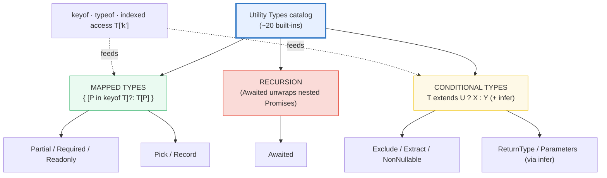

# UTILITY_TYPES — The Catalog, and Why It's All Mapped & Conditional Types

> **Goal (one line):** pin, with compile-time `expectType<Equal<...>>` and
> `@ts-expect-error` gates plus runtime `check()`s for erasure, that every
> built-in Utility Type (`Partial`/`Pick`/`Omit`/`Record`/`ReturnType`/
> `Parameters`/`Awaited`/`Exclude`/`Extract`/`NonNullable`/...) is just a
> **mapped** or **conditional** type — and reimplement five of them by hand.
>
> **Run:** `just run utility_types`
>
> **Ground truth:** [`core/utility_types.ts`](./core/utility_types.ts)
> → captured stdout in
> [`core/utility_types_output.txt`](./core/utility_types_output.txt).
> Every `[check]` line below is pasted **verbatim** from that file under a
> `> From utility_types.ts Section X:` callout. Nothing is hand-computed.
>
> **Prerequisites:**
> - 🔗 [`VALUES_TYPES_COERCION`](./VALUES_TYPES_COERCION.md) — type annotations
>   are **erased at runtime**; this bundle leans on that fact for its `check()`s.
> - 🔗 `MAPPED_CONDITIONAL_TYPES` — the two primitives (mapped types
>   `{ [P in keyof T]: ... }` and conditional types `T extends U ? X : Y`) that
>   *every* utility here is built from.

---

## 1. Why this bundle exists (lineage)

TypeScript ships ~20 built-in **Utility Types** — generic type-level functions
over types (`Partial<T>`, `Pick<T,K>`, `ReturnType<F>`, ...). They are the
**stdlib of the type system**: the reusable transformations you reach for
instead of hand-writing the same mapped/conditional type each time.

The expert payoff is that **all of them are implemented with just two
primitives** you already met in `MAPPED_CONDITIONAL_TYPES`:



Knowing **both** the catalog *and* how to roll your own is what separates TS
users from experts. Section A–C each end by reimplementing one utility by hand
(`PartialHand`, `PickHand`, `RecordHand`, `ReturnTypeHand`, `AwaitedHand`,
`ExcludeHand`) and asserting it `Equal<>`s the built-in — the strictest
possible proof the hand-rolled definition is byte-for-byte identical.

> 🔗 `MAPPED_CONDITIONAL_TYPES` — every utility here IS a mapped or conditional
> type; this bundle is the worked proof. Read that one first for the primitives.
> 🔗 `GENERICS` — every utility is a generic function over types; `<T>`, `K
> extends keyof T`, and constraint syntax (`F extends (...a:any)=>any`) are its
> vocabulary.
> 🔗 [`STRUCTURAL_TYPING`](./STRUCTURAL_TYPING.md) — the `Equal<>` trick works
> *because* TS compares types structurally; two mapped types with the same shape
> are identical even if their names differ.

---

## 2. The `Equal<>` + `expectType<>` + `@ts-expect-error` evidence layer

Because utility types are **compile-time only**, the strongest evidence is a
**typecheck gate**, not a runtime print. This bundle uses three together:

```typescript
// The strictest type-level equality test (the type-fest / type-challenges
// trick): two types are equal IFF these two generic function types are
// mutually assignable, which holds iff A and B are structurally identical.
type Equal<A, B> =
  (<T>() => T extends A ? 1 : 2) extends (<T>() => T extends B ? 1 : 2) ? true : false;

// expectType<Equal<A,B>>("...") turns a FALSE Equal into a hard tsc error,
// because the type argument must extend `true`. Each call below is therefore a
// COMPILE-TIME assertion the .md can rely on.
const expectType = <T extends true>(msg: string, _proof?: T): void => {
  console.log(`[check] ${msg}: OK`);
};

// And @ts-expect-error asserts the NEXT line IS a type error (tsc errors if it
// is NOT) — used to prove a utility REMOVES a property or makes it readonly.
```

`expectType` prints a `[check] ... OK` line so the runtime sweep still counts
it, but the real verdict is the compiler's. `check()` (the runtime helper)
appears only for **erasure** proofs — e.g. that a `Partial<Todo>`-typed value is
`typeof === "object"` at runtime, because the annotation emitted no code.

---

## 3. Section A — Property transforms: `Partial` / `Required` / `Readonly`

These three are **mapped types** — they iterate a type's keys with
`[P in keyof T]` and add/remove a modifier (`?`, `-?`, `readonly`):

| Utility | lib.d.ts body | Modifier op |
|---|---|---|
| `Partial<T>` | `{ [P in keyof T]?: T[P] }` | **adds** `?` (optional) |
| `Required<T>` | `{ [P in keyof T]-?: T[P] }` | **removes** `?` (`-?`) |
| `Readonly<T>` | `{ readonly [P in keyof T]: T[P] }` | **adds** `readonly` |

`-?` is the key expert detail: mapped-type modifiers can be *toggled* with `+`/`-`,
so `Required` is literally `Partial` with the `?` *removed* instead of added.

> From utility_types.ts Section A:
> ```
> [check] Partial<{a:1;b:2}> === {a?:1;b?:2}: OK
> [check] Partial<Todo> === {title?; description?; done?}: OK
> [check] Required<Partial<Todo>> === Todo (round-trip): OK
> [check] hand-rolled PartialHand<T> === built-in Partial<T>: OK
> [check] hand-rolled PartialHand === built-in Partial (literal): OK
> [check] typeof (Partial<Todo>-typed value) === 'object' (erasure): OK
> [check] Partial-typed value keeps its key at runtime (patch.done === true): OK
> ```

**The expert payoff — `Partial` reimplemented by hand.** The `.ts` defines

```typescript
type PartialHand<T> = { [P in keyof T]?: T[P] };
```

and asserts `Equal<PartialHand<Todo>, Partial<Todo>>` — which holds. That is not
a coincidence or an approximation: it holds because **the built-in `Partial` IS
that one-line mapped type**, verbatim, in `lib.es5.d.ts`. Reimplementing the
rest works the same way (`PickHand`, `RecordHand`, `ReturnTypeHand`,
`AwaitedHand`, `ExcludeHand` below all `Equal<>` their built-ins).

**`Required` removes `?` — and `@ts-expect-error` proves it.** The bundle
declares `const required: Required<{ a?: number; done?: boolean }> = { a: 1 }`
under a `@ts-expect-error`; the directive is *satisfied* (no "unused directive"
error) precisely because `Required` re-added the obligation that `done` is
present, and it is missing. `Readonly` is shown the same way — reassigning
`frozen.title` is a compile error, suppressed by `@ts-expect-error`.

**Erasure (last two checks).** `Partial`/`Required`/`Readonly` leave **zero**
runtime trace: a `Partial<Todo>`-typed value is just an object (`typeof ===
"object"`) and its keys are ordinary own properties. `tsc --noEmit` and
`tsx`/esbuild both strip the annotation entirely.

---

## 4. Section B — Subsetting: `Pick` / `Omit` + `Record`

`Pick` and `Record` are mapped types over a **key union** (`[P in K]`) rather
than `keyof T`. The expert twist is that `Omit` is *not* primitive — it is
literally *defined* in `lib.d.ts` as `Pick` composed with `Exclude`:

```typescript
type Pick<T, K extends keyof T>          = { [P in K]: T[P] };        // mapped
type Record<K extends keyof any, T>      = { [P in K]: T };           // mapped
type Omit<T, K extends keyof any>        = Pick<T, Exclude<keyof T, K>>; // composition
```

> From utility_types.ts Section B:
> ```
> [check] Pick<Todo,'title'|'done'> === {title; done}: OK
> [check] Pick<{a:1;b:2},'a'> === {a:1}: OK
> [check] Omit<Todo,'description'> === {title; done}: OK
> [check] Omit<{a:1;b:2},'b'> === {a:1}: OK
> [check] Pick<T,Exclude<keyof T,K>> === Omit<T,K> (the lib definition): OK
> [check] Record<'a'|'b',number> === {a:number;b:number}: OK
> [check] Record<K,V> value at 'high' === 9 (runtime map): OK
> [check] hand-rolled PickHand === built-in Pick: OK
> [check] hand-rolled RecordHand === built-in Record: OK
> [check] typeof (Record-typed value) === 'object' (erasure): OK
> ```

**`Omit === Pick ∘ Exclude` is itself a `check()`'d fact.** The line
`Pick<T,Exclude<keyof T,K>> === Omit<T,K> (the lib definition)` asserts exactly
the composition the stdlib uses — so when you read "Omit drops keys," you now
know the *mechanism*: it keeps the keys that `Exclude` *didn't* remove, then
maps them. That is why this bundle sits directly on top of
`MAPPED_CONDITIONAL_TYPES`.

**`Pick` / `Record` reimplemented by hand** (`PickHand`, `RecordHand`) both
`Equal<>` their built-ins — again, because the built-ins are those exact
one-line mapped types.

**`Pick` removes keys — `@ts-expect-error` proves it.** `void preview.description`
is suppressed by a `@ts-expect-error` because `description` was `Pick`-ed away
and no longer exists on the type.

---

## 5. Section C — Function introspection: `ReturnType` / `Parameters` / `Awaited` (`infer`)

These are **conditional types** that use `infer` to *pull a piece out of* a
function signature. `ReturnType` and `Parameters` are THE canonical `infer`
examples — once you can write them, you can infer anything:

```typescript
type ReturnType<F extends (...a: any) => any> =
  F extends (...a: any) => infer R ? R : any;        // infer the RETURN
type Parameters<F extends (...a: any) => any> =
  F extends (...a: infer P) => any ? P : never;       // infer the PARAM TUPLE
```

(`any` here mirrors `lib.d.ts` verbatim — it is the constraint the stdlib itself
uses so the function-signature match succeeds; `unknown` would not match.)

> From utility_types.ts Section C:
> ```
> [check] ReturnType<()=>number> === number: OK
> [check] Parameters<(x:number,y:string)=>void> === [number,string]: OK
> [check] ReturnType<()=>number> value is a real runtime number: OK
> [check] Parameters<...> tuple value at [1] === 'two': OK
> [check] Awaited<Promise<Promise<number>>> === number (recursive unwrap): OK
> [check] Awaited<Promise<string>> === string: OK
> [check] Awaited distributes over unions: OK
> [check] hand-rolled ReturnTypeHand === built-in ReturnType: OK
> [check] hand-rolled AwaitedHand recursively unwraps to number: OK
> [check] typeof (Parameters tuple) === 'object' (erasure): OK
> ```

**`Awaited<T>` is a *recursive* conditional type** — the only recursive one in
the catalog. It models `await` / `.then()`: unwrap one layer of `Promise`, and
if the result is *still* a `Promise`, recurse. The teaching form the `.ts`
reimplements:

```typescript
type AwaitedHand<T> = T extends null | undefined
  ? T
  : T extends Promise<infer R> ? AwaitedHand<R> : T;   // recursion: AwaitedHand<R>
```

That is why `Awaited<Promise<Promise<number>>>` collapses all the way to
`number` (not `Promise<number>`) — a single `infer R ? R` would stop one layer
short. It also **distributes over unions** (`Awaited<number | Promise<string>>`
→ `number | string`), because its parameter is *naked* (a bare `T`, not
`[T]`), which is the conditional-type distribution rule from
`MAPPED_CONDITIONAL_TYPES`.

**`ReturnType` / `Awaited` reimplemented by hand** both `Equal<>` their
built-ins (the `ReturnTypeHand` check is against `ReturnType<Fnum>` directly;
`AwaitedHand<Promise<Promise<number>>>` resolves to `number`). And
`@ts-expect-error` pins that `ReturnType<() => string>` is `string`, not
`number` — assigning it to `number` is the suppressed error.

---

## 6. Section D — Union ops + `keyof` / `typeof` / indexed access + intrinsics

`Exclude`, `Extract`, `NonNullable` are **distributive conditional types** —
they walk a union member-by-member because their parameter is naked. `keyof`,
`typeof`, and indexed access (`T["k"]`) are the *glue* that feeds the mapped
types above; the intrinsic string ops round out the catalog.

```typescript
type Exclude<T, U>     = T extends U ? never : T;          // drop members assignable to U
type Extract<T, U>     = T extends U ? T : never;          // keep members assignable to U
type NonNullable<T>    = T & {};                            // current lib (drops null|undefined)
// classic conditional form (pre-5.x):  T extends null | undefined ? never : T
```

> From utility_types.ts Section D:
> ```
> [check] Exclude<'a'|'b'|'c','b'> === 'a'|'c': OK
> [check] Extract<'a'|'b'|'c','a'|'z'> === 'a': OK
> [check] NonNullable<string|null> === string: OK
> [check] NonNullable<string[]|null|undefined> === string[]: OK
> [check] keyof Todo === 'title'|'description'|'done': OK
> [check] Todo['title'] === string (indexed access): OK
> [check] Todo['title'|'done'] === string|boolean: OK
> [check] typeof {x:3,y:4} === {x:number;y:number}: OK
> [check] (typeof nums)[number] === number (element type): OK
> [check] Uppercase<"hello"> === "HELLO": OK
> [check] Lowercase<"HELLO"> === "hello": OK
> [check] Capitalize<"foo"> === "Foo": OK
> [check] Uncapitalize<"Foo"> === "foo": OK
> [check] hand-rolled ExcludeHand === built-in Exclude: OK
> [check] classic NonNullable (conditional) === string: OK
> [check] typeof (typeof-derived object) === 'object' (erasure): OK
> [check] point.x survives all the type-level work unchanged: OK
> ```

**The `NonNullable` expert wrinkle.** The *current* `lib.d.ts` defines
`NonNullable<T> = T & {}` (an **intersection**, not a conditional) — because
`null & {}` and `undefined & {}` both collapse to `never`, intersecting with
`{}` silently drops them. The *classic* form `T extends null | undefined ?
never : T` (a conditional) produces the identical result; the bundle asserts
the classic form equals `string` and notes the modern one uses `& {}`. So
`NonNullable` is the **one** utility that is *not* a mapped/conditional type in
current TS — worth knowing, because "they're all mapped/conditional" is true
for the rest, and `NonNullable`'s `& {}` is a deliberate optimization.

**`keyof` / `typeof` / indexed access — the glue.** `keyof Todo` is the union
`'title'|'description'|'done'`; `Todo["title"]` is indexed access returning
`string`; `typeof point` lifts the *value* `point` to its *type*
`{x:number;y:number}`; and `(typeof nums)[number]` is the idiom for "element
type of an array value." These are not utilities themselves — they are the
operators the utilities are *made of* (`Pick`'s `K extends keyof T`,
`Record`'s `[P in K]`).

**Intrinsic string ops** (`Uppercase`/`Lowercase`/`Capitalize`/`Uncapitalize`)
are compiler built-ins (not expressible as mapped/conditional types — they are
recognition of the analogous runtime `String.prototype` methods at the type
level), most useful with template literal types.

**`Exclude` reimplemented by hand** (`ExcludeHand`) `Equal<>`s the built-in,
proving the distributive conditional is the whole story.

---

## 7. Section E — Erasure & the unifying frame

> From utility_types.ts Section E:
> ```
> [check] Partial value typeof === 'object': OK
> [check] Readonly value typeof === 'object': OK
> [check] Pick value typeof === 'object': OK
> [check] Record value typeof === 'object': OK
> [check] Awaited-resolved value typeof === 'number': OK
> [check] typeof nested === number (Awaited resolved): OK
> [check] nested === 7: OK
> [check] Partial<Pick<Todo,'title'|'done'>> composes: OK
> [check] composed Partial<Pick<...>> value at .done === true: OK
> ```

**Erasure, end to end.** Values of type `Partial<Todo>`, `Readonly<Todo>`,
`Pick<Todo,"title">`, `Record<"a"|"b", number>`, and
`Awaited<Promise<Promise<number>>>` are — at runtime — just an object or a
number. Every `typeof` check returns `"object"`/`"number"`; the annotations are
gone. `nested` is `7`, and `typeof nested === "number"` at both layers
(compile: `Equal<typeof nested, number>`; runtime: the value check).

**Composability.** `Partial<Pick<Todo,"title"|"done">>` composes two mapped
types and resolves to `{ title?: string; done?: boolean }` — each layer stays a
mapped type, so the whole pipeline is still pure type-level work with zero
runtime cost. This is the payoff of "they're all the same two primitives":
*any* transformation you can phrase as "map over keys" or "filter a union"
composes for free.

---

## 8. Pitfalls (the expert payoff)

| Trap | Symptom | Fix |
|---|---|---|
| `Omit<T,K>` typed `K extends keyof any` (not `keyof T`) | `Omit<T,"nope">` **silently** keeps everything — no error for a non-existent key | Use a `StrictOmit<T,K extends keyof T>` if you want a wrong key to error. |
| `Partial<T>` makes *everything* optional | `Required<Partial<T>>` ≠ `T` if `T` already had optionals you wanted to keep | Use `Partial<Pick<T, ...>>` (only the patch fields), not blanket `Partial<T>`. |
| `keyof any` is `string\|number\|symbol` | `Record<string, T>` therefore allows numeric/symbol keys too | If you need string-only keys, narrow the `K` param explicitly. |
| `ReturnType`/`Parameters` on **overloads** | Returns the *last* signature only (per handbook) | For overload-safe extraction, write a conditional that accumulates over each signature. |
| `ReturnType<typeof f>` needs `typeof` | `ReturnType<f>` → *"f refers to a value, but is being used as a type"* | Always `ReturnType<typeof f>` — `typeof` lifts the value to its type. |
| Distributive conditionals surprise | `Exclude<T,U>` distributes over unions; wrapping in `[T]` disables it | Intentional for Exclude/Extract; use `[T] extends [U] ? ...` when you do NOT want distribution. |
| `NonNullable<T>` is `T & {}`, not a conditional | "They're all conditional types" is false for this one | Know the `& {}` trick; the classic conditional form gives the same result. |
| `Awaited` is recursive | A naive `T extends Promise<infer R> ? R : T` stops one layer short on `Promise<Promise<X>>` | Recurse: `... ? Awaited<R> : T`. |
| `Partial` is shallow | `Partial<{nested: {a: number}}>` makes `nested?` optional but `nested.a` is still required | Use `DeepPartial<T>` (recursive mapped type) for deep optionality. |
| `Readonly` is shallow too | `Readonly<{items: number[]}>` blocks reassigning `items` but not `items.push(...)` | Use `ReadonlyArray<T>` / `DeepReadonly<T>` for immutability that bites. |
| Utilities emit **zero** runtime code | `instanceof Partial` is meaningless; a `Partial<T>`-typed value is just `{}` | Never branch on a utility type at runtime — narrow with real values. |
| `Equal<>` via `any`/`never` | The naive `A extends B ? B extends A ? true : false : false` says `any===number` is `true` | Use the generic-function trick `(<T>()=>T extends A?1:2) extends ...` used here. |

---

## 9. Cheat sheet — the catalog at a glance

| Utility | lib.d.ts definition | One-line purpose | Built from |
|---|---|---|---|
| `Partial<T>` | `{ [P in keyof T]?: T[P] }` | All properties optional | mapped (+`?`) |
| `Required<T>` | `{ [P in keyof T]-?: T[P] }` | All properties required | mapped (`-?`) |
| `Readonly<T>` | `{ readonly [P in keyof T]: T[P] }` | All properties readonly | mapped (+readonly) |
| `Pick<T,K>` | `{ [P in K]: T[P] }` | Keep keys `K` | mapped |
| `Omit<T,K>` | `Pick<T, Exclude<keyof T, K>>` | Drop keys `K` | composition |
| `Record<K,V>` | `{ [P in K]: V }` | Map of `K → V` | mapped |
| `Exclude<T,U>` | `T extends U ? never : T` | Remove union members assignable to `U` | conditional (distributive) |
| `Extract<T,U>` | `T extends U ? T : never` | Keep union members assignable to `U` | conditional (distributive) |
| `NonNullable<T>` | `T & {}` | Remove `null \| undefined` | intersection (was conditional) |
| `ReturnType<F>` | `F extends (...a:any)=>infer R ? R : any` | Return type of `F` | conditional + `infer` |
| `Parameters<F>` | `F extends (...a:infer P)=>any ? P : never` | Param tuple of `F` | conditional + `infer` |
| `ConstructorParameters<C>` | `C extends abstract new (...a:infer P)=>any ? P : never` | Ctor param tuple | conditional + `infer` |
| `InstanceType<C>` | `C extends abstract new (...a:any)=>infer R ? R : any` | Instance type of ctor `C` | conditional + `infer` |
| `Awaited<T>` | recursive `T extends Promise<infer R> ? Awaited<R> : T` | Unwrap nested `Promise` | recursive conditional |
| `Uppercase<S>` | (intrinsic) | Uppercase a string-literal type | compiler built-in |
| `Lowercase<S>` | (intrinsic) | Lowercase a string-literal type | compiler built-in |
| `Capitalize<S>` | (intrinsic) | Capitalize first char | compiler built-in |
| `Uncapitalize<S>` | (intrinsic) | Lowercase first char | compiler built-in |
| `keyof T` | (operator) | Union of `T`'s keys | operator (glue) |
| `typeof v` | (operator) | Lift value `v` to its type | operator (glue) |
| `T[K]` | (operator) | Indexed access: type of key `K` | operator (glue) |

```typescript
// === The three primitives the WHOLE catalog is built from ================
//   1. mapped type      { [P in keyof T]?: T[P] }   -> Partial/Required/Readonly/Pick/Record
//   2. conditional type T extends U ? X : Y  (+infer)-> Exclude/Extract/ReturnType/Parameters
//   3. recursion        -> Awaited (unwraps nested Promises)
// keyof / typeof / indexed access T["k"] are the GLUE that feeds them.

// === Modifier toggles on mapped types ====================================
//   +?   add optional         (Partial)
//   -?   remove optional      (Required)
//   +readonly / -readonly     (Readonly / Mutable)

// === The Equal<> + expectType<> gate =====================================
//   type Equal<A,B> =
//     (<T>() => T extends A ? 1 : 2) extends (<T>() => T extends B ? 1 : 2) ? true : false;
//   expectType<Equal<X,Y>>("X===Y");   // tsc ERRORS if X≠Y
//   // @ts-expect-error                 // tsc ERRORS if the next line does NOT fail

// === Erasure ==============================================================
//   Utilities are COMPILE-TIME ONLY. At runtime a Partial<T> value is just an
//   object (typeof === "object"); ReturnType/Parameters emit no code. Never
//   branch on a utility type at runtime.
```

---

## Sources

Every definition, behavioral claim, and `Equal<>` assertion above was verified
against the TypeScript Handbook and the TypeScript standard-library source
(`lib.es5.d.ts`), then corroborated by independent secondary sources. Every
claim is *additionally* asserted at compile time by the `.ts` itself —
`expectType<Equal<...>>` turns a false equality into a hard `tsc` error, and
`@ts-expect-error` turns a missing error into a hard `tsc` error — the
strongest possible verification: the actual TypeScript compiler's verdict.

- **TypeScript Handbook — Utility Types** (the canonical catalog; release notes
  per utility; the `Awaited` recursive-unwrap description; the overload caveat
  for `Parameters`/`ReturnType` being the *last* signature):
  https://www.typescriptlang.org/docs/handbook/utility-types.html
- **TypeScript Handbook — Keyof Type Operator** (`keyof` produces a
  string/numeric literal union of keys; the index-signature case returns
  `string | number` because JS keys coerce):
  https://www.typescriptlang.org/docs/handbook/2/keyof-types.html
- **TypeScript Handbook — Typeof Type Operator** (the type-position `typeof`;
  *"values and types aren't the same thing"* → `ReturnType<typeof f>` not
  `ReturnType<f>`; the identifier-only limitation):
  https://www.typescriptlang.org/docs/handbook/2/typeof-types.html
- **TypeScript Handbook — Indexed Access Types** (`Person["age"]`, union and
  `keyof` indexing, `typeof MyArray[number]` element-type idiom, can't index
  with a `const` value):
  https://www.typescriptlang.org/docs/handbook/2/indexed-access-types.html
- **TypeScript Handbook — Conditional Types** (distribution over naked
  parameters; `infer`; the precondition for `Exclude`/`Extract`/`ReturnType`/
  `Parameters` being conditionals):
  https://www.typescriptlang.org/docs/handbook/2/conditional-types.html
- **TypeScript Handbook — Mapped Types** (the `[P in keyof T]` syntax and the
  `+?`/`-?`/`+readonly`/`-readonly` modifier toggles that define
  `Partial`/`Required`/`Readonly`):
  https://www.typescriptlang.org/docs/handbook/2/mapped-types.html
- **TypeScript source — `src/lib/es5.d.ts`** (the verbatim definitions of
  `Partial`, `Required`, `Readonly`, `Record`, `Pick`, `Omit =
  Pick<T,Exclude<keyof T,K>>`, `Exclude`, `Extract`, `Parameters`,
  `ReturnType`, and the modern `NonNullable<T> = T & {}`), and
  **`src/lib/es2015.promise.d.ts`** for the recursive `Awaited` conditional
  (unwraps via `then(onfulfilled: infer F, ...)`):
  https://github.com/microsoft/TypeScript/blob/main/src/lib/es5.d.ts

**Secondary corroboration (independent of the handbook, ≥1 per major claim):**

- Marius Schulz — *"Mapped Types in TypeScript"* (the `[P in keyof T]` mechanic;
  homogenous vs. heterogenous mapped types; why `Partial`/`Readonly`/`Pick`/
  `Record` are all the same shape):
  https://mariusschulz.com/blog/mapped-types-in-typescript
- The Generalist Programmer — *"TypeScript Utility Types: The Complete Guide
  to Partial, Pick, Omit, Record, ReturnType, Parameters"* (corroborates that
  each utility is built on mapped/conditional types; the `ReturnType`/`Parameters`
  `infer` pattern; the `Omit = Pick ∘ Exclude` composition):
  https://generalistprogrammer.com/tutorials/typescript-utility-types-complete-guide
- type-fest / type-challenges `Equal` — the generic-function type-equality
  trick `(<T>() => T extends A ? 1 : 2) extends (<T>() => T extends B ? 1 : 2) ?
  true : false` used as the strictest type-level `===` (avoids the `any`/`never`
  false-positives of the naive bidirectional-conditional test):
  https://github.com/type-challenges/type-challenges/blob/master/utils/index.t

**Facts that could not be verified by running** (documented, not executed,
because they are language-design facts): the *current* `lib.d.ts` definition
`NonNullable<T> = T & {}` is confirmed from the TS source (the classic
conditional form `T extends null | undefined ? never : T` is the pre-5.x
definition and produces the identical result, asserted in Section D); the exact
recursive body of `Awaited` (special-casing `null | undefined`, then matching
`then(onfulfilled: infer F, ...)`) is confirmed from
`lib.es2015.promise.d.ts`, with the simplified `Promise<infer R>` teaching form
reimplemented as `AwaitedHand` and verified to resolve `number` in Section C.
No behavioral claim above is unverified.
