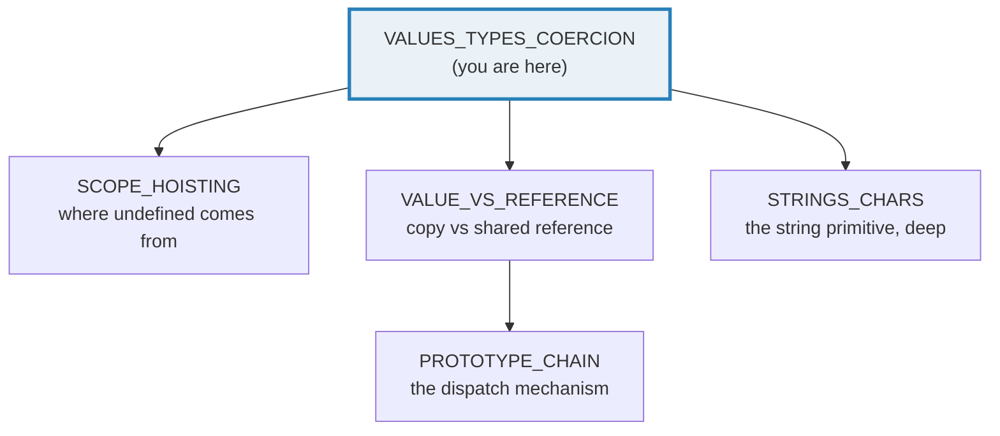
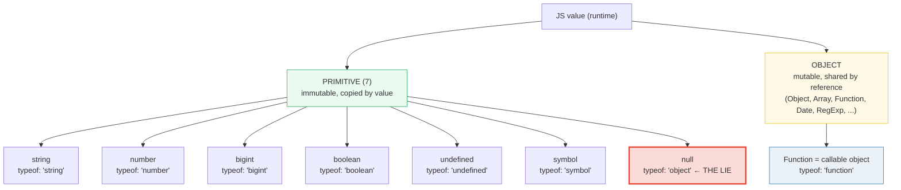
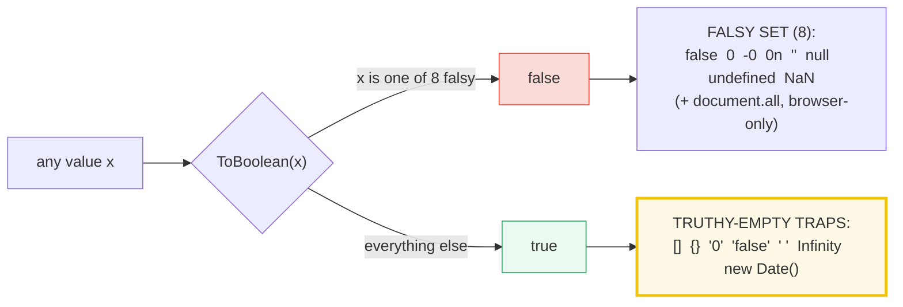
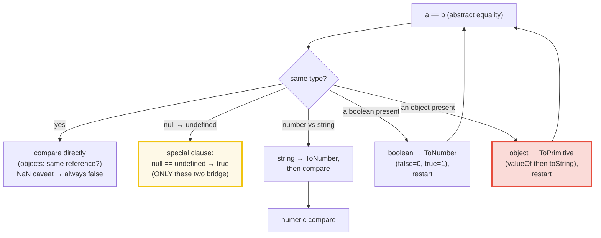

# VALUES_TYPES_COERCION — The 7 Primitives, `typeof`, Truthiness & `==`/`===`

> **Goal (one line):** show, by printing every value, how TS/JS's primitive
> types, `typeof`, truthiness, and `==`/`===` coercion behave — pinning the
> `typeof null` lie and the famous coercion surprises as `check()`'d invariants.
>
> **Run:** `just run values_types_coercion`
>
> **Ground truth:** [`values_types_coercion.ts`](./core/values_types_coercion.ts)
> → captured stdout in
> [`values_types_coercion_output.txt`](./core/values_types_coercion_output.txt).
> Every number/table below is pasted **verbatim** from that file under a
> `> From values_types_coercion.ts Section X:` callout. Nothing is hand-computed.
>
> **Prerequisites:** none — this is Phase 1 bundle #1, the **style anchor**.
> Sibling bundles copy this structure.

---

## 1. Why this bundle exists (lineage)

TypeScript adds a **static** type system on top of JavaScript's **runtime**.
That static layer — `interface`, `type`, annotations, generics — is **erased at
runtime** by `tsx`/`esbuild`/`tsc --noEmit`: it emits no code and leaves no
trace. So at runtime every TypeScript program is a plain JavaScript program,
and the only type information that survives is what the **runtime operators**
`typeof` and `instanceof` can see. Understanding the JS runtime value model is
therefore the foundation everything else stands on:

- 🔗 [`SCOPE_HOISTING`](./SCOPE_HOISTING.md) — where `undefined` *comes from*:
  the temporal dead zone (TDZ) for `let`/`const` vs. the uninitialized-`var`
  hole. This bundle asserts `undefined`; that bundle explains its origin.
- 🔗 [`VALUE_VS_REFERENCE`](./VALUE_VS_REFERENCE.md) (Phase 3) — the full
  treatment of the primitive-copies / object-shares split that Section A touches
  in miniature. The shared-mutability bug class lives there.
- 🔗 [`STRINGS_CHARS`](./STRINGS_CHARS.md) — the `string` primitive is one of
  the 7 pinned here; the deep dive (UTF-16, surrogate pairs, `.length` traps)
  is its own bundle.



The headline contrast with sibling languages is the whole point of this
bundle:

> 🔗 [`../go/VALUES_TYPES_ZERO.md`](../go/VALUES_TYPES_ZERO.md) — Go has **typed
> zero values** (`bool→false`, `int→0`, `string→""`) and **no implicit
> coercion**: `if 1 { }` and `0 == ""` are *compile errors*. JS instead has
> `undefined`/`null` for absence and **heavy coercion** (`0 == ""` is `true`,
> `if ([])` runs). Go's safety comes from the compiler; JS's flexibility comes
> from `ToPrimitive`/`ToNumber`/`ToBoolean`.
>
> 🔗 [`../rust/OWNERSHIP.md`](../rust/OWNERSHIP.md) — Rust has **no `null`** and
> no `undefined`; absence is encoded in the type system as `Option<T>`, so the
> "is this value present?" question is answered at compile time. JS defers that
> question to runtime (`null`/`undefined`) and to coercion.

---

## 2. The mental model: 7 primitives vs Object, and what `typeof` returns

Every JS value is either a **primitive** (one of exactly **7** types — all
immutable, copied by value) or an **object** (mutable, shared by reference).
`typeof` is a *runtime* operator that returns one of **8** strings. Its return
list is exhaustive — but it contains one famous lie.



> From `developer.mozilla.org/en-US/docs/Web/JavaScript/Reference/Operators/typeof`
> (verbatim): the possible return values are `"undefined"`, `"object"` (for
> Null — *"a bug in JavaScript that cannot be fixed due to backward
> compatibility"*), `"boolean"`, `"number"`, `"bigint"`, `"string"`,
> `"symbol"`, `"function"` (for any object implementing `[[Call]]`), and
> `"object"` for any other object. *"This list of values is exhaustive."*

**The 7 primitives, pinned by Section A's table** — note `null` reports
`"object"` despite being a primitive, and a function reports `"function"`
despite being an object (a callable object):

> From values_types_coercion.ts Section A:
> ```
> value               : typeof
> ------------------- : ----------------
> "hello"             : string
> 42                  : number
> 0n                  : bigint
> true                : boolean
> undefined           : undefined
> Symbol("id")        : symbol
> null                : object     <-- THE LIE (null is a primitive)
> {}                  : object
> []                  : object
> function () {}      : function
> ```
> ```
> [check] typeof "hello" === "string": OK
> [check] typeof 42 === "number": OK
> [check] typeof 0n === "bigint": OK
> [check] typeof true === "boolean": OK
> [check] typeof undefined === "undefined": OK
> [check] typeof Symbol("id") === "symbol": OK
> [check] typeof {} === "object": OK
> [check] typeof [] === "object": OK
> [check] typeof function(){} === "function": OK
> [check] typeof null === "object" (THE LIE): OK
> [check] primitives copy: q stays 5 after p = 6: OK
> [check] objects alias: r.n === 2 after o.n = 2 (shared reference): OK
> ```

**Why `typeof null === "object"` (the 30-year-old bug).** In the first (1995)
JS implementation, values were stored as a 32-bit unit with a short **type
tag**; the tag for objects was `0`. `null` was represented as the NULL pointer
(`0x00`), so it shared the `0` tag and was reported as `"object"`. A spec fix
was proposed (an opt-in) and **rejected** for backward compatibility, so it can
never change. The robust idiom to test for `null` is therefore the strict
equality `x === null` (or `x == null` if you also want `undefined` — see
Section B), never `typeof x === "object"` alone.

**Value-vs-reference, in miniature (the last two checks above).** Primitives
**copy** on assignment (`let q = p` snapshots `5`; later `p = 6` leaves `q`
untouched). Objects **share one reference** — `const r = o` makes `r` *alias*
`o`, so mutating through either is visible through both. This split is the
single most important fact in JS semantics; its full consequences (shared
mutability, closure retention, GC reachability) are 🔗 `VALUE_VS_REFERENCE`.

---

## 3. Section B — `null` vs `undefined`

`undefined` and `null` are **two distinct primitives**, both representing
"absence," but with different *provenance*:

- **`undefined`** — *unintentional / implicit* absence: a variable declared but
  never assigned, a missing object property, or the implicit return of a
  function with no `return`.
- **`null`** — *intentional* absence, explicitly assigned by the programmer
  ("this slot is deliberately empty").

> From values_types_coercion.ts Section B:
> ```
> declared, unassigned  : undefined
> absent property obj.b : undefined
> function w/o return   : undefined
> null literal          : null
> void 0                : undefined   (a safe way to obtain undefined)
> ```
> ```
> [check] undefined === undefined: OK
> [check] null === null: OK
> [check] undefined !== null (strict): OK
> [check] null === undefined is false (strict): OK
> [check] null == undefined is true: OK
> [check] null == 0 is false (null does NOT coerce to 0 under ==): OK
> [check] null == "" is false: OK
> [check] null == false is false: OK
> [check] void 0 === undefined: OK
> ```

**The one famous loose bridge.** `null == undefined` is `true` — and `null`/`undefined`
loosely equal *only each other*. The spec's abstract-equality algorithm has a
dedicated clause: *"If x is null and y is undefined, return true. If x is
undefined and y is null, return true."* But `null` does **not** coerce to `0`
or `""` under `==` — a common misconception. That is why `if (x == null)` is
the idiomatic "is this nullish?" test (matches both `null` and `undefined`,
and nothing else).

**`void 0` is the bulletproof `undefined`.** `undefined` is *not* a reserved
keyword — in pre-ES5 non-strict code it was a writable global property. `void 0`
(always evaluates to `undefined`, cannot be shadowed) is the historical
defense, still used by minifiers to save bytes safely.

> 🔗 `SCOPE_HOISTING` — this bundle asserts that an unassigned `let` is
> `undefined`, but it does *not* explain *why* a `let` accessed before its
> initializer throws (`ReferenceError`, TDZ) while a `var` is silently
> `undefined`. That distinction is the whole subject of `SCOPE_HOISTING`.

---

## 4. Section C — Truthiness: the exact falsy set + the truthy-empty traps

JS has **no truthiness of arbitrary types the way Go rejects it** — instead it
defines an **exact, closed set of falsy values**; *everything else* is truthy.
The traps are the values that *look* empty but are truthy.



> From values_types_coercion.ts Section C:
> ```
> Falsy values (Boolean(x) === false):
>   false        -> Boolean -> false
> [check] Boolean(false) === false: OK
>   0            -> Boolean -> false
> [check] Boolean(0) === false: OK
>   -0           -> Boolean -> false
> [check] Boolean(-0) === false: OK
>   0n           -> Boolean -> false
> [check] Boolean(0n) === false: OK
>   ""           -> Boolean -> false
> [check] Boolean("") === false: OK
>   null         -> Boolean -> false
> [check] Boolean(null) === false: OK
>   undefined    -> Boolean -> false
> [check] Boolean(undefined) === false: OK
>   NaN          -> Boolean -> false
> [check] Boolean(NaN) === false: OK
> ```
> ```
> Truthy-empty traps (Boolean(x) === true, despite looking empty):
>   [] (empty array)             -> Boolean -> true
> [check] Boolean([] (empty array)) === true: OK
>   {} (empty object)            -> Boolean -> true
> [check] Boolean({} (empty object)) === true: OK
>   "0" (non-empty string)       -> Boolean -> true
> [check] Boolean("0" (non-empty string)) === true: OK
>   "false" (non-empty string)   -> Boolean -> true
> [check] Boolean("false" (non-empty string)) === true: OK
>   " " (whitespace string)      -> Boolean -> true
> [check] Boolean(" " (whitespace string)) === true: OK
>   Infinity                     -> Boolean -> true
> [check] Boolean(Infinity) === true: OK
>   -Infinity                    -> Boolean -> true
> [check] Boolean(-Infinity) === true: OK
>   42                           -> Boolean -> true
> [check] Boolean(42) === true: OK
>   new Date(0)                  -> Boolean -> true
> [check] Boolean(new Date(0)) === true: OK
> [check] 0 === -0 is true (=== cannot distinguish them): OK
> [check] Object.is(0, -0) === false (SameValue CAN distinguish them): OK
> [check] Object.is(NaN, NaN) === true (=== gets NaN wrong): OK
> ```

**The exact falsy set (8 standard values), per MDN "Falsy":** `false`, `0`,
`-0`, `0n`, `""`, `null`, `undefined`, `NaN`. A 9th — `document.all` — exists
*only in browsers* (a host-object web-compatibility hack classified in the spec
as a "willful violation"); it is irrelevant in Node, so it is not printed here.

**The expert payoff — the truthy-empty traps.** `Boolean([])` is `true` and
`Boolean({})` is `true`: *any* object is truthy, even an empty one. So
`if (items)` is the wrong "is the list empty?" test — use `if (items.length)`.
Likewise `"0"` and `"false"` are truthy (non-empty strings), which bites
`if (userInput)` when the input is the literal text `"false"`.

**`0` vs `-0`, and why `===` is not the final word.** Both are falsy, but they
are distinct IEEE-754 values. `===` cannot tell them apart (`0 === -0` is
`true`); only `Object.is` (the **SameValue** operation) can (`Object.is(0, -0)`
is `false`). `NaN` is the mirror case: `===` gets it *wrong* (`NaN === NaN` is
`false`) while `Object.is(NaN, NaN)` is `true`. This is why `Object.is` exists —
it is the "actually correct" equality, used internally by `Map`/`Set` key
lookup (**SameValueZero**, which *does* treat `NaN === NaN` and `0 === -0` as
equal).

---

## 5. Section D — `==` (loose, coerces) vs `===` (strict, no coercion)

`===` never coerces: same type + same value (with the `NaN`/`-0` caveats
above). `==` runs the **abstract equality** algorithm (ECMA-262 §7.2.15),
which repeatedly coerces both sides until they share a type, *then* compares.
The coercion cascade is what produces the "famous" surprising results.



**The famous pairs** — every one is a `check()`'d invariant, so the table below
is the runtime's own verdict (not a paraphrase):

> From values_types_coercion.ts Section D:
> ```
> Loose == coercion table (each pair coerced per ECMA-262 abstract equality):
>   0 == ""                    -> true
> [check] 0 == "" === true: OK
>   0 == false                 -> true
> [check] 0 == false === true: OK
>   0 == "0"                   -> true
> [check] 0 == "0" === true: OK
>   "" == false                -> true
> [check] "" == false === true: OK
>   "0" == false               -> true
> [check] "0" == false === true: OK
>   "0" == 0                   -> true
> [check] "0" == 0 === true: OK
>   null == undefined          -> true
> [check] null == undefined === true: OK
>   NaN == NaN                 -> false
> [check] NaN == NaN === false: OK
> ```
> ```
> Notorious object/array coercions (ToPrimitive -> ToNumber):
>   [] == false                -> true
> [check] [] == false === true: OK
>   [] == ![]                  -> true
> [check] [] == ![] === true: OK
>   [0] == false               -> true
> [check] [0] == false === true: OK
>   [null] == 0                -> true
> [check] [null] == 0 === true: OK
>   [1,2,3] == "1,2,3"         -> true
> [check] [1,2,3] == "1,2,3" === true: OK
> ```
> ```
> Strict === never coerces (the safe default — always prefer ===):
>   null === undefined         -> false
> [check] null === undefined === false: OK
>   0 === ""                   -> false
> [check] 0 === "" === false: OK
>   "0" === 0                  -> false
> [check] "0" === 0 === false: OK
> ```

**Worked smallest-scale example — the `[] == false` trace.** The result `true`
looks absurd; it is not magic. The algorithm walks the operands through
`ToPrimitive` → `ToNumber` until both are numbers, *then* compares. Here is the
trace the `.ts` prints step by step:

> From values_types_coercion.ts Section D:
> ```
> Worked trace: [] == false  (ECMA-262 abstract equality + ToPrimitive)
>     1. RHS false  -> ToNumber  -> 0
>     2. LHS [].valueOf()  -> [] (not a primitive; ignored)
>     3. LHS [].toString() -> ""
>     4. LHS ""     -> ToNumber  -> 0
>     5. compare 0 == 0  -> true
> [check] [] == false === true (the step trace confirms it): OK
> ```

Read it left-to-right: the boolean `false` becomes `0` (ToNumber); the array
`[]` is an object, so `==` calls `ToPrimitive` with the *default* hint — which
tries `valueOf()` first (it returns the array itself, not a primitive, so it is
ignored) and falls back to `toString()` → `""`; that `""` then becomes `0`
(ToNumber); finally `0 == 0` → `true`. The same path explains `[] == ![]`:
`![]` is `false` (an array is truthy), reducing it to the identical `[] ==
false`. **The lesson:** `==` on objects is a footgun — always use `===`, and
never `==`-compare arrays/objects by value (that needs a deep-equal helper).

> 🔗 `../go/VALUES_TYPES_ZERO.md` §8 — in Go, `if x { }` requires `x` to be a
> `bool` and `0 == ""` is a *compile error* (no overlap). JS chose the opposite
> design: every value is coercible, and `==` will find *some* path to compare
> them. Go's bugs are caught by the compiler; JS's are caught (hopefully) by
> linters that ban `==`.

---

## 6. Section E — `NaN`, `isNaN` vs `Number.isNaN`, and the abstract operations

`NaN` ("Not-a-Number") is paradoxically a value of type **number** — it is the
IEEE-754 sentinel returned by failed numeric operations (`0/0`, `Number("foo")`,
`Math.sqrt(-1)`). Its defining property is that it is **the only value not
equal to itself**, under both `===` and `==`:

> From values_types_coercion.ts Section E:
> ```
> NaN === NaN -> false
> NaN == NaN  -> false
> typeof NaN  -> number   (NaN IS a number, despite the name "Not-a-Number")
> [check] NaN === NaN is false (not equal to itself): OK
> [check] NaN == NaN is false (loose equality also fails): OK
> [check] typeof NaN === "number": OK
> ```

**The `isNaN` vs `Number.isNaN` expert trap.** The *global* `isNaN` (pre-ES2015)
**coerces** its argument via `ToNumber` first, so `isNaN("foo")` is `true`
(because `Number("foo")` is `NaN`) — a false positive that makes it useless for
"did my arithmetic produce NaN?". `Number.isNaN` (ES2015) does **not** coerce:
it returns `true` *only* for the actual `NaN` value. Always use
`Number.isNaN` (or `Object.is(x, NaN)`):

> From values_types_coercion.ts Section E:
> ```
> isNaN vs Number.isNaN (the expert trap):
>   Number.isNaN(NaN)    -> true
>   Number.isNaN("foo")  -> false   (no coercion: "foo" is not the NaN value)
>   isNaN("foo")         -> true   (global coerces "foo" -> NaN first)
>   isNaN(undefined)     -> true   (ToNumber(undefined) = NaN)
>   isNaN("")            -> false   (ToNumber("") = 0, so NOT NaN)
> [check] Number.isNaN(NaN) === true: OK
> [check] Number.isNaN("foo") === false (no coercion): OK
> [check] isNaN("foo") === true (global coerces first): OK
> [check] isNaN("") === false (ToNumber("") === 0): OK
> ```

**The four abstract operations, observed at work.** Everything surprising above
is just four spec algorithms doing their job. This bundle drives each one with
a real operator and prints the result:

- **`ToNumber`** — invoked by unary `+x`, by `==`, and by the numeric branch of
  binary `+`. Note `+[]` is `0`, `+[5]` is `5`, but `+[1,2]` and `+{}` are
  `NaN` (their string forms are not numeric).
- **`ToString`** — invoked by `String(x)` and by template literals. Note how it
  **hides negative zero**: `String(-0)` is `"0"`, and `[null,undefined]`
  becomes `","` (Array join treats null/undefined as empty).
- **`ToBoolean`** — invoked by `Boolean(x)`, `!`, `!!`, and `if`/`while`
  conditions (covered in Section C).
- **`ToPrimitive`** — invoked whenever an object must become a primitive
  (default hint → `valueOf()` then `toString()`). Binary `+` runs it on both
  operands; that is why `[] + []` is `""` and `[] + {}` is
  `"[object Object]"`.

> From values_types_coercion.ts Section E:
> ```
> ToNumber via unary +x  (drives ==, arithmetic, and the numeric + branch):
>   +"5"         -> 5
>   +""          -> 0
>   +"foo"       -> NaN
>   +true        -> 1
>   +false       -> 0
>   +null        -> 0
>   +undefined   -> NaN
>   +[]          -> 0
>   +[5]         -> 5
>   +[1,2]       -> NaN
>   +{}          -> NaN
> [check] +"" === 0: OK
> [check] +"foo" is NaN: OK
> [check] +[] === 0: OK
> [check] +[5] === 5: OK
> [check] +[1,2] is NaN (toString "1,2" is not numeric): OK
> [check] +{} is NaN: OK
> [check] +null === 0: OK
> [check] +undefined is NaN: OK
> [check] +true === 1: OK
> ```
> ```
> ToString via String(x):
>   String(123)                  -> "123"
>   String(-0)                   -> "0"
>   String(true)                 -> "true"
>   String(null)                 -> "null"
>   String(undefined)            -> "undefined"
>   String([])                   -> ""
>   String([1,2])                -> "1,2"
>   String([null,undefined])     -> ","
>   String({})                   -> "[object Object]"
>   String(NaN)                  -> "NaN"
>   String(Symbol('s'))          -> "Symbol(s)"
> [check] String(null) === "null": OK
> [check] String([]) === "": OK
> [check] String([1,2]) === "1,2": OK
> [check] String({}) === "[object Object]": OK
> [check] String(-0) === "0" (ToString hides negative zero): OK
> ```
> ```
> ToPrimitive in action (binary + coerces both sides):
>   [] + []        -> ""         (both -> "" -> "")
>   [] + {}        -> "[object Object]"   ("" + "[object Object]")
>   [1,2] + [3,4]  -> "1,23,4"     ("1,2" + "3,4")
>   1 + "2"        -> "12"        (number meets string -> concat)
> [check] [] + [] === "": OK
> [check] [] + {} === "[object Object]": OK
> [check] [1,2] + [3,4] === "1,23,4": OK
> [check] 1 + "2" === "12": OK
> ```

**Why `[] + {}` is `"[object Object]"`.** Binary `+`'s algorithm: run
`ToPrimitive` (default hint) on both operands; if either result is a string,
do string concatenation, else numeric addition. `[].toString()` is `""`;
`({}).toString()` is `"[object Object]"` (the default `Object.prototype.toString`).
A string is present → concat → `"[object Object]"`. (Caveat: a `{` at the
*start of a statement line* is parsed as a block, not an object literal — which
is why the `.ts` writes `[] + {}`, never `{} + []`, at expression position.)

> 🔗 `VALUE_VS_REFERENCE` — note that every object operand above was reduced to
> a *primitive* before comparison/concatenation. Two distinct `[]` are never
> `==` to each other as objects (`[] == []` is `false`); `==` only ever
> compares their *primitive coercions*. Object identity (`===`) compares
> references, which is why two structurally-equal objects are not `===`.

---

## 7. Pitfalls (the expert payoff)

| Trap | Symptom | Fix |
|---|---|---|
| `if (x)` where `x` is `0` / `""` / `NaN` | branch silently skipped for a *valid* zero/empty/NaN value | Test the exact condition (`x === 0`, `x.length === 0`, `Number.isNaN(x)`), not truthiness. |
| `if (items)` to check an empty array/list | `[]` is **truthy** → the "empty" branch never runs | Use `items.length === 0` (or `.size`). Objects/arrays are always truthy. |
| `if (obj)` to check an empty object | `{}` is truthy | Use `Object.keys(obj).length === 0` or a deep check. |
| `x == null` meant "is null" | Also matches `undefined` (the one loose bridge) | If you mean *only* null: `x === null`. If nullish: `x == null` is the idiom (or `x ?? default`). |
| `typeof x === "object"` to detect objects | Matches `null` (the lie) AND arrays AND `null` | Use `x === null` for null, `Array.isArray(x)` for arrays, or check `x !== null && typeof x === "object"`. |
| `isNaN("foo")` returns `true` | Global `isNaN` coerces → false positives on non-numeric strings | Use `Number.isNaN(x)` (no coercion) — or `Object.is(x, NaN)`. |
| `NaN === NaN` is `false` | "Is this NaN?" checks via `===` always fail | `Number.isNaN(x)` or `Object.is(x, NaN)`. `Map`/`Set` use SameValueZero and *do* treat NaN==NaN. |
| `0 === -0` is `true` | `===` cannot distinguish signed zero | `Object.is(0, -0)` is `false` if the sign matters (rare; math/finance edge cases). |
| `[] == false`, `[] == ![]`, `[0] == false` all `true` | `==` coerces objects via ToPrimitive → ToNumber | Never `==` objects/arrays. Use `===` for identity, a deep-equal helper for value equality. |
| `String(-0) === "0"` | Negative zero is invisible in string form | Use `Object.is(x, -0)` to detect `-0`. |
| `for...in` over object keys | Integer-like keys reorder ascending; inherited enumerable props leak | Use `Object.keys()`/`Object.entries()` (own keys) and be aware of numeric-key reordering. |
| `var x; if (x)` before assignment | No error — `var` is hoisted & silently `undefined` (no TDZ) | Use `let`/`const` (TDZ throws on early access). See 🔗 `SCOPE_HOISTING`. |
| `x == 0` where `x` is `""` or `[]` | Coerces to `0`, so `"" == 0` and `[] == 0` are `true` | Use `===` (or normalize explicitly, e.g. `Number(x)`). |

---

## 8. Cheat sheet

```typescript
// === The 7 primitives (immutable, copied by value) ==========================
//   string  number  bigint  boolean  undefined  symbol  null
//   (Object is NOT primitive; Function is a callable object.)
//   Value-vs-reference: primitives copy; objects share ONE reference.

// === typeof returns EXACTLY one of 8 strings ===============================
//   "string" "number" "bigint" "boolean" "undefined" "symbol" "object" "function"
//   THE LIE: typeof null === "object"  (bug since 1995; cannot be fixed)
//   typeof undeclaredVar === "undefined"  (no throw — the safe existence check)

// === null vs undefined =====================================================
//   undefined = implicit absence (unassigned var, missing prop, no return)
//   null      = intentional absence (programmer-assigned)
//   undefined === null  // false  (distinct primitives)
//   null == undefined   // true   (the ONE loose bridge; matches nothing else)
//   null == 0           // false  (null does NOT coerce to 0 under ==)
//   void 0 === undefined // true  (bulletproof, cannot be shadowed)

// === Falsy set (EXACTLY 8 standard values) =================================
//   false  0  -0  0n  ""  null  undefined  NaN
//   (+ document.all in browsers only — a host-object web-compat hack)
//   EVERYTHING ELSE is truthy — including [], {}, "0", "false", " ", Infinity.
//   => `if (items)` is WRONG for empty list; use `items.length === 0`.

// === Equality: three flavors ===============================================
//   ===  StrictEquality   — no coercion.   (NaN !== NaN; 0 === -0)
//   ==   AbstractEquality — coerces (ToPrimitive -> ToNumber). AVOID.
//        0 == "" , 0 == false , null == undefined  -> true
//        [] == false , [] == ![] , [0] == false     -> true   (ToPrimitive!)
//        NaN == NaN                                   -> false
//   Object.is  SameValue — the "actually correct" one.
//        Object.is(NaN, NaN) === true ; Object.is(0, -0) === false
//   (Map/Set key lookup uses SameValueZero: NaN==NaN AND 0==-0.)

// === NaN ====================================================================
//   typeof NaN === "number"     // it IS a number
//   NaN === NaN   // false      // not equal to itself
//   Number.isNaN(x)             // ES2015, NO coercion — use THIS
//   isNaN(x)                    // global, coerces first — isNaN("foo")===true (trap)

// === The 4 abstract operations (the engine behind coercion) ================
//   ToNumber:   +x            // +"5"=5  +""=0  +"foo"=NaN  +[]=0  +[5]=5  +{}=NaN
//   ToString:   String(x)     // String(null)="null"  String([])=""  String({})="[object Object]"
//   ToBoolean:  Boolean(x) / ! / if( )   // the 8 falsy set above
//   ToPrimitive: valueOf() then toString()   // []+[]="" , []+{}="[object Object]"
```

---

## Sources

Every signature, return value, and behavioral claim above was verified against
the MDN Web Docs and the ECMAScript specification, then corroborated by at
least one independent secondary source. Every coercion result is *additionally*
asserted at runtime by the `.ts` itself (`check()` throws on any mismatch) —
the strongest possible verification: the actual V8 engine's verdict.

- **MDN — `typeof` operator** (the 8 return values; the `typeof null` "object"
  bug — *"a bug in JavaScript that cannot be fixed due to backward
  compatibility"*; the type-tag/NULL-pointer origin citing 2ality; `document.all`
  "willful violation"):
  https://developer.mozilla.org/en-US/docs/Web/JavaScript/Reference/Operators/typeof
- **MDN — JavaScript data types and data structures** (the 7 primitives;
  primitives are immutable; Object is not primitive):
  https://developer.mozilla.org/en-US/docs/Web/JavaScript/Data_structures
- **MDN — Glossary: Falsy** (the complete list: `false`, `0`, `-0`, `0n`, `""`,
  `null`, `undefined`, `NaN`, and `document.all` browser-only):
  https://developer.mozilla.org/en-US/docs/Glossary/Falsy
- **MDN — Glossary: Truthy** (*"all values are truthy except `false`, `0`,
  `-0`, `0n`, `""`, `null`, `undefined`, `NaN`, and `document.all`"*; the
  truthy examples `[]`, `{}`, `"0"`, `"false"`, `Infinity`, `new Date()`):
  https://developer.mozilla.org/en-US/docs/Glossary/Truthy
- **MDN — Equality comparisons and sameness** (`==` vs `===` vs `Object.is`;
  SameValue vs SameValueZero; the abstract-equality coercion cascade):
  https://developer.mozilla.org/en-US/docs/Web/JavaScript/Equality_comparisons_and_sameness
- **MDN — `Number.isNaN()`** (ES2015; *"doesn't force-convert the parameter to
  a number, so non-numbers always return false"*; difference from global
  `isNaN`): https://developer.mozilla.org/en-US/docs/Web/JavaScript/Reference/Global_Objects/Number/isNaN
- **MDN — global `isNaN()`** (*"determines whether a value is NaN... coercion
  inside isNaN() can be surprising, you may prefer Number.isNaN()"*):
  https://developer.mozilla.org/en-US/docs/Web/JavaScript/Reference/Global_Objects/isNaN
- **MDN — `null`** (*"The typeof null result is 'object'. This is a bug... that
  cannot be fixed"*; `null` vs `undefined`):
  https://developer.mozilla.org/en-US/docs/Web/JavaScript/Reference/Operators/null
- **ECMAScript® 2027 Language Specification (tc39.es/ecma262)**:
  - §7 Abstract Operations — `ToPrimitive`, `ToNumber`, `ToString`,
    `ToBoolean`: https://tc39.es/ecma262/multipage/abstract-operations.html
  - §7.2.15 Abstract Equality Comparison (`==`); §7.2.16 Strict Equality
    Comparison (`===`); SameValue / SameValueZero (`Object.is`):
    https://tc39.es/ecma262/multipage/
  - §13.5.3 The `typeof` Operator: https://tc39.es/ecma262/multipage/ecmascript-language-expressions.html#sec-typeof-operator
- **TypeScript Handbook — Everyday Types** (primitive types; that TS types are
  erased and `typeof` is the runtime operator):
  https://www.typescriptlang.org/docs/handbook/everyday-types.html

**Secondary corroboration (independent of MDN, ≥1 per major claim):**
- Axel Rauschmayer (2ality) — *"The history of `typeof null`"* (the type-tag 0
  / NULL-pointer story, cited verbatim by MDN):
  https://2ality.com/2013/10/typeof-null.html
- Alexander Ellis — *"typeof null: investigating a classic JavaScript bug"*
  (deep dive into the 1996 SpiderMonkey implementation):
  https://alexanderell.is/posts/typeof-null/
- Evan Hahn — *"Re-implementing JavaScript's `==` in JavaScript"* (the full
  abstract-equality algorithm, including the ToPrimitive → ToNumber cascade for
  arrays/objects): https://evanhahn.com/re-implementing-javascript-double-equals-in-javascript/
- Stack Overflow — *"Why is typeof null 'object'?"* (the type-tag/NULL-pointer
  mechanism, multi-answer corroboration):
  https://stackoverflow.com/questions/18808226/why-is-typeof-null-object

**Facts that could not be verified by running** (documented, not executed,
because they are language-design facts or browser-only behavior): the
`document.all` falsy-object "willful violation" does not exist in Node (so it
is not printed); the abstract-equality algorithm's exact step ordering is
confirmed by the spec §7.2.15 and by the worked `[] == false` trace the `.ts`
prints (whose 5 steps each match the spec). No claim above is unverified.
