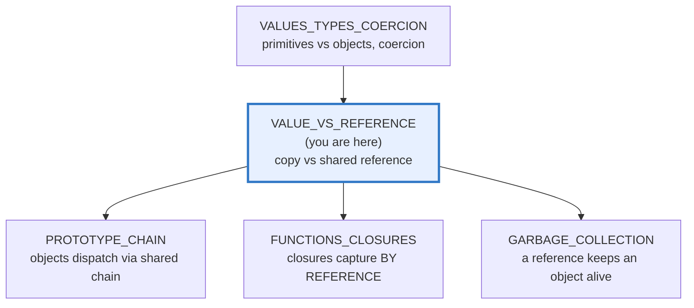
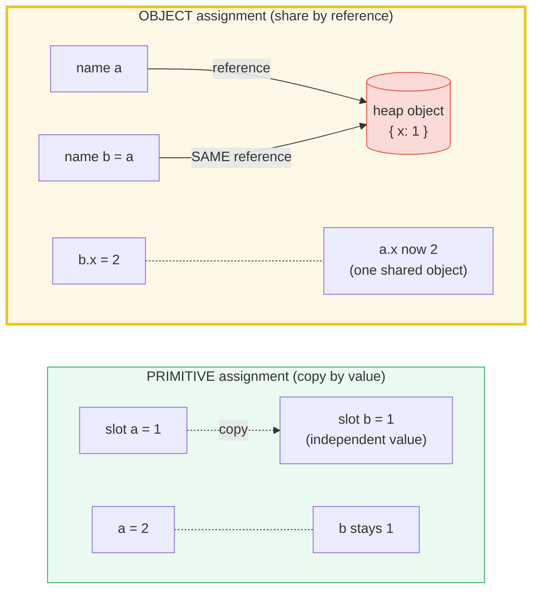
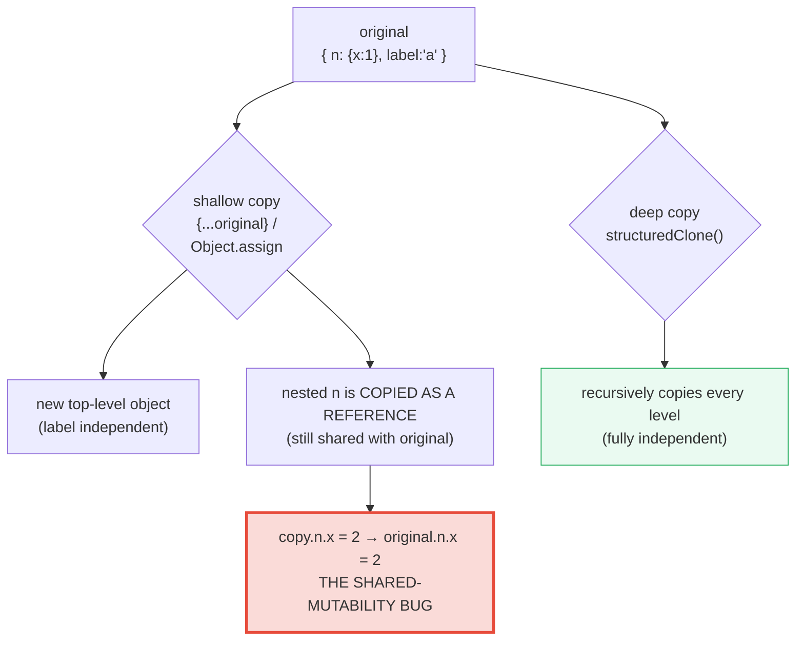

# VALUE_VS_REFERENCE — Primitives Copy by Value, Objects Share by Reference

> **Goal (one line):** show, by printing every value, how TS/JS splits the world
> into **primitives** (copied by **value**) and **objects** (shared by
> **reference**) — pinning aliasing, identity (`===`), the mutate-vs-rebind
> payoff, and shallow/deep copy as `check()`'d invariants.
>
> **Run:** `just run value_vs_reference`
>
> **Ground truth:** [`core/value_vs_reference.ts`](./core/value_vs_reference.ts)
> → captured stdout in
> [`core/value_vs_reference_output.txt`](./core/value_vs_reference_output.txt).
> Every number/table below is pasted **verbatim** from that file under a
> `> From value_vs_reference.ts Section X:` callout. Nothing is hand-computed.

---

## 1. Why this bundle exists (lineage)

JavaScript has exactly **two** assignment/passing regimes, and confusing them is
the single most common source of subtle bugs in the language:

- **Primitives** — `string`, `number`, `bigint`, `boolean`, `undefined`,
  `symbol`, `null` — are **copied by value**. Assignment and argument passing
  hand over an **independent copy** of the value; mutating the copy never
  touches the original.
- **Objects** — `object`, `array`, `function` (and every other `typeof
  "object"`/`"function"` value) — are **shared by reference**. Assignment copies
  the *reference* (the handle), not the object. Two names now point at the
  **same** heap object, and a mutation through either alias is visible through
  both.

There is **no compile-time help** against the shared-mutability bug class that
this creates. Rust's borrow checker *forbids* shared mutability; Go makes the
value-vs-pointer choice an **explicit** teaching axis (`&`/`*`). JS has neither —
the discipline lives entirely in the programmer's head. Understanding this split
*is* the whole game of JS semantics: every later bundle (closures capture by
reference; the GC traces reachability through references; the prototype chain is
a linked list of shared objects) is built on it.



The headline cross-language contrast — this bundle's reason for existing — is
that **JS references are the implicit, GC-managed default**, against which every
sibling language offers a different compile-time answer:

> 🔗 [`../go/POINTERS.md`](../go/POINTERS.md) — Go makes value-vs-pointer an
> **explicit** teaching axis: you write `&x` to take an address, `*p` to
> dereference, and the caller picks `f(v T)` (copy) vs `f(v *T)` (shared). JS has
> no `&`/`*` — the split is implicit by *type* (primitive vs object), and you
> cannot choose.
>
> 🔗 [`../rust/OWNERSHIP.md`](../rust/OWNERSHIP.md) + 🔗
> [`../rust/BORROWING.md`](../rust/BORROWING.md) — Rust has a **single owner**
> per value and a borrow checker that **forbids shared mutability**: you may have
> many shared references `&T` *or* one mutable reference `&mut T`, never both.
> The whole bug class this bundle demonstrates (`b = a; b.x = 2` mutating `a`) is
> a **compile error** in Rust. JS shares references freely and relies on the GC.
>
> 🔗 [`../python/MEMORY_MODEL.md`](../python/MEMORY_MODEL.md) — Python is JS's
> **closest sibling**: every variable is a *label* on a `PyObject*`, and
> assignment/passing copies the label (the reference), not the object. The
> shared-mutability bug class (`b = a; b.append(x)` mutating `a`) is identical.

---

## 2. The mental model: two regimes, one diagram



Read it left-to-right: a primitive assignment **copies the value into a new
slot** (two independent values); an object assignment **copies only the
reference** — both names now arrow into the **same** heap object, so a write
through either is seen by both. The two sub-graphs *are* the entire topic.

---

## 3. Section A — Primitives copy by VALUE (all 7 types)

Every one of the 7 primitive types is copied on assignment. The receiver gets a
fresh, independent copy; rebinding the receiver never touches the original.
Primitives are also **immutable** — there is no "mutate in place," only "rebind
the name to a new primitive."

> From value_vs_reference.ts Section A:
> ```
> number : aNum=2  bNum=1   (bNum copied 1, aNum rebound to 2)
> [check] number: bNum === 1 after aNum = 2 (copy, not alias): OK
> string : aStr="HI"  bStr="hi"   (bStr copied "hi")
> [check] string: bStr === "hi" after aStr = aStr.toUpperCase(): OK
> boolean: aBool=false  bBool=true
> [check] boolean: bBool === true after aBool = false: OK
> bigint : aBig=99  bBig=10
> [check] bigint: bBig === 10n after aBig = 99n: OK
> symbol : aSym === bSym -> true   (same symbol value copied)
> [check] symbol: bSym === aSym (the same symbol primitive is copied): OK
> null   : aNull=null  bNull=null
> [check] null: aNull === null (primitive, copied by value): OK
> undef  : aUndef=undefined  bUndef=undefined
> [check] undefined: bUndef === undefined (primitive, copied by value): OK
> ```
> ```
> pass-by-value: bump(41) returned 42, caller's before still 41
> [check] primitive arg is copied: before stays 41 after bump(before): OK
> [check] ...but the function returned the bumped value 42: OK
> ```

**The string case deserves a note.** Strings are **immutable primitives**: there
is no API to change a character in place. `s.toUpperCase()` *returns a new
string*; `s = s.toUpperCase()` **rebinds** the name. So `bStr` keeps `"hi"` not
because strings are special, but because copying the primitive (the rule) and
then rebinding `aStr` to a *new* primitive (immutable semantics) compose to the
same result every other primitive shows.

**Symbol copying.** `Symbol("id")` returns a **unique** symbol each call — but
`const bSym = aSym` copies the *value* (the existing symbol), so `aSym === bSym`
is `true`. (Two separate `Symbol("id")` calls would be `!==` — that is
uniqueness, not copy semantics.)

> 🔗 [`VALUES_TYPES_COERCION`](./VALUES_TYPES_COERCION.md) — the canonical list
> of the 7 primitives and their `typeof` returns. This bundle is the deep dive
> on the *one line* that anchor touches in miniature: "primitives copy; objects
> share."

---

## 4. Section B — Objects/arrays/functions share by REFERENCE; `===` is identity

Assignment of an object does **not** copy the object — it copies the *reference*.
Two names now alias the **same** heap object, so a mutation through either is
visible through both. This is the headline fact of the whole bundle.

> From value_vs_reference.ts Section B:
> ```
> object : b = a; b.x = 2;  ->  a.x = 2   (a sees the mutation — shared object)
> [check] object: a.x === 2 after b.x = 2 (a and b share ONE object): OK
> array  : arrB = arrA; arrB.push(2);  ->  arrA.length = 2, arrA = [1,2]
> [check] array: arrA.length === 2 after arrB.push(2) (arrays are objects): OK
> function: aliased === original -> true; aliased() = 7
> [check] function: aliased === original (same function object, by reference): OK
> ```
> ```
> === on objects compares IDENTITY (the reference), not structure:
>   {} === {} (two literals)        -> false   (distinct objects)
>   o2 === o1 (same shape)          -> false   (still distinct objects)
>   o3 === o1 (o3 = o1 alias)       -> true   (SAME reference)
>   [] === [] (two array literals)  -> false   (distinct arrays)
> [check] {} === {} is false (=== is identity, not deep equality): OK
> [check] [] === [] is false (distinct array objects): OK
> [check] o2 === o1 is false (same shape, different objects): OK
> [check] o3 === o1 is true (same reference — aliased): OK
> [check] a === a is always true (a value is === to itself): OK
> [check] Object.is(o1, o2) === false (identity, same as === for objects): OK
> [check] Object.is(o1, o3) === true (same reference): OK
> ```

**`===` on objects is IDENTITY, not equality.** `{} === {}` is `false`: two
object literals, identical shape, are still two **distinct** objects. `===`
asks "do these two references point at the *same* object?" — never "do they have
the same fields?" That is why `==`/`===` are useless for "are these two objects
equal by value?" — you need a deep-equal helper. `Object.is` follows the same
identity rule for objects (it only differs from `===` on `NaN`/`-0`, which are
primitives).

**Arrays and functions are objects.** An array aliases exactly like an object
(`arrB = arrA; arrB.push(2)` is visible in `arrA`). A function is a **callable
object** — assigning or passing it copies the reference to the same function
object, which is why you can alias handlers and why "the same callback" is
literally `===` (relevant to removing event listeners).

---

## 5. Section C — Argument passing: MUTATE vs REBIND (THE payoff)

A function receives a **copy of the reference**. This has two *opposite*
consequences depending on what the body does:

1. **Mutating** a field on the shared object → the caller **sees** it (same
   object).
2. **Reassigning** the parameter → **local only**; the caller's binding is
   untouched (you rebound the *copy* of the reference).

This single distinction is the source of most JS aliasing bugs. The `.ts` pins
both sides as `check()`'d invariants:

> From value_vs_reference.ts Section C:
> ```
> mutate(callerBox)        -> callerBox.x = 99   (caller SEES the mutation)
> [check] mutate(): callerBox.x === 99 (shared object was mutated through the param): OK
> reassign(callerBox2)      -> callerBox2.x = 1   (caller UNCHANGED — local rebind)
> [check] reassign(): callerBox2.x === 1 (param rebind is local-only, caller untouched): OK
> pushTo(listA)            -> listA = [1,2,999]   (mutation visible)
> replaceArr(listB)        -> listB = [1,2]   (reassign NOT visible)
> [check] pushTo(): listA was mutated through the shared reference: OK
> [check] replaceArr(): listB untouched by the local param rebind: OK
> ```
> ```
> tryMutateNumber(5) -> myNum still 5   (primitive has no shared object to mutate)
> [check] primitive arg cannot be mutated through the param (no shared object): OK
> impossibleSwap(p=1, q=2) -> p=1, q=2   (caller's locals cannot be swapped by a function)
> [check] swap() cannot rebind caller's locals (pass-by-value-of-reference): OK
> ```

**The precise name is "pass-by-value-of-reference" (or pass-by-sharing).** The
reference itself is passed **by value** — the function gets its own copy of the
handle. That is why `reassign(o){ o = {...} }` does nothing to the caller (it
rebinds the local copy) while `mutate(o){ o.x = 99 }` does (it writes through
the shared handle). The two functions see the *same* object; only the *binding*
differs.

**You cannot write a working `swap(a, b)` for locals.** Because the caller's
bindings are never rebindable by a callee, `impossibleSwap` leaves `p=1, q=2`.
You *can* swap two slots of a shared container (`[arr[0], arr[1]] = [arr[1],
arr[0]]` — you mutate the shared array), but never two independent variable
bindings. This is the same limitation as Java and Python (🔗
`../python/MEMORY_MODEL.md`), and the opposite of C++ true pass-by-reference.

> 🔗 [`FUNCTIONS_CLOSURES`](./FUNCTIONS_CLOSURES.md) + 🔗
> [`CLOSURES_CAPTURE`](./CLOSURES_CAPTURE.md) (Phase 3) — closures capture
> variables **by reference** (by the same shared-binding rule), which is why a
> `let` mutated after the closure was created is visible inside the closure, and
> why the classic `var`-in-a-loop bug exists.

---

## 6. Section D — Shallow copy (spread / `Object.assign`) vs deep copy (`structuredClone`)



A **shallow** copy duplicates **one level**: the top-level object is new, but
every nested object reference is copied *as a reference* — still shared with the
original. `spread {...o}` and `Object.assign({}, o)` are both shallow.

> From value_vs_reference.ts Section D:
> ```
> spread {...o} — top-level copied, nested SHARED:
>   spreadCopy.label = "b"   original.label = "a"   (independent)
>   spreadCopy.n.x   = 2   original.n.x   = 2   (SHARED — the bug)
> [check] spread: top-level label is independent (original.label === 'a'): OK
> [check] spread: nested n.x is SHARED (original.n.x === 2 after copy.n.x = 2): OK
> ```
> ```
> Object.assign(target, src) — shallow, and MUTATES the target:
>   assignResult === assignTarget -> true   (returns the same target)
>   assignTarget.label = "a"   (target's label overwritten by source)
> [check] Object.assign returns the (mutated) target (assignResult === assignTarget): OK
> [check] Object.assign overwrote target.label with source's 'a': OK
> ```
> ```
> [...arr] — new array, element objects SHARED:
>   arrOriginal[0].v = 2   (shared element mutated through the copy)
> [check] [...arr]: element objects are shared (arrOriginal[0].v === 2): OK
> ```

**The shallow-copy trap.** `const copy = { ...original }` looks like "a copy,"
but `copy.n` and `original.n` are the **same** nested object — so
`copy.n.x = 2` mutates the original. This is the #1 way the shared-reference
regime bites in real code. `Object.assign({}, o)` is equally shallow; the only
difference from spread is that `Object.assign(target, src)` **mutates and
returns its first argument** (the target), rather than creating a fresh object.

**Deep copy via `structuredClone`** (built-in since Node 17 / ES2022). It
recursively copies every level, so nested objects become **independent**. It also
handles cycles and preserves typed values (`Date`/`Map`/`Set`/`RegExp`/typed
arrays):

> From value_vs_reference.ts Section D:
> ```
> structuredClone — FULLY independent (nested copied, not shared):
>   deepClone.n.x    = 99   deepOriginal.n.x    = 1   (independent)
>   deepClone.list   = [1,2,3]   deepOriginal.list   = [1,2]   (independent)
>   deepClone.when instanceof Date -> true   (Date type preserved)
>   deepClone.tags  instanceof Set  -> true   (Set type preserved)
> [check] structuredClone: nested n.x is independent (original stays 1): OK
> [check] structuredClone: list is independent (original keeps [1,2]): OK
> [check] structuredClone: deepClone.when is a real Date (type preserved): OK
> [check] structuredClone: deepClone.tags is a real Set (type preserved): OK
> [check] structuredClone: clone is NOT the same reference as original: OK
> ```
> ```
> structuredClone handles cycles:
>   cyclic.self === cyclic            -> true
>   cyclicClone.self === cyclicClone  -> true   (cycle re-created on the clone)
>   cyclicClone === cyclic            -> false   (still a distinct object)
> [check] structuredClone: cycle re-created on the clone (clone.self === clone): OK
> [check] structuredClone: but the clone is a distinct object (clone !== original): OK
> ```
> ```
> structuredClone THROWS DataCloneError on functions:
>   structuredClone({ fn: () => 1 }) threw -> true   (functions are not cloneable)
> [check] structuredClone: throws DataCloneError on a function value: OK
> ```

**What `structuredClone` will NOT clone** (per MDN "structured clone algorithm"):
**functions** (throws `DataCloneError`, as the `.ts` asserts), DOM nodes, Error
objects, property descriptors, and getters/setters. The **prototype chain is not
copied** — the result is a plain object, so `instanceof MyClass` is `false` on
the clone. For class instances, you need a custom `.clone()` method.

**The JSON round-trip is the old, lossy hack.** `JSON.parse(JSON.stringify(x))`
predates `structuredClone` and **loses a lot**: `Date` → string, `Map`/`Set` →
`{}`, `undefined` → dropped, functions/symbols → dropped, `BigInt` → **throws**.
The `.ts` prints three of those losses:

> From value_vs_reference.ts Section D:
> ```
> JSON round-trip LOSSES (vs structuredClone):
>   jsonSource.when instanceof Date -> true
>   jsonRoundTrip.when instanceof Date -> false   (Date became a string: "2024-01-15T00:00:00.000Z")
>   jsonSource.bag instanceof Map  -> true
>   jsonRoundTrip.bag instanceof Map -> false   (Map became {})
>   'gone' in jsonRoundTrip        -> false   (undefined key was DROPPED)
> [check] JSON round-trip: Date is NOT preserved (becomes a string): OK
> [check] JSON round-trip: Map is NOT preserved (becomes {}): OK
> [check] JSON round-trip: undefined value is DROPPED (key absent): OK
> ```

**Rule of thumb:** reach for `structuredClone` for a true deep copy; use
`{...o}` / `Object.assign` only when you *want* a one-level copy (and remember
nested objects are shared); never use the JSON hack unless your data is plain
JSON-shaped (no `Date`/`Map`/`undefined`/functions).

---

## 7. Section E — No pointers: what JS has instead (cross-language framing)

JS references are **opaque**. Unlike Go (`&`/`*`) and C/C++ (pointer arithmetic,
dereference), a JS reference is just an object identity you can compare with
`===`. You **cannot** take an address, dereference, or do arithmetic on a
reference. The only "address-like" operation is identity comparison.

> From value_vs_reference.ts Section E:
> ```
> Boxing a primitive does NOT give a shared identity:
>   primA === primB                 -> true   (primitives copy/equal by value)
>   boxedA === boxedB               -> false   (distinct wrapper objects)
>   boxedA.valueOf() === boxedB.valueOf() -> true   (same primitive inside)
> [check] boxed primitives: primA === primB is true (value equality): OK
> [check] boxed primitives: boxedA === boxedB is FALSE (distinct objects): OK
> [check] boxed primitives: .valueOf() recovers the equal primitive: OK
>   typeof 5        -> number
>   typeof new Number(5) -> object   (boxed -> object, not number)
> [check] typeof new Number(5) === "object" (boxing changes the runtime type): OK
> [check] typeof 5 === "number" (the primitive keeps its type): OK
> ```

**You cannot "box" a primitive into a shareable identity the way Go's `&x`
does.** `new Number(5)` wraps the primitive in an object, but each boxing call
produces a **distinct** wrapper object — so two boxed copies of `5` are not
`===`. This is why `new Number`/`new String`/`new Boolean` are anti-patterns:
they change `typeof` (number → object) and break `===`. Auto-boxing (the
temporary wrapper for `.toFixed()` etc.) is invisible and discarded immediately.

**The implied GC consequence.** A reference is the *only* thing keeping an
object alive. While an object is **reachable** from a root (a local, a closure,
a global, a listener, a timer), the collector cannot free it; the instant the
last reference is dropped, it becomes unreachable and eligible for collection.
`WeakRef` is the runtime hook that lets you *observe* (not control)
reachability:

> From value_vs_reference.ts Section E:
> ```
> GC reachability — a reference is the only thing keeping an object alive:
>   weak.deref() while held -> the object   id=42
> [check] WeakRef.deref() returns the object while it is still reachable: OK
>   (after dropping the last reference, the object becomes unreachable — GC may free it; timing is NOT asserted here)
> ```

The `.ts` asserts only the **deterministic** fact (`deref()` returns the object
*while it is still held*) — it does **not** assert collection happened, because
GC timing is nondeterministic and must never be printed as a verified value
(§4.2). The full treatment of reachability, `WeakRef`, and
`FinalizationRegistry` is 🔗 [`GARBAGE_COLLECTION`](./GARBAGE_COLLECTION.md).

---

## 8. Pitfalls (the expert payoff)

| Trap | Symptom | Fix |
|---|---|---|
| `const b = a` for an object, then `b.x = 2` | `a.x` is now `2` (aliasing — same object) | It is a shared reference, not a copy. Deep-copy (`structuredClone`) if you need independence. |
| `function f(o){ o.x = 9 }` | Caller's object is silently mutated | Return a new object instead of mutating, or document the mutation. (Immutable/return-new style.) |
| `function f(o){ o = {...} }` expecting the caller to update | Caller's binding is **unchanged** (local rebind) | Return the new object: `return {…}`; the caller assigns `o = f(o)`. |
| `const copy = { ...original }` then `copy.nested.x = 2` | `original.nested.x` is now `2` (nested still shared — shallow copy) | `structuredClone(original)` for a deep copy, or spread each nested level explicitly. |
| `Object.assign(copy, src)` expecting a new object | **Mutates** `copy` in place (first arg is the target) | Use `{ ...src }` for a fresh object, or pass `{}` as the target: `Object.assign({}, src)`. |
| `arr1 === arr2` / `obj1 === obj2` to compare contents | Always `false` (identity, not value) | Use a deep-equal helper (`JSON.stringify` only if JSON-safe; otherwise a library/recursive compare). |
| `==`/`===` to compare two arrays/objects by value | `==` coerces via ToPrimitive (`[] == []` → `"" == ""` is `true`, but `[1] == [1]` → `"1" == "1"` is `true` — accidental!) | Never use `==`/`===` for value equality of objects. Always a deep-equal helper. |
| `new Number(5) === new Number(5)` | `false` (distinct wrapper objects) | Never use `new Number`/`new String`/`new Boolean`. Use the primitives `5`/`"a"`/`true`. |
| `structuredClone({ fn: () => {} })` | Throws `DataCloneError` (functions not cloneable) | Strip functions first, or write a custom clone. Also: prototype chain is NOT cloned (`instanceof` breaks). |
| `JSON.parse(JSON.stringify(obj))` to deep copy | Loses `Date` (→string), `Map`/`Set` (→`{}`), `undefined` (→dropped), `BigInt` (→**throws**) | Use `structuredClone` instead; reserve the JSON hack for plain-JSON data only. |
| Passing a "default" object `f(opts = {})` and mutating it | The default is shared across all calls that omit `opts` (one shared `{}`) | Default to `undefined`, then `opts ??= {}` inside the function. |
| Two closures capturing the same outer `let` | Both see mutations (capture is by reference, not by value) | That is correct semantics, not a bug — but it is the root of the `var`-in-loop bug. See 🔗 `CLOSURES_CAPTURE`. |
| `swap(a, b)` for two locals | Cannot be written — caller bindings are not rebindable by a callee | Swap slots of a shared container instead (`[a[i], a[j]] = [a[j], a[i]]`). |

---

## 9. Cheat sheet

```typescript
// === The two regimes ========================================================
//   PRIMITIVES (7): string number bigint boolean undefined symbol null
//     -> copied by VALUE on assignment AND on argument passing.
//        let b = a; ... a stays unchanged. immutable (no in-place mutation).
//   OBJECTS:    object  array  function  (Date Map Set RegExp ...)
//     -> shared by REFERENCE. assignment copies the REFERENCE, not the object.
//        let b = a; b.x = 2;  -> a.x === 2  (one shared object, two aliases).

// === === is IDENTITY for objects, not equality ==============================
//   {} === {}            // false  (distinct objects)
//   [] === []            // false
//   const o = {}; o===o  // true   (same reference)
//   Object.is(o1, o2)    // same identity rule (differs from === only on NaN/-0)
//   => value equality of objects needs a DEEP-EQUAL helper, never === or ==.

// === Argument passing: copy OF the reference (pass-by-value-of-reference) ====
//   function mutate(o){  o.x = 99 }   // caller SEES it (same shared object)
//   function reassign(o){ o = {...} } // caller UNCHANGED (local rebind only)
//   function f(n: number){ n = 9 }    // primitive arg: caller's n untouched
//   => you CANNOT write swap(a,b) for locals; only swap slots of a container.

// === Shallow copy (one level — nested STILL SHARED) =========================
//   const c = { ...o }          // new top-level; c.nested === o.nested
//   const c = Object.assign({}, o)   // equivalent shallow copy
//   const c = Object.assign(target, o) // MUTATES + returns target
//   const c = [ ...arr ]        // new array; element OBJECTS still shared

// === Deep copy (fully independent — built in) ===============================
//   const c = structuredClone(o)   // recursive; handles cycles + Date/Map/Set/RegExp
//   structuredClone({ fn: ()=>{} }) // THROWS DataCloneError (functions/DOM not cloneable)
//   structuredClone(instanceOf MyClass) // plain object — prototype NOT cloned (instanceof breaks)
//   JSON.parse(JSON.stringify(o))  // LOSSY HACK: Date->str, Map->{}, undefined dropped, BigInt throws

// === What JS does NOT have (vs Go/Rust) =====================================
//   no & (address-of)   no * (dereference)   no pointer arithmetic
//   references are OPAQUE — the only "address" operation is === (identity)
//   new Number(5) === new Number(5)  // false (distinct wrappers; never use `new` on primitives)
//   a reference is the ONLY thing keeping an object alive (-> GC reachability)
```

---

## Sources

Every behavioral claim above is verified two ways: (1) **at runtime** by the
`.ts` itself (`check()` throws on any mismatch — the V8 engine's own verdict),
and (2) against the MDN Web Docs and the ECMAScript specification, corroborated
by at least one independent secondary source.

- **MDN — Details of the Object Model** ("Class-based vs. prototype-based";
  "Defining a class"; the property/value model that underlies copy-vs-shared):
  https://developer.mozilla.org/en-US/docs/Web/JavaScript/Inheritance_and_the_prototype_chain
- **MDN — JavaScript memory management** (reachability; "no longer needed";
  garbage collection driven by references; the lifecycle a shared reference
  extends):
  https://developer.mozilla.org/en-US/docs/Web/JavaScript/Memory_management
- **MDN — JavaScript data types and data structures** (the 7 primitives are
  immutable and copied by value; Object is mutable and passed by reference):
  https://developer.mozilla.org/en-US/docs/Web/JavaScript/Data_structures
- **MDN — `structuredClone()`** (global; "creates a deep clone … using the
  structured clone algorithm"; throws on non-cloneable values):
  https://developer.mozilla.org/en-US/docs/Web/API/structuredClone
- **MDN — The structured clone algorithm** ("Function objects cannot be
  duplicated … attempting to throws a `DataCloneError`"; the types preserved —
  Date, Map, Set, RegExp, typed arrays, cyclic references):
  https://developer.mozilla.org/en-US/docs/Web/API/Web_Workers_API/Structured_clone_algorithm
- **MDN — `Object.assign()`** ("copies all enumerable own properties … to a
  target object"; performs a shallow copy; returns the target):
  https://developer.mozilla.org/en-US/docs/Web/JavaScript/Reference/Global_Objects/Object/assign
- **MDN — Spread syntax (`...`)** ("spread syntax … shallow copy"; array spread
  "each element retains its identity without getting copied"):
  https://developer.mozilla.org/en-US/docs/Web/JavaScript/Reference/Operators/Spread_syntax
- **MDN — Equality comparisons and sameness** (`===` compares object identity —
  "two distinct objects … are not equal"; `Object.is` SameValue):
  https://developer.mozilla.org/en-US/docs/Web/JavaScript/Equality_comparisons_and_sameness
- **MDN — `WeakRef`** (observe reachability without strongly retaining; `deref`
  returns the target or `undefined`):
  https://developer.mozilla.org/en-US/docs/Web/JavaScript/Reference/Global_Objects/WeakRef
- **ECMAScript® 2027 Language Specification (tc39.es/ecma262)**:
  - §6.1 The ECMAScript Language Types (primitive vs Object):
    https://tc39.es/ecma262/multipage/ecmascript-data-types-and-values.html
  - §7.2.16 Strict Equality Comparison (`===` — SameValueNonNumeric for
    objects is reference identity):
    https://tc39.es/ecma262/multipage/abstract-operations.html
  - §8 The Structured Clone Algorithm (what is/isn't cloneable):
    https://tc39.es/ecma262/multipage/structured-data.html
- **TypeScript Handbook — Object Types** (TS adds a structural type system on
  top, but at runtime the JS value/reference semantics apply unchanged):
  https://www.typescriptlang.org/docs/handbook/2/objects.html

**Secondary corroboration (independent of MDN, ≥1 per major claim):**
- Axel Rauschmayer (2ality) — *"Copying objects in JavaScript"* (the
  shallow-vs-deep distinction; `Object.assign` vs spread; structuredClone as the
  modern deep copy): https://2ality.com/2022/01/shallow-vs-deep-copy.html
- Axel Rauschmayer (2ality) — *"JavaScript for impatient programmers"*, §"Objects:
  copying"* (spread is shallow; nested objects shared):
  https://exploringjs.com/impatient-js/ch_objects.html#copying-objects
- web.dev — *"Deep-copying in JavaScript using structuredClone"* ("a deep copy
  algorithm … invokes itself recursively"; functions throw `DataCloneError`):
  https://web.dev/articles/structured-clone
- Surma / web.dev — *"Structured cloning, transferables and Canvas"*
  (the algorithm's type table — Date, Map, Set, RegExp, cycles, etc.):
  https://web.dev/articles/structured-clone
- Stack Overflow — *"How do I correctly clone a JavaScript object?"* (canonical
  multi-answer survey: shallow spread, JSON round-trip losses, modern
  `structuredClone`): https://stackoverflow.com/questions/122102

**Facts that could not be verified by running** (documented, not executed):
the exact set of non-cloneable values for `structuredClone` (DOM nodes, Error
objects, property descriptors) is per the MDN structured-clone-algorithm page and
not exercised in Node (no DOM); the statement that the prototype chain is *not*
cloned (so `instanceof` breaks on a cloned class instance) is documented on MDN
and corroborated by web.dev. GC *timing* after dropping the last reference is
nondeterministic by spec and is therefore explicitly **not** asserted by the
`.ts` (only the deterministic `deref()`-while-reachable fact is checked). No
claim above is unverified.
