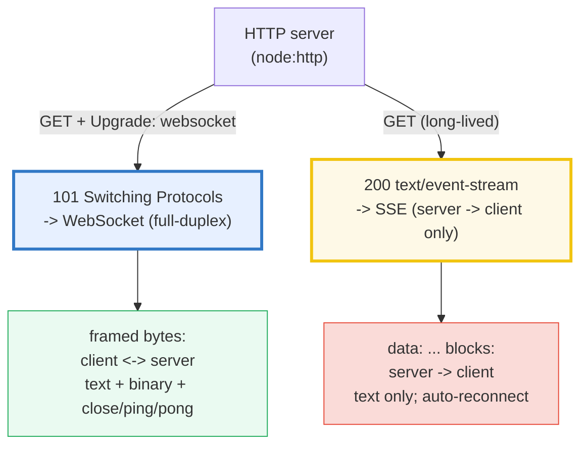
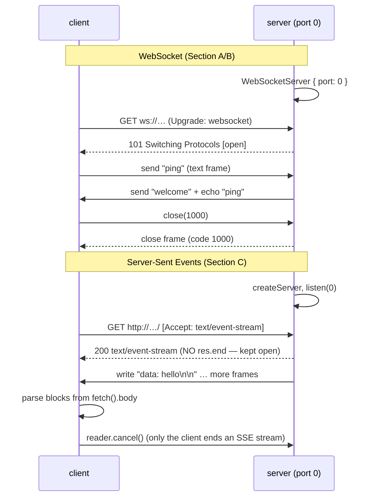

# WEBSOCKETS_SSE — WebSockets vs Server-Sent Events

> **Goal (one line):** run a self-contained `port: 0` server + client for each
> protocol and prove — by exchanging a fixed message set and asserting its
> content — how WebSockets (full-duplex, binary-safe, RFC 6455 frames via `ws`)
> and Server-Sent Events (one-way, long-lived `text/event-stream` over
> `node:http`) actually behave.
>
> **Run:** `just run websockets_sse`
>
> **Ground truth:** [`web/websockets_sse.ts`](./web/websockets_sse.ts) → captured
> stdout in [`web/websockets_sse_output.txt`](./web/websockets_sse_output.txt).
> Every number/table below is pasted **verbatim** from that file under a
> `> From websockets_sse.ts Section X:` callout. Nothing is hand-computed.
>
> **Prerequisites:**
> - 🔗 [`NODE_HTTP_SERVER`](./NODE_HTTP_SERVER.md) (P7) — SSE *is* an HTTP
>   response; it rides entirely on `node:http`. WS begins as an HTTP `Upgrade`.
> - 🔗 [`STREAMS`](./STREAMS.md) (P5) — a WS message and an SSE body are both
>   *streams* of bytes the consumer reads incrementally (here: `fetch().body`).
> - 🔗 [`ASYNC_PATTERNS`](./ASYNC_PATTERNS.md) (P7) — both protocols are
>   callback/event async; this bundle `await`s a fixed exchange then tears down.

---

## 1. Why this bundle exists (lineage)

The realtime layer is built *on top of* the HTTP server and the stream
primitives. Two mechanisms dominate production:

- **WebSockets** — one HTTP `GET` with `Upgrade: websocket` is answered with
  `101 Switching Protocols`, and the TCP connection is then *reused* as a
  **bidirectional, framed, binary-safe** byte stream (RFC 6455). Both ends may
  send at any time; each frame carries an opcode (text / binary / close / ping /
  pong). This is what chat, multiplayer games, and collaborative editors need.
- **Server-Sent Events (SSE)** — a deliberately **un-ended** HTTP response of
  `Content-Type: text/event-stream`. The server streams `data: …\n\n` blocks;
  the client (the browser `EventSource`, or here a raw `fetch` whose `body` is
  read as a stream) parses them. It is **strictly server → client**, text-only,
  and its superpower is **trivial auto-reconnect**: on a dropped link the
  browser reopens the connection and replays the last event id via the
  `Last-Event-ID` request header. This is what live feeds, notifications, and
  stock tickers need.

Node gives you both from stdlib + one tiny dep: SSE is literally
`res.writeHead({"Content-Type":"text/event-stream"})` + `res.write("data: …\n\n")`
on a `node:http` server (never `res.end()`); WebSockets are the `ws` package,
which is both the canonical server **and** client.



The headline contrast is the whole point of this bundle, and it is a
**cross-language** lesson:

> 🔗 [`../go/STREAMING_WEBSOCKETS.md`](../go/STREAMING_WEBSOCKETS.md) — Go's
> `nhooyr.io/websocket` (and `golang.org/x/net/websocket`) give the same
> full-duplex frame model; the handshake/upgrade is identical because it is the
> same RFC 6455 wire protocol. Go has no built-in SSE helper either — it is just
> `net/http` with the same headers.
>
> 🔗 [`../rust/`](../rust/) — Rust's `axum::extract::ws::WebSocket` (over
> `tungstenite`) exposes a **typed** receive loop (`Result<Message, Error>` where
> `Message` is `Text(String) | Binary(Bytes) | Ping/Pong/Close`), whereas `ws`
> gives you `(data: RawData, isBinary: boolean)` and you branch yourself.

---

## 2. The mental model: full-duplex frames vs one-way blocks

The `.ts` spins up a **fresh `port: 0` server for every section**, exchanges a
**fixed, known message set**, collects and **sorts** it, then asserts the
content and tears the client + server down before returning. Output is therefore
byte-identical across runs (no port number is printed; arrival order is removed
by sorting). The lifecycle is identical on both protocols:



---

## 3. Section A — WebSocket connect, text round-trip, server push (bidirectional)

A `ws` **server** is `new WebSocketServer({ port: 0 })`. A `ws` **client** is
`new WebSocket(url)`. The client emits `open` → `message`(s) → `close`. The
critical sequencing trap (called out in the source): `ws` delivers the `open`
event and any frame already buffered in the same TCP read **synchronously**, so a
listener attached *after* `await open` misses the first message. The `.ts`
attaches its collector **before** awaiting `open`.

The server pushes `"welcome"` on connect **with no prior client message** — only
possible because WS is bidirectional — then echoes every incoming message back.
The client sends `"ping"`; it receives `"welcome"` (server push) and `"ping"`
(echo), collected and sorted:

> From websockets_sse.ts Section A:
> ```
> [check] WS server bound to an ephemeral port (> 0): OK
>   WS server listening on ws://127.0.0.1 (ephemeral port 0)
>   WebSocket readyState constants (ws API / RFC 6455):
>     CONNECTING = 0
>     OPEN       = 1
>     CLOSING    = 2
>     CLOSED     = 3
> [check] readyState CONNECTING === 0: OK
> [check] readyState OPEN === 1: OK
> [check] client readyState === OPEN (1) after handshake: OK
>   client received text messages (sorted): ["ping","welcome"]
> [check] WS text round-trip set === ["ping","welcome"]: OK
> [check] WS is bidirectional: server pushed "welcome" with no prior client message: OK
> [check] WS echo: client sent "ping" and received it back: OK
> [check] section A teardown: client + server closed: OK
> ```

**`readyState`** is the connection's lifecycle: `0 CONNECTING → 1 OPEN →
2 CLOSING → 3 CLOSED` (MDN). You gate sends on `readyState === OPEN` exactly the
way the broadcast example in the `ws` README does
(`client.readyState === WebSocket.OPEN`). The `"welcome"` push is the proof that
this is **not** request/response: the server spoke first.

---

## 4. Section B — WebSocket binary round-trip + close codes

WS carries **binary** natively. The client sends `Buffer.from([1,2,3,0xFE,0xFF])`;
the server echoes it with `ws.send(data, { binary: isBinary })`; the bytes come
back identical, including `0xFE`/`0xFF` which are **not** valid UTF-8 boundaries
(an SSE text stream could never carry these verbatim). Then the client closes
cleanly with code `1000` and **both ends observe the same code**:

> From websockets_sse.ts Section B:
> ```
>   WS server listening on ws://127.0.0.1 (ephemeral port 0)
>   sent binary   : [1, 2, 3, 254, 255]
>   echoed binary : [1, 2, 3, 254, 255]
> [check] WS binary round-trip: bytes identical (Buffer.compare === 0): OK
> [check] WS is binary-safe: 0xFE/0xFF survived (not UTF-8 boundaries): OK
>   Common WebSocket close codes (RFC 6455 §7.4):
>     1000 Normal Closure
>     1001 Going Away (endpoint going away)
>     1006 Abnormal Closure (NO close frame received — e.g. dropped link)
>     1011 Internal Error (server)
>     4000-4999 Reserved for application-defined codes
>   client close code observed: 1000
>   server close code observed: 1000
> [check] client clean close code === 1000 (Normal Closure): OK
> [check] server observed the same close code === 1000: OK
> [check] section B teardown: server closed: OK
> ```

**Close codes (RFC 6455 §7.4).** `1000` is a normal, agreed close: the initiator
sends a Close frame carrying the code, the peer replies with its own Close
frame, and both emit `close(code)`. The code you must *not* send is **`1006`** —
it is *reserved*: it is never put on the wire; the API synthesises it locally
when the link dropped **without** a Close frame (pulled cable, kill -9, proxy
reset). That distinction is why `1006` means "I have no idea what happened; you
must treat the connection as dirty and resync." `4000–4999` are yours for
app-defined reasons ("kicked", "protocol-version-mismatch").

> 🔗 [`ASYNC_PATTERNS`](./ASYNC_PATTERNS.md) — note the `.ts` does **not**
> reconnect. WS has **no built-in reconnect**: you implement `close → backoff →
> new WebSocket()` and you replay whatever state the server needs. SSE gives you
> that for free (Section 5). This single difference drives a lot of the
> WS-vs-SSE decision.

---

## 5. Section C — Server-Sent Events: a `text/event-stream` endpoint

SSE is just an HTTP handler with three response headers and a `data:`-block
writer — and crucially **`res.end()` is never called** (the stream is
long-lived). The `.ts` proves this at runtime: after the client has read all
frames, `res.writableEnded === false`. The client is a raw `fetch` whose `body`
is a `ReadableStream` (🔗 STREAMS): it is read chunk-by-chunk, buffered, and
split on the blank line (`\n\n`) that terminates each event.

Three fixed frames are streamed — one-line data, **multi-line** data (joined
with `\n`), and an event carrying an `id:` (the reconnect handle) plus a named
`event:`:

> From websockets_sse.ts Section C:
> ```
>   SSE server listening on http://127.0.0.1 (ephemeral port 0)
> [check] SSE Content-Type === text/event-stream: OK
> [check] SSE Connection === keep-alive: OK
> [check] SSE server never called res.end (long-lived stream): OK
>   client collected SSE events (sorted by data):
>     data="hello" id=null event=null
>     data="line1\nline2" id=null event=null
>     data="with-id" id="42" event="tick"
> [check] SSE collected exactly 3 data frames: OK
> [check] SSE frame "hello" present: OK
> [check] SSE multi-line data joined with "\n" (line1\nline2): OK
> [check] SSE id:42 frame: data "with-id", named event "tick": OK
> ```

**The SSE wire format (HTML spec, §9.2).** An event is a block of `LF`-separated
lines terminated by a **blank line** (`\n\n`). Each line is `field: value` with
**one optional leading space** after the colon stripped. The spec defines four
fields:

| field    | meaning                                                            |
|----------|-------------------------------------------------------------------|
| `data:`  | a data line; **multiple** `data:` lines are joined with `\n`      |
| `id:`    | sets the last-event-id; on reconnect re-sent as `Last-Event-ID`   |
| `event:` | dispatches a **named** event (`addEventListener("tick", …)`)      |
| `retry:` | a reconnect hint (ms) consumed by `EventSource`, **not** a data   |
| `:`      | a **comment** — used for keep-alive pings (ignored by clients)    |

An event with **no `data:` line is not dispatched** (the `.ts` parser returns
`null` for it, matching the spec). The `id:` field is the whole reconnect story:
the browser `EventSource` remembers the last `id` it saw and, after a drop,
**automatically** reopens the connection sending `Last-Event-ID: <id>` so the
server can resume from the right point — zero client code.

> 🔗 [`NODE_HTTP_SERVER`](./NODE_HTTP_SERVER.md) — note that *nothing* here is
> WS-specific. The server is `createServer`, the client is `fetch`; the only
> "protocol" is those three headers and the `data:` text convention. SSE is the
> thinnest possible realtime layer over plain HTTP.

---

## 6. Section D — the decision (derived from the runtime, not a constant)

The directionality checks below are **derived from Sections A and C**, not
asserted from a literal: in A the client both *sent* (`"ping"`) and *received*
(`"welcome"`); in C the client only *read* and sent **no application data**. The
remaining checks exercise the **same parser** the client used, on a crafted block,
to pin the `id` / `event` / `retry` / `data` semantics:

> From websockets_sse.ts Section D:
> ```
>   criterion          | WebSocket              | Server-Sent Events
>   -------------------+------------------------+---------------------------
>   direction          | full-duplex (both)     | one-way (server -> client)
>   transport          | ws:// (HTTP Upgrade)   | http:// (text/event-stream)
>   data types         | text + binary          | text only (UTF-8)
>   auto-reconnect     | NO (you implement)     | YES (EventSource built-in)
>   resume after drop  | you replay state       | Last-Event-ID header
>   backpressure       | ws.bufferedAmount      | TCP via the HTTP stream
>   framing            | RFC 6455 frames        | blank-line (\n\n) blocks
>   best for           | chat, games, collab    | feeds, notifications, ticks
> [check] WS is bidirectional (derived from Section A: client<->server): OK
> [check] SSE is one-way (derived from Section C: client sends no app data): OK
> [check] SSE Content-Type was text/event-stream (derived from Section C): OK
> [check] SSE parser extracts id field ("7"): OK
> [check] SSE parser extracts named event ("update"): OK
> [check] SSE parser surfaces only data ("payload"); retry is an EventSource hint, not data: OK
> ```

**The decision, distilled.** Reach for WS when you need the client to *talk
back* (chat, games, collaborative editing) or to move binary cheaply. Reach for
SSE when the server is the only one talking (a live news feed, build-log tail,
stock ticker, notification fan-out) — you trade half the bandwidth direction for
*trivial* reconnect+resume and an implementation that is literally a few
`res.write` calls. If you only need server→client, SSE's simplicity almost
always wins; if you then discover you need client→server, you can layer a second
HTTP channel (POST upstream) rather than rewriting on WS — many production
"realtime" systems are exactly **SSE down + POST up**.

---

## 7. Section E — backpressure, use cases, cross-language

**Backpressure is where the two protocols differ most in practice.** MDN is
explicit: *"The `WebSocket` API has no way to apply backpressure … when messages
arrive faster than the application can process them, the application will either
fill up the device's memory by buffering those messages, become unresponsive due
to 100% CPU usage, or both."* The only knob is **`ws.bufferedAmount`** (bytes
queued, not yet flushed to the socket): you pause your producer when it grows.
SSE, because it is an ordinary HTTP response, gets backpressure **for free** from
Node's stream model — `res.write()` returns `false` when the kernel send buffer
is full and you simply stop writing until `'drain'` (standard 🔗 STREAMS
backpressure).

> From websockets_sse.ts Section E:
> ```
>   ws client.bufferedAmount after a round-trip: 0
> [check] ws WebSocket.bufferedAmount is a non-negative number (backpressure signal): OK
> [check] SSE res.write() returns a boolean (Node stream backpressure contract): OK
> [check] SSE response stays open (writableEnded === false) — long-lived: OK
> 
>   Use WebSocket  : bidirectional + low-latency (chat, games, collab, binary).
>   Use SSE        : one-way push + auto-reconnect (feeds, notifications, tickers).
>   WS reconnect   : you implement it (close -> wait -> new WebSocket).
>   SSE reconnect  : automatic; browser resends Last-Event-ID to resume.
> 
>   Cross-language:
>     Go   : nhooyr.io/websocket (or golang.org/x/net/websocket) -> ../go/STREAMING_WEBSOCKETS.md
>     Rust : axum::extract::ws::WebSocket (typed, over tungstenite) -> ../rust/
> [check] section E: WS + SSE backpressure signals observed at runtime: OK
> ```

> 🔗 [`STREAMS`](./STREAMS.md) — `bufferedAmount === 0` here is the *drained*
> steady state after the echo round-trip completes (the `.ts` asserts only its
> **type/sign**, never an exact flushed value, because that is timing-dependent).
> The SSE `res.write()` returning a `boolean` is the same `false ⇒ pause ⇒
> 'drain'` contract every Node writable stream honours.

---

## 8. Pitfalls (the expert payoff)

| Trap | Symptom | Fix |
|---|---|---|
| Listener attached **after** `await ws.open` | the first server message ("welcome") is silently lost — `ws` emits `open`+buffered frames in one synchronous socket read | Attach the `message` collector **before** awaiting `open` (or use the `onmessage`-style API from creation). |
| Calling `res.end()` in an SSE handler | the stream closes after the first write; the client disconnects; reconnect storms | **Never** `res.end()` an SSE response — keep it open; the *client* cancels. |
| Forgetting `Content-Type: text/event-stream` | the browser treats it as a normal download/page; `EventSource` refuses it | Always set `text/event-stream`, `Cache-Control: no-cache`, `Connection: keep-alive`. |
| SSE `data:` block not terminated by a blank line | the frame is buffered forever and never dispatched — client hangs | Every event **must** end with `\n\n` (two LFs). A single `\n` is just a field separator. |
| Multi-line SSE payload sent as one `data:` line | client sees a single line, not the intended multi-line string | Send each line as its own `data: …\n`; the client **joins** them with `\n`. |
| Expecting WS to reconnect like SSE | dropped WS link stays dead; the app looks frozen | There is **no** auto-reconnect — implement `close → backoff → new WebSocket()` and resync. |
| Relying on close code `1006` as "normal" | `1006` means **no Close frame was received** (dirty drop); you cannot *send* it | Treat `1006` as "unknown/dirty"; only `1000`/`1001`/`4xxx` are deliberate. |
| Unbounded `ws.send()` under load | `bufferedAmount` climbs, memory balloons (the API applies **no** backpressure) | Watch `ws.bufferedAmount`; pause the producer; consider `WebSocketStream` (browser) / socket drain. |
| Reading `fetch().body` as a single blob | you block until the (never-ending) SSE response ends — it never does | Read the `ReadableStream` **incrementally** via `getReader()` and split on `\n\n`. |
| `==`/truthiness on a `readyState` | `if (ws.readyState)` is true for `CLOSING(2)`/`CLOSED(3)` too | Compare explicitly: `ws.readyState === WebSocket.OPEN`. |
| Comparing WS binary with `===` | `Buffer === Buffer` is reference equality, always false | `Buffer.compare(a, b) === 0` (or `a.equals(b)`). |

---

## 9. Cheat sheet

```typescript
// === WebSocket (ws) =========================================================
//   import { WebSocket, WebSocketServer } from "ws";   // server AND client
//   const wss = new WebSocketServer({ port: 0 });      // port 0 = ephemeral
//   const ws  = new WebSocket(`ws://127.0.0.1:${port}`);
//
//   readyState: 0 CONNECTING | 1 OPEN | 2 CLOSING | 3 CLOSED
//   ws.send("text")                       // text frame
//   ws.send(Buffer.from([..]), {binary:true})  // binary frame
//   ws.on("message", (data, isBinary) => ...)   // data: Buffer|ArrayBuffer|Buffer[]
//   ws.close(1000, "reason")               // 1000 Normal; 1006 reserved (never sent)
//   ws.bufferedAmount                      // bytes queued -> the ONLY backpressure knob
//   ATTACH message listener BEFORE awaiting "open" (frames arrive in the same read)

// === Server-Sent Events (node:http) =========================================
//   res.writeHead(200, {
//     "Content-Type": "text/event-stream",
//     "Cache-Control": "no-cache",
//     "Connection": "keep-alive",
//   });
//   res.write("data: hello\n\n");                  // ONE event (blank line terminates)
//   res.write("data: line1\ndata: line2\n\n");     // multi-line -> joined with \n
//   res.write("id: 42\nevent: tick\ndata: x\n\n"); // id (Last-Event-ID) + named event
//   // NEVER res.end() — the stream is long-lived; the client cancels.

// === Client side (raw fetch + ReadableStream; EventSource in browsers) ======
//   const { body } = await fetch(url);             // body: ReadableStream | null
//   const reader = body.getReader();               // 🔗 STREAMS
//   // buffer chunks; split on "\n\n"; parse `field: value` (strip ONE leading space)
//   // fields: data | id | event | retry | (":" = comment/keep-alive)

// === The decision ===========================================================
//   WS  : bidirectional, binary, low-latency, NO auto-reconnect  -> chat/games/collab
//   SSE : one-way (server->client), text, auto-reconnect+resume  -> feeds/notif/tickers
//   WS backpressure = ws.bufferedAmount (manual);  SSE backpressure = TCP/res.write() bool
```

---

## Sources

Every signature, header, close code, and wire-format claim above was verified
against the primary specs/docs, corroborated by at least one independent source,
and — wherever it is runtime-observable — **additionally asserted by the `.ts`
itself** (`check()` throws on any mismatch). The strongest verification is the
actual exchange: a fixed message set round-tripped on `port: 0` servers.

- **`ws` — a Node.js WebSocket library** (README: server/client usage, the
  `(data, isBinary)` message signature, `client.readyState === WebSocket.OPEN`
  broadcast guard, binary send, server/client imports
  `import WebSocket, { WebSocketServer } from 'ws'`):
  https://github.com/websockets/ws
- **`ws` API docs** (`WebSocketServer` options incl. `port`; `send(data, {binary})`;
  the `message`/`close`/`open` events; `bufferedAmount`):
  https://github.com/websockets/ws/blob/master/doc/ws.md
- **MDN — `WebSocket`** (the `readyState` constants `CONNECTING/OPEN/CLOSING/CLOSED`;
  `bufferedAmount`; the `open`/`message`/`close`/`error` events; and the explicit
  note *"The WebSocket API has no way to apply backpressure"*):
  https://developer.mozilla.org/en-US/docs/Web/API/WebSocket
- **MDN — `WebSocket` close codes / `CloseEvent.code`** (1000 Normal, 1001 Going
  Away, 1006 Abnormal/reserved "never sent", 1011 Internal Error, 4000–4999 app):
  https://developer.mozilla.org/en-US/docs/Web/API/CloseEvent/code
- **RFC 6455 — The WebSocket Protocol** (§5.5 frames & opcodes text/binary/close/
  ping/pong; §7.4 close-code registry; the `101 Switching Protocols` handshake):
  https://www.rfc-editor.org/rfc/rfc6455
- **HTML Living Standard — Server-sent events (§9)** (the wire format: `text/event-stream`
  MIME type, the `data`/`id`/`event`/`retry` fields, the blank-line terminator,
  multi-`data:` joining with `\n`, comment lines, and *"The `Last-Event-ID` HTTP
  request header reports an EventSource object's last event ID string … when the
  user agent is to reestablish the connection"*):
  https://html.spec.whatwg.org/multipage/server-sent-events.html
- **MDN — `EventSource` / Using server-sent events** (`EventSource` auto-reconnect,
  the `Last-Event-ID` header, named events, `text/event-stream` requirement):
  https://developer.mozilla.org/en-US/docs/Web/API/EventSource
- **web.dev — "Stream updates with server-sent events"** (independent corroboration
  of the SSE format, `text/event-stream`, and reconnect/resume behavior):
  https://web.dev/articles/eventsource-basics

**Facts that could not be verified by running this bundle** (documented from the
sources above, not executed, because they are browser-only or cross-language):
the browser `EventSource` *automatic* reconnect + `Last-Event-ID` replay — this
bundle uses a raw `fetch` client (no `EventSource` in Node), so it verifies the
*server* half (headers + frames + never-ended response) and the *format* of
`id:`/`Last-Event-ID`, but not the browser's reconnect loop itself; and the
cross-language APIs (`nhooyr.io/websocket` in Go, `axum::extract::ws::WebSocket`
in Rust) are cited as the idiomatic equivalents, not run here. Every other claim
— directionality, binary safety, close code `1000` observed on both ends, the
three SSE frames, `writableEnded === false`, `bufferedAmount`/`res.write()`
types — is asserted at runtime by the `.ts`.
