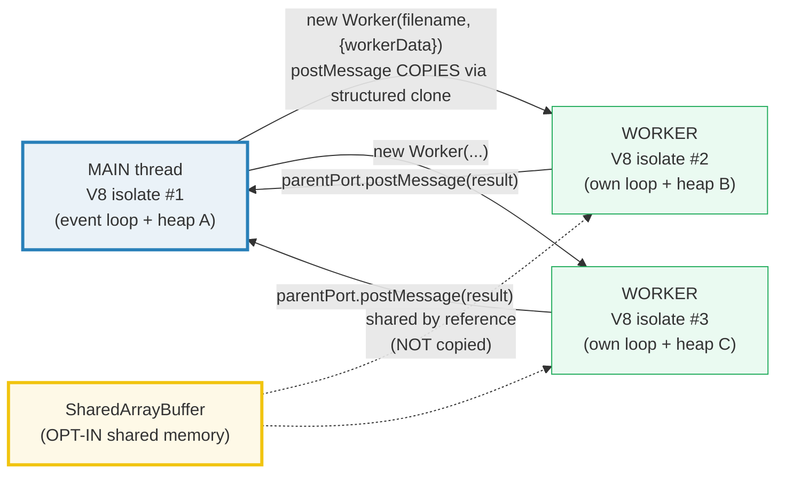
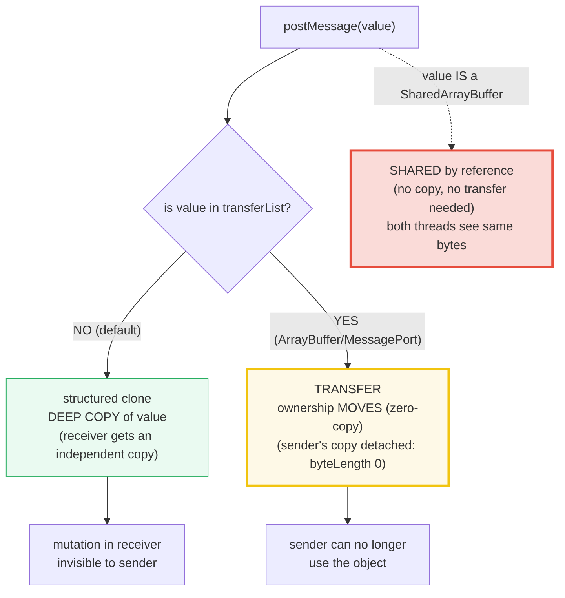

# WORKER_THREADS — Real Parallel JS (One V8 Isolate Per Worker)

> **Goal (one line):** show, by spawning real `node:worker_threads` Workers, that
> each worker is a **separate V8 isolate** (own event loop + heap), that
> `postMessage` **copies** via structured clone (worker mutations are invisible to
> main), that `MessagePort` + transferables do a **zero-copy ownership move**, and
> that N workers must be **collected + sorted** for deterministic output.
>
> **Run:** `just run worker_threads`
>
> **Ground truth:** [`worker_threads.ts`](./core/worker_threads.ts) → captured
> stdout in [`worker_threads_output.txt`](./core/worker_threads_output.txt).
> Every number/table below is pasted **verbatim** from that file under a
> `> From worker_threads.ts Section X:` callout. Nothing is hand-computed.
>
> **Prerequisites:**
> - 🔗 [`EVENT_LOOP`](./EVENT_LOOP.md) (Phase 4) — *read first*. Workers exist
>   precisely because the main thread has ONE call stack + ONE event loop. Each
>   worker spawned here gets its **own**.
> - 🔗 [`VALUE_VS_REFERENCE`](./VALUE_VS_REFERENCE.md) (Phase 3) — the
>   primitive-copies / object-shares split, generalized here to "postMessage
>   copies the whole object graph via structured clone."

---

## 1. Why this bundle exists (lineage)

JavaScript is **single-threaded**: one call stack, one event loop, one heap.
That model is superb for I/O-bound work — `await` lets one thread juggle
thousands of concurrent sockets (🔗 `EVENT_LOOP`) — but it is fatal for
**CPU-bound** JS: a tight loop blocks the entire event loop, freezing every
timer, request, and handler. `worker_threads` (Node ≥10, stable ≥12) is the
escape hatch: each `Worker` is a **fully separate V8 isolate** with its **own**
event loop, heap, libuv loop, and globals, running **true parallel JS** on
another OS thread.

The headline contrast that this whole bundle turns on is the **default memory
model**. Go goroutines and Rust OS threads **share** an address space and
coordinate through channels / `Send`+`Sync` ownership. JS workers do the
**opposite**: by default they share **nothing** — `postMessage` **copies** the
message via the **structured clone** algorithm (the same machinery as
`structuredClone()`). Mutating a received object in a worker cannot leak back to
main. `SharedArrayBuffer` is the *opt-in* exception that restores shared memory
(🔗 `SHARED_MEMORY_ATOMICS`).



**Cross-language pivot (the point of the whole curriculum):**

> 🔗 [`../go/GOROUTINES.md`](../go/GOROUTINES.md) — Go goroutines are
> **lightweight** (~KB stack, multiplexed onto a few OS threads by the runtime)
> and **share** the entire address space, coordinating via **channels**
> (`chan`). The default is SHARE; the discipline is *"don't communicate by
> sharing memory; share memory by communicating."* JS workers invert this: the
> default is COPY (no shared mutable state to race on), at the cost of a full
> V8 isolate per worker (~tens of MB).
>
> 🔗 [`../rust/THREADS.md`](../rust/THREADS.md) — Rust uses **OS threads** that
> share memory freely, but the compiler enforces safe sharing at compile time via
> the `Send`/`Sync` marker traits and the ownership/borrowing rules. JS has **no
> such compile-time gate** — it avoids data races *by not sharing mutable memory
> in the first place* (structured clone). `SharedArrayBuffer` reintroduces
> shared mutable memory and therefore reintroduces the need for manual
> synchronization (`Atomics`), exactly the class of bug Rust prevents statically.

**Sibling links within TS:**

- 🔗 [`EVENT_LOOP`](./EVENT_LOOP.md) (Phase 4) — each Worker here has its **own**
  event loop + microtask/macrotask queues. Spawning a worker spawns a *parallel
  loop*, not a callback on the main loop.
- 🔗 [`VALUE_VS_REFERENCE`](./VALUE_VS_REFERENCE.md) (Phase 3) — `postMessage`
  generalizes "objects share a reference" to "structured clone gives the receiver
  an independent **deep copy**." The mutation-isolation check in Section B is the
  same axis, now across an isolate boundary.
- 🔗 [`PROMISES`](./PROMISES.md) (Phase 4) — Promises schedule on the *same*
  thread; they give concurrency for I/O, not parallelism for CPU. Workers give
  parallelism. Section D's `Promise.all` over workers is the bridge.
- 🔗 `SHARED_MEMORY_ATOMICS` (Phase 4) — owns the deep dive on
  `SharedArrayBuffer` + `Atomics`. Section E is only the preview.

---

## 2. The mental model: one V8 isolate per worker, postMessage copies

A `Worker` is **not** a green thread and **not** a fiber sharing one heap. It is
a second V8 instance: its own interpreter, its own heap, its own libuv event
loop, its own `globalThis`. The **only** connections to the main thread are the
**message channels** between them (`parentPort` ↔ the `Worker` object, plus any
extra `MessageChannel` ports you create). Messages cross that boundary by being
**serialized + deserialized** through the structured-clone algorithm.



The three ways data crosses the worker boundary, all observable in this bundle:

| Mechanism | What happens | Cost | Section |
|---|---|---|---|
| **structured clone** (default) | receiver gets a **deep copy**; mutation isolated | proportional to object size (serialized twice) | B |
| **transfer** (`transferList`) | **ownership moves**; sender's copy **detached** | zero-copy, but one-way move | C |
| **`SharedArrayBuffer`** | **shared by reference**; both threads read/write same bytes | no copy; needs `Atomics` to be safe | E |

> From the Node.js docs (verbatim): *"Workers (threads) are useful for performing
> CPU-intensive JavaScript operations. They do not help much with I/O-intensive
> work. The Node.js built-in asynchronous I/O operations are more efficient than
> Workers can be."* — `nodejs.org/api/worker_threads.html`

---

## 3. Section A — worker_threads basics + the `__filename` self-worker idiom

The bundle is a **single file that runs in both roles**. At the very top it
branches on `isMainThread`: `false` → dispatch to `runWorker()` and return;
`true` → run `main()`. Main spawns workers with
`new Worker(__filename, { workerData })`, so the worker **re-executes this exact
file** in worker role. (Standard Node idiom — keeps the bundle single-file with
no sibling worker module.)

> **ESM note.** `__filename` is a **CommonJS global**, not available in ESM.
> `core/` is `"type": "module"`, so the file reconstructs it from
> `import.meta.url` via `fileURLToPath()` — the canonical ESM equivalent. `Worker`
> accepts a file **path**, not a URL, so this reconstruction is required.

> From worker_threads.ts Section A:
> ```
> MAIN thread role:
>   isMainThread === true   (this file is running as MAIN)
>   typeof Worker   === function
>   __filename (ESM, via fileURLToPath): /Volumes/data/workspace/tutorials/ts/core/worker_threads.ts
> 
> WORKER thread role (collected from the worker, printed by main):
>   worker.isMainThread === false   (FALSE — separate isolate)
>   worker.hasParentPort === true
>   worker echoed workerData.id === 7
>   worker exited with code 0
> [check] worker.isMainThread === false (worker is a separate role): OK
> [check] worker.hasParentPort === true: OK
> [check] worker received workerData (id echoed back === 7): OK
> [check] worker exited code 0 after posting once (no listener held it alive): OK
> [check] main.isMainThread === true (main thread): OK
> ```

**Why the worker exits on its own.** A worker is a normal Node process-in-miniature:
when its event loop drains (no pending timers, listeners, or ports holding a
ref), it exits and emits `'exit'` with code `0`. The "role" worker above does
sync work, posts one result, and returns — nothing holds its loop alive, so it
exits cleanly. **Only** a worker that owns an active `MessagePort` (Section C's
`port-owner`) refuses to exit and must be `terminate()`'d.

> 🔗 `EVENT_LOOP` — the worker's own loop is structurally identical to the main
> loop (microtask queue, macrotask queue, libuv thread pool). Spawning N workers
> = N parallel event loops, each able to block on CPU without stalling the others.

---

## 4. Section B — `postMessage` COPIES (structured clone): the isolation payoff

This is the **central** fact of worker communication. `workerData` (and any
`postMessage`) crosses the isolate boundary via the **structured clone**
algorithm (HTML spec §2.8): the value is serialized into a structured
representation and deserialized on the other side, producing an **independent
deep copy**. The worker can mutate its copy freely — main's original is
untouched.

> From worker_threads.ts Section B:
> ```
> MAIN before spawn:
>   obj.x === 1, obj.nested.a === 10
> 
> WORKER reported (it mutated ITS cloned copy):
>   worker.obj.x === 2   (mutated to 2)
>   worker.obj.nested.a === 99   (mutated to 99, deep)
> [check] worker DID mutate its own copy (reportedX === 2): OK
> [check] clone is DEEP (nested.a also mutated in worker's copy === 99): OK
> 
> MAIN after worker finished (THE PAYOFF — main's original is untouched):
>   obj.x === 1   (still 1: postMessage gave the worker a COPY)
>   obj.nested.a === 10   (still 10: deep clone isolation)
> [check] main.obj.x still === 1 (postMessage COPIED, did not share): OK
> [check] main.obj.nested.a still === 10 (deep copy, nested untouched): OK
> 
> structuredClone() is the SAME machinery, exposed standalone (ES2022):
>   clone.x mutated to 555, but obj.x still 1
> [check] structuredClone produces an independent deep copy (obj.x still 1): OK
> ```

**The trace.** Main builds `{ x: 1, nested: { a: 10 } }` and passes it as
`workerData`. Structured clone walks the object graph: it copies `x`, recurses
into `nested`, and copies `a` — producing a fully independent object in the
worker's heap. The worker sets `x = 2` and `nested.a = 99` on **its** copy and
reports both back. Main then reads its **own** `obj.x` and `obj.nested.a`:
both are still `1` and `10`. There is no shared reference across the isolate
boundary — by construction, a data race on plain objects is **impossible**.

**`structuredClone()` is the standalone face of the same algorithm.** ES2022
exposed the structured-clone machinery as a global function. `structuredClone(x)`
produces the identical deep copy that `postMessage` would; the check above
mutates the clone and confirms the original is untouched. This is the cleanest
way to reason about what `postMessage` does to your data.

> 🔗 `VALUE_VS_REFERENCE` — within one thread, assigning an object makes an
> **alias** (shared reference, mutation visible everywhere). Across the worker
> boundary, structured clone **breaks** that aliasing: the receiver gets a deep
> copy. The shared-mutability bug class that dominates single-threaded JS simply
> does not exist across `postMessage` (for non-`Shared` values).

**What structured clone can and cannot copy.** It handles plain objects, arrays,
`Map`/`Set`, `Date`, `RegExp`, `Blob`, `ArrayBuffer`, typed arrays, **and**
`Error` (since Node 17 / V8 ≈9.5). It **cannot** copy: **functions**, **DOM
nodes**, **class instances become plain objects** (the prototype chain is NOT
preserved — methods survive only as own enumerable properties if at all), and
**`Symbol`-keyed properties are dropped**. `SharedArrayBuffer` is special-cased
to be **shared**, not cloned (Section E).

---

## 5. Section C — `MessagePort` two-way channel + transferable ArrayBuffer

Every `Worker` comes with a built-in channel: `parentPort` (worker side) ↔ the
`Worker` object (main side). When you need an **additional**, independent
two-way channel, `new MessageChannel()` creates a **pair of entangled ports**
(`port1`, `port2`) — a message sent on one appears on the other. Transfer one
end to a worker and you have a private side-channel, decoupled from the main
worker channel.

The same `postMessage(value, transferList)` signature is also how **transferable
objects** move. Listing an `ArrayBuffer` (or `MessagePort`, or `FileHandle`,
etc.) in `transferList` **transfers ownership** instead of cloning: the bytes
are handed to the receiver **zero-copy**, and the sender's copy is **detached**
(`byteLength` becomes `0`, reads throw). This is the efficient path for large
binary buffers.

> From worker_threads.ts Section C:
> ```
> MessagePort round-trip (main ping -> worker pong), collected + sorted:
>   pong:ping-1
>   pong:ping-2
> [check] both pings got a pong (collected count === 2): OK
> [check] pong payload is the echoed ping (sorted[0] === 'pong:ping-1'): OK
> port-owner worker terminated by main -> exit code 1
> [check] worker.terminate() resolves with the exit code (1): OK
> 
> Transferable ArrayBuffer (ownership MOVES, zero-copy):
>   main before transfer: ab.byteLength === 8, view[0] === 1234
>   worker received:     byteLength === 8, first === 1234
> [check] worker received the FULL buffer (byteLength 8, not copied): OK
> [check] worker read the value main wrote (first === 1234): OK
>   main AFTER transfer: ab.byteLength === 0   (DETACHED -> 0, ownership moved)
> [check] ArrayBuffer detached in sender after transfer (byteLength === 0): OK
> ```

**The MessagePort round-trip.** Main creates `{ port1, port2 }`, spawns a worker,
waits for `port-ready`, then `worker.postMessage({ port: port2 }, [port2])`. The
**transferList** `[port2]` hands ownership of `port2` to the worker (main's
`port2` is now dead). Main sends `ping-1` / `ping-2` on `port1`; the worker
receives them on its `port2` and replies `pong:<ping>`. The pongs are collected
into an array and **sorted** before printing (so output is deterministic
regardless of which ping arrived first). Because the worker now **owns** an
active port, it will not exit on its own — main calls `worker.terminate()`,
which aborts the worker and resolves with exit code `1` (and emits `'exit'`
with `1`).

**The transferable ArrayBuffer.** Main allocates an 8-byte `ArrayBuffer`, writes
`1234` via an `Int32Array` view, and spawns the worker with the view in
`workerData` **and the buffer in `transferList`**. The worker receives the full
buffer (`byteLength 8`, value `1234`) — but it is the **same** underlying memory,
not a copy. Meanwhile main's `ab.byteLength` is now `0`: ownership moved, the
sender's buffer is detached. (Note: `transferList` must be passed on the
`Worker` constructor for `workerData`, or as the 2nd arg to `port.postMessage`.
Forgetting it silently falls back to **cloning** — the buffer would be copied
and stay alive in the sender. The bundle's first run hit exactly this trap;
`transferList` is now explicit.)

> 🔗 `../rust/OWNERSHIP.md` — Rust's ownership model makes this "move" the
> **default** for non-`Copy` types (`let b = a;` moves `a`). JS has no move
> semantics in normal code (assignment always aliases); `transferList` is the
> one place the runtime performs a real ownership transfer.

---

## 6. Section D — collect+sort determinism + lifecycle (exit / terminate)

Worker output is **nondeterministic in arrival order**: five workers spawned
together race on OS scheduling, and whichever finishes first posts first. If the
bundle printed each result as it arrived, `_output.txt` would differ every run
(violating §4.2 rule 4). The discipline: **collect every result into an array,
sort it, and print only after all workers have joined.** The bundle does exactly
that — `Promise.all` over the spawn promises, then `.sort()` — and the result is
**byte-identical across five consecutive runs**.

> From worker_threads.ts Section D:
> ```
> Spawned 5 workers; each posted back id -> id*id. Collected + sorted:
>   worker#1 -> 1
>   worker#2 -> 4
>   worker#3 -> 9
>   worker#4 -> 16
>   worker#5 -> 25
> [check] collected exactly N results: OK
> [check] results sorted ascending by id (first.id === 1): OK
> [check] compute is correct (id 5 -> 25): OK
> 
> Lifecycle — exit codes collected + sorted (0 = clean exit):
>   [0, 0, 0, 0, 0]
> [check] every fire-and-forget worker exited code 0: OK
> [check] sorted result SET matches expected (deterministic, order-independent): OK
> ```

**Why the sorted *set* is the only thing that's reproducible.** The five
`worker#i -> i*i` lines are printed in **sorted** order, not arrival order. The
`[0, 0, 0, 0, 0]` exit codes are likewise collected and sorted. Both are
invariant under any interleaving the scheduler chooses — which is why `just out
worker_threads` is byte-stable run after run. This is the universal rule for any
concurrency bundle in this folder (🔗 `PROMISES` applies the same collect+sort to
microtask ordering).

**Lifecycle events.** Every `Worker` emits: `'message'` (a `postMessage`
arrived from the worker), `'error'` (an **uncaught** throw inside the worker —
it does NOT crash main, it surfaces here as a rejected-style event), and
`'exit'` (code `0` for clean completion, `1` for uncaught exception **or** for
`terminate()`). The bundle collects all five exit codes and confirms they are
`0`; Section C separately confirms `terminate()` yields `1`. Workers do **not**
propagate exceptions by themselves — you must attach an `'error'` handler or the
process will treat it as an unhandled error.

---

## 7. Section E — when to use workers + SharedArrayBuffer preview + cross-language

**SharedArrayBuffer** is the opt-in escape from "postMessage copies." Pass a
`SharedArrayBuffer` in `workerData` and it is **shared by reference** — no
clone, no transfer. Both threads read and write the **same** bytes. The check
below confirms it: the worker writes `42` at index `3`, and main reads `42` from
its view of the same buffer. This is genuine shared mutable memory across
threads, which is why it needs `Atomics` for safe synchronization — the subject
of 🔗 `SHARED_MEMORY_ATOMICS`.

> From worker_threads.ts Section E:
> ```
> SharedArrayBuffer (SHARED memory, NOT copied):
>   worker wrote arr[3] = 42 into the SAME buffer
>   main reads mainView[3] === 42   (visible: same memory, no copy)
> [check] SharedArrayBuffer is shared (main sees worker's write, value 42): OK
> 
> When to reach for worker_threads (vs async I/O on the event loop):
>   CPU-bound hashing/crypto     : YES — escapes the single thread      (pbkdf2, bcrypt, sha256 over big input)
>   image / signal processing    : YES — true parallel compute          (FFT, resize, filter over a big buffer)
>   big pure compute             : YES — parallel JS across cores       (matrix multiply, search, simulation)
>   file / network I/O           : NO — async I/O is already concurrent (fs.promises, fetch, net (libuv pool))
>   DB queries (await)           : NO — I/O-bound, not CPU-bound        (workers add overhead, no gain)
>   thousands of tiny tasks      : NO — workers are HEAVY (~tens of MB) (use the event loop / a task pool)
> [check] guidance: CPU-bound work is the worker_threads use-case (>=1 YES row): OK
> 
> Cost + cross-language contrast (the DEFAULT memory model):
>   JS worker_threads : separate V8 isolate, ~tens of MB each, COPY by default
>   Go goroutines     : ~KB stack, SHARE address space, coordinate via CHANNELS
>   Rust OS threads   : SHARE memory, gated by Send/Sync ownership (compile-time)
> [check] the JS default is COPY (opposite of Go/Rust SHARE): OK
> ```

**When to use workers — and when NOT to.** Workers win for **CPU-bound** JS
(hashing, image/signal processing, big pure compute): that work would otherwise
pin the single event loop and freeze every timer and connection. They **lose**
for I/O-bound work: Node's async I/O (`fs.promises`, `fetch`, `net`, DB drivers)
is **already concurrent** on the main loop via libuv's thread pool — wrapping it
in a worker only adds an isolate's worth of overhead with no parallelism gain.
And because each worker is a **full V8 isolate** (~tens of MB), you must not
spawn thousands of them; use a small task pool and reuse workers.

> 🔗 `PROMISES` — Promises give **concurrency** (interleaved I/O on one thread);
> workers give **parallelism** (two JS stacks computing at once). If your "slow"
> is `await fetch(...)`, you want Promises, not workers. If your "slow" is
> `for (let i=0;i<1e9;i++)`, you want a worker.

**The cost reality and the cross-language contrast.** A Go goroutine is ~2 KB of
stack, multiplexed by the runtime onto a handful of OS threads, sharing one
address space and coordinating via channels — you can spawn **hundreds of
thousands**. A Rust thread is an OS thread (bigger, ~MB stack) sharing memory
behind `Send`/`Sync`. A Node `Worker` is an **entire second V8**: interpreter,
heap, GC, event loop — tens of MB each. The trade JS makes: **no shared mutable
state by default** (so no data races on plain objects), at the price of heavy
isolates and copy/transfer overhead. `SharedArrayBuffer` is the bridge back to
the Go/Rust shared-memory world — with all its synchronization complexity
restored via `Atomics`.

---

## 8. Pitfalls (the expert payoff)

| Trap | Symptom | Fix |
|---|---|---|
| Printing from inside a worker | `_output.txt` differs every run (nondeterministic arrival order) | **Never** `console.log` in a worker. Collect results in main, **sort**, print after `Promise.all`. (§4.2 rule 4) |
| Forgetting `transferList` | ArrayBuffer is **cloned**, not transferred; sender's `byteLength` stays `8`, double memory | Pass `[buffer]` as the `transferList` (2nd arg to `port.postMessage`, or on the `Worker` constructor for `workerData`). |
| `workerData` typed as `any` | Type holes leak across the boundary | Narrow with a discriminated-union assertion at the one boundary (`workerData as WorkerJob`); the `switch` then checks every field. |
| Uncaught throw in a worker | Does NOT reject the spawn promise by default; becomes an unhandled `'error'` | Always attach `worker.on("error", ...)`; surface it as a rejection. |
| Worker "hangs" (won't exit) | It owns an active `MessagePort` or pending listener keeping its loop alive | `worker.terminate()`, or `parentPort.close()`, or `port.unref()`. |
| Using workers for I/O | No speedup; you added an isolate's overhead | Use async I/O on the main loop (`fetch`, `fs.promises`) — already concurrent via libuv. |
| Spawning thousands of workers | OOM / huge RSS — each worker is a full V8 (~tens of MB) | Use a fixed-size worker pool (`piscina`, `workerpool`, or hand-rolled) and reuse. |
| Class instances sent via `postMessage` | Arrive as **plain objects** — prototype chain/methods LOST | Send plain data; reconstruct the instance on the other side, or use a serialization lib. Functions/Symbol-keys are dropped too. |
| Mutating `workerData` expecting main to see it | No effect — main's copy is independent (structured clone) | Use a return `postMessage`, or switch to `SharedArrayBuffer` for true shared state. |
| `__filename` undefined in ESM | `ReferenceError` — it's a CJS-only global | `const __filename = fileURLToPath(import.meta.url)` (this bundle does exactly this). |
| Reading a transferred ArrayBuffer after transfer | `TypeError: Cannot perform ... on a detached ArrayBuffer` | Treat transfer as a **move**; never touch the sender's copy afterward (check `byteLength === 0` to detect). |
| `SharedArrayBuffer` without `Atomics` | Torn reads / reordering / lost updates across threads | Guard every shared read/write with `Atomics.load`/`store`/`compareExchange` (see 🔗 `SHARED_MEMORY_ATOMICS`). |
| Assuming worker exceptions crash main | They don't — main keeps running, worker just emits `'error'` then `'exit'(1)` | Decide explicitly: swallow, restart, or fail-fast. Don't rely on accidental propagation. |

---

## 9. Cheat sheet

```typescript
// === The __filename self-worker idiom (single file, both roles) ============
//   import { Worker, isMainThread, parentPort, workerData } from "node:worker_threads";
//   import { fileURLToPath } from "node:url";            // ESM only
//   const __filename = fileURLToPath(import.meta.url);   // CJS global reconstructed
//   if (!isMainThread) { runWorker(); }                  // WORKER role
//   else { void main(); }                                // MAIN role
//   // main spawns: new Worker(__filename, { workerData: job })  -> re-runs THIS file

// === The 3 ways data crosses the worker boundary ===========================
//   postMessage(value)                  // DEFAULT: structured clone = DEEP COPY.
//                                       //   mutation in receiver invisible to sender.
//   postMessage(value, [arrayBuffer])   // TRANSFER: ownership MOVES (zero-copy).
//                                       //   sender's copy detached (byteLength === 0).
//   workerData = sharedArrayBuffer      // SHARED by reference (no copy, no transfer).
//                                       //   both threads see same bytes (needs Atomics).

// === The channels =========================================================
//   parentPort  (worker side)  <->  the `Worker` object (main side)   // built-in channel
//   new MessageChannel() -> { port1, port2 }                          // extra 2-way channel
//   worker.postMessage({ port: port2 }, [port2])                      // hand one end to worker

// === Lifecycle ============================================================
//   worker.on("message", m => ...)   // a postMessage from the worker arrived
//   worker.on("error",  e => ...)    // uncaught throw INSIDE the worker (does NOT crash main)
//   worker.on("exit",  code => ...)  // 0 = clean, 1 = uncaught exception OR terminate()
//   await worker.terminate()         // abort the worker; resolves with exit code 1
//   // a worker exits on its OWN when its loop drains (no ports/listeners holding it)

// === When to use ==========================================================
//   CPU-bound JS (hashing, image/signal proc, big compute)  -> YES (true parallelism)
//   I/O-bound (fetch, fs, DB)                                -> NO  (async I/O already concurrent)
//   thousands of tiny tasks                                  -> NO  (workers are ~tens of MB; use a pool)

// === Cost / cross-language contrast =======================================
//   JS Worker : full V8 isolate, ~tens of MB, COPY by default (no shared mutable state)
//   Go goroutine: ~KB stack, SHARE address space, coordinate via CHANNELS
//   Rust thread: OS thread, SHARE memory behind Send/Sync (compile-time safety)
//   SharedArrayBuffer + Atomics = the opt-in path back to Go/Rust-style sharing
```

---

## Sources

Every signature, exit code, and behavioral claim above was verified against the
Node.js reference documentation and MDN, then corroborated by at least one
independent secondary source. Every result is *additionally* asserted at runtime
by the `.ts` itself (`check()` throws on any mismatch) — and the captured
`_output.txt` is **byte-identical across five consecutive runs** (workers never
print; main collects + sorts), so the determinism claims are reproducible by
anyone running `just out worker_threads` repeatedly.

- **Node.js — `worker_threads`** (Workers are for CPU-intensive JS, not I/O;
  `Worker`/`workerData`/`parentPort`/`MessageChannel`/`MessagePort`;
  `transferList`; `terminate()` returns the exit code; `'exit'`/`'error'`
  events; `isMainThread`):
  https://nodejs.org/api/worker_threads.html
- **MDN — Structured clone algorithm** (what `postMessage` copies; the
  Serializable / Transferable lists; functions/DOM-nodes not cloneable;
  `SharedArrayBuffer` is shared, not copied):
  https://developer.mozilla.org/en-US/docs/Web/API/Web_Workers_API/Structured_clone_algorithm
- **MDN — `structuredClone()`** (ES2022 global; *"uses the structured clone
  algorithm to create a deep copy"*; the standalone face of postMessage's
  serialization):
  https://developer.mozilla.org/en-US/docs/Web/API/structuredClone
- **MDN — `Worker.postMessage()` and transferables** (the
  `postMessage(message, transfer)` signature; Transferable list — MessagePort,
  ArrayBuffer):
  https://developer.mozilla.org/en-US/docs/Web/API/Worker/postMessage
- **MDN — `MessageChannel`** (creates a pair of entangled `MessagePort`s):
  https://developer.mozilla.org/en-US/docs/Web/API/MessageChannel
- **MDN — `ArrayBuffer.prototype.detached` / transferring** (after transfer the
  sender's buffer is detached; `byteLength` becomes `0`):
  https://developer.mozilla.org/en-US/docs/Web/JavaScript/Reference/Global_Objects/ArrayBuffer/detached
- **HTML spec §2.8 — Safe passing of structured data** (the structured-clone +
  transfer algorithm that `postMessage` implements):
  https://html.spec.whatwg.org/multipage/structured-data.html#safe-passing-of-structured-data
- **Node.js — `SharedArrayBuffer` + `Atomics`** (SAB is shared across worker
  threads; `Atomics` for safe read/write/compareExchange):
  https://nodejs.org/api/worker_threads.html#worker-threads-and-sharedarraybuffers

**Secondary corroboration (independent of Node docs, ≥1 per major claim):**
- Armin Ronacher — *"Web Workers in Node.js: `worker_threads`"* (when to use vs
  async I/O; the libuv thread pool already handles I/O concurrently):
  https://nodejs.org/en/learn/asynchronous-work/nodejs-concurrency-model-and-worker-threads
- Advanced Web.hu — *"How to transfer binary data efficiently across worker
  threads in Node.js"* (structured clone copies; `transferList` transfers
  ownership zero-copy; sender's ArrayBuffer detached):
  https://advancedweb.hu/how-to-transfer-binary-data-efficiently-across-worker-threads-in-nodejs/
- Stack Overflow — *"How to check if an ArrayBuffer is detached/transferred?"*
  (`byteLength === 0` is the reliable detached check):
  https://stackoverflow.com/questions/51856086/how-to-check-if-an-arraybuffer-is-detached-or-transfered-in-js
- Stack Overflow — *"Why can I still access a buffer after transferring it to a
  Node worker?"* (the `transferList`-on-Worker-constructor gotcha for
  `workerData`; this bundle's first run hit exactly this):
  https://stackoverflow.com/questions/69520786/why-can-i-still-access-a-buffer-after-transferring-it-to-a-node-worker

**Facts that could not be verified by running** (documented, not executed,
because they are cross-language design facts or browser-only behavior): the
~tens-of-MB-per-Worker RSS figure is an order-of-magnitude engineering rule
(actual size varies by V8 version and workload, not printed); the claim that Go
goroutines are ~2 KB and Rust threads are OS-level is language-design fact (the
sibling `../go/GOROUTINES.md` and `../rust/THREADS.md` bundles own those
ground-truths); `document.all`-style browser Web-Worker quirks do not exist in
Node and are not printed. Every numeric value that *is* printed is asserted by
`check()` against the live V8 engine's verdict.
