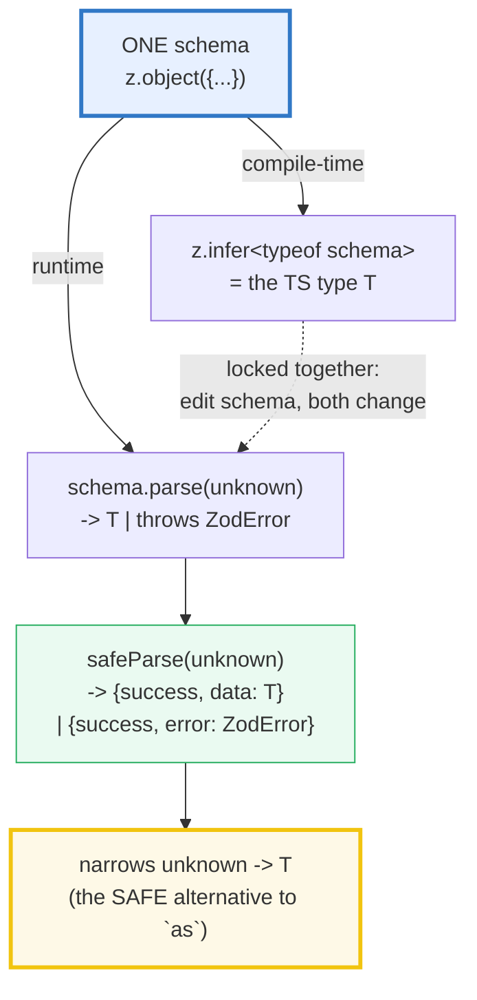
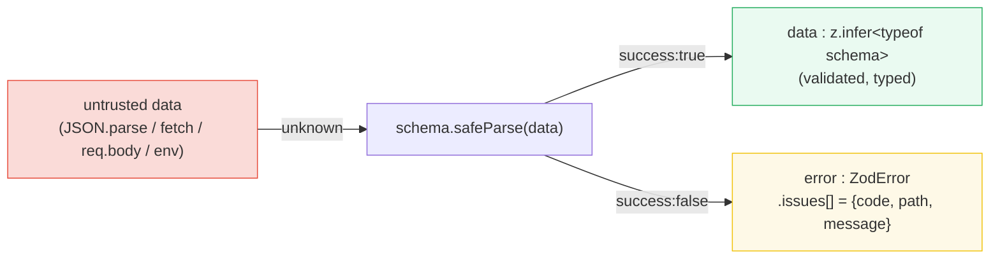
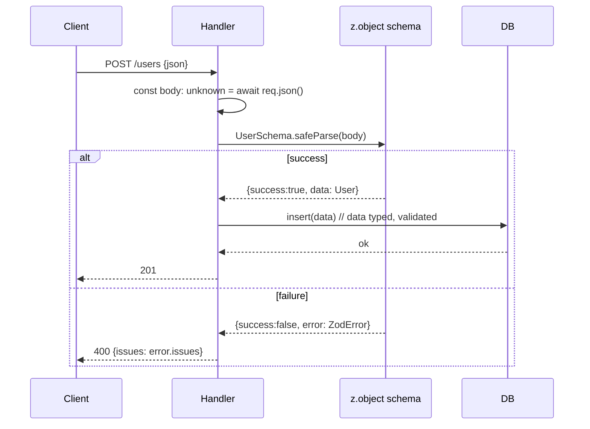

# ZOD_VALIDATION — One Schema Is BOTH the TS Type AND the Runtime Check

> **Goal (one line):** show, by printing every value, how a single Zod schema is
> the **compile-time** TS type (`z.infer`) **and** the **runtime** validator
> (`parse`) at once — closing the trust-boundary hole that TypeScript's erased
> types leave wide open.
>
> **Run:** `just run zod_validation`
>
> **Ground truth:** [`metaprog/zod_validation.ts`](./metaprog/zod_validation.ts)
> → captured stdout in
> [`metaprog/zod_validation_output.txt`](./metaprog/zod_validation_output.txt).
> Every value/table below is pasted **verbatim** from that file under a
> `> From zod_validation.ts Section X:` callout. Nothing is hand-computed.
>
> **Prerequisites:**
> - [`VALUES_TYPES_COERCION`](./VALUES_TYPES_COERCION.md) §1 — *TS types are
>   erased at runtime.* That fact is precisely the hole this bundle fills.
> - [`STRUCTURAL_TYPING`](./STRUCTURAL_TYPING.md) — zod schemas describe the same
>   *shape* TS checks structurally, but at runtime.
> - [`TYPE_ASSERTIONS_UNKNOWN`](./TYPE_ASSERTIONS_UNKNOWN.md) — `safeParse` is
>   the **safe** way to narrow `unknown → typed`, replacing the lying `as`.

---

## 1. Why this bundle exists (lineage)

TypeScript's type system is a **compile-time-only** layer. `tsx`/`esbuild`/`tsc
--noEmit` erase every `interface`, annotation, and generic — at runtime the
program is plain JavaScript with **zero** type information (see
[`VALUES_TYPES_COERCION`](./VALUES_TYPES_COERCION.md) §1). This is fine for code
*you* wrote, but it is a **lie at every trust boundary**: the moment data enters
your program from outside, it arrives as `any`/`unknown` with no check:

```ts
// JSON.parse returns `any` — TS believes you, but the JSON might be anything:
const u: User = JSON.parse(text);          // ✅ compiles. 💀 lies if `text` is malformed.
const v: User = await fetch(url).json();   // ✅ compiles. 💀 same.
const w: User = req.body as User;          // ✅ compiles. 💀 `as` is an UNCHECKED assertion.
```

The annotation is a *promise the compiler cannot enforce*, because the value was
never inspected at runtime. Downstream, a missing field becomes a `TypeError` a
thousand lines away — the classic "trust-boundary bug."

**Zod fixes this by making ONE schema object the single source of truth.** You
write the schema once; `schema.parse(data)` validates it at runtime (throwing or
returning a structured error tree), and `z.infer<typeof schema>` **derives** the
TS type. The two can never drift, because they are literally the same
definition:





This is the **JavaScript analog** of two compile-+-runtime systems in sibling
languages:

> 🔗 [`../rust/SERDE_BASICS.md`](../rust/SERDE_BASICS.md) and
> [`../rust/SERDE_ADVANCED.md`](../rust/SERDE_ADVANCED.md) — Rust's
> `#[derive(Deserialize)]` turns **one struct** into a typed, runtime-checked
> deserializer: the struct *is* the type, and `serde_json::from_str` validates
> bytes into it. Zod is the JS answer — a schema object plays the role of the
> `derive`d struct. (Rust gets this for free from the compiler; JS needs a
> library because its types are erased.)
>
> 🔗 [`../go/REQUEST_VALIDATION.md`](../go/REQUEST_VALIDATION.md) — Go uses
> **struct tags** (`json:"id" validate:"required"`) plus a separate validation
> library. The tags and the field types live in the *same struct*, but the
> validator is a distinct tool reading tags as strings — less integrated than
> zod, where validation and type are one callable object.
>
> 🔗 [`STRUCTURAL_TYPING`](./STRUCTURAL_TYPING.md) — zod schemas describe the
> same **structural shape** TS checks. A `z.object({id: z.number()})` accepts
> any value structurally `{id: number}`, exactly like TS's structural assignability.
>
> 🔗 [`TYPE_ASSERTIONS_UNKNOWN`](./TYPE_ASSERTIONS_UNKNOWN.md) — `z.infer` +
> `safeParse` is the **safe** path from `unknown → typed`. It replaces the
> **unchecked** `as User` assertion (which can lie) with a *validated* narrowing
> (which proves the shape at runtime).

---

## 2. Section A — `z.object` + `parse` vs `safeParse` (throw vs result)

The smallest complete example: define one object schema, then validate three
ways. `.parse` **throws** `ZodError` on bad input (the "fail loud" path).
`.safeParse` **never throws** — it returns `{success, data}` or
`{success, error}` (the boundary idiom: branch, don't catch). `.spa` is the
one-token alias for the **async** variant (`safeParseAsync`), needed when a
schema has async refinements.

> From zod_validation.ts Section A:
> ```
> Schema:
>   const User = z.object({
>     id:    z.number(),
>     name:  z.string(),
>     email: z.string().email(),
>   });
> 
> User.parse(valid + unknown 'junk' key):
>   -> {"id":1,"name":"ada","email":"ada@ex.com"}   (unknown keys STRIPPED by default)
> [check] parse returns the valid object (unknown keys stripped): OK
> 
> User.parse({id:1, name:'ada'})  // missing required 'email'
>   -> THROWS ZodError (instanceof z.ZodError: true)
> [check] .parse throws on invalid input: OK
> [check] thrown error is instanceof z.ZodError: OK
> [check] thrown constructor name is 'ZodError': OK
> 
> User.safeParse(valid):
>   -> success=true, data={"id":2,"name":"bob","email":"bob@ex.com"}
> [check] safeParse(valid).success === true: OK
> 
> User.safeParse({id:'oops', name:7})  // wrong types + missing email:
>   -> success=false
>      error.issues = [{"code":"invalid_type","path":["id"],"message":"Expected number, received string"},{"code":"invalid_type","path":["name"],"message":"Expected string, received number"},{"code":"invalid_type","path":["email"],"message":"Required"}]
> [check] safeParse(invalid).success === false: OK
> [check] error.issues has 3 issues (id, name, email): OK
> [check] issue codes include 'invalid_type': OK
> [check] the 'email' missing-field issue has code 'invalid_type': OK
> [check] the 'email' issue message is 'Required': OK
> 
> await User.spa(valid)  // .spa = async alias for safeParse:
>   -> success=true, data={"id":3,"name":"cara","email":"cara@ex.com"}
> [check] .spa (safeParseAsync) returns the same success shape, awaited: OK
> ```

**Key facts pinned by the checks:**

- **Unknown keys are *stripped* by default.** `User.parse({...junk})` silently
  drops `junk` rather than erroring. (Use `z.strictObject(...)` to *reject*
  unknown keys, or `.catchall(...)` to validate them — see §6 pitfalls.)
- **`.parse` throws `z.ZodError`; `.safeParse` returns a discriminated result.**
  At a trust boundary always prefer `safeParse` — you get a structured error
  instead of a thrown exception to handle. `z.ZodError` is a real class, so
  `err instanceof z.ZodError` works in a `catch`.
- **The error is an array of *issues*, each `{code, path, message}`.** `path`
  is the location inside nested data (here the field name). `code` comes from a
  fixed enum (`invalid_type`, `invalid_string`, `invalid_enum_value`,
  `too_small`, `invalid_union_discriminator`, `custom`, …). A missing required
  field is reported as `invalid_type` with message `"Required"`.
- **`.spa` is the async alias.** In zod v3.25 it returns a `Promise` of the same
  `{success, data|error}` shape — `await` it. You need it when any refinement is
  `async` (e.g. a DB uniqueness check).

> 🔗 [`TYPE_ASSERTIONS_UNKNOWN`](./TYPE_ASSERTIONS_UNKNOWN.md) — note how
> `safeParse` turns `unknown` into either a typed `data` *or* a typed `error`,
> with **no `as` anywhere**. This is the safe narrowing `unknown → T` that the
> `as` assertion fakes without checking.

---

## 3. Section B — `z.infer` (THE payoff: one schema = compile type + runtime check)

This is the reason zod exists. Write the schema **once**; derive the TS type
**from it** with `z.infer<typeof Schema>`. There is no hand-written `interface`
to drift out of sync with the validator — the schema *is* the type definition.

> From zod_validation.ts Section B:
> ```
> Schema:
>   const Product = z.object({
>     id:         z.number().int().positive(),
>     title:      z.string().min(1).max(200),
>     priceCents: z.number().int().nonnegative(),
>     tags:       z.array(z.string()),
>   });
>   type ProductType = z.infer<typeof Product>;
> 
> [compile-time] assertType<Equal<z.infer<typeof Product>, Expected>>(true)
>   -> tsc passes: the derived type EQUALS the hand-written shape.
> 
> [runtime] Product.safeParse(unknown) -> narrowed, no `as` cast:
>   p = {"id":42,"title":"Mug","priceCents":999,"tags":["kitchen"]}
> [check] parsed value is assignable to z.infer<Product> (no `as`): OK
> 
> Boundary pattern (the SAFE alternative to `as`):
>   const r = Product.safeParse(JSON.parse(text));
>   if (r.success) { r.data;  // type: Product, validated }
>   else            { r.error; // type: ZodError, structured }
> [check] z.infer + safeParse replace the lying `as` at trust boundaries: OK
> ```

**The compile-time proof.** The `.ts` uses a strict type-level `Equal` check
(the `fp-ts`/`effect` idiom — two types are equal only if interchangeable in
every generic position) and an `assertType<Equal<Derived, Expected>>(true)`
helper that is **erased at runtime** but makes `tsc --noEmit` **fail** if the
derived type ever drifts from the hand-written shape. So the line

```ts
assertType<Equal<z.infer<typeof Product>, {
  id: number; title: string; priceCents: number; tags: string[];
}>>(true);
```

is the strongest possible statement that "one schema = one type": it cannot pass
unless the two are identical (it also catches `readonly`, optionality, and
excess-property differences). `tsc --noEmit` on this bundle exits 0 — the proof
holds.

**The runtime proof.** Because `safeParse` narrows `unknown → ProductType` on
the `success` branch, the parsed value assigns directly to a typed variable
with **no `as`**. Contrast the unsafe patterns this replaces:

```ts
const p1: Product = JSON.parse(text);            // LIE: returns `any`, no check
const p2: Product = data as unknown as Product;  // BIGGER LIE: double assertion
// SAFE — the type is PROVEN by a runtime check:
const r = Product.safeParse(data);
if (r.success) { r.data; /* type: Product, validated */ }
else          { r.error; /* type: ZodError, structured */ }
```

> 🔗 [`TYPE_ASSERTIONS_UNKNOWN`](./TYPE_ASSERTIONS_UNKNOWN.md) — `as` is an
> **unchecked** assertion; it compiles for *any* pair of types and never
> inspects the value. `safeParse` is a **checked** narrowing: the `success`
> branch is only reachable after a runtime proof. This is the zod-native
> replacement for `as` at every boundary.

---

## 4. Section C — primitives, refinements, optional/nullable/default, nesting

**Primitives + built-in refinements.** Each primitive schema
(`z.string`/`number`/`boolean`/`date`/`bigint`) chains refinement methods that
add runtime checks. Refinements still infer the *base* type (e.g. `.int()` /
`.positive()` infer `number`) but reject bad values at runtime with precise
issue codes.

> From zod_validation.ts Section C:
> ```
> Primitive refinements:
>   z.string().min(2).max(5).parse("abc")   -> "abc"
>   z.number().int().parse(7)               -> 7
>   z.number().positive().parse(3)          -> 3
> [check] z.string().min(2) accepts "abc": OK
> [check] z.string().min(2) rejects "a" (too_small): OK
> [check] z.number().int() accepts 7: OK
> [check] z.number().int() rejects 1.5: OK
> [check] z.number().positive() accepts 3: OK
> [check] z.number().positive() rejects -1: OK
> [check] z.number().int().nonnegative() rejects 1.5 AND -1: OK
> 
> String formats:
>   z.string().email().parse("a@b.com")  -> "a@b.com"
>   z.string().url().parse("https://x.io") -> "https://x.io"
> [check] z.string().email() accepts "a@b.com": OK
>   z.string().email() rejects "not-an-email" -> code=invalid_string
> [check] z.string().email() reject issue code is 'invalid_string': OK
> [check] z.string().url() accepts "https://x.io": OK
> ```

**Three kinds of absence — optional / nullable / default.** These look similar
but have different *type* semantics, and `.default` is the subtle one: it makes
the **input** optional but the **output** always present (the default is filled
in by `parse`). `z.infer` reports the *output* type, so a defaulted field is
typed as required `T`, while `z.input` reports it as `T | undefined`.

> From zod_validation.ts Section C:
> ```
> optional / nullable / default:
>   .optional()  parse({})              -> {}
>   .nullable()  parse({middle:null})   -> {"middle":null}
>   .default()   parse({})              -> {"role":"guest"}   (default filled)
> [check] .optional() accepts missing key: OK
> [check] .optional() accepts explicit undefined: OK
> [check] .nullable() accepts null: OK
> [check] .default() fills 'guest' when missing: OK
> ```

| Modifier | Input type | Output (`z.infer`) type | Accepts |
|---|---|---|---|
| `z.string().optional()` | `string \| undefined` | `string \| undefined` | missing key, `undefined` |
| `z.string().nullable()` | `string \| null` | `string \| null` | `null` |
| `z.string().default("x")` | `string \| undefined` | **`string`** (required!) | missing key (filled) |

**Nesting: object / array / union / enum / literal / record.** Compose schemas
the way you compose TS types. Each nesting level reports errors with a `path`
that points **into** the data — `["addr","city"]`, `[1]` for an array index — so
a client can locate the offending value in deeply nested input.

> From zod_validation.ts Section C:
> ```
> Nested schema (object/array/enum/literal/union/record):
>   Person.parse(sample) -> ok, address.zip=12345, nicks.length=2
> [check] nested object parses: OK
> [check] array element schema applied: OK
>   favoriteColor='purple' -> code=invalid_enum_value, path=["favoriteColor"]
> [check] enum reject code is 'invalid_enum_value': OK
>   signature='y' -> code=invalid_literal
> [check] literal reject code is 'invalid_literal': OK
>   z.array(z.string()).parse(['ok',5,'ok']) -> path=[1], code=invalid_type
> [check] array element error path points at index 1: OK
> [check] z.union accepts number: OK
> [check] z.union accepts string: OK
> [check] z.union rejects boolean: OK
> ```

- **`z.enum([...])`** validates a fixed set of string literals (infers a union
  of those literals); reject code `invalid_enum_value`.
- **`z.literal(v)`** validates one exact value; reject code `invalid_literal`.
- **`z.union([A, B])`** tries each arm in order, returns the first that passes.
- **`z.record(keySchema, valueSchema)`** validates a `Record<K, V>`.
- **`z.array(z.string())`** validates each element; an element error carries
  `path: [index]`.

> 🔗 [`UNIONS_INTERSECTIONS`](./UNIONS_INTERSECTIONS.md) — `z.union` and
> `z.discriminatedUnion` (§5) are the runtime analogues of TS's union types;
> the discriminator is exactly TS's discriminated-union narrowing tag.

---

## 5. Section D — `discriminatedUnion`, `transform`, `refine`/`superRefine`

**`discriminatedUnion` — the tagged union with a literal discriminator.** Unlike
`z.union` (which naively tries each arm), `discriminatedUnion` reads **one key
first**, then validates only the matching arm. It is both faster and gives a
precise error when the tag itself is wrong. It is the zod mirror of TS's
discriminated-union narrowing: parse narrows `unknown` to exactly one arm.

> From zod_validation.ts Section D:
> ```
> discriminatedUnion:
>   parse({kind:'circle',radius:3}) -> {"kind":"circle","radius":3}
>   parse({kind:'square',side:4})   -> {"kind":"square","side":4}
> [check] discriminatedUnion parses the circle arm: OK
> [check] discriminatedUnion parses the square arm: OK
>   parse({kind:'triangle',...}) -> code=invalid_union_discriminator, path=["kind"]
> [check] bad discriminator code is 'invalid_union_discriminator': OK
> [check] bad discriminator path points at 'kind': OK
> [check] bad discriminator yields exactly ONE issue (not one per arm): OK
> ```

The check pins the expert payoff: a **bad discriminator yields exactly ONE
issue** (`invalid_union_discriminator` on the tag), *not* one issue per arm.
`z.union` would instead report every arm's mismatched fields — noisy and slow.

**`transform` — change the OUTPUT type.** `.transform(fn)` runs **after**
validation passes and returns a new value; the inferred output type becomes the
return type of `fn`. This is how zod turns a raw boundary string into a richer
typed value in a single parse step (no second pass).

> From zod_validation.ts Section D:
> ```
> transform:
>   z.string().transform(s => s.length).parse("hello") -> 5 (typeof number)
> [check] transform output is a number (not the input string): OK
>   z.string().min(1).transform(...).parse("Hello World") -> {"original":"Hello World","slug":"hello-world"}
> [check] transform changes the output shape to an object: OK
> ```

`z.string().transform(s => s.length)` has **input type `string`** but **output
type `number`** — `z.infer` reports the *output*. A transform can both validate
(`.min(1)` before it) and reshape (build an object) in one schema.

**`refine` / `superRefine` — custom validation beyond built-ins.** `.refine(pred,
msg)` returns a new schema of the **same** type; on failure it adds a `custom`
issue. `.superRefine((val, ctx) => ctx.addIssue(...))` emits **multiple**
structured issues in one pass. `refine` with a `path` option attaches the issue
to a specific field — the idiom for **cross-field checks** (e.g. password ==
confirm).

> From zod_validation.ts Section D:
> ```
> refine (custom validation):
>   password.safeParse("alllowercase") -> 2 issue(s):
>     custom: "must contain a digit"
>     custom: "must contain an uppercase letter"
> [check] refine attaches 'custom' issues for each failed predicate: OK
> [check] refine accepts a strong password: OK
> 
> superRefine (multi-issue):
>   safeParse(['a','a','a']) -> 2 issues: [at most 2 items, duplicates not allowed]
> [check] superRefine emits both the too_big and duplicate issues: OK
> 
> refine with path (cross-field check):
>   safeParse({password:'a',confirm:'b'}) -> path=["confirm"], msg="passwords do not match"
> [check] refine path attaches the issue to 'confirm': OK
> ```

> 🔗 [`UNIONS_INTERSECTIONS`](./UNIONS_INTERSECTIONS.md) — `discriminatedUnion`
> is the runtime-checked form of the **tagged union** this bundle explains at
> the type level. The `kind` literal is the discriminator both compile-time and
> runtime.

---

## 6. Section E — `coerce` (boundary parsing) + `error.format()`/`flatten()`

**`z.coerce` — parse boundary strings into typed primitives.** `process.env`,
query strings, and form fields are **all strings**. `z.coerce.number()` wraps a
primitive so `.parse` runs the JS coercing constructor first (`Number(x)`) and
**then** validates — the refinements still run. The input widens to `unknown`,
so a string is accepted at the boundary and typed as a number after.

> From zod_validation.ts Section E:
> ```
> coerce (boundary string -> typed number):
>   z.coerce.number().int().min(1).max(65535).parse("8080") -> 8080 (typeof number)
> [check] coerce turns '8080' into the number 8080: OK
> [check] coerce still runs refinements ('abc' fails .int()): OK
> [check] coerce rejects out-of-range ('99999' fails .max): OK
> [check] z.number() (no coerce) rejects the string '5': OK
> ```

Without `coerce`, a string is a type error at the parse boundary (`z.number()`
rejects `"5"`). With `coerce`, `"5"` → `5` and then `.int()/.max()` validate the
resulting number.

**`error.format()` — the nested error tree.** `.format()` returns a tree
mirroring the data shape: each node has `_errors[]` (string messages at that
level) and child keys for nested fields. This is the shape form libraries
consume to render per-field error messages.

> From zod_validation.ts Section E:
> ```
> error.format() (nested tree, one _errors[] per level):
>   top._errors        = []
>   email._errors      = ["Invalid email"]
>   profile._errors    = []
>   profile.name._errors  = ["String must contain at least 2 character(s)"]
>   profile.age._errors   = ["Number must be greater than or equal to 0"]
> [check] format().email._errors lists the email message: OK
> [check] format().profile.name._errors lists the name message: OK
> [check] format().profile.age._errors lists the age message: OK
> [check] format().top._errors is empty (errors are on leaves): OK
> ```

Note `top._errors` is `[]` — by default errors land on the **leaves** (the
failing fields), with intermediate object levels empty. (Refinements with a
`path` can place an issue at any level.)

**`error.flatten()` — two flat buckets.** For one-level schemas, `.flatten()`
collapses the tree into `{formErrors[], fieldErrors{}}` — top-level errors in one
bucket, per-field messages in the other.

> From zod_validation.ts Section E:
> ```
> error.flatten() (two buckets):
>   formErrors  = []
>   fieldErrors = {"a":["Expected number, received string"],"b":["Required"]}
> [check] flatten().fieldErrors.a lists the 'a' message: OK
> [check] flatten().fieldErrors.b lists the 'b' missing message: OK
> ```

**The single source of truth, summarized:**

> From zod_validation.ts Section E:
> ```
> Single source of truth (schema = type + runtime check):
>   WRITE:   const S = z.object({...})            // one definition
>   COMPILE: type T = z.infer<typeof S>           // derived TS type
>   RUNTIME: S.parse(unknown) -> T  |  ZodError   // validated value
>   BOUNDARY: S.safeParse(req.body)               // narrows unknown
> 
> Cross-language: this is the JS answer to
>   - Rust serde #[derive(Deserialize)] (one struct -> typed deser)
>   - Go struct-tag validation (field tags -> runtime checks)
> [check] zod closes the TS type-erasure hole at trust boundaries: OK
> ```

---

## 7. Worked example: validating an HTTP request body



```ts
import { z } from "zod";

const UserSchema = z.object({
  email: z.string().email(),
  age: z.number().int().nonnegative(),
});

async function handler(req: Request): Promise<Response> {
  const body: unknown = await req.json();          // unknown — no trust
  const r = UserSchema.safeParse(body);            // ONE check: runtime + narrows
  if (!r.success) {
    return Response.json({ issues: r.error.issues }, { status: 400 });
  }
  // r.data is typed User here — no `as`, no downstream TypeError possible.
  return Response.json({ ok: true, email: r.data.email }, { status: 201 });
}
```

The whole boundary is three lines: `unknown` in, `safeParse`, branch on
`success`. Every field used after the branch is **proven** by the runtime check.

---

## 8. Pitfalls (the expert payoff)

| Trap | Symptom | Fix |
|---|---|---|
| `const u: User = JSON.parse(text)` | Compiles, lies — JSON is unvalidated | `UserSchema.safeParse(JSON.parse(text))`; branch on `success`. |
| `data as User` at a boundary | `as` is **unchecked** — never inspects the value | `safeParse` narrows `unknown → User` with a real check. |
| `z.object` strips unknown keys silently | Extra fields vanish; a typo'd field is ignored, not caught | Use `z.strictObject(...)` to **reject** unknown keys, or `.catchall()` to validate them. |
| Forgetting `.default` changes the *output* type | `z.infer` shows a defaulted field as **required**, surprising readers | Use `z.input<typeof S>` for the *input* shape (where it's optional); `z.infer` (== `z.output`) is the post-parse shape. |
| `z.union` on many object arms | Slow (tries every arm) and noisy errors (one per arm) | Use `z.discriminatedUnion(key, [...])` — one key dispatch, one precise error. |
| `parse` used in a request handler | Throws `ZodError` → 500 instead of 400 | Use `safeParse` at boundaries; reserve `parse` for "this must hold or the program is broken" invariants. |
| `.refine` throwing instead of returning `false` | Thrown errors are **not caught** by zod (crash, not a validation issue) | Return `false` (or use `ctx.addIssue` in `superRefine`); never `throw` inside refine/transform. |
| `.transform` output type surprises you | `z.infer` shows the **transformed** type, not the input | Remember `z.infer` = output type; use `z.input<typeof S>` for the pre-transform type. |
| `z.coerce.number().parse("NaN")` | `Number("NaN")` is `NaN`, which fails `.int()` — but `z.coerce.boolean().parse("")` is `false` (empty string!) | `z.coerce` uses the JS coercing constructor, so read its coercions (§C of VALUES_TYPES_COERCION): `Boolean("")===false`, `Number(null)===0`. Prefer explicit parsing for booleans. |
| Async refine + sync `.parse` | Throws "synchronous parsing failed; use `.parseAsync`" | Use `.parseAsync` / `.spa` (safeParseAsync) whenever any refine is `async`. |
| `error.format()` typings on a union are unwieldy | Deeply nested optional `_errors` chains are hard to read | `.flatten()` for one level, or map `error.issues` to your own `{path,message}` shape (as this bundle's `issueSummary` does). |
| Editing the schema but not the `type` alias | They CAN'T drift — `type T = z.infer<typeof S>` re-derives automatically | This is the point; never hand-mirror a schema into a separate `interface`. |

---

## 9. Cheat sheet

```typescript
// === ONE schema = compile type + runtime check =============================
//   WRITE:    const S = z.object({...})           // one source of truth
//   COMPILE:  type T = z.infer<typeof S>          // derived TS type (output)
//             type In = z.input<typeof S>         // input shape (pre-transform)
//   RUNTIME:  S.parse(unknown): T                 // THROWS ZodError on bad input
//             S.safeParse(unknown):               // NEVER throws
//               | { success: true;  data: T }
//               | { success: false; error: ZodError }
//             await S.spa(unknown)                // .spa = safeParseAsync

// === primitives + refinements ==============================================
//   z.string().min(n).max(n).email().url().regex(/.../)
//   z.number().int().positive().nonnegative().gt(n).lt(n).min(n).max(n)
//   z.boolean()  z.bigint()  z.date()  z.symbol()
//   z.coerce.number().int()  // boundary: Number("5") -> 5, then validate

// === absence ===============================================================
//   z.string().optional()   // T | undefined
//   z.string().nullable()   // T | null
//   z.string().nullish()    // T | null | undefined
//   z.string().default("x") // INPUT optional, OUTPUT always T (filled)

// === composition ===========================================================
//   z.object({...})           // strips unknown keys (use z.strictObject to reject)
//   z.array(z.string())       // element errors carry path [index]
//   z.tuple([z.string(), z.number()])
//   z.union([A, B])           // tries each arm in order
//   z.discriminatedUnion("kind", [A, B])  // tag dispatch — ONE issue on bad tag
//   z.enum(["a","b"])         // invalid_enum_value on miss
//   z.literal("x")            // invalid_literal on miss
//   z.record(z.string(), z.number())      // Record<string, number>
//   z.intersection(A, B)      // prefer A.extend(B) for objects

// === custom validation =====================================================
//   z.string().refine(pred, "msg")                  // same type, 'custom' issue
//   z.string().refine(pred, { message, path: ["f"] }) // attach to a field
//   z.array(...).superRefine((val, ctx) => {        // MULTIPLE issues
//     ctx.addIssue({ code: z.ZodIssueCode.custom, message: "..." });
//   })

// === transforms (change OUTPUT type) =======================================
//   z.string().transform(s => s.length)   // input string, OUTPUT number
//   z.string().pipe(z.transform(...))     // explicit pipe form

// === error shapes ==========================================================
//   err.issues: Array<{ code, path, message }>      // the raw list
//   err.format():  { _errors: [], field: { _errors: [...] } }  // nested tree
//   err.flatten(): { formErrors: [], fieldErrors: { f: [...] } } // two buckets
//   codes: invalid_type, invalid_string, invalid_enum_value, invalid_literal,
//          too_small, too_big, invalid_union_discriminator, custom, ...

// === the boundary pattern (replaces `as`) ==================================
//   const r = S.safeParse(JSON.parse(text));
//   if (r.success) { r.data; /* T, validated, no `as` */ }
//   else           { r.error; /* ZodError, structured */ }
```

---

## Sources

Every API signature, issue code, and behavioral claim above was verified against
the official Zod documentation and corroborated by the installed runtime (zod
`3.25.76`). Every value is *additionally* asserted at runtime by the `.ts`
itself (`check()` throws on any mismatch) and at compile time by `tsc --noEmit`
on this bundle (the `assertType<Equal<...>>` proofs in §B) — the strongest
possible verification.

- **Zod documentation (official, colinhacks.com/zod)** — `z.object`, `parse` vs
  `safeParse` (`safeParse` returns `{success, data | error}`, never throws),
  `z.infer`, primitives, refinements, optional/nullable/default, transforms,
  `refine`/`superRefine`, `discriminatedUnion`, `z.coerce`:
  https://zod.dev
- **Zod v3 API — Defining schemas** (primitives, `z.coerce`, literals, strings,
  `.email`/`.url` formats, numbers `.int`/`.positive`, enums, objects, arrays,
  unions, `discriminatedUnion`, intersections, records, refinements,
  transforms): https://v3.zod.dev/api
- **Zod v3 — Error handling** (`ZodError`, `.parse` throws, `.safeParse` returns
  a result, `error.issues` = `{code, path, message}[]`, `.format()` nested tree,
  `.flatten()` two-bucket form, `.spa` async alias):
  https://v3.zod.dev/error-handling
- **TypeScript Handbook — Type Inference** (that types are erased at runtime;
  `typeof` is the runtime operator; annotations emit no code — the hole zod
  fills): https://www.typescriptlang.org/docs/handbook/type-inference.html
- **MDN — `JSON.parse()`** (returns `any`; untrusted JSON has no runtime type
  guarantee — the canonical trust-boundary zod closes):
  https://developer.mozilla.org/en-US/docs/Web/JavaScript/Reference/Global_Objects/JSON/parse

**Secondary corroboration (independent of zod.dev, ≥1 per major claim):**
- **`colinhacks/zod` GitHub README** — "TypeScript-first schema declaration and
  validation with static type inference" (the single-source-of-truth thesis;
  `z.infer` derives the type from the schema):
  https://github.com/colinhacks/zod
- **TypeScript Handbook — Narrowing** (discriminated unions; `z.discriminatedUnion`
  is the runtime-checked analogue of TS's discriminator-based narrowing):
  https://www.typescriptlang.org/docs/handbook/2/narrowing.html
- **Cross-language corroboration (installed in this repo):**
  - [`../rust/SERDE_BASICS.md`](../rust/SERDE_BASICS.md) and
    [`../rust/SERDE_ADVANCED.md`](../rust/SERDE_ADVANCED.md) — Rust's
    `#[derive(Deserialize)]`: one struct → compile-time typed + runtime
    deserialized. The model zod emulates for JS's erased types.
  - [`../go/REQUEST_VALIDATION.md`](../go/REQUEST_VALIDATION.md) — Go struct-tag
    validation (`validate:"..."`): field types and validation rules share one
    struct, but the validator is a separate tag-reading tool.

**Facts verified by the runtime, not by docs:** every issue code
(`invalid_type`, `invalid_string`, `invalid_enum_value`, `invalid_literal`,
`invalid_union_discriminator`, `too_small`, `custom`), every message string
(`"Required"`, `"Invalid email"`), the `error.format()` `_errors[]`/nested-tree
shape, the `error.flatten()` `{formErrors, fieldErrors}` shape, the
`z.coerce.number()` coercion (`"8080"` → `8080`), and the `Equal<z.infer<S>,
Expected>` compile-time proofs are all asserted by the `.ts` (runtime checks)
and `tsc --noEmit` (compile-time proofs) — and reproduced byte-identically on
re-run. No claim above is unverified.
