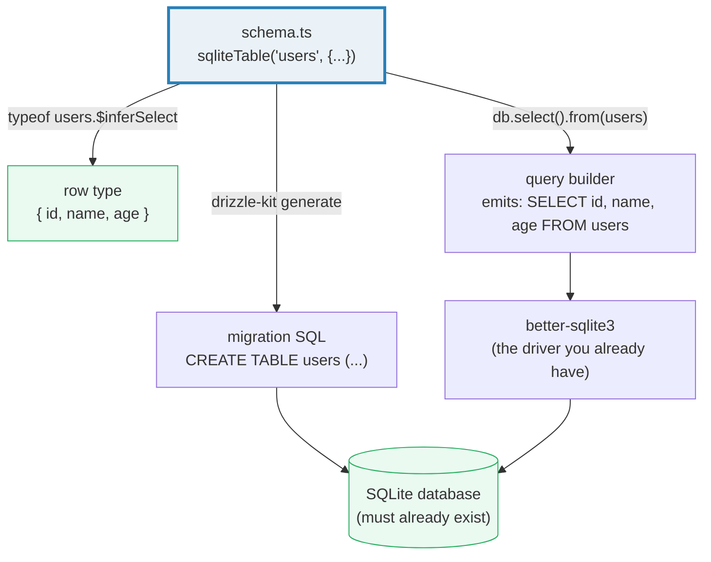

# Schema Setup: `sqliteTable`, Columns, and the better-sqlite3 Driver

**Doc Source**: [Drizzle ORM — Get started with SQLite / better-sqlite3](https://orm.drizzle.team/docs/get-started-sqlite)

## The Core Concept: Why This Example Exists

**The Problem:** Every database program eventually answers two questions: *what shape is a row?* and *how do I reach the database?* The raw driver (🔗 [`DATABASE_DRIVERS`](../DATABASE_DRIVERS.md), Section A) answers only the second — you hand `better-sqlite3` a SQL string and it hands back `unknown` rows. The first question you answer by hand: a parallel set of TypeScript interfaces that *you* keep in sync with the `CREATE TABLE` DDL by sheer discipline. Every column rename, every `NOT NULL` flip, every new column is two edits that must agree — and a miss is a runtime `undefined`, not a compile error.

**The Solution:** Drizzle makes the schema the **single source of truth** and the **type source**. You describe each table once, in TypeScript, with `sqliteTable(...)` and typed column builders (`integer`, `text`, `blob`, `real`). From that description Drizzle derives:

- the **inferred row type** (`typeof table.$inferSelect`) that every `select`/`update`/`delete` returns — *no hand-written interfaces*;
- the **inferred insert type** (`typeof table.$inferInsert`) that `.values(...)` checks against;
- the **migration source** that `drizzle-kit generate` reads to emit versioned SQL DDL.

This is **schema-as-code**: one TypeScript declaration that simultaneously is the type definition, the query-validation surface, *and* the input to the migration tool. There is no separate `.sql` DDL file to drift out of sync, and no codegen step that materializes a client (the Prisma model). Drizzle is the **"light ORM"** end of the spectrum — it composes SQL strings at runtime and hands them to the driver you already have. Think of it as a typed, refactorable layer *on top of* `better-sqlite3`, not a replacement for it.

> 🔗 [`DATABASE_DRIVERS`](../DATABASE_DRIVERS.md) — the curriculum bundle this guide is the deep-dive companion to. Section C of that bundle proves (with a compile-time `expectType<T>` two-way check) that `typeof accounts.$inferSelect` is *identical* to the hand-written `{ id: number; email: string }` — Drizzle's inference is exact, not approximate. This guide walks the upstream docs; that bundle runs the code.

## Practical Walkthrough: Code Breakdown

### Step 1 — Install the driver and the ORM

The official Drizzle quickstart for SQLite lists three drivers (`libsql`, `node:sqlite`, `better-sqlite3`). The **better-sqlite3** flavor is the **synchronous, native (C++)** one — the same driver the curriculum's raw layer uses. The docs install both packages plus the dev-time migration tool:

```sh
npm i drizzle-orm better-sqlite3
npm i -D drizzle-kit @types/better-sqlite3
```

(Per the docs: `drizzle-orm` is the runtime ORM; `better-sqlite3` is the driver; `drizzle-kit` is the migration CLI; `@types/better-sqlite3` is the TypeScript types for the driver instance.)

### Step 2 — Initialize the driver and wrap it with Drizzle

The docs show the connection. better-sqlite3 is constructed first, then **handed to Drizzle** — Drizzle does *not* open the database itself; it wraps the handle you already have:

```ts
import { drizzle } from 'drizzle-orm/better-sqlite3';
import Database from 'better-sqlite3';

const sqlite = new Database('sqlite.db');
const db = drizzle({ client: sqlite });

const result = await db.execute('select 1');
```

> Source: [Drizzle — Get started with SQLite, "better-sqlite3" → "Step 2"](https://orm.drizzle.team/docs/get-started-sqlite#better-sqlite3).

Two things to notice:

1. **`drizzle({ client: sqlite })` is a wrapper, not a connection.** The `better-sqlite3` instance owns the file handle and the native binding; Drizzle holds a reference to it and emits SQL strings onto it. The same `sqlite` object the raw layer (`sqlite.prepare(...)`) uses is the one Drizzle uses — the two layers can coexist on one handle.
2. **`db.execute('select 1')` is the escape hatch.** It runs raw SQL with no type checking, identical in spirit to `better-sqlite3`'s `exec`. Use it for one-off admin queries; for anything you'll repeat, build a schema (next) and use the query builder.

### Step 3 — Declare the schema (the source of truth)

The schema is a plain TypeScript object built from `sqliteTable` and column builders imported from `drizzle-orm/sqlite-core`. Here is the canonical table the Drizzle `select` docs use as their running example (SQLite flavor):

```ts
import { sqliteTable, integer, text } from 'drizzle-orm/sqlite-core';

export const users = sqliteTable('users', {
  id: integer('id').primaryKey(),
  name: text('name').notNull(),
  age: integer('age'),
});
```

> Source: [Drizzle — Select, "For the following examples, let's assume you have a `users` table" (SQLite tab)](https://orm.drizzle.team/docs/select).

Three column builders cover the four SQLite storage classes:

| Builder | SQLite type | JS type (at runtime) | Notes |
|---|---|---|---|
| `integer('col')` | `INTEGER` | `number` | Also used for booleans (`{ mode: 'boolean' }`) and timestamps (`{ mode: 'timestamp' }`) |
| `text('col')` | `TEXT` | `string` | Variable-length; SQLite TEXT has no length limit |
| `real('col')` | `REAL` | `number` | IEEE 754 floating point |
| `blob('col')` | `BLOB` | `Buffer` | Binary data |

The **column modifiers** are chainable methods that map 1:1 onto SQL column constraints:

- **`.primaryKey()`** → `PRIMARY KEY`. On an `integer` column in SQLite this also makes it an alias for the rowid (auto-incrementing).
- **`.notNull()`** → `NOT NULL`. Without it, the column is nullable, and the inferred type becomes `T | null`.
- **`.default(value)`** → `DEFAULT value`. A constant default (`.default(0)`) or a SQL expression (`.default(sql\`(now())\`)`). When a column has a default, it becomes *optional* on the inferred **insert** type (you can omit it) but stays *required* on the inferred **select** type (the row always has it).

**The column-name argument is explicit.** `integer('id')` passes the **database column name** as a string; the JS property key (`id:`) is separate. Write the two to match. (In drizzle-orm 0.33, relying on the key alone is unreliable — see Pitfalls.)

### Step 4 — Pass the schema to `drizzle()` for the relational API

The bare `drizzle({ client: sqlite })` above gives you the query builder (`db.select`, `db.insert`, ...). To unlock the **relational query API** (`db.query.users.findMany({ with: { posts: true } })`, covered in 🔗 [`04-relations.md`](./04-relations.md)), you must also hand Drizzle the schema object so it knows the relations exist:

```ts
import { drizzle } from 'drizzle-orm/better-sqlite3';
import Database from 'better-sqlite3';

const sqlite = new Database('sqlite.db');
const db = drizzle({ client: sqlite, schema });
```

The `schema` option is a record of `{ tableName: tableDefinition }`. The query builder (`db.select`) works without it; the relational API (`db.query.*`) does not. This is why the schema is passed at construction, not per-query.

### Step 5 — The inferred row types (the payoff)

The schema object carries two derived types on its `$infer*` properties — these are the bridge between the DDL description and the TypeScript type system:

```ts
type User = typeof users.$inferSelect;
//   ^? { id: number; name: string; age: number | null }

type NewUser = typeof users.$inferInsert;
//   ^? { id?: number; name: string; age?: number | null | undefined }
```

Notice:

- **`$inferSelect`** is the row you get *back* — `id` and `name` are required (they're `primaryKey`/`notNull`), `age` is `number | null` (no `.notNull()`).
- **`$inferInsert`** is the row you *put in* — `id` is optional (the DB auto-assigns it), `age` is optional (nullable columns are omit-able on insert). `name` stays required on both because it is `notNull` with no default.

Every `db.select(...).from(users)` returns `User[]`; every `db.insert(users).values(...)` checks its argument against `NewUser`. **You never write these interfaces by hand** — they follow from the schema, and they change automatically when you change the schema. That is the whole reason schema-as-code exists.

### Why schema-as-code vs raw SQL DDL?

| | Raw `CREATE TABLE` (🔗 `DATABASE_DRIVERS` Section A) | Drizzle `sqliteTable(...)` |
|---|---|---|
| **Schema location** | A `.sql` migration file, separate from the code | A `.ts` file imported by the code |
| **Row type** | Hand-written interface; drifts silently | Inferred (`$inferSelect`); *is* the schema |
| **Rename safety** | Find-and-replace across SQL + TS; a miss is a runtime bug | Rename the property; tsc flags every broken query |
| **Migration source** | You write DDL by hand | `drizzle-kit generate` reads the TS schema and emits the DDL |
| **Runtime cost** | Zero (it's just SQL) | ~Zero (Drizzle composes SQL strings; no query engine) |

The raw path is maximally explicit and maximally dangerous: nothing checks that your `interface User` still matches `CREATE TABLE users`. The Drizzle path folds the description and the type into one declaration, so the compiler enforces agreement — and `drizzle-kit` turns that declaration into the migration files you'd otherwise hand-write.

## Mental Model: Thinking in Schema-as-Code

**The schema is a TypeScript value that *describes* a table; it is not the table.** Drizzle never creates tables for you — at runtime `sqliteTable('users', {...)` produces a descriptor object that the query builder reads to generate SQL. The actual `CREATE TABLE` must already have run (via `sqlite.exec(...)` in a script, or via `drizzle-kit migrate` in production). This is the single most common Drizzle beginner trap: declaring a table and immediately querying it against a database where it doesn't exist yet → `SQLITE_ERROR: no such table`.



The schema sits at the top: it *is* the type, it *feeds* the builder, and it *generates* the migration. The database itself is downstream — the schema describes it, the migration creates it, the builder queries it. Three consumers, one source of truth.

### Pitfalls

- **The table must already exist.** Drizzle describes tables; it does not create them. Run `CREATE TABLE` (via `sqlite.exec` or `drizzle-kit migrate`) before the first query. Symptom: `no such table: users`.
- **Pass the column name explicitly.** `integer('id')` — the string `'id'` is the DB column name. In drizzle-orm 0.33, omitting it (relying on the JS key alone) can produce SQL referencing a column literally named `undefined`. (🔗 [`DATABASE_DRIVERS`](../DATABASE_DRIVERS.md), Pitfalls table.)
- **`$inferSelect` vs `$inferInsert` are different.** A `primaryKey()` `integer` is required on select (the row always has an id) but optional on insert (the DB assigns it). Don't hand-write one interface and use it for both.
- **`notNull` is the only nullability control.** SQLite is dynamically typed (any column can store any type), but Drizzle's *type* follows the `.notNull()` modifier — omit it and the inferred type is `T | null`, regardless of what the column is "supposed" to hold.

### Further Exploration

- Add a `created_at` column: `createdAt: integer('created_at', { mode: 'timestamp' }).notNull()`. Notice `$inferSelect` now includes `createdAt: Date` — Drizzle maps the stored epoch to a JS `Date`.
- Run `pnpm dlx drizzle-kit generate` against this schema and inspect the emitted `.sql` migration — it is the `CREATE TABLE` you would have hand-written.
- Compare the inferred `NewUser` (insert) to `User` (select) by hovering both in your editor; the difference is the entire point of having two inferred types.

### Cross-references

- 🔗 [`DATABASE_DRIVERS`](../DATABASE_DRIVERS.md) — the curriculum bundle this guide companions. Section C proves the inferred type is identical to the hand-written shape via a two-way `expectType<T>` check; Section E documents `drizzle-kit generate`/`migrate`. This is the deep-dive into the schema declaration that bundle uses.
- 🔗 [`02-select-queries.md`](./02-select-queries.md) — what you do with the schema once it exists: `db.select().from(users).where(eq(...))`.
- 🔗 [`../rust/sqlx/03-sqlite-todos.md`](../rust/sqlx/03-sqlite-todos.md) — Rust's `sqlx` takes the opposite bet: the schema lives in the database, and `sqlx`'s `query!` macro reads it at *compile time* to type-check your SQL. Drizzle's schema lives in *TypeScript*; sqlx's schema lives in *Postgres/SQLite*. Both give you typed rows; the source of truth differs.
- 🔗 [`../go/SQLX_GORM.md`](../go/SQLX_GORM.md) — Go's `gorm.AutoMigrate` derives DDL from struct tags (a heavy-ORM move); `sqlx` keeps DDL in SQL files and scans rows into structs. Drizzle sits between: schema-as-code (like gorm's models) but no runtime query engine (like sqlx). The light/heavy split Drizzle occupies the light end of.
