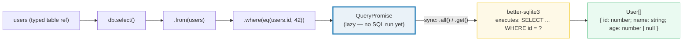

# Select Queries: `db.select`, `where`, `eq`, and `and`

**Doc Source**: [Drizzle ORM — Select](https://orm.drizzle.team/docs/select)

## The Core Concept: Why This Example Exists

**The Problem:** Raw SQL strings are the fastest path to a working query and the slowest path to a *maintainable* one. The moment you concatenate `"... WHERE name = '" + input + "'"` you have a SQL-injection vulnerability (🔗 [`DATABASE_DRIVERS`](../DATABASE_DRIVERS.md), Section B — the bundle proves the same payload leaks every row via interpolation and is harmless via binding). And even if you bind correctly (`prepare("... WHERE name = ?").get(input)`), the *result* is `unknown`: TypeScript cannot see the column types, so every row must be hand-cast, and a typo in a column name is a runtime `undefined`, not a compile error. Refactoring is painful — rename a column in the DDL and your SQL strings silently keep referencing the old name until production.

**The Solution:** Drizzle's query builder is **SQL-shaped but type-checked**. You write `db.select().from(users).where(eq(users.name, 'Dan'))` — it reads like SQL, but every identifier (`users`, `users.name`) is a *typed reference* to your schema (🔗 [`01-schema-setup.md`](./01-schema-setup.md)). The builder:

- **guarantees a well-formed query** — you cannot construct syntactically invalid SQL through the builder API;
- **parameterizes every value automatically** — `eq(users.id, 42)` emits `WHERE "id" = ?` with `42` as a bound parameter (never interpolated), so injection is structurally impossible;
- **infers the result type** — `db.select().from(users)` returns `{ id: number; name: string; age: number | null }[]`, derived from the schema, with no `any` and no casts.

The tradeoff vs raw SQL is the classic one: a builder is more verbose and less flexible than a string, but it is **refactorable** (rename a column and tsc flags every broken query) and **inject-safe by construction**. Drizzle's builder is deliberately SQL-like — it mirrors the clauses (`select`, `from`, `where`, `orderBy`, `limit`, `offset`) rather than inventing a new DSL, so the SQL you know transfers directly.

> 🔗 [`DATABASE_DRIVERS`](../DATABASE_DRIVERS.md) — the bundle this guide companions. Section C runs `db.select().from(accounts).where(eq(accounts.email, 'ann@example.com')).all()` and verifies the typed rows; Section B proves that parameter binding (which `eq` uses under the hood) defeats the `x' OR '1'='1` payload that interpolation leaks. This guide walks the upstream `select` docs; that bundle runs the code.

## Practical Walkthrough: Code Breakdown

The examples below use the canonical `users` table from the Drizzle `select` docs (SQLite flavor):

```ts
import { sqliteTable, integer, text } from 'drizzle-orm/sqlite-core';

export const users = sqliteTable('users', {
  id: integer('id').primaryKey(),
  name: text('name').notNull(),
  age: integer('age'),
});
```

### Basic select — all rows, all columns

The docs open with the simplest possible query. Select every row, every column:

```ts
const result = await db.select().from(users);
/*
  {
    id: number;
    name: string;
    age: number | null;
  }[]
*/
```

> Source: [Drizzle — Select, "Basic select"](https://orm.drizzle.team/docs/select).

Two things the docs flag:

1. **The result type is inferred automatically, including nullability.** `age` is `number | null` because the schema column has no `.notNull()`; `id` and `name` are required. You did not write this type — it follows from the schema.
2. **Drizzle always lists columns explicitly, never `SELECT *`.** The docs state this directly: *"Drizzle always explicitly lists columns in the `select` clause instead of using `select *`. This is required internally to guarantee the fields order in the query result, and is also generally considered a good practice."* The emitted SQL is `select "id", "name", "age" from "users"` — column order is deterministic, which is why the inferred type's key order is stable.

### Partial select — pick the columns

When you don't need every column, pass a selection object to `.select({...})`. The keys become the result's keys; the values are the (typed) column references:

```ts
const result = await db.select({
  field1: users.id,
  field2: users.name,
}).from(users);

const { field1, field2 } = result[0];
```

> Source: [Drizzle — Select, "Partial select"](https://orm.drizzle.team/docs/select).

The result type narrows to `{ field1: number; field2: string }[]` — only the columns you named, under the keys you chose. This is a typed projection; rename a key (`id: users.id` → `userId: users.id`) and the result type follows.

### Filters — the type-safe WHERE

The `.where(...)` method takes a **filter operator**. Each operator is a function: `eq`, `ne`, `lt`, `lte`, `gt`, `gte`, `inArray`, `like`, `ilike`, `between`, `isNull`, `isNotNull`, ... The docs list the common ones:

```ts
import { eq, lt, gte, ne } from 'drizzle-orm';

await db.select().from(users).where(eq(users.id, 42));
await db.select().from(users).where(lt(users.id, 42));
await db.select().from(users).where(gte(users.id, 42));
await db.select().from(users).where(ne(users.id, 42));
```

```sql
select "id", "name", "age" from "users" where "id" = 42;
select "id", "name", "age" from "users" where "id" < 42;
select "id", "name", "age" from "users" where "id" >= 42;
select "id", "name", "age" from "users" where "id" <> 42;
```

> Source: [Drizzle — Select, "Filters"](https://orm.drizzle.team/docs/select).

**The operators are typed to the column.** `eq(users.id, 42)` type-checks because `users.id` is `integer` and `42` is a `number`; `eq(users.id, 'Dan')` is a compile error (string vs number column). This is the builder's core safety: a WHERE clause that mismatches the column type cannot be written. The docs confirm the parameterization: *"All the values provided to filter operators and to the `sql` function are parameterized automatically."* The emitted SQL for `eq(users.id, 42)` is `where "id" = ?` with `params: [42]` — the value is **bound**, never interpolated, so the injection defense from 🔗 [`DATABASE_DRIVERS`](../DATABASE_DRIVERS.md) Section B applies to every `eq`/`lt`/`gt`/... call for free.

### Combining filters — `and` / `or`

Logical composition uses the `and(...)` and `or(...)` helpers, each taking any number of filter operators:

```ts
import { eq, and, sql } from 'drizzle-orm';

await db.select().from(users).where(
  and(
    eq(users.id, 42),
    eq(users.name, 'Dan')
  )
);
```

```sql
select "id", "name", "age" from "users" where "id" = 42 and "name" = 'Dan';
```

> Source: [Drizzle — Select, "Combining filters"](https://orm.drizzle.team/docs/select).

`or(...)` is the same shape with OR semantics. These compose: `and(eq(...), or(lt(...), gt(...)))`. The docs note a key refactorability win: *"You can safely alter schema, rename tables and columns and it will be automatically reflected in your queries because of template interpolation, as opposed to hardcoding column or table names when writing raw SQL."* The column references (`users.id`, `users.name`) are *values*, not strings — rename the property in the schema and every query that references it is flagged by tsc.

### Limit, offset, and order by

Pagination and sorting are clause-shaped methods that chain after `.from(...)`:

```ts
import { asc, desc } from 'drizzle-orm';

await db.select().from(users).limit(10);
await db.select().from(users).limit(10).offset(10);

await db.select().from(users).orderBy(users.name);
await db.select().from(users).orderBy(desc(users.name));

// order by multiple fields
await db.select().from(users).orderBy(asc(users.name), desc(users.age));
```

```sql
select "id", "name", "age" from "users" limit 10;
select "id", "name", "age" from "users" limit 10 offset 10;

select "id", "name", "age" from "users" order by "name";
select "id", "name", "age" from "users" order by "name" desc;

select "id", "name", "age" from "users" order by "name" asc, "age" desc;
```

> Source: [Drizzle — Select, "Limit & offset" and "Order By"](https://orm.drizzle.team/docs/select).

`orderBy` takes column references (or `asc(col)`/`desc(col)` wrappers); multiple sort keys are positional varargs. **Always paginate with `orderBy`** — SQL does not guarantee row order without `ORDER BY`, so a `limit(10)` without `orderBy` returns an unspecified 10 rows (🔗 [`DATABASE_DRIVERS`](../DATABASE_DRIVERS.md) Pitfalls: *"Treating `select` row order as stable"*).

### The better-sqlite3 sync flavor: `.all()` / `.get()` / `.run()`

The Drizzle docs show `await db.select()...` because the docs are dialect-agnostic and most drivers (libsql, node-sqlite, pg, mysql2) are **async**. The **better-sqlite3** driver is **synchronous** — there is no Promise to await. To terminalize a builder query against better-sqlite3 you call one of:

- **`.all()`** → returns every matching row as an array (the equivalent of `await` on async drivers).
- **`.get()`** → returns the first matching row (or `undefined`), implicitly adding `LIMIT 1`.
- **`.run()`** → executes and returns `{ changes, lastInsertRowid }` (used for mutations; rarely needed on `select`).

```ts
// better-sqlite3 sync flavor (no await!)
const all: User[] = db.select().from(users).all();
const one: User | undefined = db.select().from(users).where(eq(users.id, 42)).get();
```

This mirrors the raw driver's `.all()`/`.get()`/`.run()` on prepared statements exactly (🔗 [`DATABASE_DRIVERS`](../DATABASE_DRIVERS.md) Section A) — Drizzle's builder produces a lazy `QueryPromise` that is *only executed* when you call a terminal method. A builder chain with no terminal is a **no-op** (the bundle's Pitfalls table: *"Forgetting `.run()` / `.all()` / `.sync()` on a drizzle query"*).

## Mental Model: Thinking in the Query Builder

**A Drizzle query is a value, not a string.** The chain `db.select().from(users).where(eq(...))` builds a descriptor object; no SQL has run yet. The SQL is composed and sent to the driver only when you terminalize (`.all()`/`.get()` on better-sqlite3). This is why you can inspect, log, or `.prepare()` a query before running it, and why a half-built chain is silently inert.



Every identifier in the chain (`users`, `users.id`, the literal `42`) is a typed value, not a string fragment. The builder's type-level job is to refuse anything that wouldn't type-check against the schema; its runtime job is to compose the SQL string and bind the parameters. You get the ergonomics of SQL with the safety of a typed API.

### Why a query builder vs raw SQL strings?

| | Raw `prepare("SELECT ... WHERE ?")` (🔗 `DATABASE_DRIVERS` Section A) | Drizzle `db.select().from().where(eq(...))` |
|---|---|---|
| **SQL injection** | Safe *if* you bind every value (easy to forget) | Safe by construction — every value is bound, always |
| **Column typos** | Runtime `undefined` / SQL error | Compile error (`users.nam` is not a known property) |
| **Result type** | `unknown` — you hand-cast or hand-type | Inferred from the schema — no casts |
| **Refactoring** | Find-and-replace across `.sql` strings | Rename in schema; tsc flags every call site |
| **Flexibility** | Any SQL the engine supports | Any SQL *the builder exposes* (with `sql\`...\`` escape hatch for the rest) |

The raw path is more flexible (any SQL, any dialect feature) but shifts all checking to runtime. The builder path is less flexible (you're limited to what the API models) but shifts checking to compile time. Drizzle's `sql\`...\`` tagged-template operator is the escape hatch — when the builder can't express what you need, you drop into raw SQL and the result is still composed into the query (the docs show `sql\`lower(${users.name})\`` as a selection expression).

### Pitfalls

- **Forget to terminalize → silent no-op.** `db.select().from(users)` builds a `QueryPromise` but runs nothing. On better-sqlite3 you must call `.all()` / `.get()`. A missing terminal is the most common Drizzle bug.
- **`eq(users.id, '42')` is a compile error — good.** The operators are typed to the column; a string against an integer column is rejected. Don't defeat this with `sql\`...\`` unless you mean to.
- **No `ORDER BY` ⇒ unspecified order.** `db.select().from(users).limit(10)` returns *some* 10 rows, not the "first" 10. Always chain `.orderBy(col)` before `.limit()` for stable pagination.
- **`await` on better-sqlite3 is wrong (but harmless).** The docs show `await` because most drivers are async. On better-sqlite3, the query is already synchronous — `await`-ing a non-Promise just adds a microtick. Use `.all()`/`.get()` and skip the `await`.

### Further Exploration

- Use the `sql\`...\`` escape hatch to select an expression: `db.select({ id: users.id, lowerName: sql<string>\`lower(${users.name})\` }).from(users)`. The generic `<string>` tells Drizzle the expected JS type (it cannot infer it from raw SQL).
- Build a cursor-paginated query: `.where(gt(users.id, cursor)).orderBy(asc(users.id)).limit(pageSize)` — no offset, stable under concurrent inserts.
- Inspect the composed SQL by logging the query before terminalizing (Drizzle exposes the SQL on the query object for debugging).

### Cross-references

- 🔗 [`DATABASE_DRIVERS`](../DATABASE_DRIVERS.md) — the curriculum bundle. Section C runs `db.select().from(accounts).where(eq(accounts.email, '...')).all()` and verifies the rows are typed; Section B proves that the bound parameters `eq` emits defeat SQL injection. This guide is the deep-dive into the `select` builder that bundle uses.
- 🔗 [`01-schema-setup.md`](./01-schema-setup.md) — the schema declaration (`sqliteTable`, `integer`, `text`) that `db.select().from(users)` is built on. The inferred row type flows from there.
- 🔗 [`../rust/sqlx/03-sqlite-todos.md`](../rust/sqlx/03-sqlite-todos.md) — Rust's `sqlx` checks the *raw SQL string* against the live database at compile time (`query!`). Drizzle checks the *builder call* against the schema at compile time. sqlx's check is stronger (it validates against the real DB); Drizzle's is more refactorable (no DATABASE_URL needed at build).
- 🔗 [`../go/SQLX_GORM.md`](../go/SQLX_GORM.md) — Go's `sqlx` keeps raw SQL and scans rows into structs (light); `gorm` uses method chains (`Where`, `Order`, `Limit`) that compile to SQL (heavy). Drizzle's `db.select().from().where()` is the TS analog of gorm's chains, but without gorm's runtime model/hooks/identity-map machinery — the "light" side of the same split.
