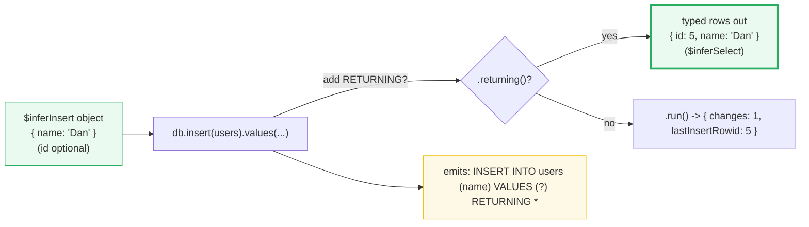

# Mutations: `insert`/`values`, `set`, and `returning`

**Doc Source**: [Drizzle ORM — Insert](https://orm.drizzle.team/docs/insert) · [Update](https://orm.drizzle.team/docs/update) · [Delete](https://orm.drizzle.team/docs/delete)

## The Core Concept: Why This Example Exists

**The Problem:** Writing data is where raw SQL hurts most. An `INSERT` must list the right columns in the right order, bind a parameter for each, and — if you want the row back (to learn the auto-generated id) — fire a second `SELECT` by `lastInsertRowid`. An `UPDATE` is worse: you construct a `SET col1 = ?, col2 = ?` fragment whose shape mirrors the values object, hand-track which columns are nullable, and pray you didn't forget the `WHERE` (a missing `WHERE` updates every row). None of this is type-checked: a column you renamed in the DDL is still referenced by the old name in your SQL string, and the bug is a runtime error or — worse — a silent update of the wrong column.

**The Solution:** Drizzle's mutation builders (`db.insert`, `db.update`, `db.delete`) are the read-side builder's mirror image: they are SQL-shaped, type-checked against the schema, and parameterize every value automatically. The single biggest win is **`.returning()`** — SQLite and PostgreSQL support the `RETURNING` clause natively, so an `INSERT`/`UPDATE`/`DELETE` can hand you back the affected rows *in the same statement*, with no second query. Combined with the inferred types, every mutation is a typed round-trip: you put a typed object in, you get typed rows out, and the compiler checks both ends.

The result is that the four lines below are not just shorter than their raw-SQL equivalents — they are *verifiably correct at compile time*:

```ts
await db.insert(users).values({ name: 'Andrew' });
await db.update(users).set({ name: 'Mr. Dan' }).where(eq(users.name, 'Dan'));
await db.delete(users).where(eq(users.name, 'Dan'));
```

> Source: [Drizzle — Insert, opening](https://orm.drizzle.team/docs/insert); [Update, opening](https://orm.drizzle.team/docs/update).

> 🔗 [`DATABASE_DRIVERS`](../DATABASE_DRIVERS.md) — the curriculum bundle this guide companions. Section C runs the full mutation lifecycle (`insert().values()` → `select()` → `update().set().where().returning()` → `delete().where().returning()`) and verifies each step's typed output. Section B covers the transaction primitive (`db.transaction(fn)` — commit on return, rollback on throw) that wraps multi-step mutations. This guide walks the upstream docs; that bundle runs the code.

## Practical Walkthrough: Code Breakdown

The examples use the canonical `users` table from the Drizzle docs (🔗 [`01-schema-setup.md`](./01-schema-setup.md)):

```ts
export const users = sqliteTable('users', {
  id: integer('id').primaryKey(),
  name: text('name').notNull(),
});
```

### Insert — single row

The docs open with the simplest insert. One row, typed against `$inferInsert`:

```ts
await db.insert(users).values({ name: 'Andrew' });
```

```sql
insert into "users" ("name") values ("Andrew");
```

> Source: [Drizzle — Insert, opening](https://orm.drizzle.team/docs/insert).

Two things to notice:

1. **`id` is omitted.** The schema's `id` is `integer('id').primaryKey()`, which in SQLite aliases the rowid and is auto-assigned. The inferred **insert** type (`typeof users.$inferInsert`) marks `id` as *optional* — you can omit it and let the DB assign it. (The inferred **select** type marks `id` as *required* — every row you read back has one.)
2. **The value is bound, not interpolated.** The emitted SQL has `"Andrew"` as a parameter; an `Andrew'); DROP TABLE users;--` payload is treated as a literal name. Same injection defense as `eq` in 🔗 [`02-select-queries.md`](./02-select-queries.md).

The docs show the explicit insert-type helper for when you want to type a function parameter:

```ts
type NewUser = typeof users.$inferInsert;

const insertUser = async (user: NewUser) => {
  return db.insert(users).values(user);
}

const newUser: NewUser = { name: "Alef" };
await insertUser(newUser);
```

> Source: [Drizzle — Insert, "insert type"](https://orm.drizzle.team/docs/insert).

### Insert — multiple rows

Pass an **array** of objects to insert many rows in one statement (drizzle emits a multi-row `VALUES` list):

```ts
await db.insert(users).values([{ name: 'Andrew' }, { name: 'Dan' }]);
```

> Source: [Drizzle — Insert, "Insert multiple rows"](https://orm.drizzle.team/docs/insert).

Every element is checked against `$inferInsert`. This is one network round-trip (or, on SQLite, one C++ call) for *N* rows — far faster than *N* separate inserts, and the idiomatic way to seed or bulk-load.

### Insert with `.returning()` — the typed round-trip

SQLite and PostgreSQL support `RETURNING` natively (MySQL does not — see the docs' `$returningId` workaround). `.returning()` appends it, and the result is the **typed** inserted row(s):

```ts
await db.insert(users).values({ name: "Dan" }).returning();

// partial return — pick the columns
await db.insert(users).values({ name: "Partial Dan" }).returning({ insertedId: users.id });
```

> Source: [Drizzle — Insert, "returning"](https://orm.drizzle.team/docs/insert#returning).

The full `.returning()` returns the complete row (with the auto-assigned `id` — useful when you need the new id without a second `SELECT`); the partial form `.returning({ insertedId: users.id })` narrows to `{ insertedId: number }[]`. This is the end of the two-step "insert then `SELECT last_insert_rowid()`" dance the raw driver forces (🔗 [`../rust/sqlx/03-sqlite-todos.md`](../rust/sqlx/03-sqlite-todos.md) — sqlx's `last_insert_rowid()` is the same pattern, just spelled differently).

### Update — `.set({...}).where(...)`

The update builder takes a `set` object (the columns to change) and a `where` clause (which rows to change). The docs:

```ts
await db.update(users)
  .set({ name: 'Mr. Dan' })
  .where(eq(users.name, 'Dan'));
```

> Source: [Drizzle — Update, opening](https://orm.drizzle.team/docs/update).

The `set` object's keys must be column names from the schema; the values are type-checked and bound. The docs note two subtleties:

- **`undefined` is ignored, `null` sets the column to NULL.** *"Values of `undefined` are ignored in the object: to set a column to `null`, pass `null`."* This lets you write `set({ name: newName, age: maybeAge })` where `maybeAge` may be `undefined` (no change) or `null` (clear the field).
- **You can pass a SQL expression as a value**, e.g. to bump a timestamp:

```ts
await db.update(users)
  .set({ updatedAt: sql`NOW()` })
  .where(eq(users.name, 'Dan'));
```

### Update with `.returning()` — get the changed rows back

Identical to insert: SQLite and PostgreSQL support `RETURNING` on `UPDATE`. The result is the (post-update) rows:

```ts
const updatedUserId: { updatedId: number }[] = await db.update(users)
  .set({ name: 'Mr. Dan' })
  .where(eq(users.name, 'Dan'))
  .returning({ updatedId: users.id });
```

> Source: [Drizzle — Update, "Returning"](https://orm.drizzle.team/docs/update#returning).

Without `.returning()`, an `UPDATE` returns only `{ changes, lastInsertRowid }` — you know *how many* rows changed but not *which* ones. With it, you get the affected rows typed, in one statement.

### Delete — `.where(...)` and `.returning()`

The delete builder is the update builder minus `.set()`. The docs:

```ts
await db.delete(users)
  .where(eq(users.name, 'John'));
```

> Source: [Drizzle — Delete](https://orm.drizzle.team/docs/delete). The delete page mirrors update's structure; `.returning()` and `.where()` behave identically to update.

And with `.returning()` (SQLite/PostgreSQL), the deleted rows come back — useful for audit logs or for confirming what was removed:

```ts
const removed = await db.delete(users)
  .where(eq(users.name, 'John'))
  .returning();
// removed: { id: number; name: string }[]
```

### The better-sqlite3 sync flavor: `.run()` / `.all()` / `.get()`

As with `select` (🔗 [`02-select-queries.md`](./02-select-queries.md)), the docs show `await` because most drivers are async; **better-sqlite3 is synchronous**. The terminal methods are:

- **`.run()`** → execute; returns `{ changes, lastInsertRowid }`. Use when you don't need the rows back.
- **`.all()`** → execute and return every affected row (requires `.returning()`).
- **`.get()`** → execute and return the first affected row (requires `.returning()`; implicitly `LIMIT 1`).

```ts
// better-sqlite3 sync flavor (no await!)
db.insert(users).values({ name: 'Andrew' }).run();                       // { changes: 1, lastInsertRowid: ... }
const [dan] = db.insert(users).values({ name: 'Dan' }).returning().all(); // typed row
const upd = db.update(users).set({ name: 'Mr. Dan' })
                .where(eq(users.id, 1)).returning().all();                // typed updated rows
const del = db.delete(users).where(eq(users.id, 2)).returning().all();    // typed deleted rows
```

The bundle (🔗 [`DATABASE_DRIVERS`](../DATABASE_DRIVERS.md) Section C) runs exactly this lifecycle and verifies each step's output. A builder chain without a terminal is a silent no-op — the single most common Drizzle pitfall.

### Transactions — wrap multi-step mutations

When a mutation spans multiple statements that must succeed or fail together (debit one account, credit another; create an order and its line items), wrap them in a transaction. On better-sqlite3 this is `sqlite.transaction(fn)` — `BEGIN` on call, `COMMIT` on normal return, `ROLLBACK` on throw (🔗 [`DATABASE_DRIVERS`](../DATABASE_DRIVERS.md) Section B documents and verifies this contract). Drizzle also exposes a `db.transaction(...)` API that wraps the same primitive; the key rule (from the better-sqlite3 docs) is that **transaction functions must be synchronous** on this driver — an `async` function returns at the first `await`, so the transaction would commit before any awaited work ran.

## Mental Model: Thinking in Typed Mutations

**Every mutation is a round-trip with types at both ends.** You put a `$inferInsert`-shaped object in; you get `$inferSelect`-shaped rows out (via `.returning()`). The builder checks the input, parameterizes every value, and — if you ask for `.returning()` — types the output. There is no hand-written SQL, no hand-written interface, no `last_insert_rowid()` + second `SELECT`.



The `.returning()` decision is the architectural fork: without it you get a row-count (fine for fire-and-forget inserts); with it you get the typed rows (necessary when you need the auto-generated id or the post-update state). SQLite's native `RETURNING` makes the typed path a single statement — no second query.

### Pitfalls

- **Missing `WHERE` on update/delete touches every row.** `db.update(users).set({ name: 'X' })` (no `.where`) updates *all* users. The builder does not require a `where` — it is your job to add one. (Same as raw SQL; Drizzle does not protect you here.)
- **`.returning()` is not supported on MySQL.** SQLite and PostgreSQL have native `RETURNING`; MySQL does not. The docs show `$returningId()` as the MySQL-specific workaround that uses `insertId`/`affectedRows`. On better-sqlite3, always use `.returning()`.
- **`undefined` ≠ `null` in `.set({...})`.** `undefined` is ignored (no change); `null` sets the column to NULL. If you want "don't touch this field," pass `undefined` (or omit the key); if you want "clear this field," pass `null`.
- **Forget to terminalize → silent no-op.** `db.insert(users).values({...})` builds a `QueryPromise` and runs nothing. On better-sqlite3, call `.run()` (no return) or `.returning().all()` (rows back). The bundle's Pitfalls table calls this out explicitly.
- **`primaryKey()` columns are optional on insert but required on select.** Don't reuse one hand-written type for both — use `$inferInsert` and `$inferSelect` separately. (🔗 [`01-schema-setup.md`](./01-schema-setup.md).)

### Further Exploration

- **Upsert:** SQLite supports `ON CONFLICT DO NOTHING` / `ON CONFLICT DO UPDATE`. The docs show `db.insert(users).values({ id: 1, name: 'Dan' }).onConflictDoUpdate({ target: users.id, set: { name: 'John' } })` — an insert-or-update in one statement.
- **Insert-from-select:** `db.insert(users).select(db.select({ name: users.name }).from(users).where(...))` — copies rows matching a filter into the same (or another) table, no client-side loop.
- **Transactions:** wrap `db.insert(...)` + `db.update(...)` in `db.transaction(tx => { tx.insert(...); tx.update(...); })` — commit on return, rollback on throw. Combine with the sync better-sqlite3 driver for the simplest correct multi-step write.

### Cross-references

- 🔗 [`DATABASE_DRIVERS`](../DATABASE_DRIVERS.md) — the curriculum bundle. Section C runs the full insert/select/update/delete lifecycle with `.returning()` and verifies the typed rows; Section B documents the `db.transaction(fn)` all-or-nothing primitive that wraps multi-step mutations. This guide is the deep-dive into the mutation builders that bundle uses.
- 🔗 [`02-select-queries.md`](./02-select-queries.md) — the read-side counterpart. The `where(eq(...))` operator and the better-sqlite3 sync terminals (`.all()`/`.get()`/`.run()`) are the same builders; this guide applies them to writes.
- 🔗 [`../rust/sqlx/03-sqlite-todos.md`](../rust/sqlx/03-sqlite-todos.md) — Rust's `sqlx` spells the insert pattern as `query!("INSERT ... VALUES (?)").execute(...).last_insert_rowid()` — a second step to retrieve the id. Drizzle's `.returning()` collapses insert-and-fetch into one statement because SQLite's `RETURNING` clause is exposed directly.
- 🔗 [`../go/SQLX_GORM.md`](../go/SQLX_GORM.md) — Go's `gorm` uses `Create`/`Updates`/`Delete` method chains (heavy ORM, with hooks and auto-migrations); `sqlx` uses `NamedExec("INSERT ...", struct)` (light, you write the SQL). Drizzle's `db.insert().values()` is the TS analog of gorm's `Create` in shape, but without gorm's runtime model machinery — closer to sqlx's philosophy of "you stay close to SQL."
