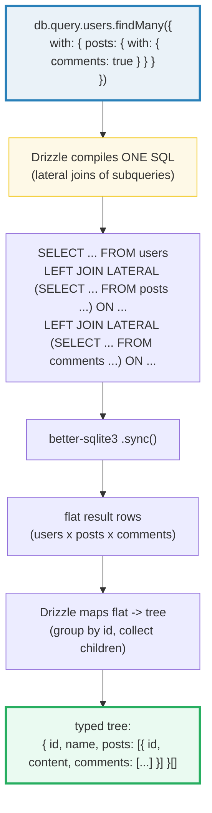

# Relations: Defining + Querying (`with: { posts: true }`)

**Doc Source**: [Drizzle ORM — Relational Queries (RQB)](https://orm.drizzle.team/docs/rqb)

## The Core Concept: Why This Example Exists

**The Problem:** Relational data is a tree, but SQL returns a flat table. If you want "each user with their posts," the SQL answer is a `LEFT JOIN` — but a join returns one row per (user, post) pair, so a user with 3 posts appears 3 times. You then hand-write the "stitch these flat rows back into a tree" code in your application: group by user id, collect the posts into arrays, drop the duplicated user fields. It is mechanical, error-prone, and the same boilerplate in every codebase. Worse, the moment you load the children *per parent* (a loop of `SELECT * FROM posts WHERE author_id = ?`), you have the **N+1 problem**: *N* parents cost *1 + N* queries (🔗 [`DATABASE_DRIVERS`](../DATABASE_DRIVERS.md), Section D — the bundle counts the queries directly: 2 authors → 3 queries under N+1, 1 query under a JOIN).

**The Solution:** Drizzle's **Relational Query API** (`db.query.*`) lets you ask for the tree and get the tree. You declare relations *separately* from the tables (a `relations(table, ({ one, many }) => ({...}))` call that says "this table has-many of that one" or "this table has-one of that one"), pass them in the schema, and then ask:

```ts
const result = await db.query.users.findMany({
  with: {
    posts: true
  },
});
```

— and receive:

```ts
[{
  id: 10,
  name: "Dan",
  posts: [
    { id: 1, content: "SQL is awesome", authorId: 10 },
    { id: 2, content: "But check relational queries", authorId: 10 }
  ]
}]
```

> Source: [Drizzle — Relational Queries, opening example](https://orm.drizzle.team/docs/rqb).

Drizzle emits a **single SQL statement** (using lateral joins of subqueries under the hood) and maps the flat result back into the nested shape for you. No hand-written join plumbing, no row-stitching code, no N+1. The result type is inferred: `posts` is an array on `users` (a `many` relation), and `{ with: { posts: true } }` tells Drizzle to include it. The docs frame it directly: *"Relational queries are meant to provide you with a great developer experience for querying nested relational data from an SQL database, avoiding multiple joins and complex data mappings."*

> 🔗 [`DATABASE_DRIVERS`](../DATABASE_DRIVERS.md) — the curriculum bundle this guide companions. Section D declares `relations(authors, ({ many }) => ({ posts: many(posts) }))`, runs `db.query.authors.findMany({ with: { posts: true } })`, and verifies Ann carries 2 nested posts and Bob carries 1. It then counts the N+1 alternative (3 queries for 2 authors) vs the single JOIN fix. This guide walks the upstream RQB docs; that bundle runs the code.

## Practical Walkthrough: Code Breakdown

### Step 1 — Declare the tables (foreign keys live here)

The relational API sits *on top of* the schema from 🔗 [`01-schema-setup.md`](./01-schema-setup.md). The foreign-key column (`authorId` on `posts`) is declared on the table itself — that is where the actual `REFERENCES` constraint lives:

```ts
import { integer, text, sqliteTable } from 'drizzle-orm/sqlite-core';
import { relations } from 'drizzle-orm';

export const users = sqliteTable('users', {
  id: integer('id').primaryKey(),
  name: text('name').notNull(),
});

export const posts = sqliteTable('posts', {
  id: integer('id').primaryKey(),
  content: text('content').notNull(),
  authorId: integer('author_id').notNull(),
});
```

> Source: [Drizzle — Relational Queries, schema declaration](https://orm.drizzle.team/docs/rqb). (The docs' example uses PostgreSQL's `serial`/`integer`; the SQLite flavor substitutes `integer('id').primaryKey()` — the relation declarations are identical across dialects.)

### Step 2 — Declare the relations (the navigation graph)

**Separately** from the tables, you declare how to navigate between them. This is the key design decision: the foreign-key column (the *constraint*) is on the table; the *relation* (the navigation) is a separate declaration that says "from `users`, you can reach many `posts`" and "from `posts`, you can reach one `author`." The docs:

```ts
export const usersRelations = relations(users, ({ many }) => ({
  posts: many(posts),
}));

export const postsRelations = relations(posts, ({ one }) => ({
  author: one(users, { fields: [posts.authorId], references: [users.id] }),
}));
```

> Source: [Drizzle — Relational Queries, schema declaration](https://orm.drizzle.team/docs/rqb).

Two helpers, one per direction:

- **`many(targetTable)`** — "this table has-many of `targetTable`." No fields/references needed — Drizzle infers the join from the *other side's* `one(...)`. So `usersRelations` just says `posts: many(posts)`; it does not restate the foreign key.
- **`one(targetTable, { fields, references })`** — "this table has-one of `targetTable`, joined on `fields` → `references`." This is where the actual column mapping lives: `fields: [posts.authorId]` (the FK column on this table) → `references: [users.id]` (the PK on the target). One side must declare the mapping; the other side infers it.

This split — table has the constraint, relation has the navigation — lets you declare relations in either direction without touching the table definitions, and lets you model relations that aren't enforced by a DB-level FK (e.g. cross-database, or soft references).

### Step 3 — Pass the schema (tables AND relations) to `drizzle()`

The relational API needs *both* the tables and the relations. Pass them in the `schema` option (🔗 [`01-schema-setup.md`](./01-schema-setup.md), Step 4):

```ts
import * as schema from './schema';
import { drizzle } from 'drizzle-orm/better-sqlite3';

const db = drizzle({ schema });
```

> Source: [Drizzle — Relational Queries, "Querying"](https://orm.drizzle.team/docs/rqb).

Without `schema`, `db.query.*` does not exist (you still have `db.select`/`db.insert`/... — the query builder works with no relations). The relational API is an **opt-in extension** on top of the builder.

### Step 4 — `findMany` / `findFirst` with `with`

Two entry points: `findMany` returns an array; `findFirst` returns one row (implicitly `LIMIT 1`). The `with` clause says which relations to load:

```ts
// all users, each with their posts nested
const users = await db.query.users.findMany({
  with: {
    posts: true,
  },
});

// first post with its comments
const post = await db.query.posts.findFirst({
  with: {
    comments: true,
  },
});
```

> Source: [Drizzle — Relational Queries, "Include relations"](https://orm.drizzle.team/docs/rqb).

`with: { posts: true }` means "load the `posts` relation, all columns." The result type is inferred: each user gains a `posts: Post[]` field; each post (under `findFirst`) gains a `comments: Comment[]` field. The nesting can be arbitrarily deep — `with: { posts: { with: { comments: true } } }` loads users → posts → comments in one call, and Drizzle infers the full tree type.

### Step 5 — Filters, ordering, limit (on parents *and* children)

The relational API accepts the same operators as the builder (`eq`, `lt`, `asc`, `desc`, ...) plus `limit`/`offset`. The docs show two syntaxes — import the operators, or use the callback form (which receives them already in scope):

```ts
import { eq } from 'drizzle-orm';

const users = await db.query.users.findMany({
  where: eq(users.id, 1)
});

// equivalent, callback form (no imports needed)
const users = await db.query.users.findMany({
  where: (users, { eq }) => eq(users.id, 1),
});
```

> Source: [Drizzle — Relational Queries, "Select filters"](https://orm.drizzle.team/docs/rqb).

The filters cascade — a `where` on a nested relation filters *only* that relation's rows, not the parent. Find a post with `id=1` and its comments created before a date:

```ts
await db.query.posts.findMany({
  where: (posts, { eq }) => eq(posts.id, 1),
  with: {
    comments: {
      where: (comments, { lt }) => lt(comments.createdAt, new Date()),
    },
  },
});
```

Limit and offset work on both levels (with one caveat the docs flag):

```ts
await db.query.posts.findMany({
  limit: 5,
  offset: 2, // top-level offset is fine
  with: {
    comments: {
      limit: 3,  // nested limit is fine
      // offset: 3, // ❌ nested offset is NOT available — top-level only
    },
  },
});
```

> Source: [Drizzle — Relational Queries, "Limit & Offset"](https://orm.drizzle.team/docs/rqb). The docs state: *"`offset` is only available for top level query."*

### Step 6 — The better-sqlite3 sync flavor: `.sync()`

The docs show `await db.query.users.findMany(...)` because most drivers are async. On **better-sqlite3**, the relational API returns a `QueryPromise` that you terminalize with **`.sync()`** (not `.all()` — the relational API has its own terminal):

```ts
// better-sqlite3 sync flavor (no await!)
const users = db.query.users.findMany({ with: { posts: true } }).sync();
```

This is the one place the relational API differs from the builder in terminalization: the builder uses `.all()`/`.get()`/`.run()`; the relational API uses `.sync()` (sync drivers) or `await` (async drivers). The bundle (🔗 [`DATABASE_DRIVERS`](../DATABASE_DRIVERS.md) Section D) runs exactly `db.query.authors.findMany({ with: { posts: true } }).sync()` and verifies the nested rows.

## Mental Model: Thinking in Relational Queries

**A relational query is a tree-shaped request that compiles to one SQL statement.** You describe the shape you want (`users` → `posts` → `comments`); Drizzle emits a single SQL (using lateral joins of subqueries) that fetches every level, and maps the flat result rows back into the tree. You never write the join, and you never write the row-stitching code.



The alternative — load parents, then loop `SELECT ... WHERE author_id = ?` per parent — is the **N+1**. For *N* parents that is *1 + N* queries. On SQLite (embedded, in-process) the per-query cost is a C++ function call, so N+1 is slow-but-tolerable; on a client/server DB (Postgres, MySQL) each query is a network round-trip, and N+1 turns a 10ms page into a multi-second one. The relational API is the ergonomic N+1-free path; an explicit `leftJoin` (🔗 [`02-select-queries.md`](./02-select-queries.md)) is the manual one — both result in one query, but the relational API also does the tree-mapping for you.

### one-to-many vs many-to-one

The two directions use the two helpers:

- **`many(target)`** — one parent has *many* children (a user has many posts). The result is an array. Declared on the parent side; infers the join from the child's `one(...)`.
- **`one(target, { fields, references })`** — many children each have *one* parent (each post has one author). The result is a single object (not an array). Declared on the child side; this is where the FK column mapping (`fields: [posts.authorId]`, `references: [users.id]`) is stated.

A one-to-many in one direction is a many-to-one in the other — `users.posts: many(posts)` and `posts.author: one(users, ...)` are the two sides of the same foreign key. Declare both if you want to navigate both ways; declare one if you only need one direction.

### Pitfalls

- **The schema must include *both* tables and relations.** `drizzle({ schema: { users, posts, usersRelations, postsRelations } })`. Pass only the tables and `db.query.*` won't know the relations exist — `with: { posts: true }` will be a type error (and the property won't exist on `db.query.users`).
- **One side must declare `fields`/`references`; the other infers it.** If *both* sides use bare `many(...)` with no `one(...)`, Drizzle cannot determine the join column. Convention: declare `one(...)` on the table that holds the foreign key (`posts.authorId`), and `many(...)` on the referenced table (`users`).
- **`.sync()` (not `.all()`) on the relational API with better-sqlite3.** The builder (`db.select`) uses `.all()`/`.get()`; the relational API (`db.query.*`) uses `.sync()`/`await`. Mixing them up is a common typo.
- **Nested `offset` is not supported.** Only the top-level query accepts `offset`; nested relations accept `limit` but not `offset`. (Documented in the RQB docs.) For deep pagination, paginate at the top level and constrain children with `limit`/`where`.
- **N+1 hides here too.** `findMany({ with: { posts: true } })` is one query. But a *manual* loop — `for (const u of users) { const posts = db.select().from(posts).where(eq(posts.authorId, u.id)).all(); }` — is N+1. The relational API exists precisely to make the one-query path the easy path; reach for it whenever you'd otherwise loop-and-select.

### Further Exploration

- **Partial column select** on relations: `findMany({ columns: { name: true }, with: { posts: { columns: { content: true } } } })` — load only the columns you need at each level (the docs show both `true`/`false` include/exclude semantics).
- **Prepared relational queries** with `placeholder(...)`: `findMany({ where: (u, { eq }) => eq(u.id, placeholder('id')), with: { posts: true } }).prepare()` then `.execute({ id: 1 })` — compile once, run many times with different params.
- **Many-to-many through a join table**: model the join table (e.g. `usersToGroups`) with two `one(...)` relations (one to each side), and each side has a `many(usersToGroups)` that itself `with: { group: true }` to navigate through. The docs' full example (users → usersToGroups → groups) demonstrates this.

### Cross-references

- 🔗 [`DATABASE_DRIVERS`](../DATABASE_DRIVERS.md) — the curriculum bundle. Section D declares the `authors` ↔ `posts` relations, runs `findMany({ with: { posts: true } }).sync()`, verifies the nested rows, and counts the N+1 alternative (3 queries) vs the single-JOIN fix (1 query). This guide is the deep-dive into the relational API that bundle uses.
- 🔗 [`01-schema-setup.md`](./01-schema-setup.md) — the table declarations (`sqliteTable`, `integer`, `text`) the relations sit on top of, and the `drizzle({ client, schema })` call that enables `db.query.*`.
- 🔗 [`02-select-queries.md`](./02-select-queries.md) — the manual alternative to the relational API: `db.select().from(users).leftJoin(posts, eq(users.id, posts.authorId))` returns the flat joined rows; the relational API does the same query *and* the tree-mapping. Reach for the explicit join when you need the flat shape or cross-table aggregations (`groupBy`, `count`).
- 🔗 [`../rust/sqlx/03-sqlite-todos.md`](../rust/sqlx/03-sqlite-todos.md) — Rust's `sqlx` has no equivalent of the relational API: you write the `JOIN` by hand and map the flat rows yourself (or reach for `diesel` or `sea-orm`, the heavy-ORM Rust analogs). Drizzle's `findMany({ with })` is the TS answer to the row-stitching problem sqlx leaves to the user.
- 🔗 [`../go/SQLX_GORM.md`](../go/SQLX_GORM.md) — Go's `gorm.Preload("Posts")` is the direct analog: eager-load a relation in one query to dodge N+1. `sqlx` has no such helper — you write the join and map the rows. Drizzle's relational API occupies gorm's ergonomic niche (tree-shaped eager loading) without gorm's full ORM machinery (identity map, hooks, auto-migrations).
