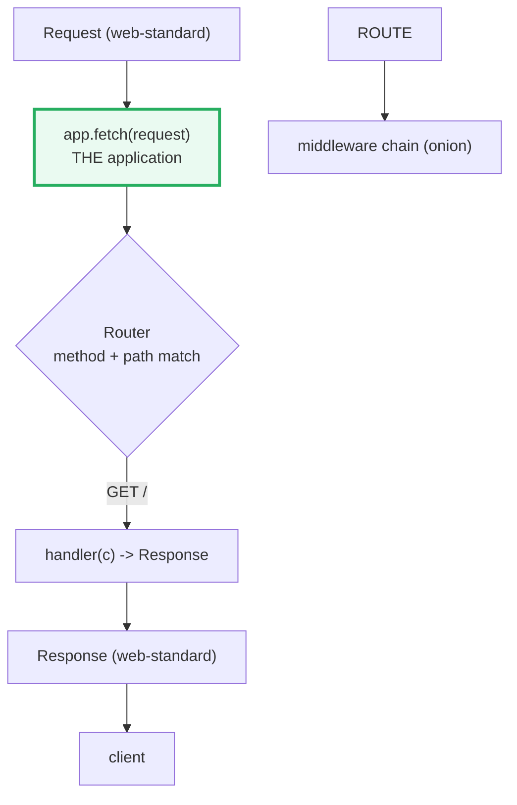

# Hello World: Your First Hono Server

**Doc Source**: [Hono — Getting Started with Node.js](https://hono.dev/docs/getting-started/nodejs)

## The Core Concept: Why This Example Exists

**The Problem:** Every web framework needs to prove it can handle the most fundamental task: accepting an HTTP request and returning a response. But in 2024+ the harder question is *where* that server will run. The old Node-era assumption — "a server is a `http.createServer((req, res) => {})` callback bound to a TCP socket" — does not survive contact with Cloudflare Workers, Bun, or Deno, none of which expose `req`/`res` streams at all. A framework that hard-wires itself to Node's `IncomingMessage`/`ServerResponse` (like Express) is **runtime-locked**: the same app cannot move between runtimes without a rewrite.

**The Solution:** Hono approaches this with a radical bet on the **WHATWG web standards**. A Hono application is, in its entirety, a single function shaped like the Fetch API:

```text
app.fetch: (request: Request, ...) => Response | Promise<Response>
```

`Request` and `Response` here are the **standard** web types (the same ones `globalThis.fetch` uses in the browser). The framework never touches `req`/`res` streams directly. That single decision is what makes Hono **runtime-portable**: on Cloudflare Workers, Bun, and Deno, `app.fetch` *is* the entry point with **no adapter at all**; on Node.js, the tiny `@hono/node-server` package is the adapter that bridges the standard `Request`/`Response` onto `node:http`.

Think of `app.fetch` as a **pure function** — one request in, one response out, no ambient state. Everything else Hono adds (routing, middleware, context, validation) is layered *on top of* that pure contract. Axum (🔗 [`../rust/axum/01-hello-world.md`](../rust/axum/01-hello-world.md)) makes a similar bet on `hyper`'s typed `Request`/`Response`; Go's `net/http` (🔗 [`../go/NET_HTTP.md`](../go/NET_HTTP.md)) uses a `Handler(w http.ResponseWriter, r *http.Request)` that is the *model* Node's `node:http` (🔗 [`NODE_HTTP_SERVER`](../NODE_HTTP_SERVER.md)) approximates.

### Why Hono vs Express?

| | **Express** | **Hono** |
|---|---|---|
| Runtime | Node.js only | Node / Workers / Bun / Deno (web-standard) |
| Request model | Node `req`/`res` streams | Standard `Request` → `Response` |
| Types | Tacked-on (`@types/express`) | Designed type-first (`Hono<{ Bindings, Variables }>`) |
| Era | 2010, callback-era | 2022+, async/await + web streams |

## Practical Walkthrough: Code Breakdown

The official Hono "Hello World" for Node.js is four lines. Here it is, verbatim from the docs:

### Install + the Entry Point

```sh
npm create hono@latest my-app   # select the "nodejs" template
cd my-app && npm i
```

> **Requirement (from the docs):** "It works on Node.js versions greater than 18.x." Concretely, `18.14.1+`, `19.7.0+`, or `20.0.0+` — because the adapter relies on the global `fetch`/web streams that Node gained in 18.

### The Hello World Itself

```ts
import { serve } from '@hono/node-server'
import { Hono } from 'hono'

const app = new Hono()
app.get('/', (c) => c.text('Hello Node.js!'))

serve(app)
```

Four lines, four concepts:

1. **`new Hono()`** — Constructs the application. This object *is* the router + the middleware chain + the `fetch` function. `Hono` takes an optional generic, `Hono<{ Bindings, Variables }>`, that flows type information about per-request values into every handler (covered in 🔗 [`04-middleware.md`](./04-middleware.md) and 🔗 [`03-context-helpers.md`](./03-context-helpers.md)).
2. **`app.get('/', (c) => c.text('Hello Node.js!'))`** — Registers a `GET /` route. The handler receives one argument, `c` — the **Context** object (🔗 [`03-context-helpers.md`](./03-context-helpers.md)). `c.text(...)` builds a standard `Response` with `Content-Type: text/plain`. Note there is no `req`/`res` pair: the Context *is* the request object, and the handler *returns* the response.
3. **`serve(app)`** — The `@hono/node-server` adapter boots a `node:http` server. `serve` accepts either the `app` directly or an options object (below). Under the hood it calls `http.createServer` and dispatches each request through `app.fetch`.
4. **The implicit contract** — `app.fetch` is what the adapter ultimately invokes. That same `app.fetch` is exactly what Workers/Bun/Deno invoke. One codebase, four runtimes.

### Choosing the Port

By default `serve(app)` listens on `3000`. To pick a port, the docs show the options form — note that `fetch: app.fetch` is the explicit hand-off of the web-standard function:

```ts
serve({
  fetch: app.fetch,
  port: 8787,
})
```

This is the shape that *every* runtime uses. On Workers the equivalent is `export default { fetch: app.fetch }`; on Bun it is `export default { port: 8787, fetch: app.fetch }`. The adapter is the only thing that changes.

### Graceful Shutdown

The docs also show the standard signal-handling pattern for Node, which matters for in-flight requests on restart:

```ts
const server = serve(app)

process.on('SIGINT', () => {
  server.close()
  process.exit(0)
})
process.on('SIGTERM', () => {
  server.close((err) => {
    if (err) {
      console.error(err)
      process.exit(1)
    }
    process.exit(0)
  })
})
```

## Mental Model: Thinking in Hono

**The Application as a Pure Function.** The most important thing to internalize is that *a Hono app is a function*. Not a running server — a function. `serve()` (Node) or `export default { fetch }` (Workers) are what *call* that function. Everything — routing, middleware, the Context object — is machinery that runs *inside* `app.fetch` each time it is invoked.



**Why it's designed this way.** The web-standard `Request`/`Response` boundary is the single most consequential decision in Hono. It means:

- **Runtime portability** — the same `app.fetch` runs unchanged on four runtimes; the adapter is the only thing that differs.
- **Testability** — you can call `app.fetch(new Request('http://localhost/'))` directly in a unit test with **no server running**, because it is just a function. (Axum mirrors this: handlers are plain functions you call directly — 🔗 [`../rust/axum/03-extractors-and-responses.md`](../rust/axum/03-extractors-and-responses.md).)
- **Type safety** — `Request`/`Response` are well-typed, and `Hono<{...}>` adds per-handler generics on top.

### Pitfalls

- **Node version.** Below 18.14.1 / 19.7.0 / 20.0.0 the adapter has no global `fetch`/streams to lean on. The docs are explicit about this; don't assume "Node 18" is enough — it's `18.14.1+`.
- **`app.get('/')` vs `app.fetch`.** `app.get('/')` registers a route; `app.fetch` is the function that *dispatches* a request through all routes + middleware. Beginners sometimes expect `app.get` to "start" something — it only registers. `serve()` is what starts listening.
- **Returning vs `res.end()`.** Coming from Express/`node:http`, the muscle memory is `res.send(...)` / `res.end(...)`. In Hono you **return** the response (`return c.text(...)`). A handler that forgets to `return` will yield an empty/undefined response.

### Further Exploration

- Replace `c.text(...)` with `c.json({ message: 'Hello!' })` and inspect the `Content-Type`.
- Call `app.fetch` in-process: `const res = await app.fetch(new Request('http://localhost/')); console.log(await res.text())` — no server, no port, just the function.
- Move the same `app` to Workers (`export default app`) or Bun (`export default { port, fetch: app.fetch }`) to see runtime portability firsthand.

### Cross-references

- 🔗 [`REST_API`](../REST_API.md) — the curriculum bundle that builds a full Hono REST service (router + middleware chain + Context + `app.onError`/`app.notFound`) on Node. This guide is the 4-line seed of that bundle.
- 🔗 [`NODE_HTTP_SERVER`](../NODE_HTTP_SERVER.md) — the raw `(req, res)` callback Hono sits on top of. `@hono/node-server`'s `serve()` ultimately calls `http.createServer` and dispatches each request through `app.fetch`.
- 🔗 [`../rust/axum/01-hello-world.md`](../rust/axum/01-hello-world.md) — Axum's "Hello World". Same shape (a router with one route over an HTTP server), but Axum leans on `hyper` + Tokio and typed extractors rather than the Fetch standard.
- 🔗 [`../go/NET_HTTP.md`](../go/NET_HTTP.md) — Go's `net/http` is the *model* Node's `node:http` approximates: a `Handler` function + a mux. Hono replaces the hand-rolled `switch` on `req.method + req.url` with a real router.
