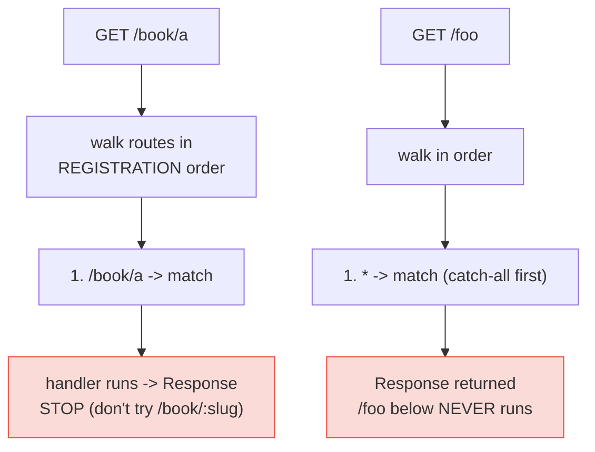

# Routing Patterns: Params, Wildcards, Method Chaining

**Doc Source**: [Hono — Routing](https://hono.dev/docs/api/routing)

## The Core Concept: Why This Example Exists

**The Problem:** At the bare-metal level there is no router. `node:http`'s `createServer((req, res) => {})` hands you a `req.method` and a `req.url`, and you `switch` on them yourself (🔗 [`NODE_HTTP_SERVER`](../NODE_HTTP_SERVER.md) shows this tedium directly). That hand-rolled `switch` has no notion of path parameters (`/users/:id`), no wildcards, no method dispatch, no regex constraints — and it certainly does not give you a typed `id` you can trust. Every framework's first job is to replace that switch with a **router**: a structure that matches `(method, path)` pairs against registered patterns and, on a match, hands the handler a typed view of the matched path.

**The Solution:** Hono ships a **RegExpRouter** / **TrieRouter** that matches method + path with first-class support for parameters, wildcards, optional segments, inline regex, and multi-method/multi-path registration — plus a fluent **chained** API for binding several HTTP methods to one path. Matching is **deterministic by registration order**: handlers and middleware run in the order you register them, and the first handler that produces a response stops the chain.

Think of the router as a **switchboard operator**. You hand it a stack of pattern cards (`GET /users/:id`, `POST /users`, `DELETE /posts/:date{[0-9]+}/:title{[a-z]+}`). When a call comes in, the operator reads the number (method + path), walks the stack top-to-bottom, and connects the call to the first matching card — passing along any digits they filled in (the params). Axum's `Router::new().route("/users/:id", get(handler))` (🔗 [`../rust/axum/02-routes-and-handlers-close-together.md`](../rust/axum/02-routes-and-handlers-close-together.md)) is the closest cross-language analog; Go 1.22's `ServeMux` (`mux.HandleFunc("GET /users/{id}", ...)`) is the same idea in Go (🔗 [`../go/MIDDLEWARE_ROUTING.md`](../go/MIDDLEWARE_ROUTING.md)).

## Practical Walkthrough: Code Breakdown

All snippets below are quoted verbatim from the [Hono Routing docs](https://hono.dev/docs/api/routing).

### Basic: HTTP Methods, Wildcards, `all`, and `on`

```ts
import { Hono } from 'hono'
const app = new Hono()
// ---cut---
// HTTP Methods
app.get('/', (c) => c.text('GET /'))
app.post('/', (c) => c.text('POST /'))
app.put('/', (c) => c.text('PUT /'))
app.delete('/', (c) => c.text('DELETE /'))

// Wildcard
app.get('/wild/*/card', (c) => {
  return c.text('GET /wild/*/card')
})

// Any HTTP methods
app.all('/hello', (c) => c.text('Any Method /hello'))

// Custom HTTP method
app.on('PURGE', '/cache', (c) => c.text('PURGE Method /cache'))

// Multiple Method
app.on(['PUT', 'DELETE'], '/post', (c) =>
  c.text('PUT or DELETE /post')
)

// Multiple Paths
app.on('GET', ['/hello', '/ja/hello', '/en/hello'], (c) =>
  c.text('Hello')
)
```

Key facts:

- **Method helpers** (`app.get/post/put/delete`) are sugar over `app.on(method, path, handler)`.
- **`app.all(path, h)`** matches **every** HTTP method on that path — useful for catch-alls or "anything here must be authenticated".
- **`app.on(method, path, h)`** is the primitive. It accepts a single method string, an **array of methods**, an **array of paths**, or a **custom method** (`'PURGE'`) the helpers don't cover.
- **Wildcards** (`*`) match any single path segment *in that position*: `/wild/*/card` matches `/wild/anything/card` but **not** `/wild/a/b/card`. (Note the `*` is mid-path here, not the trailing `/*` form covered below.)

### Path Parameters

```ts
app.get('/user/:name', async (c) => {
  const name = c.req.param('name')
  //       ^?
  // ...
})
```

Or all parameters at once (destructured, fully typed):

```ts
app.get('/posts/:id/comment/:comment_id', async (c) => {
  const { id, comment_id } = c.req.param()
  //       ^?
  // ...
})
```

- A `:name` segment captures that position into `c.req.param('name')`.
- `c.req.param()` (no arg) returns **all** params as an object — destructured above. The `^?` marker is Hono's docs notation that the type is inferred: `name` is `string`, and `{ id, comment_id }` is `{ id: string; comment_id: string }`. This is the typed param access that hand-routing on `node:http` cannot give you.

### Optional Parameter

```ts
// Will match `/api/animal` and `/api/animal/:type`
app.get('/api/animal/:type?', (c) => c.text('Animal!'))
```

The `?` suffix makes the segment optional — one route covers both the collection and the item. Read `c.req.param('type')` and treat `undefined` accordingly.

### Inline Regexp (and parameters that include slashes)

```ts
app.get('/post/:date{[0-9]+}/:title{[a-z]+}', async (c) => {
  const { date, title } = c.req.param()
  //       ^?
  // ...
})
```

The `{regex}` after a param name constrains it: `:date{[0-9]+}` only matches digits. A path like `/post/abc/x` will **not** match this route.

For "match the rest of the path including slashes", use `.+`:

```ts
app.get('/posts/:filename{.+\\.png}', async (c) => {
  //...
})
```

This is how you capture filenames like `/posts/a/b/c.png` into one `filename` param.

### Chained Route (one path, many methods)

```ts
app
  .get('/endpoint', (c) => {
    return c.text('GET /endpoint')
  })
  .post((c) => {
    return c.text('POST /endpoint')
  })
  .delete((c) => {
    return c.text('DELETE /endpoint')
  })
```

After the first call pins the **path** (`/endpoint`), subsequent `.post()`, `.delete()` etc. omit the path and stack on the same one. This is Hono's equivalent of Axum's `MethodRouter` — binding multiple methods to a single route in one fluent expression.

### Grouping with `app.route()`

```ts
const book = new Hono()

book.get('/', (c) => c.text('List Books')) // GET /book
book.get('/:id', (c) => {
  // GET /book/:id
  const id = c.req.param('id')
  return c.text('Get Book: ' + id)
})
book.post('/', (c) => c.text('Create Book')) // POST /book

const app = new Hono()
app.route('/book', book)
```

`app.route('/book', book)` **mounts** the child app under a prefix. This is the building block for modular apps — each feature (`book`, `user`, `order`) is its own `Hono` instance, merged into the root with `route()`. (Compare Axum's `.merge()` in 🔗 [`../rust/axum/02-routes-and-handlers-close-together.md`](../rust/axum/02-routes-and-handlers-close-together.md).)

`basePath()` lets a child app know its own mount point so it can be authored independently:

```ts
const api = new Hono().basePath('/api')
api.get('/book', (c) => c.text('List Books')) // GET /api/book
```

## Mental Model: Routing Priority (Registration Order)

This is the single most important — and most tripped-over — rule in Hono routing. From the docs:

> "Handlers or middleware will be executed in registration order."

Concretely, **static beats dynamic only because it was registered first**, not because the router special-cases it:

```ts
app.get('/book/a', (c) => c.text('a')) // a
app.get('/book/:slug', (c) => c.text('common')) // common
```

```
GET /book/a ---> `a`
GET /book/b ---> `common`
```

And — crucially — **when a handler runs and produces a response, the process stops**:

```ts
app.get('*', (c) => c.text('common')) // common
app.get('/foo', (c) => c.text('foo')) // foo
```

```
GET /foo ---> `common` // foo will not be dispatched
```

`/foo` never runs because the `'*'` handler registered *above* it already returned a response. This is the pitfall: a catch-all `'*'` placed too high **shadows everything below it**.

The fix is positional. If you want a fallback, register it **below** the specific handlers:

```ts
app.get('/bar', (c) => c.text('bar')) // bar
app.get('*', (c) => c.text('fallback')) // fallback
```

```
GET /bar ---> `bar`
GET /foo ---> `fallback`
```

And if you want middleware to run, register it **above** the handler:

```ts
app.use(logger())
app.get('/foo', (c) => c.text('foo'))
```



### Grouping Ordering Pitfall

The docs flag a subtle `app.route()` ordering bug. `route()` copies the **already-registered** routes from the child into the parent:

```ts
three.get('/hi', (c) => c.text('hi'))
two.route('/three', three)
app.route('/two', two)
```

```
GET /two/three/hi ---> `hi`
```

But if you mount before the child has its routes, you get a silent 404:

```ts
three.get('/hi', (c) => c.text('hi'))
app.route('/two', two) // `two` does not have routes
two.route('/three', three)
```

```
GET /two/three/hi ---> 404 Not Found
```

**Always register child routes *before* mounting the child into its parent.**

### Pitfalls (summary)

- **Catch-all shadowing.** `app.get('*', ...)` placed before specific routes will swallow them. Register catch-alls last.
- **`route()` order.** Mount children only after they have their routes; otherwise the parent copies an empty child.
- **Wildcard segment vs trailing slash.** `/wild/*/card` matches one segment; it won't span multiple. Use `:name{.+}` (regex) to slurp across slashes.
- **Optional `:type?`** yields `undefined`, not a default. Handle the empty case explicitly.

### Further Exploration

- Add a regex-constrained route like `/post/:date{[0-9]+}/:title{[a-z]+}` and probe it with both valid and invalid paths to see non-matches fall through.
- Build a modular app: `const api = new Hono().basePath('/api'); api.route('/users', users); api.route('/books', books); app.route('/', api)`.
- Verify registration order empirically: register `'*'` first then `/foo`, confirm `/foo` is never reached.

### Cross-references

- 🔗 [`NODE_HTTP_SERVER`](../NODE_HTTP_SERVER.md) — the curriculum's hand-rolled routing. There you `switch` on `req.method + req.url` with no params, no wildcards. Hono is what that switch grows up into.
- 🔗 [`REST_API`](../REST_API.md) — uses these routing primitives (`:id` params, `app.route()` grouping, method helpers) to build a full REST resource in the curriculum.
- 🔗 [`../rust/axum/02-routes-and-handlers-close-together.md`](../rust/axum/02-routes-and-handlers-close-together.md) — Axum's `.route("/users", get(h).post(h2))` method chaining and `.merge()` for modular routers. Closest cross-language sibling.
- 🔗 [`../go/MIDDLEWARE_ROUTING.md`](../go/MIDDLEWARE_ROUTING.md) — Go 1.22 `ServeMux` patterns (`GET /users/{id}`) and `{id...}` wildcard trailing. Same model, goroutine-per-request concurrency.
